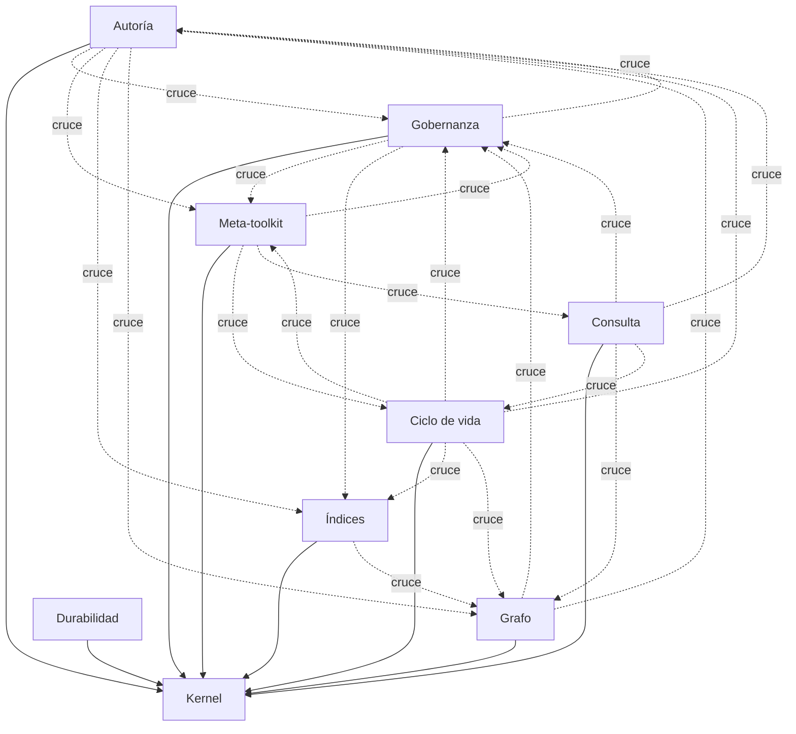

# Arquitectura del estándar — contextos acotados

> Documento derivado. Se genera con `python scripts/vault_arch.py --blueprint`; la fuente es `CONTEXTS` en `scripts/vault_arch.py`. No se edita a mano.

**9 contextos**, **120 módulos** clasificados, **59 fronteras cruzadas** pendientes de publicar puerto.

## Los límites

1. Kernel ← todos. Nadie más puede ser dependencia de todos.
2. Contexto ↛ contexto. Se consume el puerto publicado, no el módulo ajeno.
3. Meta-toolkit ↛ vault. No importa nada que escriba en un vault.
4. Adaptadores ↛ dominio ajeno. `scripts/`, `cli/` y el `.mjs` traducen transporte; no deciden.
5. Raíz de composición: `vault/kernel/adaptadores.py` es el único fichero que puede cruzar a cualquier contexto, porque su trabajo es cablearlos.

## Mapa de contextos

## Kernel

- **Lenguaje ubicuo:** ruta, envelope, error, bloqueo, escritura atómica
- **Puertos publicados:** `atomic_write_text` → `vault_io:atomic_write_text`, `file_lock` → `vault_io:file_lock`, `get_vault_root` → `vault_io:get_vault_root`, `wrap_main` → `vault_errors:wrap_main`
- **No cruza:** depender de cualquier contexto de dominio
- **Módulos (11):** `vault_encoding`, `vault_entorno`, `vault_errors`, `vault_errors_catalog`, `vault_errors_trace`, `vault_io`, `vault_lib`, `vault_log_error`, `vault_regex`, `vault_registry`, `vault_vocabulario`

## Autoría

- **Lenguaje ubicuo:** nota, frontmatter, slug, sección, alias
- **Puertos publicados:** `anexar` → `vault_append:vault_append`, `buscar` → `vault_search:vault_search`, `escribir_nota` → `vault_write:vault_write`, `fusionar` → `vault_merge:vault_merge`, `hablar` → `vault_voice:speak`, `mover` → `vault_move:move_note`, `tipo_por_carpeta` → `vault_write:tipo_por_carpeta`
- **Módulos (38):** `vault_ai_decision`, `vault_append`, `vault_bibliography_save`, `vault_bug_save`, `vault_change_log`, `vault_dataset`, `vault_delta`, `vault_diagram_export`, `vault_diagram_save`, `vault_diff`, `vault_env_save`, `vault_fix_brackets`, `vault_flow_save`, `vault_incident_save`, `vault_infra_save`, `vault_knowledge_get`, `vault_knowledge_save`, `vault_list`, `vault_merge`, `vault_move`, `vault_ncr_save`, `vault_pattern_list`, `vault_pattern_save`, `vault_privacy_save`, `vault_project_overview`, `vault_project_status`, `vault_read`, `vault_release_save`, `vault_requirement_save`, `vault_risk_save`, `vault_runbook_log`, `vault_runbook_save`, `vault_search`, `vault_slo_save`, `vault_test_save`, `vault_timeline`, `vault_voice`, `vault_write`

Fronteras que hoy cruza (22), deuda declarada:

| Módulo | Importa | Contexto destino |
|---|---|---|
| `vault_bug_save` | `vault_norms` | Gobernanza |
| `vault_change_log` | `vault/gobernanza` | Gobernanza |
| `vault_incident_save` | `vault_norms` | Gobernanza |
| `vault_infra_save` | `vault_norms` | Gobernanza |
| `vault_ncr_save` | `vault_norms` | Gobernanza |
| `vault_pattern_save` | `vault_norms` | Gobernanza |
| `vault_privacy_save` | `vault_norms` | Gobernanza |
| `vault_project_status` | `vault_norms` | Gobernanza |
| `vault_release_save` | `vault_norms` | Gobernanza |
| `vault_requirement_save` | `vault_norms` | Gobernanza |
| `vault_risk_save` | `vault_norms` | Gobernanza |
| `vault_slo_save` | `vault_norms` | Gobernanza |
| `vault_test_save` | `vault_norms` | Gobernanza |
| `vault_voice` | `vault_mcp_catalog` | Meta-toolkit |
| `vault_voice` | `vault_norms` | Gobernanza |
| `vault_write` | `vault_mermaid_check` | Gobernanza |
| `vault_write` | `vault_norms` | Gobernanza |
| `vault_write` | `vault_tags` | Índices |
| `vault/autoria/repositorio.py` | `vault/indices` | Índices |
| `vault/autoria/repositorio.py` | `vault/indices` | Índices |
| `vault/autoria/repositorio.py` | `vault/grafo` | Grafo |
| `vault/autoria/repositorio.py` | `vault/indices` | Índices |

## Grafo

- **Lenguaje ubicuo:** nodo, arista, wikilink, huérfano, componente
- **Puertos publicados:** `construir_grafo` → `vault_graph:vault_graph`, `impacto` → `vault_impact:vault_impact`, `resolver_wikilink` → `vault_link_safety:validate_wikilinks`
- **Módulos (15):** `vault_code_map`, `vault_code_module`, `vault_code_query`, `vault_code_relation`, `vault_code_sync`, `vault_code_tag`, `vault_env_matrix`, `vault_graph`, `vault_graph_fix`, `vault_graph_inspect`, `vault_graph_merge`, `vault_impact`, `vault_infra_map`, `vault_link_safety`, `vault_relation_add`

Fronteras que hoy cruza (4), deuda declarada:

| Módulo | Importa | Contexto destino |
|---|---|---|
| `vault_code_tag` | `vault_norms` | Gobernanza |
| `vault_code_tag` | `vault_write` | Autoría |
| `vault_env_matrix` | `vault_norms` | Gobernanza |
| `vault/grafo/repositorio.py` | `vault/gobernanza` | Gobernanza |

## Gobernanza

- **Lenguaje ubicuo:** norma, guard, enforcement, severidad, violación, estado, transición de estado, fundamento, hallazgo
- **Puertos publicados:** `FUNDAMENTOS` → `vault_fundamentals:FUNDAMENTALS`, `NORM_CATALOG` → `vault_norms:NORM_CATALOG`, `auditar` → `vault_audit:vault_audit`, `cuerpo_sin_marcadores` → `vault_norms:cuerpo_sin_marcadores`, `gancho_de_secretos` → `vault_secret_scan:vault_write_hook`, `hay_hallazgos_bloqueantes` → `vault_secret_scan:has_blocking_findings`, `lineas_de_estado` → `vault_norms:status_frontmatter_lines`, `norma_por_codigo` → `vault_norms:norma_por_codigo`, `normalizar_estado` → `vault_norms:normalize_status`, `puntuar_calidad` → `vault_quality_check:vault_quality_check`, `referencias_de_norma` → `vault_norms:compute_norm_refs`, `registro_de_ciclo_de_vida` → `vault_norms:LIFECYCLE_REGISTRY`, `transiciones_de_estado` → `vault_norms:STATUS_TRANSITIONS`, `validar_mermaid` → `vault_mermaid_check:validate_mermaid`, `valores_cia` → `vault_fundamentals:cia_valores`, `vocabulario_de_dominio` → `vault_norms:DOMAIN_STATUS_VOCABS`, `vocabulario_de_estado` → `vault_norms:STATUS_VOCAB`
- **Módulos (9):** `vault_audit`, `vault_drift_detect`, `vault_fundamentals`, `vault_mermaid_check`, `vault_norms`, `vault_quality_check`, `vault_secret_scan`, `vault_security_scan`, `vault_validate`

Fronteras que hoy cruza (6), deuda declarada:

| Módulo | Importa | Contexto destino |
|---|---|---|
| `vault_norms` | `vault_mcp_catalog` | Meta-toolkit |
| `vault_norms` | `vault_reindex` | Índices |
| `vault_norms` | `vault_smoke` | Meta-toolkit |
| `vault_norms` | `vault_tags` | Índices |
| `vault_norms` | `vault_voice` | Autoría |
| `vault/gobernanza/repositorio.py` | `vault/indices` | Índices |

## Índices

- **Lenguaje ubicuo:** índice, etiqueta, término, sección indexada, coherencia
- **Puertos publicados:** `coherencia_de_indices` → `vault_reindex:index_coherence`, `indice_de_seccion` → `vault_section_index:vault_section_index`, `indice_maestro` → `vault_master_index:vault_master_index`, `ledger_de_backfill_de_tags` → `vault_tags:vault_tags_backfill_ledger`, `registrar_tags` → `vault_tags:registrar_tags_de_nota`, `reindexar` → `vault_reindex:vault_reindex`, `tags_de_frontmatter` → `vault_tags:tags_de_frontmatter`, `vocabulario_de_tags` → `vault_tags:canonical_tags`
- **Módulos (6):** `vault_folder_registry`, `vault_index`, `vault_master_index`, `vault_reindex`, `vault_section_index`, `vault_tags`

Fronteras que hoy cruza (1), deuda declarada:

| Módulo | Importa | Contexto destino |
|---|---|---|
| `vault/indices/repositorio.py` | `vault/grafo` | Grafo |

## Consulta

- **Lenguaje ubicuo:** intención, subgrafo, paquete de contexto, preferencia
- **Puertos publicados:** `cargar_contexto` → `vault_mcp_context:load_context`, `contexto_de_sesion` → `vault_mcp_context:get_context`, `empaquetar_contexto` → `vault_context_pack:vault_context_pack`, `guardar_contexto` → `vault_mcp_context:save_context`, `limpiar_contexto` → `vault_mcp_context:clear_context`, `parsear_consulta` → `vault_query_parse:vault_query_parse`, `subgrafo` → `vault_subgraph:vault_subgraph`
- **No cruza:** base de datos; embeddings; servicio externo
- **Módulos (10):** `vault_compact_contracts`, `vault_context_pack`, `vault_ingest`, `vault_mcp_context`, `vault_preferences`, `vault_query_parse`, `vault_subgraph`, `vault_token_counter`, `vault_token_service`, `vault_tokens`

Fronteras que hoy cruza (4), deuda declarada:

| Módulo | Importa | Contexto destino |
|---|---|---|
| `vault_context_pack` | `vault_search` | Autoría |
| `vault_preferences` | `vault_norms` | Gobernanza |
| `vault_subgraph` | `vault/grafo` | Grafo |
| `vault/consulta/repositorio.py` | `vault/ciclo_de_vida` | Ciclo de vida |

## Ciclo de vida

- **Lenguaje ubicuo:** versión, migración, sanación, arranque
- **Puertos publicados:** `CURRENT_VERSION` → `vault_standard_upgrade:CURRENT_VERSION`, `inicializar` → `vault_init:vault_init`, `migrar` → `vault_standard_upgrade:vault_standard_upgrade`
- **Módulos (8):** `vault_init`, `vault_migrate_docs`, `vault_migrate_rollback`, `vault_onboard`, `vault_propagate`, `vault_sanacion`, `vault_sdd_init`, `vault_standard_upgrade`

Fronteras que hoy cruza (15), deuda declarada:

| Módulo | Importa | Contexto destino |
|---|---|---|
| `vault_onboard` | `vault_mermaid_check` | Gobernanza |
| `vault_onboard` | `vault_norms` | Gobernanza |
| `vault_onboard` | `vault_reindex` | Índices |
| `vault_onboard` | `vault_section_index` | Índices |
| `vault_onboard` | `vault_tags` | Índices |
| `vault_onboard` | `vault_write` | Autoría |
| `vault_propagate` | `vault_impact` | Grafo |
| `vault_propagate` | `vault/gobernanza` | Gobernanza |
| `vault_sanacion` | `vault_audit` | Gobernanza |
| `vault_sanacion` | `vault_norms` | Gobernanza |
| `vault_sanacion` | `vault_reindex` | Índices |
| `vault_sdd_init` | `vault_norms` | Gobernanza |
| `vault_standard_upgrade` | `vault_mcp_catalog` | Meta-toolkit |
| `vault_standard_upgrade` | `vault_section_index` | Índices |
| `vault/ciclo_de_vida/repositorio.py` | `vault/indices` | Índices |

## Durabilidad

- **Lenguaje ubicuo:** backup, restauración, cuarentena, manifiesto
- **Puertos publicados:** `crear_backup` → `vault_backup:vault_backup`, `listar_backups` → `vault_backup_list:vault_backup_list`, `poner_en_cuarentena` → `vault_quarantine:vault_quarantine_add`, `restaurar` → `vault_restore:vault_restore`
- **No cruza:** escribir fuera de la raíz del vault (AP-36)
- **Módulos (4):** `vault_backup`, `vault_backup_list`, `vault_quarantine`, `vault_restore`

## Meta-toolkit

- **Lenguaje ubicuo:** catálogo, contrato, spec, smoke, conteo derivado
- **Puertos publicados:** `GROUPS` → `vault_mcp_catalog:GROUPS`, `TOOLS_CATALOG` → `vault_mcp_catalog:TOOLS_CATALOG`, `check_contracts` → `vault_mcp_catalog:check_contracts`
- **No cruza:** escribir en una sección de contenido: sus artefactos derivados viven en 00_System/
- **Módulos (19):** `vault_arch`, `vault_blame_audit`, `vault_changelog_check`, `vault_doc_counts`, `vault_doc_sync`, `vault_error_contract`, `vault_firma_sitio`, `vault_foreign_check`, `vault_gate`, `vault_manifest`, `vault_mcp`, `vault_mcp_catalog`, `vault_noop_audit`, `vault_smoke`, `vault_spec_catalog_check`, `vault_spec_generate_catalog`, `vault_spec_memory`, `vault_spec_validate`, `vault_test_runner`

Fronteras que hoy cruza (7), deuda declarada:

| Módulo | Importa | Contexto destino |
|---|---|---|
| `vault_changelog_check` | `vault_standard_upgrade` | Ciclo de vida |
| `vault_doc_counts` | `vault_norms` | Gobernanza |
| `vault_manifest` | `vault_fundamentals` | Gobernanza |
| `vault_mcp` | `vault_mcp_context` | Consulta |
| `vault_spec_memory` | `vault_fundamentals` | Gobernanza |
| `vault_spec_memory` | `vault/ciclo_de_vida` | Ciclo de vida |
| `vault_spec_memory` | `vault/gobernanza` | Gobernanza |

