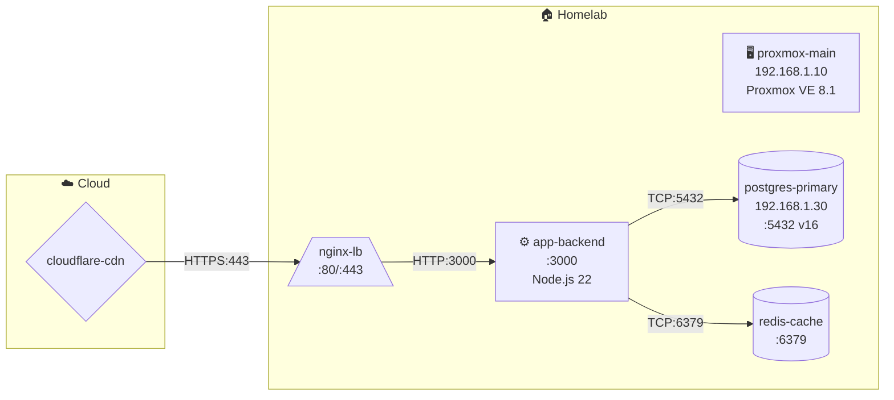

# Vault Obsidian Architecture — Agente LLM con Memoria Documental

**Autor:** Remote Agent / Claude Code  
**Versión:** 5.0 — 2026-05-02  
**Aplicable a:** Cualquier agente LLM con acceso a sistema de archivos (Node.js, Python, Go, Rust)

---

## Por qué existe este documento

Los agentes LLM tienen un problema estructural: **su memoria es efímera**. Cada sesión empieza desde cero aunque el proyecto lleve meses en desarrollo. Esto genera:

- El agente repite errores ya cometidos
- No conoce el estado del proyecto sin que se lo expliquen
- Las decisiones técnicas no tienen trazabilidad
- Los patrones implementados se desconocen en sesiones futuras
- La infraestructura (servidores, bases de datos, proxies) debe re-describirse cada vez
- El conocimiento de dominio y las reglas de negocio se pierden
- Los procedimientos operacionales no se acumulan

El **Vault Obsidian** resuelve esto como patrón técnico puro:

> Vault = carpeta de conocimiento en Markdown + YAML frontmatter + wiki-links + búsqueda + versionado + reglas de acceso vía tools

El agente no necesita Obsidian instalado. Necesita el patrón y las tools.

---

## Principios de diseño

### 1. Markdown + Frontmatter YAML como formato universal
Legible por humanos, indexable por máquinas, compatible con git, abre en cualquier editor. El frontmatter YAML permite filtrado estructurado sin base de datos.

### 2. Wiki-links `[[nota]]` para relaciones
Construyen un grafo de conocimiento navegable. El agente conecta proyectos, decisiones, patrones e infraestructura sin base de datos de grafos.

### 3. Versionado automático con `.history/`
Cada `vault_write` sobre una nota existente copia la versión anterior a `.history/{ruta-plana}-{timestamp}.md`. Permite `vault_diff` sin git.

### 4. Separación por responsabilidad en carpetas numeradas
El prefijo numérico garantiza orden consistente en cualquier explorador y establece precedencia clara de la información.

### 5. Tools como única interfaz (harness pattern)
El agente **nunca** usa `fs.writeFile` directamente para documentación. Solo usa las vault tools. Esto garantiza: frontmatter correcto, versionado, índice actualizado, trazabilidad.

### 6. Auto-context injection
Al inicio de cada turno, `buildMessages()` ejecuta `getVaultAutoContext()` que busca en el índice las notas más relevantes al input del usuario y las inyecta en el system prompt. El vault se convierte en **RAG sin infraestructura de embeddings**.

### 7. Auto-generación de diagramas
`vault_relation_add` regenera el ERD Mermaid del proyecto automáticamente. `vault_infra_save` regenera el mapa de red. El agente solo describe las relaciones; los diagramas se mantienen solos.

### 8. Ciclo de vida de patrones
Los patrones tienen estado evolutivo: `planificado → en_progreso → implementado | deprecado | refactoring`. Cada transición queda registrada con timestamp, permitiendo reconstruir la historia arquitectónica.

---

## Estructura del Vault

```
data/vault/
│
├── 00_System/
│   ├── identity.md           — quién es el agente, capacidades, propósito
│   ├── rules.md              — reglas de comportamiento y límites
│   └── tool-contracts.md     — qué tools existen, qué hacen, cuándo usarlas
│
├── 01_Projects/
│   └── {slug}/
│       ├── overview.md       — descripción ejecutiva, stack técnico
│       ├── architecture.md   — arquitectura técnica detallada
│       ├── status.md         — estado actual, blockers (auto-actualizado por vault_project_status)
│       ├── directives.md     — estándares, convenciones, restricciones del proyecto
│       ├── changelog.md      — historial append-only (auto-actualizado)
│       └── decisions.md      — ADRs específicos del proyecto
│
├── 02_Observability/
│   ├── errors/
│   │   └── {YYYY-MM-DD}-{slug}.md   — error, stack trace, contexto, solución
│   ├── antipatterns/
│   │   └── {slug}.md                — antipatrón, por qué es problemático, alternativa
│   └── vulnerabilities/
│       ├── security-scan-{proyecto}-{fecha}.md  — reporte consolidado de vault_security_scan
│       └── {ruleId}-{slug}-{fecha}.md           — hallazgo individual (crítico/alto) con mitigación
│
├── 03_Decisions/
│   └── {YYYY-MM-DD}-{slug}.md       — ADR: contexto, opciones evaluadas, decisión, consecuencias
│
├── 04_Sessions/
│   └── {YYYY-MM-DD}.md              — log acumulativo diario (auto-gestionado por el harness)
│
├── 05_Patterns/
│   ├── design/
│   │   └── {proyecto}-{patron}.md   — GoF: Singleton, Factory, Observer, Strategy, Proxy...
│   ├── architecture/
│   │   └── {proyecto}-{patron}.md   — MVC, Hexagonal, Event-Driven, CQRS, Microservices...
│   ├── code/
│   │   └── {proyecto}-{patron}.md   — Retry, Circuit-Breaker, Cache-Aside, Saga, Rate-Limit...
│   ├── integration/
│   │   └── {proyecto}-{patron}.md   — REST, GraphQL, Pub-Sub, Webhook, gRPC, Message-Queue...
│   └── {proyecto}-patterns-index.md — índice auto-actualizado de todos los patrones del proyecto
│
├── 06_Diagrams/
│   ├── entity/
│   │   ├── {proyecto}-erd.md         — ERD Mermaid auto-generado por vault_relation_add
│   │   └── {proyecto}-relations.json — relaciones en crudo (fuente de verdad del ERD)
│   ├── component/
│   │   └── {proyecto}-{slug}.md      — diagrama de componentes/módulos
│   ├── sequence/
│   │   └── {proyecto}-{slug}.md      — diagrama de secuencia de flujos
│   └── dependency/
│       └── {proyecto}-{slug}.md      — grafo de dependencias entre módulos/paquetes
│
├── 07_Knowledge/
│   ├── glossary/
│   │   └── {slug}.md                — término de dominio o negocio con su definición completa
│   ├── apis/
│   │   └── {slug}.md                — API externa/interna: endpoints, auth, rate limits, ejemplos
│   ├── concepts/
│   │   └── {slug}.md                — cómo funciona algo técnico en este proyecto específico
│   ├── business-rules/
│   │   └── {slug}.md                — regla de negocio no obvia, con contexto y excepciones
│   └── configs/
│       └── {slug}.md                — configuración importante de herramienta o entorno
│
├── 08_Runbooks/
│   ├── deploy/
│   │   └── {proyecto}-{slug}.md     — procedimiento de despliegue paso a paso
│   ├── debug/
│   │   └── {proyecto}-{slug}.md     — cómo debuggear un tipo específico de problema
│   ├── setup/
│   │   └── {proyecto}-{slug}.md     — instalación y configuración inicial del entorno
│   ├── rollback/
│   │   └── {proyecto}-{slug}.md     — cómo revertir un deploy o migración
│   ├── maintenance/
│   │   └── {proyecto}-{slug}.md     — tareas periódicas de mantenimiento
│   └── incident/
│       └── {proyecto}-{slug}.md     — respuesta a incidentes: pasos de contención y recuperación
│
├── 09_Infrastructure/
│   ├── servers/
│   │   └── {nombre}.md              — servidor físico, VM o VPS: IP, OS, recursos, rol
│   ├── services/
│   │   └── {nombre}.md              — servicio desplegado: puerto, versión, dependencias
│   ├── databases/
│   │   └── {nombre}.md              — BD, cache, cola: tipo, versión, host, esquema
│   ├── network/
│   │   └── {nombre}.md              — nginx, proxy, firewall, VLAN, DNS, CDN
│   ├── containers/
│   │   └── {nombre}.md              — contenedor Docker, LXC, pod Kubernetes
│   ├── .infra-index.json            — índice estructurado de componentes (fuente de verdad del mapa)
│   └── infra-map.md                 — mapa de red Mermaid auto-generado (todas las conexiones)
│
├── 10_Migrated/                     — documentación externa migrada por vault_migrate_docs
│   ├── direct/
│   │   └── {slug}.md                — archivo migrado con relación DIRECTA al proyecto (menciona nombre, módulos, stack)
│   ├── indirect/
│   │   └── {slug}.md                — archivo migrado con relación técnica INDIRECTA (contenido reutilizable)
│   ├── excluded/
│   │   └── {slug}.md                — stub de archivo EXCLUIDO (sin relación ni directa ni indirecta)
│   └── _report-{proyecto}-{fecha}.md — reporte de migración con clasificación completa, tabla de decisiones
│
└── 99_Index/
    ├── search-index.json            — índice full-text (score ponderado: título×4, palabras, preview)
    └── graph.json                   — grafo de nodos y aristas de wiki-links
```

---

## Las 22 Tools del Vault — Referencia Completa

---

### Grupo 1 — Core (escritura, lectura, búsqueda)

---

#### `vault_write(folder, title, content, tags?, meta?)`

Crea o actualiza cualquier nota del vault con frontmatter YAML correcto.

**Parámetros:**
| Parámetro | Tipo | Descripción |
|---|---|---|
| `folder` | string | Ruta relativa al vault root (ej: `"01_Projects/mi-api"`, `"03_Decisions"`) |
| `title` | string | Título de la nota — también determina el nombre del archivo vía slugify |
| `content` | string | Contenido completo en Markdown |
| `tags` | string[] | Tags para búsqueda e indexación |
| `meta` | object | Campos adicionales de frontmatter (ej: `{ status: "en_desarrollo" }`) |

**Comportamiento:**
- Si la nota existe → copia la versión anterior a `.history/` con timestamp antes de sobreescribir
- Genera automáticamente: `id` (UUID), `createdAt`, `updatedAt`
- Actualiza `99_Index/search-index.json` con la nueva nota
- Retorna la ruta relativa creada

**Cuándo usar:** documentación de proyecto, notas de arquitectura, ADRs, runbooks manuales, cualquier nota sin tool específica.

---

#### `vault_read(path)`

Lee una nota por ruta relativa y retorna su contenido estructurado.

**Retorna:**
```json
{
  "meta": { "id": "...", "title": "...", "tags": [...], "status": "...", "updatedAt": "..." },
  "body": "## Contenido en Markdown...",
  "wikiLinks": ["patron-relacionado", "otro-proyecto"],
  "historyVersions": ["01_Projects__mi-api__status-2026-05-01T14-30-00.md"]
}
```

**Cuándo usar:** antes de tomar cualquier decisión técnica, al inicio de trabajo en un proyecto, al consultar un runbook antes de ejecutarlo.

---

#### `vault_append(path, content, section?, timestamped?)`

Agrega contenido a una nota existente sin crear versión histórica (append es no-destructivo).

**Parámetros:**
| Parámetro | Tipo | Default | Descripción |
|---|---|---|---|
| `path` | string | — | Ruta relativa al vault |
| `content` | string | — | Texto a agregar |
| `section` | string | null | Agregar dentro de una sección `## Heading` específica |
| `timestamped` | boolean | true | Si true, agrega `**YYYY-MM-DD HH:MM**` antes del contenido |

**Cuándo usar:** changelog diario, session logs, agregar entradas a decision logs o runbooks sin reescribir todo, registrar nuevos hallazgos en notas existentes.

---

#### `vault_search(query, folder?, tag?)`

Búsqueda full-text ponderada en el vault.

**Algoritmo de score:** `título×4 + coincidencias_en_palabras + coincidencias_en_preview`

**Parámetros:**
| Parámetro | Descripción |
|---|---|
| `query` | Términos a buscar (multiple palabras, separadas por espacio) |
| `folder` | Restringir búsqueda a una carpeta (ej: `"02_Observability"`) |
| `tag` | Filtrar por tag del frontmatter |

**Retorna:** hasta 20 resultados ordenados por score, con preview de 200 chars.

**Cuándo usar (OBLIGATORIO):** siempre antes de crear una nota nueva (evitar duplicados), antes de responder sobre errores conocidos, antes de tomar una decisión ya documentada.

---

#### `vault_list(folder?, status?, limit?)`

Lista notas del vault ordenadas por `updatedAt` descendente.

**Sin `folder`:** retorna la estructura de carpetas raíz con iconos y descripciones.  
**Con `folder`:** retorna las notas de esa carpeta con metadata completa (título, tags, status, preview, fecha).

---

#### `vault_diff(path, version?)`

Compara versión actual vs versión anterior en `.history/`.

**Retorna:** líneas `+` (agregadas) y `-` (eliminadas), lista de todas las versiones históricas disponibles.

**Cuándo usar:** auditoría de cambios en arquitectura, ver qué decidimos diferente, comparar estado anterior vs actual de un proyecto.

---

#### `vault_graph()`

Regenera `99_Index/graph.json` escaneando todos los wiki-links `[[nota]]` del vault.

**Retorna:** nodos (notas), aristas (relaciones), notas huérfanas (sin backlinks), enlaces rotos (apuntan a notas inexistentes).

---

### Grupo 2 — Observabilidad

---

#### `vault_log_error(type, title, description, context, severity?, project?, mitigation?)`

Registra errores, antipatrones, vulnerabilidades y reglas WAF con trazabilidad completa.

**Tipos:**
| type | Subcarpeta | Uso |
|---|---|---|
| `error` | `02_Observability/errors/` | Error de runtime, compilación o lógica |
| `antipattern` | `02_Observability/antipatterns/` | Código o arquitectura problemática detectada |
| `vulnerability` | `02_Observability/vulnerabilities/` | CVE, OWASP, injection, XSS, SSRF, etc. |
| `waf` | `02_Observability/waf/` | Regla de firewall activada, bypass detectado |

**Severidades:** `critical` · `high` · `medium` · `low` · `info`

**Nota importante:** separada de `vault_write` porque los errores tienen ciclo de vida acumulativo — nunca se borran, tienen campos específicos de trazabilidad (severidad, contexto, mitigación), y se registran siempre de forma append, nunca sobreescribiendo.

**Relación con `vault_security_scan`:** `vault_log_error(type:'vulnerability')` se usa para hallazgos individuales detectados manualmente o por revisión de código. `vault_security_scan` es el escáner automatizado que crea el reporte consolidado + notas individuales para hallazgos críticos/altos.

---

#### `vault_project_status(project, status, summary, modified_files?)`

Actualiza `01_Projects/{slug}/status.md` y hace append a `changelog.md`.

**Estados:** `en_desarrollo` · `en_revision` · `bloqueado` · `completado` · `archivado` · `en_produccion`

**Cuándo usar:** al finalizar cualquier sesión de trabajo en un proyecto, cuando el estado cambia, cuando hay blockers nuevos.

---

### Grupo 3 — Patrones

---

#### `vault_pattern_save(project, name, type, status, description, files?, related_patterns?, notes?)`

Registra o actualiza un patrón con su estado evolutivo.

**Tipos de patrón:**
| type | Ejemplos |
|---|---|
| `design` | Singleton, Factory, Observer, Strategy, Decorator, Proxy, Command, Adapter, Facade |
| `architecture` | MVC, Hexagonal, Event-Driven, CQRS, Microservices, Monolith, BFF, Clean Architecture |
| `code` | Retry, Circuit-Breaker, Cache-Aside, Saga, Idempotency, Rate-Limit, Bulkhead |
| `integration` | REST, GraphQL, WebSocket, Pub-Sub, Webhook, gRPC, Message-Queue, Batch |

**Estados y ciclo de vida:**
```
planificado ──→ en_progreso ──→ implementado
                             ├─→ deprecado
                             └─→ refactoring
```

**Comportamiento especial:**
- Si el patrón ya existía con diferente status → registra la transición en `## Evolución` con timestamp
- Crea/actualiza automáticamente `{proyecto}-patterns-index.md` con entrada del patrón
- Los `related_patterns` se convierten en wiki-links `[[patron]]`
- Los `files` quedan documentados como la implementación viva del patrón

**Cuándo usar (OBLIGATORIO):**
- Al escribir código que implementa un patrón → llamar inmediatamente
- Al leer código y reconocer un patrón existente → registrar con `status: "implementado"`
- Al inicio de trabajo en un proyecto → `vault_pattern_list()` primero, luego `vault_pattern_save()` para nuevos
- Cuando un patrón cambia de estado → re-llamar con el nuevo status

---

#### `vault_pattern_list(project?, type?, status?)`

Lista patrones registrados agrupados por estado.

**Respuesta:**
```json
{
  "total": 8,
  "grouped": {
    "implementado": ["Repository", "Factory", "Circuit-Breaker"],
    "en_progreso":  ["Event-Driven"],
    "planificado":  ["CQRS", "Saga"],
    "deprecado":    ["ActiveRecord"]
  },
  "patterns": [{ "path": "...", "pattern": "Repository", "status": "implementado", "updatedAt": "..." }]
}
```

**Cuándo usar:** al iniciar trabajo en un proyecto para conocer el estado del arte arquitectónico sin leer todos los archivos.

---

### Grupo 4 — Diagramas y Cardinalidad

---

#### `vault_diagram_save(project, title, diagram_type, category, content, description?)`

Guarda un diagrama en el vault. Los diagramas Mermaid se renderizan automáticamente en la UI.

**Formatos (`diagram_type`):** `mermaid` · `ascii` · `plantuml`

**Categorías (`category`):**
| Categoría | Subcarpeta | Uso |
|---|---|---|
| `entity` | `06_Diagrams/entity/` | Diagramas ER, relaciones entre entidades de dominio |
| `component` | `06_Diagrams/component/` | Módulos, servicios, capas de la aplicación |
| `sequence` | `06_Diagrams/sequence/` | Flujos de ejecución, llamadas entre servicios |
| `dependency` | `06_Diagrams/dependency/` | Grafo de dependencias entre paquetes o módulos |
| `flow` | `06_Diagrams/flow/` | Flujos generales, decisiones, procesos de negocio |

**Nota:** `content` es solo el código interno del diagrama, sin los backticks. La tool los agrega automáticamente.

---

#### `vault_relation_add(project, from_entity, to_entity, relation_type, cardinality, label?, description?, entity_type?)`

Agrega una relación de cardinalidad o dependencia y **auto-genera el ERD Mermaid del proyecto**.

**Tipos de relación (`relation_type`):**
| relation_type | Semántica | Mermaid |
|---|---|---|
| `has_one` | 1 posee 1 (owner → owned) | `\|\|--\|\|` |
| `has_many` | 1 posee N (owner → many) | `\|\|--o{` |
| `belongs_to` | N pertenece a 1 (child → parent) | `}o--\|\|` |
| `many_to_many` | N a M | `}o--o{` |
| `implements` | clase implementa interfaz | `..>` |
| `extends` | herencia/extensión | `--\|>` |
| `depends_on` | dependencia de módulo | `-->` |
| `uses` | uso sin dependencia dura | `-->` |
| `calls` | invocación service → service | `-->` |
| `owns` | composición fuerte | `*--` |
| `aggregates` | agregación débil | `o--` |

**Tipos de entidad (`entity_type`):**
`database` · `module` · `service` · `class` · `api` · `component`

**Auto-generación del ERD:**
1. Persiste la relación en `06_Diagrams/entity/{proyecto}-relations.json` (fuente de verdad)
2. Detecta si las relaciones son DB-like → usa `erDiagram` Mermaid
3. Si son module/service/class → usa `graph TD` Mermaid con flechas
4. Sobreescribe `{proyecto}-erd.md` con el ERD completo actualizado

**Deduplicación:** no agrega la misma relación (from+to+relation_type) dos veces.

---

### Grupo 5 — Conocimiento de Dominio

---

#### `vault_knowledge_save(category, title, content, project?, tags?, related?)`

Guarda conocimiento acumulado que no encaja en decisiones (ADR) ni en errores.

**Categorías (`category`):**
| Categoría | Subcarpeta | Cuándo usar |
|---|---|---|
| `glossary` | `07_Knowledge/glossary/` | Término de dominio o negocio con definición, sinónimos, contexto de uso |
| `api` | `07_Knowledge/apis/` | Documentación de API: URL base, auth, endpoints, rate limits, errores, ejemplos de request/response |
| `concept` | `07_Knowledge/concepts/` | Cómo funciona algo técnico en **este proyecto específico** (no documentación genérica) |
| `business-rule` | `07_Knowledge/business-rules/` | Regla de negocio no obvia: cuándo aplica, excepciones, quién la definió |
| `config` | `07_Knowledge/configs/` | Configuración importante de herramienta, entorno o servicio |

**Cuándo usar:**
- Al aprender cómo funciona una API externa → `category: "api"` con todos los detalles
- Al descubrir una regla de negocio → `category: "business-rule"` inmediatamente
- Al configurar una herramienta con parámetros no obvios → `category: "config"`
- Al descubrir cómo funciona un mecanismo específico del proyecto → `category: "concept"`

**Diferencia con `vault_write`:** `vault_knowledge_save` fuerza la subcarpeta correcta dentro de `07_Knowledge/` y añade metadata de categoría. `vault_write` es para cualquier nota genérica.

---

#### `vault_knowledge_get(query, category?, project?)`

Busca y recupera conocimiento acumulado. Si hay un match fuerte y único, retorna el contenido completo de la nota automáticamente.

**Auto-read:** si solo hay 1 resultado con score >> resto → retorna `topContent` con el cuerpo completo de la nota.

**Cuándo usar:** antes de preguntarle al usuario algo que el agente debería saber, antes de trabajar con una API documentada, antes de aplicar una regla de negocio.

---

### Grupo 6 — Salud del Vault

---

#### `vault_audit(project?)`

Audita la salud completa del vault y retorna un reporte con score.

**Detecta:**

| Problema | Criterio | Penalización |
|---|---|---|
| **Notas huérfanas** | Sin backlinks entrantes (excepto `00_System/`) | −2 por nota |
| **Notas obsoletas** | No actualizadas en >30 días | −1 por nota |
| **Patrones atascados** | `en_progreso` por >7 días sin actualización | −3 por patrón |
| **Proyectos sin status** | `status.md` no actualizado en >14 días | −5 por proyecto |
| **Links rotos** | Wiki-links `[[X]]` que no apuntan a ninguna nota existente | −2 por link |

**Score:** 100 − penalizaciones (mínimo 0)

**Retorna:**
```json
{
  "healthScore": 87,
  "stats": { "total": 42, "byFolder": { "01_Projects": 8, "05_Patterns": 12, ... } },
  "issues": {
    "orphans":       [{ "path": "...", "title": "...", "daysOld": 15 }],
    "stale":         [...],
    "stuckPatterns": [...],
    "staleProjects": [...],
    "brokenLinks":   [{ "from": "...", "link": "..." }]
  },
  "summary": "Score: 87/100 · 42 notas · 3 huérfanas · 1 link roto"
}
```

**Cuándo usar:** al final de sesiones intensas de trabajo, semanalmente como mantenimiento, cuando se siente que el vault tiene notas desactualizadas.

---

### Grupo 7 — Runbooks Operacionales

---

#### `vault_runbook_save(project, title, trigger, category, steps, estimated_time?, prerequisites?)`

Guarda un procedimiento operacional paso a paso.

**Categorías (`category`):**
| Categoría | Subcarpeta | Ejemplos |
|---|---|---|
| `deploy` | `08_Runbooks/deploy/` | Deploy a producción, hot-reload, blue-green deploy |
| `debug` | `08_Runbooks/debug/` | La app no responde, memory leak, queries lentas |
| `setup` | `08_Runbooks/setup/` | Configurar el entorno de desarrollo, instalar dependencias |
| `rollback` | `08_Runbooks/rollback/` | Revertir deploy, rollback de migración de BD |
| `maintenance` | `08_Runbooks/maintenance/` | Limpiar logs, rotar backups, actualizar certificados |
| `incident` | `08_Runbooks/incident/` | Respuesta a caída de producción, breach de seguridad |

**Parámetro `steps`:** array de objetos con:
- `step` (string, requerido): descripción del paso
- `command` (string, opcional): comando exacto a ejecutar — se renderiza en bloque de código
- `note` (string, opcional): advertencia o contexto importante — se renderiza como `> ⚠️`

**Ejemplo de steps:**
```json
[
  { "step": "Conectarse al servidor via SSH", "command": "ssh deploy@192.168.1.20", "note": "Asegurarse de tener la VPN activa" },
  { "step": "Hacer pull de la última versión", "command": "cd /app && git pull origin main" },
  { "step": "Reiniciar el servicio", "command": "pm2 restart app", "note": "Verificar que no haya requests en vuelo antes" }
]
```

**Comportamiento:** crea la nota con secciones `## Trigger`, `## Prerequisitos`, `## Pasos`, `## Historial de ejecuciones`. Los comandos se formatean en bloques de código bash.

---

#### `vault_runbook_log(path, outcome, notes?, duration?)`

Registra la ejecución de un runbook con su resultado.

**Outcomes:** `success` ✅ · `failed` ❌ · `partial` ⚠️

**Comportamiento:**
- Hace append al `## Historial de ejecuciones` de la nota del runbook
- Incrementa el contador `executions` en el frontmatter
- Cada entrada incluye: icono de outcome, timestamp, duración, notas

**Cuándo usar:** siempre después de ejecutar un procedimiento documentado — builds el historial operacional del equipo.

---

### Grupo 8 — Infraestructura

---

#### `vault_infra_save(name, type, description, config, connections?, location, project?, status?, tags?)`

Registra un componente de infraestructura y auto-actualiza el mapa de red Mermaid.

**Tipos de componente (`type`):**
| type | Subcarpeta | Ejemplos |
|---|---|---|
| `server` | `servers/` | Servidor físico, bare metal, servidor dedicado |
| `vm` | `servers/` | Máquina virtual (Proxmox VM, VMware, KVM) |
| `container` | `containers/` | Contenedor Docker, LXC, pod Kubernetes |
| `service` | `services/` | Aplicación Node.js, API Python, servicio desplegado |
| `database` | `databases/` | MySQL, PostgreSQL, MongoDB, SQLite |
| `queue` | `databases/` | Redis como cola, RabbitMQ, Kafka |
| `storage` | `databases/` | MinIO, NFS, S3, almacenamiento persistente |
| `proxy` | `network/` | nginx como reverse proxy, Traefik, HAProxy |
| `loadbalancer` | `network/` | nginx upstream, AWS ALB, Cloudflare LB |
| `network` | `network/` | VLAN, switch, router, VPN, DNS |
| `firewall` | `network/` | iptables, pfSense, Cloudflare WAF |
| `cdn` | `network/` | Cloudflare, Fastly, AWS CloudFront |

**Parámetro `config`:** objeto libre con los campos técnicos relevantes:
```json
{
  "ip": "192.168.1.10",
  "port": 5432,
  "ports": [80, 443],
  "os": "Debian 12",
  "version": "16.2",
  "cpu": "8 cores",
  "ram": "32 GB",
  "disk": "500 GB SSD",
  "hostname": "db-primary",
  "domain": "api.empresa.com",
  "url": "https://api.empresa.com",
  "auth_method": "certificate",
  "region": "us-east-1",
  "image": "postgres:16-alpine",
  "replicas": 3,
  "vlan": "100"
}
```

**Parámetro `connections`:** array de conexiones salientes:
```json
[
  { "to": "postgres-primary", "protocol": "TCP", "port": 5432, "description": "Queries de aplicación" },
  { "to": "redis-cache",      "protocol": "TCP", "port": 6379, "description": "Sesiones y caché" },
  { "to": "nginx-lb",         "protocol": "HTTP", "port": 80,  "description": "Tráfico interno" }
]
```

**Ubicaciones (`location`):**
`local` · `homelab` · `vps` · `cloud-aws` · `cloud-gcp` · `cloud-azure` · `cloud-other` · `datacenter` · `hybrid`

**Auto-generación del mapa de red:**
1. Persiste el componente en `09_Infrastructure/.infra-index.json`
2. Agrupa todos los componentes por `location` → subgrafos Mermaid
3. Asigna forma de nodo según tipo:
   - Servers/VMs: `🖥️ nombre\nIP\nOS`
   - Databases/Storage/Queues: `cylindro`
   - Proxies/LBs/CDN: `paralelogramo`
   - Firewalls/Networks: `rombo`
   - Services: `⚙️ nombre`
   - Containers: `📦 nombre`
4. Dibuja aristas con protocolo:puerto desde `connections[]`
5. Sobreescribe `09_Infrastructure/infra-map.md`

**Ejemplo de mapa auto-generado:**


**Cuándo usar:** al documentar cualquier servidor, servicio o componente de red por primera vez. Al actualizar configuraciones (IP cambia, versión actualizada, nuevo puerto). Al agregar un nuevo servicio que se conecta a la infraestructura existente.

---

#### `vault_infra_map(project?, location?)`

Regenera el mapa de red Mermaid desde el índice `.infra-index.json`.

**Parámetros opcionales:** filtrar por proyecto o por ubicación para generar mapas parciales.

**Cuándo usar:** si el mapa se desfasó, para generar una vista parcial (solo homelab, solo cloud), al inicio de trabajo en infraestructura para tener el mapa actualizado.

---

### Grupo 9 — Migración de Documentación

---

#### `vault_migrate_docs(source_path, project, keywords?, formats?, dry_run?)`

Migra documentación existente al vault en formato Obsidian-compatible. Classifica cada archivo en tres niveles de relevancia y convierte el contenido a Markdown con frontmatter YAML válido.

**Parámetros:**
| Parámetro | Tipo | Default | Descripción |
|---|---|---|---|
| `source_path` | string | — | Directorio o archivo fuente con la documentación a migrar |
| `project` | string | — | Slug del proyecto activo. Usado para clasificar relevancia y asignar carpeta |
| `keywords` | string[] | `[]` | Palabras clave adicionales del proyecto (stack, módulos, servicios) para mejorar la clasificación |
| `formats` | string[] | `[".md",".txt",".html",".rst",".adoc"]` | Extensiones de archivo a procesar |
| `dry_run` | boolean | `false` | Si `true`, solo clasifica y devuelve el reporte sin escribir en el vault |

**Clasificación de relevancia:**

| Nivel | Criterio | Destino |
|---|---|---|
| **Directo** | El archivo menciona el nombre del proyecto, sus módulos, stack o keywords con frecuencia ≥ 3 ocurrencias | Carpeta específica del proyecto según tipo de contenido |
| **Indirecto** | Contenido técnico genérico reutilizable (≥ 4 términos técnicos) sin referencias directas al proyecto | `10_Migrated/indirect/` |
| **Excluido** | Sin relación técnica ni de dominio con el proyecto | Stub en `10_Migrated/excluded/` con preview truncado |

**Detección automática de carpeta destino según contenido:**

| Señal en contenido | Carpeta destino |
|---|---|
| `readme`, `overview`, `introduction` | `01_Projects/{proyecto}/` |
| `api`, `endpoint`, `swagger`, `route` | `07_Knowledge/apis/` |
| `deploy`, `install`, `setup`, `rollback` | `08_Runbooks/setup/` |
| `architecture`, `pattern`, `design`, `schema` | `05_Patterns/architecture/` |
| `error`, `bug`, `exception`, `fix` | `02_Observability/errors/` |
| `config`, `env`, `variable`, `setting` | `07_Knowledge/configs/` |
| `glossary`, `term`, `definition` | `07_Knowledge/glossary/` |
| excluido | `10_Migrated/excluded/` |

**Conversiones aplicadas para compatibilidad Obsidian:**

| Elemento | Antes | Después |
|---|---|---|
| Links internos | `[texto](archivo.md)` | `[[archivo]]` |
| Imágenes | `` | `![[img.png]]` |
| Frontmatter existente | Cualquier formato | YAML re-generado con `id`, `title`, `type`, `migrated_from`, `relevance`, `project`, `tags` |
| Nombres de archivo | `My Doc File.md`, `README.MD` | `my-doc-file.md` (kebab-case, sin caracteres especiales) |
| HTML | Tags HTML completos | Texto plano normalizado |
| RST / ADoc | Directivas RST | Markdown equivalente |
| Binarios | `*.exe`, `*.png`, etc. | Omitidos con nota en el reporte de errores |

**Flujo recomendado (2 pasos):**
```
1. vault_migrate_docs(source_path, project, dry_run=true)
   → Muestra clasificación al usuario sin escribir nada

2. Usuario confirma → vault_migrate_docs(source_path, project, dry_run=false)
   → Escribe todas las notas + genera _report-{proyecto}-{fecha}.md
```

**Salida del reporte `10_Migrated/_report-{proyecto}-{fecha}.md`:**
- Resumen: total archivos, directos/indirectos/excluidos/errores
- Tabla de archivos directamente relacionados con link a nota migrada
- Tabla de archivos indirectamente relacionados
- Tabla de archivos excluidos con razón de exclusión
- Lista de errores (binarios, permisos, encoding)

**Cuándo usar:**
- Al incorporar documentación legacy al conocimiento del agente
- Al integrar documentación de un proyecto externo al vault
- Para auditar qué documentación existente tiene relevancia real para el proyecto activo
- Antes de archivar un repositorio: migrar su README, docs/ y ADRs al vault

**Skill `vault-migrator`:** skill especializada que ejecuta el protocolo completo con `dry_run` previo + confirmación + `vault_audit` post-migración.

---

### Grupo 10 — Auditoría de Seguridad

---

#### `vault_security_scan(path, project?, depth?, categories?, save_findings?)`

Escanea archivos de código fuente en busca de vulnerabilidades de seguridad con 45 reglas de detección distribuidas en 13 categorías. Guarda todos los hallazgos en el vault automáticamente.

**Parámetros:**
| Parámetro | Tipo | Default | Descripción |
|---|---|---|---|
| `path` | string | — | Ruta del archivo o directorio a escanear |
| `project` | string | `""` | Proyecto al que pertenece el código (para etiquetado en vault) |
| `depth` | integer | `3` | Profundidad de recursión en directorios (1–5) |
| `categories` | string[] | `["all"]` | Categorías a escanear. `["all"]` activa las 13 categorías |
| `save_findings` | boolean | `true` | Guarda hallazgos en vault al finalizar |

**Categorías disponibles:**

| Categoría | Reglas | Qué detecta |
|---|---|---|
| `secrets` | 7 | API keys, passwords, JWT secrets, private keys, tokens de AWS/GitHub/NVIDIA/OpenAI, connection strings con credenciales |
| `injection` | 6 | SQL (concatenación + template literals), NoSQL MongoDB, LDAP, XPath, Server-Side Template Injection |
| `command_injection` | 2 | `exec/spawn` con input de usuario, `shell:true` con variables externas, `eval()` con input externo |
| `xss` | 6 | `innerHTML` sin sanitizar, `document.write`, `res.send` con HTML dinámico, `dangerouslySetInnerHTML`, `javascript:` URIs, `srcdoc` dinámico |
| `auth` | 6 | JWT sin validación de algoritmo (alg:none attack), timing attacks con `==`, rutas sin middleware de auth, cookies sin `httpOnly`/`secure`, CORS wildcard `*`, session fixation |
| `crypto` | 7 | MD5/SHA1 para passwords, `Math.random()` para tokens, DES/RC4/3DES, AES-ECB, IV hardcodeado, `rejectUnauthorized:false`, bcrypt con factor < 10 |
| `path_traversal` | 3 | Input en `readFile/writeFile`, `path.join` sin validar resultado, `__dirname + input` |
| `ssrf` | 3 | URL del usuario en `fetch/axios`, URL construida con input, open redirect sin validación |
| `xxe` | 1 | XML parser sin deshabilitar entidades externas |
| `deserialize` | 2 | `unserialize/deserialize` con input externo, `JSON.parse` sin try/catch |
| `prototype_pollution` | 3 | `Object.assign` con input externo, merge profundo sin sanitizar `__proto__`, acceso directo a `__proto__`/`constructor` |
| `redos` | 1 | `RegExp` construida con input del usuario (backtracking catastrófico) |
| `config` | 7 | Debug activo en producción, stack traces en respuesta HTTP, Express sin `helmet`, `.env` expuesto, HOST/PORT hardcodeado, logs con datos sensibles, sin rate limiting en rutas de auth |
| `dependencies` | 2 | Versiones `*` en `package.json`, `require()` con path dinámico |

**Mapeo OWASP Top 10 (2021):**

| OWASP | Categorías cubiertas |
|---|---|
| A01: Broken Access Control | `path_traversal`, `auth` (rutas sin middleware), `ssrf` (open redirect) |
| A02: Cryptographic Failures | `secrets`, `crypto` |
| A03: Injection | `injection`, `command_injection`, `xss` |
| A05: Security Misconfiguration | `config`, `auth` (CORS, cookies), `xxe` |
| A06: Vulnerable Components | `dependencies` |
| A07: Authentication Failures | `auth`, `crypto` (tokens débiles) |
| A08: Software Integrity Failures | `deserialize`, `prototype_pollution` |
| A09: Security Logging Failures | `config` (logs con datos sensibles) |
| A10: SSRF | `ssrf` |

**Directorios y extensiones ignorados automáticamente:**
- Directorios: `.git/`, `node_modules/`, `.next/`, `dist/`, `build/`, `__pycache__/`, `.venv/`
- Extensiones escaneadas: `.js`, `.mjs`, `.cjs`, `.ts`, `.tsx`, `.jsx`, `.py`, `.php`, `.rb`, `.java`, `.go`, `.rs`, `.cs`, `.env`, `.json`, `.yaml`, `.yml`, `.toml`, `.xml`, `.sh`, `.bash`, `.ps1`, `.html`, `.ejs`, `.hbs`, `.pug`, `.vue`, `.svelte`

**Outputs generados en el vault:**

| Archivo | Ubicación | Contenido |
|---|---|---|
| Reporte consolidado | `02_Observability/vulnerabilities/security-scan-{proyecto}-{fecha}.md` | Resumen ejecutivo, hallazgos por severidad, todos los críticos/altos con código y mitigación, medios/bajos como lista |
| Nota individual | `02_Observability/vulnerabilities/{ruleId}-{slug}-{fecha}.md` | Por cada hallazgo crítico/alto: archivo:línea, snippet de código (secrets redactados), OWASP, CWE, mitigación específica |
| Resumen ejecutivo | `03_Decisions/security-audit-{fecha}.md` | Risk score, top 5 hallazgos por impacto, plan de remediación priorizado (generado por la skill) |

**Secretos protegidos en outputs:** los valores de secretos detectados se redactan como `[REDACTED]` en los snippets del vault. Nunca se almacena el valor real del secreto.

**Retorna:**
```json
{
  "ok": true,
  "riskLevel": "CRÍTICO",
  "filesScanned": 23,
  "totalFindings": 12,
  "bySeverity": { "critical": 2, "high": 4, "medium": 5, "low": 1 },
  "byCategory": { "secrets": 3, "auth": 2, "injection": 2, "config": 3, "crypto": 2 },
  "findings": [
    {
      "ruleId": "S001", "severity": "critical", "category": "secrets",
      "name": "API key hardcodeada",
      "file": "src/config.js", "line": 14,
      "snippet": "const API_KEY = '[REDACTED]'",
      "owasp": "A02:2021", "cwe": "CWE-798"
    }
  ],
  "savedToVault": ["02_Observability/vulnerabilities/security-scan-mi-api-2026-05-02.md", "..."],
  "summary": "23 archivos escaneados — 12 hallazgos (2 críticos, 4 altos, 5 medios, 1 bajo) — Riesgo: CRÍTICO"
}
```

**Cuándo usar:**
- Al comenzar a trabajar en un proyecto por primera vez
- Antes de hacer code review o merge de cambios sensibles
- Al incorporar código de terceros o librerías externas
- Periódicamente como mantenimiento de seguridad

**Regla clave para la skill:** un falso positivo (reportar algo que no es vulnerabilidad) es **preferible** a un falso negativo (omitir una vulnerabilidad real). Ante la duda → reportar con severidad conservadora.

**Skill `security-auditor`:** skill especializada que ejecuta el protocolo completo: `vault_security_scan` → revisión manual de archivos críticos → `vault_log_error` para hallazgos adicionales → resumen ejecutivo con plan de remediación → `npm audit` si hay `package.json`.

---

## Compatibilidad con Obsidian Desktop

El vault en `data/vault/` puede abrirse **directamente** en Obsidian desktop:

1. En Obsidian: `Open folder as vault` → seleccionar `data/vault/`
2. Obsidian reconoce automáticamente:
   - Frontmatter YAML entre `---` delimitadores
   - Wiki-links `[[nota]]` y backlinks automáticos
   - Imágenes `![[imagen.png]]`
   - Bloques Mermaid renderizados (con plugin Mermaid activado)
   - Estructura de carpetas como árbol de navegación
   - El grafo de conocimiento en `99_Index/graph.json`

**Carpetas visibles en Obsidian:**

| Carpeta | Propósito en Obsidian |
|---|---|
| `00_System` | Identidad y reglas del agente |
| `01_Projects` | Un subfolder por proyecto, navegable |
| `02_Observability` | Historial de errores, antipatrones, trazas |
| `03_Decisions` | ADRs navegables con wiki-links |
| `04_Sessions` | Logs de sesión por día |
| `05_Patterns` | Patrones con estado evolutivo en metadatos |
| `06_Diagrams` | Diagramas Mermaid renderizados |
| `07_Knowledge` | Glosario, APIs, reglas de negocio |
| `08_Runbooks` | Procedimientos operacionales |
| `09_Infrastructure` | Mapa de red y servidores |
| `10_Migrated` | Documentación externa migrada y clasificada |
| `02_Observability/vulnerabilities` | Hallazgos de seguridad con OWASP/CWE, código y mitigación |

**Plugins de Obsidian recomendados:**
- **Mermaid** (built-in desde v1.0): renderiza los ERDs e infra-maps
- **Dataview**: consultas sobre el frontmatter YAML (ej: todas las notas con `type: error` del último mes)
- **Graph view**: visualiza los wiki-links como grafo de conocimiento
- **Calendar**: navega los `04_Sessions/` por fecha

---

## Auto-features del Harness

### Auto-context injection (nuevo en v3)
En `buildMessages()`, antes de cada llamada al LLM:
```
1. Toma el último mensaje del usuario
2. Filtra stop-words en español e inglés
3. Busca en search-index.json con score ponderado (título×4, palabras, preview)
4. Inyecta top 4 notas relevantes (score ≥ 2) en el system prompt
5. El agente ve el contexto auto-cargado y puede hacer vault_read() para leer el completo
```
Esto convierte el vault en **RAG sin embeddings**: el contexto relevante aparece automáticamente sin que el agente necesite recordar buscar.

### Auto-session logging
Al inicio de cada turno → `vaultAppendSessionEntry("[inicio] {input}")`.  
Al finalizar → `vaultAppendSessionEntry("[fin] pasos:{n} razón:{motivo}")`.  
Crea `04_Sessions/YYYY-MM-DD.md` si no existe.

### Versionado automático en vault_write
```
Si nota.md existe → copia a .history/{ruta__plana}-{YYYY-MM-DDTHH-mm-ss}.md → sobreescribe nota.md
```

### ERD auto-generado en vault_relation_add
```
vault_relation_add() →
  1. Carga {proyecto}-relations.json, agrega relación (dedup)
  2. Detecta si DB-like → erDiagram | si module/service → graph TD
  3. Sobreescribe {proyecto}-erd.md con Mermaid completo actualizado
```

### Mapa infra auto-generado en vault_infra_save
```
vault_infra_save() →
  1. Persiste en .infra-index.json
  2. Agrupa por location → subgraphs Mermaid
  3. Asigna formas de nodo por type
  4. Dibuja aristas desde connections[]
  5. Sobreescribe infra-map.md
```

### Índice de patrones auto-actualizado en vault_pattern_save
```
vault_pattern_save() →
  1. Escribe/actualiza 05_Patterns/{type}/{proyecto}-{patron}.md
  2. Si status cambió → registra transición en ## Evolución con timestamp
  3. Append a {proyecto}-patterns-index.md con entrada de estado
```

### Mermaid rendering en UI
La UI del vault incluye `mermaid.js` (CDN). Al abrir una nota, el viewer detecta bloques ` ```mermaid ` y llama `mermaid.render()` para mostrarlos como SVG inline. Aplica a: ERDs, mapas de infra, diagramas de componentes, grafos de dependencias, diagramas de secuencia.

---

## Niveles de implementación

| Nivel | Dependencias | Capacidades |
|---|---|---|
| **MVP v5** (este doc) | Zero — solo `node:fs`, `node:path`, `node:crypto` | 22 tools, auto-context injection, ERD + infra auto-map, Mermaid en UI, escáner de seguridad OWASP |
| **Búsqueda semántica** | `minisearch` o `lunr` | TF-IDF ponderado en lugar de word-count |
| **Frontmatter robusto** | `gray-matter` | Parsing correcto de YAML complejo |
| **RAG real** | embeddings + pgvector o hnswlib | Búsqueda semántica por similitud vectorial |
| **Integración Obsidian** | URI scheme `obsidian://` | Abrir vault en Obsidian, sincronizar plugins |
| **Multi-agente** | vault compartido en red | Múltiples agentes con vault centralizado |

---

## Casos de uso concretos

### "¿En qué estado está el proyecto X?"
```
auto-context → inyecta 01_Projects/x/status.md
agente → vault_read("01_Projects/x/status.md")
       → responde con estado, blockers, última modificación
```

### "¿Hemos visto este error antes?"
```
auto-context → inyecta nota de error similar si existe
agente → vault_search("TypeError: Cannot read properties")
       → encuentra 02_Observability/errors/2026-04-15-null-ref.md
       → responde con la solución ya documentada
```

### "¿Cómo está montado el servidor Proxmox?"
```
auto-context → inyecta 09_Infrastructure/servers/proxmox-main.md
agente → vault_read("09_Infrastructure/servers/proxmox-main.md")
       → responde con IP, OS, VMs corriendo, recursos, conexiones
       → también muestra infra-map.md con el diagrama completo
```

### "¿Cómo hago deploy?"
```
auto-context → inyecta 08_Runbooks/deploy/proyecto-deploy.md
agente → vault_read() para leer el runbook completo
       → ejecuta los pasos
       → vault_runbook_log(path, "success", "todo ok", "6 min")
```

### "¿Qué patrones tenemos implementados?"
```
agente → vault_pattern_list(project="mi-api")
       → { implementado: ["Repository","Factory"], en_progreso: ["CQRS"] }
       → responde con estado del arte arquitectónico
```

### "Agrega nginx como reverse proxy al mapa de infra"
```
agente → vault_infra_save(
  name: "nginx-lb",
  type: "proxy",
  config: { ip: "192.168.1.5", ports: [80, 443], version: "1.25" },
  connections: [{ to: "app-backend", protocol: "HTTP", port: 3000 }],
  location: "homelab"
)
→ actualiza .infra-index.json + regenera infra-map.md con nginx en el grafo
```

### "¿Cuándo pasamos a implementar Event-Driven?"
```
agente → vault_read("05_Patterns/architecture/mi-api-event-driven.md")
       → sección ## Evolución muestra: planificado (2026-03-01) → en_progreso (2026-04-10) → implementado (2026-04-28)
```

### "Audita la seguridad del proyecto"
```
skill: security-auditor
agente → vault_security_scan(path="src/", project="mi-api", categories=["all"])
       → 23 archivos escaneados, 12 hallazgos (2 críticos: S001 API key hardcodeada en config.js:14, I007 command injection en scripts/deploy.js:88)
       → vault_log_error(type='vulnerability', title='JWT sin validación de algoritmo', severity='high')  ← hallazgo manual adicional
       → cmd_exec("npm audit --json") → 3 dependencias vulnerables
       → vault_write("03_Decisions/security-audit-2026-05-02.md", "Resumen: RIESGO CRÍTICO...")
       → task_complete("12 hallazgos registrados en vault, risk level CRÍTICO, plan de remediación generado")
```

### "¿Tenemos algún hallazgo de SQL injection?"
```
agente → vault_search("SQL injection", folder="02_Observability/vulnerabilities")
       → encuentra 02_Observability/vulnerabilities/I001-sql-injection-concatenacion-2026-05-02.md
       → responde con ubicación (src/users.js:42), mitigación recomendada, fecha de detección
```

---

## Por qué este diseño vs alternativas

| Alternativa | Por qué no |
|---|---|
| Solo `memory_save` (key-value) | Sin estructura, sin búsqueda, sin relaciones, sin historial, sin diagramas |
| Base de datos SQL | Overhead de setup, no legible por humanos, no abre en editores, requiere ORM |
| Git como versionado | Requiere commits manuales, no integrable en el loop del agente |
| Notion/Confluence API | Dependencia externa, requiere internet, latencia, vendor lock-in |
| SQLite FTS | Buena búsqueda pero no legible directamente, no renderizable como Mermaid |
| JSON files por proyecto | Sin estructura de conocimiento, sin wiki-links, sin diagramas auto-generados |
| GraphDB (Neo4j) | Overhead masivo; el grafo con wiki-links es suficiente para este escala |
| Vector DB | Costoso en recursos; el score ponderado por palabras es suficiente para <10K notas |
| Obsidian plugins | Solo funciona en Obsidian, no en el loop del agente |

**Markdown + carpetas numeradas + 22 tools especializadas** es el punto óptimo para agentes LLM:
- Zero dependencias externas
- Legible por humanos en cualquier editor
- Compatible con Obsidian si el usuario quiere abrirlo visualmente
- Versionable con git si el proyecto lo usa
- Acceso controlado vía tools (harness pattern — nunca `fs.writeFile` directo)
- Los diagramas ERD e infra se mantienen solos (auto-generados)
- El contexto relevante se inyecta automáticamente (RAG sin embeddings)
- Escala de 1 proyecto a 100 sin cambiar la arquitectura

---

*v1 · 2026-05-01 — vault core (9 tools: write, read, append, search, list, log_error, project_status, diff, graph)*  
*v2 · 2026-05-01 — patrones y diagramas (+ 4 tools: pattern_save, pattern_list, diagram_save, relation_add)*  
*v3 · 2026-05-01 — knowledge, runbooks, infraestructura, auto-context injection (+ 7 tools: knowledge_save, knowledge_get, audit, runbook_save, runbook_log, infra_save, infra_map)*  
*v4 · 2026-05-02 — migración de documentación, compatibilidad Obsidian desktop (+ 1 tool: migrate_docs; + 1 skill: vault-migrator; + carpeta 10_Migrated con clasificación directa/indirecta/excluida)*  
*v5 · 2026-05-02 — auditoría de seguridad (+ 1 tool: vault_security_scan con 45 reglas en 13 categorías, cobertura OWASP Top 10 completa; + 1 skill: security-auditor; getMitigation() con mitigaciones específicas por regla)*
