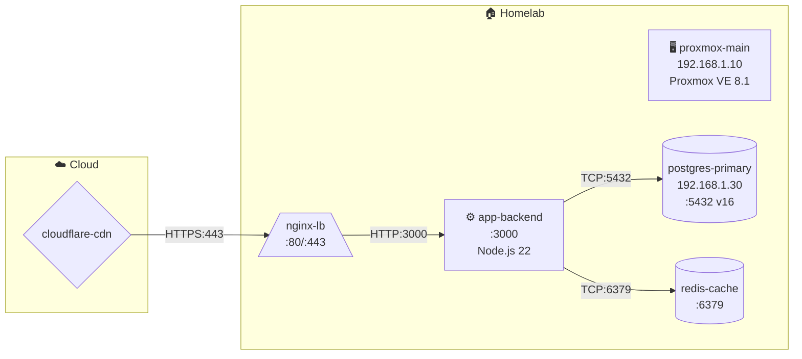
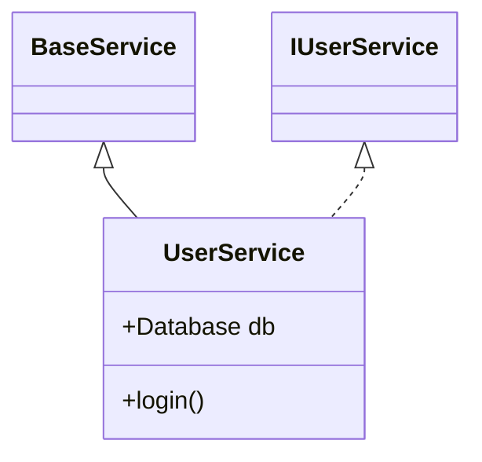
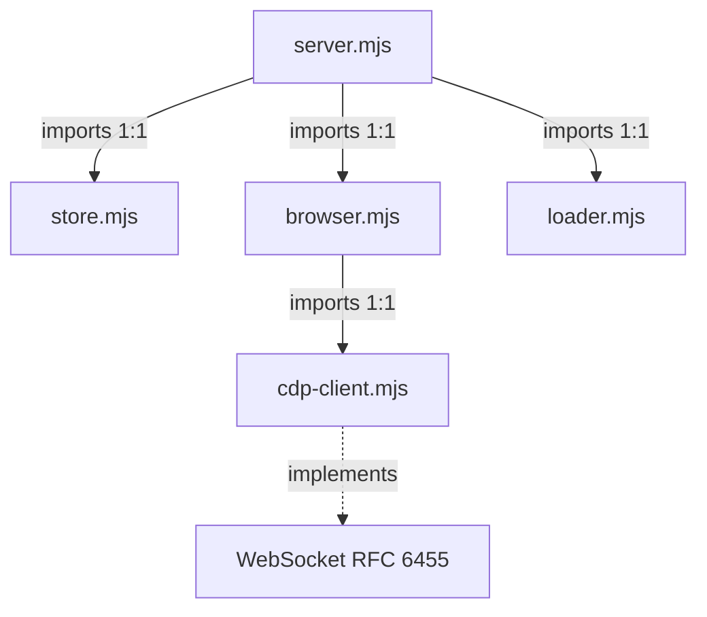
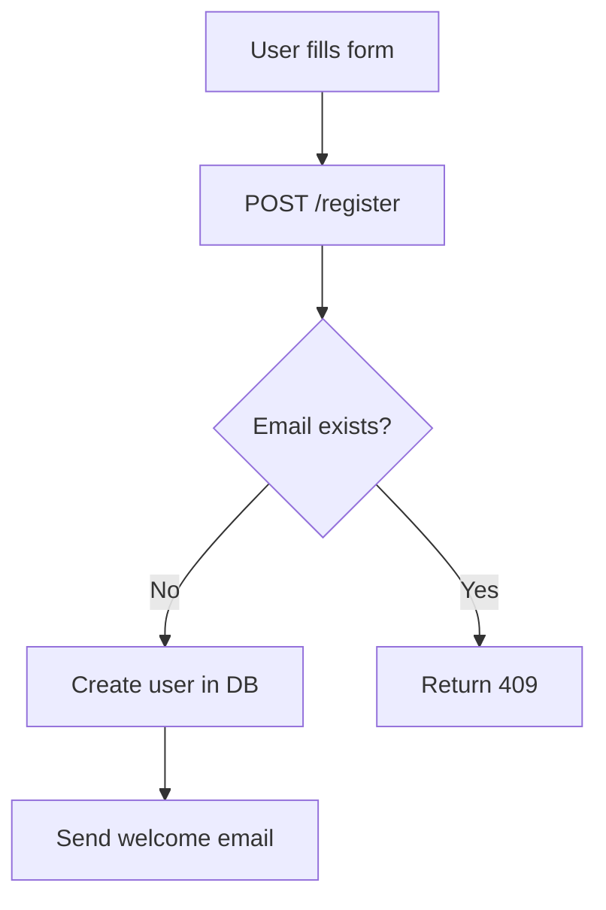

# Vault Obsidian Architecture — Agente LLM con Memoria Documental

**Autor:** CARLOS IVAN CM  
**Versión:** v29 — 2026-05-27  
**Aplicable a:** Cualquier agente LLM con acceso a sistema de archivos (Node.js, Python, Go, Rust)

---

## Por qué existe este documento

Los agentes LLM tienen un problema estructural: **su memoria es efímera**. Cada sesión empieza desde cero aunque el proyecto lleve meses en desarrollo. Esto genera:

- El agente repite errores ya cometidos
- No conoce el estado del proyecto sin que se lo expliquen
- Las decisiones técnicas no tienen trazabilidad
- Los patrones implementados se desconocen en sesiones futuras
- La infraestructura (servidores, bases de datos, proxies) debe re-describirse cada vez
- El conocimiento de dominio y las reglas de negocio se pierden
- Los procedimientos operacionales no se acumulan

El **Vault Obsidian** resuelve esto como patrón técnico puro:

> Vault = carpeta de conocimiento en Markdown + YAML frontmatter + wiki-links + búsqueda + versionado + reglas de acceso vía tools

El agente no necesita Obsidian instalado. Necesita el patrón y las tools.

---

## Principios de diseño

### 1. Markdown + Frontmatter YAML como formato universal
Legible por humanos, indexable por máquinas, compatible con git, abre en cualquier editor. El frontmatter YAML permite filtrado estructurado sin base de datos.

### 2. Wiki-links `[[nota]]` para relaciones
Construyen un grafo de conocimiento navegable. El agente conecta proyectos, decisiones, patrones e infraestructura sin base de datos de grafos.

### 3. Versionado automático con `.history/`
Cada `vault_write` sobre una nota existente copia la versión anterior a `.history/{ruta__plana}-{YYYY-MM-DDTHH-mm-ss}.md` (separadores de directorio reemplazados por `__`). Permite `vault_diff` sin git.

### 4. Separación por responsabilidad en carpetas numeradas
El prefijo numérico garantiza orden consistente en cualquier explorador y establece precedencia clara de la información.

### 5. Tools como única interfaz (harness pattern)
El agente **nunca** usa `fs.writeFile` directamente para documentación. Solo usa las vault tools. Esto garantiza: frontmatter correcto, versionado, índice actualizado, trazabilidad.

### 6. Auto-context injection
Al inicio de cada turno, `buildMessages()` ejecuta `getVaultAutoContext()` que busca en el índice las notas más relevantes al input del usuario y las inyecta en el system prompt. El vault se convierte en **RAG sin infraestructura de embeddings**.

### 7. Auto-generación de diagramas
`vault_relation_add` regenera el ERD Mermaid del proyecto automáticamente. `vault_infra_save` regenera el mapa de red. El agente solo describe las relaciones; los diagramas se mantienen solos.

### 8. Ciclo de vida de patrones
Los patrones tienen estado evolutivo: `planificado → en_progreso → implementado | deprecado | refactoring`. Cada transición queda registrada con timestamp, permitiendo reconstruir la historia arquitectónica.

---

## Estructura del Vault

**Convención de nombre:** el directorio raíz del vault debe llamarse `vault-{nombre}` donde `{nombre}` es el slug del proyecto o contexto (ej: `vault-mi-proyecto`, `vault-ans`, `vault-homelab`). Este prefijo permite identificar vaults a simple vista en cualquier explorador de archivos y distinguirlos del directorio de backups hermano.

> **Regla para el agente:** al crear un vault nuevo, SIEMPRE usar el prefijo `vault-` en el nombre del directorio. Nunca crear el vault en un directorio sin este prefijo.

```
vault-{nombre}/          ← raíz del vault (SIEMPRE con prefijo vault-)
├── 00_System/
├── identity.md              — quién es el agente, capacidades, propósito
├── rules.md                 — reglas de comportamiento y límites
├── tool-contracts.md        — qué tools existen, qué hacen, cuándo usarlas
└── backups/
    └── {tipo}-{YYYY-MM-DD}-{slug}.md  — registro de backup ejecutado (vault, db, archivos)

01_Projects/
│   └── {slug}/
│       ├── overview.md       — descripción ejecutiva, stack técnico
│       ├── architecture.md   — arquitectura técnica detallada
│       ├── status.md         — estado actual, blockers (auto-actualizado por vault_project_status)
│       ├── directives.md     — estándares, convenciones, restricciones del proyecto
│       ├── changelog.md      — historial append-only (auto-actualizado)
│       ├── decisions.md      — ADRs específicos del proyecto
│       └── envs.md           — variables de entorno por ambiente (dev/staging/prod): nombre, propósito, sensible, dónde se configura — nunca los valores reales
│
├── 02_Observability/
│   ├── errors/
│   │   └── {YYYY-MM-DD}-{slug}.md   — error, stack trace, contexto, solución
│   ├── antipatterns/
│   │   └── {slug}.md                — antipatrón, por qué es problemático, alternativa
│   ├── vulnerabilities/
│   │   ├── security-scan-{proyecto}-{fecha}.md  — reporte consolidado de vault_security_scan
│   │   └── {ruleId}-{slug}-{fecha}.md           — hallazgo individual (crítico/alto) con mitigación
│   ├── waf/
│   │   └── {proyecto}-{slug}.md     — regla de firewall activada, bypass detectado, contexto de la amenaza
│   ├── metrics/
│   │   └── {proyecto}-{slug}.md     — SLI/KPI: qué se mide, servicio, valor objetivo, unidad, herramienta de recolección
│   ├── alerts/
│   │   └── {proyecto}-{slug}.md     — regla de alerta: condición, umbral, canal de notificación, link al runbook de respuesta
│   └── slos/
│       └── {proyecto}-{slug}.md     — SLO: indicador medido (SLI), objetivo (%), ventana de tiempo, política de burn rate
│
├── 03_Decisions/
│   └── {YYYY-MM-DD}-{slug}.md       — ADR: contexto, opciones evaluadas, decisión, consecuencias
│
├── 04_Sessions/
│   └── {YYYY-MM-DD}.md              — log acumulativo diario (auto-gestionado por el harness)
│
├── 05_Patterns/
│   ├── design/
│   │   └── {proyecto}-{patron}.md   — GoF: Singleton, Factory, Observer, Strategy, Proxy...
│   ├── architecture/
│   │   └── {proyecto}-{patron}.md   — MVC, Hexagonal, Event-Driven, CQRS, Microservices...
│   ├── code/
│   │   └── {proyecto}-{patron}.md   — Retry, Circuit-Breaker, Cache-Aside, Saga, Rate-Limit...
│   ├── integration/
│   │   └── {proyecto}-{patron}.md   — REST, GraphQL, Pub-Sub, Webhook, gRPC, Message-Queue...
│   └── {proyecto}-patterns-index.md — índice auto-actualizado de todos los patrones del proyecto
│
├── 06_Diagrams/
│   ├── entity/
│   │   ├── {proyecto}-erd.md         — ERD Mermaid auto-generado por vault_relation_add
│   │   └── {proyecto}-relations.json — relaciones en crudo (fuente de verdad del ERD)
│   ├── component/
│   │   └── {proyecto}-{slug}.md      — diagrama de componentes/módulos
│   ├── sequence/
│   │   └── {proyecto}-{slug}.md      — diagrama de secuencia de flujos
│   ├── dependency/
│   │   └── {proyecto}-{slug}.md      — grafo de dependencias entre módulos/paquetes
│   └── flow/
│       └── {proyecto}-{slug}.md      — flujos generales, decisiones de proceso, diagramas de negocio
│
├── 07_Knowledge/
│   ├── glossary/
│   │   ├── {dominio}/               — subcarpeta por área de dominio (ej: finanzas/, ia/, ecommerce/)
│   │   │   └── {slug}.md
│   │   └── {slug}.md                — término de dominio o negocio con su definición completa
│   ├── apis/
│   │   ├── {proveedor-o-proyecto}/  — subcarpeta por proveedor o proyecto (ej: proveedor-externo/, mi-api/, servicio-pago/)
│   │   │   └── {endpoint-slug}.md
│   │   └── {slug}.md                — API externa/interna: endpoints, auth, rate limits, ejemplos
│   ├── concepts/
│   │   ├── {proyecto}/              — subcarpeta por proyecto (ej: mi-servicio/, ecommerce/)
│   │   │   └── {slug}.md
│   │   └── {slug}.md                — cómo funciona algo técnico en este proyecto específico
│   ├── business-rules/
│   │   ├── {modulo-o-dominio}/      — subcarpeta por módulo o área de negocio (ej: facturacion/, inventario/)
│   │   │   └── {slug}.md
│   │   └── {slug}.md                — regla de negocio no obvia, con contexto y excepciones
│   ├── configs/
│   │   ├── {herramienta}/           — subcarpeta por herramienta o entorno (ej: nginx/, postgres/, node/)
│   │   │   └── {slug}.md
│   │   └── {slug}.md                — configuración importante de herramienta o entorno
│   ├── dependencies/
│   │   ├── {proyecto}/              — subcarpeta por proyecto (ej: api-gateway/, ecommerce/)
│   │   │   └── {package-slug}.md   — paquete/librería: nombre, versión, propósito, por qué se eligió, alternativas descartadas
│   │   └── {package-slug}.md
│   └── frameworks/
│       ├── {proyecto}/              — subcarpeta por proyecto
│       │   └── {framework-slug}.md — framework: rol en el proyecto, convenciones adoptadas, decisiones de configuración
│       └── {framework-slug}.md
│
├── 08_Runbooks/
│   ├── deploy/
│   │   └── {proyecto}-{slug}.md     — procedimiento de despliegue paso a paso
│   ├── debug/
│   │   └── {proyecto}-{slug}.md     — cómo debuggear un tipo específico de problema
│   ├── setup/
│   │   └── {proyecto}-{slug}.md     — instalación y configuración inicial del entorno
│   ├── rollback/
│   │   └── {proyecto}-{slug}.md     — cómo revertir un deploy o migración
│   ├── maintenance/
│   │   └── {proyecto}-{slug}.md     — tareas periódicas de mantenimiento
│   ├── pipeline/
│   │   └── {proyecto}-{slug}.md     — cómo ejecutar, reparar o reintentar un pipeline CI/CD: qué hace cada etapa, cómo diagnosticar fallos
│   └── incident/
│       └── {proyecto}-{slug}.md     — respuesta a incidentes: pasos de contención y recuperación
│
├── 09_Infrastructure/
│   ├── servers/
│   │   ├── {entorno}/               — subcarpeta por entorno (ej: homelab/, produccion/, staging/)
│   │   │   └── {nombre}.md
│   │   └── {nombre}.md              — servidor físico, VM o VPS: IP, OS, recursos, rol
│   ├── services/
│   │   ├── {proyecto}/              — subcarpeta por proyecto o stack (ej: mi-servicio/, ecommerce/)
│   │   │   └── {nombre}.md
│   │   └── {nombre}.md              — servicio desplegado: puerto, versión, dependencias
│   ├── databases/
│   │   ├── {proyecto}/              — subcarpeta por proyecto (ej: erp/, analytics/)
│   │   │   └── {nombre}.md
│   │   └── {nombre}.md              — BD, cache, cola: tipo, versión, host, esquema
│   ├── network/
│   │   ├── {entorno}/               — subcarpeta por entorno o ubicación (ej: homelab/, cloud/)
│   │   │   └── {nombre}.md
│   │   └── {nombre}.md              — nginx, proxy, firewall, VLAN, DNS, CDN
│   ├── containers/
│   │   ├── {proyecto}/              — subcarpeta por proyecto o stack (ej: docker-compose/, k8s/)
│   │   │   └── {nombre}.md
│   │   └── {nombre}.md              — contenedor Docker, LXC, pod Kubernetes
│   ├── pipelines/
│   │   ├── {proyecto}/              — subcarpeta por proyecto
│   │   │   └── {nombre}.md
│   │   └── {nombre}.md              — pipeline CI/CD: plataforma (GitHub Actions/GitLab CI/Jenkins), etapas, triggers, artefactos generados
│   ├── secrets/
│   │   ├── {proyecto}/              — subcarpeta por proyecto
│   │   │   └── {nombre}.md
│   │   └── {nombre}.md              — secreto documentado: nombre de la variable, proveedor de gestión, scope, política de rotación — NUNCA el valor real
│   ├── .infra-index.json            — índice estructurado de componentes (fuente de verdad del mapa)
│   └── infra-map.md                 — mapa de red Mermaid auto-generado (todas las conexiones)
│
├── 10_Migrated/                     — documentación externa migrada por vault_migrate_docs
│   ├── _staging/                    — zona de aterrizaje: TODOS los docs llegan aquí primero
│   │   └── {slug}.md                — copia del original convertida a Markdown + frontmatter, sin distribuir aún
│   ├── direct/
│   │   └── {slug}.md                — stub de archivo distribuido con relación DIRECTA (link → destino final)
│   ├── indirect/
│   │   └── {slug}.md                — stub de archivo distribuido con relación INDIRECTA (link → destino final)
│   ├── excluded/
│   │   └── {slug}.md                — stub de archivo EXCLUIDO (sin relación ni directa ni indirecta)
│   └── _report-{proyecto}-{fecha}.md — reporte de migración: staging → clasificación → distribución
│
├── 11_Code/                         ← ★ documentación de código (vault_code_module/relation/map/query)
│   ├── .code-index.json             — índice estructurado: módulos, relaciones, métodos y clases indexados (fuente de verdad)
│   └── {project-slug}/
│       ├── code-map.md              — diagrama Mermaid auto-generado de relaciones entre módulos
│       └── {file-slug}.md           — doc IEEE 1016: propósito, métodos, clases, constantes, excepciones, classDiagram
│
├── 12_Bibliography/                 ← referencias externas consultadas por el agente (web, papers, docs, APIs)
│   ├── web/
│   │   └── {slug}.md               — página web, artículo, post de blog
│   ├── papers/
│   │   └── {slug}.md               — paper académico, RFC, especificación técnica
│   ├── docs/
│   │   └── {slug}.md               — documentación oficial de herramienta o librería
│   ├── apis/
│   │   └── {slug}.md               — referencia de API externa consultada
│   └── books/
│       └── {slug}.md               — libro o capítulo específico
│
├── 13_Flows/                        ← ★ workflow, pipeline, lifecycle y dataflow (vault_flow_save)
│   ├── workflow/
│   │   └── {project}-{slug}.md     — proceso de negocio multi-actor con pasos, actores, triggers y Mermaid flowchart TD
│   ├── pipeline/
│   │   └── {project}-{slug}.md     — CI/CD o data pipeline: etapas, artefactos, triggers — Mermaid flowchart LR
│   ├── lifecycle/
│   │   └── {project}-{slug}.md     — ciclo de vida de entidad/componente: estados, transiciones — Mermaid stateDiagram-v2
│   └── dataflow/
│       └── {project}-{slug}.md     — transformación de datos: fuente → proceso → destino — Mermaid flowchart TD
│
├── 14_Requirements/                 ← ★ requerimientos del sistema (vault_requirement_save — ISO/IEC/IEEE 29148)
│   ├── .requirements-index.json     — índice: req_id, tipo, prioridad, estado, trazabilidad
│   └── {project}/
│       └── req-{n}-{slug}.md        — requerimiento: descripción, criterios de aceptación, trazabilidad a código
│
├── 15_Tests/                        ← ★ casos de prueba (vault_test_save — ISO/IEC/IEEE 29119-3)
│   ├── .tests-index.json            — índice: test_id, tipo, estado, trazabilidad a requisito y código
│   ├── unit/
│   │   └── {project}-{slug}.md      — test unitario: precondiciones, pasos, resultado esperado
│   ├── integration/
│   │   └── {project}-{slug}.md      — test de integración
│   ├── e2e/
│   │   └── {project}-{slug}.md      — test end-to-end
│   ├── performance/
│   │   └── {project}-{slug}.md      — test de rendimiento: SLA, p99, carga
│   ├── security/
│   │   └── {project}-{slug}.md      — test de seguridad: OWASP, penetración
│   └── acceptance/
│       └── {project}-{slug}.md      — test de aceptación: criterios del usuario
│
├── 16_AI_Governance/                ← ★ gobernanza de IA (vault_ai_decision — ISO/IEC 42001:2023)
│   ├── .decisions-log.json          — registro de decisiones: decision_id, tipo, impacto, aprobación humana
│   └── decisions/
│       └── {project}-{slug}.md      — decisión de IA: descripción, justificación, alternativas, riesgos
│
└── 99_Index/
    ├── search-index.json        — índice full-text (score ponderado: título×4, palabras, preview)
    └── graph.json               — grafo de nodos y aristas de wiki-links
```

> **Nota sobre el orden numérico:** `11_Code` aparece después de `10_Migrated` respetando el orden numérico. La sección de documentación de código se numeró 11 al agregarse posteriormente al diseño original de 10 carpetas. `99_Index` usa el prefijo alto para quedar siempre al final del árbol en cualquier explorador.

**Directorio de backups físicos** (hermano del vault, fuera de su árbol para no incluirse en copias propias):

```
vault-backups/
├── .backup-registry.json                 — log centralizado de todos los backups realizados
└── vault-{YYYY-MM-DD-HHMMSS}[-label]/    ← una carpeta por snapshot del vault
    ├── .manifest.json                    — inventario: secciones, notas, archivos, KB por carpeta
    ├── 00_System/                        ┐
    ├── 01_Projects/                      │
    ├── ...                               │ copia exacta del vault en el momento del backup
    └── 99_Index/                         ┘
```

---

## Las 53 Tools del Vault — Referencia Completa

> **Tools vs Skills:** las 53 **tools** son funciones atómicas registradas en el harness — cada una hace exactamente una cosa. Una **skill** es un protocolo de múltiples pasos (secuencia de tools + lógica de decisión) que el agente ejecuta para un objetivo complejo. Las skills no son tools adicionales — son instrucciones de orquestación referenciadas en los casos de uso concretos (ej: `security-auditor`, `vault-migrator`). Un agente puede implementar skills como instrucciones en su system prompt o como flujos de trabajo.

> **Convención de parámetro `project`:** en todas las tools, `project` es siempre un **slug kebab-case** del nombre del proyecto (ej: `"mi-api"`, `"vault-ans"`, `"ecommerce-backend"`). Nunca usar el nombre con espacios ni mayúsculas. El slug es el identificador canónico que determina las rutas de carpeta en el vault.

---

### Grupo 1 — Core (escritura, lectura, búsqueda)

---

#### `vault_write(folder, title, content, tags?, meta?)`

Crea o actualiza cualquier nota del vault con frontmatter YAML correcto.

**Parámetros:**
| Parámetro | Tipo | Default | Descripción |
|---|---|---|---|
| `folder` | string | — | Ruta relativa al vault root (ej: `"01_Projects/mi-api"`, `"03_Decisions"`) |
| `title` | string | — | Título de la nota — también determina el nombre del archivo (normalizado a kebab-case) |
| `content` | string | — | Contenido completo en Markdown |
| `tags` | string[] | `[]` | Tags para búsqueda e indexación |
| `meta` | object | `{}` | Campos adicionales de frontmatter (ej: `{ status: "en_desarrollo" }`) |

**Comportamiento:**
- Si la nota existe → copia la versión anterior a `.history/` con timestamp antes de sobreescribir
- Genera automáticamente: `id` (UUID), `createdAt`, `updatedAt`
- Actualiza `99_Index/search-index.json` con la nueva nota

**Retorna:**
```json
{ "ok": true, "path": "01_Projects/mi-api/status.md", "id": "uuid", "created": true }
```

**Regla de escritura atómica (content gate):** Cuando `vault_write` crea una nota nueva (la nota no existía), valida que `content` tenga al menos 3 líneas con texto real (excluye frontmatter, líneas `TODO`, guiones vacíos y líneas en blanco). Si el contenido no pasa el gate, retorna `{ ok: false, error: "content_too_short" }` — la nota no se crea. Esta regla **no aplica** al agregar contenido a una nota existente (usar `vault_append` para eso) ni a notas del sistema (`00_System/`).

> **Regla de wiki-links:** solo agregar `[[nombre-nota]]` en el contenido cuando la nota destino ya existe en el vault. Antes de escribir un wiki-link: `vault_search(query:"nombre-nota")` → si no hay resultado → escribir el nombre en texto plano hasta que la nota exista. Escribir `[[]]` o `[[ ]]` está prohibido (ver AP-14).

**Cuándo usar:** documentación de proyecto, notas de arquitectura, ADRs, runbooks manuales, cualquier nota sin tool específica.

---

#### `vault_read(path)`

Lee una nota por ruta relativa y retorna su contenido estructurado.

**Parámetros:**
| Parámetro | Tipo | Default | Descripción |
|---|---|---|---|
| `path` | string | — | Ruta relativa al vault root (ej: `"01_Projects/mi-api/status.md"`) |

**Retorna:**
```json
{
  "meta": { "id": "...", "title": "...", "tags": [...], "status": "...", "updatedAt": "..." },
  "body": "## Contenido en Markdown...",
  "wikiLinks": ["patron-relacionado", "otro-proyecto"],
  "historyVersions": ["01_Projects__mi-api__status-2026-05-01T14-30-00.md"]
}
```

**Cuándo usar:** antes de tomar cualquier decisión técnica, al inicio de trabajo en un proyecto, al consultar un runbook antes de ejecutarlo.

---

#### `vault_append(path, content, section?, timestamped?)`

Agrega contenido a una nota existente sin crear versión histórica (append es no-destructivo).

**Parámetros:**
| Parámetro | Tipo | Default | Descripción |
|---|---|---|---|
| `path` | string | — | Ruta relativa al vault |
| `content` | string | — | Texto a agregar |
| `section` | string | null | Agregar dentro de una sección `## Heading` específica |
| `timestamped` | boolean | true | Si true, agrega `**YYYY-MM-DD HH:MM**` antes del contenido |

**Retorna:**
```json
{ "ok": true, "path": "04_Sessions/2026-05-06.md", "appended": true }
```

**Cuándo usar:** changelog diario, session logs, agregar entradas a decision logs o runbooks sin reescribir todo, registrar nuevos hallazgos en notas existentes.

---

#### `vault_search(query, folder?, tag?)`

Búsqueda full-text ponderada en el vault.

**Algoritmo de score:** `título×4 + coincidencias_en_palabras + coincidencias_en_preview`

**Parámetros:**
| Parámetro | Tipo | Default | Descripción |
|---|---|---|---|
| `query` | string | — | Términos a buscar (múltiples palabras separadas por espacio) |
| `folder` | string | — | Restringir búsqueda a una carpeta y **todos sus subdirectorios** recursivamente (ej: `"02_Observability"` incluye `02_Observability/errors/`, `02_Observability/waf/`, etc.) |
| `tag` | string | — | Filtrar por tag del frontmatter |

**Retorna:**
```json
[
  { "path": "03_Decisions/2026-05-01-auth.md", "title": "ADR Auth JWT", "score": 9, "preview": "Decidimos usar JWT porque..." }
]
```
Hasta 20 resultados ordenados por score descendente, con preview de 200 chars.

**Cuándo usar (OBLIGATORIO):** siempre antes de crear una nota nueva (evitar duplicados), antes de responder sobre errores conocidos, antes de tomar una decisión ya documentada.

---

#### `vault_list(folder?, status?, limit?)`

Lista notas del vault ordenadas por `updatedAt` descendente.

**Parámetros:**
| Parámetro | Tipo | Default | Descripción |
|---|---|---|---|
| `folder` | string | — | Carpeta a listar (ej: `"01_Projects"`). Sin valor: retorna estructura raíz del vault |
| `status` | string | — | Filtrar por campo `status` del frontmatter (ej: `"en_progreso"`) |
| `limit` | number | 50 | Máximo de notas a retornar |

**Retorna:**
```json
{
  "folder": "01_Projects",
  "total": 12,
  "notes": [
    { "path": "01_Projects/mi-api/status.md", "title": "Status", "tags": ["backend"], "status": "en_desarrollo", "updatedAt": "2026-05-06T14:00:00Z", "preview": "Estado actual: ..." }
  ]
}
```
Sin `folder`: retorna la estructura de carpetas raíz con descripciones de cada sección.

**Cuándo usar:** explorar qué notas existen en una sección, listar todos los proyectos, revisar patrones por estado, navegar el vault sin saber rutas exactas.

---

#### `vault_diff(path, version?)`

Compara versión actual vs versión anterior en `.history/`.

**Parámetros:**
| Parámetro | Tipo | Default | Descripción |
|---|---|---|---|
| `path` | string | — | Ruta relativa de la nota a comparar |
| `version` | string | última | Nombre del archivo en `.history/` a comparar (sin valor: usa la versión histórica más reciente) |

**Retorna:**
```json
{
  "path": "01_Projects/mi-api/architecture.md",
  "compared_against": "01_Projects__mi-api__architecture-2026-05-01T12-00-00.md",
  "added":   ["+ ## Sección nueva agregada", "+ descripción..."],
  "removed": ["- ## Sección eliminada", "- contenido anterior..."],
  "history": ["01_Projects__mi-api__architecture-2026-05-01T12-00-00.md", "..."]
}
```

**Cuándo usar:** auditoría de cambios en arquitectura, ver qué decidimos diferente, comparar estado anterior vs actual de un proyecto.

---

#### `vault_graph()`

Regenera `99_Index/graph.json` escaneando todos los wiki-links `[[nota]]` del vault.

**Retorna:**
```json
{
  "ok": true,
  "savedTo": "99_Index/graph.json",
  "stats": {
    "totalNodes": 55,
    "totalEdges": 40,
    "orphanNotes": 22,
    "brokenLinks": 16
  },
  "orphans": [
    { "path": "07_Knowledge/apis/legacy-api.md", "title": "Legacy API", "type": "07_Knowledge" }
  ],
  "brokenLinks": [
    { "from": "01_Projects/mi-api/status.md", "link": "nota-que-no-existe", "targetPath": "nota-que-no-existe" }
  ]
}
```

`orphans` y `brokenLinks` muestran hasta 10 entradas; el total completo queda en `stats`. El grafo completo (todos los nodos y aristas) se persiste en `99_Index/graph.json`.

**Cuándo usar:** después de eliminar o renombrar notas, después de una migración, al detectar AP-14 (broken links), periódicamente como mantenimiento del grafo de conocimiento.

---

### Grupo 2 — Observabilidad

---

#### `vault_log_error(type, title, description, context, severity?, project?, mitigation?)`

Registra errores, antipatrones, vulnerabilidades y reglas WAF con trazabilidad completa.

**Tipos:**
| type | Subcarpeta | Uso |
|---|---|---|
| `error` | `02_Observability/errors/` | Error de runtime, compilación o lógica |
| `antipattern` | `02_Observability/antipatterns/` | Código o arquitectura problemática detectada |
| `vulnerability` | `02_Observability/vulnerabilities/` | CVE, OWASP, injection, XSS, SSRF, etc. |
| `waf` | `02_Observability/waf/` | Regla de firewall activada, bypass detectado |
| `metric` | `02_Observability/metrics/` | SLI/KPI definido o actualizado: servicio, qué se mide, objetivo, unidad, herramienta |
| `alert` | `02_Observability/alerts/` | Regla de alerta: condición, umbral, canal, severidad, link al runbook de respuesta |
| `slo` | `02_Observability/slos/` | SLO definido: indicador (SLI), objetivo (%), ventana de tiempo, política de burn rate |

**Parámetros:**
| Parámetro | Tipo | Default | Descripción |
|---|---|---|---|
| `type` | string | — | Tipo de registro: `error` · `antipattern` · `vulnerability` · `waf` · `metric` · `alert` · `slo` |
| `title` | string | — | Título descriptivo del hallazgo |
| `description` | string | — | Qué ocurrió o qué se detectó |
| `context` | string | — | Dónde: archivo, línea, servicio, endpoint, condición de activación |
| `severity` | string | `medium` | `critical` · `high` · `medium` · `low` · `info` |
| `project` | string | — | Slug del proyecto al que pertenece el hallazgo |
| `mitigation` | string | — | Acción correctiva aplicada o recomendada |

**Retorna:**
```json
{ "ok": true, "path": "02_Observability/errors/2026-05-06-null-ref-auth.md", "type": "error", "severity": "high" }
```

**Nota importante:** separada de `vault_write` porque los errores tienen ciclo de vida acumulativo — nunca se borran, tienen campos específicos de trazabilidad (severidad, contexto, mitigación), y se registran siempre de forma append, nunca sobreescribiendo.

**Relación con `vault_security_scan`:** `vault_log_error(type:'vulnerability')` se usa para hallazgos individuales detectados manualmente o por revisión de código. `vault_security_scan` es el escáner automatizado que crea el reporte consolidado + notas individuales para hallazgos críticos/altos.

**Cuándo usar:** al detectar cualquier error, antipatrón o vulnerabilidad durante el desarrollo o revisión de código — registrar inmediatamente para que quede trazabilidad antes de la mitigación.

---

#### `vault_project_status(project, status, summary, modified_files?)`

Actualiza `01_Projects/{slug}/status.md` y hace append a `changelog.md`.

**Parámetros:**
| Parámetro | Tipo | Default | Descripción |
|---|---|---|---|
| `project` | string | — | Slug del proyecto (ej: `"mi-api"`) |
| `status` | string | — | Estado actual: `en_desarrollo` · `en_revision` · `bloqueado` · `completado` · `archivado` · `en_produccion` |
| `summary` | string | — | Resumen de qué se hizo o qué cambió en esta sesión |
| `modified_files` | string[] | `[]` | Lista de archivos modificados en esta sesión |

**Retorna:**
```json
{ "ok": true, "statusPath": "01_Projects/mi-api/status.md", "changelogPath": "01_Projects/mi-api/changelog.md", "status": "en_desarrollo" }
```

**Cuándo usar:** al finalizar cualquier sesión de trabajo en un proyecto, cuando el estado cambia, cuando hay blockers nuevos.

---

#### `vault_env_save(project, environment, vars, description?)`

Documenta las variables de entorno de un proyecto por ambiente. Nunca almacena valores reales — solo estructura, propósito y metadatos de gestión.

**Parámetros:**
| Parámetro | Tipo | Default | Descripción |
|---|---|---|---|
| `project` | string | — | Slug kebab-case del proyecto (ej: `"mi-api"`) |
| `environment` | string | — | Nombre del ambiente: `dev` · `staging` · `production` · `test` · `ci` u otro |
| `vars` | object[] | — | Array de variables — ver esquema abajo |
| `description` | string | `""` | Contexto general del ambiente |

**Esquema de cada variable en `vars`:**
| Campo | Tipo | Default | Descripción |
|---|---|---|---|
| `name` | string | — | Nombre de la variable (ej: `DATABASE_URL`, `API_KEY`) |
| `description` | string | — | Para qué sirve — qué configura o activa |
| `required` | boolean | `false` | Si el sistema falla sin ella |
| `default` | string | `""` | Valor por defecto si no es sensible y tiene uno (omitir si sensible) |
| `sensitive` | boolean | `false` | `true` si contiene credenciales, tokens o datos privados |
| `provider` | string | `"env-file"` | Dónde se gestiona: `env-file` · `k8s-secret` · `vault` · `ci-secrets` · `manual` |

**Comportamiento:**
- Crea o actualiza `01_Projects/{slug}/envs.md`
- Upsert por ambiente: si el ambiente ya existe, reemplaza su tabla; si es nuevo, agrega una sección `## {environment}`
- Genera tabla Markdown por ambiente: `Nombre | Descripción | Requerida | Default | Sensible | Proveedor`
- Variables `sensitive:true` muestran `🔒 (secreto)` en la columna Default — nunca el valor real

**Retorna:**
```json
{ "ok": true, "path": "01_Projects/mi-api/envs.md", "environment": "production", "varCount": 4 }
```

**Ejemplo de `envs.md` generado:**
```markdown
## production

| Nombre | Descripción | Requerida | Default | Sensible | Proveedor |
|---|---|---|---|---|---|
| `PORT` | Puerto en que escucha el servidor | ✓ | `3000` | — | env-file |
| `DATABASE_URL` | Cadena de conexión a la base de datos | ✓ | 🔒 (secreto) | 🔒 | k8s-secret |
| `LOG_LEVEL` | Nivel de verbosidad de logs | — | `info` | — | env-file |
| `JWT_SECRET` | Clave para firmar tokens de sesión | ✓ | 🔒 (secreto) | 🔒 | vault |
```

**Cuándo usar:** al documentar un proyecto nuevo, al agregar una variable de entorno, al cambiar el proveedor de un secreto, al onboardear a alguien al proyecto (el `envs.md` es la referencia de configuración sin exponer credenciales).

---

### Grupo 3 — Patrones

---

#### `vault_pattern_save(project, name, type, status, description, files?, related_patterns?, notes?)`

Registra o actualiza un patrón con su estado evolutivo.

**Tipos de patrón:**
| type | Ejemplos |
|---|---|
| `design` | Singleton, Factory, Observer, Strategy, Decorator, Proxy, Command, Adapter, Facade |
| `architecture` | MVC, Hexagonal, Event-Driven, CQRS, Microservices, Monolith, BFF, Clean Architecture |
| `code` | Retry, Circuit-Breaker, Cache-Aside, Saga, Idempotency, Rate-Limit, Bulkhead |
| `integration` | REST, GraphQL, WebSocket, Pub-Sub, Webhook, gRPC, Message-Queue, Batch |

**Estados y ciclo de vida:**
```
planificado ──→ en_progreso ──→ implementado
                             ├─→ deprecado
                             └─→ refactoring
```

**Parámetros:**
| Parámetro | Tipo | Default | Descripción |
|---|---|---|---|
| `project` | string | — | Slug del proyecto |
| `name` | string | — | Nombre del patrón (ej: `"Repository"`, `"Circuit-Breaker"`) |
| `type` | string | — | Categoría: `design` · `architecture` · `code` · `integration` |
| `status` | string | — | Estado actual: `planificado` · `en_progreso` · `implementado` · `deprecado` · `refactoring` |
| `description` | string | — | Descripción del patrón en el contexto de este proyecto |
| `files` | string[] | `[]` | Archivos donde está implementado el patrón |
| `related_patterns` | string[] | `[]` | Nombres de patrones relacionados (se convierten en wiki-links) |
| `notes` | string | — | Observaciones, invariantes o decisiones no obvias |

**Comportamiento especial:**
- Si el patrón ya existía con diferente status → registra la transición en `## Evolución` con timestamp
- Crea/actualiza automáticamente `{proyecto}-patterns-index.md` con entrada del patrón
- Los `related_patterns` se convierten en wiki-links `[[patron]]`
- Los `files` quedan documentados como la implementación viva del patrón

**Retorna:**
```json
{ "ok": true, "path": "05_Patterns/architecture/mi-api-hexagonal.md", "status": "implementado", "transition": "en_progreso → implementado" }
```

**Cuándo usar (OBLIGATORIO):**
- Al escribir código que implementa un patrón → llamar inmediatamente
- Al leer código y reconocer un patrón existente → registrar con `status: "implementado"`
- Al inicio de trabajo en un proyecto → `vault_pattern_list()` primero, luego `vault_pattern_save()` para nuevos
- Cuando un patrón cambia de estado → re-llamar con el nuevo status

---

#### `vault_pattern_list(project?, type?, status?)`

Lista patrones registrados agrupados por estado.

**Parámetros:**
| Parámetro | Tipo | Default | Descripción |
|---|---|---|---|
| `project` | string | — | Filtrar por proyecto |
| `type` | string | — | Filtrar por tipo: `design` · `architecture` · `code` · `integration` |
| `status` | string | — | Filtrar por estado: `planificado` · `en_progreso` · `implementado` · `deprecado` |

**Retorna:**
```json
{
  "total": 8,
  "grouped": {
    "implementado": ["Repository", "Factory", "Circuit-Breaker"],
    "en_progreso":  ["Event-Driven"],
    "planificado":  ["CQRS", "Saga"],
    "deprecado":    ["ActiveRecord"]
  },
  "patterns": [{ "path": "...", "pattern": "Repository", "status": "implementado", "updatedAt": "..." }]
}
```

**Cuándo usar:** al iniciar trabajo en un proyecto para conocer el estado del arte arquitectónico sin leer todos los archivos.

---

### Grupo 4 — Diagramas y Cardinalidad

---

#### `vault_diagram_save(project, title, diagram_type, category, content, description?)`

Guarda un diagrama en el vault. Los diagramas Mermaid se renderizan automáticamente en la UI.

**Parámetros:**
| Parámetro | Tipo | Default | Descripción |
|---|---|---|---|
| `project` | string | — | Slug del proyecto |
| `title` | string | — | Título del diagrama (determina el nombre de archivo) |
| `diagram_type` | string | — | Formato: `mermaid` · `ascii` · `plantuml` |
| `category` | string | — | Tipo de diagrama — ver tabla de categorías |
| `content` | string | — | Código interno del diagrama **sin** backticks de bloque — la tool los agrega |
| `description` | string | — | Descripción breve de qué representa el diagrama |

**Categorías (`category`):**
| Categoría | Subcarpeta | Uso | Mermaid típico |
|---|---|---|---|
| `entity` | `06_Diagrams/entity/` | Diagramas ER, relaciones entre entidades de dominio | `erDiagram` |
| `component` | `06_Diagrams/component/` | Módulos, servicios, capas de la aplicación | `graph TD` |
| `sequence` | `06_Diagrams/sequence/` | Flujos de ejecución, llamadas entre servicios | `sequenceDiagram` |
| `dependency` | `06_Diagrams/dependency/` | Grafo de dependencias entre paquetes o módulos | `graph LR` |
| `flow` | `06_Diagrams/flow/` | Flujos generales, decisiones, procesos de negocio | `flowchart TD` |
| `state` | `06_Diagrams/state/` | Máquinas de estado, state machines de componentes | `stateDiagram-v2` |
| `lifecycle` | `06_Diagrams/lifecycle/` | Ciclos de vida de entidades o componentes con fases | `stateDiagram-v2` |

> **`state` vs `13_Flows/lifecycles/`:** usa `06_Diagrams/state/` para diagramas de presentación sin semántica estructurada. Usa `vault_flow_save --type lifecycle` (Grupo 18) cuando necesites también pasos, actores, triggers y condiciones consultables por el agente.

**Retorna:**
```json
{ "ok": true, "path": "06_Diagrams/sequence/mi-api-auth-flow.md", "diagram_type": "mermaid", "category": "sequence" }
```

**Cuándo usar:** al documentar la arquitectura de un servicio, al capturar un flujo de ejecución no obvio, al crear el mapa de dependencias entre módulos.

---

#### `vault_relation_add(project, from_entity, to_entity, relation_type, cardinality, label?, description?, entity_type?)`

Agrega una relación de cardinalidad o dependencia y **auto-genera el ERD Mermaid del proyecto**.

**Tipos de relación (`relation_type`):**
| relation_type | Semántica | Mermaid |
|---|---|---|
| `has_one` | 1 posee 1 (owner → owned) | `\|\|--\|\|` |
| `has_many` | 1 posee N (owner → many) | `\|\|--o{` |
| `belongs_to` | N pertenece a 1 (child → parent) | `}o--\|\|` |
| `many_to_many` | N a M | `}o--o{` |
| `implements` | clase implementa interfaz | `..>` |
| `extends` | herencia/extensión | `--\|>` |
| `depends_on` | dependencia de módulo | `-->` |
| `uses` | uso sin dependencia dura | `-->` |
| `calls` | invocación service → service | `-->` |
| `owns` | composición fuerte | `*--` |
| `aggregates` | agregación débil | `o--` |

**Tipos de entidad (`entity_type`):**
`database` · `module` · `service` · `class` · `api` · `component`

**Auto-generación del ERD:**
1. Persiste la relación en `06_Diagrams/entity/{proyecto}-relations.json` (fuente de verdad)
2. Detecta si las relaciones son DB-like → usa `erDiagram` Mermaid
3. Si son module/service/class → usa `graph TD` Mermaid con flechas
4. Sobreescribe `{proyecto}-erd.md` con el ERD completo actualizado

**Parámetros:**
| Parámetro | Tipo | Default | Descripción |
|---|---|---|---|
| `project` | string | — | Slug del proyecto |
| `from_entity` | string | — | Nombre de la entidad origen |
| `to_entity` | string | — | Nombre de la entidad destino |
| `relation_type` | string | — | Tipo de relación — ver tabla |
| `cardinality` | string | — | Cardinalidad: `1:1` · `1:N` · `N:M` |
| `label` | string | — | Etiqueta descriptiva de la arista en el ERD |
| `description` | string | — | Contexto adicional sobre la relación |
| `entity_type` | string | — | Tipo de entidad: `database` · `module` · `service` · `class` · `api` · `component` |

**Deduplicación:** no agrega la misma relación (from+to+relation_type) dos veces.

**Retorna:**
```json
{ "ok": true, "erdPath": "06_Diagrams/entity/mi-api-erd.md", "relationsTotal": 8, "deduplicated": false }
```

**Cuándo usar:** al modelar el esquema de base de datos, al mapear dependencias entre servicios, al documentar la arquitectura de módulos de código.

**Diferencia con `vault_diagram_save`:**

| Criterio | `vault_relation_add` | `vault_diagram_save` |
|---|---|---|
| Fuente de verdad | Sí — persiste en `{proyecto}-relations.json` | No — el diagrama es el archivo final |
| Auto-actualización | Sí — regenera el ERD en cada llamada | No — manual, solo al llamarla explícitamente |
| Cuándo usarla | Relaciones de datos o módulos evolutivas (se agregan incrementalmente) | Diagramas estáticos de arquitectura: secuencia, flujo, componentes, dependencias |
| ERD de dominio | **Preferir `vault_relation_add`** — el ERD queda sincronizado con el grafo de relaciones | Solo si el ERD ya fue generado y se quiere guardar una versión estática de referencia |

**Regla:** para ERDs y grafos de dependencias → `vault_relation_add`. Para diagramas de secuencia, flujo, componentes o cualquier diagrama sin fuente de datos incremental → `vault_diagram_save`.

---

### Grupo 5 — Conocimiento de Dominio

---

#### `vault_knowledge_save(category, title, content, project?, tags?, related?)`

Guarda conocimiento acumulado que no encaja en decisiones (ADR) ni en errores.

**Categorías (`category`):**
| Categoría | Subcarpeta | Cuándo usar |
|---|---|---|
| `glossary` | `07_Knowledge/glossary/` | Término de dominio o negocio con definición, sinónimos, contexto de uso |
| `api` | `07_Knowledge/apis/` | Documentación de API: URL base, auth, endpoints, rate limits, errores, ejemplos de request/response |
| `concept` | `07_Knowledge/concepts/` | Cómo funciona algo técnico en **este proyecto específico** (no documentación genérica) |
| `business-rule` | `07_Knowledge/business-rules/` | Regla de negocio no obvia: cuándo aplica, excepciones, quién la definió |
| `config` | `07_Knowledge/configs/` | Configuración importante de herramienta, entorno o servicio |
| `dependency` | `07_Knowledge/dependencies/` | Paquete o librería instalada: nombre, versión, propósito exacto en el proyecto, por qué se eligió, alternativas descartadas, caveats conocidos |
| `framework` | `07_Knowledge/frameworks/` | Framework completo usado en el proyecto: rol, convenciones adoptadas, decisiones de configuración, patrones que impone |

**Cuándo usar:**
- Al aprender cómo funciona una API externa → `category: "api"` con todos los detalles
- Al descubrir una regla de negocio → `category: "business-rule"` inmediatamente
- Al configurar una herramienta con parámetros no obvios → `category: "config"`
- Al descubrir cómo funciona un mecanismo específico del proyecto → `category: "concept"`
- Al instalar un paquete o librería (`npm install`, `pip install`, etc.) → `category: "dependency"` OBLIGATORIO — documentar propósito y razón de elección
- Al incorporar un framework al proyecto → `category: "framework"` con rol, convenciones y configuración adoptada

**Estructura de una nota `dependency` (contenido mínimo requerido):**
```markdown
## {nombre-paquete} v{versión}

**Propósito:** para qué se usa exactamente en este proyecto (no la descripción genérica del paquete).

**Por qué se eligió:** razón específica sobre las alternativas (ej: "vs axios: fetch nativo suficiente; vs got: zero-deps preferido").

**Alternativas descartadas:** lista con razón de descarte.

**Uso en el proyecto:** dónde y cómo se usa (archivos, módulos).

**Configuración relevante:** parámetros no obvios aplicados.

**Caveats:** comportamientos no intuitivos, bugs conocidos, limitaciones.
```

**Parámetros:**
| Parámetro | Tipo | Default | Descripción |
|---|---|---|---|
| `category` | string | — | Categoría — ver tabla de categorías |
| `title` | string | — | Título de la nota de conocimiento |
| `content` | string | — | Contenido Markdown completo |
| `project` | string | — | Slug del proyecto al que pertenece |
| `tags` | string[] | `[]` | Tags para búsqueda |
| `related` | string[] | `[]` | Notas relacionadas (se convierten en wiki-links) |

**Retorna:**
```json
{ "ok": true, "path": "07_Knowledge/apis/mi-api/pagos-api.md", "category": "api" }
```

**Diferencia con `vault_write`:** `vault_knowledge_save` fuerza la subcarpeta correcta dentro de `07_Knowledge/` y añade metadata de categoría. `vault_write` es para cualquier nota genérica.

---

#### `vault_knowledge_get(query, category?, project?)`

Busca y recupera conocimiento acumulado. Si hay un match fuerte y único, retorna el contenido completo de la nota automáticamente.

**Parámetros:**
| Parámetro | Tipo | Default | Descripción |
|---|---|---|---|
| `query` | string | — | Términos de búsqueda |
| `category` | string | — | Filtrar por categoría: `glossary` · `api` · `concept` · `business-rule` · `config` · `dependency` · `framework` |
| `project` | string | — | Filtrar por proyecto |

**Auto-read:** si solo hay 1 resultado con score >> resto → retorna `topContent` con el cuerpo completo de la nota.

**Retorna:**
```json
{
  "results": [{ "path": "07_Knowledge/apis/pagos-api.md", "title": "Pagos API", "score": 12, "preview": "..." }],
  "topContent": "## Pagos API\n\n..."
}
```

**Cuándo usar:** antes de preguntarle al usuario algo que el agente debería saber, antes de trabajar con una API documentada, antes de aplicar una regla de negocio.

---

### Grupo 6 — Salud del Vault

---

#### `vault_audit(project?)`

Audita la salud completa del vault y retorna un reporte con score.

**Detecta:**

| Problema | Criterio | Penalización |
|---|---|---|
| **Notas huérfanas** | Sin backlinks entrantes (excepto `00_System/`) | −2 por nota |
| **Notas obsoletas** | No actualizadas en >30 días | −1 por nota |
| **Patrones atascados** | `en_progreso` por >7 días sin actualización | −3 por patrón |
| **Proyectos sin status** | `status.md` no actualizado en >14 días | −5 por proyecto |
| **Links rotos** | Wiki-links `[[X]]` que no apuntan a ninguna nota existente | −2 por link |
| **Canonical shadow** (AP-17) | Par de notas con `SequenceMatcher ratio ≥ 0.85` en títulos | −2 por par |
| **Duplicados cross-folder** (AP-18) | Contenido byte-idéntico (MD5) entre carpetas distintas | −3 por par |

**Score:** 100 − penalizaciones (mínimo 0)

**Retorna:**
```json
{
  "healthScore": 87,
  "stats": { "total": 42, "byFolder": { "01_Projects": 8, "05_Patterns": 12, ... } },
  "issues": {
    "orphans":              [{ "path": "...", "title": "...", "daysOld": 15 }],
    "stale":                [...],
    "stuckPatterns":        [...],
    "staleProjects":        [...],
    "brokenLinks":          [{ "from": "...", "link": "..." }],
    "canonicalShadow":      [{ "noteA": "...", "noteB": "...", "titleA": "...", "titleB": "...", "similarity": 0.91 }],
    "crossFolderDuplicates":[{ "hash": "md5hex", "files": ["...", "..."] }]
  },
  "summary": "Score: 87/100 · 42 notas · 3 huerfanas · 1 link roto · 2 pares AP-17"
}
```

**Cuándo usar:** al final de sesiones intensas de trabajo, semanalmente como mantenimiento, cuando se siente que el vault tiene notas desactualizadas.

---

#### `vault_validate(path?, folder?, check?)`

Valida frontmatter YAML, campos requeridos, estructura de carpetas e integridad de índices. Más quirúrgico que `vault_audit`: opera nota a nota y no calcula un health score global.

**Parámetros:**
| Parámetro | Tipo | Default | Descripción |
|---|---|---|---|
| `path` | string | — | Ruta relativa a una nota específica |
| `folder` | string | — | Carpeta a validar (todas las notas dentro) |
| `check` | string | `"all"` | Qué validar: `"frontmatter"`, `"structure"`, `"indexes"`, `"all"` |

**Validaciones por tipo:**

| Check | Qué verifica |
|---|---|
| `frontmatter` | YAML parseable, campos `id` y `title` presentes, tipos correctos |
| `structure` | Que existan las carpetas numeradas del estándar (`00_System` … `10_Migrated`) |
| `indexes` | Que `99_Index/search-index.json` y `99_Index/graph.json` sean legibles |
| `all` | Las tres anteriores combinadas |

**Retorna:**
```json
{
  "valid":   ["01_Projects/mi-api/status.md", "..."],
  "invalid": [{ "path": "07_Knowledge/api.md", "error": "Missing: id" }],
  "structure": { "expected": 11, "missing": [] },
  "indexes":   { "required": 2, "invalid": [] }
}
```

**Diferencia con `vault_audit`:** `vault_audit` mide salud del vault (orphans, stale, broken links, score). `vault_validate` verifica contratos estructurales — frontmatter correcto, carpetas presentes, índices legibles — sin necesidad de leer el contenido completo de cada nota.

> **Nota de implementación:** el check `structure` verifica las 17 carpetas estándar del vault (`00_System` … `16_AI_Governance`). Las carpetas `11_Code` y `99_Index` son opcionales en el check de estructura (un vault sin código documentado no necesita `11_Code`; `99_Index` se crea automáticamente al hacer la primera búsqueda). Las carpetas `14_Requirements`, `15_Tests`, `16_AI_Governance` se crean con `vault_standard_upgrade --to latest` si el vault es previo a v24. El check `indexes` verifica específicamente que `99_Index/search-index.json` y `99_Index/graph.json` sean legibles cuando existan.

**Cuándo usar:** antes de una migración (pre-flight), al detectar AP-12 o AP-13, al integrar notas de fuentes externas que pueden tener frontmatter no estándar.

---

### Grupo 7 — Runbooks Operacionales

---

#### `vault_runbook_save(project, title, trigger, category, steps, estimated_time?, prerequisites?)`

Guarda un procedimiento operacional paso a paso.

**Categorías (`category`):**
| Categoría | Subcarpeta | Ejemplos |
|---|---|---|
| `deploy` | `08_Runbooks/deploy/` | Deploy a producción, hot-reload, blue-green deploy |
| `debug` | `08_Runbooks/debug/` | La app no responde, memory leak, queries lentas |
| `setup` | `08_Runbooks/setup/` | Configurar el entorno de desarrollo, instalar dependencias |
| `rollback` | `08_Runbooks/rollback/` | Revertir deploy, rollback de migración de BD |
| `maintenance` | `08_Runbooks/maintenance/` | Limpiar logs, rotar backups, actualizar certificados |
| `pipeline` | `08_Runbooks/pipeline/` | Cómo lanzar, reparar o reintentar un pipeline CI/CD — qué hace cada etapa, cómo diagnosticar fallos comunes |
| `incident` | `08_Runbooks/incident/` | Respuesta a caída de producción, breach de seguridad |

**Parámetro `steps`:** array de objetos con:
- `step` (string, requerido): descripción del paso
- `command` (string, opcional): comando exacto a ejecutar — se renderiza en bloque de código
- `note` (string, opcional): advertencia o contexto importante — se renderiza como `> ⚠️`

**Ejemplo de steps:**
```json
[
  { "step": "Conectarse al servidor via SSH", "command": "ssh deploy@192.168.1.20", "note": "Asegurarse de tener la VPN activa" },
  { "step": "Hacer pull de la última versión", "command": "cd /app && git pull origin main" },
  { "step": "Reiniciar el servicio", "command": "pm2 restart app", "note": "Verificar que no haya requests en vuelo antes" }
]
```

**Parámetros:**
| Parámetro | Tipo | Default | Descripción |
|---|---|---|---|
| `project` | string | — | Slug del proyecto |
| `title` | string | — | Título descriptivo del procedimiento |
| `trigger` | string | — | Cuándo ejecutar este runbook (condición o evento) |
| `category` | string | — | Tipo de runbook — ver tabla de categorías |
| `steps` | object[] | — | Array de pasos: `{ step, command?, note? }` |
| `estimated_time` | string | — | Tiempo estimado de ejecución (ej: `"15 min"`) |
| `prerequisites` | string[] | `[]` | Requisitos previos antes de ejecutar |

**Comportamiento:** crea la nota con secciones `## Trigger`, `## Prerequisitos`, `## Pasos`, `## Historial de ejecuciones`. Los comandos se formatean en bloques de código bash.

**Retorna:**
```json
{ "ok": true, "path": "08_Runbooks/deploy/mi-api-deploy-produccion.md", "category": "deploy" }
```

**Cuándo usar:** al documentar por primera vez un procedimiento operacional recurrente, al formalizar un proceso que se ha ejecutado ad-hoc varias veces.

---

#### `vault_runbook_log(path, outcome, notes?, duration?)`

Registra la ejecución de un runbook con su resultado.

**Parámetros:**
| Parámetro | Tipo | Default | Descripción |
|---|---|---|---|
| `path` | string | — | Ruta relativa al runbook ejecutado |
| `outcome` | string | — | Resultado: `success` · `failed` · `partial` |
| `notes` | string | — | Observaciones, errores encontrados o desvíos del procedimiento |
| `duration` | string | — | Tiempo real de ejecución (ej: `"8 min"`) |

**Outcomes:** `success` ✅ · `failed` ❌ · `partial` ⚠️

**Comportamiento:**
- Hace append al `## Historial de ejecuciones` de la nota del runbook
- Incrementa el contador `executions` en el frontmatter
- Cada entrada incluye: icono de outcome, timestamp, duración, notas

**Retorna:**
```json
{ "ok": true, "path": "08_Runbooks/deploy/mi-api-deploy-produccion.md", "outcome": "success", "executions": 4 }
```

**Cuándo usar:** siempre después de ejecutar un procedimiento documentado — construye el historial operacional del equipo.

---

### Grupo 8 — Infraestructura

---

#### `vault_infra_save(name, type, description, config, connections?, location, project?, status?, tags?)`

Registra un componente de infraestructura y auto-actualiza el mapa de red Mermaid.

**Tipos de componente (`type`):**
| type | Subcarpeta | Ejemplos |
|---|---|---|
| `server` | `servers/` | Servidor físico, bare metal, servidor dedicado |
| `vm` | `servers/` | Máquina virtual (Proxmox VM, VMware, KVM) |
| `container` | `containers/` | Contenedor Docker, LXC, pod Kubernetes |
| `service` | `services/` | Aplicación Node.js, API Python, servicio desplegado |
| `database` | `databases/` | MySQL, PostgreSQL, MongoDB, SQLite |
| `queue` | `databases/` | Redis como cola, RabbitMQ, Kafka |
| `storage` | `databases/` | MinIO, NFS, S3, almacenamiento persistente |
| `proxy` | `network/` | nginx como reverse proxy, Traefik, HAProxy |
| `loadbalancer` | `network/` | nginx upstream, AWS ALB, Cloudflare LB |
| `network` | `network/` | VLAN, switch, router, VPN, DNS |
| `firewall` | `network/` | iptables, pfSense, Cloudflare WAF |
| `cdn` | `network/` | Cloudflare, Fastly, AWS CloudFront |
| `pipeline` | `pipelines/` | Pipeline CI/CD: GitHub Actions, GitLab CI, Jenkins — etapas, triggers, artefactos |
| `secret` | `secrets/` | Secreto gestionado: variable, proveedor (vault/env-file/k8s-secret), scope, rotación — **nunca el valor real** |

**Parámetro `config`:** objeto libre con los campos técnicos relevantes:
```json
{
  "ip": "192.168.1.10",
  "port": 5432,
  "ports": [80, 443],
  "os": "Debian 12",
  "version": "16.2",
  "cpu": "8 cores",
  "ram": "32 GB",
  "disk": "500 GB SSD",
  "hostname": "db-primary",
  "domain": "api.empresa.com",
  "url": "https://api.empresa.com",
  "auth_method": "certificate",
  "region": "us-east-1",
  "image": "postgres:16-alpine",
  "replicas": 3,
  "vlan": "100",
  "platform": "github-actions",
  "trigger": "push:main",
  "stages": ["lint", "test", "build", "deploy"],
  "artifact": "dist/app.tar.gz",
  "environment": "production",
  "provider": "env-file",
  "scope": "project",
  "rotation_policy": "manual-trimestral",
  "owner": "infraestructura"
}
```

> Para `type:'secret'`: usar solo campos de metadatos (`provider`, `scope`, `rotation_policy`, `owner`). **Nunca incluir el valor real del secreto en `config` ni en ningún campo.**

**Parámetro `connections`:** array de conexiones salientes:
```json
[
  { "to": "postgres-primary", "protocol": "TCP", "port": 5432, "description": "Queries de aplicación" },
  { "to": "redis-cache",      "protocol": "TCP", "port": 6379, "description": "Sesiones y caché" },
  { "to": "nginx-lb",         "protocol": "HTTP", "port": 80,  "description": "Tráfico interno" }
]
```

**Ubicaciones (`location`):**
`local` · `homelab` · `vps` · `cloud-aws` · `cloud-gcp` · `cloud-azure` · `cloud-other` · `datacenter` · `hybrid`

**Parámetros:**
| Parámetro | Tipo | Default | Descripción |
|---|---|---|---|
| `name` | string | — | Nombre del componente (ej: `"postgres-primary"`, `"nginx-lb"`) |
| `type` | string | — | Tipo de componente — ver tabla de tipos |
| `description` | string | — | Descripción funcional del componente |
| `config` | object | — | Objeto libre con campos técnicos relevantes (ver esquema) |
| `connections` | object[] | `[]` | Conexiones salientes: `{ to, protocol, port, description }` |
| `location` | string | — | Ubicación: `local` · `homelab` · `vps` · `cloud-aws` · `cloud-gcp` · `cloud-azure` · `datacenter` · `hybrid` |
| `project` | string | — | Slug del proyecto al que pertenece |
| `status` | string | `"activo"` | Estado: `activo` · `inactivo` · `mantenimiento` · `deprecado` |
| `tags` | string[] | `[]` | Tags para búsqueda y filtrado |

**Auto-generación del mapa de red:**
1. Persiste el componente en `09_Infrastructure/.infra-index.json`
2. Agrupa todos los componentes por `location` → subgrafos Mermaid
3. Asigna forma de nodo según tipo:
   - Servers/VMs: `🖥️ nombre\nIP\nOS`
   - Databases/Storage/Queues: `cylindro`
   - Proxies/LBs/CDN: `paralelogramo`
   - Firewalls/Networks: `rombo`
   - Services: `⚙️ nombre`
   - Containers: `📦 nombre`
4. Dibuja aristas con protocolo:puerto desde `connections[]`
5. Sobreescribe `09_Infrastructure/infra-map.md`

**Ejemplo de mapa auto-generado:**


**Retorna:**
```json
{ "ok": true, "path": "09_Infrastructure/services/mi-api/app-backend.md", "type": "service", "infraMapUpdated": true }
```

**Cuándo usar:** al documentar cualquier servidor, servicio o componente de red por primera vez. Al actualizar configuraciones (IP cambia, versión actualizada, nuevo puerto). Al agregar un nuevo servicio que se conecta a la infraestructura existente.

---

#### `vault_infra_map(project?, location?)`

Regenera el mapa de red Mermaid desde el índice `.infra-index.json`.

**Parámetros:**
| Parámetro | Tipo | Default | Descripción |
|---|---|---|---|
| `project` | string | — | Filtrar mapa por proyecto (solo componentes con ese project tag) |
| `location` | string | — | Filtrar por ubicación: `homelab` · `cloud-aws` · etc. |

**Retorna:**
```json
{ "ok": true, "path": "09_Infrastructure/infra-map.md", "nodesTotal": 8, "edgesTotal": 12 }
```

**Cuándo usar:** si el mapa se desfasó, para generar una vista parcial (solo homelab, solo cloud), al inicio de trabajo en infraestructura para tener el mapa actualizado.

---

### Grupo 9 — Migración de Documentación

---

#### `vault_migrate_docs(source_path, project, keywords?, formats?, dry_run?)`

Migra documentación existente al vault en formato Obsidian-compatible. Classifica cada archivo en tres niveles de relevancia y convierte el contenido a Markdown con frontmatter YAML válido.

**Parámetros:**
| Parámetro | Tipo | Default | Descripción |
|---|---|---|---|
| `source_path` | string | — | Directorio o archivo fuente con la documentación a migrar |
| `project` | string | — | Slug del proyecto activo. Usado para clasificar relevancia y asignar carpeta |
| `keywords` | string[] | `[]` | Palabras clave adicionales del proyecto (stack, módulos, servicios) para mejorar la clasificación |
| `formats` | string[] | `[".md",".txt",".html",".rst",".adoc"]` | Extensiones de archivo a procesar |
| `dry_run` | boolean | `false` | Si `true`, solo clasifica y devuelve el reporte sin escribir en el vault |

> **Archivos de código fuente — NUNCA se migran.** `vault_migrate_docs` procesa exclusivamente documentación (Markdown, PDF, DOCX, TXT, etc.). Los archivos `.js`, `.mjs`, `.ts`, `.py`, `.go`, etc. no se copian ni mueven — su ruta en disco es su identidad. Para documentar código usa `vault_code_module` (Grupo 12), que crea documentación en `11_Code/` sin tocar el archivo original.

**Protocolo de migración segura — 5 fases con gates de validación:**

```
FASE 0 — PRE-FLIGHT (obligatorio, nunca saltar)
  vault_backup(label:"pre-migration-{proyecto}")   ← punto de retorno garantizado
  vault_audit()                                     ← baseline del vault antes de tocar nada
  Inspección del source: contar .md, detectar vacíos (<100 chars), detectar duplicados
  Declarar canonical por tema (qué archivo gana si hay contenido duplicado)
  ─── GATE: ¿el vault baseline es ≥ 80? Si no, resolver issues antes de migrar ───

FASE 1 — REVISIÓN DEL PLAN con gate de contenido mínimo
  vault_migrate_docs(source_path, project, dry_run:true)  ← plan sin ejecutar
  Revisar plan: ¿algún archivo tiene <100 chars de contenido real?
  Archivos que no pasan el gate → excluir del source explícitamente antes de continuar
  ─── GATE: el plan clasificado no tiene archivos vacíos ni binarios no soportados ───

FASE 2 — MIGRACIÓN COMPLETA (staging → clasificación → distribución)
  vault_migrate_docs(source_path, project, dry_run:false)
  ← ejecuta en una sola llamada: staging en _staging/ → clasificación → distribución → reporte
  ← NOTA: la herramienta no se detiene entre staging y distribución — el control está en Fase 1
  ─── GATE: revisar el reporte _report-{proyecto}-{fecha}.md → ¿destinos correctos? ───

FASE 3 — VERIFICACIÓN DE LINKS
  vault_graph()  ← debe retornar 0 broken links
  Si hay broken links → vault_write para corregir referencias rotas
  ─── GATE: vault_graph() retorna brokenLinks: [] ───

FASE 4 — VERIFICACIÓN POST-MIGRACIÓN
  vault_audit() → health score debe ser ≥ baseline de Fase 0
  Si score bajó: identificar causa antes de declarar la migración exitosa
  Conservar _report-{proyecto}-{fecha}.md hasta confirmación explícita del usuario
  vault_migrate_rollback disponible hasta que el usuario confirme que está satisfecho
```

**Clasificación de relevancia:**

| Nivel | Criterio | Destino final |
|---|---|---|
| **Directo** | Menciona el nombre del proyecto, módulos, stack o keywords con frecuencia ≥ 3 | Carpeta definitiva del vault según tipo de contenido |
| **Indirecto** | Contenido técnico genérico reutilizable (≥ 4 términos técnicos) sin referencias directas | Carpeta definitiva según tipo + stub en `indirect/` |
| **Excluido** | Sin relación técnica ni de dominio con el proyecto | Stub en `10_Migrated/excluded/` — no se distribuye |

**Detección automática de carpeta destino — orden de prioridad:**

> **Importante:** reportes y decisiones tienen prioridad absoluta sobre el contenido temático. Un documento que habla de APIs pero es un reporte de auditoría NO va a `07_Knowledge/apis/` — va a `03_Decisions/` o permanece en `10_Migrated/`. La detección evalúa las señales en el orden de la tabla: la primera que coincide gana.

| Prioridad | Señal en contenido o nombre de archivo | Tipo | Carpeta destino |
|---|---|---|---|
| 1 | `decision`, `adr`, `architecture decision`, `we decided`, `options considered` | **Decisión (ADR)** | `03_Decisions/` — nunca a knowledge ni patterns |
| 2 | `report`, `reporte`, `audit report`, `scan result`, `finding`, `assessment`, `_report-` en nombre | **Reporte** | permanece en `10_Migrated/direct/` con stub — no se distribuye a secciones temáticas |
| 3 | `readme`, `overview`, `introduction` | Descripción de proyecto | `01_Projects/{proyecto}/` |
| 4 | `api`, `endpoint`, `swagger`, `openapi`, `route`, `rest`, `graphql` | Conocimiento de API | `07_Knowledge/apis/{proyecto-o-proveedor}/` |
| 5 | `framework`, `react`, `vue`, `express`, `django`, `nextjs`, `laravel` | Framework | `07_Knowledge/frameworks/{proyecto}/` |
| 6 | `package`, `dependency`, `npm`, `pip`, `library`, `libreria`, `paquete` | Dependencia | `07_Knowledge/dependencies/{proyecto}/` |
| 7 | `deploy`, `install`, `setup`, `rollback`, `how to` | Runbook operacional | `08_Runbooks/setup/` |
| 8 | `architecture`, `pattern`, `design`, `schema`, `diagram` | Patrón arquitectónico | `05_Patterns/architecture/` |
| 9 | `error`, `bug`, `exception`, `fix`, `incident` | Observabilidad | `02_Observability/errors/` |
| 10 | `config`, `env`, `variable`, `setting`, `.env`, `yaml` | Configuración | `07_Knowledge/configs/{herramienta}/` |
| 11 | `glossary`, `term`, `definition`, `glosario` | Glosario | `07_Knowledge/glossary/{dominio}/` |
| 12 | `service`, `server`, `infra`, `host`, `ip`, `port` | Infraestructura | `09_Infrastructure/services/{proyecto}/` |
| — | sin coincidencia relevante | Excluido | `10_Migrated/excluded/` |

**Diferencia clave entre reporte, decisión y conocimiento:**

| Tipo | Propósito | Destino | Nunca en... |
|---|---|---|---|
| **Reporte** | Resultado puntual de un proceso (auditoría, migración, escaneo) — snapshot en el tiempo, no referencia permanente | `10_Migrated/direct/` o su sección de observabilidad correspondiente | `07_Knowledge/`, `03_Decisions/`, `05_Patterns/` |
| **Decisión (ADR)** | Registro de por qué se eligió una opción sobre otras — contexto + alternativas + consecuencias | `03_Decisions/` exclusivamente | `07_Knowledge/`, `05_Patterns/`, `10_Migrated/` |
| **Conocimiento** | Referencia permanente y reutilizable — cómo funciona algo, qué hace una API, qué significa un término | `07_Knowledge/{categoria}/{subcarpeta}/` | `03_Decisions/`, `10_Migrated/` |

**Subcarpetas dentro de categorías:** cuando se distribuye a una categoría que soporta subcarpetas (`apis/`, `configs/`, `glossary/`, `services/`, `servers/`, etc.), la tool detecta automáticamente el subfolder adecuado (por proyecto, proveedor, herramienta o entorno) y lo crea si no existe. Esto evita que las categorías se conviertan en listas planas ilegibles conforme crecen.

**Conversiones aplicadas para compatibilidad Obsidian:**

| Elemento | Antes | Después |
|---|---|---|
| Links internos | `[texto](archivo.md)` | `[[archivo]]` |
| Imágenes | `` | `![[img.png]]` |
| Frontmatter existente | Cualquier formato | YAML re-generado con `id`, `title`, `type`, `migrated_from`, `relevance`, `project`, `tags`, `staged_at`, `distributed_to` |
| Nombres de archivo | `My Doc File.md`, `README.MD` | `my-doc-file.md` (kebab-case, sin caracteres especiales) |
| HTML | Tags HTML completos | Texto plano normalizado |
| RST / ADoc | Directivas RST | Markdown equivalente |
| Binarios | `*.exe`, `*.png`, etc. | Omitidos con nota en el reporte de errores |

**Flujo recomendado (secuencia segura):**
```
vault_backup(label:"pre-migration-{proyecto}")          ← Fase 0: punto de retorno
vault_audit()                                           ← Fase 0: baseline
vault_migrate_docs(source_path, project, dry_run:true)  ← Fase 1: revisar plan
→ excluir archivos vacíos o duplicados del source antes de continuar
vault_migrate_docs(source_path, project, dry_run:false) ← Fase 2: staging+clasificación+distribución
→ revisar reporte _report-{proyecto}-{fecha}.md: ¿destinos correctos?
vault_graph()                                           ← Fase 3 gate: 0 broken links
vault_audit()                                           ← Fase 4: score ≥ baseline
→ vault_migrate_rollback disponible si la distribución no convenció
```

**Retorna:**
```json
{
  "ok": true, "dryRun": false, "project": "mi-proyecto",
  "totalScanned": 45, "totalStaged": 38,
  "distributed": { "direct": 20, "indirect": 12, "excluded": 6 },
  "subfoldersCreated": ["03_Decisions", "07_Knowledge/apis/mi-proveedor"],
  "stubsCreated": 32,
  "reportFile": "10_Migrated/_report-mi-proyecto-2026-05-06.md"
}
```

**Salida del reporte `10_Migrated/_report-{proyecto}-{fecha}.md`:**
- Resumen: total archivos en staging, directos/indirectos/excluidos/errores
- Tabla de archivos directos con link al destino final en el vault
- Tabla de archivos indirectos con link al destino final
- Tabla de archivos excluidos con razón de exclusión
- Nuevas subcarpetas creadas durante la distribución
- Lista de errores (binarios, permisos, encoding)

**Cuándo usar:**
- Al incorporar documentación legacy al conocimiento del agente
- Al integrar documentación de un proyecto externo al vault
- Para auditar qué documentación existente tiene relevancia real para el proyecto activo
- Antes de archivar un repositorio: migrar su README, docs/ y ADRs al vault

**Skill `vault-migrator`:** skill especializada que ejecuta el protocolo completo: `dry_run` previo + confirmación + migración con staging + distribución automática a subcarpetas + `vault_audit` post-migración.

**Seguridad — el backup es responsabilidad del agente, no de la tool:**
`vault_migrate_docs` no llama a `vault_backup` internamente. El backup debe hacerse explícitamente en Fase 0 antes de ejecutar la migración (ver protocolo arriba). Ante cualquier problema después de la distribución: `vault_migrate_rollback` (quirúrgico) o `vault_restore` (completo desde el snapshot pre-migración).

---

#### `vault_migrate_rollback(report_path, confirm)`

Deshace una migración ejecutada por `vault_migrate_docs` usando su reporte como mapa de reversión. Operación **quirúrgica** — solo elimina lo que la migración creó, sin tocar el resto del vault.

**Cuándo usar vs `vault_restore`:**

| Situación | Herramienta correcta |
|---|---|
| La migración distribuyó archivos en carpetas incorrectas | `vault_migrate_rollback` — elimina solo lo migrado |
| El vault quedó en estado inconsistente más allá de la migración | `vault_restore` — restaura el snapshot completo |
| Quieres re-migrar con diferentes `keywords` o `formats` | `vault_migrate_rollback` primero, luego `vault_migrate_docs` de nuevo |
| Se corrompieron notas preexistentes (no relacionadas con la migración) | `vault_restore` desde backup `pre-migration-{proyecto}` |

**Parámetros:**
| Parámetro | Tipo | Default | Descripción |
|---|---|---|---|
| `report_path` | string | — | Ruta relativa al reporte de migración: `10_Migrated/_report-{proyecto}-{fecha}.md` |
| `confirm` | boolean | `false` | `false` → retorna preview sin ejecutar; `true` → ejecuta el rollback |

**Qué revierte exactamente:**

```
Lee _report-{proyecto}-{fecha}.md → extrae tabla de archivos distribuidos

Para cada archivo distribuido (direct + indirect):
  1. Elimina la nota del vault en su destino definitivo (ej: 07_Knowledge/apis/mi-api.md)
  2. Elimina el stub correspondiente en 10_Migrated/direct/ o indirect/
  3. Actualiza 99_Index/search-index.json (remueve las entradas)

Para archivos excluidos:
  4. Elimina los stubs en 10_Migrated/excluded/

Limpieza final:
  5. Vacía 10_Migrated/_staging/ si quedaron archivos
  6. Elimina el propio _report-{proyecto}-{fecha}.md
  7. Reconstruye el índice de búsqueda completo
```

> **Los archivos originales en el source_path NO se tocan** — `vault_migrate_docs` nunca mueve ni elimina los originals. El rollback solo limpia lo que se copió al vault.

**Secuencia recomendada antes de ejecutar:**

```
1. vault_migrate_rollback(report_path, confirm:false)
   → muestra lista de lo que se eliminaría, sin ejecutar

2. Revisar la lista — confirmar que son solo los archivos de esa migración

3. vault_migrate_rollback(report_path, confirm:true)
   → ejecuta el rollback

4. vault_audit()
   → verificar que el vault quedó limpio
```

**Retorna con `confirm:false` (preview):**
```json
{
  "ok": true, "preview": true,
  "reportPath": "10_Migrated/_report-mi-proyecto-2026-05-06.md",
  "toDelete": ["07_Knowledge/apis/x.md", "05_Patterns/y.md"],
  "notFound": [],
  "totalInReport": 40, "existingFiles": 40,
  "message": "Preview: 40 files would be deleted. Run with confirm=true to execute."
}
```

**Retorna con `confirm:true` (ejecución):**
```json
{
  "ok": true, "preview": false,
  "deleted": ["07_Knowledge/apis/x.md", "..."],
  "deletedCount": 40,
  "notFound": [],
  "errors": [],
  "indexEntriesRemoved": 40,
  "reportDeleted": true,
  "message": "Rollback complete: 40 files removed, 40 index entries removed."
}
```

**Caso de uso típico:**
```
# La migración distribuyó 40 archivos pero varios quedaron en carpetas incorrectas
vault_migrate_rollback("10_Migrated/_report-mi-proyecto-2026-05-06.md", confirm:false)
→ preview: toDelete: ["07_Knowledge/apis/x.md", "05_Patterns/y.md", ...40 archivos]

# Confirmar que es solo lo de esa migración, luego:
vault_migrate_rollback("10_Migrated/_report-mi-proyecto-2026-05-06.md", confirm:true)
→ { ok:true, deletedCount:40, indexEntriesRemoved:40, reportDeleted:true }

# Re-migrar con mejores keywords
vault_migrate_docs(source_path, project, keywords:["nuevo","contexto"], dry_run:true)
```

---

#### `vault_merge(source, conflict?, action?)`

Fusiona un vault externo en el vault activo, o detecta/fusiona notas duplicadas dentro del propio vault.

**Parámetros:**
| Parámetro | Tipo | Default | Descripción |
|---|---|---|---|
| `source` | string | — | Ruta al vault externo a fusionar. **Requerido solo para `action:"merge"`** — ignorado en `"detect"` y `"dedup"` |
| `conflict` | string | `"skip"` | Política de conflicto al fusionar vault externo: `"skip"` (conserva el local), `"overwrite"` (usa el externo), `"rename"` (renombra el externo con timestamp) |
| `action` | string | `"merge"` | `"merge"` fusiona vault externo; `"detect"` detecta duplicados internos; `"dedup"` fusiona duplicados internos conservando el más reciente |

**Comportamiento al fusionar vault externo (`action:"merge"`):**
- Agrega `mergedFrom` y `mergedAt` al frontmatter de cada nota importada
- Respeta la estructura de carpetas del vault destino
- Excluye `.history/` y archivos que empiezan con `_` del source
- Retorna: `{ merged, skipped, conflicts }`

**Comportamiento de detección de duplicados (`action:"detect"`):**
- Compara nombres de nota normalizados (sin guiones, sin mayúsculas)
- Detecta notas con el mismo stem en distintas carpetas
- Retorna: `{ duplicates: { "nombre-normalizado": ["ruta-a", "ruta-b"] } }`

**Comportamiento de deduplicación (`action:"dedup"`):**
- Determina la nota canonical por recencia: usa `updatedAt` del frontmatter; si no existe o es inválido, fallback a `mtime` del archivo en disco
- Concatena el cuerpo de las demás debajo de la canonical, separado por `---` (sin su frontmatter)
- Elimina las notas no-canonical
- Retorna: `{ merged: N }` — **irreversible**, hacer `vault_backup` antes

**Retorna:**
```json
{
  "ok": true,
  "action": "merge",
  "merged": 23,
  "skipped": 4,
  "conflicts": 2
}
```

**Cuándo usar:**
- Al consolidar dos repos que aplicaban el estándar por separado
- Al absorber un vault de proyecto terminado en el vault principal
- Antes de una migración masiva: `action:"detect"` para ver duplicados que `vault_migrate_docs` encontraría en staging

> **Guardia de seguridad:** `action:"dedup"` es destructivo — elimina notas no-canonical. Siempre `vault_backup()` antes de ejecutar.

---

### Grupo 10 — Línea de Tiempo y Contexto Histórico

---

#### `vault_timeline(query?, project?, from?, to?, sources?, limit?)`

Reconstruye la trayectoria cronológica de un tema cruzando todas las secciones del vault en una sola llamada. Devuelve un array de eventos ordenados por fecha.

**Parámetros:**
| Parámetro | Tipo | Default | Descripción |
|---|---|---|---|
| `query` | string | `""` | Tema a trazar (ej: `"database"`, `"autenticación"`). Vacío = toda la actividad |
| `project` | string | — | Filtrar por proyecto |
| `from` | string | — | Fecha inicio `YYYY-MM-DD` |
| `to` | string | hoy | Fecha fin `YYYY-MM-DD` |
| `sources` | string[] | todas | Secciones a incluir: `sessions`, `changelog`, `decisions`, `errors`, `patterns`, `infra`, `knowledge`, `dependencies`, `runbooks` |
| `limit` | number | 40 | Máximo de eventos |

**Cómo procesa cada fuente:**

| Source | Estrategia |
|---|---|
| `sessions` | Lee `04_Sessions/YYYY-MM-DD.md`, parsea línea a línea el log `**ts** [tipo] texto`, filtra por query |
| `changelog` | Parsea bloques `### vX — YYYY-MM-DD`, filtra por contenido de cambios |
| `decisions / errors / patterns / infra / knowledge / runbooks` | Usa el search index, filtra por query y rango de fechas |
| `dependencies` | Busca en `07_Knowledge/dependencies/` y `07_Knowledge/frameworks/` |

**Cada evento retornado:**
```json
{
  "date":    "2026-04-12",
  "source":  "changelog",
  "type":    "version",
  "title":   "v1.2 — Implementación del schema de BD",
  "excerpt": "added: db_query tool, migrations | changed: schema users",
  "git_hash": "a3f82b1",
  "path":    "01_Projects/mi-api/changelog.md"
}
```

**Retorna:**
```json
{
  "ok": true, "query": "database", "project": "mi-api",
  "total": 18, "shown": 18,
  "bySource": { "sessions": 4, "changelog": 3, "decisions": 2, "errors": 5, "patterns": 2, "dependencies": 2 },
  "events": [...],
  "hint": "Usa vault_read(path) en cualquier evento para ver el contenido completo."
}
```

**Cuándo usar (OBLIGATORIO):**
- Usuario pregunta `"¿cómo se implementó X?"` → `vault_timeline(query:"X")` antes de responder
- `"¿qué pasó con Y durante el desarrollo?"` → `vault_timeline(query:"Y", project:"...")`
- `"muéstrame la historia de Z"` → `vault_timeline(query:"Z")`
- Antes de tomar una decisión técnica sobre un tema ya trabajado → revisar su timeline primero

**Diferencia con `vault_search`:** `vault_search` encuentra notas relevantes sin orden temporal. `vault_timeline` construye una narrativa cronológica cruzando múltiples secciones — es la respuesta a "¿qué pasó y en qué orden?" no solo "¿dónde está esto documentado?"

---

### Grupo 11 — Vista consolidada del proyecto

---

#### `vault_project_overview(project, description?, runtime?, extra_sections?)`

Crea o actualiza `01_Projects/{slug}/overview.md` — el documento de referencia rápida de un proyecto. Consolida automáticamente en una sola nota todo el conocimiento disperso en el vault que pertenece a ese proyecto: stack técnico, dependencias, frameworks, decisiones ADR, patrones activos e infraestructura relacionada.

**Parámetros:**
| Parámetro | Tipo | Default | Descripción |
|---|---|---|---|
| `project` | string | — | Nombre o slug del proyecto |
| `description` | string | `""` | Descripción breve (1-2 líneas). Solo se usa en la creación inicial; en actualizaciones se preserva la descripción existente |
| `runtime` | string | `""` | Runtime/entorno principal (ej: `"Node.js 20"`, `"Python 3.11"`). Si se omite, se intenta preservar el valor ya escrito en el overview |
| `extra_sections` | object | `{}` | Secciones adicionales a agregar/sobreescribir. Clave = título de sección (sin `##`), valor = contenido Markdown |

**Qué recolecta automáticamente del vault:**

| Sección | Fuente en el vault | Condición de inclusión |
|---|---|---|
| **Stack técnico** | `07_Knowledge/framework/*` | Tag del proyecto presente en frontmatter |
| **Dependencias** | `07_Knowledge/dependency/*` | Tag del proyecto presente en frontmatter |
| **Decisiones ADR** | `03_Decisions/*` | Tag del proyecto presente en frontmatter |
| **Patrones activos** | `05_Patterns/*` | Tag del proyecto + status ≠ `deprecado` |
| **Infraestructura** | `09_Infrastructure/*` | Tag del proyecto presente en frontmatter |

**Formato del overview generado:**

```markdown
---
id: "uuid"
title: "Overview: mi-proyecto"
project: "mi-proyecto"
type: "project-overview"
updatedAt: "2026-05-06T..."
---

## Descripción
API REST de gestión de usuarios con autenticación JWT.

_Actualizado: 2026-05-06 · deps: 4 · frameworks: 1 · ADRs: 2 · patrones: 3_

## Stack técnico
- **Runtime:** Node.js 20

## Frameworks
- [[express|Express v4]]

## Dependencias (4)
- [[jsonwebtoken|jsonwebtoken]]
- [[prisma|Prisma]]

## Decisiones técnicas (ADR) (2)
- [[2026-05-01-elegir-prisma-vs-typeorm|Elegir Prisma vs TypeORM]]

## Patrones activos (3)
- [[mi-proyecto-hexagonal|Hexagonal]] · `implementado`

## Infraestructura (1)
- [[postgres-primary|postgres-primary]]
```

**Comportamiento en actualizaciones:** La sección `## Descripción` y `## Stack técnico → Runtime` se preservan del overview anterior si no se pasan nuevos valores. Las secciones de deps, frameworks, ADRs, patrones e infra se reconstruyen completamente desde el índice en cada llamada — siempre reflejan el estado actual del vault.

**Cuándo usar:**
- Al iniciar un proyecto nuevo → crear el overview con `description` y `runtime`
- Después de registrar una dependencia o framework → actualizar el overview para que aparezca
- Cuando el usuario pregunta "¿qué stack usa este proyecto?" o "¿qué dependencias tiene X?"
- Al finalizar una sesión de trabajo intenso en un proyecto → actualizar para que la próxima sesión arranque con contexto completo

**Retorna:**
```json
{ "ok": true, "path": "01_Projects/mi-api/overview.md", "sections": ["Stack técnico", "Dependencias", "Decisiones técnicas", "Patrones activos", "Infraestructura"] }
```

**Diferencia con `vault_project_status`:** `vault_project_status` registra el estado operacional del proyecto (en_desarrollo, bloqueado, completado) con un resumen de qué se hizo. `vault_project_overview` consolida el conocimiento técnico estructural del proyecto — no qué se hizo hoy, sino qué es este proyecto y cómo está construido.

---

### Grupo 12 — Documentación de Código ★ Corazón del proyecto

> **Principio fundamental:** el código fuente nunca se mueve. Las tools de este grupo crean documentación *sobre* los archivos de código en `11_Code/`, usando la ruta en disco como identificador canónico. La estructura del proyecto queda intacta.

> **Norma aplicada:** la documentación de cada módulo sigue los viewpoints de **IEEE 1016:2009** (Software Design Descriptions): contexto, interfaz, datos, operaciones y dependencias. El tipo de componente sigue **ISO/IEC 12207:2017**: `module`, `component`, `service`, `library`, `script`.

---

#### `vault_code_module(project, file_path, description, language?, iso_type?, methods?, classes?, constants?, exceptions?, exports?, imports_from?, responsibilities?, notes?, tags?)`

Crea o actualiza la nota de documentación IEEE 1016 de un archivo de código en `11_Code/{project}/{file-slug}.md`. Cuando se proveen `--classes`, genera automáticamente un bloque `classDiagram` Mermaid en la nota. Los campos `methods[]` y `classes[]` se indexan en `.code-index.json` para permitir búsqueda por nombre de método o clase con `vault_code_query`.

**Parámetros:**
| Parámetro | Tipo | Default | Descripción |
|---|---|---|---|
| `project` | string | — | Nombre o slug del proyecto |
| `file_path` | string | — | **Ruta real del archivo en disco** — identificador canónico. El archivo NO se mueve ni copia |
| `description` | string | — | Propósito en 1-3 líneas: ¿qué problema resuelve? ¿por qué existe este archivo? |
| `language` | string | — | Lenguaje del archivo (`"python"`, `"javascript"`, `"typescript"`, etc.) |
| `iso_type` | string | — | Tipo ISO/IEC 12207: `module` · `component` · `service` · `library` · `script` |
| `methods` | object[] | `[]` | IEEE 1016 Operations viewpoint — ver estructura abajo |
| `classes` | object[] | `[]` | IEEE 1016 Data viewpoint — ver estructura abajo. Auto-genera `classDiagram` |
| `constants` | object[] | `[]` | Constantes del módulo con nombre, valor, tipo y descripción |
| `exceptions` | object[] | `[]` | Excepciones lanzadas con nombre y condición de lanzamiento |
| `exports` | string[] | `[]` | Símbolos exportados. Formato: `["nombreFn(params) — descripción"]` |
| `imports_from` | string[] | `[]` | Módulos de los que importa. Ej: `["node:fs", "../utils.mjs"]` |
| `responsibilities` | string[] | `[]` | Responsabilidades principales del módulo |
| `notes` | string | — | Invariantes, limitaciones, decisiones de diseño no obvias |
| `tags` | string[] | `[]` | Tags adicionales para búsqueda |

**Estructura de `methods[]` (IEEE 1016 Operations viewpoint):**
```json
[{
  "name": "login",
  "signature": "(str, str) -> AuthToken",
  "description": "Authenticates user and returns token",
  "params": [
    {"name": "user", "type": "str", "desc": "Username or email"},
    {"name": "password", "type": "str", "desc": "Plain text password"}
  ],
  "returns": {"type": "AuthToken", "desc": "JWT token with expiry"},
  "raises": ["AuthError", "RateLimitError"]
}]
```

**Estructura de `classes[]` (IEEE 1016 Data viewpoint):**
```json
[{
  "name": "UserService",
  "description": "Handles all user-related business logic",
  "extends": "BaseService",
  "implements": ["IUserService"],
  "properties": [
    {"name": "db", "type": "Database", "desc": "Database connection"}
  ],
  "methods": ["login", "logout", "register"]
}]
```

**Estructura de `constants[]`:**
```json
[{"name": "MAX_RETRY", "value": "3", "type": "int", "description": "Max retry attempts on transient errors"}]
```

**Estructura de `exceptions[]`:**
```json
[{"name": "AuthError", "raised_when": "Invalid credentials or expired session"}]
```

**Formato de la nota generada (`11_Code/{project}/{file-slug}.md`):**

```markdown
---
id: uuid
title: auth.py
project: mi-api
file_path: src/auth.py
type: code-module
language: python
iso_type: service
createdAt: 2026-05-08T...
updatedAt: 2026-05-08T...
tags: ["mi-api", "code", "auth", "service"]
---

**Ruta:** `src/auth.py`  |  **Lenguaje:** `python`  |  **Tipo ISO:** `service`

## Proposito
Servicio de autenticación: login, logout y validación de tokens JWT.

## Metodos
| Metodo | Firma | Descripcion |
|---|---|---|
| `login` | `(str, str) -> AuthToken` | Autentica usuario y retorna token |

**`login`**
Parametros:
- `user` (str) — Username o email
- `password` (str) — Contraseña en texto plano
- **Retorna** `AuthToken` — JWT con expiración

## Clases
### `UserService` (extends `BaseService`) (implements `IUserService`)
Maneja toda la lógica de negocio de usuarios.

**Metodos:**
- `login()` — Autentica usuario

## Diagrama de Clases



## Constantes
| Nombre | Valor | Tipo | Descripcion |
|---|---|---|---|
| `MAX_RETRY` | `3` | `int` | Max retry attempts |

## Excepciones
| Excepcion | Cuando se lanza |
|---|---|
| `AuthError` | Credenciales inválidas |
```

**Comportamiento en actualizaciones:** upsert por `file_path` — sobreescribe nota y actualiza índice. Los campos `methods[]` y `classes[]` se indexan para `vault_code_query`.

**Retorna:**
```json
{ "ok": true, "path": "11_Code/mi-api/auth.md", "project": "mi-api", "file_path": "src/auth.py", "action": "created", "has_class_diagram": true, "mapRegenerated": false }
```

**Protocolo de documentación de código (IEEE 1016):**
> Si el archivo tiene más de 2 funciones/métodos o 1 clase, usar `--methods` y `--classes` respectivamente. La documentación debe ser comprensible sin leer el código fuente (**ISO/IEC/IEEE 26512**).

**Cuándo usar:**
- Al crear o refactorizar cualquier módulo significativo
- Cuando el usuario pregunta "¿qué hace `X` archivo?", "¿qué métodos tiene?", "¿qué clases define?"
- Al inicio de un proyecto para mapear la arquitectura de código existente con `--scan-path`
- Después de `vault_code_relation` para completar la documentación de los nodos del mapa

---

#### `vault_code_relation(project, from_file, to_file, relation_type, cardinality?, label?)`

Registra una relación de cardinalidad entre dos archivos de código y **auto-regenera `code-map.md`**. La relación persiste en `11_Code/.code-index.json` — el mapa siempre refleja el estado actual del grafo.

**Parámetros:**
| Parámetro | Tipo | Default | Descripción |
|---|---|---|---|
| `project` | string | — | Slug kebab-case del proyecto |
| `from_file` | string | — | Ruta del archivo **origen** (quién depende / quién llama) |
| `to_file` | string | — | Ruta del archivo **destino** (de quién se depende / a quién se llama) |
| `relation_type` | string | — | Tipo de relación — ver tabla |
| `cardinality` | string | — | `1:1` · `1:N` · `N:1` · `N:M` (opcional) |
| `label` | string | `""` | Etiqueta adicional libre (ej: `"solo en tests"`, `"async"`) |

**Tipos de relación:**
| `relation_type` | Semántica | Flecha en Mermaid |
|---|---|---|
| `imports` | A importa B directamente | `-->` |
| `extends` | A hereda de clase B | `-->` |
| `implements` | A implementa interfaz/contrato B | `-.->` |
| `calls` | A invoca funciones de B | `-->` |
| `uses` | A usa B sin dependencia dura | `-->` |
| `re-exports` | A re-exporta símbolos de B | `==>` |
| `depends_on` | Dependencia general | `-->` |

**Cardinalidad:**
| Valor | Cuándo usarla |
|---|---|
| `1:1` | Un módulo importa a otro directamente (relación única) |
| `1:N` | Un módulo llama a muchas funciones de otro (orquestador → helper) |
| `N:1` | Muchos módulos dependen de uno central (hub) |
| `N:M` | Muchos módulos se llaman mutuamente (ej: middleware bidireccional) |

**Deduplicación:** no registra la misma relación `(from, to, type)` dos veces. Si ya existe, igualmente regenera el mapa.

**Retorna:** `{ ok, from, to, relation_type, cardinality, already_existed, mapPath, nodes, edges }`

**Cuándo usar:** al documentar que un módulo importa, llama o extiende a otro; al mapear las dependencias de un proyecto nuevo; después de refactorizar para actualizar las relaciones que cambiaron. Llamar antes de `vault_code_map` si se quiere el mapa actualizado después de agregar varias relaciones en bloque.

---

#### `vault_code_map(project)`

Genera o regenera el mapa visual Mermaid del proyecto en `11_Code/{project}/code-map.md`. Consolida todos los módulos y relaciones del `.code-index.json`. Los nodos muestran solo el nombre del archivo; las aristas llevan el `relation_type` + `cardinality` si existe.

**Parámetros:**
| Parámetro | Tipo | Default | Descripción |
|---|---|---|---|
| `project` | string | — | Slug del proyecto cuyo code-map se regenera |

**Retorna:**
```json
{ "ok": true, "path": "11_Code/mi-api/code-map.md", "modules": 6, "relations": 8 }
```

**Cuándo usar:**
- Para obtener una vista visual completa de la arquitectura de código
- Después de agregar múltiples relaciones en bloque
- Cuando el mapa pudo quedar desincronizado (restauración, edición manual del índice)

**Ejemplo de `code-map.md` generado:**



**`.code-index.json` — estructura interna (v23 con métodos y clases indexados):**

```json
{
  "modules": [
    {
      "docId": "uuid",
      "project": "{proyecto}",
      "filePath": "src/auth.py",
      "title": "auth.py",
      "relPath": "11_Code/{proyecto}/auth.md",
      "exports": ["login", "logout"],
      "language": "python",
      "iso_type": "service",
      "methods": ["login", "logout", "refresh"],
      "classes": ["UserService"],
      "updatedAt": "2026-05-08T..."
    }
  ],
  "relations": [
    {
      "from": "src/server.py",
      "to": "src/auth.py",
      "type": "imports",
      "cardinality": "1:1",
      "label": "",
      "project": "{proyecto}",
      "addedAt": "2026-05-08T..."
    }
  ]
}
```

---

#### `vault_code_query(project, file?, method?, class?, list?, deps?)`

Consulta recursiva del índice de código. Permite al agente obtener documentación completa de un archivo, buscar un método por nombre o listar todos los módulos del proyecto sin leer archivos `.md` manualmente.

**Modos:**

| Flag | Descripción |
|---|---|
| `--file PATH` | Documentación completa de un archivo (búsqueda por substring en `filePath`) |
| `--method NOMBRE` | Busca qué módulos tienen ese método indexado |
| `--class NOMBRE` | Busca qué módulos definen esa clase |
| `--list` | Lista todos los módulos del proyecto con sus métodos y clases indexados |
| `--deps` | Agrega relaciones entrantes/salientes (usar junto con `--file`) |

**Retorna para `--file`:**
```json
{
  "ok": true,
  "file_path": "src/auth.py",
  "title": "auth.py",
  "language": "python",
  "iso_type": "service",
  "description": "Servicio de autenticación...",
  "methods_index": ["login", "logout"],
  "classes_index": ["UserService"],
  "methods_doc": "## Metodos\n| Metodo | ...",
  "classes_doc": "## Clases\n### UserService...",
  "relations": { "outgoing": [...], "incoming": [...] }
}
```

**Retorna para `--method login`:**
```json
{
  "ok": true,
  "query": "login",
  "count": 2,
  "matches": [
    {"file_path": "src/auth.py", "title": "auth.py", "matched_methods": ["login"]}
  ]
}
```

**Cuándo usar:**
- Cuando el usuario pregunta "¿qué hace `auth.py`?" → `vault_code_query --file auth.py`
- "¿Dónde está definido el método `login`?" → `vault_code_query --method login`
- "¿Qué módulos tiene este proyecto?" → `vault_code_query --list`
- Antes de documentar relaciones: verificar qué ya está documentado

---

### Grupo 13 — Backups: vault, base de datos y archivos

> **Capas de protección:**
> - `.history/` por nota → protege ediciones accidentales individuales (automático en `vault_write`)
> - `vault_backup` → snapshot completo del vault antes de operaciones masivas
> - Backup de BD/archivos → el agente ejecuta el comando de backup y documenta el resultado en `00_System/backups/`

---

#### `vault_backup(label?)`

Crea un snapshot completo del vault con **manifiesto detallado** de cada sección incluida.

**Parámetros:**
| Parámetro | Tipo | Default | Descripción |
|---|---|---|---|
| `label` | string | `""` | Etiqueta descriptiva del snapshot (ej: `"antes-de-migracion"`, `"estado-estable"`). Se normaliza a kebab-case y se agrega al nombre del directorio |

**Comportamiento:**
1. Copia recursiva completa de `{data-dir}/vault/` → `vault-backups/vault-{ts}[-label]/`
2. Escanea el backup y genera `.manifest.json` con desglose por sección
3. Registra el backup en `.backup-registry.json` (log centralizado)

**`.manifest.json` generado dentro de cada backup:**
```json
{
  "name": "vault-2026-05-06-143022-antes-de-migracion",
  "label": "antes-de-migracion",
  "createdAt": "2026-05-06T14:30:22.000Z",
  "vault": {
    "sections": [
      { "folder": "00_System",         "notes": 3,  "files": 3,  "sizeKB": 12  },
      { "folder": "01_Projects",       "notes": 15, "files": 15, "sizeKB": 48  },
      { "folder": "02_Observability",  "notes": 8,  "files": 8,  "sizeKB": 32  },
      { "folder": "03_Decisions",      "notes": 4,  "files": 4,  "sizeKB": 16  },
      { "folder": "04_Sessions",       "notes": 12, "files": 12, "sizeKB": 28  },
      { "folder": "05_Patterns",       "notes": 6,  "files": 6,  "sizeKB": 24  },
      { "folder": "06_Diagrams",       "notes": 5,  "files": 7,  "sizeKB": 18  },
      { "folder": "07_Knowledge",      "notes": 20, "files": 22, "sizeKB": 64  },
      { "folder": "08_Runbooks",       "notes": 4,  "files": 4,  "sizeKB": 20  },
      { "folder": "09_Infrastructure", "notes": 5,  "files": 6,  "sizeKB": 22  },
      { "folder": "10_Migrated",       "notes": 3,  "files": 3,  "sizeKB": 10  },
      { "folder": "11_Code",           "notes": 8,  "files": 9,  "sizeKB": 30  },
      { "folder": "99_Index",          "notes": 0,  "files": 2,  "sizeKB": 96  }
    ],
    "totals": { "notes": 93, "files": 101, "sizeKB": 420 }
  }
}
```

**Retorna:**
```json
{ "ok": true, "name": "vault-2026-05-06-143022-pre-migration", "path": "vault-backups/vault-2026-05-06-143022-pre-migration/", "manifest": { "sections": [...], "totals": { "notes": 93, "files": 101, "sizeKB": 420 } } }
```

**Cuándo usar:** antes de cualquier migración, antes de eliminar o reorganizar notas masivamente, antes de aplicar `vault_restore`, como checkpoint de estado estable del vault.

---

#### `vault_backup_list()`

Lista todos los backups desde el registro centralizado `.backup-registry.json`. Si el registry no existe (backups creados con versión anterior), hace fallback leyendo los `.manifest.json` individuales.

**Retorna:**
```json
{ "ok": true, "total": 3, "backups": [{ "name": "vault-2026-05-06-143022-pre-migration", "label": "pre-migration", "createdAt": "2026-05-06T14:30:22Z", "noteCount": 93, "fileCount": 101, "sizeKB": 420 }] }
```

**Cuándo usar:** para elegir el snapshot correcto antes de `vault_restore`, para auditar el historial de backups, para verificar que el backup pre-migración existe antes de ejecutar `vault_migrate_docs`.

**`.backup-registry.json` — estructura:**
```json
{
  "backups": [
    {
      "name":      "vault-2026-05-06-143022-antes-de-migracion",
      "label":     "antes-de-migracion",
      "createdAt": "2026-05-06T14:30:22.000Z",
      "noteCount": 93,
      "fileCount": 101,
      "sizeKB":    420,
      "sections":  ["00_System","01_Projects","02_Observability","03_Decisions","04_Sessions",
                    "05_Patterns","06_Diagrams","07_Knowledge","08_Runbooks","09_Infrastructure",
                    "10_Migrated","11_Code","99_Index"]
    }
  ]
}
```

---

#### `vault_restore(backup_name, confirm)`

Restaura el vault desde un backup. **Operación destructiva** — sobreescribe el contenido actual del vault. Reconstruye el índice de búsqueda automáticamente tras restaurar.

**Parámetros:**
| Parámetro | Tipo | Default | Descripción |
|---|---|---|---|
| `backup_name` | string | — | Nombre exacto del backup (obtenido de `vault_backup_list`) |
| `confirm` | boolean | `false` | `false` → rechaza la operación con un mensaje informativo; `true` → ejecuta la restauración |

**Secuencia recomendada antes de restaurar:**
```
1. vault_backup(label:"pre-restore")              ← backup del estado actual
2. vault_backup_list()                            ← ver registry con nombre y contenido del backup objetivo
3. vault_restore(backup_name:"vault-...", confirm:true)
```

**Retorna:**
```json
{ "ok": true, "restored_from": "vault-2026-05-06-143022-pre-migration", "noteCount": 93, "message": "Vault restored successfully. Search index rebuilt." }
```

**Cuándo usar:** cuando el vault quedó en estado inconsistente más allá de lo que `vault_migrate_rollback` puede corregir, o cuando una sesión de ediciones masivas dejó el vault en un estado no deseado.

---

#### Backups externos — Base de datos y archivos

Cuando el usuario pide hacer backup de una base de datos o de archivos del proyecto, el agente **ejecuta el backup y luego documenta el resultado** en el vault bajo `00_System/backups/`. No existe una vault-tool específica para esto — se usa la herramienta de ejecución de comandos del harness (`cmd_exec`, `bash_exec`, o equivalente según la implementación) para el backup, y `vault_write` para documentar el resultado.

> **Nota sobre `cmd_exec`:** es una herramienta del harness del agente (no parte de las 37 vault-tools) que permite ejecutar comandos de shell. Su nombre puede variar según la implementación: `cmd_exec`, `bash_exec`, `run_command`, etc. Si el harness no la expone, el agente debe indicar al usuario que ejecute el comando manualmente.

**Flujo para backup de base de datos:**

```
1. cmd_exec — ejecutar el comando de backup según el motor:
   PostgreSQL : pg_dump -Fc -d {db} -f {ruta}/{db}-{fecha}.dump
   MySQL/MariaDB: mysqldump {db} > {ruta}/{db}-{fecha}.sql
   SQLite      : sqlite3 {archivo.db} ".backup '{ruta}/{db}-{fecha}.db'"
   MongoDB     : mongodump --db {db} --out {ruta}/{db}-{fecha}/

2. cmd_exec — verificar el archivo generado (tamaño, existencia):
   Windows: Get-Item {ruta}/{archivo} | Select Name, Length
   Unix   : ls -lh {ruta}/{archivo}

3. vault_write — documentar el backup en 00_System/backups/:
   folder  : "00_System/backups"
   title   : "db-{nombre}-{YYYY-MM-DD}"
   content : (ver formato abajo)
```

**Formato de nota de backup en `00_System/backups/db-{nombre}-{fecha}.md`:**

```markdown
---
type: "backup-db"
db_name: "{nombre-de-la-base}"
engine: "postgresql"   # postgresql | mysql | sqlite | mongodb
status: "ok"           # ok | error | partial
createdAt: "2026-05-06T14:30:00Z"
tags: ["{proyecto}", "backup", "database"]
---

## Base de datos: {nombre}

**Motor:** PostgreSQL · **Host:** localhost · **Puerto:** 5432

## Archivo generado
- **Ruta:** `/backups/{nombre}-2026-05-06.dump`
- **Tamaño:** 24 MB
- **Formato:** pg_dump custom (-Fc) — restaurar con pg_restore

## Contenido
- **Tablas:** users, orders, products, inventory (42 tablas en total)
- **Registros estimados:** 120,000
- **Esquemas incluidos:** public, audit

## Cómo restaurar
```bash
pg_restore -d {nombre} -Fc /backups/{nombre}-2026-05-06.dump
```

## Notas
Backup previo a migración de esquema v3 → v4 (columna archived en orders).
```

**Flujo para backup de archivos o directorio:**

```
1. cmd_exec — comprimir el directorio:
   Windows: Compress-Archive -Path {ruta} -DestinationPath {dest}-{fecha}.zip
   Unix   : tar -czf {dest}-{fecha}.tar.gz -C {padre} {directorio}

2. vault_write — documentar en 00_System/backups/:
   title   : "files-{descripcion}-{YYYY-MM-DD}"
   content : ruta del archivo, tamaño, qué contiene, por qué se hizo el backup
```

**Regla:** todo backup ejecutado por el agente — de vault, BD o archivos — debe tener su nota en `00_System/backups/` para poder rastrear qué copias existen, cuándo se hicieron y cómo restaurarlas.

---

### Grupo 14 — Auditoría de Seguridad

---

#### `vault_security_scan(path, project?, depth?, categories?, save_findings?)`

Escanea archivos de código fuente en busca de vulnerabilidades de seguridad con 45 reglas de detección distribuidas en 13 categorías. Guarda todos los hallazgos en el vault automáticamente.

**Parámetros:**
| Parámetro | Tipo | Default | Descripción |
|---|---|---|---|
| `path` | string | — | Ruta del archivo o directorio a escanear |
| `project` | string | `""` | Proyecto al que pertenece el código (para etiquetado en vault) |
| `depth` | integer | `3` | Profundidad de recursión en directorios (1–5) |
| `categories` | string[] | `["all"]` | Categorías a escanear. `["all"]` activa las 13 categorías |
| `save_findings` | boolean | `true` | Guarda hallazgos en vault al finalizar |

**Categorías disponibles:**

| Categoría | Reglas | Qué detecta |
|---|---|---|
| `secrets` | 7 | API keys, passwords, JWT secrets, private keys, tokens de proveedores cloud/AI, connection strings con credenciales |
| `injection` | 6 | SQL (concatenación + template literals), NoSQL MongoDB, LDAP, XPath, Server-Side Template Injection |
| `command_injection` | 2 | `exec/spawn` con input de usuario, `shell:true` con variables externas, `eval()` con input externo |
| `xss` | 6 | `innerHTML` sin sanitizar, `document.write`, `res.send` con HTML dinámico, `dangerouslySetInnerHTML`, `javascript:` URIs, `srcdoc` dinámico |
| `auth` | 6 | JWT sin validación de algoritmo (alg:none attack), timing attacks con `==`, rutas sin middleware de auth, cookies sin `httpOnly`/`secure`, CORS wildcard `*`, session fixation |
| `crypto` | 7 | MD5/SHA1 para passwords, `Math.random()` para tokens, DES/RC4/3DES, AES-ECB, IV hardcodeado, `rejectUnauthorized:false`, bcrypt con factor < 10 |
| `path_traversal` | 3 | Input en `readFile/writeFile`, `path.join` sin validar resultado, `__dirname + input` |
| `ssrf` | 3 | URL del usuario en `fetch/axios`, URL construida con input, open redirect sin validación |
| `xxe` | 1 | XML parser sin deshabilitar entidades externas |
| `deserialize` | 2 | `unserialize/deserialize` con input externo, `JSON.parse` sin try/catch |
| `prototype_pollution` | 3 | `Object.assign` con input externo, merge profundo sin sanitizar `__proto__`, acceso directo a `__proto__`/`constructor` |
| `redos` | 1 | `RegExp` construida con input del usuario (backtracking catastrófico) |
| `config` | 7 | Debug activo en producción, stack traces en respuesta HTTP, Express sin `helmet`, `.env` expuesto, HOST/PORT hardcodeado, logs con datos sensibles, sin rate limiting en rutas de auth |
| `dependencies` | 2 | Versiones `*` en `package.json`, `require()` con path dinámico |

**Mapeo OWASP Top 10 (2021):**

| OWASP | Categorías cubiertas |
|---|---|
| A01: Broken Access Control | `path_traversal`, `auth` (rutas sin middleware), `ssrf` (open redirect) |
| A02: Cryptographic Failures | `secrets`, `crypto` |
| A03: Injection | `injection`, `command_injection`, `xss` |
| A05: Security Misconfiguration | `config`, `auth` (CORS, cookies), `xxe` |
| A06: Vulnerable Components | `dependencies` |
| A07: Authentication Failures | `auth`, `crypto` (tokens débiles) |
| A08: Software Integrity Failures | `deserialize`, `prototype_pollution` |
| A09: Security Logging Failures | `config` (logs con datos sensibles) |
| A10: SSRF | `ssrf` |

**Directorios y extensiones ignorados automáticamente:**
- Directorios: `.git/`, `node_modules/`, `.next/`, `dist/`, `build/`, `__pycache__/`, `.venv/`
- Extensiones escaneadas: `.js`, `.mjs`, `.cjs`, `.ts`, `.tsx`, `.jsx`, `.py`, `.php`, `.rb`, `.java`, `.go`, `.rs`, `.cs`, `.env`, `.json`, `.yaml`, `.yml`, `.toml`, `.xml`, `.sh`, `.bash`, `.ps1`, `.html`, `.ejs`, `.hbs`, `.pug`, `.vue`, `.svelte`

**Outputs generados en el vault:**

| Archivo | Ubicación | Contenido |
|---|---|---|
| Reporte consolidado | `02_Observability/vulnerabilities/security-scan-{proyecto}-{fecha}.md` | Resumen ejecutivo, hallazgos por severidad, todos los críticos/altos con código y mitigación, medios/bajos como lista |
| Nota individual | `02_Observability/vulnerabilities/{ruleId}-{slug}-{fecha}.md` | Por cada hallazgo crítico/alto: archivo:línea, snippet de código (secrets redactados), OWASP, CWE, mitigación específica |
| Resumen ejecutivo | `03_Decisions/security-audit-{fecha}.md` | Risk score, top 5 hallazgos por impacto, plan de remediación priorizado (generado por la skill) |

**Secretos protegidos en outputs:** los valores de secretos detectados se redactan como `[REDACTED]` en los snippets del vault. Nunca se almacena el valor real del secreto.

**Retorna:**
```json
{
  "ok": true,
  "riskLevel": "CRÍTICO",
  "filesScanned": 23,
  "totalFindings": 12,
  "bySeverity": { "critical": 2, "high": 4, "medium": 5, "low": 1 },
  "byCategory": { "secrets": 3, "auth": 2, "injection": 2, "config": 3, "crypto": 2 },
  "findings": [
    {
      "ruleId": "S001", "severity": "critical", "category": "secrets",
      "name": "API key hardcodeada",
      "file": "src/config.js", "line": 14,
      "snippet": "const API_KEY = '[REDACTED]'",
      "owasp": "A02:2021", "cwe": "CWE-798"
    }
  ],
  "savedToVault": ["02_Observability/vulnerabilities/security-scan-mi-api-2026-05-02.md", "..."],
  "summary": "23 archivos escaneados — 12 hallazgos (2 críticos, 4 altos, 5 medios, 1 bajo) — Riesgo: CRÍTICO"
}
```

**Cuándo usar:**
- Al comenzar a trabajar en un proyecto por primera vez
- Antes de hacer code review o merge de cambios sensibles
- Al incorporar código de terceros o librerías externas
- Periódicamente como mantenimiento de seguridad

**Regla clave para la skill:** un falso positivo (reportar algo que no es vulnerabilidad) es **preferible** a un falso negativo (omitir una vulnerabilidad real). Ante la duda → reportar con severidad conservadora.

**Skill `security-auditor`:** skill especializada que ejecuta el protocolo completo: `vault_security_scan` → revisión manual de archivos críticos → `vault_log_error` para hallazgos adicionales → resumen ejecutivo con plan de remediación → `npm audit` si hay `package.json`.

---

### Grupo 15 — Índices de Navegación

---

#### `vault_section_index(folder, include_subdirs?)`

Genera o actualiza `{folder}/index.md` con un índice legible de todas las notas de esa sección. Es un **artefacto derivado** — nunca se edita a mano, siempre se regenera desde las notas existentes.

**Parámetros:**
| Parámetro | Tipo | Default | Descripción |
|---|---|---|---|
| `folder` | string | — | Carpeta de la sección (ej: `"01_Projects"`, `"03_Decisions"`, `"08_Runbooks/deploy"`) |
| `include_subdirs` | boolean | `true` | Si es `true`, lista también notas en subcarpetas |

**Comportamiento:**
- Lee todas las notas `.md` de la carpeta (respetando `include_subdirs`)
- Genera `{folder}/index.md` con: descripción de la sección, tabla de notas (título, tipo, fecha de actualización)
- Si `index.md` ya existe → lo sobreescribe sin versionar en `.history/` (es artefacto derivado, no nota de contenido)
- No llamar `vault_section_index` sobre `99_Index/` — esa carpeta tiene sus propios índices JSON

**Retorna:**
```json
{ "ok": true, "path": "01_Projects/index.md", "noteCount": 12 }
```

**Integración con `vault_write`:** `vault_write` llama a `vault_section_index` automáticamente al final de cada escritura exitosa, regenerando el index de la sección afectada. Para operaciones masivas (migración, reorganización), llamar `vault_section_index` explícitamente después de terminar.

> **Regla de diseño:** los `index.md` generados por esta tool son artefactos derivados. Nunca editarlos manualmente — se sobreescriben en la próxima escritura. Son el equivalente legible por humanos de `search-index.json`. La fuente de verdad siempre son las notas individuales.

**Cuándo usar:** después de reorganizar una sección, después de migrar notas masivamente, para crear navegación visible en Obsidian. En operaciones individuales, `vault_write` lo llama automáticamente.

---

#### `vault_master_index()`

Genera o actualiza `99_Index/index.md` con un índice maestro del vault completo: una entrada por sección con link a su `{sección}/index.md` y conteo de notas.

**Parámetros:** ninguno.

**Comportamiento:**
1. Llama internamente a `vault_section_index` para cada sección numerada (`00_System` … `16_AI_Governance`)
2. Genera `99_Index/index.md` con tabla: carpeta, descripción de la sección, notas totales, link al section index
3. Si una carpeta no tiene notas, la incluye como vacía — el índice maestro siempre muestra el vault completo

**Retorna:**
```json
{ "ok": true, "path": "99_Index/index.md", "sectionsTotal": 17, "notesTotal": 108 }
```

**Cuándo usar:** al inicializar un vault nuevo (paso final después de crear la estructura), después de una migración masiva, cuando el usuario pide una vista general del vault, como primer paso de onboarding en una sesión nueva para entender el estado actual del vault.

---

#### `vault_reindex(dry_run?, graph?)`

Reconstruye `99_Index/search-index.json` desde cero escaneando todas las notas existentes en las secciones del vault. **Tool de recuperación** — usar cuando el índice está vacío, corrupto o desincronizado respecto a las notas reales.

**Parámetros:**
| Parámetro | Tipo | Default | Descripción |
|---|---|---|---|
| `dry_run` | boolean | `false` | Si `true`, muestra qué notas serían indexadas sin escribir el archivo |
| `graph` | boolean | `false` | Si `true`, también reconstruye `graph.json` después del reindex |
| `--check` | flag | — | Retorna estado del índice sin modificarlo (`index_ok` o `index_empty_or_missing`) |

**Comportamiento:**
- Escanea solo notas dentro de las 17 secciones estándar (`00_System` … `16_AI_Governance`) — ignora archivos en la raíz del vault (`vault-obsidian-architecture.md`, `scripts/`, etc.)
- Parsea frontmatter de cada nota para extraer `title`, `tags`, `updatedAt`
- Genera `99_Index/search-index.json` con `{ notes: [...], rebuiltAt, totalNotes }`
- Sobreescribe cualquier índice previo (incluyendo el vacío `{}`)
- Con `--check`: retorna JSON con estado del índice sin modificarlo (útil en scripts de CI y session-start hooks)

**Retorna:**
```json
{ "ok": true, "indexed": 54, "skipped": 0, "dry_run": false, "path": "99_Index/search-index.json", "graph": { "totalNodes": 55, "totalEdges": 40, "orphanNotes": 22, "brokenLinks": 16 } }
```

**Cuándo usar:**
- Al inicio de cualquier sesión con un vault gestionado por un LLM remoto — verificar con `--check` si el índice tiene notas; si retorna `index_empty_or_missing` → ejecutar `vault_reindex` antes de cualquier otra operación
- Después de operaciones masivas fuera del flujo normal (migración manual, copia de archivos, edición directa sin vault_write)
- Para recuperar vaults con `search-index.json` vacío (`{}`) o corrupto

> **Regla para LLMs remotos:** todo agente cuyo harness no garantice que `vault_write` es la única interfaz de escritura (API sin tools, contexto limitado, o LLM que escribe archivos directamente) DEBE llamar `vault_reindex` al inicio de sesión como primer paso obligatorio.

---

### Grupo 16 — Bibliografía y Referencias Externas

Registra fuentes externas consultadas por el agente durante una sesión de trabajo: páginas web, papers, documentación oficial, APIs. Establece trazabilidad de dónde provino el conocimiento incorporado al vault.

**Principio:** si el agente hace una búsqueda web o consulta documentación externa para responder una pregunta o tomar una decisión, debe dejar registro de la fuente antes de cerrar la sesión. Sin bibliografía, el vault no puede distinguir entre conocimiento derivado de código real y conocimiento sintetizado por el agente.

---

#### `vault_bibliography_save(title, url, summary, source_type, project?, agent?, tags?)`

Guarda una referencia externa en `12_Bibliography/{source_type}/`.

**Parámetros:**
| Parámetro | Tipo | Requerido | Descripción |
|---|---|---|---|
| `title` | string | sí | Título de la fuente |
| `url` | string | sí | URL completa de la fuente |
| `summary` | string | sí | Resumen de qué información útil aportó — mínimo 2 oraciones |
| `source_type` | string | sí | `web` \| `paper` \| `docs` \| `api` \| `book` |
| `project` | string | no | Proyecto al que aplica esta referencia |
| `agent` | string | no | Identificador del agente que consultó la fuente (`claude`, `codex`, `gpt`, etc.) |
| `tags` | array | no | Etiquetas de clasificación temática |

**Categorías y rutas:**
| `source_type` | Carpeta destino | Cuándo usar |
|---|---|---|
| `web` | `12_Bibliography/web/` | Página web, artículo, post de blog, Stack Overflow |
| `paper` | `12_Bibliography/papers/` | Paper académico, RFC, especificación técnica (IETF, W3C) |
| `docs` | `12_Bibliography/docs/` | Documentación oficial de librería, framework o herramienta |
| `api` | `12_Bibliography/apis/` | Referencia de API externa consultada (OpenAPI, Swagger, portal dev) |
| `book` | `12_Bibliography/books/` | Libro técnico o capítulo específico |

**Frontmatter generado:**
```yaml
---
title: Dining Philosophers Problem — Wikipedia
id: {uuid}
url: https://en.wikipedia.org/wiki/Dining_philosophers_problem
source_type: web
project: mi-proyecto
agent: claude
accessed_at: 2026-05-07T14:30:22.000Z
tags: ["concurrency", "deadlock", "algorithms"]
---
```

**Retorna:**
```json
{ "ok": true, "path": "12_Bibliography/web/dining-philosophers-problem.md", "source_type": "web" }
```

**Cuándo usar:** cuando el agente consulta una fuente externa para fundamentar una decisión, explicar un concepto, o incorporar conocimiento al vault. Llamar `vault_bibliography_save` antes de cerrar la sesión, no después de cada búsqueda individual.

---

### Grupo 17 — Detección de Drift de Documentación

Detecta qué archivos del proyecto fueron modificados en la sesión actual y cuáles de esos cambios quedaron sin documentar en el vault. Cierra el loop entre "qué trabajó el agente" y "qué documentó el agente".

**Problema que resuelve:** los agentes LLM tienden a documentar solo lo que recuerdan haber tocado. Sin una herramienta de verificación explícita, los cambios en archivos de código, configuración o infraestructura se pierden silenciosamente. `vault_drift_detect` hace auditable la cobertura documental de cada sesión.

**Backends soportados:**
- **git**: usa `git diff` y `git log` para detectar cambios — preciso, sin overhead, no requiere snapshot previo si el proyecto ya tiene commits
- **hash**: calcula MD5 de todos los archivos al inicio de sesión y compara al final — funciona en cualquier directorio sin git

---

#### `vault_drift_detect(path, project, mode, extensions?)`

**Parámetros:**
| Parámetro | Tipo | Requerido | Descripción |
|---|---|---|---|
| `path` | string | sí | Ruta raíz del proyecto a escanear |
| `project` | string | sí | Slug del proyecto (para cruzar con vault) |
| `mode` | string | sí | `snapshot` \| `status` \| `report` |
| `extensions` | array | no | Extensiones a rastrear. Default: todas las de código/config |

**Modos:**

| Modo | Cuándo usar | Qué hace |
|---|---|---|
| `snapshot` | Inicio de sesión | Guarda baseline en `00_System/.session-snapshot.json`. Con git: guarda el commit HEAD. Sin git: calcula MD5 de todos los archivos. |
| `status` | Bajo demanda | Lista archivos modificados sin cruzar con vault. Útil para revisión rápida. |
| `report` | Fin de sesión | Lista cambios + cruza contra vault. Reporta documentados vs sin documentar con sugerencia de tool. |

**Frontmatter del snapshot (`00_System/.session-snapshot.json`):**
```json
{
  "ans": {
    "project": "ans",
    "path": "/path/to/project",
    "timestamp": "2026-05-08T14:30:00.000Z",
    "git": true,
    "git_commit": "a8257bd936247b9f833958410b677e30aef5ede3",
    "files": {}
  }
}
```

**Retorna (modo `report`):**
```json
{
  "ok": true,
  "mode": "report",
  "project": "ans",
  "backend": "git",
  "since": "2026-05-08T14:30:00.000Z",
  "summary": {
    "total_changed": 12,
    "added": 3,
    "modified": 8,
    "deleted": 1,
    "documented": 7,
    "undocumented": 4,
    "coverage_pct": 64
  },
  "documented": [
    { "file": "src/auth.py", "vault_path": "11_Code/ans/auth-py.md", "source": "code-index", "updatedAt": "2026-05-08T15:00:00.000Z" }
  ],
  "undocumented": [
    { "file": "src/routes.py", "suggestion": "vault_code_module" },
    { "file": "docker-compose.yml", "suggestion": "vault_knowledge_save --category config" }
  ],
  "deleted": ["src/legacy.py"],
  "action_required": true,
  "message": "4 file(s) changed without vault documentation. Coverage: 64%."
}
```

**Archivos ignorados automáticamente:** binarios (`.exe`, `.dll`, `.so`), certificados (`.pem`, `.key`, `.pub`), runtime (`.pid`, `.lock`, `.log`), modelos ML (`.safetensors`, `.gguf`, `.onnx`), imágenes, directorios generados (`node_modules`, `dist`, `__pycache__`, etc.).

**Cuándo usar:**
- `--mode snapshot` como primer paso obligatorio al iniciar una sesión de trabajo
- `--mode report` como último paso antes de cerrar la sesión — verificar que `undocumented: []` o justificar cada archivo pendiente
- `--mode status` en cualquier momento para ver el estado actual de cambios sin overhead de cruce con vault

> **Integración con el protocolo de sesión:** `vault_drift_detect --mode report` se convierte en el Paso 5b del protocolo de LLMs remotos. Si `action_required: true`, el agente debe documentar los archivos faltantes antes de declarar la sesión cerrada.

---

### Grupo 18 — Flows: Workflows, Pipelines, Lifecycles y Dataflows

> **Propósito:** documentar procesos dinámicos con semántica estructurada (pasos, actores, triggers, condiciones) más una representación gráfica Mermaid embebida. A diferencia de `vault_diagram_save`, las notas de `13_Flows/` son consultables y actualizables por el agente como documentación viva.

---

#### `vault_flow_save(project, name, type, description, mermaid, steps?, actors?, triggers?, pre_conditions?, post_conditions?, related_code?)`

Guarda un flow documentado en `13_Flows/{type}/{project}-{slug}.md`.

**Parámetros:**
| Parámetro | Tipo | Default | Descripción |
|---|---|---|---|
| `project` | string | — | Slug del proyecto |
| `name` | string | — | Nombre del flow |
| `type` | string | — | `workflow` · `pipeline` · `lifecycle` · `dataflow` |
| `description` | string | — | Qué hace este flow en 1-3 líneas |
| `mermaid` | string | — | Código Mermaid del diagrama (sin backticks) |
| `steps` | object[] | `[]` | Pasos estructurados: `[{step, name, actor, action}]` |
| `actors` | string | — | Comma-separated: sistemas/usuarios involucrados |
| `triggers` | string | — | Qué inicia este flow |
| `pre_conditions` | string | — | Estado requerido antes del flow |
| `post_conditions` | string | — | Estado garantizado al terminar |
| `related_code` | string | — | Comma-separated: `file_paths` de código relacionado |

**Tipos de flow y Mermaid recomendado:**
| Tipo | Carpeta | Mermaid recomendado | Cuándo usar |
|---|---|---|---|
| `workflow` | `13_Flows/workflows/` | `flowchart TD` | Proceso de negocio multi-actor con decisiones |
| `pipeline` | `13_Flows/pipelines/` | `flowchart LR` | CI/CD, data pipeline, ETL con etapas lineales |
| `lifecycle` | `13_Flows/lifecycles/` | `stateDiagram-v2` | Estados y transiciones de entidad/componente |
| `dataflow` | `13_Flows/dataflows/` | `flowchart TD` | Transformación de datos: fuente → proceso → destino |

**Ejemplo de nota generada para `workflow`:**
```markdown
---
id: uuid
title: User Registration Flow
project: mi-api
flow_type: workflow
type: flow
createdAt: 2026-05-08T...
updatedAt: 2026-05-08T...
tags: ["mi-api", "flow", "workflow"]
---

**Proyecto:** `mi-api`  |  **Tipo:** `workflow`

## Descripcion
Proceso completo de registro de usuario con verificación de email.

## Metadata
| Campo | Valor |
|---|---|
| **Trigger** | Usuario accede a /register |
| **Actores** | `User`, `API`, `Database`, `EmailService` |
| **Pre-condicion** | Usuario no registrado |
| **Post-condicion** | Usuario activo en BD, email de bienvenida enviado |

## Diagrama



## Pasos
| # | Nombre | Actor | Accion |
|---|---|---|---|
| 1 | Submit form | `User` | POST /register |
| 2 | Validate email | `API` | Check DB uniqueness |
| 3 | Create user | `Database` | INSERT user record |
| 4 | Send email | `EmailService` | Dispatch welcome email |
```

**Retorna:**
```json
{ "ok": true, "path": "13_Flows/workflow/mi-api-user-registration-flow.md", "type": "workflow", "action": "created" }
```

**Cuándo usar:**
- Al documentar un proceso de negocio con múltiples actores y pasos
- Al modelar el ciclo de vida de una entidad (Order, Payment, Session)
- Al documentar un pipeline CI/CD con sus etapas y artefactos
- Al mapear flujos de datos entre sistemas (ETL, event sourcing)

---

### Grupo 19 — Requerimientos (ISO/IEC/IEEE 29148:2018)

> **Norma:** ISO/IEC/IEEE 29148:2018 — *Systems and Software Engineering — Requirements Engineering*. Define los atributos obligatorios de un requerimiento bien formado: identificación única, trazabilidad, criterios de aceptación verificables y estado de ciclo de vida.

---

#### `vault_requirement_save(project, title, description, type, priority, acceptance_criteria?, source?, status?, related_code?, tags?)`

Guarda un requerimiento en `14_Requirements/{project}/req-{n}-{slug}.md` con ID secuencial auto-generado.

**Parámetros:**
| Parámetro | Tipo | Default | Descripción |
|---|---|---|---|
| `project` | string | — | Slug del proyecto |
| `title` | string | — | Nombre conciso del requerimiento |
| `description` | string | — | Descripción completa: qué debe hacer el sistema |
| `type` | string | — | `functional` · `non-functional` · `constraint` · `assumption` |
| `priority` | string | — | MoSCoW: `must-have` · `should-have` · `nice-to-have` · `wont-have` |
| `acceptance_criteria` | string[] | `[]` | Criterios verificables y testables (IEEE 29148 §5.2.5) |
| `source` | string | — | Quién solicitó este requerimiento (stakeholder, normativa, decisión técnica) |
| `status` | string | `draft` | Ciclo de vida: `draft` → `reviewed` → `approved` → `implemented` → `verified` → `obsolete` |
| `related_code` | string | — | Comma-separated: rutas de archivos que implementan este requerimiento |

**Tipos de requerimiento:**
| Tipo | Descripción |
|---|---|
| `functional` | Comportamiento observable del sistema: "El sistema debe..." |
| `non-functional` | Atributo de calidad: rendimiento, seguridad, disponibilidad (ISO 25010) |
| `constraint` | Restricción externa: legal, regulatoria, de infraestructura |
| `assumption` | Suposición del contexto que puede invalidar el requerimiento si es falsa |

**Retorna:**
```json
{ "ok": true, "path": "14_Requirements/mi-api/req-001-user-authentication.md", "req_id": "REQ-001", "action": "created" }
```

**Trazabilidad:** el campo `related_code` conecta cada requerimiento con su implementación. Combinado con `vault_test_save --related_requirement REQ-001`, cierra el ciclo requerimiento → código → test.

**Cuándo usar:**
- Al inicio de un proyecto para documentar los requerimientos clave antes de codificar
- Cuando el usuario define una feature nueva — documentar antes de implementar
- Para requerimientos no-funcionales (SLA, seguridad, GDPR) que deben ser verificables

---

### Grupo 20 — Tests (ISO/IEC/IEEE 29119-3:2021)

> **Norma:** ISO/IEC/IEEE 29119-3:2021 — *Software and Systems Engineering — Software Testing — Part 3: Test Documentation*. Define la estructura mínima de un caso de prueba: identificación, precondiciones, pasos, resultado esperado y trazabilidad al requerimiento.

---

#### `vault_test_save(project, title, test_type, description, preconditions?, steps?, expected_result?, related_requirement?, related_code?, status?, tags?)`

Guarda un caso de prueba en `15_Tests/{test_type}/{project}-{slug}.md` con ID secuencial auto-generado.

**Parámetros:**
| Parámetro | Tipo | Default | Descripción |
|---|---|---|---|
| `project` | string | — | Slug del proyecto |
| `title` | string | — | Nombre descriptivo del caso de prueba |
| `test_type` | string | — | Tipo de prueba — ver tabla |
| `description` | string | — | Qué comportamiento verifica este test |
| `preconditions` | string | — | Estado requerido antes de ejecutar el test |
| `steps` | object[] | `[]` | Pasos: `[{step, action, expected}]` |
| `expected_result` | string | — | Resultado final esperado al completar todos los pasos |
| `related_requirement` | string | — | ID de requerimiento: `REQ-001` (trazabilidad IEEE 29148 → 29119) |
| `related_code` | string | — | Comma-separated: archivos que este test verifica |
| `status` | string | `not_run` | `not_run` · `pass` · `fail` · `blocked` · `skip` |

**Tipos de test:**
| Tipo | Carpeta | Descripción |
|---|---|---|
| `unit` | `15_Tests/unit/` | Función o clase individual, sin dependencias externas |
| `integration` | `15_Tests/integration/` | Interacción entre módulos o con servicios externos |
| `e2e` | `15_Tests/e2e/` | Flujo completo de usuario de principio a fin |
| `performance` | `15_Tests/performance/` | SLA, latencia, throughput, carga |
| `security` | `15_Tests/security/` | OWASP, inyección, autenticación, autorización |
| `acceptance` | `15_Tests/acceptance/` | Criterios de aceptación del usuario / cliente |

**Retorna:**
```json
{ "ok": true, "path": "15_Tests/unit/mi-api-login-success.md", "test_id": "TEST-001", "action": "created" }
```

**Cuándo usar:**
- Al documentar la estrategia de testing de un módulo nuevo
- Cuando hay un bug — crear un test de regresión antes de corregirlo
- Para tests de aceptación que verifican los criterios de `vault_requirement_save`

---

### Grupo 21 — Gobernanza de IA (ISO/IEC 42001:2023)

> **Norma:** ISO/IEC 42001:2023 — *Artificial Intelligence Management System (AIMS)*. Requiere que los sistemas de IA documenten sus decisiones significativas, mantengan trazabilidad de outputs, gestionen riesgos y tengan mecanismos de supervisión humana. Directamente aplicable al vault como infraestructura de agentes LLM.

---

#### `vault_ai_decision(project, title, decision_type, description, rationale, alternatives?, risks?, impact_level?, reversible?, human_approved?, related_code?, tags?)`

Registra una decisión significativa tomada por un agente de IA en `16_AI_Governance/decisions/{project}-{slug}.md`.

**Parámetros:**
| Parámetro | Tipo | Default | Descripción |
|---|---|---|---|
| `project` | string | — | Slug del proyecto |
| `title` | string | — | Nombre de la decisión (conciso, accionable) |
| `decision_type` | string | — | Tipo — ver tabla |
| `description` | string | — | Qué se decidió exactamente |
| `rationale` | string | — | Por qué se tomó esta decisión (evidencia, restricciones, objetivos) |
| `alternatives` | string[] | `[]` | Alternativas consideradas y por qué se descartaron |
| `risks` | string[] | `[]` | Riesgos identificados de esta decisión |
| `impact_level` | string | `medium` | `low` · `medium` · `high` · `critical` |
| `reversible` | bool | `true` | Si la decisión puede deshacerse sin pérdida de datos |
| `human_approved` | bool | `false` | Si un humano revisó y aprobó explícitamente |
| `related_code` | string | — | Comma-separated: archivos afectados por esta decisión |

**Tipos de decisión:**
| Tipo | Ejemplos |
|---|---|
| `architectural` | Elegir JWT vs sessions, microservicios vs monolito, REST vs GraphQL |
| `security` | Algoritmo de hash, política de contraseñas, manejo de secretos |
| `data-model` | Estructura de tablas, tipos de datos, estrategia de particionado |
| `algorithm` | Algoritmo de ranking, estrategia de cache, política de retry |
| `configuration` | Parámetros de infraestructura, timeouts, límites de recursos |
| `process` | Flujo de trabajo, convenciones de código, estrategia de branching |

**Retorna:**
```json
{ "ok": true, "path": "16_AI_Governance/decisions/mi-api-use-jwt.md", "decision_id": "AID-001", "impact_level": "medium", "action": "created" }
```

**Regla de gobernanza ISO 42001:**
> Toda decisión con `impact_level: high` o `critical` debe tener `human_approved: true` antes de implementarse. El agente debe pausar y solicitar confirmación explícita del usuario antes de ejecutar cambios de alto impacto.

**Cuándo usar:**
- Antes de aplicar un cambio arquitectónico importante
- Al elegir entre dos alternativas técnicas con trade-offs no triviales
- Al tomar cualquier decisión irreversible (`reversible: false`)
- Al final de una sesión: registrar las decisiones significativas tomadas

---

### Grupo 22 — Versionado del Estándar

> **Propósito:** Detectar la brecha entre la versión del estándar aplicada en un vault existente y la versión actual, y aplicar las migraciones pendientes (nuevas carpetas, nuevos campos, nuevas reglas) de forma idempotente.

---

#### `vault_standard_upgrade(from_version?, to_version?, check_only?, init_version?, agent?)`

Detecta y aplica migraciones entre versiones del estándar. Lee `00_System/standard-version.json` para obtener la versión actual aplicada.

**Parámetros:**
| Parámetro | Tipo | Default | Descripción |
|---|---|---|---|
| `from_version` | string | auto | Versión actual del vault (lee `standard-version.json` si se omite) |
| `to_version` | string | `v25` | Versión objetivo (`latest` = versión actual del estándar) |
| `check_only` | bool | `false` | Solo reportar migraciones pendientes sin aplicar nada |
| `init_version` | string | — | Inicializar `standard-version.json` con esta versión (vault nuevo) |
| `agent` | string | `claude` | Nombre del agente para audit trail |

**Retorna (modo upgrade):**
```json
{ "ok": true, "action": "upgraded", "from": "v20", "to": "v25", "migrations_applied": [...], "folders_created": [...], "version_file": "00_System/standard-version.json" }
```

**Retorna (modo check):**
```json
{ "ok": true, "action": "check", "current_version": "v20", "target_version": "v25", "pending_count": 5, "pending_migrations": [{ "version": "v21", "description": "...", "folders_to_create": [...] }] }
```

**Versiones disponibles:** v19, v20, v21, v22, v23, v24, v25, v26, v27, v28, v29

**Cuándo usar:**
- Al instalar el estándar en un vault existente: `vault_standard_upgrade --check --from v{actual}` primero
- Al inicio de sesión en un vault que no ha sido actualizado: detectar brecha y preguntar al usuario si aplica
- Al crear un vault nuevo: `vault_standard_upgrade --init v25`

**Archivo `00_System/standard-version.json`:**
```json
{
  "applied_version": "v25",
  "applied_at": "2026-05-09T...",
  "applied_by": "claude",
  "migrations_applied": ["v21", "v22", "v23", "v24", "v25"]
}
```

---

### Grupo 23 — Change Log de Notas

> **Propósito:** Registrar el ciclo de vida completo de las notas del vault (created/updated/deleted/moved) con trazabilidad de razón y agente. Obligatorio antes de cualquier eliminación — sin este registro, los agentes futuros no pueden reconstruir la intención detrás de los cambios.

---

#### `vault_change_log(action, path, reason, agent?, new_path?)`

Registra un evento de cambio en el vault. Escribe en dos destinos: `00_System/change-log.md` (tabla Markdown, legible en Obsidian) y `00_System/.change-log.json` (array JSON, queryable por agentes).

**Parámetros:**
| Parámetro | Tipo | Default | Descripción |
|---|---|---|---|
| `action` | string | — | `created` · `updated` · `deleted` · `moved` |
| `path` | string | — | Ruta relativa al vault root de la nota afectada |
| `reason` | string | — | Por qué se realizó el cambio (requerido, no vacío) |
| `agent` | string | `claude` | Agente que realizó el cambio |
| `new_path` | string | — | Nueva ruta (requerida solo para `action: moved`) |

**Retorna:**
```json
{ "ok": true, "id": "uuid", "action": "deleted", "path": "07_Knowledge/old.md", "log_md": "00_System/change-log.md", "log_json": "00_System/.change-log.json" }
```

#### `vault_change_log(query, project?, action?, last?)`

Consulta el log de cambios.

**Parámetros de query:**
| Parámetro | Tipo | Default | Descripción |
|---|---|---|---|
| `query` | bool | `true` | Activar modo consulta |
| `project` | string | — | Filtrar por proyecto (substring match en path) |
| `action` | string | — | Filtrar por tipo de acción |
| `last` | int | 20 | Máximo de entradas a retornar |

**Retorna:**
```json
{ "ok": true, "total": 45, "returned": 10, "entries": [{ "id": "...", "action": "deleted", "path": "...", "reason": "...", "agent": "claude", "timestamp": "..." }] }
```

**Regla de gobernanza:**
> **OBLIGATORIO:** antes de eliminar cualquier nota del vault, el agente DEBE llamar `vault_change_log(action:"deleted", path:X, reason:Y)`. Sin este registro, la eliminación viola el protocolo de gobernanza del vault. Esta regla aplica también a movimientos a `10_Migrated/`.

---

## Compatibilidad con Obsidian Desktop

El vault en `{data-dir}/vault/` puede abrirse **directamente** en Obsidian desktop:

1. En Obsidian: `Open folder as vault` → seleccionar `{data-dir}/vault/`
2. Obsidian reconoce automáticamente:
   - Frontmatter YAML entre `---` delimitadores
   - Wiki-links `[[nota]]` y backlinks automáticos
   - Imágenes `![[imagen.png]]`
   - Bloques Mermaid renderizados (con plugin Mermaid activado)
   - Estructura de carpetas como árbol de navegación
   - El grafo de conocimiento en `99_Index/graph.json`

**Carpetas visibles en Obsidian:**

| Carpeta | Propósito en Obsidian |
|---|---|
| `00_System` | Identidad, reglas y contratos del agente; historial de backups ejecutados |
| `01_Projects` | Un subfolder por proyecto con overview, arquitectura, estado, decisiones y variables de entorno |
| `02_Observability` | Errores, antipatrones, vulnerabilidades, WAF, métricas, alertas y SLOs — historial acumulativo |
| `03_Decisions` | ADRs navegables con wiki-links |
| `04_Sessions` | Logs de sesión por día |
| `05_Patterns` | Patrones con estado evolutivo en metadatos |
| `06_Diagrams` | Diagramas Mermaid renderizados: ERD, componentes, secuencia, dependencias, flujos |
| `07_Knowledge` | Glosario, APIs, conceptos, reglas de negocio, configuraciones, dependencias, frameworks |
| `08_Runbooks` | Procedimientos operacionales: deploy, rollback, debug, pipeline, incident, mantenimiento |
| `09_Infrastructure` | Mapa de red, servidores, servicios, bases de datos, contenedores, pipelines CI/CD, secrets |
| `10_Migrated` | Documentación externa migrada y clasificada |
| `11_Code` | Mapa de código por proyecto: módulos documentados, exports, imports y grafo de relaciones Mermaid |
| `99_Index` | Índices internos del vault: `search-index.json` (búsqueda full-text) y `graph.json` (grafo de wiki-links). No contiene notas Markdown — Obsidian lo muestra como archivos JSON navegables |

**Plugins de Obsidian recomendados:**
- **Mermaid** (built-in desde v1.0): renderiza los ERDs e infra-maps
- **Dataview**: consultas sobre el frontmatter YAML (ej: todas las notas con `type: error` del último mes)
- **Graph view**: visualiza los wiki-links como grafo de conocimiento
- **Calendar**: navega los `04_Sessions/` por fecha

---

## Auto-features del Harness

### Auto-context injection
En `buildMessages()`, antes de cada llamada al LLM:
```
1. Toma el último mensaje del usuario
2. Filtra stop-words en español e inglés
3. Busca en search-index.json con score ponderado (título×4, palabras, preview)
4. Inyecta top 4 notas relevantes (score ≥ 2) en el system prompt
5. El agente ve el contexto auto-cargado y puede hacer vault_read() para leer el completo
```
Esto convierte el vault en **RAG sin embeddings**: el contexto relevante aparece automáticamente sin que el agente necesite recordar buscar.

### Auto-session logging
Al inicio de cada turno → `vaultAppendSessionEntry("[inicio] {input}")`.  
Al finalizar → `vaultAppendSessionEntry("[fin] pasos:{n} razón:{motivo}")`.  
Crea `04_Sessions/YYYY-MM-DD.md` si no existe.

### Versionado automático en vault_write
```
Si nota.md existe → copia a .history/{ruta__plana}-{YYYY-MM-DDTHH-mm-ss}.md → sobreescribe nota.md
```

### ERD auto-generado en vault_relation_add
```
vault_relation_add() →
  1. Carga {proyecto}-relations.json, agrega relación (dedup)
  2. Detecta si DB-like → erDiagram | si module/service → graph TD
  3. Sobreescribe {proyecto}-erd.md con Mermaid completo actualizado
```

### Mapa infra auto-generado en vault_infra_save
```
vault_infra_save() →
  1. Persiste en .infra-index.json
  2. Agrupa por location → subgraphs Mermaid
  3. Asigna formas de nodo por type
  4. Dibuja aristas desde connections[]
  5. Sobreescribe infra-map.md
```

### Índice de patrones auto-actualizado en vault_pattern_save
```
vault_pattern_save() →
  1. Escribe/actualiza 05_Patterns/{type}/{proyecto}-{patron}.md
  2. Si status cambió → registra transición en ## Evolución con timestamp
  3. Append a {proyecto}-patterns-index.md con entrada de estado
```

### Mermaid rendering en UI
La UI del vault incluye `mermaid.js` (CDN). Al abrir una nota, el viewer detecta bloques ` ```mermaid ` y llama `mermaid.render()` para mostrarlos como SVG inline. Aplica a: ERDs, mapas de infra, diagramas de componentes, grafos de dependencias, diagramas de secuencia.

---

## Niveles de implementación

| Nivel | Dependencias | Capacidades |
|---|---|---|
| **MVP v20** (este doc) | Zero — solo `node:fs`, `node:path`, `node:crypto` | 37 tools, auto-context injection, ERD + infra auto-map, code-map, backups con manifiesto, rollback de migración, escáner de seguridad OWASP, índices de navegación auto-generados, reindex de recuperación, Mermaid en UI |
| **Búsqueda semántica** | `minisearch` o `lunr` | TF-IDF ponderado en lugar de word-count |
| **Frontmatter robusto** | `gray-matter` | Parsing correcto de YAML complejo |
| **RAG real** | embeddings + pgvector o hnswlib | Búsqueda semántica por similitud vectorial |
| **Integración Obsidian** | URI scheme `obsidian://` | Abrir vault en Obsidian, sincronizar plugins |
| **Multi-agente** | vault compartido en red | Múltiples agentes con vault centralizado |

---

## Casos de uso concretos

### "¿En qué estado está el proyecto X?"
```
auto-context → inyecta 01_Projects/x/status.md
agente → vault_read("01_Projects/x/status.md")
       → responde con estado, blockers, última modificación
```

### "¿Hemos visto este error antes?"
```
auto-context → inyecta nota de error similar si existe
agente → vault_search("TypeError: Cannot read properties")
       → encuentra 02_Observability/errors/2026-04-15-null-ref.md
       → responde con la solución ya documentada
```

### "¿Cómo está montado el servidor Proxmox?"
```
auto-context → inyecta 09_Infrastructure/servers/proxmox-main.md
agente → vault_read("09_Infrastructure/servers/proxmox-main.md")
       → responde con IP, OS, VMs corriendo, recursos, conexiones
       → también muestra infra-map.md con el diagrama completo
```

### "¿Cómo hago deploy?"
```
auto-context → inyecta 08_Runbooks/deploy/proyecto-deploy.md
agente → vault_read() para leer el runbook completo
       → ejecuta los pasos
       → vault_runbook_log(path, "success", "todo ok", "6 min")
```

### "¿Qué patrones tenemos implementados?"
```
agente → vault_pattern_list(project="mi-api")
       → { implementado: ["Repository","Factory"], en_progreso: ["CQRS"] }
       → responde con estado del arte arquitectónico
```

### "Agrega nginx como reverse proxy al mapa de infra"
```
agente → vault_infra_save(
  name: "nginx-lb",
  type: "proxy",
  config: { ip: "192.168.1.5", ports: [80, 443], version: "1.25" },
  connections: [{ to: "app-backend", protocol: "HTTP", port: 3000 }],
  location: "homelab"
)
→ actualiza .infra-index.json + regenera infra-map.md con nginx en el grafo
```

### "¿Cuándo pasamos a implementar Event-Driven?"
```
agente → vault_read("05_Patterns/architecture/mi-api-event-driven.md")
       → sección ## Evolución muestra: planificado (2026-03-01) → en_progreso (2026-04-10) → implementado (2026-04-28)
```

### "Audita la seguridad del proyecto"
```
skill: security-auditor
agente → vault_security_scan(path="src/", project="mi-api", categories=["all"])
       → 23 archivos escaneados, 12 hallazgos (2 críticos: S001 API key hardcodeada en config.js:14, I007 command injection en scripts/deploy.js:88)
       → vault_log_error(type='vulnerability', title='JWT sin validación de algoritmo', severity='high')  ← hallazgo manual adicional
       → cmd_exec("npm audit --json") → 3 dependencias vulnerables
       → vault_write("03_Decisions/security-audit-2026-05-02.md", "Resumen: RIESGO CRÍTICO...")
       → task_complete("12 hallazgos registrados en vault, risk level CRÍTICO, plan de remediación generado")
```

### "¿Tenemos algún hallazgo de SQL injection?"
```
agente → vault_search("SQL injection", folder="02_Observability/vulnerabilities")
       → encuentra 02_Observability/vulnerabilities/I001-sql-injection-concatenacion-2026-05-02.md
       → responde con ubicación (src/users.js:42), mitigación recomendada, fecha de detección
```

### "Migra la documentación del proyecto X al vault"
```
agente → vault_backup(label:"pre-migration-proyecto-x")   ← Fase 0: punto de retorno
       → vault_audit()                                     ← Fase 0: baseline (ej: score 87)
       → inspeccionar source: contar .md, detectar vacíos y duplicados
       → vault_migrate_docs(source_path, "proyecto-x", dry_run:true)
       → revisar plan: excluir archivos con <100 chars, resolver duplicados (elegir canonical)
       → vault_migrate_docs(source_path, "proyecto-x", dry_run:false)  ← solo staging
       → inspeccionar _staging/: confirmar que todos tienen contenido real
       → clasificar (direct/indirect/excluded) resolviendo conflictos de destino
       → distribuir en orden topológico: primero notas sin wiki-links, luego dependientes
       → vault_search() antes de cada [[wiki-link]] → solo linkear si la nota ya existe
       → vault_graph()                                     ← Fase 3 gate: 0 broken links
       → vault_audit()                                     ← Fase 4: score ≥ 87 (baseline)
       → conservar _report-proyecto-x-{fecha}.md hasta confirmación del usuario
       → vault_migrate_rollback disponible si la distribución no convenció
```

---

## Anti-patrones de implementación — Guía de prevención

> Esta sección documenta los patrones de fallo más comunes observados al aplicar el estándar en repositorios reales con documentación preexistente. Cada anti-patrón incluye cómo detectarlo, por qué ocurre y cómo el estándar lo previene.

---

### AP-01 — Documentación alucinada

**Síntoma:** El vault contiene notas que describen tools, funciones o comportamientos que no existen en el código real. El agente los lee, los asume válidos e intenta usarlos — fallando silenciosamente o tomando decisiones basadas en información falsa.

**Por qué ocurre:** Al migrar docs de versiones anteriores o de sesiones de planificación, se mezclan especificaciones aspiracionales con implementaciones reales. También ocurre cuando el agente escribe docs sobre funciones que planea crear y luego no las implementa.

**Señal de alarma:** Un agente intenta llamar una herramienta que no está en el `TOOL_REGISTRY`. Docs que mencionan funciones con nombres muy específicos que no aparecen en ningún `grep` del codebase.

**Regla de oro:** Solo documenta lo que puedes ejecutar hoy. Si es planificado, usar `vault_pattern_save(status:"planificado")` — nunca `vault_write` con descripciones de tools inexistentes.

**Prevención en el estándar:**
- `vault_security_scan` incluye categoría `dependencies` que detecta `require()` con paths dinámicos — aplicar criterio similar a la documentación
- Al hacer `vault_audit()`, revisar manualmente cualquier nota en `07_Knowledge/apis/` que mencione funciones no encontradas con `fs_search`
- Antes de documentar una tool: `cmd_exec("grep -r 'nombreFuncion' src/")` — si no existe, no documentar como implementada

---

### AP-02 — Proliferación de versiones del mismo documento

**Síntoma:** El mismo contenido existe en múltiples archivos con nombres ligeramente distintos. Por ejemplo: `CLAUDE.md`, `ans-CLAUDE.md`, `ai-agent-playbook.md`, `mcp-agent-guide.md` — todos documentando las mismas capacidades del agente con variaciones menores. Genera ~140KB de redundancia y ambigüedad sobre cuál es el canonical.

**Por qué ocurre:** Cada sesión de actualización crea un nuevo archivo en lugar de actualizar el existente. Los archivos históricos nunca se archivan. `vault_migrate_docs` detecta duplicados en migraciones masivas, pero no en creación incremental.

**Señal de alarma:** Dos notas con score alto en `vault_search` para la misma query. `vault_audit()` reporta múltiples notas con títulos similares sin backlinks cruzados.

**Regla:** Un tema = un archivo canonical. Antes de crear una nota nueva, `vault_search(query)` primero — si existe una nota similar, actualizar con `vault_write` (que versiona automáticamente en `.history/`) en lugar de crear otra.

**Prevención en el estándar:**
- `vault_search` tiene uso `OBLIGATORIO` antes de crear cualquier nota nueva — esta regla previene el 80% de las duplicaciones
- Al identificar un duplicado: mover el archivo no-canonical a `10_Migrated/direct/` con un stub que apunte al canonical — preserva historial sin contaminar el vault activo
- El `.history/` automático de `vault_write` elimina la necesidad de crear "versión backup" como archivo separado

> **v25 — Subcategorías:** (a) **same-folder** — dos notas en la misma carpeta; resolución: eliminar la no-canonical con `vault_change_log --action deleted`. (b) **cross-folder** (AP-18) — mismo contenido en carpetas distintas detectado por hash MD5; `vault_audit()` reporta en `crossFolderDuplicates`. (c) **canonical-shadow** (AP-17) — nota thin creada por `vault_project_overview` cuando ya existe la canónica rica; `vault_audit()` detecta pares con `SequenceMatcher ratio > 0.85` y los reporta en `canonicalShadow`.

---

### AP-03 — Stubs sin política de expansión

> **Distinción con AP-11:** un stub (AP-03) tiene información real pero incompleta — existe propósito declarado y algún dato útil. Un skeleton (AP-11) no tiene ningún contenido real: solo frontmatter + placeholders. El umbral que los separa es: ≥ 3 líneas de texto real = stub aceptable; 0 líneas reales = skeleton que no debe existir.

**Síntoma:** Notas con frontmatter + título + algo de contexto, pero insuficientes para ser operativas. No aportan valor inmediato. Con el tiempo se acumulan silenciosamente y bajan el score de documentación.

**Por qué ocurre:** El agente crea la estructura del vault anticipadamente ("voy a necesitar documentar esto"), pero la sesión termina antes de completarla. La nota queda como stub indefinidamente.

**Señal de alarma:** `vault_audit()` detecta notas sin backlinks y sin actualización en >14 días. Notas con entre 3 y 10 líneas de contenido real que no han sido tocadas en 7+ días.

**Regla del stub:** Si no puedes completar una nota en la sesión actual, no la crees. Si debes crearla para mantener un wiki-link, usa `meta: { status: "stub", expand_by: "YYYY-MM-DD" }` y anótala en `04_Sessions/YYYY-MM-DD.md` como tarea pendiente.

**Prevención en el estándar:**
- `vault_audit()` penaliza notas sin backlinks (−2) y stale (−1) — el health score refleja acumulación de stubs
- El campo `status` en frontmatter permite filtrar stubs con `vault_list(status:"stub")`
- Umbral de acción: si una nota tiene <10 líneas de contenido real (excluyendo frontmatter) tras 7 días de su creación → expandir o eliminar

---

### AP-04 — Features aspiracionales documentadas como implementadas

**Síntoma:** Un `features-log.md` o sección de estado lista 30+ features como "Activo" o "Implementado", pero al revisar el código muchas son aspiracionales, planificadas o parciales. El agente asume que puede usar esas features y falla.

**Por qué ocurre:** La documentación se escribe al inicio del sprint con optimismo, pero no se actualiza cuando las features quedan a medias o se posponen. Los estados no tienen semántica clara.

**Señal de alarma:** Una feature está marcada como "implementada" pero `cmd_exec("grep -r 'nombreFeature' src/")` no la encuentra. El agente falla al intentar invocar un comportamiento documentado.

**Regla:** Todo lo que no está en producción hoy es `planificado` o `en_progreso`. `implementado` significa: existe en el código, está testeado, está en uso.

**Prevención en el estándar:**
- `vault_pattern_save` tiene ciclo de vida explícito: `planificado → en_progreso → implementado | deprecado | refactoring` — usar siempre este flujo, nunca saltar a `implementado` sin que el código lo respalde
- `vault_project_status(status:"en_produccion")` se usa cuando el feature está desplegado y en uso real — no cuando está mergeado
- Los patterns con status `en_progreso` por >7 días sin actualización son penalizados por `vault_audit()` (−3) — esto genera presión para actualizar el estado o admitir que es `planificado`

---

### AP-05 — Múltiples fuentes de verdad para el mismo dato

**Síntoma:** La misma IP, puerto, versión o nombre de host aparece con valores distintos en diferentes notas. Por ejemplo: un nodo documentado como `10.10.10.45` en un archivo y `10.10.10.50` en otro. Un agente que siga estas instrucciones apuntará al host incorrecto.

**Por qué ocurre:** Los valores se copian de documento en documento en lugar de referenciar la fuente autoritativa. Cuando la configuración cambia, solo se actualiza en un lugar.

**Señal de alarma:** `grep -r "10.10.10." vault/` muestra valores distintos para el mismo hostname. Al actualizar infra, hay que editar N archivos en lugar de 1.

**Regla de la fuente única:** Para cada clase de dato (IPs, versiones, variables de entorno, nombres de servicio), declarar **una sola fuente de verdad** y referenciarla. No copiar el valor en el vault — documentar dónde está.

**Prevención en el estándar:**
- `vault_infra_save` persiste en `.infra-index.json` — ese es el canonical para IPs y puertos de infraestructura. Las notas de runbooks deben referenciar el servicio por nombre, no hardcodear IPs
- `vault_env_save` documenta que la variable `DB_HOST` existe y su proveedor — nunca el valor. La fuente real es el `.env` o el secret manager
- `00_System/identity.md` es el lugar para declarar cuál archivo del proyecto es la fuente de verdad de cada tipo de dato (ej: `mcp_config.json` para nodos, `package.json` para versión)

---

### AP-06 — Templates sin instancias reales

**Síntoma:** El vault tiene `metric-template.md`, `alert-template.md`, `slo-template.md` — pero no hay ningún SLO, métrica ni alerta real del sistema documentada. Los templates existen, la capacidad no se usa.

**Por qué ocurre:** Crear el template se percibe como "configurar la capacidad". En realidad, la capacidad solo existe cuando hay al menos una instancia real que la usa.

**Señal de alarma:** `vault_list(folder:"02_Observability/slos")` retorna solo `slo-template.md`. `vault_list(folder:"02_Observability/metrics")` retorna solo `metric-template.md`.

**Regla del template:** Al crear un template, crear también la primera instancia real con datos reales del proyecto. Un template sin instancias es documentación de intención, no de capacidad.

**Prevención en el estándar:**
- Al aplicar el vault por primera vez: crear mínimo 1 SLO real (ej: `deploy_success_rate ≥ 95% rolling 30d`), 1 métrica real (ej: latencia de despliegue P95) y 1 alerta real
- `vault_audit()` puede reportar carpetas con solo 1 nota (el template) como señal de capacidad no adoptada
- `vault_log_error(type:"slo")` es el camino directo — se usa cuando hay un dato real que documentar, no cuando se "planea" tener SLOs

---

### AP-07 — ADRs incompletos

**Síntoma:** Existe un ADR que registra la decisión tomada, pero no las opciones evaluadas ni las consecuencias esperadas. Un ADR sin opciones evaluadas no permite entender por qué se eligió esa opción sobre las alternativas — pierde su valor como herramienta de trazabilidad.

**Por qué ocurre:** La decisión ya se tomó y documentarla "por encima" es suficiente para el momento. Las consecuencias se omiten porque son inciertas.

**Señal de alarma:** Un ADR con sección `## Decisión` pero sin `## Opciones evaluadas` ni `## Consecuencias`.

**Regla:** Un ADR sin opciones evaluadas no es un ADR — es una nota. Mínimo requerido: contexto + al menos 2 opciones comparadas + decisión + consecuencias conocidas al momento de decidir.

**Prevención en el estándar:**
- `vault_knowledge_save(category:"api")` tiene estructura mínima documentada — los ADRs deben tener equivalente
- El template `03_Decisions/adr-template.md` hace obligatorias las secciones de opciones y consecuencias — usarlo siempre
- `vault_audit()`: penalizar ADRs con <4 secciones de contenido (`##`) como "incompleto"

---

### AP-08 — Documentación anclada a versiones obsoletas

**Síntoma:** Una nota documenta el comportamiento de `v0.3.0` pero el sistema está en `v0.7.0`. El agente lee la doc y aplica instrucciones que ya no corresponden al estado real del código.

**Por qué ocurre:** La documentación no se actualiza al mismo tiempo que el código. No hay mecanismo que vincule "este código cambió" con "estas docs deben revisarse".

**Señal de alarma:** El campo `updatedAt` del frontmatter es muy anterior a `updatedAt` de los archivos de código relacionados. La nota menciona un número de versión que no es la actual.

**Regla del ciclo de vida:** Al hacer `vault_project_status()` con archivos modificados, revisar las notas relacionadas en el vault y actualizarlas si el comportamiento documentado cambió.

**Prevención en el estándar:**
- `vault_project_status(modified_files:[...])` registra qué archivos cambiaron — usar esto como trigger para revisar notas relacionadas en `07_Knowledge/`, `08_Runbooks/` y `05_Patterns/`
- `vault_audit()` detecta notas stale (>30 días sin actualización) — penaliza con −1, fuerza revisión
- Al inicio de cada sesión en un proyecto: `vault_timeline(project:"X", from:"hace-30-dias")` para ver qué cambió y qué docs pueden estar desactualizadas

---

### AP-09 — Runbooks fuera de estructura

**Síntoma:** Todos los runbooks están en `08_Runbooks/deploy/` aunque algunos son de setup, debug o rollback. Sin subcarpetas, la categoría pierde su valor como señal de búsqueda.

**Por qué ocurre:** El agente usa la primera categoría que conoce o la más cercana al contexto actual. La estructura de subcarpetas no se respeta en la creación.

**Señal de alarma:** `vault_list(folder:"08_Runbooks/deploy")` retorna >5 runbooks mezclados de tipos distintos. `vault_list(folder:"08_Runbooks/debug")` retorna 0.

**Prevención en el estándar:**
- `vault_runbook_save(category:...)` fuerza la elección explícita de categoría — nunca escribir runbooks con `vault_write` directamente a `08_Runbooks/`
- Categorías disponibles como referencia rápida: `deploy` · `debug` · `setup` · `rollback` · `maintenance` · `pipeline` · `incident`
- Si el runbook cubre múltiples categorías, dividirlo en notas separadas o elegir la categoría dominante

---

### AP-10 — Migración sin plan de rollback

**Síntoma:** Se ejecuta `vault_migrate_docs` sobre un repo grande, la distribución automática coloca archivos en carpetas incorrectas, y no hay forma de revertir sin eliminar el vault completo o hacer rollback manual archivo por archivo.

**Por qué ocurre:** La migración se trata como una operación de un solo sentido. Se asume que el `dry_run` es suficiente garantía, pero los destinos de distribución automática no siempre coinciden con la intención real — especialmente en repos con documentación heterogénea.

**Señal de alarma:** Después de `vault_migrate_docs`, `vault_audit()` reporta muchos archivos en carpetas incorrectas o `vault_search()` retorna docs irrelevantes en categorías equivocadas. No existe `_report-{proyecto}-{fecha}.md` porque se ejecutó sin capturar el reporte.

**Regla:** Toda migración es reversible. El reporte de migración es el mapa de reversión — nunca eliminarlo hasta confirmar que la distribución fue correcta.

**Prevención en el estándar:**
- `vault_migrate_docs` genera automáticamente backup `pre-migration` antes de distribuir — disponible para `vault_restore` si el rollback quirúrgico no alcanza
- `vault_migrate_rollback(report_path, confirm:false)` muestra el preview de lo que se eliminaría antes de ejecutar
- Secuencia obligatoria: `dry_run:true` → revisar → `dry_run:false` → revisar reporte → confirmar o `vault_migrate_rollback`
- El reporte `_report-{proyecto}-{fecha}.md` en `10_Migrated/` se conserva siempre hasta que el usuario lo elimina explícitamente

---

### AP-11 — Skeleton files — frontmatter válido, contenido vacío

> **Distinción con AP-03:** un skeleton no tiene ningún contenido real — solo frontmatter + `TODO`/placeholders/guiones. Un stub (AP-03) tiene al menos 3 líneas reales pero incompletas. El content gate de `vault_write` previene skeletons en creación; `vault_audit()` los detecta si ya existen.

**Síntoma:** Notas con frontmatter completo y correcto, pero cuyo cuerpo contiene solo `TODO: Add content here`, guiones vacíos (`- `), secciones sin texto o placeholders literales. El agente las trata como notas reales — las incluye en el índice, las inyecta en contexto — y consume tokens sin recibir información.

**Por qué ocurre:** El agente crea la estructura anticipando que llenará el contenido luego. La sesión termina, la nota queda como skeleton indefinidamente.

**Señal de alarma:** `vault_search()` retorna una nota con score alto pero al leerla solo hay placeholders. `vault_audit()` reporta notas sin backlinks con `updatedAt` idéntico al `createdAt` — nunca se tocaron después de crearse.

**Regla:** Una nota sin al menos 3 líneas de texto real no debe existir. Si el contenido no está listo, no crear la nota — anotar la intención en `04_Sessions/YYYY-MM-DD.md`. El content gate de `vault_write` lo bloquea automáticamente en creación.

**Prevención en el estándar:**
- El content gate de `vault_write` rechaza notas nuevas con < 3 líneas de contenido real → retorna `content_too_short`
- `vault_audit()` detecta notas donde el contenido (excluyendo frontmatter) tiene < 3 líneas no vacías → reporta como `skeleton`
- Al hacer `vault_write`, si `content` contiene solo "TODO", "placeholder", "Add content here" → el gate lo rechaza antes de escribir

> **v25 — Variante AP-20 (deceptive skeleton):** nota que pasa el content gate de 3 líneas porque tiene bullets, pero >50% de los bullets están vacíos (`- `, `- [ ]`, `- []`). `vault_write` rechaza con `content_empty_list` si `empty_item_ratio > 50%`. Métrica: `len(empty_bullets) / len(bullets)`.

---

### AP-12 — Frontmatter inconsistente entre notas del mismo tipo

**Síntoma:** Notas del mismo tipo tienen campos diferentes en su frontmatter: algunas tienen `relevance`, otras no; algunas usan timestamps con comillas (`"2026-05-06T..."`), otras sin (`2026-05-06T...Z`); algunas tienen `migratedFrom` con ruta relativa (`10_Migrated/docs/`), otras con ruta absoluta del sistema operativo (`C:\Users\...`). Los parsers de YAML y las queries de `vault_list` se comportan de forma impredecible.

**Por qué ocurre:** Las notas se crean en sesiones distintas con versiones distintas del harness, o con `vault_write` manual que no normaliza los campos. Las migraciones desde diferentes fuentes introducen formatos distintos para el mismo campo.

**Señal de alarma:** `vault_list(tag:"X")` retorna solo la mitad de las notas esperadas. Dos notas idénticas tienen IDs distintos porque se crearon por caminos distintos.

**Regla:** El frontmatter es un contrato. Los campos obligatorios (`id`, `title`, `type`, `createdAt`, `updatedAt`, `tags`) deben existir en todas las notas y con el mismo tipo de dato siempre.

**Prevención en el estándar:**
- `vault_write` es la única forma de crear notas — garantiza normalización de frontmatter: IDs como UUID sin comillas, timestamps como `ISO 8601` completo con zona horaria (`Z`), tags como array YAML
- `migratedFrom` siempre como ruta relativa al vault root — nunca rutas absolutas del SO
- `vault_audit()` debe validar consistencia de tipos en frontmatter: detectar timestamps incompletos (`T...` literal), arrays escritos como string, campos faltantes en notas del mismo `type`

---

### AP-13 — Timestamps inválidos o incompletos en frontmatter

**Síntoma:** El campo `createdAt` o `updatedAt` contiene valores como `"2026-05-06T..."` (literal con puntos suspensivos), sin zona horaria, o completamente vacíos. El sistema de versionado y auditoría no puede ordenar ni comparar versiones.

**Por qué ocurre:** El timestamp se genera con un template que no se completó, o se copió de un ejemplo sin reemplazar el placeholder. También ocurre al editar el frontmatter manualmente con un editor de texto.

**Señal de alarma:** `vault_diff()` no puede establecer cuál versión es más reciente. `vault_timeline()` ordena eventos incorrectamente porque algunos timestamps no son parseable. `vault_audit()` no puede calcular si una nota es "stale" (>30 días).

**Regla:** Todo timestamp en frontmatter debe ser ISO 8601 completo con zona horaria UTC: `2026-05-06T14:30:22.000Z`. Sin excepción. Un timestamp incompleto es peor que no tenerlo — actúa como dato pero no lo es.

**Prevención en el estándar:**
- `vault_write` genera `createdAt` y `updatedAt` automáticamente con `new Date().toISOString()` — nunca dejar que el usuario los escriba manualmente
- `vault_audit()` debe detectar timestamps que no matchean el patrón `^\d{4}-\d{2}-\d{2}T\d{2}:\d{2}:\d{2}` → reportar como `invalid_timestamp`
- Al encontrar un timestamp inválido: corregirlo con `vault_write` (que lo regenera) antes de usar `vault_diff` o `vault_timeline` sobre esa nota

---

### AP-14 — Wiki-links rotos o vacíos

**Síntoma:** El vault contiene wiki-links como `[[]]`, `[[ ]]` (con espacios), o `[[nombre-de-nota]]` que no apuntan a ninguna nota existente. Un agente que siga estos links no encontrará nada — o peor, encontrará una nota diferente si hay una con nombre similar.

**Por qué ocurre:** Links creados anticipando una nota que aún no existe. Links que apuntaban a notas que luego fueron renombradas, movidas a `10_Migrated/` o eliminadas. Links vacíos copiados de templates sin rellenar.

**Señal de alarma:** `vault_graph()` reporta `brokenLinks: [...]` con la lista de links que no resuelven a ninguna nota. `vault_audit()` penaliza −2 por link roto.

**Regla:** Un wiki-link solo se escribe cuando la nota destino ya existe. Si la nota destino no existe todavía, anotar la intención en texto plano — nunca como `[[]]`.

**Prevención en el estándar:**
- `vault_graph()` debe ejecutarse periódicamente y ante cualquier eliminación masiva de notas — reporta broken links antes de que contaminen el vault
- `vault_audit()` ya penaliza broken links (−2 por link) — el health score baja visiblemente con pocos broken links
- Al mover notas a `10_Migrated/` con `vault_migrate_docs`: los stubs generados en `direct/` e `indirect/` mantienen el nombre original como anchor, evitando que los links del vault rompan
- `vault_migrate_rollback` restaura el estado anterior incluyendo los links — no deja broken links tras una migración revertida

> **v25 — Dos causas raíz distintas:** (a) **wrong stem** — el link apunta a un nombre que no coincide con el stem del archivo destino; se corrige renombrando el link o el archivo. (b) **path-anchored links** (AP-21) — `[[carpeta/nota]]` en lugar de `[[nota]]`; Obsidian no resuelve paths, solo stems. `vault_write` rechaza con `path_anchored_wikilinks` cualquier link con `/`. `vault_section_index` genera solo `[[stem|título]]` para evitar este error en índices automáticos.

---

### AP-15 — Archivos externos depositados en la raíz del vault

**Síntoma:** El directorio raíz del vault contiene archivos que no son notas del proyecto: el archivo de especificación (`vault-obsidian-architecture.md`), un README, una copia del estándar, o el directorio `scripts/` colocado dentro del vault. Cuando `vault_graph` escanea el vault, parsea estos archivos como si fueran notas del proyecto y trata todos sus `[[wiki-links]]` de ejemplo como links reales — generando decenas de broken links ficticios que contaminan el grafo y bajan el health score artificialmente.

**Por qué ocurre:** El agente LLM no tiene claro dónde termina el vault y dónde comienza el proyecto. Al recibir el estándar como contexto, lo guarda en el primer directorio disponible (la raíz del vault). También ocurre cuando los scripts del harness se ubican dentro del vault en lugar de en un directorio hermano.

**Señal de alarma:** `vault_graph()` reporta `brokenLinks` con destinos como `"nota"`, `"nombre-nota"`, `"img.png"`, `"X"` — todos placeholders de ejemplos del estándar. El archivo `vault_graph.py` (o equivalente) muestra `from: "vault-obsidian-architecture"` como origen de decenas de broken links.

**Regla:** La raíz del vault solo debe contener las carpetas numeradas del estándar (`00_System` … `11_Code`, `99_Index`), `.history/` y `vault-backups/`. **Ningún archivo `.md` suelto en la raíz del vault.** Los scripts del harness deben vivir en un directorio hermano: `vault-{nombre}/` y `scripts/` son carpetas al mismo nivel, no anidadas.

**Layout correcto:**
```
proyecto/
├── vault-{nombre}/     ← SOLO contiene carpetas numeradas + .history/
│   ├── 00_System/
│   ├── 01_Projects/
│   └── 99_Index/
├── scripts/            ← harness scripts, FUERA del vault
└── vault-obsidian-architecture.md  ← spec, FUERA del vault
```

**Prevención en el estándar:**
- `vault_graph` y `vault_reindex` filtran activamente archivos fuera de las 13 secciones estándar — los root-level `.md` no se indexan ni se parsean
- Al inicializar un vault: crear la carpeta `vault-{nombre}/` y mover todos los `.md` de especificación y scripts fuera de ella antes de la primera operación
- `vault_validate(check:"structure")` puede extenderse para detectar `.md` en la raíz del vault y reportarlos como AP-15

---

### AP-16 — Sin identificador de agente en frontmatter

**Síntoma:** Notas en el vault no tienen el campo `agent:` en el frontmatter. El vault acumula conocimiento sin que sea posible determinar qué agente lo generó — si fue producido por un LLM específico (y cuál), por un humano, o por un script automatizado.

**Por qué importa:** cuando múltiples agentes colaboran en el mismo vault (Claude + Codex + humano), la ausencia del campo `agent:` hace imposible auditar la procedencia del conocimiento. Si una nota contiene una alucinación, no hay forma de determinar qué agente la produjo ni cuántas notas similares del mismo agente pueden estar afectadas.

**Señal de alarma:** `vault_audit()` reporta notas sin campo `agent:` como advertencia. Ningún mecanismo de trazabilidad puede reconstruir la cadena `agente → decisión → nota`.

**Regla:** Todo agente que crea o modifica una nota DEBE incluir el campo `agent:` con su identificador. Valores estándar:

| Valor | Cuándo usar |
|---|---|
| `claude` | Cualquier modelo Claude (Anthropic) |
| `codex` | OpenAI Codex / ChatGPT con tool use |
| `gpt` | GPT-4, GPT-4o u otras variantes OpenAI |
| `gemini` | Google Gemini |
| `deepseek` | DeepSeek models |
| `human` | El usuario escribió o editó la nota directamente |
| `script` | Script automatizado (no LLM) generó la nota |

**Prevención:**
- `vault_write` acepta `agent` como parámetro y lo incluye en frontmatter
- Si el harness no pasa el parámetro, `vault_write` omite el campo (no bloquea) pero el campo queda vacío — auditable luego por `vault_audit`
- Al configurar un agente en un harness nuevo, incluir `agent: {nombre}` en el system prompt como instrucción permanente

---

### AP-17 — Canonical-shadow duplication

**Síntoma:** `vault_project_overview` (u otra herramienta) crea una nota thin ("shadow") sobre un tema para el que ya existe una nota canónica rica en el vault. Resultado: dos notas sobre el mismo tema, una con contenido real y otra que es prácticamente un duplicado vacío.

**Por qué ocurre:** El agente llama `vault_project_overview` sin verificar si ya existe documentación del proyecto en otra carpeta. La shadow tiene un título ligeramente distinto (ej: `ANS Status` vs `ANS — Estado del Proyecto`) y pasa desapercibida.

**Señal de alarma:** `vault_audit()` reporta pares en `canonicalShadow` con `similarity ≥ 0.85` (SequenceMatcher ratio). Si la shadow tiene menos contenido que la canónica, es candidata a eliminación.

**Regla:** Un dominio = una nota canónica rica. El resto son wiki-links hacia ella. Antes de crear una nota de resumen o overview, buscar con `vault_search` si ya existe una canónica.

**Prevención:** `vault_audit()` detecta pares via `difflib.SequenceMatcher(ratio > 0.85)`. Resolución: identificar la canónica (más contenido, más backlinks), mover la shadow a `10_Migrated/` con `vault_change_log --action moved`, actualizar los links que apuntaban a la shadow.

---

### AP-18 — Cross-folder content duplication

**Síntoma:** El mismo contenido (byte-idéntico) existe en dos carpetas distintas del vault. Por ejemplo: el mismo runbook en `08_Runbooks/` y en `10_Migrated/docs/`, o la misma decisión en `03_Decisions/` y `07_Knowledge/`. Los agentes actualizan una copia y dejan la otra obsoleta.

**Por qué ocurre:** Migración masiva que no eliminó la fuente original. Copia manual entre carpetas. `vault_migrate_docs` que no limpió el origen tras completarse.

**Señal de alarma:** `vault_audit()` reporta pares en `crossFolderDuplicates` con hash MD5 idéntico. Las dos notas tienen exactamente el mismo contenido pero viven en folders distintos.

**Regla:** Cada nota tiene exactamente una ubicación canónica. Si el mismo contenido debe ser referenciado desde múltiples secciones, usar wiki-links — nunca copiar el archivo.

**Prevención:** `vault_audit()` calcula MD5 del contenido de cada nota y detecta colisiones cross-folder. Resolución: identificar cuál es la ubicación correcta según la taxonomía del vault, eliminar la copia incorrecta con `vault_change_log --action deleted`.

---

### AP-19 — Shadow indexing

**Síntoma:** Un agente crea `indice-de-knowledge.md` o `knowledge-index.md` manualmente cuando ya existe `07_Knowledge/index.md` generado por `vault_section_index`. El resultado son dos índices en la misma sección: uno actualizado automáticamente y otro obsoleto desde el momento en que fue creado.

**Por qué ocurre:** El agente no sabe que `vault_section_index` es la única fuente autorizada de índices de sección. Crea el suyo propio cuando no encuentra un índice obvio.

**Señal de alarma:** Una carpeta contiene dos archivos que actúan como índice: el `index.md` generado automáticamente y una nota con "indice" en el título. El shadow index estará desactualizado en la primera escritura posterior.

**Regla:** `vault_section_index` es la única herramienta que puede crear índices de sección. `vault_write` rechaza títulos que contengan "indice" o "index" si ya existe `index.md` en esa carpeta.

**Prevención:** No crear índices manualmente. Si necesitas un índice, llamar `vault_section_index --folder {carpeta}` — se regenera automáticamente tras cada `vault_write`. El shadow index debe eliminarse con `vault_change_log --action deleted`.

---

### AP-20 — Deceptive skeleton (empty-list)

**Síntoma:** Una nota parece tener contenido porque tiene bullets, pero los bullets están vacíos: `- `, `- [ ]`, `- []`. Pasa el content gate de 3 líneas porque técnicamente tiene líneas — pero no aporta información real. El agente la lee, no encuentra nada útil, y pierde contexto en el intento.

**Por qué ocurre:** El agente genera la estructura de la nota (headers + lista) pero no tiene el contenido para llenarla en el momento. En lugar de no crear la nota, la crea con la estructura vacía.

**Señal de alarma:** `vault_write` retorna `content_empty_list` al intentar guardar. `vault_audit()` puede detectar notas existentes con `empty_item_ratio > 50%`.

**Regla:** Si los bullets están vacíos, el contenido no existe. No crear la nota hasta tener al menos 50% de bullets con contenido real. `vault_write` bloquea automáticamente con `content_empty_list` si `empty_bullets / total_bullets > 0.5`.

**Prevención:** Guard en `vault_write`: `re.findall(r"^\s*[-*]\s*(.*)", content, re.MULTILINE)` → si `len(empty) / len(total) > 0.5` → rechazar con error `AP-20`.

---

### AP-21 — Path-anchored wiki-links

**Síntoma:** El vault contiene links como `[[07_Knowledge/jwt]]` o `[[concepts/jwt]]` en lugar de `[[jwt]]`. Obsidian resuelve wiki-links únicamente por stem — nunca por path. Estos links siempre aparecen como broken, aunque la nota destino exista con ese nombre en exactamente esa ruta.

**Por qué ocurre:** El agente o script incluye el path relativo pensando que ayuda a desambiguar. En el vault ANS se encontraron 160 links path-anchored que causaban broken links masivos y un health score artificialmente bajo.

**Señal de alarma:** `vault_audit()` reporta broken links con `/` en el nombre del link destino. `vault_graph()` muestra decenas de broken links que en realidad son notas existentes.

**Regla:** Los wiki-links en Obsidian son SOLO por stem: `[[jwt]]`, `[[auth-flow]]`. Nunca incluir carpeta ni extensión. `vault_write` rechaza cualquier nota que contenga `[[path/stem]]` con error `path_anchored_wikilinks`.

**Prevención:**
- Guard en `vault_write`: `re.findall(r"\[\[[^\]]*\/[^\]]*\]\]", content)` → si hay matches → rechazar con `AP-21`
- `vault_section_index` genera únicamente `[[stem|título]]` (sin path) desde v25
- Para corregir links existentes: `grep -r "\[\[.*/" vault/` → reemplazar `[[carpeta/nota]]` por `[[nota]]`

---

## Patrones recomendados

Los siguientes patrones fueron identificados en auditorías reales de vaults en producción. Complementan los antipatrones: donde los APs describen qué no hacer, los PATs describen qué sí funciona.

---

### PAT-1 — Canonical source anchoring

**Regla:** Un dominio = una nota canónica rica. Todas las referencias desde otros contextos son wiki-links hacia esa nota canónica, nunca copias del contenido.

**Cómo aplicar:**
1. Al crear documentación sobre un tema (ej: JWT), crear UNA nota canónica en la sección más apropiada (`07_Knowledge/concepts/jwt.md`).
2. En notas de otros proyectos o secciones, referenciar con `[[jwt]]` — nunca copiar el contenido.
3. Si la misma nota necesita aparecer en múltiples contextos, crear una nota "bridge" mínima que tenga el wiki-link y 1-2 líneas de contexto local.

**Señal de implementación correcta:** `vault_audit()` muestra 0 `canonicalShadow` y 0 `crossFolderDuplicates`. Cada tema tiene exactamente una nota con backlinks desde múltiples lugares.

---

### PAT-2 — Stub enrichment gradient

**Regla:** Un stub con ≥ 3 líneas reales no se elimina — se enriquece progresivamente en cada sesión que lo toca. La eliminación solo se aplica a skeletons (0 líneas reales) y deceptive skeletons (AP-20).

**Cómo aplicar:**
1. Al encontrar un stub durante una sesión: si tienes información relevante, enriquecer con al menos 3 líneas adicionales antes de continuar.
2. Usar `meta: { status: "stub", expand_by: "YYYY-MM-DD" }` para marcar stubs con fecha límite de expansión.
3. `vault_audit()` reporta stubs sin actualización en >14 días — esos son los candidatos a eliminar (no todos los stubs).

**Señal de implementación correcta:** Los stubs del vault tienen `status: stub` y fecha `expand_by`. Los stubs sin esa metadata son sospechosos de ser skeletons disfrazados.

---

### PAT-3 — Duplicate chain resolution

**Algoritmo estándar para resolver duplicados detectados por `vault_audit()` (canonicalShadow o crossFolderDuplicates):**

```
1. Identificar la nota canónica:
   - Mayor número de backlinks (vault_graph)
   - Más contenido (líneas de texto real)
   - Ubicación más apropiada según taxonomía del vault

2. Registrar la eliminación ANTES de borrar:
   vault_change_log --action deleted --path {nota-no-canonica} \
     --reason "Duplicate of {nota-canonica}" --agent {agente}

3. Mover la no-canónica a 10_Migrated/:
   vault_change_log --action moved --path {nota-no-canonica} \
     --new_path 10_Migrated/duplicates/{slug}.md \
     --reason "Archived: canonical is {nota-canonica}"

4. Actualizar wiki-links rotos:
   grep -r "[[stem-no-canonica]]" vault/ → reemplazar con [[stem-canonica]]

5. Verificar con vault_audit() que canonicalShadow se redujo
```

---

### PAT-4 — Phased audit execution

**Regla:** Las auditorías masivas del vault se ejecutan en 4 fases atómicas y verificables. Cada fase completa antes de iniciar la siguiente.

| Fase | Qué hace | Herramienta | Criterio de completitud |
|---|---|---|---|
| 1. Snapshot | Captura estado inicial | `vault_drift_detect --snapshot` | Archivo `.drift-snapshot.json` creado |
| 2. Detección | Identifica issues sin modificar nada | `vault_audit()` | JSON con todos los issues, sin cambios al vault |
| 3. Resolución | Aplica fixes en orden de menor a mayor riesgo | `vault_write`, `vault_change_log` | Cada fix verificado antes del siguiente |
| 4. Verificación | Compara contra snapshot inicial | `vault_drift_detect --report` | Score mejorado, 0 regresiones |

**Por qué importa:** Auditorías no-faseadas mezclan detección y corrección, generando loops donde la corrección de un issue introduce otro. La fase de snapshot permite rollback si algo sale mal.

---

### PAT-5 — Frontmatter as provenance chain

**Regla:** Los campos `migratedFrom` + `createdAt` + `updatedAt` + `agent` forman una cadena de custodia completa para cada nota. Sin esta cadena, es imposible auditar de dónde vino un dato o qué agente lo introdujo.

**Campos obligatorios de provenance:**

| Campo | Quién lo llena | Cuándo |
|---|---|---|
| `id` | `vault_write` automático | Al crear la nota |
| `createdAt` | `vault_write` automático | Al crear la nota |
| `updatedAt` | `vault_write` automático | En cada actualización |
| `agent` | El agente que escribe | En cada `vault_write` call |
| `migratedFrom` | `vault_migrate_docs` | Solo en migraciones |

**Señal de implementación correcta:** `vault_audit()` reporta 0 notas sin campo `agent`. Cualquier nota puede rastrearse hasta el agente que la creó y cuándo.

---

## Inicializar un vault desde cero

Secuencia mínima para crear un vault operativo en un proyecto nuevo (sin documentación preexistente):

```
1. Crear el directorio raíz: vault-{nombre}/   ← siempre con prefijo vault-
   Con las 11 carpetas numeradas: mkdir 00_System 01_Projects ... 10_Migrated 99_Index

2. vault_write(folder:"00_System", title:"identity", content:"
   ## Quién soy
   [descripción del agente y su propósito en este proyecto]

   ## Proyecto activo
   [nombre del proyecto, stack principal, repositorio]

   ## Fuentes de verdad
   - Versión: package.json / pyproject.toml
   - Hosts/IPs: [archivo de inventario o config]
   - Variables de entorno: .env.example
   ")

3. vault_write(folder:"00_System", title:"rules", content:"
   ## Reglas de comportamiento
   [límites, estándares de código, convenciones del proyecto]
   ")

4. vault_project_overview(project:"{slug}", description:"...", runtime:"...")
   → crea 01_Projects/{slug}/overview.md como punto de entrada del proyecto

5. vault_audit()
   → debe retornar healthScore: 100 (vault vacío, sin orphans, sin broken links)

6. vault_validate(check:"structure")
   → debe retornar structure.missing: []
```

> **El vault está operativo cuando `vault_audit()` retorna score 100 y `vault_validate()` retorna sin errores.** A partir de ahí, cada sesión de trabajo agrega conocimiento incremental.

---

## Protocolo de sesión para LLMs remotos

> Esta sección aplica a agentes que operan via API remota (DeepSeek, GPT-4, Gemini, Claude API) o cualquier LLM cuyo harness no garantice que `vault_write` es la única interfaz de escritura — por ejemplo, harnesses que pasan herramientas de sistema de archivos directas, o agentes que escriben archivos sin pasar por el script de vault.

### Por qué los LLMs remotos son diferentes

Un LLM local con acceso a `vault_write.py` mantiene el `search-index.json` sincronizado en cada escritura. Un LLM remoto (DeepSeek ejecutándose en un harness externo) puede:
- Escribir archivos directamente sin llamar a `vault_write` → search-index queda desactualizado
- Crear `.md` en la raíz del vault en lugar de en secciones numeradas → contaminación AP-15
- Generar timestamps solo con fecha (`2026-05-07`) en lugar de ISO 8601 completo → AP-13
- Crear notas vacías o con solo frontmatter → AP-11
- Escribir `[[wiki-link]]` a notas que no existen → AP-14

### Protocolo de inicio de sesión (obligatorio para LLMs remotos)

```
PASO 0 — Verificar versión del estándar (una vez al instalar/actualizar el agente):
  vault_standard_upgrade --check
  → si hay migraciones pendientes → vault_standard_upgrade --to latest
  → si retorna "up to date" → continuar

PASO 1 — Verificar índice antes de cualquier operación:
  vault_reindex --check
  → si retorna index_empty_or_missing → ejecutar vault_reindex antes de continuar
  → si retorna index_ok → continuar normalmente

PASO 2 — Verificar estructura del vault (no hay archivos en la raíz):
  vault_validate(check:"structure")
  → si hay .md en la raíz → moverlos fuera del vault (AP-15)

PASO 3 — Baseline de salud:
  vault_audit()
  → anotar el healthScore inicial de la sesión

PASO 4 — Operar normalmente (toda escritura debe pasar por vault_write)

PASO 5 — Al cerrar la sesión:
  vault_drift_detect --mode report  ← verificar cobertura documental
  → si action_required: true → documentar archivos faltantes antes de continuar
  vault_reindex --graph             ← reconstruye índice + grafo con el estado final
  vault_audit()                     ← verificar que healthScore ≥ baseline de inicio
```

### Reglas específicas para LLMs remotos

1. **Timestamps completos:** usar siempre ISO 8601 con zona horaria UTC (`2026-05-07T14:30:22.000Z`). Si el harness no lo provee, la implementación de `vault_write` lo genera automáticamente — nunca escribir solo la fecha.

2. **No colocar archivos en la raíz del vault:** las secciones `00_System` … `11_Code` y `99_Index` son los únicos destinos válidos. Un archivo `.md` directamente en `vault-{nombre}/` contamina el grafo (AP-15).

3. **vault_reindex como herramienta de recuperación:** si en cualquier momento `vault_search()` retorna 0 resultados para queries que deberían tener resultados, ejecutar `vault_reindex` antes de diagnosticar otros problemas.

4. **wiki-links solo a notas verificadas:** antes de escribir `[[nombre-nota]]`, ejecutar `vault_search(query:"nombre-nota")` para confirmar que la nota existe. Si no existe, escribir el nombre en texto plano.

5. **Contenido mínimo real:** toda nota nueva debe tener al menos 3 líneas de contenido real (no frontmatter, no `TODO`, no guiones vacíos). `vault_write` lo aplica automáticamente vía content gate.

6. **Identificador de agente (`agent:`):** todo agente debe incluir el campo `agent:` en el frontmatter de cada nota que cree o modifique. Valores estándar: `claude`, `codex`, `gpt`, `gemini`, `deepseek`, `human`. Sin este campo, el vault no puede determinar qué agente generó qué conocimiento — crítico para auditorías de confianza y detección de alucinaciones. Ejemplo:
   ```yaml
   ---
   title: Dining Philosophers Problem
   agent: claude
   ---
   ```
   `vault_write` acepta el campo `agent` como parámetro opcional y lo incluye en el frontmatter. Si el agente no lo pasa, la nota queda sin `agent:` — no bloquea la escritura, pero sí se reporta como advertencia en `vault_audit`.

7. **Registrar eliminaciones con `vault_change_log`:** antes de eliminar cualquier nota (incluyendo moverla a `10_Migrated/`), el agente DEBE llamar `vault_change_log(action:"deleted", path:X, reason:Y)`. Sin este registro, los agentes futuros no pueden determinar por qué desapareció una nota — lo que lleva a recrearla (creando duplicados) o a asumir incorrectamente que nunca existió. Ejemplo:
   ```
   vault_change_log --action deleted --path "07_Knowledge/old-concept.md" \
     --reason "Duplicate of glossary/jwt.md" --agent claude
   ```

### Compatibilidad con harnesses de terceros

El estándar es agnóstico al LLM y al harness. Para adoptar en un harness existente:

| Tipo de harness | Integración recomendada |
|---|---|
| Claude API con tool_use | Registrar las 37 tools como tools del sistema; vault_write es la interfaz de escritura |
| OpenAI function calling | Mismo patrón; vault_write como función de escritura |
| LangChain / LlamaIndex | Implementar tools como `Tool(name="vault_write", func=vault_write)` |
| Harness propio (DeepSeek, local) | Exponer scripts vía `subprocess` o como MCP tools; incluir `vault_reindex` como herramienta disponible |
| Agente sin herramientas de vault | Usar `vault_reindex` manualmente al inicio y fin de cada sesión como mínimo viable |

---

## Configuración de VAULT_ROOT en los scripts

Todos los scripts Python del vault calculan la ruta raíz del vault mediante la constante `VAULT_ROOT`. Su valor correcto depende de **dónde están ubicados los scripts** respecto al vault.

### Caso A — Scripts dentro del vault (estructura estándar)

```
vault-{nombre}/
├── scripts/           ← scripts aquí
└── 00_System/
```

En este caso `Path(__file__).parent.parent` apunta correctamente al vault:

```python
VAULT_ROOT = Path(__file__).parent.parent  # correcto para estructura estándar
```

Este es el layout que producen los templates del estándar. `parent` sube de `scripts/` al vault raíz.

### Caso B — Scripts fuera del vault (repo con vault como subdirectorio)

```
mi-repo/
├── scripts/           ← scripts aquí (fuera del vault)
├── src/
└── vault-{nombre}/    ← vault aquí (subdirectorio del repo)
```

En este caso `Path(__file__).parent.parent` apuntaría al repo (`mi-repo/`), **no al vault**. Consecuencia: las tools crearían `02_Observability/`, `99_Index/`, `.history/` directamente en la raíz del repo, fuera del vault — múltiples fuentes de verdad, AP-05.

**Fix obligatorio** — usar la ruta explícita al vault:

```python
VAULT_ROOT = Path(__file__).resolve().parent.parent / "vault-{nombre}"
# Ejemplo: Path(__file__).resolve().parent.parent / "vault-grooming-scheduler"
```

> **Regla de verificación:** antes de ejecutar cualquier script por primera vez en un repo nuevo, verificar que `VAULT_ROOT` apunta al directorio correcto:
> ```python
> python -c "from pathlib import Path; print(Path('scripts/vault_write.py').resolve().parent.parent)"
> ```
> El resultado debe coincidir con el directorio que contiene `00_System/`, `99_Index/`, etc.

### Cómo detectar el problema

Si tras ejecutar `vault_write` aparecen carpetas como `02_Observability/` o `99_Index/` en la raíz del repo (al mismo nivel que `src/`, `package.json`, etc.) en lugar de dentro del vault, `VAULT_ROOT` está mal configurado. Corregir el valor en **todos** los scripts antes de continuar — un solo script con ruta incorrecta puede crear divergencia silenciosa.

---

## Checklist de implementación en repositorio existente

> Antes de aplicar el vault a un repo con documentación preexistente, ejecutar este checklist en orden. Previene el 90% de los anti-patrones anteriores.

### Fase 0 — Auditoría previa (antes de migrar nada)

```
□ vault_search() en el vault vacío para verificar que está limpio
□ Listar TODA la documentación existente: find . -name "*.md" | wc -l
□ Identificar el canonical para cada tema (README, CLAUDE.md, ADRs, etc.)
□ Detectar duplicados: archivos con nombres similares o contenido parecido
□ Identificar docs aspiracionales vs docs de implementación real
□ Declarar en 00_System/identity.md cuál archivo es la fuente de verdad para:
    - versión del proyecto (ej: package.json, pyproject.toml)
    - hosts/IPs de infraestructura (ej: inventory.yml, config.json)
    - variables de entorno (ej: .env.example)
```

### Fase 1 — Migración selectiva (no migrar todo)

```
□ vault_backup(label:"pre-migration") — snapshot antes de cualquier migración
□ vault_migrate_docs(dry_run:true) — revisar el plan ANTES de ejecutar
□ Migrar SOLO documentación activa y válida
□ Archivos hallucinados → eliminar del origen, NO migrar
□ Duplicados → migrar solo el canonical; los demás a 10_Migrated/direct/ con stub
□ Docs aspiracionales → migrar a 10_Migrated/ con tag "planificado", no a secciones activas
□ vault_migrate_docs(dry_run:false) → revisar _report-{proyecto}-{fecha}.md
□ Si la distribución no fue correcta → vault_migrate_rollback(report_path, confirm:true)
□ Conservar el reporte hasta confirmar que la distribución es correcta
□ vault_audit() post-migración → resolver orphans y broken links antes de continuar
```

### Fase 2 — Establecer fuentes canónicas

```
□ vault_infra_save() para CADA componente de infra con IP/puerto real (fuente: config existente)
□ vault_env_save() para CADA ambiente con variables reales (sin valores, solo estructura)
□ vault_pattern_save() para patrones con su estado real (implementado vs planificado)
□ Verificar: todos los ADRs tienen opciones evaluadas y consecuencias
□ Verificar: todos los runbooks están en la subcategoría correcta
```

### Fase 3 — Activar capacidades de observabilidad

```
□ Crear al menos 1 SLO real con vault_log_error(type:"slo") — no dejar solo el template
□ Crear al menos 1 métrica real con vault_log_error(type:"metric")
□ Crear al menos 1 alerta real con vault_log_error(type:"alert")
□ Registrar los errores/incidentes conocidos del proyecto en 02_Observability/errors/
□ vault_security_scan(path:"src/") — registrar hallazgos reales desde el primer día
```

### Fase 4 — Verificación final

```
□ vault_audit() → health score ≥ 80 antes de declarar el vault "operativo"
□ vault_graph() → sin broken links
□ vault_timeline(project:"X") → la línea de tiempo tiene eventos reales
□ Verificar que no hay notas con más de 30 días sin actualizar que sean activas
□ Documentar en 04_Sessions/ el proceso de implementación como referencia
```

---

## Versionado del estándar

El estándar sigue versionado simplificado `vNN` (entero incremental). Cada versión se describe en el Changelog.

### Tabla de versiones

| Versión | Fecha | Cambios principales |
|---|---|---|
| v19 | 2026-04 | Base inicial: 37 tools, 11 carpetas, content gate, AP-01~14 |
| v20 | 2026-04 | AP-15 (archivos en raíz), AP-16 (agent field), 12_Bibliography, vault_drift_detect |
| v21 | 2026-04 | vault_drift_detect como herramienta oficial (Grupo 17), snapshot/report gates en protocolo |
| v22 | 2026-05 | Protocolo de sesión LLMs remotos, vault_reindex actualizado, reglas 1-6 |
| v23 | 2026-05-08 | 13_Flows, vault_flow_save, vault_code_query, IEEE 1016 en vault_code_module, state/lifecycle en vault_diagram_save |
| v24 | 2026-05-09 | ISO 25010/29148/29119/42001: vault_requirement_save, vault_test_save, vault_ai_decision, --quality en vault_code_module |
| v25 | 2026-05-09 | AP-17~21, PAT-1~5, vault_write guards (AP-20/21), vault_section_index stem-only, vault_audit AP-17/18, vault_standard_upgrade, vault_change_log |
| v26 | 2026-05-09 | vault_compact_contracts, vault_manifest, vault_test_runner, --validate y --set-profile en upgrade, envelope `ok:true` via wrap_main, deprecation notices |
| v27 | 2026-05-11 | CIA schema en frontmatter, vault_quality_check (9 dimensiones), vault_fundamentals (F1-F8 registry), vault_impact + vault_propagate (BFS graph-aware), vault_spec_memory (spec-driven memory + validation loop), vault_tokens (observabilidad), 100% DQ annotation, 53/53 tools mapeadas a fundamentos |
| v28 | 2026-05-23 | Validación en campo (vault-electron-fingerprint, 100/100), seguridad confirmada (assert_within_vault + CIA + atomic writes en 12 scripts), protocolo de inicialización corregido, mapa canónico script→carpeta, gitignore pattern consumidores, nota compatibilidad Windows/PowerShell |
| v29 | 2026-05-27 | vault_delta (SHA-256 session delta + BFS stale impact), vault_tags (tag registry canónico, orphan/near-dup audit, rename), vault_backup Merkle tree + --verify, vault_reindex escribe hash-index.json, vault_write tag suggestions + AP-22 bracket guard, vault_audit tagHealth + malformedWikilinks |

### Cómo inicializar el estándar en un vault nuevo (v28)

> **Corrección v28:** el flag `--upgrade` no existe. El flujo correcto es el siguiente.

```bash
# 1. Copiar scripts DENTRO del vault (colocation recomendada desde v28):
#    vault-{nombre}/scripts/  ← scripts del estándar, gitignoreados en el consumer repo
#    vault-{nombre}/          ← vault root

# 2. Registrar la versión:
python vault_standard_upgrade.py --init v28

# 3. Crear las carpetas estándar (el --init NO las crea):
mkdir -p 00_System 01_Projects 02_Observability 05_Patterns 06_Diagrams \
         07_Knowledge 08_Runbooks 09_Infrastructure 10_Migrated 11_Code \
         12_Bibliography 13_Flows 14_Requirements 15_Tests 16_AI_Governance 99_Index

# 4. Verificar que no haya migraciones pendientes:
python vault_standard_upgrade.py --to v28
# → "Vault is up to date at v28. No migrations needed."

# 5. Generar section indexes para evitar links rotos en vault_master_index:
for folder in 00_System 01_Projects 02_Observability 05_Patterns 06_Diagrams \
              07_Knowledge 08_Runbooks 09_Infrastructure 10_Migrated 11_Code \
              12_Bibliography 13_Flows 14_Requirements 15_Tests 16_AI_Governance 99_Index; do
  python vault_section_index.py --folder "$folder"
done

# 6. Baseline health check:
python vault_audit.py
# → Score 100/100 con vault vacío (solo indexes generados)
```

**Patrón `.gitignore` para repos consumidores:**
```gitignore
# Claude Code session data
.claude/

# Vault scripts (versionados en Vault-Obsidian-Architecture, no aquí)
vault-*/scripts/
```

### Cómo instalar el estándar en un vault existente

```bash
# Detectar la brecha de versión:
python vault_standard_upgrade.py --check
# → lista migraciones pendientes sin aplicar nada

# Si la versión actual es desconocida, estimar por carpetas presentes:
# - Sin 12_Bibliography/ → v20 o anterior
# - Sin 13_Flows/        → v22 o anterior
# - Sin 14_Requirements/ → v23 o anterior
# - Sin 00_System/standard-version.json → v19 o anterior

# Aplicar las migraciones pendientes:
python vault_standard_upgrade.py --to v28

# Verificar:
python vault_standard_upgrade.py --check
# → "Vault is up to date at v28. No migrations needed."
```

### Mapa canónico script → carpeta (v28)

Tabla authoritative de qué constante `_DIR` usa cada grupo de tools. Prevalece sobre cualquier descripción en la estructura del árbol.

| Carpeta real | Tools que escriben aquí | Subcarpetas |
|---|---|---|
| `00_System/` | `vault_audit`, `vault_change_log`, `vault_compact_contracts`, `vault_drift_detect`, `vault_fundamentals`, `vault_manifest`, `vault_propagate`, `vault_quality_check`, `vault_spec_memory`, `vault_standard_upgrade`, `vault_token_*` | `token-usage/` |
| `01_Projects/` | `vault_env_save`, `vault_project_overview`, `vault_project_status` | `{slug}/` |
| `02_Observability/` | `vault_log_error`, `vault_security_scan` | `errors/`, `antipatterns/`, `vulnerabilities/`, `waf/`, `metrics/`, `alerts/`, `slos/` |
| `05_Patterns/` | `vault_pattern_save`, `vault_pattern_list` | `design/`, `architecture/`, `code/`, `integration/` |
| `06_Diagrams/` | `vault_diagram_save`, `vault_relation_add` | `entity/`, `component/`, `sequence/`, `dependency/`, `flow/`, `state/`, `lifecycle/` |
| `07_Knowledge/` | `vault_knowledge_save`, `vault_knowledge_get` | `glossary/`, `apis/`, `concepts/`, `business-rules/`, `config/`, `dependencies/`, `frameworks/` |
| `08_Runbooks/` | `vault_runbook_save`, `vault_runbook_log` | `deploy/`, `debug/`, `setup/`, `rollback/`, `maintenance/`, `pipeline/`, `incident/` |
| `09_Infrastructure/` | `vault_infra_save`, `vault_infra_map` | `servers/`, `vms/`, `containers/`, `services/`, `databases/`, `network/`, `pipelines/`, `secrets/` |
| `10_Migrated/` | `vault_migrate_docs` | `_staging/`, `direct/`, `indirect/`, `excluded/` |
| `11_Code/` | `vault_code_module`, `vault_code_map`, `vault_code_query`, `vault_code_relation` | `{project-slug}/` |
| `12_Bibliography/` | `vault_bibliography_save` | `web/`, `papers/`, `docs/`, `apis/`, `books/` |
| `13_Flows/` | `vault_flow_save` | `workflow/`, `pipeline/`, `lifecycle/`, `dataflow/` |
| `14_Requirements/` | `vault_requirement_save` | `{project}/` |
| `15_Tests/` | `vault_test_save` | `unit/`, `integration/`, `e2e/`, `performance/`, `security/`, `acceptance/` |
| `16_AI_Governance/` | `vault_ai_decision` | `decisions/` |
| `99_Index/` | `vault_master_index`, `vault_reindex`, `vault_graph`, `vault_impact` | — |
| `.history/` | `vault_write`, `vault_read` (lectura de historial) | ruta plana con `__` como separador |

> **Nota:** `03_Decisions/` y `04_Sessions/` aparecen en la estructura conceptual del vault (documentación de sesión y ADRs genéricos) pero ningún script actual tiene una constante `_DIR` que apunte a ellas directamente — se escriben via `vault_write` con `--folder 03_Decisions`. El resto de carpetas del árbol son generadas automáticamente por las tools especializadas.

### Archivo `00_System/standard-version.json`

Todo vault gestionado por este estándar debe tener este archivo en `00_System/`. Se crea con `vault_standard_upgrade --init v{version}` al instalar el estándar en un vault nuevo.

```json
{
  "applied_version": "v29",
  "applied_at": "2026-05-27T...",
  "applied_by": "claude",
  "migrations_applied": ["v21", "v22", "v23", "v24", "v25", "v26", "v27", "v28", "v29"]
}
```

---

## Directivas de Proyecto — Extensión del 00_System

Las directivas de proyecto son **reglas de arquitectura y seguridad específicas** declaradas en `00_System/rules.md` que el agente debe respetar en todas las sesiones. Van más allá de las reglas de comportamiento genéricas del vault (documentar, no duplicar, content gate) y capturan decisiones técnicas obligatorias propias del proyecto.

### Convención de nomenclatura

| Prefijo | Tipo | Ámbito |
|---|---|---|
| `DA-{N}` | **Architecture Directive** — decisión técnica de arquitectura obligatoria para todo el código del proyecto | Diseño, patrones, testing, validación, artefactos |
| `DS-{N}` | **Security Directive** — regla de seguridad no negociable | Secretos, credenciales, datos sensibles, compliance |

Los números son secuenciales dentro de cada prefijo. Una vez asignado un número, no se reutiliza aunque la directiva se deprece.

### Estructura de una directiva

```markdown
### DA-{N} — {Título descriptivo}

> ⚠️ **Una frase que resume la obligación principal.**

{Descripción del patrón o decisión técnica — qué es y por qué es obligatorio}

**Principios:**
1. {principio uno}
2. {principio dos}

**Reglas:**
1. {regla concreta y verificable}
2. {regla concreta y verificable}

**Anti-patrón:**
```
# ❌ MAL: ...
# ✅ BIEN: ...
```

**Solo activo cuando:** {condición si la directiva no aplica siempre — ej: "solo en development"}
```

### Directivas de referencia — Templates validados en producción

Las siguientes directivas son plantillas derivadas de proyectos reales. Copiar las que apliquen y ajustar los detalles específicos del proyecto.

---

#### DA-001 — Agentic Observability Event Bus (AOEB)

El patrón **AOEB** instrumenta toda la observabilidad del proyecto como un bus de eventos desacoplado.

**Principios:**
1. **Captura desacoplada**: toda señal de ejecución (logs, errores, eventos de dominio, métricas) se transforma en evento estructurado con contrato universal: `{ type, time, traceId, source, level, message, payload }`
2. **Correlación obligatoria**: todo evento lleva `traceId` y, cuando aplique, `workflowId` para reconstrucción de timelines
3. **Pub/sub sobre acoplamiento directo**: la aplicación nunca llama al agente directamente — los eventos se publican en el bus y el agente es un suscriptor más
4. **Redacción de datos sensibles**: antes de publicar un evento, los campos `password`, `token`, `secret`, `apiKey` deben ser enmascarados
5. **No destructividad**: el agente puede diagnosticar y recomendar, nunca modificar sin política de aprobación explícita
6. **Solo desarrollo**: AOEB solo se activa en `NODE_ENV=development` con `AOEB_ENABLED=true` — nunca en producción

Documentar el patrón completo en `05_Patterns/architecture/{proyecto}-aoeb.md`.

---

#### DA-002 — Testing Visual con Herramienta de Browser Automation

Toda validación del frontend debe realizarse mediante herramienta de automatización de navegador real (ej: Playwright MCP Chrome) que controle un navegador real Chromium.

**Principios:**
1. **Navegar** por las rutas de la aplicación
2. **Interactuar** con elementos de UI (botones, formularios, chat, mapas)
3. **Capturar screenshots** en cada paso del flujo
4. **Verificar comportamiento** contra el resultado esperado
5. **Inspeccionar la consola del navegador** en cada paso para detectar errores JS, warnings y peticiones fallidas

**Criterios de aceptación:**
- Cero errores en consola (`console.error`, excepciones no capturadas, Promise rejections)
- Cero peticiones HTTP con código 4xx o 5xx
- Si se detecta cualquier error → marcar el flujo como fallido y documentar antes de iterar

**Evidencias requeridas:** screenshots numerados por paso + logs de consola y network, guardados en `temp/screenshots/` y `temp/logs/`. Documentar resultados en `08_Runbooks/debug/{proyecto}-browser-tests.md`.

---

#### DA-003 — Verificación Real de Endpoints

> ⚠️ **No asumir que HTTP 200 significa éxito. Toda respuesta HTTP debe inspeccionarse: código de estado + body + headers.**

| Capa | Qué verificar |
|---|---|
| **1. Código HTTP** | Status code correcto según la operación (200, 201, 401, 404, 500…) |
| **2. Body no vacío** | Que la respuesta tenga contenido real, no `null` ni `{}` vacío |
| **3. Headers de contenido** | `Content-Type` correcto, `Content-Length > 0`, `Authorization` cuando corresponde |

**Reglas:**
1. Nunca confiar solo en el status code — verificar el contenido del body
2. Nunca asumir que un endpoint funciona porque una sesión anterior lo dio por bueno — verificar de nuevo con cada tarea
3. Documentar el resultado completo: status code + tamaño del body + fragmento del body + headers relevantes

**Anti-patrón:**
```bash
# ❌ MAL: asume que 200 = todo bien
curl -s -o /dev/null -w "%{http_code}" http://localhost:3001/api/health

# ✅ BIEN: verifica código + body + headers
RESULT=$(curl -s -w "\n%{http_code}\n%{content_type}\n%{size_download}" http://localhost:3001/api/health)
```

---

#### DA-004 — Gestión de Archivos Temporales

> ⚠️ **Todo archivo generado durante la ejecución de una tarea debe vivir en `temp/`, estar documentado con un `index.md` y nunca enlazar al vault.**

**Estructura obligatoria:**
```
temp/
├── screenshots/     ← capturas de pantalla
├── logs/
│   ├── console/     ← errores y warnings de consola del navegador
│   └── network/     ← peticiones HTTP capturadas
├── downloads/       ← archivos descargados temporalmente
├── exports/         ← exportaciones (CSV, JSON, PDF)
└── test-results/    ← resultados de pruebas automatizadas
```

**Reglas:**
1. Todo archivo temporal va en `temp/` — no en la raíz del proyecto, no en `/tmp/`, no en `~/.cache/`
2. Cada subcarpeta tiene su `index.md` con frontmatter: `task`, `createdAt`, `expiresAfter`, tabla de archivos
3. Los `index.md` de `temp/` son independientes — no tienen wiki-links al vault
4. Si el archivo es valioso → moverlo al vault con documentación adecuada. `temp/` es para lo efímero
5. `temp/` está en `.gitignore` — nunca se commitea

---

#### DS-001 — Protección de Secretos (Prioridad Máxima)

> ⚠️ **Nunca, bajo ninguna circunstancia, exponer secretos, credenciales o datos sensibles al repositorio git.**

**Prohibido commitear:**
| Elemento | Riesgo si se filtra |
|---|---|
| `.env`, `.env.*` | JWT secrets, API keys, passwords de base de datos |
| Llaves privadas (`*.pem`, `*.key`, `id_*`) | Acceso root a servidores |
| Archivos de base de datos (`*.db`, `*.sqlite`) | Datos de usuarios reales |
| Directorio de secretos locales | Acceso completo a toda la infraestructura |

**Permitido documentar en el vault:**
- Metadatos: qué secretos existen, para qué sirven, quién los gestiona
- Nombres de variables de entorno y sus propósitos — nunca los valores reales
- Templates `.env.example` con valores placeholder como `your-secret-here`

**Responsabilidad del agente:**
1. Verificar `.gitignore` antes de cualquier operación git
2. Rechazar cualquier instrucción que involucre leer, copiar o commitear secretos reales
3. Documentar secretos solo como metadatos en `09_Infrastructure/secrets/` usando `vault_infra_save(type:"secret")`
4. Si detecta un archivo sensible fuera de su directorio protegido → alertar inmediatamente al usuario

### Cómo agregar una directiva nueva

```
1. vault_search(query:"DA-{N}") → verificar que el número no existe
2. Escribir la directiva con la estructura de template (ID, título, frase obligatoria, principios, reglas, anti-patrón)
3. vault_write(folder:"00_System", title:"rules", ...) → actualizar rules.md (vault_write versiona automáticamente)
4. Si la directiva documenta un patrón arquitectónico → vault_pattern_save(status:"implementado") en 05_Patterns/
```

---

## Por qué este diseño vs alternativas

| Alternativa | Por qué no |
|---|---|
| Solo `memory_save` (key-value) | Sin estructura, sin búsqueda, sin relaciones, sin historial, sin diagramas |
| Base de datos SQL | Overhead de setup, no legible por humanos, no abre en editores, requiere ORM |
| Git como versionado | Requiere commits manuales, no integrable en el loop del agente |
| Notion/Confluence API | Dependencia externa, requiere internet, latencia, vendor lock-in |
| SQLite FTS | Buena búsqueda pero no legible directamente, no renderizable como Mermaid |
| JSON files por proyecto | Sin estructura de conocimiento, sin wiki-links, sin diagramas auto-generados |
| GraphDB (Neo4j) | Overhead masivo; el grafo con wiki-links es suficiente para este escala |
| Vector DB | Costoso en recursos; el score ponderado por palabras es suficiente para <10K notas |
| Obsidian plugins | Solo funciona en Obsidian, no en el loop del agente |

**Markdown + carpetas numeradas + 53 tools especializadas** es el punto óptimo para agentes LLM:
- Zero dependencias externas
- Legible por humanos en cualquier editor
- Compatible con Obsidian si el usuario quiere abrirlo visualmente
- Versionable con git si el proyecto lo usa
- Acceso controlado vía tools (harness pattern — nunca `fs.writeFile` directo)
- Los diagramas ERD e infra se mantienen solos (auto-generados)
- El contexto relevante se inyecta automáticamente (RAG sin embeddings)
- Escala de 1 proyecto a 100 sin cambiar la arquitectura

---

## Changelog

> Formato: [Keep a Changelog](https://keepachangelog.com/es/1.0.0/).  
> Cuando el proyecto usa **git**, cada versión incluye el hash del commit que la introdujo (`git: abcd123`).  
> El hash permite navegar al estado exacto del código: `git show abcd123 -- docs/vault-obsidian-architecture.md`.

---

### v27 — 2026-05-11 `git: 0928c9e`

**Data Quality, CIA y Propagación de Cambios en Grafo — sin eliminar ni romper nada**

**Agregado**
- **CIA schema en frontmatter:** campos opcionales `cia_integrity` (critical|high|medium|low), `cia_availability` (high|medium|low), `cia_sensitivity` (public|internal|restricted), `dq_validated_at` (tool-set). Las notas `critical/high` tienen umbral de actualidad más estricto (15d vs 30d) y penalizan más el health score.
- **`vault_quality_check.py` (Grupo nuevo — Data Quality):** scoring multidimensional por nota con 9 dimensiones (integrity, consistency, completeness, accuracy, validity, timeliness, authenticity, non_repudiation, uniqueness). Genera `00_System/quality-index.json` con score global, score por nota, issues por dimensión.
- **`vault_fundamentals.py`:** registro canónico de los **8 Fundamentos de Datos** (F1 INTEGRIDAD, F2 CONSISTENCIA, F3 COMPLETITUD, F4 EXACTITUD, F5 VALIDEZ, F6 ACTUALIDAD, F7 AUTENTICIDAD, F8 NO_REPUDIO). Mapea cada fundamento a su dimensión DQ, frontmatter fields verificados, y tools que lo implementan. Genera `00_System/data-fundamentals.json` y `.md`. Cobertura: 53/53 tools activas mapeadas a al menos un F-id.
- **`vault_impact.py` (Grupo nuevo — Propagación):** análisis de impacto BFS sobre el grafo inverso de backlinks (`graph.json`). Desde notas cambiadas, calcula distancia, `stale_risk` ponderado por CIA integrity, y la cadena de links que conecta. Flags: `--changed`, `--since` (lee change-log), `--max-hops`, `--min-risk`.
- **`vault_propagate.py`:** aplica estrategias sobre el resultado de impact: `conservative` (dist=1), `transitive` (BFS completo), `critical-path` (solo nodos con cia_integrity high/critical). Acciones: `notify` (marca `propagation_pending` en frontmatter), `queue` (`00_System/propagation-queue.json`), `reindex` (regenera section-index). Flag `--clear` para marcar revisada.
- **`vault_change_log --propagate [estrategia]`:** flag opcional semi-automático. Al registrar un cambio, dispara internamente `vault_impact` + `vault_propagate` con la estrategia indicada. Sin el flag, comportamiento previo intacto.
- **`vault_spec_memory.py` (Meta — Spec-driven memory):** documento unificado en `00_System/spec-memory.json` que combina (1) contratos declarativos de los 53 tools (required_args, returns, error_codes via introspección argparse), (2) trazabilidad F-id → [tools], (3) memoria del sistema (DQ health, propagation queue, change log), (4) loop de validación con detección de spec drift via subprocess `vault_test_runner`. Modos: `--check`, `--validate`, `--summary`, `--tool NAME`.
- **`vault_tokens.py`, `vault_token_counter.py`, `vault_token_service.py` (Grupo nuevo — Tokens):** observabilidad de tokens consumidos por sesión/proyecto.
- **DQ_METADATA en vault_manifest.py:** anotación `dq_dimensions`, `cia_scope`, `propagation_aware` por tool. 100% de las tools activas (53/53) anotadas. Campo `standard_version` y `generated_at` añadidos al output.
- **`vault_audit.py` extendido:** bloques opcionales `dqHealth` (overall score, notes_below_threshold, dq_status: fresh|stale|update_in_progress|unavailable) y `propagationPending`. Notas stale con `cia_integrity: critical` penalizan 5 pts c/u (vs 1 pt). Notas con `propagation_pending` restan -2 pts hasta despejarse.

**Modificado**
- `vault_write.py`: campo `error_code` añadido a los 3 guards (`content_too_short`, `content_empty_list`, `path_anchored_wikilinks`). Los tests de error-path ahora verifican `error_code` además de `error`.
- `vault_validate.py`: soporte CIA fields. Valida valores permitidos para `cia_integrity`, `cia_availability`, `cia_sensitivity` cuando están presentes (opcionales).
- `vault_security_scan.py`: fix de resolución de paths — `Path(path)` era CWD-relative, ahora se resuelve VAULT_ROOT-relative para paths no absolutos.
- `vault_knowledge_get.py`: añadido campo `total` en todos los paths de retorno (incluyendo resultados vacíos), normalizando el contrato.
- `vault_test_runner.py`: 15 `required_ok_fields` vacíos sustituidos por campos reales (vault_diff, vault_merge, vault_knowledge_get, vault_infra_map, vault_backup, vault_backup_list, vault_security_scan, vault_section_index, vault_master_index, vault_reindex, vault_drift_detect, vault_timeline, vault_code_map). Contratos pasan 45/45.
- `vault_manifest.py`: nuevas categorías en TOOL_GROUPS: `Data Quality`, `Propagación`, `Tokens`. `META_TOOLS` incluye `vault_spec_memory`.

---

### v29 — 2026-05-27 `git: d7e252a`

**Session delta, Merkle integrity, canonical tag registry, bracket sanity**

**Agregado**

- **`vault_delta.py` (Grupo 27 — Session Delta y Tags):** detección de cambios entre sesiones via SHA-256 de contenido. Compara `99_Index/hash-index.json` contra el estado actual, calcula `changed/added/deleted`, y expande el conjunto cambiado via BFS sobre el grafo inverso de backlinks para encontrar notas transitivamente obsoletas (`stale_deps`). Cada nodo en `stale_deps` incluye `distance`, `cia_integrity` y `stale_risk = cia_weight / (distance+1)`. Flags: `--snapshot` (guardar baseline), `--dry-run`, `--project {slug}`, `--min-risk {critical|high|medium|low}`.

- **`vault_tags.py` (Grupo 27 — Session Delta y Tags):** registro canónico de tags en `00_System/tag-registry.json`. Escanea todos los frontmatter del vault y mantiene `{tag: {notes, count}}`. Genera `99_Index/tag-index.md` con wiki-links agrupados por tag. Detecta: orphaned tags (count=0), near-duplicate pairs (score ≥ 0.6 via exact/substring/prefix/char-ratio), singleton tags, notas sin tags. Subcomandos: default (rebuild), `--audit` (health score 0–100), `--suggest PATH` (tags canónicos similares para una nota nueva), `--rename OLD NEW` (renombrar en todas las notas + rebuild), `--dry-run`.

- **`vault_backup.py` — Merkle tree:** `_merkle_root(sorted_leaves)` construye árbol binario determinístico sobre todas las copias de archivo. `merkle_root` y `merkle_file_count` se escriben en `.manifest.json` al hacer backup. `vault_backup_verify(backup_name)` recomputa el árbol y compara roots. Flag `--verify BACKUP_NAME`. Útil para: (1) verificar integridad post-transferencia, (2) detectar corrupción silenciosa en backups archivados.

- **`vault_reindex.py` — hash-index.json:** ahora escribe `99_Index/hash-index.json` con `{path: {hash, size, cia_integrity}}` por nota, junto al search-index existente. Permite a `vault_delta` comparar contra un baseline persistente sin re-leer todos los archivos.

- **`vault_write.py` — tag suggestions:** tras escribir, carga `00_System/tag-registry.json` (si existe) y calcula si algún tag nuevo tiene un canónico similar (score ≥ 0.6). Añade `tag_suggestions` al output (no-bloqueante). El agente puede leerlo y preguntar al usuario si prefiere consolidar antes de confirmar.

- **`vault_audit.py` — tagHealth block:** incluye `tagHealth` en el output cuando `00_System/tag-registry.json` existe: `{total_tags, orphaned_tags, near_duplicate_pairs, untagged_notes_count, tag_health_score}`. El score se descuenta −5 por orphaned, −3 por near-dupe, −2 por nota sin tag (cap −30).

- **AP-22 — Bracket sanity (vault_write + vault_audit):**
  - `vault_write` rechaza (bloqueante) cualquier nota con `[[` sin `]]` matching, o `[[]]` vacíos. Detecta en contenido limpio (excluye bloques de código).
  - `vault_write` advierte (no-bloqueante) con `ghost_links: [...]` cuando un `[[target]]` no existe en ninguna nota del vault.
  - `vault_audit` escanea todas las notas existentes con `_detect_malformed_wikilinks()` y reporta en `issues.malformedWikilinks`. Penaliza −5 por nota afectada (cap −20).

**Modificado**
- `vault_standard_upgrade.py`: `CURRENT_VERSION = "v29"`, v29 añadido a `MIGRATIONS` y `VERSION_ORDER`.
- `README.md` + `scripts/README.md`: badges v29, 27 grupos, Grupo 27 documentado, protocolo de sesión actualizado con `vault_delta --snapshot` y `vault_tags`.

---

### v28 — 2026-05-23 `git: 3c59324`

**Validación en campo, seguridad confirmada y protocolo de inicialización corregido**

**Agregado**
- **Implementación de referencia `vault-electron-fingerprint`:** primer vault de producción inicializado y validado sobre proyecto real (ElectronJS + TypeScript + better-sqlite3 + motor biométrico .NET DP4500). Health score 100/100 al cierre: 13 notas, 0 huérfanas, 0 links rotos, 21 entradas en search index. Publicado en rama `sistema-asistencia` del repo `ElectronJS---Autenticacion-por-huella-dactilar`.
- **Mapa canónico script→carpeta:** tabla authoritative de qué tool escribe en qué directorio real (corrige discrepancias entre spec y constantes `_DIR` de los scripts). Ver sección "Mapa de Carpetas por Tool" más abajo.
- **Nota de compatibilidad Windows/PowerShell:** argumentos JSON con `<`, `>` u otros caracteres especiales de shell deben pasarse via Bash (no PowerShell 5.1). PowerShell 5.1 expande y mangle el JSON antes de que Python lo reciba. Usar la herramienta Bash, o pasar el JSON desde un archivo temporal.
- **Patrón `.gitignore` para repos consumidores:** `vault-*/scripts/` debe ignorarse en repos que usan el vault como sub-directorio. Los scripts vienen de este repo y no deben re-versionarse en el consumer.
- **Grupo 26 — Validación de campo (conceptual):** documenta el ciclo completo init → doc → audit → push como flujo verificado.

**Corregido (security hardening confirmado en campo)**
- **`assert_within_vault()` en `vault_io.py`:** previene path traversal absoluto (`Path(root) / "/etc"` → `Path("/etc")`) y relativo (`../../`). Todos los 12 scripts de escritura la llaman antes de cualquier `open()`. Validado en vault-electron-fingerprint sin incidentes.
- **CIA frontmatter obligatorio en 12 scripts de escritura:** `cia_integrity`, `cia_availability`, `cia_sensitivity`, `agent` presentes en cada nota generada. Valores por defecto semánticamente ajustados por tipo de componente (ej: `secret` → `restricted`, `server` → `high/high/internal`).
- **Escrituras atómicas en todos los paths críticos:** `atomic_write_text` / `atomic_write_json` en `vault_write`, `vault_runbook_save`, `vault_pattern_save`, `vault_knowledge_save`, `vault_ai_decision`, `vault_diagram_save`, `vault_requirement_save`, `vault_test_save`, `vault_flow_save`, `vault_bibliography_save`, `vault_env_save`, `vault_infra_save`. Elimina escrituras parciales en caso de kill del proceso.

**Corregido (protocolo de inicialización)**
- El flag `--upgrade` no existe en `vault_standard_upgrade.py`. El flujo correcto para un vault nuevo es:
  1. `python vault_standard_upgrade.py --init v28` — registra versión en `00_System/standard-version.json`
  2. Crear manualmente las carpetas del mapa canónico (o via script de bootstrap)
  3. `python vault_standard_upgrade.py --to v28` — verifica que no hay migraciones pendientes
  4. `python vault_section_index.py --folder {cada-sección}` — genera `index.md` por sección para que `vault_master_index` no genere links rotos
  5. `python vault_audit.py` — baseline health check (debe ser 100/100 con vault vacío)
- Añadido `.gitignore` pattern: `vault-*/scripts/` y `.claude/` en repos consumidores.

**Modificado**
- `vault_standard_upgrade.py`: `CURRENT_VERSION = "v28"`, v28 añadido a `MIGRATIONS` y `VERSION_ORDER`.
- `vault-obsidian-architecture.md`: versión bumpeada a v28, tabla de versiones actualizada, sección de instalación corregida.

---

### v26 — 2026-05-09 `git: 17d2a8e`

**6 mejoras de madurez — sin eliminar ni romper nada**

**Agregado**
- **`vault_compact_contracts.py` (Grupo nuevo — Contratos):** introspecciona los 53 scripts via argparse y genera `00_System/tool-contracts.{json,md}`. El agente carga ~250 líneas en lugar del spec completo de 4382. Soporta `--profile minimal|standard|full`.
- **`vault_manifest.py` (Grupo nuevo — Manifiesto):** genera `00_System/tools-manifest.json` con estado de cada tool (`active` / `deprecated` / `internal` / `meta`). 46 activas, 5 deprecated, 2 internas.
- **`vault_test_runner.py` (Meta — Test suite):** test suite stdlib-only con modos `--smoke` (56/56), `--contracts` (happy-path en vault temporal), `--errors` (error-paths). Detecta BOM, imports rotos, salida no-JSON, campos faltantes.
- **`vault_standard_upgrade --validate`:** compliance check post-migración no bloqueante: carpetas, `frontmatter_compliance`, `audit_score`. Retorna `compliance_score` y `gaps`.
- **`vault_standard_upgrade --set-profile`:** escribe `profile: minimal|standard|full` en `standard-version.json`. `vault_compact_contracts` lo lee para filtrar qué tools documentar.
- **`emit_ok(tool, data)` en `vault_errors.py`:** produce envelope uniforme `{ok:true, tool, timestamp, ...data}` y registra en trace log.
- **Envelope automático en `wrap_main`:** captura stdout via `io.StringIO` e inyecta `tool` + `timestamp` en todo output `ok:true` sin modificar los 53 scripts individualmente.
- **Deprecation notices:** 5 scripts legacy (`vault_migrate`, `vault_reorganize`, `vault_tools`, `vault_create`, `vault_render`) emiten `_deprecation` en stderr — no-breaking.

**Modificado**
- `vault_errors.py`: `emit_ok()`, `_inject_tool_envelope()`, `_write_output()`, stdout capture con `io.StringIO` en `wrap_main`.
- `vault_project_status.py`: campo `statusPath` → `path` (normalización de envelope).
- `vault_relation_add.py`: campo `erdPath` → `path` (normalización de envelope).
- `vault_audit.py`: `_detect_canonical_shadow()` excluye `index.md`/`README.md` — eran 126 falsos positivos AP-17 por diseño.
- `vault_standard_upgrade.py`: flags `--validate` y `--set-profile`.
- 7 scripts legacy: BOM stripped, `import sys` y `from vault_errors import wrap_main` añadidos.

---

### v25 — 2026-05-09 `git: 01213c6`

**Grupos 22-23 — AP-17~21, PAT-1~5, versionado del estándar y change log**

**Agregado**
- **AP-17 — Canonical-shadow duplication:** `vault_audit()` detecta pares de notas con `SequenceMatcher ratio ≥ 0.85` en títulos. Reporta en `issues.canonicalShadow`. Penalización: −2 por par en health score.
- **AP-18 — Cross-folder content duplication:** `vault_audit()` calcula MD5 de cada nota y detecta colisiones entre carpetas distintas. Reporta en `issues.crossFolderDuplicates`. Penalización: −3 por par.
- **AP-19 — Shadow indexing:** regla documentada: `vault_section_index` es la única herramienta para índices de sección. No crear índices manuales.
- **AP-20 — Deceptive skeleton (empty-list):** guard en `vault_write`: rechaza si `empty_bullets / total_bullets > 0.5`. Error: `content_empty_list`.
- **AP-21 — Path-anchored wiki-links:** guard en `vault_write`: rechaza links con `/` (`[[carpeta/nota]]`). Error: `path_anchored_wikilinks`. `vault_section_index` genera solo `[[stem|título]]` desde v25.
- **PAT-1 a PAT-5:** sección nueva `## Patrones recomendados` — canonical source anchoring, stub enrichment gradient, duplicate chain resolution, phased audit execution, frontmatter as provenance chain.
- **Refinamientos a APs existentes:** AP-02 (subcategorías same-folder/cross-folder/canonical-shadow), AP-11 (variante AP-20 deceptive skeleton), AP-14 (dos causas raíz: wrong stem vs path-anchored).
- **Grupo 22 — `vault_standard_upgrade`:** detecta brecha de versión, aplica migraciones (carpetas + identity), modo `--check` sin modificar, modo `--init` para vaults nuevos. Mantiene `00_System/standard-version.json`.
- **Grupo 23 — `vault_change_log`:** registra created/updated/deleted/moved en `00_System/change-log.md` + `.change-log.json`. Modo `--query` con filtros. **Obligatorio antes de eliminar cualquier nota.**
- **Sección `## Versionado del estándar`:** tabla v19→v25, instrucción de instalación en vault existente, formato de `standard-version.json`.
- **Regla 7 en Protocolo de sesión:** antes de eliminar una nota → `vault_change_log --action deleted`.
- Scripts: `vault_standard_upgrade.py` (nuevo), `vault_change_log.py` (nuevo). Total: 53 scripts.

**Modificado**
- `vault_write.py`: guards AP-20 y AP-21 en content validation.
- `vault_section_index.py`: generación de links cambiada a `[[stem|título]]` (sin path).
- `vault_audit.py`: nuevas detecciones `_detect_canonical_shadow()` (AP-17) y `_detect_cross_folder_duplicates()` (AP-18). Resultado incluye `canonicalShadow` y `crossFolderDuplicates` en `issues`.

---

### v24 — 2026-05-09 `git: —`

**Grupos 19-21 — ISO/IEC 25010 + ISO/IEC/IEEE 29148 + 29119 + ISO/IEC 42001**

**Agregado**
- Carpetas `14_Requirements/`, `15_Tests/` (con 6 subcarpetas por tipo), `16_AI_Governance/decisions/` en la estructura del vault.
- **Grupo 19 — Requerimientos** (ISO/IEC/IEEE 29148:2018): `vault_requirement_save` con IDs secuenciales `REQ-{n}`, tipos MoSCoW, criterios de aceptación verificables, trazabilidad a código. Índice `.requirements-index.json`.
- **Grupo 20 — Tests** (ISO/IEC/IEEE 29119-3:2021): `vault_test_save` con IDs `TEST-{n}`, 6 tipos de test (unit/integration/e2e/performance/security/acceptance), trazabilidad a requerimiento y código. Índice `.tests-index.json`.
- **Grupo 21 — Gobernanza de IA** (ISO/IEC 42001:2023 AIMS): `vault_ai_decision` con IDs `AID-{n}`, 6 tipos de decisión, niveles de impacto, registro de alternativas y riesgos, flag `human_approved`. Regla: decisiones `high`/`critical` requieren `human_approved: true`. Índice `.decisions-log.json`.
- **ISO/IEC 25010:2023** integrado en `vault_code_module`: nuevo parámetro `--quality` con 8 atributos de calidad (security, maintainability, reliability, etc.), rating 1-5 con estrellas ★/☆. Campo `quality` indexado en `.code-index.json`.
- Scripts: `vault_requirement_save.py`, `vault_test_save.py`, `vault_ai_decision.py` (nuevos). Total: 51 scripts.

**Modificado**
- `vault_code_module.py`: parámetro `--quality`, sección `## Calidad (ISO 25010)` en notas, campo `quality` en índice.
- Árbol de carpetas: `14_Requirements/`, `15_Tests/`, `16_AI_Governance/` añadidas.

---

### v23 — 2026-05-08 `git: —`

**Grupo 18 — Flows + Documentación de Código IEEE 1016 + vault_code_query**

**Agregado**
- Carpeta `13_Flows/` con 4 subcarpetas: `workflow/`, `pipeline/`, `lifecycle/`, `dataflow/`.
- Grupo 18 — Flows: `vault_flow_save(project, name, type, description, mermaid, steps?, actors?, triggers?, pre_conditions?, post_conditions?, related_code?)`. Tipos: `workflow`, `pipeline`, `lifecycle`, `dataflow`. Cada nota incluye diagrama Mermaid embebido + tabla de pasos + metadata (trigger, actores, condiciones). Almacena en `13_Flows/{type}/`.
- `vault_code_query(project, file?, method?, class?, list?, deps?)` — consulta recursiva del índice de código. Modos: `--file` (doc completa), `--method` (búsqueda por método), `--class` (búsqueda por clase), `--list` (listado del proyecto), `--deps` (árbol de dependencias).
- `vault_code_module` extendido con viewpoints IEEE 1016: `--methods`, `--classes`, `--constants`, `--exceptions`, `--iso_type`. Cuando se provee `--classes`, genera automáticamente un bloque `classDiagram` Mermaid en la nota. Los campos `methods[]` y `classes[]` se indexan en `.code-index.json`.
- Categorías `state` y `lifecycle` agregadas a `vault_diagram_save` (7 categorías totales).
- Sección ISO en Grupo 12: referencia a IEEE 1016:2009, ISO/IEC 12207:2017, ISO/IEC/IEEE 26512:2018.
- Protocolo de documentación de código: si el archivo tiene >2 funciones o ≥1 clase, usar `--methods` y `--classes`.
- Scripts: `vault_flow_save.py` (nuevo), `vault_code_query.py` (nuevo). Total: 48 scripts.

**Modificado**
- `.code-index.json` extendido: campos `iso_type`, `methods[]`, `classes[]` por módulo.
- Árbol de carpetas actualizado: `13_Flows/` añadida, `11_Code` actualizado.
- Contrato de `vault_code_module` reescrito con nuevos parámetros y ejemplo IEEE 1016.
- Contrato de `vault_diagram_save` con columna "Mermaid típico" y nuevas categorías `state`/`lifecycle`.

---

### v22 — 2026-05-08 `git: —`

**Grupo 17 — vault_drift_detect + integración en protocolo de sesión**

**Agregado**
- Grupo 17 — Detección de Drift de Documentación: tool `vault_drift_detect(path, project, mode, extensions?)` con 3 modos (`snapshot`, `status`, `report`), soporte dual git/hash, cross-reference contra `11_Code/.code-index.json` y `99_Index/search-index.json`, filtrado automático de binarios/certs/runtime/ML models, sugerencias de tool por tipo de archivo.
- `vault_drift_detect --mode snapshot` añadido como Paso 0b del protocolo de inicio de sesión.
- `vault_drift_detect --mode report` añadido como Paso 5b del protocolo de cierre de sesión — gate obligatorio antes de `vault_reindex` y `vault_audit`.
- Script `vault_drift_detect.py` implementado (46 scripts totales). Propagado a ANS y dating-agent.

---

### v21 — 2026-05-07 `git: —`

**Grupo 16 — Bibliografía + AP-16 + campo agent: + sección VAULT_ROOT + fix CDF-008**

**Agregado**
- Carpeta `12_Bibliography/` en estructura del vault: 5 subcategorías (`web/`, `papers/`, `docs/`, `apis/`, `books/`) para registrar fuentes externas consultadas por el agente.
- Grupo 16 — Bibliografía y Referencias Externas: tool `vault_bibliography_save(title, url, summary, source_type, project?, agent?, tags?)` con contrato completo, frontmatter generado y tabla de categorías.
- Campo `agent:` en frontmatter: campo opcional estándar que identifica qué agente creó/modificó la nota (`claude`, `codex`, `gpt`, `gemini`, `deepseek`, `human`, `script`). Documentado en Protocolo de sesión para LLMs remotos como Regla 6.
- Sección `## Configuración de VAULT_ROOT en los scripts`: explica los dos casos (scripts dentro del vault vs scripts en directorio hermano del repo), el bug que produce cada configuración, y cómo verificar que `VAULT_ROOT` apunta al directorio correcto antes de ejecutar cualquier script.
- AP-16 — Sin identificador de agente en frontmatter: tabla de valores estándar, cuándo aplica, cómo `vault_write` lo soporta.

**Corregido**
- CDF-008 (Codex): dos menciones de "34 tools" en líneas 248 y 1870 actualizadas a "37 tools".
- CDF-005 (Codex): `VAULT_ROOT` corregido en todos los scripts del dating agent (35 scripts) de `Path(__file__).parent.parent` a `Path(__file__).resolve().parent.parent / "vault-grooming-scheduler"`.

---

### v20 — 2026-05-07 `git: —`

**37ª tool (vault_reindex) + AP-15 + Protocolo para LLMs remotos + 3 parches de scripts**

**Agregado**
- Tool `vault_reindex(dry_run?, graph?)` en Grupo 15: reconstruye `search-index.json` desde cero escaneando todas las notas en secciones del vault. Herramienta de recuperación para vaults con índice vacío (`{}`) o corrupto — el caso más común en harnesses que no usan `vault_write` como única interfaz. `--check` mode para session-start validation.
- AP-15: Archivos externos en la raíz del vault — el anti-patrón de colocar `vault-obsidian-architecture.md`, scripts/ o cualquier `.md` suelto en la raíz. Causa: el grafo parsea sus `[[wiki-links]]` de ejemplo como broken links reales del proyecto (decenas de falsos positivos). Layout correcto: vault/ y scripts/ son hermanos, no anidados.
- Sección `## Protocolo de sesión para LLMs remotos`: guía específica para DeepSeek, GPT, Gemini, Claude API y cualquier LLM que no garantice vault_write como única interfaz. Incluye: protocolo de 5 pasos (check→validate→baseline→operate→close), 5 reglas específicas, tabla de compatibilidad con harnesses de terceros.

**Corregido en scripts (vault_write.py, vault_graph.py)**
- `vault_write.py`: timestamps corregidos a ISO 8601 con UTC (`2026-05-07T14:30:22.000Z`) en lugar de timezone-naive. Agregado content gate: notas nuevas con <3 líneas reales retornan `{ ok:false, error:"content_too_short" }`. Campo de retorno `historySaved` renombrado a `created` (boolean: `true` cuando la nota es nueva, `false` cuando se actualiza).
- `vault_graph.py`: solo escanea archivos dentro de las 13 secciones estándar — ignora archivos en raíz del vault, `scripts/`, `README.md` en raíz, etc. (fix para AP-15). Reemplazada función `slug_to_path` (solo buscaba en raíz) por `_build_slug_map` + `_resolve_link`: resolución recursiva por stem, path relativo y últimas 2 partes del path — resuelve `[[identity]]` → `00_System/identity.md`. Normalización de backslashes en paths Windows para evitar falsos orphans. Contrato `Retorna:` actualizado para reflejar el formato real (stats summary + listas top-10, no arrays completos).
- Conteo de tools actualizado: 36 → 37.
- Nuevos scripts implementados: `vault_section_index.py`, `vault_master_index.py` (cierran la deuda de contratos de Grupo 15 definidos en v19). Total: 44 scripts Python.

---

### v19 — 2026-05-07 `git: —`

**Grupo 15 — Índices de Navegación (2 tools nuevas) + Directivas de Proyecto DA-### / DS-###**

**Agregado**
- Tool `vault_section_index(folder, include_subdirs?)` en Grupo 15: genera/actualiza `{folder}/index.md` como artefacto derivado con lista de notas de la sección. Llamado automáticamente por `vault_write` al final de cada escritura. Resuelve el problema de índices manuales que rotan en AP-02 — los section indexes son siempre auto-generados y nunca se editan a mano.
- Tool `vault_master_index()` en Grupo 15: genera `99_Index/index.md` maestro con links a todos los section indexes y conteo de notas por sección. Llama internamente a `vault_section_index` para todas las secciones numeradas.
- Sección `## Directivas de Proyecto — Extensión del 00_System`: documenta la convención `DA-{N}` (Architecture Directives) y `DS-{N}` (Security Directives) para extender `00_System/rules.md` con reglas específicas del proyecto. Incluye: tabla de prefijos, estructura de template de directiva, 5 directivas de referencia validadas en producción (DA-001 AOEB, DA-002 Testing Visual, DA-003 Verificación de Endpoints, DA-004 Gestión de Archivos Temporales, DS-001 Protección de Secretos), guía de 4 pasos para agregar directivas nuevas.
- Conteo de tools actualizado: 34 → 36.

---

### v18 — 2026-05-06 `git: —`

**Auditoría de inconsistencias — 21 correcciones de ambigüedad, anti-patrones y contratos rotos**

**Corregido**
- Header de versión: 16.0 → 17.0 (era incorrecto tras agregar v17 al changelog sin actualizar el header)
- `vault_write` content gate: eliminada referencia al parámetro `action:"create"` inexistente en la firma. La regla ahora expresa "al crear una nota nueva" en lugar de un parámetro que el agente no puede pasar
- `vault_migrate_rollback` Retorna: campos corregidos para coincidir con la implementación real (`deletedCount`, `indexEntriesRemoved`, `reportDeleted`, `message` — no los campos ficticios `removed_notes`/`indexRebuilt`)
- Conteo de tools: 32 → 34 en la tabla "Niveles de implementación" (y referencia `MVP v13` → `MVP v17`)
- `vault_migrate_docs` protocolo: el paso `dry_run:false` no deposita "SOLO en _staging/" — ejecuta staging+clasificación+distribución en una sola llamada. El control de calidad está en el `dry_run:true` previo. Protocolo de 5 fases reestructurado para reflejar la realidad
- Afirmación falsa eliminada: `vault_migrate_docs` NO llama internamente a `vault_backup`. El backup es responsabilidad explícita del agente en Fase 0
- 5 tablas de parámetros corregidas de 3 columnas a 4 columnas (Parámetro|Tipo|**Default**|Descripción): `vault_migrate_rollback`, `vault_env_save`, `vault_code_relation`, `vault_backup`, `vault_restore`
- Umbrales de "contenido mínimo" unificados: 3 líneas (content gate de vault_write y detección de skeleton en vault_audit). El umbral de migración (100 chars) es independiente — aplica al source antes de migrar, no al vault
- AP-03 vs AP-11: definición diferencial explícita. AP-03 = stub con ≥3 líneas reales pero incompleto; AP-11 = 0 líneas reales. Umbrales de prevención unificados al mismo número (3 líneas)
- `.history/` formato unificado: `{ruta__plana}-{YYYY-MM-DDTHH-mm-ss}.md` con doble guión bajo (eliminada versión con guión simple del Principio 3)
- `vault_merge` parámetro `source`: marcado como "Requerido solo para `action:"merge"`" — no para detect/dedup
- Orden del árbol de estructura: `11_Code` movido a su posición numérica correcta (después de `10_Migrated`), con nota explicativa del prefijo 99 para el índice

**Agregado**
- Glosario de conceptos al inicio de la sección de tools: distinción Tools vs Skills, convención del parámetro `project` (siempre slug kebab-case)
- `vault_search` folder: aclarado que filtra recursivamente incluyendo todos los subdirectorios
- `vault_merge action:"dedup"`: documentado el fallback a `mtime` cuando `updatedAt` no existe o es inválido
- `vault_code_relation`: sección `Cuándo usar` agregada (era la única tool sin ella)
- `vault_relation_add`: tabla de decisión vs `vault_diagram_save` — cuándo usar cada una para ERDs
- `cmd_exec`: definido como herramienta del harness externa a las 34 vault-tools, con nota sobre nombres alternativos según implementación
- Skills `vault-migrator` y `security-auditor`: definidas como protocolos de orquestación (no tools adicionales)
- `vault_validate`: nota sobre carpetas opcionales (`11_Code`, `99_Index`) vs obligatorias (00–10)
- `99_Index` agregada a la tabla "Carpetas visibles en Obsidian"
- Sección "Inicializar un vault desde cero": secuencia de 6 pasos para crear un vault nuevo sin documentación preexistente
- `vault_restore` parámetro `confirm`: aclarado que `false` rechaza la operación (no ejecuta), `true` ejecuta

---

### v17 — 2026-05-06 `git: —`

**Convención de nombre de vault: prefijo `vault-*` obligatorio**

**Agregado**
- Convención de nombre en `## Estructura del Vault`: el directorio raíz del vault debe llamarse `vault-{nombre}` (ej: `vault-mi-proyecto`, `vault-ans`, `vault-homelab`). Regla explícita para el agente: SIEMPRE usar el prefijo `vault-` al crear un vault nuevo.

---

### v16 — 2026-05-06 `git: —`

**2 tools nuevas documentadas + implementación de `vault_migrate_rollback.py`**

**Agregado**
- Tool `vault_validate(path?, folder?, check?)` en Grupo 6 (Salud del Vault): valida frontmatter YAML (campos `id` y `title` requeridos), estructura de carpetas numeradas y legibilidad de índices. Más quirúrgico que `vault_audit` — opera nota a nota sin calcular health score. Previene AP-12 y AP-13 proactivamente.
- Tool `vault_merge(source, conflict?, action?)` en Grupo 9 (Migración): fusiona vault externo en el vault activo (`action:"merge"`, modos `skip/overwrite/rename`); detecta duplicados internos (`action:"detect"`); fusiona duplicados conservando el más reciente (`action:"dedup"`, destructivo — requiere backup previo).
- Script `vault_migrate_rollback.py` implementado en el repo: parsea `_report-{proyecto}-{fecha}.md`, extrae rutas distribuidas y stubs, preview con `confirm=false`, ejecución con `confirm=true`, limpia `search-index.json` de las entradas eliminadas y borra el reporte.

---

### v15 — 2026-05-06 `git: —`

**Protocolo de migración segura — prevención de skeleton files (AP-11) y wiki-links rotos (AP-14)**

**Agregado**
- `vault_migrate_docs`: flujo de 3 fases reemplazado por protocolo de 5 fases con gates de validación explícitos entre cada fase (Fase 0 pre-flight → Fase 1 staging con content gate → Fase 2 clasificación con resolución de duplicados → Fase 3 distribución topológica → Fase 4 verificación post-migración). Cada gate debe pasar antes de continuar a la siguiente fase.
- Regla de escritura atómica en `vault_write`: `action:"create"` requiere mínimo 3 líneas de contenido real (excluye frontmatter, `TODO`, guiones vacíos). Si el contenido no está listo → retorna `content_too_short` → la nota no se crea. No aplica a `action:"append"` ni a notas del sistema.
- Regla de wiki-links en `vault_write`: solo escribir `[[nombre-nota]]` cuando la nota destino ya existe. Verificar con `vault_search` antes de linkear. `[[]]` y `[[ ]]` están prohibidos.
- Caso de uso concreto: "Migra la documentación del proyecto X al vault" — secuencia completa de 5 fases con comandos exactos.

---

### v14 — 2026-05-06 `git: —`

**4 anti-patrones adicionales encontrados por inspección directa de vault real**

**Agregado**
- AP-11: Skeleton files — frontmatter válido, cuerpo con `TODO`/placeholders/guiones vacíos. El agente los indexa y consume contexto sin recibir información. Prevención: mínimo una sección con 2 líneas reales; `vault_audit()` detecta notas <5 líneas de contenido real.
- AP-12: Frontmatter inconsistente entre notas del mismo tipo — campos faltantes, tipos mezclados (timestamp con/sin comillas, `migratedFrom` relativo vs absoluto). Rompe `vault_list`, búsquedas y deduplicación. Prevención: `vault_write` como único punto de creación; nunca editar frontmatter manualmente.
- AP-13: Timestamps inválidos o incompletos — `"2026-05-06T..."` literal con puntos suspensivos, sin zona horaria. `vault_diff` y `vault_timeline` no pueden ordenar versiones. Prevención: `vault_write` genera timestamps con `new Date().toISOString()` automáticamente; `vault_audit()` valida patrón ISO 8601.
- AP-14: Wiki-links rotos o vacíos — `[[]]`, `[[ ]]`, links a notas renombradas o eliminadas. Agentes siguen links que no resuelven. Prevención: `vault_graph()` reporta `brokenLinks[]`; `vault_audit()` penaliza −2 por link roto; links solo se escriben cuando la nota destino ya existe.

---

### v13 — 2026-05-06 `git: —`

**Rollback quirúrgico de migración — `vault_migrate_rollback` + AP-10**

**Agregado**
- Tool `vault_migrate_rollback(report_path, confirm)`: deshace una migración usando el `_report-{proyecto}-{fecha}.md` como mapa. Elimina solo las notas y stubs creados por esa migración — el resto del vault no se toca. Guard `confirm:false` muestra preview antes de ejecutar. Los archivos del `source_path` original nunca se modifican.
- Tabla de decisión `vault_migrate_rollback` vs `vault_restore`: rollback quirúrgico cuando solo la distribución fue incorrecta; restore completo cuando el vault quedó en estado inconsistente más amplio.
- Comportamiento de seguridad en `vault_migrate_docs`: backup automático `pre-migration-{proyecto}-{fecha}` antes de ejecutar Fase 2 (distribución). El reporte se conserva hasta confirmación explícita del usuario.
- AP-10 en anti-patrones: migración sin plan de rollback — síntoma, causa, señal de alarma y prevención.
- Checklist de migración actualizado: `vault_backup` antes de migrar + paso de rollback si la distribución no fue correcta.

---

### v12 — 2026-05-06 `git: —`

**Anti-patrones de implementación + checklist para repos existentes — extraídos de auditoría real**

**Agregado**
- Sección `Anti-patrones de implementación — Guía de prevención`: 9 anti-patrones documentados con síntoma, causa, señal de alarma y prevención específica usando las tools del estándar.
  - AP-01: Documentación alucinada (herramientas que no existen en el código)
  - AP-02: Proliferación de versiones del mismo documento (~140KB de redundancia)
  - AP-03: Stubs sin política de expansión (notas <30 líneas abandonadas)
  - AP-04: Features aspiracionales documentadas como implementadas
  - AP-05: Múltiples fuentes de verdad para el mismo dato (IPs inconsistentes)
  - AP-06: Templates sin instancias reales (SLOs/métricas/alertas sin usar)
  - AP-07: ADRs incompletos (sin opciones evaluadas ni consecuencias)
  - AP-08: Documentación anclada a versiones obsoletas
  - AP-09: Runbooks fuera de estructura (todos en deploy/ independientemente del tipo)
- `Checklist de implementación en repositorio existente`: 4 fases ordenadas — auditoría previa, migración selectiva, fuentes canónicas, activación de observabilidad — con criterio de éxito: `vault_audit() ≥ 80` antes de declarar el vault operativo.
- Árbol actualizado: `06_Diagrams/flow/` y `02_Observability/waf/` faltaban en el árbol pero estaban en las tools.

**Correcciones**
- Grupos reordenados y renumerados correctamente: 10=Timeline, 11=Vista consolidada, 12=Código, 13=Backups, 14=Seguridad.
- `vault_timeline` tenía grupo propio de nombre pero estaba físicamente dentro del Grupo 9 — ahora tiene su propio encabezado `Grupo 10`.
- Versión actualizada de `5.0` a `11.0` (luego `12.0`), "22 tools" corregido a "31 tools", "MVP v5" a "MVP v11".
- `data/vault/` en sección Obsidian → `{data-dir}/vault/`.
- Tabla de Obsidian expandida con `11_Code`, `09_Infrastructure/pipelines`, `09_Infrastructure/secrets` y subfolders de `02_Observability`.

---

### v11 — 2026-05-06 `git: —`

**Cobertura DevOps completa expandiendo secciones existentes — observabilidad, CI/CD, secrets, variables de entorno**

**Árbol ampliado**
- `01_Projects/{slug}/envs.md` — variables de entorno por ambiente: nombre, propósito, si es sensible, proveedor de gestión — nunca valores reales.
- `02_Observability/metrics/` — SLIs y KPIs: qué se mide, servicio, objetivo, unidad, herramienta de recolección.
- `02_Observability/alerts/` — reglas de alerta: condición, umbral, canal de notificación, link al runbook de respuesta.
- `02_Observability/slos/` — SLOs: indicador (SLI), objetivo (%), ventana de tiempo, política de burn rate.
- `08_Runbooks/pipeline/` — procedimientos para ejecutar, reparar o reintentar pipelines CI/CD.
- `09_Infrastructure/pipelines/` — definición de pipelines CI/CD: plataforma, etapas, triggers, artefactos.
- `09_Infrastructure/secrets/` — secretos gestionados: metadatos de qué existe, proveedor, scope, rotación — nunca el valor real.

**Tools extendidas**
- `vault_log_error`: nuevos tipos `metric`, `alert`, `slo` → subsecciones de `02_Observability/`.
- `vault_runbook_save`: nueva categoría `pipeline` → `08_Runbooks/pipeline/`.
- `vault_infra_save`: nuevos tipos `pipeline` (→ `pipelines/`) y `secret` (→ `secrets/`). Campos de `config` documentados para ambos tipos. Guard explícito: `type:'secret'` nunca almacena el valor real.

**Nueva tool**
- `vault_env_save(project, environment, vars[], description?)`: crea/actualiza `01_Projects/{slug}/envs.md`. Upsert por ambiente con tabla Markdown: nombre, descripción, requerida, default, sensible, proveedor. Variables `sensitive:true` muestran `🔒 (secreto)` — el valor nunca se escribe.

---

### v10 — 2026-05-06 `git: —`

**Backups completos: vault + BD + archivos — Grupo 13; manifiesto y registry; correcciones de doc**

**Agregado**
- Tool `vault_backup(label?)`: snapshot completo del vault a `vault-backups/vault-{ts}[-label]/`. Genera `.manifest.json` con desglose por sección (folder, notes, files, sizeKB) y agrega entrada al `.backup-registry.json` centralizado. Retorna `manifest.vault` con `sections[]` y `totals`.
- Tool `vault_backup_list()`: lee `.backup-registry.json` (O(1)) con fallback a leer manifests individuales. Retorna por cada backup: `name`, `label`, `createdAt`, `noteCount`, `fileCount`, `sizeKB`, `sections[]`.
- Tool `vault_restore(backup_name, confirm)`: sobreescribe vault con backup seleccionado. Guard `confirm:true` obligatorio. Reconstruye índice de búsqueda automáticamente.
- `vault-backups/.backup-registry.json` — log cronológico centralizado de todos los snapshots de vault (más reciente primero).
- `.manifest.json` dentro de cada backup — inventario completo: `sections[{ folder, notes, files, sizeKB }]` + `totals`.
- `00_System/backups/` — nueva subcarpeta en el árbol del vault: registro documental de todos los backups ejecutados por el agente (vault, BD, archivos).
- Flujo documentado para backup de BD: `cmd_exec` (pg_dump/mysqldump/sqlite3/mongodump) + `vault_write` → `00_System/backups/db-{nombre}-{fecha}.md` con motor, tablas, tamaño, ruta del dump y comando de restauración.
- Flujo documentado para backup de archivos: `cmd_exec` (Compress-Archive/tar) + `vault_write` → `00_System/backups/files-{desc}-{fecha}.md`.
- Helpers internos para copia recursiva, conteo de notas/archivos, cálculo de tamaño, construcción de manifiesto y gestión del registry.

**Correcciones de documento**
- Árbol de `Estructura del Vault` restaurado con `00_System/` en raíz (sin wrapper de directorio de datos específico).
- `vault-backups/` mostrado como directorio hermano del vault, en bloque separado.
- Ejemplos del Grupo 12 reemplazados por nombres genéricos (`{proyecto}`, `server.mjs`, `store.mjs`) — el doc es un estándar reutilizable, no debe contener nombres específicos de ninguna implementación.
- Regla establecida: todo backup ejecutado por el agente (vault, BD, archivos) debe tener nota en `00_System/backups/`.

**Capas de protección del vault**
1. `.history/` por nota — protege ediciones accidentales (automático desde v1)
2. `vault_backup` snapshot — protege pérdidas catastróficas (carpetas borradas, restauraciones fallidas)
3. `00_System/backups/` — trazabilidad documental de qué, cuándo y cómo restaurar

---

### v9 — 2026-05-06 `git: —`

**Documentación de código con cardinalidad — Grupo 12 (11_Code/)**

**Agregado**
- Carpeta `11_Code/` en la estructura del vault — corazón del proyecto: documentación de archivos de código fuente con propósito, exports, imports, responsabilidades y relaciones de cardinalidad.
- Tool `vault_code_module`: crea/actualiza `11_Code/{project}/{file-slug}.md`. `file_path` es el identificador canónico — el archivo en disco no se mueve ni copia nunca. Campos: `file_path`, `description`, `language`, `exports`, `imports_from`, `responsibilities`, `notes`. Upsert por `filePath` en el índice.
- Tool `vault_code_relation`: registra relación de cardinalidad entre dos archivos (`imports`, `extends`, `implements`, `calls`, `uses`, `re-exports`, `depends_on`), con `cardinality` opcional (`1:1`, `1:N`, `N:1`, `N:M`) y `label` libre. Deduplicación por `(from, to, type)`. Auto-regenera `code-map.md`.
- Tool `vault_code_map`: genera/regenera `11_Code/{project}/code-map.md` con diagrama Mermaid `graph TD` — nodos = archivos, aristas = relaciones con tipo y cardinalidad.
- `11_Code/.code-index.json` — fuente de verdad: array `modules[]` + array `relations[]` por proyecto.
- Helper `regenerateCodeMap(projectSlug)` compartido entre `vault_code_relation` y `vault_code_map`.
- Nota en sección `vault_migrate_docs`: archivos de código fuente (`.js`, `.ts`, `.py`, etc.) **nunca** se migran — solo documentación.
- Grupo 12 documentado en este archivo con formatos de nota, `.code-index.json`, tabla de tipos de relación, tabla de cardinalidades y ejemplo de `code-map.md`.

**Principio establecido**
- `vault_code_module` = documentación del archivo (qué es, qué hace, qué exporta).
- `vault_code_relation` = cardinalidad entre archivos (cómo se conectan).
- `vault_code_map` = vista visual del grafo completo de código.

---

### v8 — 2026-05-06 `git: —`

**Vista consolidada del proyecto — vault_project_overview**

**Agregado**
- Tool `vault_project_overview`: crea/actualiza `01_Projects/{slug}/overview.md` con vista estructural consolidada del proyecto.
- Auto-colecta desde el vault index filtrado por tag de proyecto: dependencias (`07_Knowledge/dependency/`), frameworks (`07_Knowledge/framework/`), decisiones (`03_Decisions/`), patrones activos (`05_Patterns/`, excluye deprecated), infraestructura (`09_Infrastructure/`).
- Parámetro `extra_sections` (objeto `{ "Título": "contenido" }`) para secciones adicionales libres.
- Preservación en re-ejecución: description y runtime se leen del archivo existente si no se pasan como parámetros — evita sobreescribir datos manuales al re-generar.
- Retorna `{ ok, path, action:'created'|'updated', stats: { frameworks, dependencies, decisions, patterns, infra }, summary }`.
- Documentado en Grupo 10 de este archivo (Grupo de Auditoría de Seguridad renombrado a Grupo 11).

**Diferencia conceptual establecida**
- `vault_project_overview` = qué ES el proyecto (stack, deps, decisiones, patrones, infra).
- `vault_project_status` = en qué ESTADO está el proyecto (progreso, blockers, qué se hizo hoy).

---

### v7 — 2026-05-06 `git: —`

**Dependencies, frameworks y vault_timeline**

**Agregado**
- Categorías `dependency` y `framework` en `vault_knowledge_save` — documentación obligatoria al instalar paquetes o incorporar frameworks.
- Carpetas `07_Knowledge/dependencies/{proyecto}/` y `07_Knowledge/frameworks/{proyecto}/` en estructura del vault.
- Estructura mínima requerida para notas `dependency`: propósito, por qué se eligió, alternativas descartadas, uso en proyecto, configuración relevante, caveats.
- Tool `vault_timeline`: reconstruye la trayectoria cronológica de un tema cruzando sesiones, changelog, decisiones, errores, patrones, infra, knowledge y dependencies en una sola llamada.
- Source `dependencies` en `vault_timeline` — busca en `07_Knowledge/dependencies/` y `07_Knowledge/frameworks/`.
- Prioridades 5 y 6 en tabla de detección de `vault_migrate_docs` para frameworks y dependencias.
- Regla en system prompt: `vault_knowledge_save(category:'dependency')` SIEMPRE al instalar un paquete.

**Modificado**
- `vault_knowledge_save`: enum ampliado a 7 categorías (`+ dependency, framework`).
- `vault_migrate_docs`: tabla de prioridades extendida a 12 niveles; señales para `framework`, `package`, `npm`, `pip`, `library` ruteadas a `07_Knowledge/frameworks/` y `dependencies/`.
- `vault_timeline`: ALL_SOURCES incluye `dependencies`; SOURCE_MAP incluye las nuevas carpetas.

---

### v6 — 2026-05-06 `git: —`

**Migración con staging y subcarpetas por tema**

**Agregado**
- `10_Migrated/_staging/` como zona de aterrizaje obligatoria: todos los docs aterrizan aquí antes de clasificarse o distribuirse.
- Flujo de migración en **3 fases explícitas**: Staging → Clasificación → Distribución. Antes era directo al destino sin paso intermedio.
- Subcarpetas por tema en `07_Knowledge`: `apis/{proveedor}/`, `configs/{herramienta}/`, `glossary/{dominio}/`, `concepts/{proyecto}/`, `business-rules/{modulo}/`.
- Subcarpetas por entorno/proyecto en `09_Infrastructure`: `services/{proyecto}/`, `servers/{entorno}/`, `databases/{proyecto}/`, `network/{entorno}/`, `containers/{proyecto}/`.
- Tabla de prioridad de detección de destino con orden explícito (10 niveles) — la primera señal que coincide gana.
- Distinción formal **Reporte / Decisión / Conocimiento**: define qué es cada tipo, su destino correcto y adónde nunca debe ir.
- Frontmatter extendido: nuevos campos `staged_at` y `distributed_to` en notas migradas.

**Modificado**
- `vault_migrate_docs`: flujo actualizado a 3 fases; stubs en `direct/` e `indirect/` ahora incluyen link al destino final.
- Reporte de migración incluye sección de nuevas subcarpetas creadas durante la distribución.
- `vault-migrator` skill: ahora incluye distribución automática a subcarpetas + `vault_audit` post-migración.

---

### v5 — 2026-05-02 `git: —`

**Auditoría de seguridad**

**Agregado**
- Tool `vault_security_scan`: escáner estático con 45 reglas en 13 categorías, cobertura OWASP Top 10 completa.
- Skill `security-auditor`: protocolo completo de auditoría (`vault_security_scan` + revisión manual + `npm audit` + plan de remediación).
- `getMitigation()`: mitigaciones específicas por cada `ruleId` — no genéricas.
- Outputs en vault: reporte consolidado en `02_Observability/vulnerabilities/`, nota individual por hallazgo crítico/alto, resumen ejecutivo en `03_Decisions/`.
- Secretos detectados redactados como `[REDACTED]` en todos los outputs del vault.
- Tabla de mapeo OWASP Top 10 (2021) → categorías cubiertas.

---

### v4 — 2026-05-02 `git: —`

**Migración de documentación y compatibilidad Obsidian**

**Agregado**
- Tool `vault_migrate_docs`: migración de documentación externa con clasificación en 3 niveles (direct/indirect/excluded).
- Carpeta `10_Migrated/` con subcarpetas `direct/`, `indirect/`, `excluded/`.
- Reporte de migración `_report-{proyecto}-{fecha}.md` con tabla de decisiones.
- Skill `vault-migrator`: protocolo con `dry_run` previo + confirmación.
- Conversiones automáticas para compatibilidad Obsidian: wiki-links, imágenes, frontmatter, kebab-case.
- Sección de compatibilidad con Obsidian Desktop + plugins recomendados.

---

### v3 — 2026-05-01 `git: —`

**Knowledge, runbooks, infraestructura y auto-context injection**

**Agregado**
- Tools: `vault_knowledge_save`, `vault_knowledge_get` — conocimiento estructurado por categoría (glossary, api, concept, business-rule, config).
- Tools: `vault_runbook_save`, `vault_runbook_log` — procedimientos operacionales con historial de ejecuciones.
- Tools: `vault_infra_save`, `vault_infra_map` — registro de infraestructura y mapa de red Mermaid auto-generado.
- Tool `vault_audit` — health score del vault con detección de huérfanas, obsoletas, patrones atascados y links rotos.
- Auto-context injection en `buildMessages()`: inyecta las 4 notas más relevantes del vault en cada llamada al LLM (RAG sin embeddings).
- Carpetas `07_Knowledge/`, `08_Runbooks/`, `09_Infrastructure/`.
- Mermaid rendering en la UI del vault.

---

### v2 — 2026-05-01 `git: —`

**Patrones y diagramas**

**Agregado**
- Tool `vault_pattern_save` — registro de patrones con ciclo de vida (planificado → en_progreso → implementado | deprecado | refactoring).
- Tool `vault_pattern_list` — listado agrupado por estado.
- Tool `vault_diagram_save` — diagramas Mermaid/ASCII/PlantUML en 5 categorías (entity, component, sequence, dependency, flow).
- Tool `vault_relation_add` — cardinalidad entre entidades con auto-generación del ERD Mermaid.
- Carpetas `05_Patterns/` y `06_Diagrams/`.
- Auto-actualización del `{proyecto}-patterns-index.md` en cada `vault_pattern_save`.
- ERD auto-generado en `vault_relation_add`: detecta si es DB-like (`erDiagram`) o module/service (`graph TD`).

---

### v1 — 2026-05-01 `git: —`

**Vault core**

**Agregado**
- Diseño inicial del Vault Obsidian como patrón de memoria persistente para agentes LLM.
- 9 tools core: `vault_write`, `vault_read`, `vault_append`, `vault_search`, `vault_list`, `vault_log_error`, `vault_project_status`, `vault_diff`, `vault_graph`.
- Carpetas: `00_System/`, `01_Projects/`, `02_Observability/`, `03_Decisions/`, `04_Sessions/`, `99_Index/`.
- Frontmatter YAML universal: `id`, `title`, `createdAt`, `updatedAt`, `tags`.
- Versionado automático en `.history/` en cada `vault_write` sobre nota existente.
- Índice full-text `99_Index/search-index.json` con score ponderado (título×4, palabras, preview).
- Grafo de wiki-links `99_Index/graph.json`.
- Auto-session logging: `vaultAppendSessionEntry` al inicio y fin de cada turno.
