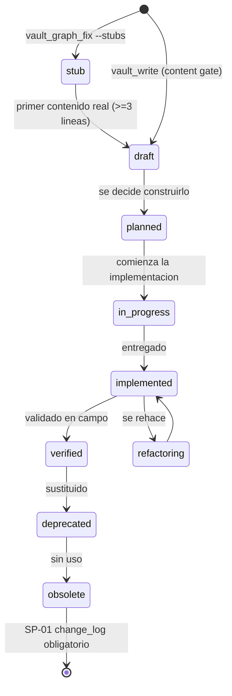
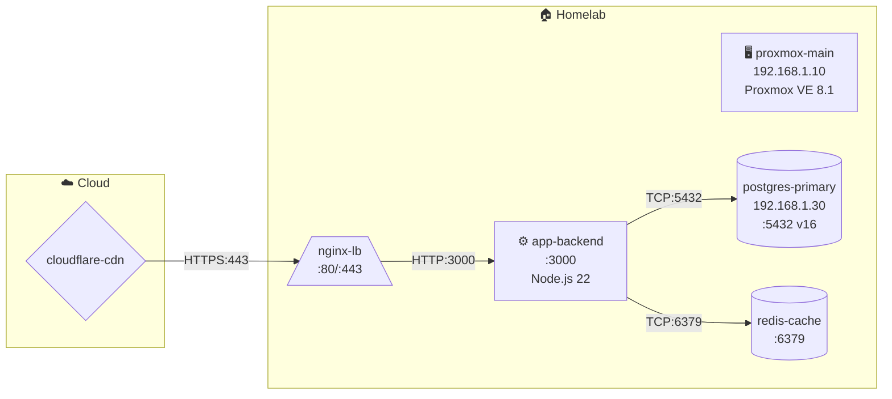
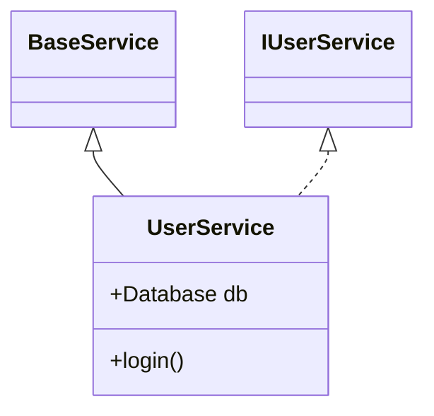
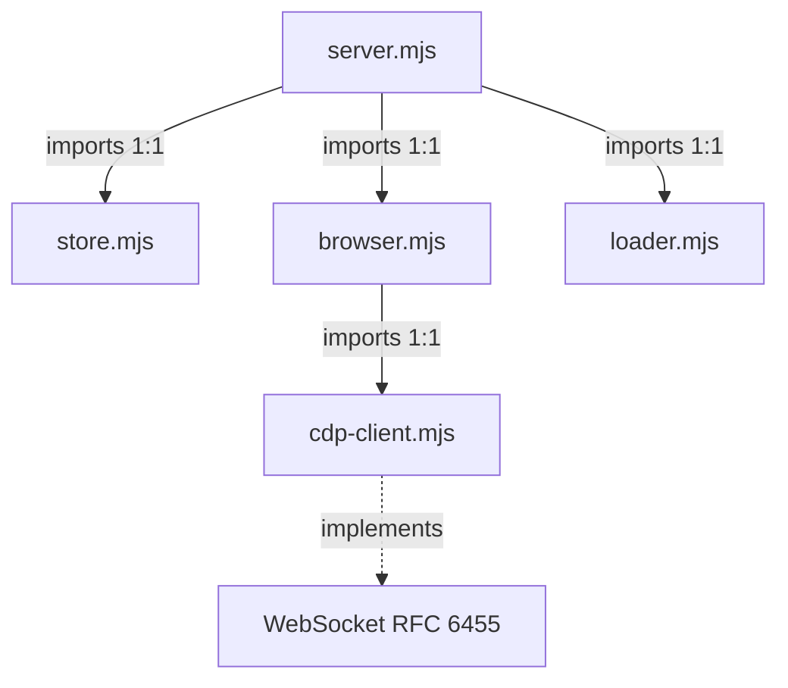
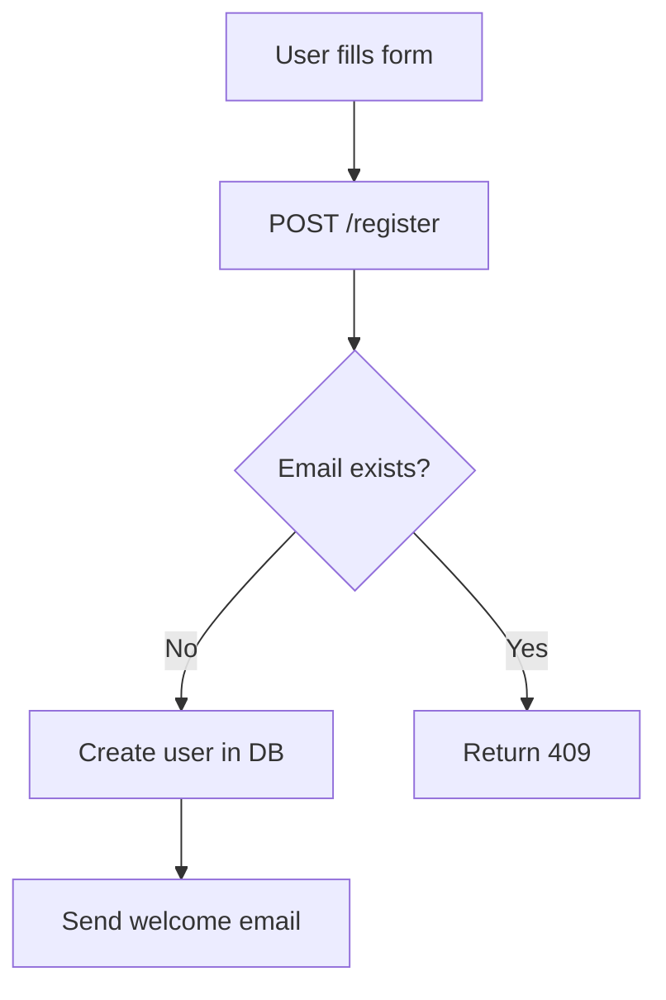

# Vault Obsidian Architecture — Agente LLM con Memoria Documental

**Autor:** CARLOS IVAN CM  
**Versión:** v40.1 — 2026-08-07  
**Aplicable a:** Cualquier agente LLM con acceso a sistema de archivos (Node.js, Python, Go, Rust)

---

## Qué es este estándar

**Vault Obsidian Architecture** es un estándar abierto para dotar a agentes LLM de **memoria documental persistente**: una carpeta de Markdown con frontmatter YAML, wiki-links y un conjunto de tools que la mantienen sana, indexada y auditable entre sesiones.

**El problema que resuelve.** La memoria de un agente es efímera. Cada sesión empieza desde cero aunque el proyecto lleve meses: se repiten errores ya cometidos, las decisiones técnicas no tienen trazabilidad y el conocimiento operativo se pierde. Este estándar convierte ese conocimiento en un activo persistente, versionado y verificable — sin base de datos, sin embeddings y sin servicio externo.

**Qué garantiza.** No es "guardar notas". Es un activo de datos con garantías declaradas y medidas por herramienta:

| | |
|---|---|
| **Tríada CIA** | confidencialidad, integridad y disponibilidad como campos que **cambian el comportamiento** de las tools, no como etiquetas |
| **8 Fundamentos de Datos (F1–F8)** | integridad, consistencia, completitud, exactitud, validez, oportunidad, autenticidad y no repudio — verificables nota a nota |
| **9 dimensiones de Data Quality** | score 0.0–1.0 por nota, umbral 0.7, consumido por el health score del vault |
| **Principios FAIR** | localizable, accesible, interoperable y reutilizable por diseño |
| **V's del Big Data** | volumen, velocidad, variedad, veracidad, valor y variabilidad, cada una atada a una métrica real |
| **Gobernanza y auditabilidad** | catálogo de normas con enforcement automático, cadena de procedencia completa y trazabilidad código↔documento |
| **Alineación normativa** | ISO/IEC 25010, 42001, 27001, 27005, 27701, 29148, 29119-3, 20000-1, 12207 · ISO 22301, 31000, 9001, 8601 |

Todo lo anterior está declarado, medido y forzado en **[Marco de Datos y Gobernanza](#marco-de-datos-y-gobernanza)**, con su matriz de trazabilidad concepto → métrica → tool → norma.

**Qué NO es.** No es un producto ni un plugin de Obsidian — el agente no necesita Obsidian instalado. No es un sistema de gestión documental para humanos. No es un reemplazo de git, de la wiki del equipo ni de una base de datos: es la capa de memoria que un agente consulta y escribe con reglas.

**Cómo se consume.** Como scripts Python invocados por el harness, o directamente vía **MCP** (`mcp/nodejs/vault-mcp-server.mjs`) para que cualquier IA compatible use las tools sin registro previo.

**Política de no-derogación.** Este documento no se mutila: ninguna tool, norma o sección se elimina al evolucionar el estándar. Lo reemplazado se marca `superseded_by:` y conserva su contrato — ver [Política de no-derogación](#política-de-no-derogación).

---

> **v39.2 (2026-08-05):** Tres defectos que solo un proyecto ajeno podía enseñar.
> - **Un solo slug.** Había 22 implementaciones repartidas por `scripts/`, en dos
>   familias divergentes: unas dejaban los acentos en el nombre de fichero, otras
>   los borraban. «Características principales» acababa en
>   `caracter-sticas-principales.md`, y el wikilink heredaba el destrozo. Ahora se
>   translitera, y una sola función lo hace.
> - **`vault_migrate_docs` escribía siete líneas.** Cortaba el documento por
>   `split("
", 8)`: frontmatter sin cerrar y cuerpo perdido. Además componía el
>   destino bajo `10_Migrated/` cuando ya venía relativo a la raíz, y escribía con
>   `write_text` — **saltándose el escaneo de secretos**.
> - **AP-17 confundía un contrato con su implementación.** `IRateLimitService` y
>   `RateLimitService` daban ~0.98 de similitud siempre, porque comparar en
>   minúsculas borra la `I`. Ocho pares falsos en el primer proyecto .NET.

---

> **v39.4 (2026-08-05):** La capa por la que un agente descubre el estándar, con contrato ejecutable.
> - **Grupo 37 — Skills.** Una skill se descubre por convención de ruta, y descubrirse
>   por ruta no es estar publicada: `vault-sdd-init` llevaba cuatro versiones con
>   definición, documentación y tests propios, y sin entrada en el catálogo ni en el
>   tool-spec. AP-42 sobre la puerta de entrada de los agentes.
> - **Puerta de vigencia del SDD (`--check`).** El documento generado deriva el rango
>   de antipatrones del registro, así que el recién escrito nunca miente; el de la
>   ejecución anterior sí. Medido: `AP-01..AP-35` en el cuerpo y `AP-01..AP-25` en el
>   índice con el registro en `AP-01..AP-47`.
> - **`--force` no pisa `gaps.md`.** Levanta la idempotencia de lo generado, no el
>   permiso para pisar lo escrito a mano — 85 hallazgos manuales perdidos antes de
>   que la excepción estuviera escrita en el código y no solo en la doc.
> - **`vault_sanacion`**: el plan de las 12 fases medido contra el vault que tienes
>   delante, con `unknown` distinto de `clean` y sin escribir nada.
>
> **v39.3 (2026-08-05):** El camino de ejecución, comprobado por donde se ejecuta.
> - **El runner MCP** —único punto por el que un agente real toca el estándar— no
>   tenía un solo test. Cuatro defectos: el hijo heredaba la consola de Windows y
>   cualquier `→` mataba la tool; un `exit != 0` descartaba el envelope justo cuando
>   las puertas `--strict` lo devuelven completo; el timeout estaba fijo y las tools
>   largas del propio repo eran inalcanzables; y `--file src/foo.ts` resolvía contra
>   `scripts/`, no contra el directorio del usuario.
> - **Una sola verdad para «cuál es el vault»**: 89 módulos congelaban `VAULT_ROOT`
>   en el import, así que `set_vault_root()` cambiaba la respuesta pública y no
>   cambiaba nada de lo que las tools usan para leer y escribir.
> - **Contención en el write path**: 12 escrituras en crudo migradas —el escaneo de
>   secretos, el saneado de encoding y el temp+replace viven ahí—, el escáner deja
>   de fallar abierto en silencio, y la tool que busca secretos deja de persistirlos
>   en claro.
> - **AP-46 — frontmatter a mano**: 26 tools montan el bloque concatenando líneas y
>   ninguna releía el resultado. Se valida la salida, no se reescriben las 26.
> - **AP-47 — el índice dejó de reflejar el disco**: `vault_reindex --check` medía
>   `len(notes) > 0`, así que un índice con una entrada sobre trescientas notas
>   pasaba. El desfase es esperable —consistencia eventual, sin base de datos, y eso
>   es normativo—; que no se midiera, no.
> - **ACID, nombrado**: el estándar ya daba **A** (temp+`os.replace`) e **I**
>   (`file_lock`) sin llamarlas así. La **C** se cierra con AP-47, la **D** pasa a ser
>   una decisión declarada con palanca (`VAULT_FSYNC=1`), y `degraded[]` deja de
>   contar como sano lo que no se pudo leer.
>
> **v39.1 (2026-08-05):** Poblar un vault desde un proyecto que no tiene ninguno.
> - **`vault_onboard` publicada** (Grupo 31 — Bootstrap): estaba documentada en este
>   manifiesto y **no se había ejecutado nunca** — AP-42 literal dentro del repo que
>   define la norma. La primera ejecución real contra un repositorio ajeno devolvió
>   nueve defectos; el peor, que sus 54 notas nacían **todas** en `missingType`.
> - **AP-45 — cobertura sin evidencia**: una nota que existe para llenar la sección,
>   no para afirmar algo. Es más cara que el hueco, porque el hueco se ve.
> - **`docs/MODO-AGENTICO-ONBOARDING.md`**: contraparte del modo de sanación. Donde
>   allí la regla es *nada se borra*, aquí es **nada se inventa**.
> - **Registro único de secciones**: `vault_graph`, `vault_delta` y `vault_graph_merge`
>   tenían 18 de 22 congeladas, así que `17_Preferences`, `18_Bugs`, `19_Audits` y
>   `20_Quarantine` no existían en `graph.json`.
>
> **v39.0 (2026-07-25):** Marco de Datos y Gobernanza explícito.
> - **Nueva sección `## Marco de Datos y Gobernanza`**: Tríada CIA como pilar declarado,
>   los 8 Fundamentos con sus campos y tools, las 9 dimensiones DQ con umbrales,
>   **Principios FAIR** y **las V's del Big Data** (ambos nuevos en el estándar),
>   estados y ciclo de vida, los tres planos de versionado, cadena de trazabilidad,
>   gobernanza, cobertura ISO unificada y **matriz de trazabilidad** de 20 filas.
> - **Registros canónicos ejecutables** en `vault_fundamentals.py`: `CIA_TRIAD`,
>   `FAIR_PRINCIPLES`, `BIGDATA_VS`, `ISO_COVERAGE`, `TRACEABILITY_MATRIX`.
>   Nuevos `--framework` (genera `00_System/data-framework.json` + `.md`) y `--matrix`.
> - **Guard anti-drift**: `vault_norms --check-framework` falla si el manifiesto y el
>   registro se desincronizan. Documentar sin ejecutar deja de ser posible.
> - **Política de no-derogación** declarada: el manifiesto no se mutila por reemplazo.
> - **Changelog consolidado**: entradas faltantes de v34/v35/v36/v38.0/v38.1 añadidas,
>   v27 reubicada, hashes `pending` fijados, ruta de ejemplo corregida.
>
> **v38.1 (2026-07-12):** Contención, idempotencia y enforcement total.
> - **AP-36 nueva** (critical, guard+audit): toda operación escribe SOLO dentro del
>   vault root, es idempotente y deja artefactos rastreables. Backups movidos a
>   `VAULT_ROOT/vault-backups/` (antes escribían fuera del repo); `.bak` de moves a
>   `00_System/.trash/`; stubs de graph-fix a `02_Observability/maintenance/stubs/`.
> - **Enforcement `manual` eliminado**: las 14 normas manuales pasaron a guard/audit.
>   Nuevo `vault_norms.py --audit [--root]` cubre AP-06/07/09/10/15/19/36, CN-02/03, SP-01.
> - **STATUS_VOCAB unificado** (12 valores): resuelve la contradicción CN-03 (7 valores)
>   vs ciclo de vida del spec (`draft→…→obsolete`). Fuente única: `vault_norms.STATUS_VOCAB`.
> - **Índices sin alias**: tablas de índice usan `| [[stem]] | Título | Tipo | Actualizado |`
>   — nunca `[[stem|alias]]` en celdas (confundía agentes, generaba notas en blanco).
>   Saneamiento automático: generador (durante) + self-heal al escribir index.md a mano +
>   `vault_section_index --heal` (retroactivo) + detección en `--audit`.
> - **Vault-root lazy**: `vault_io.set_vault_root()/get_vault_root()` — traces, tokens,
>   locks e índices siguen al `--root` objetivo, no al detectado en import.
>
> **v38.0 (2026-07-11):** Robustez de frontmatter — `vault_lib.parse_frontmatter`
> coacciona valores `datetime`/`date` (auto-parseados por PyYAML) a strings ISO en el
> límite de lectura. Elimina los crashes `datetime not subscriptable` / `not JSON
> serializable` de `vault_audit`/`vault_reindex` sobre vaults escritos por tooling
> anterior — sin migración de datos. Cubierto por `tests/test_vault_frontmatter_dates.py`.

---

## Por qué existe este documento

Los agentes LLM tienen un problema estructural: **su memoria es efímera**. Cada sesión empieza desde cero aunque el proyecto lleve meses en desarrollo. Esto genera:

- El agente repite errores ya cometidos
- No conoce el estado del proyecto sin que se lo expliquen
- Las decisiones técnicas no tienen trazabilidad
- Los patrones implementados se desconocen en sesiones futuras
- La infraestructura (servidores, bases de datos, proxies) debe re-describirse cada vez
- El conocimiento de dominio y las reglas de negocio se pierden
- Los procedimientos operacionales no se acumulan

El **Vault Obsidian** resuelve esto como patrón técnico puro:

> Vault = carpeta de conocimiento en Markdown + YAML frontmatter + wiki-links + búsqueda + versionado + reglas de acceso vía tools

El agente no necesita Obsidian instalado. Necesita el patrón y las tools.

---

## Principios de diseño

### 1. Markdown + Frontmatter YAML como formato universal
Legible por humanos, indexable por máquinas, compatible con git, abre en cualquier editor. El frontmatter YAML permite filtrado estructurado sin base de datos.

### 2. Wiki-links `[[nota]]` para relaciones
Construyen un grafo de conocimiento navegable. El agente conecta proyectos, decisiones, patrones e infraestructura sin base de datos de grafos.

### 3. Versionado automático con `.history/`
Cada `vault_write` sobre una nota existente copia la versión anterior a `.history/{ruta__plana}-{YYYY-MM-DDTHH-mm-ss}.md` (separadores de directorio reemplazados por `__`). Permite `vault_diff` sin git.

### 4. Separación por responsabilidad en carpetas numeradas
El prefijo numérico garantiza orden consistente en cualquier explorador y establece precedencia clara de la información.

### 5. Tools como única interfaz (harness pattern)
El agente **nunca** usa `fs.writeFile` directamente para documentación. Solo usa las vault tools. Esto garantiza: frontmatter correcto, versionado, índice actualizado, trazabilidad.

### 6. Auto-context injection
Al inicio de cada turno, `buildMessages()` ejecuta `getVaultAutoContext()` que busca en el índice las notas más relevantes al input del usuario y las inyecta en el system prompt. El vault se convierte en **RAG sin infraestructura de embeddings**.

### 7. Auto-generación de diagramas
`vault_relation_add` regenera el ERD Mermaid del proyecto automáticamente. `vault_infra_save` regenera el mapa de red. El agente solo describe las relaciones; los diagramas se mantienen solos.

### 8. Ciclo de vida de patrones
Los patrones tienen estado evolutivo: `planificado → en_progreso → implementado | deprecado | refactoring`. Cada transición queda registrada con timestamp, permitiendo reconstruir la historia arquitectónica.

---

## Marco de Datos y Gobernanza

> **Fuente única:** los registros de esta sección viven en `scripts/vault_fundamentals.py`
> (`CIA_TRIAD`, `FUNDAMENTALS`, `FAIR_PRINCIPLES`, `BIGDATA_VS`, `ISO_COVERAGE`,
> `TRACEABILITY_MATRIX`). Se exportan con `vault_fundamentals --framework` a
> `00_System/data-framework.json` + `.md`, y `vault_norms --check-framework` **falla**
> si este documento y el registro se desincronizan en cualquiera de las dos direcciones.
> Ninguna tabla de aquí se mantiene a mano (AP-02, AP-05).

Un vault no es "notas en markdown". Es un **activo de datos** con garantías declaradas y medibles. Esta sección declara cuáles son, qué las mide y qué las hace cumplir. Cada fila apunta a un número que una tool ya produce hoy — no hay afirmaciones aspiracionales (AP-04).

---

### La Tríada CIA — el pilar fundamental

Todo lo demás se apoya aquí. Los tres ejes son campos opcionales de frontmatter que, cuando están presentes, **cambian el comportamiento de las tools** — no son etiquetas decorativas.

| ID | Eje | Campo frontmatter | Valores | Efecto medible |
|---|---|---|---|---|
| **CIA-C** | Confidencialidad | `cia_sensitivity` | `public` · `internal` · `restricted` | `restricted` activa revisión en `vault_security_scan`. En `02_Observability/envs`, `sensitive: true` impide volcar el valor del secreto — solo se documenta proveedor y referencia. |
| **CIA-I** | Integridad | `cia_integrity` | `critical` · `high` · `medium` · `low` | `critical\|high` endurece el umbral de actualidad de **30d a 15d** y penaliza **5 pts** (vs 1 pt) en el health score. Pondera `stale_risk` en `vault_impact` y selecciona la estrategia `critical-path` en `vault_propagate`. |
| **CIA-A** | Disponibilidad | `cia_availability` | `high` · `medium` · `low` | Respaldado por `.history/` en cada escritura, backups con manifiesto Merkle en `VAULT_ROOT/vault-backups/` (AP-36) y rollback quirúrgico de migración (AP-10). |

**Por qué es el pilar:** un agente LLM que consume el vault toma decisiones a partir de él. Si el dato no es íntegro, la decisión es incorrecta; si no está disponible, la sesión empieza ciega; si no es confidencial, se filtra un secreto al grafo. Las tres fallas son de impacto distinto pero de la misma clase — pérdida de confianza en la memoria documental.

---

### Los 8 Fundamentos de Datos (F1–F8)

Registro canónico en `vault_fundamentals.FUNDAMENTALS`. Cada fundamento se mapea a una dimensión de Data Quality verificable por nota, con los campos de frontmatter que comprueba y las tools que lo implementan.

| ID | Fundamento | Dimensión DQ | Verifica | Campos | Tools |
|---|---|---|---|---|---|
| **F1** | INTEGRIDAD | `integrity` | Frontmatter parseable, campos estructurales presentes, delimitadores `---` sin corromper | `id`, `title`, `createdAt` | 16 |
| **F2** | CONSISTENCIA | `consistency` | Todo `[[wiki-link]]` resuelve, `type` coincide con la carpeta, índices JSON sincronizados | `type` | 22 |
| **F3** | COMPLETITUD | `completeness` | `updatedAt` presente, ≥3 líneas de contenido real, ≥1 tag en notas de contenido | `updatedAt`, `tags`, `status`, `type` | 21 |
| **F4** | EXACTITUD | `accuracy` | La nota está en la sección que su `type` exige | `type`, `path` | 7 |
| **F5** | VALIDEZ | `validity` | Valores dentro del vocabulario permitido (`status`, `type`, ejes CIA) | `status`, `type`, `cia_*` | 5 |
| **F6** | ACTUALIDAD / OPORTUNIDAD | `timeliness` | `updatedAt` dentro del umbral, salvo `evergreen: true`; umbral endurecido por CIA-I | `updatedAt`, `evergreen`, `cia_integrity` | 11 |
| **F7** | AUTENTICIDAD | `authenticity` | Consta qué agente escribió la nota | `agent` | 14 |
| **F8** | NO REPUDIO | `non_repudiation` | La operación dejó rastro en el change-log; nada se borra en silencio (SP-01) | — | 11 |

**Consulta:** `vault_fundamentals --list` · `vault_fundamentals --check <ruta>` (pass/fail por fundamento) · `vault_fundamentals --coverage` (matriz tool × fundamento).

---

### Las 9 dimensiones de Data Quality

`vault_quality_check` puntúa **cada nota** en las 8 dimensiones de F1–F8 más una suplementaria:

| Dimensión | Origen | Qué penaliza |
|---|---|---|
| `integrity`, `consistency`, `completeness`, `accuracy`, `validity`, `timeliness`, `authenticity`, `non_repudiation` | F1–F8 | ver tabla anterior |
| **`uniqueness`** | suplementaria (DQ-9) | duplicación canonical-shadow (AP-17) y duplicación entre carpetas (AP-18) |

- **Escala:** 0.0–1.0 por dimensión. **Global** = media no ponderada de las 9.
- **Umbral:** 0.7. Las notas por debajo se reportan en `notes_below_threshold`.
- **Artefacto:** `00_System/quality-index.json`.
- **Consumidor:** `vault_audit` expone el bloque `dqHealth` con estados `fresh | stale | update_in_progress | unavailable`.

---

### Principios FAIR

Findable, Accessible, Interoperable, Reusable. El vault los cumple por diseño, no por añadido — esta tabla nombra el mecanismo concreto de cada uno.

| ID | Principio | Mecanismo en el vault | Métrica |
|---|---|---|---|
| **FAIR-F** | **Findable** (localizable) | Campo `id` obligatorio (F1), `search-index.json` con scoring `título×4 + coincidencias`, índices de sección auto-generados e índice maestro en `99_Index/` | cobertura de `id` · notas huérfanas |
| **FAIR-A** | **Accessible** (accesible) | Markdown plano + YAML sobre el sistema de archivos. Abre en cualquier editor, versiona en git, se lee **sin Obsidian y sin las tools**. Las tools son conveniencia de escritura, no requisito de lectura | cero dependencias de lectura |
| **FAIR-I** | **Interoperable** | Frontmatter YAML con vocabulario canónico (`type`, `status` vía `STATUS_VOCAB`, `tags`), `[[wiki-links]]` como aristas, Mermaid para diagramas, `graph.json` como grafo explícito, MCP como protocolo de consumo | broken links = 0 · coherencia `type`↔carpeta |
| **FAIR-R** | **Reusable** | Cadena de procedencia PAT-5 (`agent`, `createdAt`, `updatedAt`, `norm_refs`), historial completo en `.history/`, change-log append-only y LICENSE del repositorio | cobertura de `agent` (F7) · entradas de change-log (F8) |

---

### Las V's del Big Data

El vault no maneja petabytes, pero sí las mismas tensiones a su escala. Cada V está atada a una métrica que una tool ya emite.

| ID | V | Qué mide | Métrica / Artefacto | Control que la contiene |
|---|---|---|---|---|
| **V1** | **Volumen** | cuánto conocimiento acumula sin degradar la navegación | total de notas y tamaño del grafo · `graph.json` | AP-23 (techo de complejidad por nota) + índices por sección |
| **V2** | **Velocidad** | a qué ritmo cambia el conocimiento entre sesiones | cambios por sesión · `.change-log.json`, session-delta | SP-03 (snapshot antes de operación masiva) + `vault_impact` |
| **V3** | **Variedad** | cuántas naturalezas de conocimiento conviven bajo un esquema | 18 secciones canónicas × vocabulario `type` · `vault_registry.SECTIONS` | CN-02 (destinos restringidos) + F4 (exactitud) |
| **V4** | **Veracidad** | cuánto se puede confiar en lo que el vault afirma — **la V que más importa a un agente LLM** | `overall_dq_score` 0.0–1.0, umbral 0.7 · `quality-index.json` | AP-01 (alucinación), AP-04 (aspiracional), AP-11 (skeleton) + content gate |
| **V5** | **Valor** | cuánto del conocimiento se convierte en decisión útil | health score 0–100 · `vault_audit.nextActions` | el audit emite la lista ejecutable de comandos para recuperar 100/100 |
| **V6** | **Variabilidad** | cuánto deriva el significado de la nota respecto al código real | drift doc↔código · tags `@vault:` | AP-08 (versiones obsoletas) + trazabilidad bidireccional |

---

### Estados y ciclo de vida

El vocabulario de `status` es **fuente única** en `vault_norms.STATUS_VOCAB` (12 valores) — resuelve la contradicción histórica entre CN-03 y el ciclo de vida del spec. La lista canónica y su enforcement se documentan en [CN-03](#cn-03--standard-status-vocabulary--vocabulario-canónico-de-metastatus); aquí solo se declara el flujo (AP-05: no se duplica la lista).



**Regla de transición:** ninguna nota salta de `stub` a `verified`. Cada transición la provoca una tool y queda registrada con timestamp — la historia del estado es reconstruible con `vault_timeline`.

---

### Versionado — tres planos independientes

Confundirlos es una fuente clásica de error. Son tres relojes distintos:

| Plano | Qué versiona | Artefacto | Tool | Formato |
|---|---|---|---|---|
| **Estándar** | las reglas y el contrato de tools | `00_System/standard-version.json` | `vault_version`, `vault_standard_upgrade` | `vN.M` |
| **Nota** | el contenido de un documento | `.history/{ruta__plana}-{timestamp}.md` | `vault_write` (automático), `vault_diff` | timestamp ISO 8601 |
| **Backup** | el estado completo del vault | manifiesto con raíz Merkle | `vault_backup`, `vault_backup_list`, `vault_restore` | timestamp + hash |

**Criterio de versión del estándar:** se incrementa cuando **cambia el comportamiento** — una norma nueva, un contrato de tool modificado, un guard añadido. Un cambio que solo reescribe texto no merece versión. El formato es siempre `vN.M`, sin excepciones.

---

### Trazabilidad y Auditabilidad

Todo nodo del vault es rastreable hasta su origen. La cadena completa:

```
código fuente (@vault: tag)
   └─> nota del vault
         ├─ agent:            ← quién la escribió           (F7 Autenticidad)
         ├─ createdAt/updatedAt ← cuándo                     (F6 Actualidad, ISO 8601)
         ├─ norm_refs:        ← bajo qué normas             (gobernanza)
         ├─ .history/         ← todas sus versiones previas (CIA-A)
         ├─ .change-log.json  ← qué se creó/movió/borró     (F8 No repudio, SP-01)
         ├─ .tool-trace.json  ← qué tool tocó qué y cuándo  (auditabilidad)
         └─ vault-backups/    ← manifiesto Merkle verificable
```

**Garantía operativa:** nada se borra en silencio. SP-01 exige entrada en el change-log **antes** de eliminar, y AP-36 garantiza que toda operación deje su artefacto **dentro** del vault root y sea idempotente.

---

### Gobernanza

| Eje | Mecanismo | Ubicación |
|---|---|---|
| **Normas del estándar** | catálogo AP-XX / PAT-X / SP-XX / CN-XX con niveles `guard`, `audit`, `guard+audit`, `recommended` — **cero `manual`** desde v38.1 | `vault_norms`, `00_System/norm-registry.json` |
| **Decisiones de IA** | registro de decisiones asistidas por IA con responsable y alcance | `16_AI_Governance/` |
| **Riesgos** | score `likelihood × impact`, nivel y tratamiento | `02_Observability/risks/` |
| **Privacidad** | registro de tratamiento con detección automática de DPIA | `09_Infrastructure/privacy/` |
| **No conformidades** | NCR con ID auto-generado, 5-Whys y verificación de eficacia | `02_Observability/quality/` |
| **Decisiones técnicas** | ADR con contexto, opciones evaluadas y consecuencias | `03_Decisions/` |
| **Directivas de proyecto** | `DA-{N}` (arquitectura) y `DS-{N}` (seguridad) que extienden las reglas base | `00_System/rules.md` |

**Principio de gobernanza:** una norma sin enforcement automático es una intención, no una regla. Toda norma nueva nace con su guard o su check de audit el mismo día.

---

### Cobertura de normas ISO

Referencia única y con formato canónico de cita. Las citas locales en cada grupo de tools se mantienen; esta tabla las consolida.

| ID | Norma | Cláusula / alcance | Implementado por | Tools |
|---|---|---|---|---|
| **ISO-25010** | ISO/IEC 25010:2023 | Modelo de calidad de producto | scoring multidimensional y no conformidades | `vault_quality_check`, `vault_ncr_save` |
| **ISO-42001** | ISO/IEC 42001:2023 | Gobernanza de decisiones asistidas por IA | `16_AI_Governance/` | `vault_ai_decision` |
| **ISO-29148** | ISO/IEC/IEEE 29148:2018 | Especificación y trazabilidad de requerimientos | `14_Requirements/` | `vault_requirement_save` |
| **ISO-29119** | ISO/IEC/IEEE 29119-3:2021 | Documentación de pruebas | `15_Tests/` enlazado a requerimientos | `vault_test_save`, `vault_test_runner` |
| **ISO-20000** | ISO/IEC 20000-1:2018 | Gestión de incidentes y niveles de servicio | `02_Observability/incidents/`, SLOs | `vault_incident_save`, `vault_slo_save` |
| **ISO-22301** | ISO 22301:2019 | Continuidad y recuperación | backups Merkle, restore verificable, runbooks de rollback | `vault_backup`, `vault_restore`, `vault_runbook_save` |
| **ISO-12207** | ISO/IEC/IEEE 12207:2017 | Procesos de release y entornos | registro de releases y matriz de entornos | `vault_release_save`, `vault_env_matrix` |
| **ISO-31000** | ISO 31000:2018 | Identificación, evaluación y tratamiento de riesgos | `02_Observability/risks/` | `vault_risk_save` |
| **ISO-27001** | ISO/IEC 27001:2022 | Controles de seguridad de la información | escaneo de secretos, `cia_sensitivity`, directivas `DS-` | `vault_security_scan`, `vault_env_save` |
| **ISO-27005** | ISO/IEC 27005:2022 | Riesgo de seguridad de la información | asignación automática de CIA por tipo e impacto | `vault_risk_save` |
| **ISO-27701** | ISO/IEC 27701:2019 | Tratamiento de datos personales (GDPR Art. 30 y 35) | `09_Infrastructure/privacy/` con DPIA automática | `vault_privacy_save` |
| **ISO-9001** | ISO 9001:2015 | §9.2 Auditoría interna · §10.2 No conformidad y acción correctiva | NCR con 5-Whys y verificación de eficacia | `vault_ncr_save`, `vault_audit` |
| **ISO-8601** | ISO 8601 | Formato de marcas temporales | todo timestamp es UTC `YYYY-MM-DDTHH:mm:ss.sssZ` (AP-13) | `vault_write`, `vault_validate` |

---

### Matriz de trazabilidad: concepto → métrica → tool → norma

La vista de una pantalla que hace verificable todo lo anterior. Generada por `vault_fundamentals --matrix`.

| Concepto | Métrica | Umbral | Tool | Artefacto | Enforcement |
|---|---|---|---|---|---|
| Confidencialidad (CIA-C) | hallazgos de secretos expuestos | 0 | `vault_security_scan` | `02_Observability/security/` | guard+audit |
| Integridad (CIA-I / F1) | `dq.integrity` | 0.0–1.0, ≥0.7 | `vault_quality_check` | `00_System/quality-index.json` | audit |
| Disponibilidad (CIA-A) | backups con manifiesto Merkle verificable | ≥1 reciente | `vault_backup` | `vault-backups/` | guard (AP-36) |
| Consistencia (F2) | wiki-links rotos | 0 | `vault_audit` | `00_System/graph.json` | guard+audit |
| Completitud (F3) | líneas reales de contenido | ≥3 | `vault_write` | content gate | guard |
| Exactitud (F4) | coincidencia `type` ↔ carpeta | 100% | `vault_validate` | `vault_registry.SECTIONS` | audit (CN-02) |
| Validez (F5) | `status` dentro de `STATUS_VOCAB` | 12 valores | `vault_norms --audit` | `vault_norms.STATUS_VOCAB` | audit (CN-03) |
| Oportunidad / Actualidad (F6) | antigüedad de `updatedAt` | 30d · 15d si CIA `critical\|high` | `vault_audit` | bloque `stale` | audit |
| Autenticidad (F7) | cobertura del campo `agent` | 100% | `vault_quality_check` | frontmatter `agent:` | audit (AP-16) |
| No repudio (F8) | entradas en change-log | 1 por borrado | `vault_change_log` | `00_System/.change-log.json` | audit (SP-01) |
| Unicidad (DQ-9) | duplicados canonical-shadow | 0 | `vault_merge --detect` | `quality-index.json` | audit (AP-17/18) |
| Localizable (FAIR-F) | notas huérfanas | 0 | `vault_audit` | `99_Index/index.md` | audit |
| Interoperable (FAIR-I) | errores de sintaxis de wiki-link | 0 | `vault_graph_inspect` | `graph.json` | guard (AP-22/24) |
| Reutilizable (FAIR-R) | cadena de procedencia completa | `agent` + timestamps | `vault_diff` | `.history/` | audit (PAT-5) |
| Veracidad (V4) | `overall_dq_score` | ≥0.7 | `vault_quality_check` | `vault_audit.dqHealth` | audit |
| Valor (V5) | health score | 0–100, objetivo 100 | `vault_audit` | `vault_audit.nextActions` | audit |
| Variabilidad (V6) | drift doc ↔ código | 0 | `vault_drift_detect` | tags `@vault:` | audit (AP-08) |
| Contención (AP-36) | escrituras fuera del vault root | 0 | `vault_norms --audit` | `vault_io.get_vault_root()` | guard+audit |
| Gobernanza de IA | decisiones de IA registradas | 1 por decisión | `vault_ai_decision` | `16_AI_Governance/` | recommended |
| Auditabilidad | operaciones con traza | 100% | `vault_errors_trace` | `00_System/.tool-trace.json` | automático |

> Los ejes `FAIR-A`, `V1`, `V2`, `V3` y `V5` no tienen fila de guard propia porque son **propiedades emergentes** del diseño (formato plano, estructura numerada, change-log) — se miden, pero no hay nada que forzar: no se pueden violar sin abandonar el estándar entero.

---

### Política de no-derogación

> **El manifiesto es la representación pública del estándar.** No se mutila.

Ninguna tool, grupo, norma, sección ni entrada de changelog se elimina de este documento. Cuando algo se reemplaza:

1. Se **conserva** su contrato y su descripción original.
2. Se marca con `superseded_by:` apuntando a lo que lo sustituye, y con la versión en que ocurrió.
3. Se explica **por qué** cambió — la razón es tan valiosa como el reemplazo.

**Motivo:** los vaults de la flota corren versiones distintas del estándar. Un contrato borrado del documento deja huérfano a todo consumidor que aún lo usa, y convierte el manifiesto en una foto del presente en lugar de la historia del estándar. Borrar también destruye la trazabilidad que F8 (no repudio) exige del propio documento que la define.

Lo único que se corrige sin conservar es el **error factual**: un hash equivocado, una ruta que no existe, un conteo desactualizado.

---

## Estructura del Vault

**Convención de nombre:** el directorio raíz del vault debe llamarse `vault-{nombre}` donde `{nombre}` es el slug del proyecto o contexto (ej: `vault-mi-proyecto`, `vault-ans`, `vault-homelab`). Este prefijo permite identificar vaults a simple vista en cualquier explorador de archivos y distinguirlos del directorio de backups hermano.

> **Regla para el agente:** al crear un vault nuevo, SIEMPRE usar el prefijo `vault-` en el nombre del directorio. Nunca crear el vault en un directorio sin este prefijo.

```
vault-{nombre}/          ← raíz del vault (SIEMPRE con prefijo vault-)
├── 00_System/
├── identity.md              — quién es el agente, capacidades, propósito
├── rules.md                 — reglas de comportamiento y límites
├── tool-contracts.md        — qué tools existen, comando para ejecutarlas, output que devuelven
└── backups/
    └── {tipo}-{YYYY-MM-DD}-{slug}.md  — registro de backup ejecutado (vault, db, archivos)

01_Projects/
│   └── {slug}/
│       ├── overview.md       — descripción ejecutiva, stack técnico
│       ├── architecture.md   — arquitectura técnica detallada
│       ├── status.md         — estado actual, blockers (auto-actualizado por vault_project_status)
│       ├── directives.md     — estándares, convenciones, restricciones del proyecto
│       ├── changelog.md      — historial append-only (auto-actualizado)
│       ├── decisions.md      — ADRs específicos del proyecto
│       └── envs.md           — variables de entorno por ambiente (dev/staging/prod): nombre, propósito, sensible, dónde se configura — nunca los valores reales
│
├── 02_Observability/
│   ├── errors/
│   │   └── {YYYY-MM-DD}-{slug}.md   — error, stack trace, contexto, solución
│   ├── antipatterns/
│   │   └── {slug}.md                — antipatrón, por qué es problemático, alternativa
│   ├── vulnerabilities/
│   │   ├── security-scan-{proyecto}-{fecha}.md  — reporte consolidado de vault_security_scan
│   │   └── {ruleId}-{slug}-{fecha}.md           — hallazgo individual (crítico/alto) con mitigación
│   ├── waf/
│   │   └── {proyecto}-{slug}.md     — regla de firewall activada, bypass detectado, contexto de la amenaza
│   ├── metrics/
│   │   └── {proyecto}-{slug}.md     — SLI/KPI: qué se mide, servicio, valor objetivo, unidad, herramienta de recolección
│   ├── alerts/
│   │   └── {proyecto}-{slug}.md     — regla de alerta: condición, umbral, canal de notificación, link al runbook de respuesta
│   └── slos/
│       └── {proyecto}-{slug}.md     — SLO: indicador medido (SLI), objetivo (%), ventana de tiempo, política de burn rate
│
├── 03_Decisions/
│   └── {YYYY-MM-DD}-{slug}.md       — ADR: contexto, opciones evaluadas, decisión, consecuencias
│
├── 04_Sessions/
│   └── {YYYY-MM-DD}.md              — log acumulativo diario (auto-gestionado por el harness)
│
├── 05_Patterns/
│   ├── design/
│   │   └── {proyecto}-{patron}.md   — GoF: Singleton, Factory, Observer, Strategy, Proxy...
│   ├── architecture/
│   │   └── {proyecto}-{patron}.md   — MVC, Hexagonal, Event-Driven, CQRS, Microservices...
│   ├── code/
│   │   └── {proyecto}-{patron}.md   — Retry, Circuit-Breaker, Cache-Aside, Saga, Rate-Limit...
│   ├── integration/
│   │   └── {proyecto}-{patron}.md   — REST, GraphQL, Pub-Sub, Webhook, gRPC, Message-Queue...
│   └── {proyecto}-patterns-index.md — índice auto-actualizado de todos los patrones del proyecto
│
├── 06_Diagrams/
│   ├── entity/
│   │   ├── {proyecto}-erd.md         — ERD Mermaid auto-generado por vault_relation_add
│   │   └── {proyecto}-relations.json — relaciones en crudo (fuente de verdad del ERD)
│   ├── component/
│   │   └── {proyecto}-{slug}.md      — diagrama de componentes/módulos
│   ├── sequence/
│   │   └── {proyecto}-{slug}.md      — diagrama de secuencia de flujos
│   ├── dependency/
│   │   └── {proyecto}-{slug}.md      — grafo de dependencias entre módulos/paquetes
│   └── flow/
│       └── {proyecto}-{slug}.md      — flujos generales, decisiones de proceso, diagramas de negocio
│
├── 07_Knowledge/
│   ├── glossary/
│   │   ├── {dominio}/               — subcarpeta por área de dominio (ej: finanzas/, ia/, ecommerce/)
│   │   │   └── {slug}.md
│   │   └── {slug}.md                — término de dominio o negocio con su definición completa
│   ├── apis/
│   │   ├── {proveedor-o-proyecto}/  — subcarpeta por proveedor o proyecto (ej: proveedor-externo/, mi-api/, servicio-pago/)
│   │   │   └── {endpoint-slug}.md
│   │   └── {slug}.md                — API externa/interna: endpoints, auth, rate limits, ejemplos
│   ├── concepts/
│   │   ├── {proyecto}/              — subcarpeta por proyecto (ej: mi-servicio/, ecommerce/)
│   │   │   └── {slug}.md
│   │   └── {slug}.md                — cómo funciona algo técnico en este proyecto específico
│   ├── business-rules/
│   │   ├── {modulo-o-dominio}/      — subcarpeta por módulo o área de negocio (ej: facturacion/, inventario/)
│   │   │   └── {slug}.md
│   │   └── {slug}.md                — regla de negocio no obvia, con contexto y excepciones
│   ├── configs/
│   │   ├── {herramienta}/           — subcarpeta por herramienta o entorno (ej: nginx/, postgres/, node/)
│   │   │   └── {slug}.md
│   │   └── {slug}.md                — configuración importante de herramienta o entorno
│   ├── dependencies/
│   │   ├── {proyecto}/              — subcarpeta por proyecto (ej: api-gateway/, ecommerce/)
│   │   │   └── {package-slug}.md   — paquete/librería: nombre, versión, propósito, por qué se eligió, alternativas descartadas
│   │   └── {package-slug}.md
│   └── frameworks/
│       ├── {proyecto}/              — subcarpeta por proyecto
│       │   └── {framework-slug}.md — framework: rol en el proyecto, convenciones adoptadas, decisiones de configuración
│       └── {framework-slug}.md
│
├── 08_Runbooks/
│   ├── deploy/
│   │   └── {proyecto}-{slug}.md     — procedimiento de despliegue paso a paso
│   ├── debug/
│   │   └── {proyecto}-{slug}.md     — cómo debuggear un tipo específico de problema
│   ├── setup/
│   │   └── {proyecto}-{slug}.md     — instalación y configuración inicial del entorno
│   ├── rollback/
│   │   └── {proyecto}-{slug}.md     — cómo revertir un deploy o migración
│   ├── maintenance/
│   │   └── {proyecto}-{slug}.md     — tareas periódicas de mantenimiento
│   ├── pipeline/
│   │   └── {proyecto}-{slug}.md     — cómo ejecutar, reparar o reintentar un pipeline CI/CD: qué hace cada etapa, cómo diagnosticar fallos
│   └── incident/
│       └── {proyecto}-{slug}.md     — respuesta a incidentes: pasos de contención y recuperación
│
├── 09_Infrastructure/
│   ├── servers/
│   │   ├── {entorno}/               — subcarpeta por entorno (ej: homelab/, produccion/, staging/)
│   │   │   └── {nombre}.md
│   │   └── {nombre}.md              — servidor físico, VM o VPS: IP, OS, recursos, rol
│   ├── services/
│   │   ├── {proyecto}/              — subcarpeta por proyecto o stack (ej: mi-servicio/, ecommerce/)
│   │   │   └── {nombre}.md
│   │   └── {nombre}.md              — servicio desplegado: puerto, versión, dependencias
│   ├── databases/
│   │   ├── {proyecto}/              — subcarpeta por proyecto (ej: erp/, analytics/)
│   │   │   └── {nombre}.md
│   │   └── {nombre}.md              — BD, cache, cola: tipo, versión, host, esquema
│   ├── network/
│   │   ├── {entorno}/               — subcarpeta por entorno o ubicación (ej: homelab/, cloud/)
│   │   │   └── {nombre}.md
│   │   └── {nombre}.md              — nginx, proxy, firewall, VLAN, DNS, CDN
│   ├── containers/
│   │   ├── {proyecto}/              — subcarpeta por proyecto o stack (ej: docker-compose/, k8s/)
│   │   │   └── {nombre}.md
│   │   └── {nombre}.md              — contenedor Docker, LXC, pod Kubernetes
│   ├── pipelines/
│   │   ├── {proyecto}/              — subcarpeta por proyecto
│   │   │   └── {nombre}.md
│   │   └── {nombre}.md              — pipeline CI/CD: plataforma (GitHub Actions/GitLab CI/Jenkins), etapas, triggers, artefactos generados
│   ├── secrets/
│   │   ├── {proyecto}/              — subcarpeta por proyecto
│   │   │   └── {nombre}.md
│   │   └── {nombre}.md              — secreto documentado: nombre de la variable, proveedor de gestión, scope, política de rotación — NUNCA el valor real
│   ├── .infra-index.json            — índice estructurado de componentes (fuente de verdad del mapa)
│   └── infra-map.md                 — mapa de red Mermaid auto-generado (todas las conexiones)
│
├── 10_Migrated/                     — documentación externa migrada por vault_migrate_docs
│   ├── _staging/                    — zona de aterrizaje: TODOS los docs llegan aquí primero
│   │   └── {slug}.md                — copia del original convertida a Markdown + frontmatter, sin distribuir aún
│   ├── direct/
│   │   └── {slug}.md                — stub de archivo distribuido con relación DIRECTA (link → destino final)
│   ├── indirect/
│   │   └── {slug}.md                — stub de archivo distribuido con relación INDIRECTA (link → destino final)
│   ├── excluded/
│   │   └── {slug}.md                — stub de archivo EXCLUIDO (sin relación ni directa ni indirecta)
│   └── _report-{proyecto}-{fecha}.md — reporte de migración: staging → clasificación → distribución
│
├── 11_Code/                         ← ★ documentación de código (vault_code_module/relation/map/query/sync)
│   ├── .code-index.json             — índice estructurado: módulos, relaciones, métodos y clases indexados (fuente de verdad)
│   └── {project-slug}/
│       ├── code-map.md              — diagrama Mermaid auto-generado de relaciones entre módulos
│       └── {file-slug}.md           — doc IEEE 1016: propósito, métodos, clases, constantes, excepciones, classDiagram
│
├── 12_Bibliography/                 ← referencias externas consultadas por el agente (web, papers, docs, APIs)
│   ├── web/
│   │   └── {slug}.md               — página web, artículo, post de blog
│   ├── papers/
│   │   └── {slug}.md               — paper académico, RFC, especificación técnica
│   ├── docs/
│   │   └── {slug}.md               — documentación oficial de herramienta o librería
│   ├── apis/
│   │   └── {slug}.md               — referencia de API externa consultada
│   └── books/
│       └── {slug}.md               — libro o capítulo específico
│
├── 13_Flows/                        ← ★ workflow, pipeline, lifecycle y dataflow (vault_flow_save)
│   ├── workflow/
│   │   └── {project}-{slug}.md     — proceso de negocio multi-actor con pasos, actores, triggers y Mermaid flowchart TD
│   ├── pipeline/
│   │   └── {project}-{slug}.md     — CI/CD o data pipeline: etapas, artefactos, triggers — Mermaid flowchart LR
│   ├── lifecycle/
│   │   └── {project}-{slug}.md     — ciclo de vida de entidad/componente: estados, transiciones — Mermaid stateDiagram-v2
│   └── dataflow/
│       └── {project}-{slug}.md     — transformación de datos: fuente → proceso → destino — Mermaid flowchart TD
│
├── 14_Requirements/                 ← ★ requerimientos del sistema (vault_requirement_save — ISO/IEC/IEEE 29148)
│   ├── .requirements-index.json     — índice: req_id, tipo, prioridad, estado, trazabilidad
│   └── {project}/
│       └── req-{n}-{slug}.md        — requerimiento: descripción, criterios de aceptación, trazabilidad a código
│
├── 15_Tests/                        ← ★ casos de prueba (vault_test_save — ISO/IEC/IEEE 29119-3)
│   ├── .tests-index.json            — índice: test_id, tipo, estado, trazabilidad a requisito y código
│   ├── unit/
│   │   └── {project}-{slug}.md      — test unitario: precondiciones, pasos, resultado esperado
│   ├── integration/
│   │   └── {project}-{slug}.md      — test de integración
│   ├── e2e/
│   │   └── {project}-{slug}.md      — test end-to-end
│   ├── performance/
│   │   └── {project}-{slug}.md      — test de rendimiento: SLA, p99, carga
│   ├── security/
│   │   └── {project}-{slug}.md      — test de seguridad: OWASP, penetración
│   └── acceptance/
│       └── {project}-{slug}.md      — test de aceptación: criterios del usuario
│
├── 16_AI_Governance/                ← ★ gobernanza de IA (vault_ai_decision — ISO/IEC 42001:2023)
│   ├── .decisions-log.json          — registro de decisiones: decision_id, tipo, impacto, aprobación humana
│   └── decisions/
│       └── {project}-{slug}.md      — decisión de IA: descripción, justificación, alternativas, riesgos
│
├── 17_Preferences/                  ← ★ contexto estable del usuario (vault_preferences — v39)
│   ├── workflow/                    — cómo quiere que se trabaje: flujo, ritmo, qué confirmar antes de actuar
│   ├── style/                       — estilo de comunicación y de código: idioma, tono, formato, convenciones
│   ├── tooling/                     — herramientas, lenguajes y librerías preferidas o vetadas
│   ├── constraints/                 — restricciones duras: qué no se debe tocar, mover, borrar o propagar
│   └── domain/                      — preferencias específicas de un proyecto o dominio concreto
│                                      (nota: strength must|should|may · revocar marca status: revoked, no borra)
│
├── 18_Bugs/                         ← ★ ciclo del defecto (vault_bug_save — v39)
│   ├── .bugs-index.json             — índice: bug_id, fase, estado, severidad
│   ├── open/                        — defectos reproducidos y sin corregir, con síntoma y pasos
│   ├── root-causes/                 — causa raíz, enlazada al bug que la manifestó
│   └── fixed/                       — corregidos y verificados, con la evidencia
│                                      (nota: la fase ES la subcarpeta · causes/caused_by son aristas tipadas)
│
├── 19_Audits/                       ← ★ bitácora del vault (vault_tags, vault_audit — v39)
│   ├── vocabulary/                  — registro append-only de términos: qué entró, cuándo, quién, a qué sucede
│   ├── runs/                        — resultados de auditorías ejecutadas (ISO 9001 §9.2)
│   └── findings/                    — hallazgos con norma incumplida y estado de resolución
│
├── 20_Quarantine/                   ← ★ retención sin borrado (vault_quarantine — v39)
│   ├── .quarantine-ledger.json      — ledger append-only: origen, razón, agente, restaurada sí/no
│   ├── unclassified/                — sin sección determinable: se retienen hasta que haya criterio
│   ├── suspicious/                  — disparó el pre-vuelo anti-poisoning (POISON-01..05), sin revisar
│   └── duplicates/                  — candidatas a duplicado pendientes de decidir la canónica (PAT-1)
│                                      (nota: la nota se MUEVE, no se copia · el origen viaja dentro de la nota)
│
└── 99_Index/
    ├── search-index.json        — índice full-text (score ponderado: título×4, palabras, preview)
    └── graph.json               — grafo de nodos y aristas de wiki-links
```

> **Nota sobre el orden numérico:** `11_Code` aparece después de `10_Migrated` respetando el orden numérico. La sección de documentación de código se numeró 11 al agregarse posteriormente al diseño original de 10 carpetas. `99_Index` usa el prefijo alto para quedar siempre al final del árbol en cualquier explorador.

**Directorio de backups físicos** (hermano del vault, fuera de su árbol para no incluirse en copias propias):

```
vault-backups/
├── .backup-registry.json                 — log centralizado de todos los backups realizados
└── vault-{YYYY-MM-DD-HHMMSS}[-label]/    ← una carpeta por snapshot del vault
    ├── .manifest.json                    — inventario: secciones, notas, archivos, KB por carpeta
    ├── 00_System/                        ┐
    ├── 01_Projects/                      │
    ├── ...                               │ copia exacta del vault en el momento del backup
    └── 99_Index/                         ┘
```

---

## Las 69 Tools del Vault — Referencia Completa

> **Tools vs Skills:** las 68 **tools** son funciones atómicas registradas en el harness — cada una hace exactamente una cosa. Una **skill** es un protocolo de múltiples pasos (secuencia de tools + lógica de decisión) que el agente ejecuta para un objetivo complejo. Las skills no son tools adicionales — son instrucciones de orquestación referenciadas en los casos de uso concretos (ej: `security-auditor`, `vault-migrator`). Un agente puede implementar skills como instrucciones en su system prompt o como flujos de trabajo.

> **Convención de parámetro `project`:** en todas las tools, `project` es siempre un **slug kebab-case** del nombre del proyecto (ej: `"mi-api"`, `"vault-ans"`, `"ecommerce-backend"`). Nunca usar el nombre con espacios ni mayúsculas. El slug es el identificador canónico que determina las rutas de carpeta en el vault.

> **Cambios v34 — Detección de vault + nextActions + scaffolds:** `vault_init` (Grupo 32) es la nueva entry point que crea las 18 carpetas, aplica migraciones, auto-indexa cada sección, agrega un scaffold primer con contenido real en cada sección vacía (marcado `scaffold: true` para reemplazo posterior), y reporta el health score inicial. `vault_audit` ahora incluye un bloque `nextActions` prescriptivo que lista exactamente qué comandos ejecutar para mantener o recuperar 100/100 — el audit deja de ser solo diagnóstico y se vuelve una lista de tareas ejecutable. `_detect_vault_root` se hizo robusto para layouts consumer-repo donde el vault contiene el spec file como referencia, y excluye `vault-sandbox/` y `*.bak` para evitar el chicken-and-egg donde la detección creaba un side-effect que luego se confundía con el vault real.

---

### Grupo 1 — Core (escritura, lectura, búsqueda)

---

#### `vault_write(folder, title, content, tags?, meta?)`

Crea o actualiza cualquier nota del vault con frontmatter YAML correcto.

**Parámetros:**
| Parámetro | Tipo | Default | Descripción |
|---|---|---|---|
| `folder` | string | — | Ruta relativa al vault root (ej: `"01_Projects/mi-api"`, `"03_Decisions"`) |
| `title` | string | — | Título de la nota — también determina el nombre del archivo (normalizado a kebab-case) |
| `content` | string | — | Contenido completo en Markdown |
| `tags` | string[] | `[]` | Tags para búsqueda e indexación |
| `meta` | object | `{}` | Campos adicionales de frontmatter (ej: `{ status: "en_desarrollo" }`) |

**Comportamiento:**
- Si la nota existe → copia la versión anterior a `.history/` con timestamp antes de sobreescribir
- Genera automáticamente: `id` (UUID), `createdAt`, `updatedAt`
- Actualiza `99_Index/search-index.json` con la nueva nota

**Retorna:**
```json
{ "ok": true, "path": "01_Projects/mi-api/status.md", "id": "uuid", "created": true }
```

**Regla de escritura atómica (content gate):** Cuando `vault_write` crea una nota nueva (la nota no existía), valida que `content` tenga al menos 3 líneas con texto real (excluye frontmatter, líneas `TODO`, guiones vacíos y líneas en blanco). Si el contenido no pasa el gate, retorna `{ ok: false, error: "content_too_short" }` — la nota no se crea. Esta regla **no aplica** al agregar contenido a una nota existente (usar `vault_append` para eso) ni a notas del sistema (`00_System/`).

> **Regla de wiki-links:** solo agregar `[[nombre-nota]]` en el contenido cuando la nota destino ya existe en el vault. Antes de escribir un wiki-link: `vault_search(query:"nombre-nota")` → si no hay resultado → escribir el nombre en texto plano hasta que la nota exista. Escribir `[[]]` o `[[ ]]` está prohibido (ver AP-14).

**Cuándo usar:** documentación de proyecto, notas de arquitectura, ADRs, runbooks manuales, cualquier nota sin tool específica.

---

#### `vault_read(path)`

Lee una nota por ruta relativa y retorna su contenido estructurado.

**Parámetros:**
| Parámetro | Tipo | Default | Descripción |
|---|---|---|---|
| `path` | string | — | Ruta relativa al vault root (ej: `"01_Projects/mi-api/status.md"`) |

**Retorna:**
```json
{
  "meta": { "id": "...", "title": "...", "tags": [...], "status": "...", "updatedAt": "..." },
  "body": "## Contenido en Markdown...",
  "wikiLinks": ["patron-relacionado", "otro-proyecto"],
  "historyVersions": ["01_Projects__mi-api__status-2026-05-01T14-30-00.md"]
}
```

**Cuándo usar:** antes de tomar cualquier decisión técnica, al inicio de trabajo en un proyecto, al consultar un runbook antes de ejecutarlo.

---

#### `vault_append(path, content, section?, timestamped?)`

Agrega contenido a una nota existente sin crear versión histórica (append es no-destructivo).

**Parámetros:**
| Parámetro | Tipo | Default | Descripción |
|---|---|---|---|
| `path` | string | — | Ruta relativa al vault |
| `content` | string | — | Texto a agregar |
| `section` | string | null | Agregar dentro de una sección `## Heading` específica |
| `timestamped` | boolean | true | Si true, agrega `**YYYY-MM-DD HH:MM**` antes del contenido |

**Retorna:**
```json
{ "ok": true, "path": "04_Sessions/2026-05-06.md", "appended": true }
```

**Cuándo usar:** changelog diario, session logs, agregar entradas a decision logs o runbooks sin reescribir todo, registrar nuevos hallazgos en notas existentes.

---

#### `vault_search(query, folder?, tag?)`

Búsqueda full-text ponderada en el vault.

**Algoritmo de score:** `título×4 + coincidencias_en_palabras + coincidencias_en_preview`

**Parámetros:**
| Parámetro | Tipo | Default | Descripción |
|---|---|---|---|
| `query` | string | — | Términos a buscar (múltiples palabras separadas por espacio) |
| `folder` | string | — | Restringir búsqueda a una carpeta y **todos sus subdirectorios** recursivamente (ej: `"02_Observability"` incluye `02_Observability/errors/`, `02_Observability/waf/`, etc.) |
| `tag` | string | — | Filtrar por tag del frontmatter |

**Retorna:**
```json
[
  { "path": "03_Decisions/2026-05-01-auth.md", "title": "ADR Auth JWT", "score": 9, "preview": "Decidimos usar JWT porque..." }
]
```
Hasta 20 resultados ordenados por score descendente, con preview de 200 chars.

**Cuándo usar (OBLIGATORIO):** siempre antes de crear una nota nueva (evitar duplicados), antes de responder sobre errores conocidos, antes de tomar una decisión ya documentada.

---

#### `vault_list(folder?, status?, limit?)`

Lista notas del vault ordenadas por `updatedAt` descendente.

**Parámetros:**
| Parámetro | Tipo | Default | Descripción |
|---|---|---|---|
| `folder` | string | — | Carpeta a listar (ej: `"01_Projects"`). Sin valor: retorna estructura raíz del vault |
| `status` | string | — | Filtrar por campo `status` del frontmatter (ej: `"en_progreso"`) |
| `limit` | number | 50 | Máximo de notas a retornar |

**Retorna:**
```json
{
  "folder": "01_Projects",
  "total": 12,
  "notes": [
    { "path": "01_Projects/mi-api/status.md", "title": "Status", "tags": ["backend"], "status": "en_desarrollo", "updatedAt": "2026-05-06T14:00:00Z", "preview": "Estado actual: ..." }
  ]
}
```
Sin `folder`: retorna la estructura de carpetas raíz con descripciones de cada sección.

**Cuándo usar:** explorar qué notas existen en una sección, listar todos los proyectos, revisar patrones por estado, navegar el vault sin saber rutas exactas.

---

#### `vault_diff(path, version?)`

Compara versión actual vs versión anterior en `.history/`.

**Parámetros:**
| Parámetro | Tipo | Default | Descripción |
|---|---|---|---|
| `path` | string | — | Ruta relativa de la nota a comparar |
| `version` | string | última | Nombre del archivo en `.history/` a comparar (sin valor: usa la versión histórica más reciente) |

**Retorna:**
```json
{
  "path": "01_Projects/mi-api/architecture.md",
  "compared_against": "01_Projects__mi-api__architecture-2026-05-01T12-00-00.md",
  "added":   ["+ ## Sección nueva agregada", "+ descripción..."],
  "removed": ["- ## Sección eliminada", "- contenido anterior..."],
  "history": ["01_Projects__mi-api__architecture-2026-05-01T12-00-00.md", "..."]
}
```

**Cuándo usar:** auditoría de cambios en arquitectura, ver qué decidimos diferente, comparar estado anterior vs actual de un proyecto.

---

#### `vault_graph()`

Regenera `99_Index/graph.json` escaneando todos los wiki-links `[[nota]]` del vault.

**Retorna:**
```json
{
  "ok": true,
  "savedTo": "99_Index/graph.json",
  "stats": {
    "totalNodes": 55,
    "totalEdges": 40,
    "orphanNotes": 22,
    "brokenLinks": 16
  },
  "orphans": [
    { "path": "07_Knowledge/apis/legacy-api.md", "title": "Legacy API", "type": "07_Knowledge" }
  ],
  "brokenLinks": [
    { "from": "01_Projects/mi-api/status.md", "link": "nota-que-no-existe", "targetPath": "nota-que-no-existe" }
  ]
}
```

`orphans` y `brokenLinks` muestran hasta 10 entradas; el total completo queda en `stats`. El grafo completo (todos los nodos y aristas) se persiste en `99_Index/graph.json`.

**Cuándo usar:** después de eliminar o renombrar notas, después de una migración, al detectar AP-14 (broken links), periódicamente como mantenimiento del grafo de conocimiento.

---

### Grupo 2 — Observabilidad

---

#### `vault_log_error(type, title, description, context, severity?, project?, mitigation?)`

Registra errores, antipatrones, vulnerabilidades y reglas WAF con trazabilidad completa.

**Tipos:**
| type | Subcarpeta | Uso |
|---|---|---|
| `error` | `02_Observability/errors/` | Error de runtime, compilación o lógica |
| `antipattern` | `02_Observability/antipatterns/` | Código o arquitectura problemática detectada |
| `vulnerability` | `02_Observability/vulnerabilities/` | CVE, OWASP, injection, XSS, SSRF, etc. |
| `waf` | `02_Observability/waf/` | Regla de firewall activada, bypass detectado |
| `metric` | `02_Observability/metrics/` | SLI/KPI definido o actualizado: servicio, qué se mide, objetivo, unidad, herramienta |
| `alert` | `02_Observability/alerts/` | Regla de alerta: condición, umbral, canal, severidad, link al runbook de respuesta |
| `slo` | `02_Observability/slos/` | SLO definido: indicador (SLI), objetivo (%), ventana de tiempo, política de burn rate |

**Parámetros:**
| Parámetro | Tipo | Default | Descripción |
|---|---|---|---|
| `type` | string | — | Tipo de registro: `error` · `antipattern` · `vulnerability` · `waf` · `metric` · `alert` · `slo` |
| `title` | string | — | Título descriptivo del hallazgo |
| `description` | string | — | Qué ocurrió o qué se detectó |
| `context` | string | — | Dónde: archivo, línea, servicio, endpoint, condición de activación |
| `severity` | string | `medium` | `critical` · `high` · `medium` · `low` · `info` |
| `project` | string | — | Slug del proyecto al que pertenece el hallazgo |
| `mitigation` | string | — | Acción correctiva aplicada o recomendada |

**Retorna:**
```json
{ "ok": true, "path": "02_Observability/errors/2026-05-06-null-ref-auth.md", "type": "error", "severity": "high" }
```

**Nota importante:** separada de `vault_write` porque los errores tienen ciclo de vida acumulativo — nunca se borran, tienen campos específicos de trazabilidad (severidad, contexto, mitigación), y se registran siempre de forma append, nunca sobreescribiendo.

**Relación con `vault_security_scan`:** `vault_log_error(type:'vulnerability')` se usa para hallazgos individuales detectados manualmente o por revisión de código. `vault_security_scan` es el escáner automatizado que crea el reporte consolidado + notas individuales para hallazgos críticos/altos.

**Cuándo usar:** al detectar cualquier error, antipatrón o vulnerabilidad durante el desarrollo o revisión de código — registrar inmediatamente para que quede trazabilidad antes de la mitigación.

---

#### `vault_project_status(project, status, summary, modified_files?)`

Actualiza `01_Projects/{slug}/status.md` y hace append a `changelog.md`.

**Parámetros:**
| Parámetro | Tipo | Default | Descripción |
|---|---|---|---|
| `project` | string | — | Slug del proyecto (ej: `"mi-api"`) |
| `status` | string | — | Estado actual: `en_desarrollo` · `en_revision` · `bloqueado` · `completado` · `archivado` · `en_produccion` |
| `summary` | string | — | Resumen de qué se hizo o qué cambió en esta sesión |
| `modified_files` | string[] | `[]` | Lista de archivos modificados en esta sesión |

**Retorna:**
```json
{ "ok": true, "statusPath": "01_Projects/mi-api/status.md", "changelogPath": "01_Projects/mi-api/changelog.md", "status": "en_desarrollo" }
```

**Cuándo usar:** al finalizar cualquier sesión de trabajo en un proyecto, cuando el estado cambia, cuando hay blockers nuevos.

---

#### `vault_env_save(project, environment, vars, description?)`

Documenta las variables de entorno de un proyecto por ambiente. Nunca almacena valores reales — solo estructura, propósito y metadatos de gestión.

**Parámetros:**
| Parámetro | Tipo | Default | Descripción |
|---|---|---|---|
| `project` | string | — | Slug kebab-case del proyecto (ej: `"mi-api"`) |
| `environment` | string | — | Nombre del ambiente: `dev` · `staging` · `production` · `test` · `ci` u otro |
| `vars` | object[] | — | Array de variables — ver esquema abajo |
| `description` | string | `""` | Contexto general del ambiente |

**Esquema de cada variable en `vars`:**
| Campo | Tipo | Default | Descripción |
|---|---|---|---|
| `name` | string | — | Nombre de la variable (ej: `DATABASE_URL`, `API_KEY`) |
| `description` | string | — | Para qué sirve — qué configura o activa |
| `required` | boolean | `false` | Si el sistema falla sin ella |
| `default` | string | `""` | Valor por defecto si no es sensible y tiene uno (omitir si sensible) |
| `sensitive` | boolean | `false` | `true` si contiene credenciales, tokens o datos privados |
| `provider` | string | `"env-file"` | Dónde se gestiona: `env-file` · `k8s-secret` · `vault` · `ci-secrets` · `manual` |

**Comportamiento:**
- Crea o actualiza `01_Projects/{slug}/envs.md`
- Upsert por ambiente: si el ambiente ya existe, reemplaza su tabla; si es nuevo, agrega una sección `## {environment}`
- Genera tabla Markdown por ambiente: `Nombre | Descripción | Requerida | Default | Sensible | Proveedor`
- Variables `sensitive:true` muestran `🔒 (secreto)` en la columna Default — nunca el valor real

**Retorna:**
```json
{ "ok": true, "path": "01_Projects/mi-api/envs.md", "environment": "production", "varCount": 4 }
```

**Ejemplo de `envs.md` generado:**
```markdown
## production

| Nombre | Descripción | Requerida | Default | Sensible | Proveedor |
|---|---|---|---|---|---|
| `PORT` | Puerto en que escucha el servidor | ✓ | `3000` | — | env-file |
| `DATABASE_URL` | Cadena de conexión a la base de datos | ✓ | 🔒 (secreto) | 🔒 | k8s-secret |
| `LOG_LEVEL` | Nivel de verbosidad de logs | — | `info` | — | env-file |
| `JWT_SECRET` | Clave para firmar tokens de sesión | ✓ | 🔒 (secreto) | 🔒 | vault |
```

**Cuándo usar:** al documentar un proyecto nuevo, al agregar una variable de entorno, al cambiar el proveedor de un secreto, al onboardear a alguien al proyecto (el `envs.md` es la referencia de configuración sin exponer credenciales).

---

### Grupo 3 — Patrones

---

#### `vault_pattern_save(project, name, type, status, description, files?, related_patterns?, notes?)`

Registra o actualiza un patrón con su estado evolutivo.

**Tipos de patrón:**
| type | Ejemplos |
|---|---|
| `design` | Singleton, Factory, Observer, Strategy, Decorator, Proxy, Command, Adapter, Facade |
| `architecture` | MVC, Hexagonal, Event-Driven, CQRS, Microservices, Monolith, BFF, Clean Architecture |
| `code` | Retry, Circuit-Breaker, Cache-Aside, Saga, Idempotency, Rate-Limit, Bulkhead |
| `integration` | REST, GraphQL, WebSocket, Pub-Sub, Webhook, gRPC, Message-Queue, Batch |

**Estados y ciclo de vida:**
```
planificado ──→ en_progreso ──→ implementado
                             ├─→ deprecado
                             └─→ refactoring
```

**Parámetros:**
| Parámetro | Tipo | Default | Descripción |
|---|---|---|---|
| `project` | string | — | Slug del proyecto |
| `name` | string | — | Nombre del patrón (ej: `"Repository"`, `"Circuit-Breaker"`) |
| `type` | string | — | Categoría: `design` · `architecture` · `code` · `integration` |
| `status` | string | — | Estado actual: `planificado` · `en_progreso` · `implementado` · `deprecado` · `refactoring` |
| `description` | string | — | Descripción del patrón en el contexto de este proyecto |
| `files` | string[] | `[]` | Archivos donde está implementado el patrón |
| `related_patterns` | string[] | `[]` | Nombres de patrones relacionados (se convierten en wiki-links) |
| `notes` | string | — | Observaciones, invariantes o decisiones no obvias |

**Comportamiento especial:**
- Si el patrón ya existía con diferente status → registra la transición en `## Evolución` con timestamp
- Crea/actualiza automáticamente `{proyecto}-patterns-index.md` con entrada del patrón
- Los `related_patterns` se convierten en wiki-links `[[patron]]`
- Los `files` quedan documentados como la implementación viva del patrón

**Retorna:**
```json
{ "ok": true, "path": "05_Patterns/architecture/mi-api-hexagonal.md", "status": "implementado", "transition": "en_progreso → implementado" }
```

**Cuándo usar (OBLIGATORIO):**
- Al escribir código que implementa un patrón → llamar inmediatamente
- Al leer código y reconocer un patrón existente → registrar con `status: "implementado"`
- Al inicio de trabajo en un proyecto → `vault_pattern_list()` primero, luego `vault_pattern_save()` para nuevos
- Cuando un patrón cambia de estado → re-llamar con el nuevo status

---

#### `vault_pattern_list(project?, type?, status?)`

Lista patrones registrados agrupados por estado.

**Parámetros:**
| Parámetro | Tipo | Default | Descripción |
|---|---|---|---|
| `project` | string | — | Filtrar por proyecto |
| `type` | string | — | Filtrar por tipo: `design` · `architecture` · `code` · `integration` |
| `status` | string | — | Filtrar por estado: `planificado` · `en_progreso` · `implementado` · `deprecado` |

**Retorna:**
```json
{
  "total": 8,
  "grouped": {
    "implementado": ["Repository", "Factory", "Circuit-Breaker"],
    "en_progreso":  ["Event-Driven"],
    "planificado":  ["CQRS", "Saga"],
    "deprecado":    ["ActiveRecord"]
  },
  "patterns": [{ "path": "...", "pattern": "Repository", "status": "implementado", "updatedAt": "..." }]
}
```

**Cuándo usar:** al iniciar trabajo en un proyecto para conocer el estado del arte arquitectónico sin leer todos los archivos.

---

### Grupo 4 — Diagramas y Cardinalidad

---

#### `vault_diagram_save(project, title, diagram_type, category, content, description?)`

Guarda un diagrama en el vault. Los diagramas Mermaid se renderizan automáticamente en la UI.

**Parámetros:**
| Parámetro | Tipo | Default | Descripción |
|---|---|---|---|
| `project` | string | — | Slug del proyecto |
| `title` | string | — | Título del diagrama (determina el nombre de archivo) |
| `diagram_type` | string | — | Formato: `mermaid` · `ascii` · `plantuml` |
| `category` | string | — | Tipo de diagrama — ver tabla de categorías |
| `content` | string | — | Código interno del diagrama **sin** backticks de bloque — la tool los agrega |
| `description` | string | — | Descripción breve de qué representa el diagrama |

**Categorías (`category`):**
| Categoría | Subcarpeta | Uso | Mermaid típico |
|---|---|---|---|
| `entity` | `06_Diagrams/entity/` | Diagramas ER, relaciones entre entidades de dominio | `erDiagram` |
| `component` | `06_Diagrams/component/` | Módulos, servicios, capas de la aplicación | `graph TD` |
| `sequence` | `06_Diagrams/sequence/` | Flujos de ejecución, llamadas entre servicios | `sequenceDiagram` |
| `dependency` | `06_Diagrams/dependency/` | Grafo de dependencias entre paquetes o módulos | `graph LR` |
| `flow` | `06_Diagrams/flow/` | Flujos generales, decisiones, procesos de negocio | `flowchart TD` |
| `state` | `06_Diagrams/state/` | Máquinas de estado, state machines de componentes | `stateDiagram-v2` |
| `lifecycle` | `06_Diagrams/lifecycle/` | Ciclos de vida de entidades o componentes con fases | `stateDiagram-v2` |

> **`state` vs `13_Flows/lifecycles/`:** usa `06_Diagrams/state/` para diagramas de presentación sin semántica estructurada. Usa `vault_flow_save --type lifecycle` (Grupo 18) cuando necesites también pasos, actores, triggers y condiciones consultables por el agente.

**Retorna:**
```json
{ "ok": true, "path": "06_Diagrams/sequence/mi-api-auth-flow.md", "diagram_type": "mermaid", "category": "sequence" }
```

**Cuándo usar:** al documentar la arquitectura de un servicio, al capturar un flujo de ejecución no obvio, al crear el mapa de dependencias entre módulos.

---

#### `vault_relation_add(project, from_entity, to_entity, relation_type, cardinality, label?, description?, entity_type?)`

Agrega una relación de cardinalidad o dependencia y **auto-genera el ERD Mermaid del proyecto**.

**Tipos de relación (`relation_type`):**
| relation_type | Semántica | Mermaid |
|---|---|---|
| `has_one` | 1 posee 1 (owner → owned) | `\|\|--\|\|` |
| `has_many` | 1 posee N (owner → many) | `\|\|--o{` |
| `belongs_to` | N pertenece a 1 (child → parent) | `}o--\|\|` |
| `many_to_many` | N a M | `}o--o{` |
| `implements` | clase implementa interfaz | `..>` |
| `extends` | herencia/extensión | `--\|>` |
| `depends_on` | dependencia de módulo | `-->` |
| `uses` | uso sin dependencia dura | `-->` |
| `calls` | invocación service → service | `-->` |
| `owns` | composición fuerte | `*--` |
| `aggregates` | agregación débil | `o--` |

**Tipos de entidad (`entity_type`):**
`database` · `module` · `service` · `class` · `api` · `component`

**Auto-generación del ERD:**
1. Persiste la relación en `06_Diagrams/entity/{proyecto}-relations.json` (fuente de verdad)
2. Detecta si las relaciones son DB-like → usa `erDiagram` Mermaid
3. Si son module/service/class → usa `graph TD` Mermaid con flechas
4. Sobreescribe `{proyecto}-erd.md` con el ERD completo actualizado

**Parámetros:**
| Parámetro | Tipo | Default | Descripción |
|---|---|---|---|
| `project` | string | — | Slug del proyecto |
| `from_entity` | string | — | Nombre de la entidad origen |
| `to_entity` | string | — | Nombre de la entidad destino |
| `relation_type` | string | — | Tipo de relación — ver tabla |
| `cardinality` | string | — | Cardinalidad: `1:1` · `1:N` · `N:M` |
| `label` | string | — | Etiqueta descriptiva de la arista en el ERD |
| `description` | string | — | Contexto adicional sobre la relación |
| `entity_type` | string | — | Tipo de entidad: `database` · `module` · `service` · `class` · `api` · `component` |

**Deduplicación:** no agrega la misma relación (from+to+relation_type) dos veces.

**Retorna:**
```json
{ "ok": true, "erdPath": "06_Diagrams/entity/mi-api-erd.md", "relationsTotal": 8, "deduplicated": false }
```

**Cuándo usar:** al modelar el esquema de base de datos, al mapear dependencias entre servicios, al documentar la arquitectura de módulos de código.

**Diferencia con `vault_diagram_save`:**

| Criterio | `vault_relation_add` | `vault_diagram_save` |
|---|---|---|
| Fuente de verdad | Sí — persiste en `{proyecto}-relations.json` | No — el diagrama es el archivo final |
| Auto-actualización | Sí — regenera el ERD en cada llamada | No — manual, solo al llamarla explícitamente |
| Cuándo usarla | Relaciones de datos o módulos evolutivas (se agregan incrementalmente) | Diagramas estáticos de arquitectura: secuencia, flujo, componentes, dependencias |
| ERD de dominio | **Preferir `vault_relation_add`** — el ERD queda sincronizado con el grafo de relaciones | Solo si el ERD ya fue generado y se quiere guardar una versión estática de referencia |

**Regla:** para ERDs y grafos de dependencias → `vault_relation_add`. Para diagramas de secuencia, flujo, componentes o cualquier diagrama sin fuente de datos incremental → `vault_diagram_save`.

---

### Grupo 5 — Conocimiento de Dominio

---

#### `vault_knowledge_save(category, title, content, project?, tags?, related?)`

Guarda conocimiento acumulado que no encaja en decisiones (ADR) ni en errores.

**Categorías (`category`):**
| Categoría | Subcarpeta | Cuándo usar |
|---|---|---|
| `glossary` | `07_Knowledge/glossary/` | Término de dominio o negocio con definición, sinónimos, contexto de uso |
| `api` | `07_Knowledge/apis/` | Documentación de API: URL base, auth, endpoints, rate limits, errores, ejemplos de request/response |
| `concept` | `07_Knowledge/concepts/` | Cómo funciona algo técnico en **este proyecto específico** (no documentación genérica) |
| `business-rule` | `07_Knowledge/business-rules/` | Regla de negocio no obvia: cuándo aplica, excepciones, quién la definió |
| `config` | `07_Knowledge/configs/` | Configuración importante de herramienta, entorno o servicio |
| `dependency` | `07_Knowledge/dependencies/` | Paquete o librería instalada: nombre, versión, propósito exacto en el proyecto, por qué se eligió, alternativas descartadas, caveats conocidos |
| `framework` | `07_Knowledge/frameworks/` | Framework completo usado en el proyecto: rol, convenciones adoptadas, decisiones de configuración, patrones que impone |

**Cuándo usar:**
- Al aprender cómo funciona una API externa → `category: "api"` con todos los detalles
- Al descubrir una regla de negocio → `category: "business-rule"` inmediatamente
- Al configurar una herramienta con parámetros no obvios → `category: "config"`
- Al descubrir cómo funciona un mecanismo específico del proyecto → `category: "concept"`
- Al instalar un paquete o librería (`npm install`, `pip install`, etc.) → `category: "dependency"` OBLIGATORIO — documentar propósito y razón de elección
- Al incorporar un framework al proyecto → `category: "framework"` con rol, convenciones y configuración adoptada

**Estructura de una nota `dependency` (contenido mínimo requerido):**
```markdown
## {nombre-paquete} v{versión}

**Propósito:** para qué se usa exactamente en este proyecto (no la descripción genérica del paquete).

**Por qué se eligió:** razón específica sobre las alternativas (ej: "vs axios: fetch nativo suficiente; vs got: zero-deps preferido").

**Alternativas descartadas:** lista con razón de descarte.

**Uso en el proyecto:** dónde y cómo se usa (archivos, módulos).

**Configuración relevante:** parámetros no obvios aplicados.

**Caveats:** comportamientos no intuitivos, bugs conocidos, limitaciones.
```

**Parámetros:**
| Parámetro | Tipo | Default | Descripción |
|---|---|---|---|
| `category` | string | — | Categoría — ver tabla de categorías |
| `title` | string | — | Título de la nota de conocimiento |
| `content` | string | — | Contenido Markdown completo |
| `project` | string | — | Slug del proyecto al que pertenece |
| `tags` | string[] | `[]` | Tags para búsqueda |
| `related` | string[] | `[]` | Notas relacionadas (se convierten en wiki-links) |

**Retorna:**
```json
{ "ok": true, "path": "07_Knowledge/apis/mi-api/pagos-api.md", "category": "api" }
```

**Diferencia con `vault_write`:** `vault_knowledge_save` fuerza la subcarpeta correcta dentro de `07_Knowledge/` y añade metadata de categoría. `vault_write` es para cualquier nota genérica.

---

#### `vault_knowledge_get(query, category?, project?)`

Busca y recupera conocimiento acumulado. Si hay un match fuerte y único, retorna el contenido completo de la nota automáticamente.

**Parámetros:**
| Parámetro | Tipo | Default | Descripción |
|---|---|---|---|
| `query` | string | — | Términos de búsqueda |
| `category` | string | — | Filtrar por categoría: `glossary` · `api` · `concept` · `business-rule` · `config` · `dependency` · `framework` |
| `project` | string | — | Filtrar por proyecto |

**Auto-read:** si solo hay 1 resultado con score >> resto → retorna `topContent` con el cuerpo completo de la nota.

**Retorna:**
```json
{
  "results": [{ "path": "07_Knowledge/apis/pagos-api.md", "title": "Pagos API", "score": 12, "preview": "..." }],
  "topContent": "## Pagos API\n\n..."
}
```

**Cuándo usar:** antes de preguntarle al usuario algo que el agente debería saber, antes de trabajar con una API documentada, antes de aplicar una regla de negocio.

---

### Grupo 6 — Salud del Vault

---

#### `vault_audit(project?)`

Audita la salud completa del vault y retorna un reporte con score.

**Detecta:**

| Problema | Criterio | Penalización |
|---|---|---|
| **Notas huérfanas** | Sin backlinks entrantes (excepto `00_System/`) | −2 por nota |
| **Notas obsoletas** | No actualizadas en >30 días | −1 por nota |
| **Patrones atascados** | `en_progreso` por >7 días sin actualización | −3 por patrón |
| **Proyectos sin status** | `status.md` no actualizado en >14 días | −5 por proyecto |
| **Links rotos** | Wiki-links `[[X]]` que no apuntan a ninguna nota existente | −2 por link |
| **Canonical shadow** (AP-17) | Par de notas con `SequenceMatcher ratio ≥ 0.85` en títulos | −2 por par |
| **Duplicados cross-folder** (AP-18) | Contenido byte-idéntico (MD5) entre carpetas distintas | −3 por par |

**Score:** 100 − penalizaciones (mínimo 0)

**Retorna:**
```json
{
  "healthScore": 87,
  "stats": { "total": 42, "byFolder": { "01_Projects": 8, "05_Patterns": 12, ... } },
  "issues": {
    "orphans":              [{ "path": "...", "title": "...", "daysOld": 15 }],
    "stale":                [...],
    "stuckPatterns":        [...],
    "staleProjects":        [...],
    "brokenLinks":          [{ "from": "...", "link": "..." }],
    "canonicalShadow":      [{ "noteA": "...", "noteB": "...", "titleA": "...", "titleB": "...", "similarity": 0.91 }],
    "crossFolderDuplicates":[{ "hash": "md5hex", "files": ["...", "..."] }]
  },
  "summary": "Score: 87/100 · 42 notas · 3 huerfanas · 1 link roto · 2 pares AP-17"
}
```

**Cuándo usar:** al final de sesiones intensas de trabajo, semanalmente como mantenimiento, cuando se siente que el vault tiene notas desactualizadas.

---

#### `vault_validate(path?, folder?, check?)`

Valida frontmatter YAML, campos requeridos, estructura de carpetas e integridad de índices. Más quirúrgico que `vault_audit`: opera nota a nota y no calcula un health score global.

**Parámetros:**
| Parámetro | Tipo | Default | Descripción |
|---|---|---|---|
| `path` | string | — | Ruta relativa a una nota específica |
| `folder` | string | — | Carpeta a validar (todas las notas dentro) |
| `check` | string | `"all"` | Qué validar: `"frontmatter"`, `"structure"`, `"indexes"`, `"all"` |

**Validaciones por tipo:**

| Check | Qué verifica |
|---|---|
| `frontmatter` | YAML parseable, campos `id` y `title` presentes, tipos correctos |
| `structure` | Que existan las carpetas numeradas del estándar (`00_System` … `10_Migrated`) |
| `indexes` | Que `99_Index/search-index.json` y `99_Index/graph.json` sean legibles |
| `all` | Las tres anteriores combinadas |

**Retorna:**
```json
{
  "valid":   ["01_Projects/mi-api/status.md", "..."],
  "invalid": [{ "path": "07_Knowledge/api.md", "error": "Missing: id" }],
  "structure": { "expected": 11, "missing": [] },
  "indexes":   { "required": 2, "invalid": [] }
}
```

**Diferencia con `vault_audit`:** `vault_audit` mide salud del vault (orphans, stale, broken links, score). `vault_validate` verifica contratos estructurales — frontmatter correcto, carpetas presentes, índices legibles — sin necesidad de leer el contenido completo de cada nota.

> **Nota de implementación:** el check `structure` verifica las 22 carpetas estándar del vault (`00_System` … `17_Preferences` más `99_Index`). Las carpetas `11_Code`, `17_Preferences` y `99_Index` son opcionales en el check de estructura (un vault sin código documentado no necesita `11_Code`; `99_Index` se crea automáticamente al hacer la primera búsqueda). Las carpetas `14_Requirements`, `15_Tests`, `16_AI_Governance` se crean con `vault_standard_upgrade --to latest` si el vault es previo a v24. El check `indexes` verifica específicamente que `99_Index/search-index.json` y `99_Index/graph.json` sean legibles cuando existan.

**Cuándo usar:** antes de una migración (pre-flight), al detectar AP-12 o AP-13, al integrar notas de fuentes externas que pueden tener frontmatter no estándar.

---

### Grupo 7 — Runbooks Operacionales

---

#### `vault_runbook_save(project, title, trigger, category, steps, estimated_time?, prerequisites?)`

Guarda un procedimiento operacional paso a paso.

**Categorías (`category`):**
| Categoría | Subcarpeta | Ejemplos |
|---|---|---|
| `deploy` | `08_Runbooks/deploy/` | Deploy a producción, hot-reload, blue-green deploy |
| `debug` | `08_Runbooks/debug/` | La app no responde, memory leak, queries lentas |
| `setup` | `08_Runbooks/setup/` | Configurar el entorno de desarrollo, instalar dependencias |
| `rollback` | `08_Runbooks/rollback/` | Revertir deploy, rollback de migración de BD |
| `maintenance` | `08_Runbooks/maintenance/` | Limpiar logs, rotar backups, actualizar certificados |
| `pipeline` | `08_Runbooks/pipeline/` | Cómo lanzar, reparar o reintentar un pipeline CI/CD — qué hace cada etapa, cómo diagnosticar fallos comunes |
| `incident` | `08_Runbooks/incident/` | Respuesta a caída de producción, breach de seguridad |

**Parámetro `steps`:** array de objetos con:
- `step` (string, requerido): descripción del paso
- `command` (string, opcional): comando exacto a ejecutar — se renderiza en bloque de código
- `note` (string, opcional): advertencia o contexto importante — se renderiza como `> ⚠️`

**Ejemplo de steps:**
```json
[
  { "step": "Conectarse al servidor via SSH", "command": "ssh deploy@192.168.1.20", "note": "Asegurarse de tener la VPN activa" },
  { "step": "Hacer pull de la última versión", "command": "cd /app && git pull origin main" },
  { "step": "Reiniciar el servicio", "command": "pm2 restart app", "note": "Verificar que no haya requests en vuelo antes" }
]
```

**Parámetros:**
| Parámetro | Tipo | Default | Descripción |
|---|---|---|---|
| `project` | string | — | Slug del proyecto |
| `title` | string | — | Título descriptivo del procedimiento |
| `trigger` | string | — | Cuándo ejecutar este runbook (condición o evento) |
| `category` | string | — | Tipo de runbook — ver tabla de categorías |
| `steps` | object[] | — | Array de pasos: `{ step, command?, note? }` |
| `estimated_time` | string | — | Tiempo estimado de ejecución (ej: `"15 min"`) |
| `prerequisites` | string[] | `[]` | Requisitos previos antes de ejecutar |

**Comportamiento:** crea la nota con secciones `## Trigger`, `## Prerequisitos`, `## Pasos`, `## Historial de ejecuciones`. Los comandos se formatean en bloques de código bash.

**Retorna:**
```json
{ "ok": true, "path": "08_Runbooks/deploy/mi-api-deploy-produccion.md", "category": "deploy" }
```

**Cuándo usar:** al documentar por primera vez un procedimiento operacional recurrente, al formalizar un proceso que se ha ejecutado ad-hoc varias veces.

---

#### `vault_runbook_log(path, outcome, notes?, duration?)`

Registra la ejecución de un runbook con su resultado.

**Parámetros:**
| Parámetro | Tipo | Default | Descripción |
|---|---|---|---|
| `path` | string | — | Ruta relativa al runbook ejecutado |
| `outcome` | string | — | Resultado: `success` · `failed` · `partial` |
| `notes` | string | — | Observaciones, errores encontrados o desvíos del procedimiento |
| `duration` | string | — | Tiempo real de ejecución (ej: `"8 min"`) |

**Outcomes:** `success` ✅ · `failed` ❌ · `partial` ⚠️

**Comportamiento:**
- Hace append al `## Historial de ejecuciones` de la nota del runbook
- Incrementa el contador `executions` en el frontmatter
- Cada entrada incluye: icono de outcome, timestamp, duración, notas

**Retorna:**
```json
{ "ok": true, "path": "08_Runbooks/deploy/mi-api-deploy-produccion.md", "outcome": "success", "executions": 4 }
```

**Cuándo usar:** siempre después de ejecutar un procedimiento documentado — construye el historial operacional del equipo.

---

### Grupo 8 — Infraestructura

---

#### `vault_infra_save(name, type, description, config, connections?, location, project?, status?, tags?)`

Registra un componente de infraestructura y auto-actualiza el mapa de red Mermaid.

**Tipos de componente (`type`):**
| type | Subcarpeta | Ejemplos |
|---|---|---|
| `server` | `servers/` | Servidor físico, bare metal, servidor dedicado |
| `vm` | `servers/` | Máquina virtual (Proxmox VM, VMware, KVM) |
| `container` | `containers/` | Contenedor Docker, LXC, pod Kubernetes |
| `service` | `services/` | Aplicación Node.js, API Python, servicio desplegado |
| `database` | `databases/` | MySQL, PostgreSQL, MongoDB, SQLite |
| `queue` | `databases/` | Redis como cola, RabbitMQ, Kafka |
| `storage` | `databases/` | MinIO, NFS, S3, almacenamiento persistente |
| `proxy` | `network/` | nginx como reverse proxy, Traefik, HAProxy |
| `loadbalancer` | `network/` | nginx upstream, AWS ALB, Cloudflare LB |
| `network` | `network/` | VLAN, switch, router, VPN, DNS |
| `firewall` | `network/` | iptables, pfSense, Cloudflare WAF |
| `cdn` | `network/` | Cloudflare, Fastly, AWS CloudFront |
| `pipeline` | `pipelines/` | Pipeline CI/CD: GitHub Actions, GitLab CI, Jenkins — etapas, triggers, artefactos |
| `secret` | `secrets/` | Secreto gestionado: variable, proveedor (vault/env-file/k8s-secret), scope, rotación — **nunca el valor real** |

**Parámetro `config`:** objeto libre con los campos técnicos relevantes:
```json
{
  "ip": "192.168.1.10",
  "port": 5432,
  "ports": [80, 443],
  "os": "Debian 12",
  "version": "16.2",
  "cpu": "8 cores",
  "ram": "32 GB",
  "disk": "500 GB SSD",
  "hostname": "db-primary",
  "domain": "api.empresa.com",
  "url": "https://api.empresa.com",
  "auth_method": "certificate",
  "region": "us-east-1",
  "image": "postgres:16-alpine",
  "replicas": 3,
  "vlan": "100",
  "platform": "github-actions",
  "trigger": "push:main",
  "stages": ["lint", "test", "build", "deploy"],
  "artifact": "dist/app.tar.gz",
  "environment": "production",
  "provider": "env-file",
  "scope": "project",
  "rotation_policy": "manual-trimestral",
  "owner": "infraestructura"
}
```

> Para `type:'secret'`: usar solo campos de metadatos (`provider`, `scope`, `rotation_policy`, `owner`). **Nunca incluir el valor real del secreto en `config` ni en ningún campo.**

**Parámetro `connections`:** array de conexiones salientes:
```json
[
  { "to": "postgres-primary", "protocol": "TCP", "port": 5432, "description": "Queries de aplicación" },
  { "to": "redis-cache",      "protocol": "TCP", "port": 6379, "description": "Sesiones y caché" },
  { "to": "nginx-lb",         "protocol": "HTTP", "port": 80,  "description": "Tráfico interno" }
]
```

**Ubicaciones (`location`):**
`local` · `homelab` · `vps` · `cloud-aws` · `cloud-gcp` · `cloud-azure` · `cloud-other` · `datacenter` · `hybrid`

**Parámetros:**
| Parámetro | Tipo | Default | Descripción |
|---|---|---|---|
| `name` | string | — | Nombre del componente (ej: `"postgres-primary"`, `"nginx-lb"`) |
| `type` | string | — | Tipo de componente — ver tabla de tipos |
| `description` | string | — | Descripción funcional del componente |
| `config` | object | — | Objeto libre con campos técnicos relevantes (ver esquema) |
| `connections` | object[] | `[]` | Conexiones salientes: `{ to, protocol, port, description }` |
| `location` | string | — | Ubicación: `local` · `homelab` · `vps` · `cloud-aws` · `cloud-gcp` · `cloud-azure` · `datacenter` · `hybrid` |
| `project` | string | — | Slug del proyecto al que pertenece |
| `status` | string | `"activo"` | Estado: `activo` · `inactivo` · `mantenimiento` · `deprecado` |
| `tags` | string[] | `[]` | Tags para búsqueda y filtrado |

**Auto-generación del mapa de red:**
1. Persiste el componente en `09_Infrastructure/.infra-index.json`
2. Agrupa todos los componentes por `location` → subgrafos Mermaid
3. Asigna forma de nodo según tipo:
   - Servers/VMs: `🖥️ nombre\nIP\nOS`
   - Databases/Storage/Queues: `cylindro`
   - Proxies/LBs/CDN: `paralelogramo`
   - Firewalls/Networks: `rombo`
   - Services: `⚙️ nombre`
   - Containers: `📦 nombre`
4. Dibuja aristas con protocolo:puerto desde `connections[]`
5. Sobreescribe `09_Infrastructure/infra-map.md`

**Ejemplo de mapa auto-generado:**


**Retorna:**
```json
{ "ok": true, "path": "09_Infrastructure/services/mi-api/app-backend.md", "type": "service", "infraMapUpdated": true }
```

**Cuándo usar:** al documentar cualquier servidor, servicio o componente de red por primera vez. Al actualizar configuraciones (IP cambia, versión actualizada, nuevo puerto). Al agregar un nuevo servicio que se conecta a la infraestructura existente.

---

#### `vault_infra_map(project?, location?)`

Regenera el mapa de red Mermaid desde el índice `.infra-index.json`.

**Parámetros:**
| Parámetro | Tipo | Default | Descripción |
|---|---|---|---|
| `project` | string | — | Filtrar mapa por proyecto (solo componentes con ese project tag) |
| `location` | string | — | Filtrar por ubicación: `homelab` · `cloud-aws` · etc. |

**Retorna:**
```json
{ "ok": true, "path": "09_Infrastructure/infra-map.md", "nodesTotal": 8, "edgesTotal": 12 }
```

**Cuándo usar:** si el mapa se desfasó, para generar una vista parcial (solo homelab, solo cloud), al inicio de trabajo en infraestructura para tener el mapa actualizado.

---

### Grupo 9 — Migración de Documentación

---

#### `vault_migrate_docs(source_path, project, keywords?, formats?, dry_run?)`

Migra documentación existente al vault en formato Obsidian-compatible. Classifica cada archivo en tres niveles de relevancia y convierte el contenido a Markdown con frontmatter YAML válido.

**Parámetros:**
| Parámetro | Tipo | Default | Descripción |
|---|---|---|---|
| `source_path` | string | — | Directorio o archivo fuente con la documentación a migrar |
| `project` | string | — | Slug del proyecto activo. Usado para clasificar relevancia y asignar carpeta |
| `keywords` | string[] | `[]` | Palabras clave adicionales del proyecto (stack, módulos, servicios) para mejorar la clasificación |
| `formats` | string[] | `[".md",".txt",".html",".rst",".adoc"]` | Extensiones de archivo a procesar |
| `dry_run` | boolean | `false` | Si `true`, solo clasifica y devuelve el reporte sin escribir en el vault |

> **Archivos de código fuente — NUNCA se migran.** `vault_migrate_docs` procesa exclusivamente documentación (Markdown, PDF, DOCX, TXT, etc.). Los archivos `.js`, `.mjs`, `.ts`, `.py`, `.go`, etc. no se copian ni mueven — su ruta en disco es su identidad. Para documentar código usa `vault_code_module` (Grupo 12), que crea documentación en `11_Code/` sin tocar el archivo original.

**Protocolo de migración segura — 5 fases con gates de validación:**

```
FASE 0 — PRE-FLIGHT (obligatorio, nunca saltar)
  vault_backup(label:"pre-migration-{proyecto}")   ← punto de retorno garantizado
  vault_audit()                                     ← baseline del vault antes de tocar nada
  Inspección del source: contar .md, detectar vacíos (<100 chars), detectar duplicados
  Declarar canonical por tema (qué archivo gana si hay contenido duplicado)
  ─── GATE: ¿el vault baseline es ≥ 80? Si no, resolver issues antes de migrar ───

FASE 1 — REVISIÓN DEL PLAN con gate de contenido mínimo
  vault_migrate_docs(source_path, project, dry_run:true)  ← plan sin ejecutar
  Revisar plan: ¿algún archivo tiene <100 chars de contenido real?
  Archivos que no pasan el gate → excluir del source explícitamente antes de continuar
  ─── GATE: el plan clasificado no tiene archivos vacíos ni binarios no soportados ───

FASE 2 — MIGRACIÓN COMPLETA (staging → clasificación → distribución)
  vault_migrate_docs(source_path, project, dry_run:false)
  ← ejecuta en una sola llamada: staging en _staging/ → clasificación → distribución → reporte
  ← NOTA: la herramienta no se detiene entre staging y distribución — el control está en Fase 1
  ─── GATE: revisar el reporte _report-{proyecto}-{fecha}.md → ¿destinos correctos? ───

FASE 3 — VERIFICACIÓN DE LINKS
  vault_graph()  ← debe retornar 0 broken links
  Si hay broken links → vault_write para corregir referencias rotas
  ─── GATE: vault_graph() retorna brokenLinks: [] ───

FASE 4 — VERIFICACIÓN POST-MIGRACIÓN
  vault_audit() → health score debe ser ≥ baseline de Fase 0
  Si score bajó: identificar causa antes de declarar la migración exitosa
  Conservar _report-{proyecto}-{fecha}.md hasta confirmación explícita del usuario
  vault_migrate_rollback disponible hasta que el usuario confirme que está satisfecho
```

**Clasificación de relevancia:**

| Nivel | Criterio | Destino final |
|---|---|---|
| **Directo** | Menciona el nombre del proyecto, módulos, stack o keywords con frecuencia ≥ 3 | Carpeta definitiva del vault según tipo de contenido |
| **Indirecto** | Contenido técnico genérico reutilizable (≥ 4 términos técnicos) sin referencias directas | Carpeta definitiva según tipo + stub en `indirect/` |
| **Excluido** | Sin relación técnica ni de dominio con el proyecto | Stub en `10_Migrated/excluded/` — no se distribuye |

**Detección automática de carpeta destino — orden de prioridad:**

> **Importante:** reportes y decisiones tienen prioridad absoluta sobre el contenido temático. Un documento que habla de APIs pero es un reporte de auditoría NO va a `07_Knowledge/apis/` — va a `03_Decisions/` o permanece en `10_Migrated/`. La detección evalúa las señales en el orden de la tabla: la primera que coincide gana.

| Prioridad | Señal en contenido o nombre de archivo | Tipo | Carpeta destino |
|---|---|---|---|
| 1 | `decision`, `adr`, `architecture decision`, `we decided`, `options considered` | **Decisión (ADR)** | `03_Decisions/` — nunca a knowledge ni patterns |
| 2 | `report`, `reporte`, `audit report`, `scan result`, `finding`, `assessment`, `_report-` en nombre | **Reporte** | permanece en `10_Migrated/direct/` con stub — no se distribuye a secciones temáticas |
| 3 | `readme`, `overview`, `introduction` | Descripción de proyecto | `01_Projects/{proyecto}/` |
| 4 | `api`, `endpoint`, `swagger`, `openapi`, `route`, `rest`, `graphql` | Conocimiento de API | `07_Knowledge/apis/{proyecto-o-proveedor}/` |
| 5 | `framework`, `react`, `vue`, `express`, `django`, `nextjs`, `laravel` | Framework | `07_Knowledge/frameworks/{proyecto}/` |
| 6 | `package`, `dependency`, `npm`, `pip`, `library`, `libreria`, `paquete` | Dependencia | `07_Knowledge/dependencies/{proyecto}/` |
| 7 | `deploy`, `install`, `setup`, `rollback`, `how to` | Runbook operacional | `08_Runbooks/setup/` |
| 8 | `architecture`, `pattern`, `design`, `schema`, `diagram` | Patrón arquitectónico | `05_Patterns/architecture/` |
| 9 | `error`, `bug`, `exception`, `fix`, `incident` | Observabilidad | `02_Observability/errors/` |
| 10 | `config`, `env`, `variable`, `setting`, `.env`, `yaml` | Configuración | `07_Knowledge/configs/{herramienta}/` |
| 11 | `glossary`, `term`, `definition`, `glosario` | Glosario | `07_Knowledge/glossary/{dominio}/` |
| 12 | `service`, `server`, `infra`, `host`, `ip`, `port` | Infraestructura | `09_Infrastructure/services/{proyecto}/` |
| — | sin coincidencia relevante | Excluido | `10_Migrated/excluded/` |

**Diferencia clave entre reporte, decisión y conocimiento:**

| Tipo | Propósito | Destino | Nunca en... |
|---|---|---|---|
| **Reporte** | Resultado puntual de un proceso (auditoría, migración, escaneo) — snapshot en el tiempo, no referencia permanente | `10_Migrated/direct/` o su sección de observabilidad correspondiente | `07_Knowledge/`, `03_Decisions/`, `05_Patterns/` |
| **Decisión (ADR)** | Registro de por qué se eligió una opción sobre otras — contexto + alternativas + consecuencias | `03_Decisions/` exclusivamente | `07_Knowledge/`, `05_Patterns/`, `10_Migrated/` |
| **Conocimiento** | Referencia permanente y reutilizable — cómo funciona algo, qué hace una API, qué significa un término | `07_Knowledge/{categoria}/{subcarpeta}/` | `03_Decisions/`, `10_Migrated/` |

**Subcarpetas dentro de categorías:** cuando se distribuye a una categoría que soporta subcarpetas (`apis/`, `configs/`, `glossary/`, `services/`, `servers/`, etc.), la tool detecta automáticamente el subfolder adecuado (por proyecto, proveedor, herramienta o entorno) y lo crea si no existe. Esto evita que las categorías se conviertan en listas planas ilegibles conforme crecen.

---

### Convención de Nomenclatura: Sufijos Explícitos para Eliminar Ambigüedad

**Problema resuelto:** Un mismo término (ej: "redis", "postgres", "nginx") puede aplicar a múltiples grupos. Un agente que ve solo el nombre no sabe si debe documentar como:
- Componente de infraestructura desplegado (`09_Infrastructure/`)
- Configuración de herramienta (`07_Knowledge/configs/`)
- Librería/paquete importado en código (`07_Knowledge/dependencies/`)
- Concepto técnico (`07_Knowledge/concepts/`)

**Solución:** Usar sufijos explícitos en los nombres de notas para eliminar la ambigüedad. Cada nombre de nota DEBE incluir el sufijo que indica su tipo.

#### Tabla de Sufijos

| Sufijo | Significado | Ejemplo | Carpeta destino |
|--------|-------------|---------|-----------------|
| `-runtime` | Componente de infraestructura desplegado y ejecutándose | `redis-runtime` | `09_Infrastructure/databases/` (type: queue) |
| `-config` | Configuración de una herramienta/servicio | `nginx-config` | `07_Knowledge/configs/nginx.md` |
| `-client` | Librería/paquete importado en código | `redis-client` | `07_Knowledge/dependencies/redis.md` |
| `-server` | Servidor físico o VM | `proxmox-server` | `09_Infrastructure/servers/` |
| `-service` | Servicio/aplicación desplegada | `api-gateway-service` | `09_Infrastructure/services/` |
| `-db` | Base de datos desplegada | `postgres-db` | `09_Infrastructure/databases/` |
| `-concept` | Concepto técnico/teórico | `jwt-concept` | `07_Knowledge/concepts/` |
| `-api` | Documentación de API externa | `stripe-api` | `07_Knowledge/apis/` |
| `-framework` | Framework usado en el proyecto | `react-framework` | `07_Knowledge/frameworks/` |
| `-pattern` | Patrón arquitectónico | `cqrs-pattern` | `05_Patterns/architecture/` |
| `-runbook` | Procedimiento operacional | `deploy-runbook` | `08_Runbooks/` |

#### Regla de Clasificación por Contexto

| Contexto del término | Sufijo requerido | Grupo destino |
|---------------------|------------------|---------------|
| Se conecta a otros servicios, tiene IP/puerto, está desplegado | `-runtime`, `-server`, `-service`, `-db` | **09_Infrastructure/** |
| Es importado en código (`import X`, `require('X')`, `npm install X`) | `-client`, `-framework` | **07_Knowledge/dependencies/** o **07_Knowledge/frameworks/** |
| Describe cómo configurar algo (parámetros, variables de entorno) | `-config` | **07_Knowledge/configs/** |
| Explica qué es algo teóricamente (no cómo usarlo en este proyecto) | `-concept` | **07_Knowledge/concepts/** |
| Es un procedimiento paso a paso | `-runbook` | **08_Runbooks/** |
| Es un patrón de diseño/arquitectura | `-pattern` | **05_Patterns/** |

#### Ejemplos de Decisión

| Término encontrado | Pregunta | Respuesta → Nombre |
|-------------------|----------|-------------------|
| redis | ¿Es un servicio desplegado con IP/puerto? | `redis-runtime` → `09_Infrastructure/databases/` |
| redis | ¿Se importa en código (`pip install redis`)? | `redis-client` → `07_Knowledge/dependencies/` |
| redis | ¿Es la configuración del servicio redis? | `redis-config` → `07_Knowledge/configs/` |
| postgres | ¿Es un servidor de BD desplegado? | `postgres-db` → `09_Infrastructure/databases/` |
| postgres | ¿Es la librería cliente (`pip install psycopg2`)? | `postgres-client` → `07_Knowledge/dependencies/` |
| nginx | ¿Es el servidor web desplegado? | `nginx-runtime` → `09_Infrastructure/services/` |
| nginx | ¿Es la configuración del nginx? | `nginx-config` → `07_Knowledge/configs/` |
| kubernetes | ¿Es el cluster desplegado? | `k8s-runtime` → `09_Infrastructure/services/` |
| kubernetes | ¿Es la librería cliente Python? | `kubernetes-client` → `07_Knowledge/dependencies/` |
| docker | ¿Es el runtime de contenedores? | `docker-runtime` → `09_Infrastructure/containers/` |
| docker | ¿Es el archivo Dockerfile o docker-compose? | `docker-config` → `07_Knowledge/configs/` |

#### Regla de Desempate

Si un término aplica a múltiples contextos:
1. **Prioridad absoluta:** El contexto de deployment supera a todos los demás (si está desplegado, es `-runtime`)
2. **Segunda prioridad:** Si se importa en código → `-client` o `-framework`
3. **Tercera prioridad:** Si solo se configura → `-config`
4. **Última prioridad:** Solo si no aplica nada anterior → `-concept`

> **Ejemplo:** Redis puede tener both `-client` (librería Python) AND `-runtime` (servicio desplegado) como notas separadas. NO son la misma nota.

---

**Conversiones aplicadas para compatibilidad Obsidian:**

| Elemento | Antes | Después |
|---|---|---|
| Links internos | `[texto](archivo.md)` | `[[archivo]]` |
| Imágenes | `` | `![[img.png]]` |
| Frontmatter existente | Cualquier formato | YAML re-generado con `id`, `title`, `type`, `migrated_from`, `relevance`, `project`, `tags`, `staged_at`, `distributed_to` |
| Nombres de archivo | `My Doc File.md`, `README.MD` | `my-doc-file.md` (kebab-case, sin caracteres especiales) |
| HTML | Tags HTML completos | Texto plano normalizado |
| RST / ADoc | Directivas RST | Markdown equivalente |
| Binarios | `*.exe`, `*.png`, etc. | Omitidos con nota en el reporte de errores |

**Flujo recomendado (secuencia segura):**
```
vault_backup(label:"pre-migration-{proyecto}")          ← Fase 0: punto de retorno
vault_audit()                                           ← Fase 0: baseline
vault_migrate_docs(source_path, project, dry_run:true)  ← Fase 1: revisar plan
→ excluir archivos vacíos o duplicados del source antes de continuar
vault_migrate_docs(source_path, project, dry_run:false) ← Fase 2: staging+clasificación+distribución
→ revisar reporte _report-{proyecto}-{fecha}.md: ¿destinos correctos?
vault_graph()                                           ← Fase 3 gate: 0 broken links
vault_audit()                                           ← Fase 4: score ≥ baseline
→ vault_migrate_rollback disponible si la distribución no convenció
```

**Retorna:**
```json
{
  "ok": true, "dryRun": false, "project": "mi-proyecto",
  "totalScanned": 45, "totalStaged": 38,
  "distributed": { "direct": 20, "indirect": 12, "excluded": 6 },
  "subfoldersCreated": ["03_Decisions", "07_Knowledge/apis/mi-proveedor"],
  "stubsCreated": 32,
  "reportFile": "10_Migrated/_report-mi-proyecto-2026-05-06.md"
}
```

**Salida del reporte `10_Migrated/_report-{proyecto}-{fecha}.md`:**
- Resumen: total archivos en staging, directos/indirectos/excluidos/errores
- Tabla de archivos directos con link al destino final en el vault
- Tabla de archivos indirectos con link al destino final
- Tabla de archivos excluidos con razón de exclusión
- Nuevas subcarpetas creadas durante la distribución
- Lista de errores (binarios, permisos, encoding)

**Cuándo usar:**
- Al incorporar documentación legacy al conocimiento del agente
- Al integrar documentación de un proyecto externo al vault
- Para auditar qué documentación existente tiene relevancia real para el proyecto activo
- Antes de archivar un repositorio: migrar su README, docs/ y ADRs al vault

**Skill `vault-migrator`:** skill especializada que ejecuta el protocolo completo: `dry_run` previo + confirmación + migración con staging + distribución automática a subcarpetas + `vault_audit` post-migración.

**Seguridad — el backup es responsabilidad del agente, no de la tool:**
`vault_migrate_docs` no llama a `vault_backup` internamente. El backup debe hacerse explícitamente en Fase 0 antes de ejecutar la migración (ver protocolo arriba). Ante cualquier problema después de la distribución: `vault_migrate_rollback` (quirúrgico) o `vault_restore` (completo desde el snapshot pre-migración).

---

#### `vault_migrate_rollback(report_path, confirm)`

Deshace una migración ejecutada por `vault_migrate_docs` usando su reporte como mapa de reversión. Operación **quirúrgica** — solo elimina lo que la migración creó, sin tocar el resto del vault.

**Cuándo usar vs `vault_restore`:**

| Situación | Herramienta correcta |
|---|---|
| La migración distribuyó archivos en carpetas incorrectas | `vault_migrate_rollback` — elimina solo lo migrado |
| El vault quedó en estado inconsistente más allá de la migración | `vault_restore` — restaura el snapshot completo |
| Quieres re-migrar con diferentes `keywords` o `formats` | `vault_migrate_rollback` primero, luego `vault_migrate_docs` de nuevo |
| Se corrompieron notas preexistentes (no relacionadas con la migración) | `vault_restore` desde backup `pre-migration-{proyecto}` |

**Parámetros:**
| Parámetro | Tipo | Default | Descripción |
|---|---|---|---|
| `report_path` | string | — | Ruta relativa al reporte de migración: `10_Migrated/_report-{proyecto}-{fecha}.md` |
| `confirm` | boolean | `false` | `false` → retorna preview sin ejecutar; `true` → ejecuta el rollback |

**Qué revierte exactamente:**

```
Lee _report-{proyecto}-{fecha}.md → extrae tabla de archivos distribuidos

Para cada archivo distribuido (direct + indirect):
  1. Elimina la nota del vault en su destino definitivo (ej: 07_Knowledge/apis/mi-api.md)
  2. Elimina el stub correspondiente en 10_Migrated/direct/ o indirect/
  3. Actualiza 99_Index/search-index.json (remueve las entradas)

Para archivos excluidos:
  4. Elimina los stubs en 10_Migrated/excluded/

Limpieza final:
  5. Vacía 10_Migrated/_staging/ si quedaron archivos
  6. Elimina el propio _report-{proyecto}-{fecha}.md
  7. Reconstruye el índice de búsqueda completo
```

> **Los archivos originales en el source_path NO se tocan** — `vault_migrate_docs` nunca mueve ni elimina los originals. El rollback solo limpia lo que se copió al vault.

**Secuencia recomendada antes de ejecutar:**

```
1. vault_migrate_rollback(report_path, confirm:false)
   → muestra lista de lo que se eliminaría, sin ejecutar

2. Revisar la lista — confirmar que son solo los archivos de esa migración

3. vault_migrate_rollback(report_path, confirm:true)
   → ejecuta el rollback

4. vault_audit()
   → verificar que el vault quedó limpio
```

**Retorna con `confirm:false` (preview):**
```json
{
  "ok": true, "preview": true,
  "reportPath": "10_Migrated/_report-mi-proyecto-2026-05-06.md",
  "toDelete": ["07_Knowledge/apis/x.md", "05_Patterns/y.md"],
  "notFound": [],
  "totalInReport": 40, "existingFiles": 40,
  "message": "Preview: 40 files would be deleted. Run with confirm=true to execute."
}
```

**Retorna con `confirm:true` (ejecución):**
```json
{
  "ok": true, "preview": false,
  "deleted": ["07_Knowledge/apis/x.md", "..."],
  "deletedCount": 40,
  "notFound": [],
  "errors": [],
  "indexEntriesRemoved": 40,
  "reportDeleted": true,
  "message": "Rollback complete: 40 files removed, 40 index entries removed."
}
```

**Caso de uso típico:**
```
# La migración distribuyó 40 archivos pero varios quedaron en carpetas incorrectas
vault_migrate_rollback("10_Migrated/_report-mi-proyecto-2026-05-06.md", confirm:false)
→ preview: toDelete: ["07_Knowledge/apis/x.md", "05_Patterns/y.md", ...40 archivos]

# Confirmar que es solo lo de esa migración, luego:
vault_migrate_rollback("10_Migrated/_report-mi-proyecto-2026-05-06.md", confirm:true)
→ { ok:true, deletedCount:40, indexEntriesRemoved:40, reportDeleted:true }

# Re-migrar con mejores keywords
vault_migrate_docs(source_path, project, keywords:["nuevo","contexto"], dry_run:true)
```

---

#### `vault_merge(source, conflict?, action?)`

Fusiona un vault externo en el vault activo, o detecta/fusiona notas duplicadas dentro del propio vault.

**Parámetros:**
| Parámetro | Tipo | Default | Descripción |
|---|---|---|---|
| `source` | string | — | Ruta al vault externo a fusionar. **Requerido solo para `action:"merge"`** — ignorado en `"detect"` y `"dedup"` |
| `conflict` | string | `"skip"` | Política de conflicto al fusionar vault externo: `"skip"` (conserva el local), `"overwrite"` (usa el externo), `"rename"` (renombra el externo con timestamp) |
| `action` | string | `"merge"` | `"merge"` fusiona vault externo; `"detect"` detecta duplicados internos; `"dedup"` fusiona duplicados internos conservando el más reciente |

**Comportamiento al fusionar vault externo (`action:"merge"`):**
- Agrega `mergedFrom` y `mergedAt` al frontmatter de cada nota importada
- Respeta la estructura de carpetas del vault destino
- Excluye `.history/` y archivos que empiezan con `_` del source
- Retorna: `{ merged, skipped, conflicts }`

**Comportamiento de detección de duplicados (`action:"detect"`):**
- Compara nombres de nota normalizados (sin guiones, sin mayúsculas)
- Detecta notas con el mismo stem en distintas carpetas
- Retorna: `{ duplicates: { "nombre-normalizado": ["ruta-a", "ruta-b"] } }`

**Comportamiento de deduplicación (`action:"dedup"`):**
- Determina la nota canonical por recencia: usa `updatedAt` del frontmatter; si no existe o es inválido, fallback a `mtime` del archivo en disco
- Concatena el cuerpo de las demás debajo de la canonical, separado por `---` (sin su frontmatter)
- Elimina las notas no-canonical
- Retorna: `{ merged: N }` — **irreversible**, hacer `vault_backup` antes

**Retorna:**
```json
{
  "ok": true,
  "action": "merge",
  "merged": 23,
  "skipped": 4,
  "conflicts": 2
}
```

**Cuándo usar:**
- Al consolidar dos repos que aplicaban el estándar por separado
- Al absorber un vault de proyecto terminado en el vault principal
- Antes de una migración masiva: `action:"detect"` para ver duplicados que `vault_migrate_docs` encontraría en staging

> **Guardia de seguridad:** `action:"dedup"` es destructivo — elimina notas no-canonical. Siempre `vault_backup()` antes de ejecutar.

---

### Grupo 10 — Línea de Tiempo y Contexto Histórico

---

#### `vault_timeline(query?, project?, from?, to?, sources?, limit?)`

Reconstruye la trayectoria cronológica de un tema cruzando todas las secciones del vault en una sola llamada. Devuelve un array de eventos ordenados por fecha.

**Parámetros:**
| Parámetro | Tipo | Default | Descripción |
|---|---|---|---|
| `query` | string | `""` | Tema a trazar (ej: `"database"`, `"autenticación"`). Vacío = toda la actividad |
| `project` | string | — | Filtrar por proyecto |
| `from` | string | — | Fecha inicio `YYYY-MM-DD` |
| `to` | string | hoy | Fecha fin `YYYY-MM-DD` |
| `sources` | string[] | todas | Secciones a incluir: `sessions`, `changelog`, `decisions`, `errors`, `patterns`, `infra`, `knowledge`, `dependencies`, `runbooks` |
| `limit` | number | 40 | Máximo de eventos |

**Cómo procesa cada fuente:**

| Source | Estrategia |
|---|---|
| `sessions` | Lee `04_Sessions/YYYY-MM-DD.md`, parsea línea a línea el log `**ts** [tipo] texto`, filtra por query |
| `changelog` | Parsea bloques `### vX — YYYY-MM-DD`, filtra por contenido de cambios |
| `decisions / errors / patterns / infra / knowledge / runbooks` | Usa el search index, filtra por query y rango de fechas |
| `dependencies` | Busca en `07_Knowledge/dependencies/` y `07_Knowledge/frameworks/` |

**Cada evento retornado:**
```json
{
  "date":    "2026-04-12",
  "source":  "changelog",
  "type":    "version",
  "title":   "v1.2 — Implementación del schema de BD",
  "excerpt": "added: db_query tool, migrations | changed: schema users",
  "git_hash": "a3f82b1",
  "path":    "01_Projects/mi-api/changelog.md"
}
```

**Retorna:**
```json
{
  "ok": true, "query": "database", "project": "mi-api",
  "total": 18, "shown": 18,
  "bySource": { "sessions": 4, "changelog": 3, "decisions": 2, "errors": 5, "patterns": 2, "dependencies": 2 },
  "events": [...],
  "hint": "Usa vault_read(path) en cualquier evento para ver el contenido completo."
}
```

**Cuándo usar (OBLIGATORIO):**
- Usuario pregunta `"¿cómo se implementó X?"` → `vault_timeline(query:"X")` antes de responder
- `"¿qué pasó con Y durante el desarrollo?"` → `vault_timeline(query:"Y", project:"...")`
- `"muéstrame la historia de Z"` → `vault_timeline(query:"Z")`
- Antes de tomar una decisión técnica sobre un tema ya trabajado → revisar su timeline primero

**Diferencia con `vault_search`:** `vault_search` encuentra notas relevantes sin orden temporal. `vault_timeline` construye una narrativa cronológica cruzando múltiples secciones — es la respuesta a "¿qué pasó y en qué orden?" no solo "¿dónde está esto documentado?"

---

### Grupo 11 — Vista consolidada del proyecto

---

#### `vault_project_overview(project, description?, runtime?, extra_sections?)`

Crea o actualiza `01_Projects/{slug}/overview.md` — el documento de referencia rápida de un proyecto. Consolida automáticamente en una sola nota todo el conocimiento disperso en el vault que pertenece a ese proyecto: stack técnico, dependencias, frameworks, decisiones ADR, patrones activos e infraestructura relacionada.

**Parámetros:**
| Parámetro | Tipo | Default | Descripción |
|---|---|---|---|
| `project` | string | — | Nombre o slug del proyecto |
| `description` | string | `""` | Descripción breve (1-2 líneas). Solo se usa en la creación inicial; en actualizaciones se preserva la descripción existente |
| `runtime` | string | `""` | Runtime/entorno principal (ej: `"Node.js 20"`, `"Python 3.11"`). Si se omite, se intenta preservar el valor ya escrito en el overview |
| `extra_sections` | object | `{}` | Secciones adicionales a agregar/sobreescribir. Clave = título de sección (sin `##`), valor = contenido Markdown |

**Qué recolecta automáticamente del vault:**

| Sección | Fuente en el vault | Condición de inclusión |
|---|---|---|
| **Stack técnico** | `07_Knowledge/framework/*` | Tag del proyecto presente en frontmatter |
| **Dependencias** | `07_Knowledge/dependency/*` | Tag del proyecto presente en frontmatter |
| **Decisiones ADR** | `03_Decisions/*` | Tag del proyecto presente en frontmatter |
| **Patrones activos** | `05_Patterns/*` | Tag del proyecto + status ≠ `deprecado` |
| **Infraestructura** | `09_Infrastructure/*` | Tag del proyecto presente en frontmatter |

**Formato del overview generado:**

```markdown
---
id: "uuid"
title: "Overview: mi-proyecto"
project: "mi-proyecto"
type: "project-overview"
updatedAt: "2026-05-06T..."
---

## Descripción
API REST de gestión de usuarios con autenticación JWT.

_Actualizado: 2026-05-06 · deps: 4 · frameworks: 1 · ADRs: 2 · patrones: 3_

## Stack técnico
- **Runtime:** Node.js 20

## Frameworks
- [[express|Express v4]]

## Dependencias (4)
- [[jsonwebtoken|jsonwebtoken]]
- [[prisma|Prisma]]

## Decisiones técnicas (ADR) (2)
- [[2026-05-01-elegir-prisma-vs-typeorm|Elegir Prisma vs TypeORM]]

## Patrones activos (3)
- [[mi-proyecto-hexagonal|Hexagonal]] · `implementado`

## Infraestructura (1)
- [[postgres-primary|postgres-primary]]
```

**Comportamiento en actualizaciones:** La sección `## Descripción` y `## Stack técnico → Runtime` se preservan del overview anterior si no se pasan nuevos valores. Las secciones de deps, frameworks, ADRs, patrones e infra se reconstruyen completamente desde el índice en cada llamada — siempre reflejan el estado actual del vault.

**Cuándo usar:**
- Al iniciar un proyecto nuevo → crear el overview con `description` y `runtime`
- Después de registrar una dependencia o framework → actualizar el overview para que aparezca
- Cuando el usuario pregunta "¿qué stack usa este proyecto?" o "¿qué dependencias tiene X?"
- Al finalizar una sesión de trabajo intenso en un proyecto → actualizar para que la próxima sesión arranque con contexto completo

**Retorna:**
```json
{ "ok": true, "path": "01_Projects/mi-api/overview.md", "sections": ["Stack técnico", "Dependencias", "Decisiones técnicas", "Patrones activos", "Infraestructura"] }
```

**Diferencia con `vault_project_status`:** `vault_project_status` registra el estado operacional del proyecto (en_desarrollo, bloqueado, completado) con un resumen de qué se hizo. `vault_project_overview` consolida el conocimiento técnico estructural del proyecto — no qué se hizo hoy, sino qué es este proyecto y cómo está construido.

---

### Grupo 12 — Documentación de Código ★ Corazón del proyecto

> **Principio fundamental:** el código fuente nunca se mueve. Las tools de este grupo crean documentación *sobre* los archivos de código en `11_Code/`, usando la ruta en disco como identificador canónico. La estructura del proyecto queda intacta.

> **Norma aplicada:** la documentación de cada módulo sigue los viewpoints de **IEEE 1016:2009** (Software Design Descriptions): contexto, interfaz, datos, operaciones y dependencias. El tipo de componente sigue **ISO/IEC 12207:2017**: `module`, `component`, `service`, `library`, `script`.

---

#### `vault_code_module(project, file_path, description, language?, iso_type?, methods?, classes?, constants?, exceptions?, exports?, imports_from?, responsibilities?, notes?, tags?, tag_source?)`

Crea o actualiza la nota de documentación IEEE 1016 de un archivo de código en `11_Code/{project}/{file-slug}.md`. Cuando se proveen `--classes`, genera automáticamente un bloque `classDiagram` Mermaid en la nota. Los campos `methods[]` y `classes[]` se indexan en `.code-index.json` para permitir búsqueda por nombre de método o clase con `vault_code_query`.

**Parámetros:**
| Parámetro | Tipo | Default | Descripción |
|---|---|---|---|
| `project` | string | — | Nombre o slug del proyecto |
| `file_path` | string | — | **Ruta real del archivo en disco** — identificador canónico. El archivo NO se mueve ni copia |
| `description` | string | — | Propósito en 1-3 líneas: ¿qué problema resuelve? ¿por qué existe este archivo? |
| `language` | string | — | Lenguaje del archivo (`"python"`, `"javascript"`, `"typescript"`, etc.) |
| `iso_type` | string | — | Tipo ISO/IEC 12207: `module` · `component` · `service` · `library` · `script` |
| `methods` | object[] | `[]` | IEEE 1016 Operations viewpoint — ver estructura abajo |
| `classes` | object[] | `[]` | IEEE 1016 Data viewpoint — ver estructura abajo. Auto-genera `classDiagram` |
| `constants` | object[] | `[]` | Constantes del módulo con nombre, valor, tipo y descripción |
| `exceptions` | object[] | `[]` | Excepciones lanzadas con nombre y condición de lanzamiento |
| `exports` | string[] | `[]` | Símbolos exportados. Formato: `["nombreFn(params) — descripción"]` |
| `imports_from` | string[] | `[]` | Módulos de los que importa. Ej: `["node:fs", "../utils.mjs"]` |
| `responsibilities` | string[] | `[]` | Responsabilidades principales del módulo |
| `notes` | string | — | Invariantes, limitaciones, decisiones de diseño no obvias |
| `tags` | string[] | `[]` | Tags adicionales para búsqueda |
| `tag_source` | bool | `false` | Si `true`, inyecta `@vault:` en el archivo fuente después de crear la nota — trazabilidad bidireccional en un paso |

**Estructura de `methods[]` (IEEE 1016 Operations viewpoint):**
```json
[{
  "name": "login",
  "signature": "(str, str) -> AuthToken",
  "description": "Authenticates user and returns token",
  "params": [
    {"name": "user", "type": "str", "desc": "Username or email"},
    {"name": "password", "type": "str", "desc": "Plain text password"}
  ],
  "returns": {"type": "AuthToken", "desc": "JWT token with expiry"},
  "raises": ["AuthError", "RateLimitError"]
}]
```

**Estructura de `classes[]` (IEEE 1016 Data viewpoint):**
```json
[{
  "name": "UserService",
  "description": "Handles all user-related business logic",
  "extends": "BaseService",
  "implements": ["IUserService"],
  "properties": [
    {"name": "db", "type": "Database", "desc": "Database connection"}
  ],
  "methods": ["login", "logout", "register"]
}]
```

**Estructura de `constants[]`:**
```json
[{"name": "MAX_RETRY", "value": "3", "type": "int", "description": "Max retry attempts on transient errors"}]
```

**Estructura de `exceptions[]`:**
```json
[{"name": "AuthError", "raised_when": "Invalid credentials or expired session"}]
```

**Formato de la nota generada (`11_Code/{project}/{file-slug}.md`):**

```markdown
---
id: uuid
title: auth.py
project: mi-api
file_path: src/auth.py
type: code-module
language: python
iso_type: service
createdAt: 2026-05-08T...
updatedAt: 2026-05-08T...
tags: ["mi-api", "code", "auth", "service"]
---

**Ruta:** `src/auth.py`  |  **Lenguaje:** `python`  |  **Tipo ISO:** `service`

## Proposito
Servicio de autenticación: login, logout y validación de tokens JWT.

## Metodos
| Metodo | Firma | Descripcion |
|---|---|---|
| `login` | `(str, str) -> AuthToken` | Autentica usuario y retorna token |

**`login`**
Parametros:
- `user` (str) — Username o email
- `password` (str) — Contraseña en texto plano
- **Retorna** `AuthToken` — JWT con expiración

## Clases
### `UserService` (extends `BaseService`) (implements `IUserService`)
Maneja toda la lógica de negocio de usuarios.

**Metodos:**
- `login()` — Autentica usuario

## Diagrama de Clases



## Constantes
| Nombre | Valor | Tipo | Descripcion |
|---|---|---|---|
| `MAX_RETRY` | `3` | `int` | Max retry attempts |

## Excepciones
| Excepcion | Cuando se lanza |
|---|---|
| `AuthError` | Credenciales inválidas |
```

**Comportamiento en actualizaciones:** upsert por `file_path` — sobreescribe nota y actualiza índice. Los campos `methods[]` y `classes[]` se indexan para `vault_code_query`.

**Retorna:**
```json
{ "ok": true, "path": "11_Code/mi-api/auth.md", "project": "mi-api", "file_path": "src/auth.py", "action": "created", "has_class_diagram": true, "mapRegenerated": false, "source_tagged": true, "tag_action": "inserted" }
```

**Protocolo de documentación de código (IEEE 1016):**
> Si el archivo tiene más de 2 funciones/métodos o 1 clase, usar `--methods` y `--classes` respectivamente. La documentación debe ser comprensible sin leer el código fuente (**ISO/IEC/IEEE 26512**).

**Cuándo usar:**
- Al crear o refactorizar cualquier módulo significativo
- Cuando el usuario pregunta "¿qué hace `X` archivo?", "¿qué métodos tiene?", "¿qué clases define?"
- Al inicio de un proyecto para mapear la arquitectura de código existente con `--scan-path`
- Después de `vault_code_relation` para completar la documentación de los nodos del mapa
- Con `--tag-source` al documentar por primera vez: crea nota + inyecta `@vault:` en el archivo fuente en un solo paso. Usar `vault_code_sync --fix` para backfill en proyectos existentes

---

#### `vault_code_relation(project, from_file, to_file, relation_type, cardinality?, label?)`

Registra una relación de cardinalidad entre dos archivos de código y **auto-regenera `code-map.md`**. La relación persiste en `11_Code/.code-index.json` — el mapa siempre refleja el estado actual del grafo.

**Parámetros:**
| Parámetro | Tipo | Default | Descripción |
|---|---|---|---|
| `project` | string | — | Slug kebab-case del proyecto |
| `from_file` | string | — | Ruta del archivo **origen** (quién depende / quién llama) |
| `to_file` | string | — | Ruta del archivo **destino** (de quién se depende / a quién se llama) |
| `relation_type` | string | — | Tipo de relación — ver tabla |
| `cardinality` | string | — | `1:1` · `1:N` · `N:1` · `N:M` (opcional) |
| `label` | string | `""` | Etiqueta adicional libre (ej: `"solo en tests"`, `"async"`) |

**Tipos de relación:**
| `relation_type` | Semántica | Flecha en Mermaid |
|---|---|---|
| `imports` | A importa B directamente | `-->` |
| `extends` | A hereda de clase B | `-->` |
| `implements` | A implementa interfaz/contrato B | `-.->` |
| `calls` | A invoca funciones de B | `-->` |
| `uses` | A usa B sin dependencia dura | `-->` |
| `re-exports` | A re-exporta símbolos de B | `==>` |
| `depends_on` | Dependencia general | `-->` |

**Cardinalidad:**
| Valor | Cuándo usarla |
|---|---|
| `1:1` | Un módulo importa a otro directamente (relación única) |
| `1:N` | Un módulo llama a muchas funciones de otro (orquestador → helper) |
| `N:1` | Muchos módulos dependen de uno central (hub) |
| `N:M` | Muchos módulos se llaman mutuamente (ej: middleware bidireccional) |

**Deduplicación:** no registra la misma relación `(from, to, type)` dos veces. Si ya existe, igualmente regenera el mapa.

**Retorna:** `{ ok, from, to, relation_type, cardinality, already_existed, mapPath, nodes, edges }`

**Cuándo usar:** al documentar que un módulo importa, llama o extiende a otro; al mapear las dependencias de un proyecto nuevo; después de refactorizar para actualizar las relaciones que cambiaron. Llamar antes de `vault_code_map` si se quiere el mapa actualizado después de agregar varias relaciones en bloque.

---

#### `vault_code_map(project)`

Genera o regenera el mapa visual Mermaid del proyecto en `11_Code/{project}/code-map.md`. Consolida todos los módulos y relaciones del `.code-index.json`. Los nodos muestran solo el nombre del archivo; las aristas llevan el `relation_type` + `cardinality` si existe.

**Parámetros:**
| Parámetro | Tipo | Default | Descripción |
|---|---|---|---|
| `project` | string | — | Slug del proyecto cuyo code-map se regenera |

**Retorna:**
```json
{ "ok": true, "path": "11_Code/mi-api/code-map.md", "modules": 6, "relations": 8 }
```

**Cuándo usar:**
- Para obtener una vista visual completa de la arquitectura de código
- Después de agregar múltiples relaciones en bloque
- Cuando el mapa pudo quedar desincronizado (restauración, edición manual del índice)

**Ejemplo de `code-map.md` generado:**



**`.code-index.json` — estructura interna (v23 con métodos y clases indexados):**

```json
{
  "modules": [
    {
      "docId": "uuid",
      "project": "{proyecto}",
      "filePath": "src/auth.py",
      "title": "auth.py",
      "relPath": "11_Code/{proyecto}/auth.md",
      "exports": ["login", "logout"],
      "language": "python",
      "iso_type": "service",
      "methods": ["login", "logout", "refresh"],
      "classes": ["UserService"],
      "updatedAt": "2026-05-08T..."
    }
  ],
  "relations": [
    {
      "from": "src/server.py",
      "to": "src/auth.py",
      "type": "imports",
      "cardinality": "1:1",
      "label": "",
      "project": "{proyecto}",
      "addedAt": "2026-05-08T..."
    }
  ]
}
```

---

#### `vault_code_query(project, file?, method?, class?, list?, deps?)`

Consulta recursiva del índice de código. Permite al agente obtener documentación completa de un archivo, buscar un método por nombre o listar todos los módulos del proyecto sin leer archivos `.md` manualmente.

**Modos:**

| Flag | Descripción |
|---|---|
| `--file PATH` | Documentación completa de un archivo (búsqueda por substring en `filePath`) |
| `--method NOMBRE` | Busca qué módulos tienen ese método indexado |
| `--class NOMBRE` | Busca qué módulos definen esa clase |
| `--list` | Lista todos los módulos del proyecto con sus métodos y clases indexados |
| `--deps` | Agrega relaciones entrantes/salientes (usar junto con `--file`) |

**Retorna para `--file`:**
```json
{
  "ok": true,
  "file_path": "src/auth.py",
  "title": "auth.py",
  "language": "python",
  "iso_type": "service",
  "description": "Servicio de autenticación...",
  "methods_index": ["login", "logout"],
  "classes_index": ["UserService"],
  "methods_doc": "## Metodos\n| Metodo | ...",
  "classes_doc": "## Clases\n### UserService...",
  "relations": { "outgoing": [...], "incoming": [...] }
}
```

**Retorna para `--method login`:**
```json
{
  "ok": true,
  "query": "login",
  "count": 2,
  "matches": [
    {"file_path": "src/auth.py", "title": "auth.py", "matched_methods": ["login"]}
  ]
}
```

**Cuándo usar:**
- Cuando el usuario pregunta "¿qué hace `auth.py`?" → `vault_code_query --file auth.py`
- "¿Dónde está definido el método `login`?" → `vault_code_query --method login`
- "¿Qué módulos tiene este proyecto?" → `vault_code_query --list`
- Antes de documentar relaciones: verificar qué ya está documentado

---

#### `vault_code_sync(project?, scan_dir?, fix?, dry_run?)`

Audita la trazabilidad bidireccional entre notas del vault (`11_Code/{project}/`) y archivos de código fuente. En **Pass 1** recorre cada nota con `source_file` en frontmatter y clasifica el estado de la relación código↔vault. En **Pass 2** escanea archivos fuente en busca de `@vault:` que apunten a notas inexistentes (refs huérfanas). Con `--fix` inyecta el tag `@vault:` en los archivos pendientes.

**Estados posibles por nota:**

| Estado | Condición |
|---|---|
| `complete` | Archivo fuente existe y tiene `@vault:` apuntando a la nota correcta |
| `missing_tag` | Archivo fuente existe pero no tiene `@vault:` — candidato a `--fix` |
| `missing_file` | La nota declara `source_file:` pero el archivo no existe en disco |
| `no_source_ref` | Nota en `11_Code/` sin frontmatter `source_file` — no auditada |
| `orphan_vault_ref` | Archivo fuente tiene `@vault:` a nota que no existe en el vault |

**Parámetros:**
| Parámetro | Tipo | Default | Descripción |
|---|---|---|---|
| `project` | string | — | Slug del proyecto (omitir = todos los proyectos en `11_Code/`) |
| `scan_dir` | string | — | Directorio de código fuente para detectar refs huérfanas (Pass 2) |
| `fix` | bool | `false` | Inyectar `@vault:` en archivos `missing_tag` automáticamente |
| `dry_run` | bool | `false` | Mostrar qué se haría sin modificar archivos |

**Retorna:**
```json
{
  "ok": true,
  "status": "clean",
  "project": "mi-api",
  "dry_run": false,
  "summary": {
    "total_notes_checked": 8,
    "complete": 6,
    "missing_tag": 2,
    "missing_file": 0,
    "no_source_ref": 0,
    "orphan_vault_refs": 0,
    "fix_applied": 2
  },
  "complete": [{ "note": "11_Code/mi-api/auth.md", "source_file": "src/auth.ts" }],
  "missing_tag": [{ "note": "11_Code/mi-api/routes.md", "source_file": "src/routes.ts", "fix_applied": true }],
  "missing_file": [],
  "no_source_ref": [],
  "orphan_vault_refs": []
}
```

**Cuándo usar:**
- Auditoría de cierre de sesión: verificar que todos los módulos documentados tienen `@vault:` en su código fuente
- Backfill en proyectos existentes: `vault_code_sync --project {slug} --fix`
- Detectar refs huérfanas cuando se eliminó o renombró una nota vault
- CI gate: `python scripts/vault_code_sync.py --project {slug}` — retorna exit 0 si `status: clean`
- Antes de sincronizar al equipo: confirmar trazabilidad completa con `--report`

---

### Grupo 13 — Backups: vault, base de datos y archivos

> **Capas de protección:**
> - `.history/` por nota → protege ediciones accidentales individuales (automático en `vault_write`)
> - `vault_backup` → snapshot completo del vault antes de operaciones masivas
> - Backup de BD/archivos → el agente ejecuta el comando de backup y documenta el resultado en `00_System/backups/`

---

#### `vault_backup(label?)`

Crea un snapshot completo del vault con **manifiesto detallado** de cada sección incluida.

**Parámetros:**
| Parámetro | Tipo | Default | Descripción |
|---|---|---|---|
| `label` | string | `""` | Etiqueta descriptiva del snapshot (ej: `"antes-de-migracion"`, `"estado-estable"`). Se normaliza a kebab-case y se agrega al nombre del directorio |

**Comportamiento:**
1. Copia recursiva completa de `{data-dir}/vault/` → `vault-backups/vault-{ts}[-label]/`
2. Escanea el backup y genera `.manifest.json` con desglose por sección
3. Registra el backup en `.backup-registry.json` (log centralizado)

**`.manifest.json` generado dentro de cada backup:**
```json
{
  "name": "vault-2026-05-06-143022-antes-de-migracion",
  "label": "antes-de-migracion",
  "createdAt": "2026-05-06T14:30:22.000Z",
  "vault": {
    "sections": [
      { "folder": "00_System",         "notes": 3,  "files": 3,  "sizeKB": 12  },
      { "folder": "01_Projects",       "notes": 15, "files": 15, "sizeKB": 48  },
      { "folder": "02_Observability",  "notes": 8,  "files": 8,  "sizeKB": 32  },
      { "folder": "03_Decisions",      "notes": 4,  "files": 4,  "sizeKB": 16  },
      { "folder": "04_Sessions",       "notes": 12, "files": 12, "sizeKB": 28  },
      { "folder": "05_Patterns",       "notes": 6,  "files": 6,  "sizeKB": 24  },
      { "folder": "06_Diagrams",       "notes": 5,  "files": 7,  "sizeKB": 18  },
      { "folder": "07_Knowledge",      "notes": 20, "files": 22, "sizeKB": 64  },
      { "folder": "08_Runbooks",       "notes": 4,  "files": 4,  "sizeKB": 20  },
      { "folder": "09_Infrastructure", "notes": 5,  "files": 6,  "sizeKB": 22  },
      { "folder": "10_Migrated",       "notes": 3,  "files": 3,  "sizeKB": 10  },
      { "folder": "11_Code",           "notes": 8,  "files": 9,  "sizeKB": 30  },
      { "folder": "99_Index",          "notes": 0,  "files": 2,  "sizeKB": 96  }
    ],
    "totals": { "notes": 93, "files": 101, "sizeKB": 420 }
  }
}
```

**Retorna:**
```json
{ "ok": true, "name": "vault-2026-05-06-143022-pre-migration", "path": "vault-backups/vault-2026-05-06-143022-pre-migration/", "manifest": { "sections": [...], "totals": { "notes": 93, "files": 101, "sizeKB": 420 } } }
```

**Cuándo usar:** antes de cualquier migración, antes de eliminar o reorganizar notas masivamente, antes de aplicar `vault_restore`, como checkpoint de estado estable del vault.

---

#### `vault_backup_list()`

Lista todos los backups desde el registro centralizado `.backup-registry.json`. Si el registry no existe (backups creados con versión anterior), hace fallback leyendo los `.manifest.json` individuales.

**Retorna:**
```json
{ "ok": true, "total": 3, "backups": [{ "name": "vault-2026-05-06-143022-pre-migration", "label": "pre-migration", "createdAt": "2026-05-06T14:30:22Z", "noteCount": 93, "fileCount": 101, "sizeKB": 420 }] }
```

**Cuándo usar:** para elegir el snapshot correcto antes de `vault_restore`, para auditar el historial de backups, para verificar que el backup pre-migración existe antes de ejecutar `vault_migrate_docs`.

**`.backup-registry.json` — estructura:**
```json
{
  "backups": [
    {
      "name":      "vault-2026-05-06-143022-antes-de-migracion",
      "label":     "antes-de-migracion",
      "createdAt": "2026-05-06T14:30:22.000Z",
      "noteCount": 93,
      "fileCount": 101,
      "sizeKB":    420,
      "sections":  ["00_System","01_Projects","02_Observability","03_Decisions","04_Sessions",
                    "05_Patterns","06_Diagrams","07_Knowledge","08_Runbooks","09_Infrastructure",
                    "10_Migrated","11_Code","99_Index"]
    }
  ]
}
```

---

#### `vault_restore(backup_name, confirm)`

Restaura el vault desde un backup. **Operación destructiva** — sobreescribe el contenido actual del vault. Reconstruye el índice de búsqueda automáticamente tras restaurar.

**Parámetros:**
| Parámetro | Tipo | Default | Descripción |
|---|---|---|---|
| `backup_name` | string | — | Nombre exacto del backup (obtenido de `vault_backup_list`) |
| `confirm` | boolean | `false` | `false` → rechaza la operación con un mensaje informativo; `true` → ejecuta la restauración |

**Secuencia recomendada antes de restaurar:**
```
1. vault_backup(label:"pre-restore")              ← backup del estado actual
2. vault_backup_list()                            ← ver registry con nombre y contenido del backup objetivo
3. vault_restore(backup_name:"vault-...", confirm:true)
```

**Retorna:**
```json
{ "ok": true, "restored_from": "vault-2026-05-06-143022-pre-migration", "noteCount": 93, "message": "Vault restored successfully. Search index rebuilt." }
```

**Cuándo usar:** cuando el vault quedó en estado inconsistente más allá de lo que `vault_migrate_rollback` puede corregir, o cuando una sesión de ediciones masivas dejó el vault en un estado no deseado.

---

#### Backups externos — Base de datos y archivos

Cuando el usuario pide hacer backup de una base de datos o de archivos del proyecto, el agente **ejecuta el backup y luego documenta el resultado** en el vault bajo `00_System/backups/`. No existe una vault-tool específica para esto — se usa la herramienta de ejecución de comandos del harness (`cmd_exec`, `bash_exec`, o equivalente según la implementación) para el backup, y `vault_write` para documentar el resultado.

> **Nota sobre `cmd_exec`:** es una herramienta del harness del agente (no parte de las 37 vault-tools) que permite ejecutar comandos de shell. Su nombre puede variar según la implementación: `cmd_exec`, `bash_exec`, `run_command`, etc. Si el harness no la expone, el agente debe indicar al usuario que ejecute el comando manualmente.

**Flujo para backup de base de datos:**

```
1. cmd_exec — ejecutar el comando de backup según el motor:
   PostgreSQL : pg_dump -Fc -d {db} -f {ruta}/{db}-{fecha}.dump
   MySQL/MariaDB: mysqldump {db} > {ruta}/{db}-{fecha}.sql
   SQLite      : sqlite3 {archivo.db} ".backup '{ruta}/{db}-{fecha}.db'"
   MongoDB     : mongodump --db {db} --out {ruta}/{db}-{fecha}/

2. cmd_exec — verificar el archivo generado (tamaño, existencia):
   Windows: Get-Item {ruta}/{archivo} | Select Name, Length
   Unix   : ls -lh {ruta}/{archivo}

3. vault_write — documentar el backup en 00_System/backups/:
   folder  : "00_System/backups"
   title   : "db-{nombre}-{YYYY-MM-DD}"
   content : (ver formato abajo)
```

**Formato de nota de backup en `00_System/backups/db-{nombre}-{fecha}.md`:**

```markdown
---
type: "backup-db"
db_name: "{nombre-de-la-base}"
engine: "postgresql"   # postgresql | mysql | sqlite | mongodb
status: "ok"           # ok | error | partial
createdAt: "2026-05-06T14:30:00Z"
tags: ["{proyecto}", "backup", "database"]
---

## Base de datos: {nombre}

**Motor:** PostgreSQL · **Host:** localhost · **Puerto:** 5432

## Archivo generado
- **Ruta:** `/backups/{nombre}-2026-05-06.dump`
- **Tamaño:** 24 MB
- **Formato:** pg_dump custom (-Fc) — restaurar con pg_restore

## Contenido
- **Tablas:** users, orders, products, inventory (42 tablas en total)
- **Registros estimados:** 120,000
- **Esquemas incluidos:** public, audit

## Cómo restaurar
```bash
pg_restore -d {nombre} -Fc /backups/{nombre}-2026-05-06.dump
```

## Notas
Backup previo a migración de esquema v3 → v4 (columna archived en orders).
```

**Flujo para backup de archivos o directorio:**

```
1. cmd_exec — comprimir el directorio:
   Windows: Compress-Archive -Path {ruta} -DestinationPath {dest}-{fecha}.zip
   Unix   : tar -czf {dest}-{fecha}.tar.gz -C {padre} {directorio}

2. vault_write — documentar en 00_System/backups/:
   title   : "files-{descripcion}-{YYYY-MM-DD}"
   content : ruta del archivo, tamaño, qué contiene, por qué se hizo el backup
```

**Regla:** todo backup ejecutado por el agente — de vault, BD o archivos — debe tener su nota en `00_System/backups/` para poder rastrear qué copias existen, cuándo se hicieron y cómo restaurarlas.

---

### Grupo 14 — Auditoría de Seguridad

---

#### `vault_security_scan(path, project?, depth?, categories?, save_findings?)`

Escanea archivos de código fuente en busca de vulnerabilidades de seguridad con 45 reglas de detección distribuidas en 13 categorías. Guarda todos los hallazgos en el vault automáticamente.

**Parámetros:**
| Parámetro | Tipo | Default | Descripción |
|---|---|---|---|
| `path` | string | — | Ruta del archivo o directorio a escanear |
| `project` | string | `""` | Proyecto al que pertenece el código (para etiquetado en vault) |
| `depth` | integer | `3` | Profundidad de recursión en directorios (1–5) |
| `categories` | string[] | `["all"]` | Categorías a escanear. `["all"]` activa las 13 categorías |
| `save_findings` | boolean | `true` | Guarda hallazgos en vault al finalizar |

**Categorías disponibles:**

| Categoría | Reglas | Qué detecta |
|---|---|---|
| `secrets` | 7 | API keys, passwords, JWT secrets, private keys, tokens de proveedores cloud/AI, connection strings con credenciales |
| `injection` | 6 | SQL (concatenación + template literals), NoSQL MongoDB, LDAP, XPath, Server-Side Template Injection |
| `command_injection` | 2 | `exec/spawn` con input de usuario, `shell:true` con variables externas, `eval()` con input externo |
| `xss` | 6 | `innerHTML` sin sanitizar, `document.write`, `res.send` con HTML dinámico, `dangerouslySetInnerHTML`, `javascript:` URIs, `srcdoc` dinámico |
| `auth` | 6 | JWT sin validación de algoritmo (alg:none attack), timing attacks con `==`, rutas sin middleware de auth, cookies sin `httpOnly`/`secure`, CORS wildcard `*`, session fixation |
| `crypto` | 7 | MD5/SHA1 para passwords, `Math.random()` para tokens, DES/RC4/3DES, AES-ECB, IV hardcodeado, `rejectUnauthorized:false`, bcrypt con factor < 10 |
| `path_traversal` | 3 | Input en `readFile/writeFile`, `path.join` sin validar resultado, `__dirname + input` |
| `ssrf` | 3 | URL del usuario en `fetch/axios`, URL construida con input, open redirect sin validación |
| `xxe` | 1 | XML parser sin deshabilitar entidades externas |
| `deserialize` | 2 | `unserialize/deserialize` con input externo, `JSON.parse` sin try/catch |
| `prototype_pollution` | 3 | `Object.assign` con input externo, merge profundo sin sanitizar `__proto__`, acceso directo a `__proto__`/`constructor` |
| `redos` | 1 | `RegExp` construida con input del usuario (backtracking catastrófico) |
| `config` | 7 | Debug activo en producción, stack traces en respuesta HTTP, Express sin `helmet`, `.env` expuesto, HOST/PORT hardcodeado, logs con datos sensibles, sin rate limiting en rutas de auth |
| `dependencies` | 2 | Versiones `*` en `package.json`, `require()` con path dinámico |

**Mapeo OWASP Top 10 (2021):**

| OWASP | Categorías cubiertas |
|---|---|
| A01: Broken Access Control | `path_traversal`, `auth` (rutas sin middleware), `ssrf` (open redirect) |
| A02: Cryptographic Failures | `secrets`, `crypto` |
| A03: Injection | `injection`, `command_injection`, `xss` |
| A05: Security Misconfiguration | `config`, `auth` (CORS, cookies), `xxe` |
| A06: Vulnerable Components | `dependencies` |
| A07: Authentication Failures | `auth`, `crypto` (tokens débiles) |
| A08: Software Integrity Failures | `deserialize`, `prototype_pollution` |
| A09: Security Logging Failures | `config` (logs con datos sensibles) |
| A10: SSRF | `ssrf` |

**Directorios y extensiones ignorados automáticamente:**
- Directorios: `.git/`, `node_modules/`, `.next/`, `dist/`, `build/`, `__pycache__/`, `.venv/`
- Extensiones escaneadas: `.js`, `.mjs`, `.cjs`, `.ts`, `.tsx`, `.jsx`, `.py`, `.php`, `.rb`, `.java`, `.go`, `.rs`, `.cs`, `.env`, `.json`, `.yaml`, `.yml`, `.toml`, `.xml`, `.sh`, `.bash`, `.ps1`, `.html`, `.ejs`, `.hbs`, `.pug`, `.vue`, `.svelte`

**Outputs generados en el vault:**

| Archivo | Ubicación | Contenido |
|---|---|---|
| Reporte consolidado | `02_Observability/vulnerabilities/security-scan-{proyecto}-{fecha}.md` | Resumen ejecutivo, hallazgos por severidad, todos los críticos/altos con código y mitigación, medios/bajos como lista |
| Nota individual | `02_Observability/vulnerabilities/{ruleId}-{slug}-{fecha}.md` | Por cada hallazgo crítico/alto: archivo:línea, snippet de código (secrets redactados), OWASP, CWE, mitigación específica |
| Resumen ejecutivo | `03_Decisions/security-audit-{fecha}.md` | Risk score, top 5 hallazgos por impacto, plan de remediación priorizado (generado por la skill) |

**Secretos protegidos en outputs:** los valores de secretos detectados se redactan como `[REDACTED]` en los snippets del vault. Nunca se almacena el valor real del secreto.

**Retorna:**
```json
{
  "ok": true,
  "riskLevel": "CRÍTICO",
  "filesScanned": 23,
  "totalFindings": 12,
  "bySeverity": { "critical": 2, "high": 4, "medium": 5, "low": 1 },
  "byCategory": { "secrets": 3, "auth": 2, "injection": 2, "config": 3, "crypto": 2 },
  "findings": [
    {
      "ruleId": "S001", "severity": "critical", "category": "secrets",
      "name": "API key hardcodeada",
      "file": "src/config.js", "line": 14,
      "snippet": "const API_KEY = '[REDACTED]'",
      "owasp": "A02:2021", "cwe": "CWE-798"
    }
  ],
  "savedToVault": ["02_Observability/vulnerabilities/security-scan-mi-api-2026-05-02.md", "..."],
  "summary": "23 archivos escaneados — 12 hallazgos (2 críticos, 4 altos, 5 medios, 1 bajo) — Riesgo: CRÍTICO"
}
```

**Cuándo usar:**
- Al comenzar a trabajar en un proyecto por primera vez
- Antes de hacer code review o merge de cambios sensibles
- Al incorporar código de terceros o librerías externas
- Periódicamente como mantenimiento de seguridad

**Regla clave para la skill:** un falso positivo (reportar algo que no es vulnerabilidad) es **preferible** a un falso negativo (omitir una vulnerabilidad real). Ante la duda → reportar con severidad conservadora.

**Skill `security-auditor`:** skill especializada que ejecuta el protocolo completo: `vault_security_scan` → revisión manual de archivos críticos → `vault_log_error` para hallazgos adicionales → resumen ejecutivo con plan de remediación → `npm audit` si hay `package.json`.

---

### Grupo 15 — Índices de Navegación

---

#### `vault_section_index(folder, include_subdirs?)`

Genera o actualiza `{folder}/index.md` con un índice legible de todas las notas de esa sección. Es un **artefacto derivado** — nunca se edita a mano, siempre se regenera desde las notas existentes.

**Parámetros:**
| Parámetro | Tipo | Default | Descripción |
|---|---|---|---|
| `folder` | string | — | Carpeta de la sección (ej: `"01_Projects"`, `"03_Decisions"`, `"08_Runbooks/deploy"`) |
| `include_subdirs` | boolean | `true` | Si es `true`, lista también notas en subcarpetas |

**Comportamiento:**
- Lee todas las notas `.md` de la carpeta (respetando `include_subdirs`)
- Genera `{folder}/index.md` con: descripción de la sección, tabla de notas (título, tipo, fecha de actualización)
- Si `index.md` ya existe → lo sobreescribe sin versionar en `.history/` (es artefacto derivado, no nota de contenido)
- No llamar `vault_section_index` sobre `99_Index/` — esa carpeta tiene sus propios índices JSON

**Retorna:**
```json
{ "ok": true, "path": "01_Projects/index.md", "noteCount": 12 }
```

**Integración con `vault_write`:** `vault_write` llama a `vault_section_index` automáticamente al final de cada escritura exitosa, regenerando el index de la sección afectada. Para operaciones masivas (migración, reorganización), llamar `vault_section_index` explícitamente después de terminar.

> **Regla de diseño:** los `index.md` generados por esta tool son artefactos derivados. Nunca editarlos manualmente — se sobreescriben en la próxima escritura. Son el equivalente legible por humanos de `search-index.json`. La fuente de verdad siempre son las notas individuales.

**Cuándo usar:** después de reorganizar una sección, después de migrar notas masivamente, para crear navegación visible en Obsidian. En operaciones individuales, `vault_write` lo llama automáticamente.

---

#### `vault_master_index()`

Genera o actualiza `99_Index/index.md` con un índice maestro del vault completo: una entrada por sección con link a su `{sección}/index.md` y conteo de notas.

**Parámetros:** ninguno.

**Comportamiento:**
1. Llama internamente a `vault_section_index` para cada sección numerada (`00_System` … `17_Preferences`)
2. Genera `99_Index/index.md` con tabla: carpeta, descripción de la sección, notas totales, link al section index
3. Si una carpeta no tiene notas, la incluye como vacía — el índice maestro siempre muestra el vault completo

**Retorna:**
```json
{ "ok": true, "path": "99_Index/index.md", "sectionsTotal": 17, "notesTotal": 108 }
```

**Cuándo usar:** al inicializar un vault nuevo (paso final después de crear la estructura), después de una migración masiva, cuando el usuario pide una vista general del vault, como primer paso de onboarding en una sesión nueva para entender el estado actual del vault.

---

#### `vault_reindex(dry_run?, graph?)`

Reconstruye `99_Index/search-index.json` desde cero escaneando todas las notas existentes en las secciones del vault. **Tool de recuperación** — usar cuando el índice está vacío, corrupto o desincronizado respecto a las notas reales.

**Parámetros:**
| Parámetro | Tipo | Default | Descripción |
|---|---|---|---|
| `dry_run` | boolean | `false` | Si `true`, muestra qué notas serían indexadas sin escribir el archivo |
| `graph` | boolean | `false` | Si `true`, también reconstruye `graph.json` después del reindex |
| `--check` | flag | — | Retorna estado del índice sin modificarlo (`index_ok` o `index_empty_or_missing`) |

**Comportamiento:**
- Escanea solo notas dentro de las 22 secciones estándar (`00_System` … `17_Preferences` más `99_Index`) — ignora archivos en la raíz del vault (`vault-obsidian-architecture.md`, `scripts/`, etc.)
- Parsea frontmatter de cada nota para extraer `title`, `tags`, `updatedAt`
- Genera `99_Index/search-index.json` con `{ notes: [...], rebuiltAt, totalNotes }`
- Sobreescribe cualquier índice previo (incluyendo el vacío `{}`)
- Con `--check`: retorna JSON con estado del índice sin modificarlo (útil en scripts de CI y session-start hooks)

**Retorna:**
```json
{ "ok": true, "indexed": 54, "skipped": 0, "dry_run": false, "path": "99_Index/search-index.json", "graph": { "totalNodes": 55, "totalEdges": 40, "orphanNotes": 22, "brokenLinks": 16 } }
```

**Cuándo usar:**
- Al inicio de cualquier sesión con un vault gestionado por un LLM remoto — verificar con `--check` si el índice tiene notas; si retorna `index_empty_or_missing` → ejecutar `vault_reindex` antes de cualquier otra operación
- Después de operaciones masivas fuera del flujo normal (migración manual, copia de archivos, edición directa sin vault_write)
- Para recuperar vaults con `search-index.json` vacío (`{}`) o corrupto

> **Regla para LLMs remotos:** todo agente cuyo harness no garantice que `vault_write` es la única interfaz de escritura (API sin tools, contexto limitado, o LLM que escribe archivos directamente) DEBE llamar `vault_reindex` al inicio de sesión como primer paso obligatorio.

---

### Grupo 16 — Bibliografía y Referencias Externas

Registra fuentes externas consultadas por el agente durante una sesión de trabajo: páginas web, papers, documentación oficial, APIs. Establece trazabilidad de dónde provino el conocimiento incorporado al vault.

**Principio:** si el agente hace una búsqueda web o consulta documentación externa para responder una pregunta o tomar una decisión, debe dejar registro de la fuente antes de cerrar la sesión. Sin bibliografía, el vault no puede distinguir entre conocimiento derivado de código real y conocimiento sintetizado por el agente.

---

#### `vault_bibliography_save(title, url, summary, source_type, project?, agent?, tags?)`

Guarda una referencia externa en `12_Bibliography/{source_type}/`.

**Parámetros:**
| Parámetro | Tipo | Requerido | Descripción |
|---|---|---|---|
| `title` | string | sí | Título de la fuente |
| `url` | string | sí | URL completa de la fuente |
| `summary` | string | sí | Resumen de qué información útil aportó — mínimo 2 oraciones |
| `source_type` | string | sí | `web` \| `paper` \| `docs` \| `api` \| `book` |
| `project` | string | no | Proyecto al que aplica esta referencia |
| `agent` | string | no | Identificador del agente que consultó la fuente (`claude`, `codex`, `gpt`, etc.) |
| `tags` | array | no | Etiquetas de clasificación temática |

**Categorías y rutas:**
| `source_type` | Carpeta destino | Cuándo usar |
|---|---|---|
| `web` | `12_Bibliography/web/` | Página web, artículo, post de blog, Stack Overflow |
| `paper` | `12_Bibliography/papers/` | Paper académico, RFC, especificación técnica (IETF, W3C) |
| `docs` | `12_Bibliography/docs/` | Documentación oficial de librería, framework o herramienta |
| `api` | `12_Bibliography/apis/` | Referencia de API externa consultada (OpenAPI, Swagger, portal dev) |
| `book` | `12_Bibliography/books/` | Libro técnico o capítulo específico |

**Frontmatter generado:**
```yaml
---
title: Dining Philosophers Problem — Wikipedia
id: {uuid}
url: https://en.wikipedia.org/wiki/Dining_philosophers_problem
source_type: web
project: mi-proyecto
agent: claude
accessed_at: 2026-05-07T14:30:22.000Z
tags: ["concurrency", "deadlock", "algorithms"]
---
```

**Retorna:**
```json
{ "ok": true, "path": "12_Bibliography/web/dining-philosophers-problem.md", "source_type": "web" }
```

**Cuándo usar:** cuando el agente consulta una fuente externa para fundamentar una decisión, explicar un concepto, o incorporar conocimiento al vault. Llamar `vault_bibliography_save` antes de cerrar la sesión, no después de cada búsqueda individual.

---

### Grupo 17 — Detección de Drift de Documentación

Detecta qué archivos del proyecto fueron modificados en la sesión actual y cuáles de esos cambios quedaron sin documentar en el vault. Cierra el loop entre "qué trabajó el agente" y "qué documentó el agente".

**Problema que resuelve:** los agentes LLM tienden a documentar solo lo que recuerdan haber tocado. Sin una herramienta de verificación explícita, los cambios en archivos de código, configuración o infraestructura se pierden silenciosamente. `vault_drift_detect` hace auditable la cobertura documental de cada sesión.

**Backends soportados:**
- **git**: usa `git diff` y `git log` para detectar cambios — preciso, sin overhead, no requiere snapshot previo si el proyecto ya tiene commits
- **hash**: calcula MD5 de todos los archivos al inicio de sesión y compara al final — funciona en cualquier directorio sin git

---

#### `vault_drift_detect(path, project, mode, extensions?)`

**Parámetros:**
| Parámetro | Tipo | Requerido | Descripción |
|---|---|---|---|
| `path` | string | sí | Ruta raíz del proyecto a escanear |
| `project` | string | sí | Slug del proyecto (para cruzar con vault) |
| `mode` | string | sí | `snapshot` \| `status` \| `report` |
| `extensions` | array | no | Extensiones a rastrear. Default: todas las de código/config |

**Modos:**

| Modo | Cuándo usar | Qué hace |
|---|---|---|
| `snapshot` | Inicio de sesión | Guarda baseline en `00_System/.session-snapshot.json`. Con git: guarda el commit HEAD. Sin git: calcula MD5 de todos los archivos. |
| `status` | Bajo demanda | Lista archivos modificados sin cruzar con vault. Útil para revisión rápida. |
| `report` | Fin de sesión | Lista cambios + cruza contra vault. Reporta documentados vs sin documentar con sugerencia de tool. |

**Frontmatter del snapshot (`00_System/.session-snapshot.json`):**
```json
{
  "ans": {
    "project": "ans",
    "path": "/path/to/project",
    "timestamp": "2026-05-08T14:30:00.000Z",
    "git": true,
    "git_commit": "a8257bd936247b9f833958410b677e30aef5ede3",
    "files": {}
  }
}
```

**Retorna (modo `report`):**
```json
{
  "ok": true,
  "mode": "report",
  "project": "ans",
  "backend": "git",
  "since": "2026-05-08T14:30:00.000Z",
  "summary": {
    "total_changed": 12,
    "added": 3,
    "modified": 8,
    "deleted": 1,
    "documented": 7,
    "undocumented": 4,
    "coverage_pct": 64
  },
  "documented": [
    { "file": "src/auth.py", "vault_path": "11_Code/ans/auth-py.md", "source": "code-index", "updatedAt": "2026-05-08T15:00:00.000Z" }
  ],
  "undocumented": [
    { "file": "src/routes.py", "suggestion": "vault_code_module" },
    { "file": "docker-compose.yml", "suggestion": "vault_knowledge_save --category config" }
  ],
  "deleted": ["src/legacy.py"],
  "action_required": true,
  "message": "4 file(s) changed without vault documentation. Coverage: 64%."
}
```

**Archivos ignorados automáticamente:** binarios (`.exe`, `.dll`, `.so`), certificados (`.pem`, `.key`, `.pub`), runtime (`.pid`, `.lock`, `.log`), modelos ML (`.safetensors`, `.gguf`, `.onnx`), imágenes, directorios generados (`node_modules`, `dist`, `__pycache__`, etc.).

**Cuándo usar:**
- `--mode snapshot` como primer paso obligatorio al iniciar una sesión de trabajo
- `--mode report` como último paso antes de cerrar la sesión — verificar que `undocumented: []` o justificar cada archivo pendiente
- `--mode status` en cualquier momento para ver el estado actual de cambios sin overhead de cruce con vault

> **Integración con el protocolo de sesión:** `vault_drift_detect --mode report` se convierte en el Paso 5b del protocolo de LLMs remotos. Si `action_required: true`, el agente debe documentar los archivos faltantes antes de declarar la sesión cerrada.

---

### Grupo 18 — Flows: Workflows, Pipelines, Lifecycles y Dataflows

> **Propósito:** documentar procesos dinámicos con semántica estructurada (pasos, actores, triggers, condiciones) más una representación gráfica Mermaid embebida. A diferencia de `vault_diagram_save`, las notas de `13_Flows/` son consultables y actualizables por el agente como documentación viva.

---

#### `vault_flow_save(project, name, type, description, mermaid, steps?, actors?, triggers?, pre_conditions?, post_conditions?, related_code?)`

Guarda un flow documentado en `13_Flows/{type}/{project}-{slug}.md`.

**Parámetros:**
| Parámetro | Tipo | Default | Descripción |
|---|---|---|---|
| `project` | string | — | Slug del proyecto |
| `name` | string | — | Nombre del flow |
| `type` | string | — | `workflow` · `pipeline` · `lifecycle` · `dataflow` |
| `description` | string | — | Qué hace este flow en 1-3 líneas |
| `mermaid` | string | — | Código Mermaid del diagrama (sin backticks) |
| `steps` | object[] | `[]` | Pasos estructurados: `[{step, name, actor, action}]` |
| `actors` | string | — | Comma-separated: sistemas/usuarios involucrados |
| `triggers` | string | — | Qué inicia este flow |
| `pre_conditions` | string | — | Estado requerido antes del flow |
| `post_conditions` | string | — | Estado garantizado al terminar |
| `related_code` | string | — | Comma-separated: `file_paths` de código relacionado |

**Tipos de flow y Mermaid recomendado:**
| Tipo | Carpeta | Mermaid recomendado | Cuándo usar |
|---|---|---|---|
| `workflow` | `13_Flows/workflows/` | `flowchart TD` | Proceso de negocio multi-actor con decisiones |
| `pipeline` | `13_Flows/pipelines/` | `flowchart LR` | CI/CD, data pipeline, ETL con etapas lineales |
| `lifecycle` | `13_Flows/lifecycles/` | `stateDiagram-v2` | Estados y transiciones de entidad/componente |
| `dataflow` | `13_Flows/dataflows/` | `flowchart TD` | Transformación de datos: fuente → proceso → destino |

**Ejemplo de nota generada para `workflow`:**
```markdown
---
id: uuid
title: User Registration Flow
project: mi-api
flow_type: workflow
type: flow
createdAt: 2026-05-08T...
updatedAt: 2026-05-08T...
tags: ["mi-api", "flow", "workflow"]
---

**Proyecto:** `mi-api`  |  **Tipo:** `workflow`

## Descripcion
Proceso completo de registro de usuario con verificación de email.

## Metadata
| Campo | Valor |
|---|---|
| **Trigger** | Usuario accede a /register |
| **Actores** | `User`, `API`, `Database`, `EmailService` |
| **Pre-condicion** | Usuario no registrado |
| **Post-condicion** | Usuario activo en BD, email de bienvenida enviado |

## Diagrama



## Pasos
| # | Nombre | Actor | Accion |
|---|---|---|---|
| 1 | Submit form | `User` | POST /register |
| 2 | Validate email | `API` | Check DB uniqueness |
| 3 | Create user | `Database` | INSERT user record |
| 4 | Send email | `EmailService` | Dispatch welcome email |
```

**Retorna:**
```json
{ "ok": true, "path": "13_Flows/workflow/mi-api-user-registration-flow.md", "type": "workflow", "action": "created" }
```

**Cuándo usar:**
- Al documentar un proceso de negocio con múltiples actores y pasos
- Al modelar el ciclo de vida de una entidad (Order, Payment, Session)
- Al documentar un pipeline CI/CD con sus etapas y artefactos
- Al mapear flujos de datos entre sistemas (ETL, event sourcing)

---

### Grupo 19 — Requerimientos (ISO/IEC/IEEE 29148:2018)

> **Norma:** ISO/IEC/IEEE 29148:2018 — *Systems and Software Engineering — Requirements Engineering*. Define los atributos obligatorios de un requerimiento bien formado: identificación única, trazabilidad, criterios de aceptación verificables y estado de ciclo de vida.

---

#### `vault_requirement_save(project, title, description, type, priority, acceptance_criteria?, source?, status?, related_code?, tags?)`

Guarda un requerimiento en `14_Requirements/{project}/req-{n}-{slug}.md` con ID secuencial auto-generado.

**Parámetros:**
| Parámetro | Tipo | Default | Descripción |
|---|---|---|---|
| `project` | string | — | Slug del proyecto |
| `title` | string | — | Nombre conciso del requerimiento |
| `description` | string | — | Descripción completa: qué debe hacer el sistema |
| `type` | string | — | `functional` · `non-functional` · `constraint` · `assumption` |
| `priority` | string | — | MoSCoW: `must-have` · `should-have` · `nice-to-have` · `wont-have` |
| `acceptance_criteria` | string[] | `[]` | Criterios verificables y testables (IEEE 29148 §5.2.5) |
| `source` | string | — | Quién solicitó este requerimiento (stakeholder, normativa, decisión técnica) |
| `status` | string | `draft` | Ciclo de vida: `draft` → `reviewed` → `approved` → `implemented` → `verified` → `obsolete`. Valores válidos = `vault_norms.STATUS_VOCAB` (CN-03, vocabulario unificado v38) |
| `related_code` | string | — | Comma-separated: rutas de archivos que implementan este requerimiento |

**Tipos de requerimiento:**
| Tipo | Descripción |
|---|---|
| `functional` | Comportamiento observable del sistema: "El sistema debe..." |
| `non-functional` | Atributo de calidad: rendimiento, seguridad, disponibilidad (ISO 25010) |
| `constraint` | Restricción externa: legal, regulatoria, de infraestructura |
| `assumption` | Suposición del contexto que puede invalidar el requerimiento si es falsa |

**Retorna:**
```json
{ "ok": true, "path": "14_Requirements/mi-api/req-001-user-authentication.md", "req_id": "REQ-001", "action": "created" }
```

**Trazabilidad:** el campo `related_code` conecta cada requerimiento con su implementación. Combinado con `vault_test_save --related_requirement REQ-001`, cierra el ciclo requerimiento → código → test.

**Cuándo usar:**
- Al inicio de un proyecto para documentar los requerimientos clave antes de codificar
- Cuando el usuario define una feature nueva — documentar antes de implementar
- Para requerimientos no-funcionales (SLA, seguridad, GDPR) que deben ser verificables

---

### Grupo 20 — Tests (ISO/IEC/IEEE 29119-3:2021)

> **Norma:** ISO/IEC/IEEE 29119-3:2021 — *Software and Systems Engineering — Software Testing — Part 3: Test Documentation*. Define la estructura mínima de un caso de prueba: identificación, precondiciones, pasos, resultado esperado y trazabilidad al requerimiento.

---

#### `vault_test_save(project, title, test_type, description, preconditions?, steps?, expected_result?, related_requirement?, related_code?, status?, tags?)`

Guarda un caso de prueba en `15_Tests/{test_type}/{project}-{slug}.md` con ID secuencial auto-generado.

**Parámetros:**
| Parámetro | Tipo | Default | Descripción |
|---|---|---|---|
| `project` | string | — | Slug del proyecto |
| `title` | string | — | Nombre descriptivo del caso de prueba |
| `test_type` | string | — | Tipo de prueba — ver tabla |
| `description` | string | — | Qué comportamiento verifica este test |
| `preconditions` | string | — | Estado requerido antes de ejecutar el test |
| `steps` | object[] | `[]` | Pasos: `[{step, action, expected}]` |
| `expected_result` | string | — | Resultado final esperado al completar todos los pasos |
| `related_requirement` | string | — | ID de requerimiento: `REQ-001` (trazabilidad IEEE 29148 → 29119) |
| `related_code` | string | — | Comma-separated: archivos que este test verifica |
| `status` | string | `not_run` | `not_run` · `pass` · `fail` · `blocked` · `skip` |

**Tipos de test:**
| Tipo | Carpeta | Descripción |
|---|---|---|
| `unit` | `15_Tests/unit/` | Función o clase individual, sin dependencias externas |
| `integration` | `15_Tests/integration/` | Interacción entre módulos o con servicios externos |
| `e2e` | `15_Tests/e2e/` | Flujo completo de usuario de principio a fin |
| `performance` | `15_Tests/performance/` | SLA, latencia, throughput, carga |
| `security` | `15_Tests/security/` | OWASP, inyección, autenticación, autorización |
| `acceptance` | `15_Tests/acceptance/` | Criterios de aceptación del usuario / cliente |

**Retorna:**
```json
{ "ok": true, "path": "15_Tests/unit/mi-api-login-success.md", "test_id": "TEST-001", "action": "created" }
```

**Cuándo usar:**
- Al documentar la estrategia de testing de un módulo nuevo
- Cuando hay un bug — crear un test de regresión antes de corregirlo
- Para tests de aceptación que verifican los criterios de `vault_requirement_save`

---

### Grupo 21 — Gobernanza de IA (ISO/IEC 42001:2023)

> **Norma:** ISO/IEC 42001:2023 — *Artificial Intelligence Management System (AIMS)*. Requiere que los sistemas de IA documenten sus decisiones significativas, mantengan trazabilidad de outputs, gestionen riesgos y tengan mecanismos de supervisión humana. Directamente aplicable al vault como infraestructura de agentes LLM.

---

#### `vault_ai_decision(project, title, decision_type, description, rationale, alternatives?, risks?, impact_level?, reversible?, human_approved?, related_code?, tags?)`

Registra una decisión significativa tomada por un agente de IA en `16_AI_Governance/decisions/{project}-{slug}.md`.

**Parámetros:**
| Parámetro | Tipo | Default | Descripción |
|---|---|---|---|
| `project` | string | — | Slug del proyecto |
| `title` | string | — | Nombre de la decisión (conciso, accionable) |
| `decision_type` | string | — | Tipo — ver tabla |
| `description` | string | — | Qué se decidió exactamente |
| `rationale` | string | — | Por qué se tomó esta decisión (evidencia, restricciones, objetivos) |
| `alternatives` | string[] | `[]` | Alternativas consideradas y por qué se descartaron |
| `risks` | string[] | `[]` | Riesgos identificados de esta decisión |
| `impact_level` | string | `medium` | `low` · `medium` · `high` · `critical` |
| `reversible` | bool | `true` | Si la decisión puede deshacerse sin pérdida de datos |
| `human_approved` | bool | `false` | Si un humano revisó y aprobó explícitamente |
| `related_code` | string | — | Comma-separated: archivos afectados por esta decisión |

**Tipos de decisión:**
| Tipo | Ejemplos |
|---|---|
| `architectural` | Elegir JWT vs sessions, microservicios vs monolito, REST vs GraphQL |
| `security` | Algoritmo de hash, política de contraseñas, manejo de secretos |
| `data-model` | Estructura de tablas, tipos de datos, estrategia de particionado |
| `algorithm` | Algoritmo de ranking, estrategia de cache, política de retry |
| `configuration` | Parámetros de infraestructura, timeouts, límites de recursos |
| `process` | Flujo de trabajo, convenciones de código, estrategia de branching |

**Retorna:**
```json
{ "ok": true, "path": "16_AI_Governance/decisions/mi-api-use-jwt.md", "decision_id": "AID-001", "impact_level": "medium", "action": "created" }
```

**Regla de gobernanza ISO 42001:**
> Toda decisión con `impact_level: high` o `critical` debe tener `human_approved: true` antes de implementarse. El agente debe pausar y solicitar confirmación explícita del usuario antes de ejecutar cambios de alto impacto.

**Cuándo usar:**
- Antes de aplicar un cambio arquitectónico importante
- Al elegir entre dos alternativas técnicas con trade-offs no triviales
- Al tomar cualquier decisión irreversible (`reversible: false`)
- Al final de una sesión: registrar las decisiones significativas tomadas

---

### Grupo 22 — Versionado del Estándar

> **Propósito:** Detectar la brecha entre la versión del estándar aplicada en un vault existente y la versión actual, y aplicar las migraciones pendientes (nuevas carpetas, nuevos campos, nuevas reglas) de forma idempotente.

---

#### `vault_standard_upgrade(from_version?, to_version?, check_only?, init_version?, agent?)`

Detecta y aplica migraciones entre versiones del estándar. Lee `00_System/standard-version.json` para obtener la versión actual aplicada.

**Parámetros:**
| Parámetro | Tipo | Default | Descripción |
|---|---|---|---|
| `from_version` | string | auto | Versión actual del vault (lee `standard-version.json` si se omite) |
| `to_version` | string | `v25` | Versión objetivo (`latest` = versión actual del estándar) |
| `check_only` | bool | `false` | Solo reportar migraciones pendientes sin aplicar nada |
| `init_version` | string | — | Inicializar `standard-version.json` con esta versión (vault nuevo) |
| `agent` | string | `claude` | Nombre del agente para audit trail |

**Retorna (modo upgrade):**
```json
{ "ok": true, "action": "upgraded", "from": "v20", "to": "v25", "migrations_applied": [...], "folders_created": [...], "version_file": "00_System/standard-version.json" }
```

**Retorna (modo check):**
```json
{ "ok": true, "action": "check", "current_version": "v20", "target_version": "v25", "pending_count": 5, "pending_migrations": [{ "version": "v21", "description": "...", "folders_to_create": [...] }] }
```

**Versiones disponibles:** v19, v20, v21, v22, v23, v24, v25, v26, v27, v28, v29

**Cuándo usar:**
- Al instalar el estándar en un vault existente: `vault_standard_upgrade --check --from v{actual}` primero
- Al inicio de sesión en un vault que no ha sido actualizado: detectar brecha y preguntar al usuario si aplica
- Al crear un vault nuevo: `vault_standard_upgrade --init v25`

**Archivo `00_System/standard-version.json`:**
```json
{
  "applied_version": "v25",
  "applied_at": "2026-05-09T...",
  "applied_by": "claude",
  "migrations_applied": ["v21", "v22", "v23", "v24", "v25"]
}
```

---

#### `vault_onboard(project, path, depth?, max_modules?, lang?, dry_run?, agent?, skip?, git_phases?, max_commits?, no_git?)`

Documenta un proyecto **existente** al vault en un solo paso. Cubre 13 secciones del vault generando notas a partir de análisis estático del código fuente, `package.json`/`requirements.txt`/`go.mod`, README, y del historial git (ramas, fases temporales, ADRs retroactivos, stashes ocultos). Idempotente: si una nota ya existe, fusiona las secciones faltantes sin sobrescribir.

**Branch archaeology (v2):** detecta historia oculta en ramas tipo `snap/*`, `backup/*`, `archive/*`, `legacy/*`, y en el reflog. Calcula `true_first_date` vs `apparent_first_date` para revelar meses de desarrollo previos al primer commit de `main`.

**Secciones documentadas automáticamente:**

| Sección | Contenido generado | Flag `--skip` |
|---|---|---|
| `01_Projects` | Overview con runtime, framework, contributors, fechas git, versiones (tags) | `01` |
| `02_Observability` | TODO/FIXME/HACK/BUG detectados en código fuente | `02` |
| `03_Decisions` | ADRs retroactivos desde mensajes de commits arquitectónicos | `03` |
| `04_Sessions` | Una nota por fase temporal del proyecto (gap >45 días = nueva fase) | `04` |
| `05_Patterns` | Patrones inferidos por naming de archivos (service, repository, factory...) | `05` |
| `06_Diagrams` | Arquitectura Mermaid desde estructura de carpetas `src/` | `06` |
| `07_Knowledge` | Conceptos desde headers del README + dependencias clave (frameworks) | `07` |
| `08_Runbooks` | Scripts `npm run`, `Makefile`, CI jobs → runbooks paso a paso | `08` |
| `09_Infrastructure` | Docker Compose, env vars detectadas, esquemas de BD | `09` |
| `11_Code` | Stubs IEEE 1016 por módulo detectado (priorizado por tipo: service > controller > ...) | `11` |
| `13_Flows` | GitHub Actions / CI workflows → notas de flujo con Mermaid | `13` |
| `14_Requirements` | Features/user stories del README → requerimientos ISO 29148 | `14` |
| `15_Tests` | Inventario de archivos de test por tipo (unit/integration/e2e) | `15` |

**Parámetros:**
| Parámetro | Tipo | Default | Descripción |
|---|---|---|---|
| `project` | string | — | Slug kebab-case del proyecto |
| `path` | string | — | Ruta al directorio raíz del proyecto a onboardear |
| `depth` | int | `3` | Profundidad de escaneo de directorios para módulos |
| `max_modules` | int | `20` | Máximo de módulos de código a documentar en `11_Code/` |
| `lang` | string | auto | Forzar lenguaje (`typescript`, `python`, `go`, etc.) si la detección falla |
| `dry_run` | bool | `false` | Simular — muestra qué se crearía sin escribir nada |
| `agent` | string | `claude` | Nombre del agente para frontmatter `agent:` |
| `skip` | list | `[]` | Secciones a omitir: `01 02 03 04 05 06 07 08 09 11 13 14 15` |
| `git_phases` | int | `8` | Máximo de fases git a detectar (gaps >45 días) |
| `max_commits` | int | `500` | Máximo de commits a analizar en `git log` |
| `no_git` | bool | `false` | Ignorar git — usar `mtime` de archivos para el historial |

**Retorna:**
```json
{
  "ok": true,
  "project": "my-api",
  "path_scanned": "/home/user/my-api",
  "dry_run": false,
  "git_history": {
    "is_git": true,
    "current_branch": "main",
    "apparent_first_date": "2026-01-15",
    "true_first_date": "2025-12-01",
    "hidden_history": true,
    "hidden_months": 1,
    "last": "2026-05-20",
    "total_commits": 145,
    "total_commits_with_reflog": 162,
    "contributors": ["alice", "bob"],
    "tags": ["v1.0.0", "v2.0.0"],
    "branches": 4,
    "snap_branches": ["snap/backup-2026-01"],
    "stashes": 0,
    "phases_detected": 3
  },
  "discovered": {
    "runtime": "Node.js 20",
    "language": "typescript",
    "framework": "express",
    "description": "REST API for authentication service",
    "module_count": 12,
    "has_infra": true
  },
  "created": {
    "overview": "01_Projects/my-api-overview.md",
    "sessions": ["04_Sessions/my-api-phase-1.md", "04_Sessions/my-api-phase-2.md"],
    "decisions": ["03_Decisions/my-api-arquitectura-inicial.md"],
    "observability": "02_Observability/my-api-todos.md",
    "modules": ["11_Code/my-api/auth-service.md", "11_Code/my-api/user-repository.md"]
  },
  "merge_stats": { "created": 10, "merged": 2, "skipped": 0, "dry_run": 0 },
  "warnings": [],
  "next_steps": [
    "vault_project_overview --project my-api  # enriquecer overview",
    "vault_code_module --project my-api --file_path src/auth.ts ...  # enriquecer módulos",
    "vault_audit  # verificar health score"
  ]
}
```

**Cuándo usar:**
- Al comenzar a trabajar en un proyecto ya existente que no tiene vault: documentar el estado actual en < 1 min
- Al incorporarse a un equipo: onboardear el repo para conocer su historia, patrones y decisiones técnicas
- Con `--dry-run` primero para revisar qué se generaría antes de escribir
- Con `--skip 03 05` para excluir secciones que ya están documentadas o no aplican
- Después del onboard: enriquecer los stubs con `vault_code_module --tag-source` y `vault_project_overview`

---

### Grupo 23 — Change Log de Notas

> **Propósito:** Registrar el ciclo de vida completo de las notas del vault (created/updated/deleted/moved) con trazabilidad de razón y agente. Obligatorio antes de cualquier eliminación — sin este registro, los agentes futuros no pueden reconstruir la intención detrás de los cambios.

---

#### `vault_change_log(action, path, reason, agent?, new_path?)`

Registra un evento de cambio en el vault. Escribe en dos destinos: `00_System/change-log.md` (tabla Markdown, legible en Obsidian) y `00_System/.change-log.json` (array JSON, queryable por agentes).

**Parámetros:**
| Parámetro | Tipo | Default | Descripción |
|---|---|---|---|
| `action` | string | — | `created` · `updated` · `deleted` · `moved` |
| `path` | string | — | Ruta relativa al vault root de la nota afectada |
| `reason` | string | — | Por qué se realizó el cambio (requerido, no vacío) |
| `agent` | string | `claude` | Agente que realizó el cambio |
| `new_path` | string | — | Nueva ruta (requerida solo para `action: moved`) |

**Retorna:**
```json
{ "ok": true, "id": "uuid", "action": "deleted", "path": "07_Knowledge/old.md", "log_md": "00_System/change-log.md", "log_json": "00_System/.change-log.json" }
```

#### `vault_change_log(query, project?, action?, last?)`

Consulta el log de cambios.

**Parámetros de query:**
| Parámetro | Tipo | Default | Descripción |
|---|---|---|---|
| `query` | bool | `true` | Activar modo consulta |
| `project` | string | — | Filtrar por proyecto (substring match en path) |
| `action` | string | — | Filtrar por tipo de acción |
| `last` | int | 20 | Máximo de entradas a retornar |

**Retorna:**
```json
{ "ok": true, "total": 45, "returned": 10, "entries": [{ "id": "...", "action": "deleted", "path": "...", "reason": "...", "agent": "claude", "timestamp": "..." }] }
```

**Regla de gobernanza:**
> **OBLIGATORIO:** antes de eliminar cualquier nota del vault, el agente DEBE llamar `vault_change_log(action:"deleted", path:X, reason:Y)`. Sin este registro, la eliminación viola el protocolo de gobernanza del vault. Esta regla aplica también a movimientos a `10_Migrated/`.

---

### Grupo 24 — Data Quality (v27)

> **Propósito:** scoring multidimensional de calidad de contenido y registro canónico de los fundamentos de datos.

#### `vault_quality_check(project?)`

Scoring por nota con 9 dimensiones DQ (integrity, consistency, completeness, accuracy, validity, timeliness, authenticity, non_repudiation, uniqueness). Genera `00_System/quality-index.json`. `vault_audit` lo consume para el bloque `dqHealth`.

**Retorna:** `{ ok, overall_dq_score, notes_below_07, generated_at, generated_by }`

#### `vault_fundamentals(action?)`

Registro canónico de los **8 Fundamentos de Datos** (F1 INTEGRIDAD … F8 NO_REPUDIO). Mapea cada fundamento a su dimensión DQ, frontmatter fields y tools que lo implementan. Genera `00_System/data-fundamentals.json` + `.md`.

**Cuándo usar:** para auditar cobertura de fundamentos, para entender qué tool implementa qué garantía de calidad.

---

### Grupo 25 — Propagación de Cambios (v27)

> **Propósito:** detectar notas transitivamente obsoletas tras modificar un nodo del grafo y aplicar estrategias de propagación.

#### `vault_impact(changed?, since?, max_hops?, min_risk?)`

Análisis BFS sobre el grafo inverso de backlinks. Desde notas cambiadas calcula `stale_risk = cia_weight / (distance+1)`. Puede leer cambios desde el change-log (`--since`).

**Retorna:** `{ ok, changed, stale_deps: [{path, distance, stale_risk, chain}] }`

#### `vault_propagate(changed, strategy, action?)`

Aplica estrategias sobre el resultado de impact:
- `conservative` — solo dependencias directas (dist=1)
- `transitive` — BFS completo hasta `max_hops`
- `critical-path` — solo nodos con `cia_integrity: high|critical`

Acciones: `notify` (marca `propagation_pending` en frontmatter), `queue` (escribe `00_System/propagation-queue.json`), `reindex`.

---

### Grupo 26 — Tokens y Observabilidad (v27)

> **Propósito:** medir y registrar consumo de tokens LLM por sesión y proyecto.

#### `vault_tokens(project?, last?)`

Lee `00_System/token-log.json` y devuelve resumen de tokens consumidos por sesión/proyecto/modelo.

#### `vault_token_counter(tokens, project?, model?)`

Registra consumo puntual de tokens. Append atómico a `00_System/token-log.json`.

#### `vault_token_service(action, project?)`

Servicio de token tracking con `file_lock` para escrituras concurrentes seguras. Acciones: `log`, `summary`, `reset`.

---

### Grupo 27 — Session Delta y Tags (v29)

> **Propósito:** detectar cambios entre sesiones y mantener un registro canónico de tags.

#### `vault_delta(dry_run?, project?, min_risk?, snapshot_only?)`

Compara `99_Index/hash-index.json` (baseline de la sesión anterior) contra el estado actual del vault via SHA-256 por nota. Calcula `changed/added/deleted` y expande el conjunto via BFS sobre el grafo inverso para encontrar `stale_deps` transitivos.

**Flags:** `--snapshot` (guarda baseline antes de la sesión), `--dry-run`, `--project {slug}`, `--min-risk critical|high|medium|low`

**Retorna:** `{ ok, changed: [...], added: [...], deleted: [...], stale_deps: [{path, distance, stale_risk}] }`

**Cuándo usar:** al inicio de cada sesión con `--snapshot` para capturar estado baseline; al final para ver qué cambió.

#### `vault_tags(dry_run?, project?)`

Mantiene `00_System/tag-registry.json`: escanea todos los frontmatter, acumula `{tag: {notes, count}}`, genera `99_Index/tag-index.md` con wiki-links agrupados por tag.

**Subcomandos:** default (rebuild), `--audit` (health score 0–100 con penalizaciones por orphans/near-dupes/notas sin tag), `--suggest PATH` (tags canónicos similares), `--rename OLD NEW` (renombrar en todas las notas + rebuild).

---

### Grupo 28 — Normas y Etiquetas de Código (v30)

> **Propósito:** gestionar el catálogo canónico de normas (AP-XX, PAT-X, SP-XX, CN-XX) y aplicar etiquetas de norma como comentarios `@norm` en archivos de código fuente. Cierra el ciclo de trazabilidad: vault note ↔ norma ↔ código.

---

#### `vault_norms(list?, show?, scan?, apply?, rebuild?)`

Catálogo embebido de las **64 normas** del estándar (44 AP + 6 PAT + 3 SP + 3 CN), con la numeración de antipatrones contigua de `AP-01` a `AP-44`. Fuente de verdad: `NORM_CATALOG` en `vault_norms.py`. Proyección: `00_System/norm-registry.json`.

> **AP-26..AP-30 (v39):** completitud de frontmatter — tags, `type`, bloque YAML, `status` y clasificación CIA. Estaban **aplicados por `vault_audit` desde v30** (penalizan el health score y tienen etiqueta propia en su salida) pero nunca se registraron en el catálogo: `vault_norms --list` no los mostraba. El hueco lo detectó el chequeo de contiguidad de `vault_sdd_init` al dejar de estar clavado en `AP-01..AP-25`. Registrados sin alterar el comportamiento del audit.

**Operaciones:**

| Operación | Parámetros | Descripción |
|---|---|---|
| `--list` | `[--type ap\|pat\|sp\|cn] [--category] [--severity] [--sort code\|severity\|category]` | Tabla filtrable y ordenable de normas |
| `--show CODE` | `AP-22`, `SP-01`, `CN-01`, etc. | Detalle completo: descripción, señal, prevención, tools, versión |
| `--scan --path RUTA` | Ruta relativa de nota | Detecta qué normas aplican por análisis de frontmatter + contenido + wiki-links |
| `--apply CODE --path RUTA` | Código de norma + ruta de nota | Agrega `norm_refs: [CODE]` al frontmatter (notas .md) |
| `--rebuild` | — | Regenera `00_System/norm-registry.json` desde el catálogo embebido |

**Retorna `--list`:**
```json
{ "ok": true, "total": 34, "norms": [{ "code": "AP-22", "name": "Bracket sanity", "type": "antipattern", "category": "linking", "severity": "critical", "enforcement": "guard+audit" }] }
```

**Retorna `--show AP-22`:**
```json
{ "ok": true, "norm": { "code": "AP-22", "name": "...", "description": "...", "signal": "...", "prevention": "...", "tools_enforcing": ["vault_write"], "tools_detecting": ["vault_audit"], "introduced_version": "v29" } }
```

**Retorna `--scan --path 07_Knowledge/concepts/jwt.md`:**
```json
{ "ok": true, "path": "07_Knowledge/concepts/jwt.md", "applicable_norms": [{ "code": "AP-14", "name": "Wiki-links rotos o vacíos", "reason": "wiki-links posiblemente rotos: ['old-note']" }], "total": 1 }
```

**Cuándo usar:** al inicio de sesión para refrescar el catálogo (`--list`); cuando vault_write retorna un error con `norm_code` para entender la regla (`--show`); antes de crear una nota para ver qué normas aplican (`--scan`).

**Compute `norm_refs` automático en vault_write:** desde v30, `vault_write` llama internamente a `compute_norm_refs(folder, content, wiki_links)` (función en `vault_norms.py`) y embebe `norm_refs` en el frontmatter de cada nota al crearla/actualizarla:

```yaml
---
title: ADR-001 Auth Decision
norm_refs: ["AP-07","AP-11","AP-12","AP-13","AP-16","AP-21","AP-22","CN-01","CN-02","SP-01","SP-02"]
agent: claude
---
```

Reglas de cálculo de `norm_refs`:

| Condición | Normas añadidas |
|---|---|
| Siempre (universal) | `AP-11, AP-12, AP-13, AP-16, CN-01, CN-02, SP-01` |
| Nota tiene wiki-links | `+ AP-14, AP-21, AP-22, SP-02` |
| Nota tiene bullets | `+ AP-20` |
| Carpeta `03_Decisions/` | `+ AP-07` |
| Contenido > 500 líneas | `+ AP-23` + `ap23_warning` en respuesta |

---

#### `vault_code_tag(define?, apply?, remove?, scan?, list?, tag_note?, link_vault?, unlink_vault?)`

Embebe dos tipos de etiqueta de trazabilidad en la **cabecera** de archivos de código fuente. Soporta todos los lenguajes principales mediante 5 formatos de comentario.

- **`@vault:`** — referencia a la nota del vault que documenta este archivo. Cierra el ciclo código↔vault.
- **`@norm:`** — referencia a norma del estándar (AP-XX, SP-XX, CN-XX) o código custom.

Orden canónico en cabecera: `@vault:` siempre ANTES de los bloques `@norm`.

Registry `@norm`: `00_System/code-tag-registry.json` — mapea `código → {name, description, files[], vault_note}`.

**Operaciones:**

| Operación | Parámetros clave | Descripción |
|---|---|---|
| `--link-vault NOTE_PATH --file FILE` | `[--title TITLE]` | Embebe `@vault:` en el archivo apuntando a la nota vault. Idempotente: reemplaza si ya existe un `@vault:` distinto |
| `--unlink-vault --file FILE` | — | Elimina el tag `@vault:` del archivo |
| `--define CODE --name NAME` | `[--description] [--files]` | Registra etiqueta `@norm` personalizada; aplica a archivos opcionalmente |
| `--apply CODE --file FILE` | `[--name NAME]` | Embebe `@norm` en cabecera del archivo |
| `--remove CODE --file FILE` | — | Elimina línea `@norm` del archivo |
| `--scan --file FILE` | — | Lista `@vault:` y `@norm` presentes en un archivo |
| `--list` | `[--file FILE] [--prefix PREFIX]` | Lista tags `@norm` registrados, filtrable por archivo o prefijo |
| `--tag-note CODE` | — | Crea nota en `11_Code/` documentando el tag `@norm` con sus archivos |

**Formatos de comentario por extensión:**

| Extensiones | `@vault:` | `@norm` |
|---|---|---|
| `.cs .ts .js .java .go .cpp .swift .rs` | `// @vault: 11_Code/proj/mod  — Título` | `// @norm AP-24     — Bracket imbalance` |
| `.py .rb .sh .yml .yaml` | `# @vault: 11_Code/proj/mod  — Título` | `# @norm AP-24     — Bracket imbalance` |
| `.html .xml .svg` | `<!-- @vault: 11_Code/proj/mod  — Título -->` | `<!-- @norm AP-24 — Bracket imbalance -->` |
| `.css .scss .sass` | `/* @vault: 11_Code/proj/mod  — Título */` | `/* @norm AP-24   — Bracket imbalance */` |
| `.sql` | `-- @vault: 11_Code/proj/mod  — Título` | `-- @norm AP-24   — Bracket imbalance` |
| `.md` | — no aplica | ⚠ usar `vault_norms --apply` (frontmatter `norm_refs`) |

**Cabecera canónica resultado en código:**
```typescript
// @vault: 11_Code/my-api/queue-service  — QueueService.ts (service)
// @norm  cr-0989    — Cola de prioridad FIFO con pesos
// @norm  AP-24      — Bracket imbalance — corchetes sin pareja, anidados o invertidos
import { Injectable } from '@nestjs/common';
```

**Flujo típico:**
```bash
# Trazabilidad bidireccional en un paso (recomendado)
vault_code_module --project my-api --file_path src/services/QueueService.ts \
  --description "Cola de prioridad FIFO" --iso_type service --tag-source
# → crea nota en vault Y embebe @vault: automáticamente

# Alternativamente: vincular una nota existente manualmente
vault_code_tag --link-vault 11_Code/my-api/queue-service \
  --file src/services/QueueService.ts --title "QueueService.ts (service)"

# Añadir normas al mismo archivo
vault_code_tag --apply AP-22 --file src/services/QueueService.ts

# Ver el estado completo de un archivo
vault_code_tag --scan --file src/services/QueueService.ts

# Desvincular si se renombró la nota
vault_code_tag --unlink-vault --file src/services/QueueService.ts
```

**Retorna `--scan`:**
```json
{
  "ok": true,
  "file": "src/services/QueueService.ts",
  "linked": true,
  "vault_ref": { "note_path": "11_Code/my-api/queue-service", "title": "QueueService.ts (service)" },
  "vault_note_exists": true,
  "norm_tags_total": 2,
  "norm_tags": [
    { "code": "cr-0989", "name": "Cola de prioridad", "description": "FIFO con pesos", "vault_note": null },
    { "code": "ap-22",   "name": "Bracket sanity", "description": "..." }
  ]
}
```

**Retorna `--link-vault`:**
```json
{ "ok": true, "action": "linked", "file": "src/services/QueueService.ts", "note": "11_Code/my-api/queue-service" }
```
`action` puede ser: `linked` (nuevo), `replaced` (había otro `@vault:` diferente), `already_present` (idempotente).

**Cuándo usar:**
- `--link-vault` al documentar un módulo existente que ya tiene nota en vault pero le falta el tag
- `--tag-source` en `vault_code_module` para el flujo nuevo (más cómodo que `--link-vault` manual)
- `--scan` para auditar el estado de trazabilidad de un archivo individualmente
- `vault_code_sync` para auditar trazabilidad de **todo el proyecto** de una vez
- `--unlink-vault` cuando se elimina o renombra la nota vault referenciada

---

### Grupo 29 — Producción y SRE (v31)

> **Propósito:** documentar eventos operacionales en producción — incidentes con ciclo de vida y SLOs con error budget. Alineado a ISO 20000-1:2018, ISO 22301:2019 e ISO/IEC 25010:2023.

---

#### `vault_incident_save(project, title, severity, description?, ...)`

Registra un incidente con ciclo de vida completo. Escribe en `02_Observability/incidents/{project}-{YYYY-MM-DD}-{slug}.md`.

| Parámetro | Tipo | Descripción |
|---|---|---|
| `--project` | str (requerido) | Slug del proyecto |
| `--title` | str (requerido) | Título del incidente |
| `--severity` | P1\|P2\|P3\|P4 | Severidad (P1=crítico, P4=bajo) |
| `--status` | str | detected/investigating/identified/mitigating/resolved/closed/post-mortem |
| `--detected_at` | ISO datetime | Cuándo se detectó |
| `--resolved_at` | ISO datetime | Para cálculo automático de MTTR |
| `--root_cause` | str | Causa raíz identificada |
| `--action_items` | JSON list | Lista de acciones correctivas |
| `--affected_services` | JSON list | Servicios impactados |

**Retorna:**
```json
{ "ok": true, "path": "02_Observability/incidents/...", "incident_id": "INC-...", "severity": "P1", "mttr_minutes": 45 }
```

**Normas ISO:** 20000-1:2018 §8.6 (Incident management) · 22301:2019 §8.4 (Business continuity) · 27001:2022 A.16.

---

#### `vault_slo_save(project, service, slo_type, target, window?, ...)`

Define o actualiza un SLO con cálculo automático de error budget. Escribe en `02_Observability/slos/{project}-{service}-{slo_type}.md`.

| Parámetro | Tipo | Descripción |
|---|---|---|
| `--project` | str (requerido) | Slug del proyecto |
| `--service` | str (requerido) | Nombre del servicio |
| `--slo_type` | str (requerido) | availability/latency/error_rate/throughput/durability/freshness/saturation |
| `--target` | float (requerido) | Target SLO (ej: 99.9 para 99.9%) |
| `--window` | str | Ventana de medición (default: 30d) |
| `--description` | str | Descripción del SLO |

**Error budget automático calculado:**
- `allowed_failure_pct` = 100 − target
- `allowed_downtime_minutes` para ventana 30d
- Tabla de burn rates: 14.4× (1h alerta), 6× (6h), 1× (30d)

**Retorna:**
```json
{ "ok": true, "path": "02_Observability/slos/...", "slo_type": "availability", "target": 99.9, "error_budget_minutes": 43.2 }
```

**Normas ISO:** 20000-1:2018 §8.3 (Service level management) · ISO/IEC 25010:2023 (Quality in use).

---

### Grupo 30 — Release y Entornos (v31)

> **Propósito:** documentar releases con changelog automático y matrices de variables de entorno por ambiente. Alineado a ISO 12207:2017 y ISO 20000-1:2018.

---

#### `vault_release_save(project, version, release_type, ...)`

Registra un release y actualiza `01_Projects/{project}/changelog.md` automáticamente con `file_lock` (atómico). Escribe en `08_Runbooks/deploy/{project}-release-{version}.md`.

| Parámetro | Tipo | Descripción |
|---|---|---|
| `--project` | str (requerido) | Slug del proyecto |
| `--version` | str (requerido) | Versión semver (ej: `1.4.2`) |
| `--release_type` | str | major/minor/patch/hotfix/rollback |
| `--summary` | str | Resumen del release |
| `--breaking_changes` | JSON list | Lista de breaking changes |
| `--features` | JSON list | Nuevas funcionalidades |
| `--fixes` | JSON list | Bugs corregidos |
| `--rollback_plan` | str | Plan de rollback |
| `--deployed_by` | str | Quién desplegó |

**Retorna:**
```json
{ "ok": true, "path": "08_Runbooks/deploy/...", "version": "1.4.2", "changelog_updated": true }
```

**Normas ISO:** 12207:2017 §6.3.7 (Release management) · 20000-1:2018 §8.5.2 (Release and deployment).

---

#### `vault_env_matrix(project, env, variables?, ...)`

Documenta variables de entorno por ambiente sin almacenar valores secretos — solo nombres y clasificación. Escribe en `09_Infrastructure/envs/{project}-{env}.md`.

| Parámetro | Tipo | Descripción |
|---|---|---|
| `--project` | str (requerido) | Slug del proyecto |
| `--env` | str (requerido) | dev/staging/prod/dr/perf |
| `--variables` | JSON list | Lista de `{name, classification?, description?}` |
| `--services` | JSON list | Servicios dependientes |

**Clasificación automática de variables** por nombre:
`SECRET_*` → secret · `*_URL/*_DSN` → connection · `FEATURE_*` → feature_flag · `LOG_*` → logging · otros → config.

**Retorna:**
```json
{ "ok": true, "path": "09_Infrastructure/envs/...", "env": "prod", "variables_count": 12 }
```

**Normas ISO:** 12207:2017 §6.3.4 · 20000-1 §8.5 · 27001 A.12 (Operations security).

---

### Grupo 31 — Riesgos y Calidad (v32)

> **Propósito:** documentar riesgos técnicos/operacionales, registros de privacidad GDPR y no conformidades ISO 9001. Tier 1 de gobernanza — herramientas de decisión, no solo documentación.

---

#### `vault_risk_save(project, title, risk_type, likelihood, impact, treatment, ...)`

Registra un riesgo con score, nivel de criticidad y controles. Escribe en `02_Observability/risks/{project}-{slug}.md`.

| Parámetro | Tipo | Descripción |
|---|---|---|
| `--project` | str (requerido) | Slug del proyecto |
| `--title` | str (requerido) | Título del riesgo |
| `--risk_type` | str | security/operational/financial/legal/reputational/technical |
| `--likelihood` | int 1–5 | Probabilidad de ocurrencia |
| `--impact` | int 1–5 | Impacto si ocurre |
| `--treatment` | str | accept/mitigate/transfer/avoid |
| `--controls` | JSON list | Controles aplicados o planeados |
| `--owner` | str | Responsable del riesgo |

**Score automático:** `likelihood × impact` → Low (1–5) / Medium (6–12) / High (13–19) / Critical (20–25).  
**CIA automático** por tipo y nivel de impacto.

**Retorna:**
```json
{ "ok": true, "path": "02_Observability/risks/...", "risk_score": 15, "risk_level": "High", "treatment": "mitigate" }
```

**Normas ISO:** 31000:2018 (Risk management) · 27005:2022 (Information security risk).

---

#### `vault_privacy_save(project, title, purpose, legal_basis, pii_categories, retention_period, ...)`

Documenta un registro de actividad de tratamiento GDPR (Art. 30 RGPD) con detección automática de DPIA. Escribe en `09_Infrastructure/privacy/{project}-{slug}.md`.

| Parámetro | Tipo | Descripción |
|---|---|---|
| `--project` | str (requerido) | Slug del proyecto |
| `--title` | str (requerido) | Nombre del tratamiento |
| `--purpose` | str (requerido) | Finalidad del tratamiento |
| `--legal_basis` | str (requerido) | consent/contract/legal_obligation/vital_interests/public_task/legitimate_interests |
| `--pii_categories` | JSON list | Categorías de datos personales tratados |
| `--retention_period` | str (requerido) | Período de retención |
| `--data_subjects` | JSON list | Tipos de interesados |
| `--processors` | JSON list | Encargados del tratamiento |

**DPIA auto-requerida** si: datos biométricos/salud/menores, o ≥5 categorías PII.  
**Tabla de derechos** Art. 15–21 con SLA incluida automáticamente.

**Retorna:**
```json
{ "ok": true, "path": "09_Infrastructure/privacy/...", "dpia_required": true, "legal_basis": "contract", "pii_count": 3 }
```

**Normas ISO:** 27701:2019 (Privacy information management) · GDPR Art. 30 + Art. 35.

---

#### `vault_ncr_save(project, title, ncr_type, severity, detected_by, ...)`

Registra una no conformidad con ID auto-generado `NCR-YYYY-NNN`, plantilla 5-Whys y tabla de verificación de eficacia. Escribe en `02_Observability/quality/{project}-{YYYY-MM}-{slug}.md`.

| Parámetro | Tipo | Descripción |
|---|---|---|
| `--project` | str (requerido) | Slug del proyecto |
| `--title` | str (requerido) | Descripción de la no conformidad |
| `--ncr_type` | str | product/process/service/documentation/audit |
| `--severity` | str | critical/major/minor/observation |
| `--detected_by` | str | audit/customer/internal/automated/security_scan/code_review |
| `--root_cause` | str | Causa raíz identificada |
| `--corrective_actions` | JSON list | Acciones correctivas a implementar |
| `--immediate_action` | str | Contención inmediata aplicada |
| `--owner` | str | Responsable de cierre |
| `--target_date` | str | Fecha límite ISO (YYYY-MM-DD) |

**Retorna:**
```json
{ "ok": true, "path": "02_Observability/quality/...", "ncr_id": "NCR-2026-347", "severity": "major", "status": "open" }
```

**Normas ISO:** 9001:2015 §10.2 (Nonconformity and corrective action) · 9001:2015 §9.2 (Internal audit) · ISO/IEC 25010:2023.

---

### Grupo 34 — Memoria de Contexto (v39)

> **Propósito:** cerrar el eje **consulta → contexto**. Los grupos 1–33 cubren el eje contrario (escritura → gobernanza): el vault sabe qué se decidió, qué se aprendió y qué pasó. Lo que faltaba es responder *"dame lo que hay que saber para contestar esto, en N tokens"* con un criterio explícito y auditable, en vez de dejarlo al juicio del agente en cada sesión.

**Sin base de datos, sin embeddings y sin servicio externo** (Principio de diseño 1): reglas léxicas sobre los vocabularios que ya son fuente única en el estándar (`vault_registry.SECTIONS`, `vault_norms.STATUS_VOCAB`) más el grafo de wiki-links que ya produce `vault_graph`. La recuperación semántica por embeddings sigue siendo un nivel superior opcional (ver `## Niveles de implementación`), no un requisito.

Encadenamiento canónico:

```
vault_query_parse → vault_search → vault_subgraph → rerank → vault_context_pack
```

---

#### `vault_preferences(set|list|context|revoke, category, title, statement, strength, ...)`

Preferencias del usuario como **contexto estable**: cómo quiere que se trabaje, qué no debe tocarse. Sección propia `17_Preferences/{workflow,style,tooling,constraints,domain}`, separada de `07_Knowledge` porque su ciclo de vida es distinto — una preferencia se **revoca**, no se corrige — y porque se carga entera al inicio de sesión en vez de buscarse por relevancia.

| Parámetro | Tipo | Descripción |
|---|---|---|
| `--category` | str | `workflow` / `style` / `tooling` / `constraints` / `domain` (derivadas de `vault_registry.SUBFOLDERS`) |
| `--title` | str | Título; determina el slug, y por tanto la idempotencia |
| `--statement` | str | Enunciado: qué debe hacer el agente |
| `--strength` | str | `must` / `should` / `may` — fuerza normativa estilo RFC 2119 |
| `--scope` | str | `global` o slug de proyecto |
| `--reason` | str | Motivo de la revocación (obligatorio con `--revoke`) |

`--strength` es lo que permite al agente distinguir una restricción dura de una inclinación, y es el criterio de orden cuando el presupuesto obliga a truncar.

**Revocar no borra** (`### Política de no-derogación` aplicada al contenido del vault): marca `status: revoked` con motivo, fecha y agente. Borrarla destruiría la explicación de por qué el agente se comportaba de otra forma en sesiones anteriores.

**Guards:** AP-16 (atribución obligatoria) · categoría validada contra el registro · revocación con motivo obligatorio.

**Retorna:** `{ ok, action: created|updated|revoked, path, category, strength, previous_statement }`

---

#### `vault_query_parse(query, explain?)`

Lenguaje natural → consulta estructurada: `terms`, `phrases`, `tags`, `seeds`, `sections`, `status`, `intent`, `hops` y `temporal`. **Determinista por diseño**: misma frase, misma consulta, siempre — que es lo que hace auditable todo lo que viene después.

Cuando no está seguro **no adivina**: baja `confidence` y deja el término en `terms` para que la búsqueda léxica decida. Un filtro de sección equivocado esconde la nota que el usuario buscaba, y no se nota.

Emite además un `plan`: los pasos concretos (tool + args, o filtro declarado) que resolverían la consulta. No los ejecuta — separar parseo de ejecución permite inspeccionar qué se va a consultar antes de consultarlo. Ningún paso puede nombrar una tool ausente del catálogo (AP-01 / AP-04).

**Retorna:** `{ ok, query, structured, confidence, evidence, plan }`

---

#### `vault_subgraph(seeds, hops?, direction?, max_nodes?, predicate?, section?)`

Subgrafo de **K semillas y N saltos** sobre `99_Index/graph-enriched.json` (o `graph.json`). Se diferencia de `vault_impact` en tres cosas: dirección configurable (`in` / `out` / `both`), peso por predicado, y decaimiento por distancia.

| Concepto | Valor | Por qué |
|---|---|---|
| Peso de arista | `wiki_link`/`related` 1.0 · `depends_on`/`implements` 0.9 · `mentions` 0.6 · `shared_tag` 0.4 | Una arista declarada a mano es evidencia fuerte; una heurística es evidencia débil |
| Decaimiento | 0.6 por salto | A 3 saltos una nota vale ~0.2 de una semilla: presente, pero desplazable por cualquier vecino directo |
| Corte | `hops` (BFS), no coste de camino | Un subgrafo de contexto debe ser predecible en tamaño, no en coste |

Salida determinista (semillas primero, luego relevancia, desempate por ruta) y `--format mermaid` para pegar el vecindario en una nota.

**Retorna:** `{ ok, seeds, nodes: [{path, hops, relevance, via}], edges, stats }`

---

#### `vault_context_pack(query, budget?, top_k?, excerpt_tokens?)`

Pregunta → contexto empaquetado bajo **presupuesto de tokens**. Rerank sobre los candidatos de búsqueda léxica y expansión por grafo:

`score = 0.45·léxico + 0.30·grafo + 0.15·frescura + 0.10·CIA`, con penalización multiplicativa para `deprecated` (0.4), `superseded` (0.3), `revoked` (0.2) y `archived` (0.5). Frescura por decaimiento exponencial de vida media 90 días — no es un corte: una nota de hace un año sigue puntuando lo suficiente para entrar si nada más responde la pregunta.

Dos garantías, ambas con test:

1. **El presupuesto se respeta recortando notas enteras, no partiéndolas.** Media nota en el contexto es peor que ninguna: el agente la cita como si estuviera completa. Lo que no cabe se reporta en `excluded` con su motivo — el recorte es auditable.
2. **Las preferencias `must` entran siempre primero.** Si el presupuesto obliga a elegir entre saber más del tema y saber qué le prohibió el usuario al agente, gana lo segundo.

**Retorna:** `{ ok, context, tokens: {budget, used, remaining}, included, excluded, confidence }`

---

#### `vault_ingest(section, file|text|stdin|url, commit?, ...)`

Ingesta gobernada de conversaciones, ficheros y URLs: segmenta por encabezados, extrae entidades de forma determinista (wikilinks, tags, rutas, siglas, nombres propios) y propone las notas derivadas.

Es exactamente la vía por la que un vault se envenena, y el contrato lo refleja:

| Guard | Comportamiento |
|---|---|
| Pre-vuelo anti-poison (`cli.safety`) | **No es opcional ni desactivable.** Primera etapa del pipeline; si hay hallazgo bloqueante no se escribe nada |
| Dry-run | Por defecto. Escribir exige `--commit` explícito |
| No sobrescritura | Nunca pisa una nota existente: material sin revisar no puede sustituir a lo que ya está en el vault |
| Secciones vetadas | `00_System`, `99_Index`, `17_Preferences` — generadas o propiedad de otra tool (un-solo-dueño-por-carpeta) |
| Red | Apagada salvo `--allow-network`; el estándar es "sin servicio externo" |
| AP-16 | Atribución obligatoria: lo ingerido debe rastrearse hasta quién lo trajo |

Lo ingerido entra con `status: draft` y `cia_integrity: low`, de modo que el rerank de `vault_context_pack` lo ordena por detrás del conocimiento verificado hasta que alguien lo revise. La procedencia (`source`, `ingest_origin`) se conserva siempre — PAT-5.

**Retorna:** `{ ok, committed, preflight, entities, proposed, written, skipped, stats }`

---

### Grupo 37 — Skills (v39.4)

> **Propósito:** dar contrato ejecutable a la capa por la que un agente **descubre** el estándar. Las 89 tools de los grupos 1–34 se invocan cuando alguien ya sabe que existen; una skill es lo que hace que las encuentre sin que se lo digan.

Una skill vive en `.claude/skills/<nombre>/SKILL.md` y se descubre por convención de ruta, sin paso de instalación. Su punto de entrada es `scripts/<nombre con guiones bajos>.py`. Esa convención es justamente el problema que este grupo cierra: **descubrirse por ruta no es estar publicada**. Durante cuatro versiones `vault-sdd-init` tuvo definición, documentación en `docs/SKILLS.md` y tests de contrato propios, y no tenía entrada ni en `tools-catalog.json` ni en `00_System/tool-spec.json`. `--check-contracts` verifica catálogo → contrato, así que lo que falta en los dos no lo echa en falta nadie: **AP-42 sobre la puerta de entrada de los agentes**.

El criterio de qué merece skill: hay skill donde hay un **procedimiento que un agente tiene que decidir**, no donde hay una tool que ejecutar. Una tool que se llama con tres parámetros y devuelve un envelope no necesita una; un recorrido de doce fases en el que la mitad de las decisiones no las toma ninguna tool, sí.

#### `vault_sdd_init(bilingual, check, dry-run, force, vault-root)`

Genera los 14 documentos de `docs/sdd/` derivándolos del registro (`NORM_CATALOG`, `FUNDAMENTALS`, el catálogo de tools). Todo bajo `<vault-root>/docs/sdd/` — AP-36.

`--check` es la puerta de vigencia (AP-47). El rango de antipatrones se deriva del registro **en cada ejecución**, así que el fichero recién generado nunca miente; lo que envejece es el de la ejecución anterior, que se commiteó y se quedó quieto mientras el registro seguía creciendo por debajo. Medido antes de existir la puerta: `04-antipatterns.md` anunciaba `AP-01..AP-35` y el índice del `README.md` `AP-01..AP-25`, con el registro en `AP-01..AP-47` — un mes de desfase, tres releases, y ninguna de las seis puertas del checklist lo miraba. La etiqueta se lee del disco con la misma expresión que la escribe (`ap_range_label()`), que es AP-44 aplicado a la propia medida.

`--force` levanta la **idempotencia de lo generado, no el permiso para pisar lo escrito a mano**: `gaps.md` es el único de los 14 declarado *manual fill* y su preservación no depende de ninguna bandera. La distinción no es teórica — un `--force` para refrescar el rango se llevó por delante 85 hallazgos redactados a mano, incluida la tabla de prioridades de FASE 0. La restricción publicada («no pisa documentación manual») no tenía excepción escrita; el código sí la tenía.

**Retorna:** `{ ok, tool, written, written_count, preserved, path }` · con `--check`: `{ ok, status, expected_range, found_ranges, stale_files, missing_files, path }`, donde `status ∈ {sdd_ok, sdd_stale, sdd_partial, sdd_missing}`.

#### `vault_sanacion(phase, strict)`

Diagnóstico de solo lectura que devuelve el plan de las 12 fases de `docs/MODO-AGENTICO-SANACION.md` **medido contra el vault que tienes delante**, en vez de la lista completa que había que leer del documento y decidir a ojo. Cada fase sale con veredicto (`applies` / `clean` / `unknown`), su evidencia, la tool que la ejecuta y —cuando la hay— la decisión que ninguna tool toma.

`writes: false` es el contrato, no un descuido de relleno: la regla 2 del modo agéntico es que el diagnóstico no modifica lo que diagnostica. Un test lo comprueba por comportamiento, comparando `st_mtime_ns` de todos los ficheros antes y después.

Dos cosas que solo salieron al ejecutarla. `unknown` **no es** `clean`: el primer intento leía `issues.*` del audit como enteros cuando son listas de hallazgos, y dejó siete de las doce fases a ciegas sin que nada fallara — por eso `phases_unknown` va en el envelope, disjunto de `phases_apply`. Y la fase 5 es **encoding roto, no normalización tipográfica**: contar comillas tipográficas y em-dash como daño daba 106 notas «afectadas» de 111, y una fase que siempre aplica es una fase que nadie lee.

Contrastada contra un vault ajeno al estándar (regla 7): 232 notas, 199 violaciones de norma, 146 enlaces rotos, 4 secciones sin carpeta, `index_stale` con 311 en disco y 290 indexadas — y la fase 9 limpia. Que **discrimine** es la única evidencia de que mide algo.

**Retorna:** `{ ok, tool, vault_root, vault_root_origin, phases, phases_apply, phases_unknown, writes, next }`

---

## Compatibilidad con Obsidian Desktop

El vault en `{data-dir}/vault/` puede abrirse **directamente** en Obsidian desktop:

1. En Obsidian: `Open folder as vault` → seleccionar `{data-dir}/vault/`
2. Obsidian reconoce automáticamente:
   - Frontmatter YAML entre `---` delimitadores
   - Wiki-links `[[nota]]` y backlinks automáticos
   - Imágenes `![[imagen.png]]`
   - Bloques Mermaid renderizados (con plugin Mermaid activado)
   - Estructura de carpetas como árbol de navegación
   - El grafo de conocimiento en `99_Index/graph.json`

**Carpetas visibles en Obsidian:**

| Carpeta | Propósito en Obsidian |
|---|---|
| `00_System` | Identidad, reglas y contratos del agente; historial de backups ejecutados |
| `01_Projects` | Un subfolder por proyecto con overview, arquitectura, estado, decisiones y variables de entorno |
| `02_Observability` | Errores, antipatrones, vulnerabilidades, WAF, métricas, alertas y SLOs — historial acumulativo |
| `03_Decisions` | ADRs navegables con wiki-links |
| `04_Sessions` | Logs de sesión por día |
| `05_Patterns` | Patrones con estado evolutivo en metadatos |
| `06_Diagrams` | Diagramas Mermaid renderizados: ERD, componentes, secuencia, dependencias, flujos |
| `07_Knowledge` | Glosario, APIs, conceptos, reglas de negocio, configuraciones, dependencias, frameworks |
| `08_Runbooks` | Procedimientos operacionales: deploy, rollback, debug, pipeline, incident, mantenimiento |
| `09_Infrastructure` | Mapa de red, servidores, servicios, bases de datos, contenedores, pipelines CI/CD, secrets |
| `10_Migrated` | Documentación externa migrada y clasificada |
| `11_Code` | Mapa de código por proyecto: módulos documentados, exports, imports y grafo de relaciones Mermaid |
| `99_Index` | Índices internos del vault: `search-index.json` (búsqueda full-text) y `graph.json` (grafo de wiki-links). No contiene notas Markdown — Obsidian lo muestra como archivos JSON navegables |

**Plugins de Obsidian recomendados:**
- **Mermaid** (built-in desde v1.0): renderiza los ERDs e infra-maps
- **Dataview**: consultas sobre el frontmatter YAML (ej: todas las notas con `type: error` del último mes)
- **Graph view**: visualiza los wiki-links como grafo de conocimiento
- **Calendar**: navega los `04_Sessions/` por fecha

---

## MCP Server Monolith — Servicio Directo para IAs (v37)

El vault ahora expone sus 76 herramientas como un **servidor MCP monolítico** que las IAs pueden consumir directamente sin registro en harness. El archivo `mcp/nodejs/vault-mcp-server.mjs` implementa:

### Transporte dual
- **Modo stdio:** el cliente MCP lanza `node mcp/nodejs/vault-mcp-server.mjs` como proceso hijo
- **Modo SSE:** `node mcp/nodejs/vault-mcp-server.mjs --port 3000` expone `http://localhost:3000/sse` accesible por cualquier IA sin configuración adicional

### Capas del monolito

| Capa | Función | Estrategias reutilizadas |
|------|---------|--------------------------|
| **MCP Protocol** | JSON-RPC 2.0 nativo (initialize, tools/list, tools/call, resources) | Cero dependencias npm |
| **Tool Registry** | 76 herramientas con inputSchema completo | `vault_mcp_catalog.py` TOOLS_CATALOG |
| **JS-native backend** | ~10 tools rápidas en JavaScript puro | `vault_graph_inspect`, `vault_graph`, `vault_read`, backup/restore |
| **Python backend** | ~66 tools via subprocess a `scripts/*.py` | Todas las tools existentes |
| **Guard Chain** | 9 validadores pre-escritura en secuencia | `vault_write`, `vault_regex`, `vault_secret_scan` |
| **File Watcher** | Detección de cambios en vault via `fs.watch` + SHA-256 | `vault_delta`, `vault_drift_detect` |
| **Traceability** | Log inmutable de mutaciones (JSON + MD) | `vault_change_log`, `vault_mcp_context` |
| **Observability** | Health checks, DQ scoring 9 dimensiones | `vault_audit`, `vault_quality_check` |
| **Idempotencia** | File locks, atomic writes, CAS state store | `vault_io` |
| **Versionado** | Merkle snapshots, migration system | `vault_backup`, `vault_standard_upgrade` |
| **Propagación** | BFS impact + strategy/action system | `vault_impact`, `vault_propagate` |

### Nuevos validadores (v37)

Tres validadores nuevos que no existían en el codebase anterior:

1. **Table Bracket Validator:** detecta `[[` o `]]` incompletos dentro de celdas de tablas markdown. Reporta `{row, column, cell_content, type}` por cada anomalía.

2. **Referenced Notes Validator:** a diferencia de los ghost links (advisory), este validador es **bloqueante**. Todo wikilink debe apuntar a una nota existente con contenido real (≥3 líneas, ≥10 palabras). Si la nota destino es un stub o está vacía, el write se rechaza.

3. **Note Has Content Validator:** verifica que una nota referenciada cumple el content gate mínimo. Reutiliza la lógica de `_check_content_gate` de `vault_write.py`.

### Principios del MCP Monolith

| Principio | Implementación |
|-----------|---------------|
| **Observar** | File watcher con debounce 500ms + SHA-256 delta computation |
| **Validar** | Guard chain de 9 pasos antes de cualquier write |
| **Trazar** | TraceLog inmutable con UUID + timestamp + agent + diff |
| **Versionar** | Snapshots pre/post con Merkle root verification |
| **Sanar** | Auto-fix de bracket anomalies y broken links |
| **Servir** | SSE/HTTP directo, sin registro en harness |

### Ubicación

```
mcp/
├── PLAN.md                  ← Plan de implementación detallado
├── nodejs/
│   └── vault-mcp-server.mjs ← Monolito Node.js (~3200 líneas)
└── python/
    └── vault_mcp_server.py  ← Equivalente Python (futuro)
```

---

## Auto-features del Harness

### Auto-context injection
En `buildMessages()`, antes de cada llamada al LLM:
```
1. Toma el último mensaje del usuario
2. Filtra stop-words en español e inglés
3. Busca en search-index.json con score ponderado (título×4, palabras, preview)
4. Inyecta top 4 notas relevantes (score ≥ 2) en el system prompt
5. El agente ve el contexto auto-cargado y puede hacer vault_read() para leer el completo
```
Esto convierte el vault en **RAG sin embeddings**: el contexto relevante aparece automáticamente sin que el agente necesite recordar buscar.

### Auto-session logging
Al inicio de cada turno → `vaultAppendSessionEntry("[inicio] {input}")`.  
Al finalizar → `vaultAppendSessionEntry("[fin] pasos:{n} razón:{motivo}")`.  
Crea `04_Sessions/YYYY-MM-DD.md` si no existe.

### Versionado automático en vault_write
```
Si nota.md existe → copia a .history/{ruta__plana}-{YYYY-MM-DDTHH-mm-ss}.md → sobreescribe nota.md
```

### ERD auto-generado en vault_relation_add
```
vault_relation_add() →
  1. Carga {proyecto}-relations.json, agrega relación (dedup)
  2. Detecta si DB-like → erDiagram | si module/service → graph TD
  3. Sobreescribe {proyecto}-erd.md con Mermaid completo actualizado
```

### Mapa infra auto-generado en vault_infra_save
```
vault_infra_save() →
  1. Persiste en .infra-index.json
  2. Agrupa por location → subgraphs Mermaid
  3. Asigna formas de nodo por type
  4. Dibuja aristas desde connections[]
  5. Sobreescribe infra-map.md
```

### Índice de patrones auto-actualizado en vault_pattern_save
```
vault_pattern_save() →
  1. Escribe/actualiza 05_Patterns/{type}/{proyecto}-{patron}.md
  2. Si status cambió → registra transición en ## Evolución con timestamp
  3. Append a {proyecto}-patterns-index.md con entrada de estado
```

### Mermaid rendering en UI
La UI del vault incluye `mermaid.js` (CDN). Al abrir una nota, el viewer detecta bloques ` ```mermaid ` y llama `mermaid.render()` para mostrarlos como SVG inline. Aplica a: ERDs, mapas de infra, diagramas de componentes, grafos de dependencias, diagramas de secuencia.

---

## Niveles de implementación

| Nivel | Dependencias | Capacidades |
|---|---|---|
| **MVP v20** (este doc) | Zero — solo `node:fs`, `node:path`, `node:crypto` | 37 tools, auto-context injection, ERD + infra auto-map, code-map, backups con manifiesto, rollback de migración, escáner de seguridad OWASP, índices de navegación auto-generados, reindex de recuperación, Mermaid en UI |
| **Búsqueda semántica** | `minisearch` o `lunr` | TF-IDF ponderado en lugar de word-count |
| **Frontmatter robusto** | `gray-matter` | Parsing correcto de YAML complejo |
| **RAG real** | embeddings + pgvector o hnswlib | Búsqueda semántica por similitud vectorial |
| **Integración Obsidian** | URI scheme `obsidian://` | Abrir vault en Obsidian, sincronizar plugins |
| **Multi-agente** | vault compartido en red | Múltiples agentes con vault centralizado |

---

## Casos de uso concretos

### "¿En qué estado está el proyecto X?"
```
auto-context → inyecta 01_Projects/x/status.md
agente → vault_read("01_Projects/x/status.md")
       → responde con estado, blockers, última modificación
```

### "¿Hemos visto este error antes?"
```
auto-context → inyecta nota de error similar si existe
agente → vault_search("TypeError: Cannot read properties")
       → encuentra 02_Observability/errors/2026-04-15-null-ref.md
       → responde con la solución ya documentada
```

### "¿Cómo está montado el servidor Proxmox?"
```
auto-context → inyecta 09_Infrastructure/servers/proxmox-main.md
agente → vault_read("09_Infrastructure/servers/proxmox-main.md")
       → responde con IP, OS, VMs corriendo, recursos, conexiones
       → también muestra infra-map.md con el diagrama completo
```

### "¿Cómo hago deploy?"
```
auto-context → inyecta 08_Runbooks/deploy/proyecto-deploy.md
agente → vault_read() para leer el runbook completo
       → ejecuta los pasos
       → vault_runbook_log(path, "success", "todo ok", "6 min")
```

### "¿Qué patrones tenemos implementados?"
```
agente → vault_pattern_list(project="mi-api")
       → { implementado: ["Repository","Factory"], en_progreso: ["CQRS"] }
       → responde con estado del arte arquitectónico
```

### "Agrega nginx como reverse proxy al mapa de infra"
```
agente → vault_infra_save(
  name: "nginx-lb",
  type: "proxy",
  config: { ip: "192.168.1.5", ports: [80, 443], version: "1.25" },
  connections: [{ to: "app-backend", protocol: "HTTP", port: 3000 }],
  location: "homelab"
)
→ actualiza .infra-index.json + regenera infra-map.md con nginx en el grafo
```

### "¿Cuándo pasamos a implementar Event-Driven?"
```
agente → vault_read("05_Patterns/architecture/mi-api-event-driven.md")
       → sección ## Evolución muestra: planificado (2026-03-01) → en_progreso (2026-04-10) → implementado (2026-04-28)
```

### "Audita la seguridad del proyecto"
```
skill: security-auditor
agente → vault_security_scan(path="src/", project="mi-api", categories=["all"])
       → 23 archivos escaneados, 12 hallazgos (2 críticos: S001 API key hardcodeada en config.js:14, I007 command injection en scripts/deploy.js:88)
       → vault_log_error(type='vulnerability', title='JWT sin validación de algoritmo', severity='high')  ← hallazgo manual adicional
       → cmd_exec("npm audit --json") → 3 dependencias vulnerables
       → vault_write("03_Decisions/security-audit-2026-05-02.md", "Resumen: RIESGO CRÍTICO...")
       → task_complete("12 hallazgos registrados en vault, risk level CRÍTICO, plan de remediación generado")
```

### "¿Tenemos algún hallazgo de SQL injection?"
```
agente → vault_search("SQL injection", folder="02_Observability/vulnerabilities")
       → encuentra 02_Observability/vulnerabilities/I001-sql-injection-concatenacion-2026-05-02.md
       → responde con ubicación (src/users.js:42), mitigación recomendada, fecha de detección
```

### "Migra la documentación del proyecto X al vault"
```
agente → vault_backup(label:"pre-migration-proyecto-x")   ← Fase 0: punto de retorno
       → vault_audit()                                     ← Fase 0: baseline (ej: score 87)
       → inspeccionar source: contar .md, detectar vacíos y duplicados
       → vault_migrate_docs(source_path, "proyecto-x", dry_run:true)
       → revisar plan: excluir archivos con <100 chars, resolver duplicados (elegir canonical)
       → vault_migrate_docs(source_path, "proyecto-x", dry_run:false)  ← solo staging
       → inspeccionar _staging/: confirmar que todos tienen contenido real
       → clasificar (direct/indirect/excluded) resolviendo conflictos de destino
       → distribuir en orden topológico: primero notas sin wiki-links, luego dependientes
       → vault_search() antes de cada [[wiki-link]] → solo linkear si la nota ya existe
       → vault_graph()                                     ← Fase 3 gate: 0 broken links
       → vault_audit()                                     ← Fase 4: score ≥ 87 (baseline)
       → conservar _report-proyecto-x-{fecha}.md hasta confirmación del usuario
       → vault_migrate_rollback disponible si la distribución no convenció
```

---

## Anti-patrones de implementación — Guía de prevención

> Esta sección documenta los patrones de fallo más comunes observados al aplicar el estándar en repositorios reales con documentación preexistente. Cada anti-patrón incluye cómo detectarlo, por qué ocurre y cómo el estándar lo previene.

---

### AP-01 — Documentación alucinada

**Síntoma:** El vault contiene notas que describen tools, funciones o comportamientos que no existen en el código real. El agente los lee, los asume válidos e intenta usarlos — fallando silenciosamente o tomando decisiones basadas en información falsa.

**Por qué ocurre:** Al migrar docs de versiones anteriores o de sesiones de planificación, se mezclan especificaciones aspiracionales con implementaciones reales. También ocurre cuando el agente escribe docs sobre funciones que planea crear y luego no las implementa.

**Señal de alarma:** Un agente intenta llamar una herramienta que no está en el `TOOL_REGISTRY`. Docs que mencionan funciones con nombres muy específicos que no aparecen en ningún `grep` del codebase.

**Regla de oro:** Solo documenta lo que puedes ejecutar hoy. Si es planificado, usar `vault_pattern_save(status:"planificado")` — nunca `vault_write` con descripciones de tools inexistentes.

**Prevención en el estándar:**
- `vault_security_scan` incluye categoría `dependencies` que detecta `require()` con paths dinámicos — aplicar criterio similar a la documentación
- Al hacer `vault_audit()`, revisar manualmente cualquier nota en `07_Knowledge/apis/` que mencione funciones no encontradas con `fs_search`
- Antes de documentar una tool: `cmd_exec("grep -r 'nombreFuncion' src/")` — si no existe, no documentar como implementada

---

### AP-02 — Proliferación de versiones del mismo documento

**Síntoma:** El mismo contenido existe en múltiples archivos con nombres ligeramente distintos. Por ejemplo: `CLAUDE.md`, `ans-CLAUDE.md`, `ai-agent-playbook.md`, `mcp-agent-guide.md` — todos documentando las mismas capacidades del agente con variaciones menores. Genera ~140KB de redundancia y ambigüedad sobre cuál es el canonical.

**Por qué ocurre:** Cada sesión de actualización crea un nuevo archivo en lugar de actualizar el existente. Los archivos históricos nunca se archivan. `vault_migrate_docs` detecta duplicados en migraciones masivas, pero no en creación incremental.

**Señal de alarma:** Dos notas con score alto en `vault_search` para la misma query. `vault_audit()` reporta múltiples notas con títulos similares sin backlinks cruzados.

**Regla:** Un tema = un archivo canonical. Antes de crear una nota nueva, `vault_search(query)` primero — si existe una nota similar, actualizar con `vault_write` (que versiona automáticamente en `.history/`) en lugar de crear otra.

**Prevención en el estándar:**
- `vault_search` tiene uso `OBLIGATORIO` antes de crear cualquier nota nueva — esta regla previene el 80% de las duplicaciones
- Al identificar un duplicado: mover el archivo no-canonical a `10_Migrated/direct/` con un stub que apunte al canonical — preserva historial sin contaminar el vault activo
- El `.history/` automático de `vault_write` elimina la necesidad de crear "versión backup" como archivo separado

> **v25 — Subcategorías:** (a) **same-folder** — dos notas en la misma carpeta; resolución: eliminar la no-canonical con `vault_change_log --action deleted`. (b) **cross-folder** (AP-18) — mismo contenido en carpetas distintas detectado por hash MD5; `vault_audit()` reporta en `crossFolderDuplicates`. (c) **canonical-shadow** (AP-17) — nota thin creada por `vault_project_overview` cuando ya existe la canónica rica; `vault_audit()` detecta pares con `SequenceMatcher ratio > 0.85` y los reporta en `canonicalShadow`.

---

### AP-03 — Stubs sin política de expansión

> **Distinción con AP-11:** un stub (AP-03) tiene información real pero incompleta — existe propósito declarado y algún dato útil. Un skeleton (AP-11) no tiene ningún contenido real: solo frontmatter + placeholders. El umbral que los separa es: ≥ 3 líneas de texto real = stub aceptable; 0 líneas reales = skeleton que no debe existir.

**Síntoma:** Notas con frontmatter + título + algo de contexto, pero insuficientes para ser operativas. No aportan valor inmediato. Con el tiempo se acumulan silenciosamente y bajan el score de documentación.

**Por qué ocurre:** El agente crea la estructura del vault anticipadamente ("voy a necesitar documentar esto"), pero la sesión termina antes de completarla. La nota queda como stub indefinidamente.

**Señal de alarma:** `vault_audit()` detecta notas sin backlinks y sin actualización en >14 días. Notas con entre 3 y 10 líneas de contenido real que no han sido tocadas en 7+ días.

**Regla del stub:** Si no puedes completar una nota en la sesión actual, no la crees. Si debes crearla para mantener un wiki-link, usa `meta: { status: "stub", expand_by: "YYYY-MM-DD" }` y anótala en `04_Sessions/YYYY-MM-DD.md` como tarea pendiente.

**Prevención en el estándar:**
- `vault_audit()` penaliza notas sin backlinks (−2) y stale (−1) — el health score refleja acumulación de stubs
- El campo `status` en frontmatter permite filtrar stubs con `vault_list(status:"stub")`
- Umbral de acción: si una nota tiene <10 líneas de contenido real (excluyendo frontmatter) tras 7 días de su creación → expandir o eliminar

---

### AP-04 — Features aspiracionales documentadas como implementadas

**Síntoma:** Un `features-log.md` o sección de estado lista 30+ features como "Activo" o "Implementado", pero al revisar el código muchas son aspiracionales, planificadas o parciales. El agente asume que puede usar esas features y falla.

**Por qué ocurre:** La documentación se escribe al inicio del sprint con optimismo, pero no se actualiza cuando las features quedan a medias o se posponen. Los estados no tienen semántica clara.

**Señal de alarma:** Una feature está marcada como "implementada" pero `cmd_exec("grep -r 'nombreFeature' src/")` no la encuentra. El agente falla al intentar invocar un comportamiento documentado.

**Regla:** Todo lo que no está en producción hoy es `planificado` o `en_progreso`. `implementado` significa: existe en el código, está testeado, está en uso.

**Prevención en el estándar:**
- `vault_pattern_save` tiene ciclo de vida explícito: `planificado → en_progreso → implementado | deprecado | refactoring` — usar siempre este flujo, nunca saltar a `implementado` sin que el código lo respalde
- `vault_project_status(status:"en_produccion")` se usa cuando el feature está desplegado y en uso real — no cuando está mergeado
- Los patterns con status `en_progreso` por >7 días sin actualización son penalizados por `vault_audit()` (−3) — esto genera presión para actualizar el estado o admitir que es `planificado`

---

### AP-05 — Múltiples fuentes de verdad para el mismo dato

**Síntoma:** La misma IP, puerto, versión o nombre de host aparece con valores distintos en diferentes notas. Por ejemplo: un nodo documentado como `10.10.10.45` en un archivo y `10.10.10.50` en otro. Un agente que siga estas instrucciones apuntará al host incorrecto.

**Por qué ocurre:** Los valores se copian de documento en documento en lugar de referenciar la fuente autoritativa. Cuando la configuración cambia, solo se actualiza en un lugar.

**Señal de alarma:** `grep -r "10.10.10." vault/` muestra valores distintos para el mismo hostname. Al actualizar infra, hay que editar N archivos en lugar de 1.

**Regla de la fuente única:** Para cada clase de dato (IPs, versiones, variables de entorno, nombres de servicio), declarar **una sola fuente de verdad** y referenciarla. No copiar el valor en el vault — documentar dónde está.

**Prevención en el estándar:**
- `vault_infra_save` persiste en `.infra-index.json` — ese es el canonical para IPs y puertos de infraestructura. Las notas de runbooks deben referenciar el servicio por nombre, no hardcodear IPs
- `vault_env_save` documenta que la variable `DB_HOST` existe y su proveedor — nunca el valor. La fuente real es el `.env` o el secret manager
- `00_System/identity.md` es el lugar para declarar cuál archivo del proyecto es la fuente de verdad de cada tipo de dato (ej: `mcp_config.json` para nodos, `package.json` para versión)

---

### AP-06 — Templates sin instancias reales

**Síntoma:** El vault tiene `metric-template.md`, `alert-template.md`, `slo-template.md` — pero no hay ningún SLO, métrica ni alerta real del sistema documentada. Los templates existen, la capacidad no se usa.

**Por qué ocurre:** Crear el template se percibe como "configurar la capacidad". En realidad, la capacidad solo existe cuando hay al menos una instancia real que la usa.

**Señal de alarma:** `vault_list(folder:"02_Observability/slos")` retorna solo `slo-template.md`. `vault_list(folder:"02_Observability/metrics")` retorna solo `metric-template.md`.

**Regla del template:** Al crear un template, crear también la primera instancia real con datos reales del proyecto. Un template sin instancias es documentación de intención, no de capacidad.

**Prevención en el estándar:**
- Al aplicar el vault por primera vez: crear mínimo 1 SLO real (ej: `deploy_success_rate ≥ 95% rolling 30d`), 1 métrica real (ej: latencia de despliegue P95) y 1 alerta real
- `vault_audit()` puede reportar carpetas con solo 1 nota (el template) como señal de capacidad no adoptada
- `vault_log_error(type:"slo")` es el camino directo — se usa cuando hay un dato real que documentar, no cuando se "planea" tener SLOs

---

### AP-07 — ADRs incompletos

**Síntoma:** Existe un ADR que registra la decisión tomada, pero no las opciones evaluadas ni las consecuencias esperadas. Un ADR sin opciones evaluadas no permite entender por qué se eligió esa opción sobre las alternativas — pierde su valor como herramienta de trazabilidad.

**Por qué ocurre:** La decisión ya se tomó y documentarla "por encima" es suficiente para el momento. Las consecuencias se omiten porque son inciertas.

**Señal de alarma:** Un ADR con sección `## Decisión` pero sin `## Opciones evaluadas` ni `## Consecuencias`.

**Regla:** Un ADR sin opciones evaluadas no es un ADR — es una nota. Mínimo requerido: contexto + al menos 2 opciones comparadas + decisión + consecuencias conocidas al momento de decidir.

**Prevención en el estándar:**
- `vault_knowledge_save(category:"api")` tiene estructura mínima documentada — los ADRs deben tener equivalente
- El template `03_Decisions/adr-template.md` hace obligatorias las secciones de opciones y consecuencias — usarlo siempre
- `vault_audit()`: penalizar ADRs con <4 secciones de contenido (`##`) como "incompleto"

---

### AP-08 — Documentación anclada a versiones obsoletas

**Síntoma:** Una nota documenta el comportamiento de `v0.3.0` pero el sistema está en `v0.7.0`. El agente lee la doc y aplica instrucciones que ya no corresponden al estado real del código.

**Por qué ocurre:** La documentación no se actualiza al mismo tiempo que el código. No hay mecanismo que vincule "este código cambió" con "estas docs deben revisarse".

**Señal de alarma:** El campo `updatedAt` del frontmatter es muy anterior a `updatedAt` de los archivos de código relacionados. La nota menciona un número de versión que no es la actual.

**Regla del ciclo de vida:** Al hacer `vault_project_status()` con archivos modificados, revisar las notas relacionadas en el vault y actualizarlas si el comportamiento documentado cambió.

**Prevención en el estándar:**
- `vault_project_status(modified_files:[...])` registra qué archivos cambiaron — usar esto como trigger para revisar notas relacionadas en `07_Knowledge/`, `08_Runbooks/` y `05_Patterns/`
- `vault_audit()` detecta notas stale (>30 días sin actualización) — penaliza con −1, fuerza revisión
- Al inicio de cada sesión en un proyecto: `vault_timeline(project:"X", from:"hace-30-dias")` para ver qué cambió y qué docs pueden estar desactualizadas

---

### AP-09 — Runbooks fuera de estructura

**Síntoma:** Todos los runbooks están en `08_Runbooks/deploy/` aunque algunos son de setup, debug o rollback. Sin subcarpetas, la categoría pierde su valor como señal de búsqueda.

**Por qué ocurre:** El agente usa la primera categoría que conoce o la más cercana al contexto actual. La estructura de subcarpetas no se respeta en la creación.

**Señal de alarma:** `vault_list(folder:"08_Runbooks/deploy")` retorna >5 runbooks mezclados de tipos distintos. `vault_list(folder:"08_Runbooks/debug")` retorna 0.

**Prevención en el estándar:**
- `vault_runbook_save(category:...)` fuerza la elección explícita de categoría — nunca escribir runbooks con `vault_write` directamente a `08_Runbooks/`
- Categorías disponibles como referencia rápida: `deploy` · `debug` · `setup` · `rollback` · `maintenance` · `pipeline` · `incident`
- Si el runbook cubre múltiples categorías, dividirlo en notas separadas o elegir la categoría dominante

---

### AP-10 — Migración sin plan de rollback

**Síntoma:** Se ejecuta `vault_migrate_docs` sobre un repo grande, la distribución automática coloca archivos en carpetas incorrectas, y no hay forma de revertir sin eliminar el vault completo o hacer rollback manual archivo por archivo.

**Por qué ocurre:** La migración se trata como una operación de un solo sentido. Se asume que el `dry_run` es suficiente garantía, pero los destinos de distribución automática no siempre coinciden con la intención real — especialmente en repos con documentación heterogénea.

**Señal de alarma:** Después de `vault_migrate_docs`, `vault_audit()` reporta muchos archivos en carpetas incorrectas o `vault_search()` retorna docs irrelevantes en categorías equivocadas. No existe `_report-{proyecto}-{fecha}.md` porque se ejecutó sin capturar el reporte.

**Regla:** Toda migración es reversible. El reporte de migración es el mapa de reversión — nunca eliminarlo hasta confirmar que la distribución fue correcta.

**Prevención en el estándar:**
- `vault_migrate_docs` genera automáticamente backup `pre-migration` antes de distribuir — disponible para `vault_restore` si el rollback quirúrgico no alcanza
- `vault_migrate_rollback(report_path, confirm:false)` muestra el preview de lo que se eliminaría antes de ejecutar
- Secuencia obligatoria: `dry_run:true` → revisar → `dry_run:false` → revisar reporte → confirmar o `vault_migrate_rollback`
- El reporte `_report-{proyecto}-{fecha}.md` en `10_Migrated/` se conserva siempre hasta que el usuario lo elimina explícitamente

---

### AP-11 — Skeleton files — frontmatter válido, contenido vacío

> **Distinción con AP-03:** un skeleton no tiene ningún contenido real — solo frontmatter + `TODO`/placeholders/guiones. Un stub (AP-03) tiene al menos 3 líneas reales pero incompletas. El content gate de `vault_write` previene skeletons en creación; `vault_audit()` los detecta si ya existen.

**Síntoma:** Notas con frontmatter completo y correcto, pero cuyo cuerpo contiene solo `TODO: Add content here`, guiones vacíos (`- `), secciones sin texto o placeholders literales. El agente las trata como notas reales — las incluye en el índice, las inyecta en contexto — y consume tokens sin recibir información.

**Por qué ocurre:** El agente crea la estructura anticipando que llenará el contenido luego. La sesión termina, la nota queda como skeleton indefinidamente.

**Señal de alarma:** `vault_search()` retorna una nota con score alto pero al leerla solo hay placeholders. `vault_audit()` reporta notas sin backlinks con `updatedAt` idéntico al `createdAt` — nunca se tocaron después de crearse.

**Regla:** Una nota sin al menos 3 líneas de texto real no debe existir. Si el contenido no está listo, no crear la nota — anotar la intención en `04_Sessions/YYYY-MM-DD.md`. El content gate de `vault_write` lo bloquea automáticamente en creación.

**Prevención en el estándar:**
- El content gate de `vault_write` rechaza notas nuevas con < 3 líneas de contenido real → retorna `content_too_short`
- `vault_audit()` detecta notas donde el contenido (excluyendo frontmatter) tiene < 3 líneas no vacías → reporta como `skeleton`
- Al hacer `vault_write`, si `content` contiene solo "TODO", "placeholder", "Add content here" → el gate lo rechaza antes de escribir

> **v25 — Variante AP-20 (deceptive skeleton):** nota que pasa el content gate de 3 líneas porque tiene bullets, pero >50% de los bullets están vacíos (`- `, `- [ ]`, `- []`). `vault_write` rechaza con `content_empty_list` si `empty_item_ratio > 50%`. Métrica: `len(empty_bullets) / len(bullets)`.

---

### AP-12 — Frontmatter inconsistente entre notas del mismo tipo

**Síntoma:** Notas del mismo tipo tienen campos diferentes en su frontmatter: algunas tienen `relevance`, otras no; algunas usan timestamps con comillas (`"2026-05-06T..."`), otras sin (`2026-05-06T...Z`); algunas tienen `migratedFrom` con ruta relativa (`10_Migrated/docs/`), otras con ruta absoluta del sistema operativo (`C:\Users\...`). Los parsers de YAML y las queries de `vault_list` se comportan de forma impredecible.

**Por qué ocurre:** Las notas se crean en sesiones distintas con versiones distintas del harness, o con `vault_write` manual que no normaliza los campos. Las migraciones desde diferentes fuentes introducen formatos distintos para el mismo campo.

**Señal de alarma:** `vault_list(tag:"X")` retorna solo la mitad de las notas esperadas. Dos notas idénticas tienen IDs distintos porque se crearon por caminos distintos.

**Regla:** El frontmatter es un contrato. Los campos obligatorios (`id`, `title`, `type`, `createdAt`, `updatedAt`, `tags`) deben existir en todas las notas y con el mismo tipo de dato siempre.

**Prevención en el estándar:**
- `vault_write` es la única forma de crear notas — garantiza normalización de frontmatter: IDs como UUID sin comillas, timestamps como `ISO 8601` completo con zona horaria (`Z`), tags como array YAML
- `migratedFrom` siempre como ruta relativa al vault root — nunca rutas absolutas del SO
- `vault_audit()` debe validar consistencia de tipos en frontmatter: detectar timestamps incompletos (`T...` literal), arrays escritos como string, campos faltantes en notas del mismo `type`

---

### AP-13 — Timestamps inválidos o incompletos en frontmatter

**Síntoma:** El campo `createdAt` o `updatedAt` contiene valores como `"2026-05-06T..."` (literal con puntos suspensivos), sin zona horaria, o completamente vacíos. El sistema de versionado y auditoría no puede ordenar ni comparar versiones.

**Por qué ocurre:** El timestamp se genera con un template que no se completó, o se copió de un ejemplo sin reemplazar el placeholder. También ocurre al editar el frontmatter manualmente con un editor de texto.

**Señal de alarma:** `vault_diff()` no puede establecer cuál versión es más reciente. `vault_timeline()` ordena eventos incorrectamente porque algunos timestamps no son parseable. `vault_audit()` no puede calcular si una nota es "stale" (>30 días).

**Regla:** Todo timestamp en frontmatter debe ser ISO 8601 completo con zona horaria UTC: `2026-05-06T14:30:22.000Z`. Sin excepción. Un timestamp incompleto es peor que no tenerlo — actúa como dato pero no lo es.

**Prevención en el estándar:**
- `vault_write` genera `createdAt` y `updatedAt` automáticamente con `new Date().toISOString()` — nunca dejar que el usuario los escriba manualmente
- `vault_audit()` debe detectar timestamps que no matchean el patrón `^\d{4}-\d{2}-\d{2}T\d{2}:\d{2}:\d{2}` → reportar como `invalid_timestamp`
- Al encontrar un timestamp inválido: corregirlo con `vault_write` (que lo regenera) antes de usar `vault_diff` o `vault_timeline` sobre esa nota

---

### AP-14 — Wiki-links rotos o vacíos

**Síntoma:** El vault contiene wiki-links como `[[]]`, `[[ ]]` (con espacios), o `[[nombre-de-nota]]` que no apuntan a ninguna nota existente. Un agente que siga estos links no encontrará nada — o peor, encontrará una nota diferente si hay una con nombre similar.

**Por qué ocurre:** Links creados anticipando una nota que aún no existe. Links que apuntaban a notas que luego fueron renombradas, movidas a `10_Migrated/` o eliminadas. Links vacíos copiados de templates sin rellenar.

**Señal de alarma:** `vault_graph()` reporta `brokenLinks: [...]` con la lista de links que no resuelven a ninguna nota. `vault_audit()` penaliza −2 por link roto.

**Regla:** Un wiki-link solo se escribe cuando la nota destino ya existe. Si la nota destino no existe todavía, anotar la intención en texto plano — nunca como `[[]]`.

**Prevención en el estándar:**
- `vault_graph()` debe ejecutarse periódicamente y ante cualquier eliminación masiva de notas — reporta broken links antes de que contaminen el vault
- `vault_audit()` ya penaliza broken links (−2 por link) — el health score baja visiblemente con pocos broken links
- Al mover notas a `10_Migrated/` con `vault_migrate_docs`: los stubs generados en `direct/` e `indirect/` mantienen el nombre original como anchor, evitando que los links del vault rompan
- `vault_migrate_rollback` restaura el estado anterior incluyendo los links — no deja broken links tras una migración revertida

> **v25 — Dos causas raíz distintas:** (a) **wrong stem** — el link apunta a un nombre que no coincide con el stem del archivo destino; se corrige renombrando el link o el archivo. (b) **path-anchored links** (AP-21) — `[[carpeta/nota]]` en lugar de `[[nota]]`; Obsidian no resuelve paths, solo stems. `vault_write` rechaza con `path_anchored_wikilinks` cualquier link con `/`. `vault_section_index` genera solo `[[stem|título]]` para evitar este error en índices automáticos.

---

### AP-15 — Archivos externos depositados en la raíz del vault

**Síntoma:** El directorio raíz del vault contiene archivos que no son notas del proyecto: el archivo de especificación (`vault-obsidian-architecture.md`), un README, una copia del estándar, o el directorio `scripts/` colocado dentro del vault. Cuando `vault_graph` escanea el vault, parsea estos archivos como si fueran notas del proyecto y trata todos sus `[[wiki-links]]` de ejemplo como links reales — generando decenas de broken links ficticios que contaminan el grafo y bajan el health score artificialmente.

**Por qué ocurre:** El agente LLM no tiene claro dónde termina el vault y dónde comienza el proyecto. Al recibir el estándar como contexto, lo guarda en el primer directorio disponible (la raíz del vault). También ocurre cuando los scripts del harness se ubican dentro del vault en lugar de en un directorio hermano.

**Señal de alarma:** `vault_graph()` reporta `brokenLinks` con destinos como `"nota"`, `"nombre-nota"`, `"img.png"`, `"X"` — todos placeholders de ejemplos del estándar. El archivo `vault_graph.py` (o equivalente) muestra `from: "vault-obsidian-architecture"` como origen de decenas de broken links.

**Regla:** La raíz del vault solo debe contener las carpetas numeradas del estándar (`00_System` … `11_Code`, `99_Index`), `.history/` y `vault-backups/`. **Ningún archivo `.md` suelto en la raíz del vault.** Los scripts del harness deben vivir en un directorio hermano: `vault-{nombre}/` y `scripts/` son carpetas al mismo nivel, no anidadas.

**Layout correcto:**
```
proyecto/
├── vault-{nombre}/     ← SOLO contiene carpetas numeradas + .history/
│   ├── 00_System/
│   ├── 01_Projects/
│   └── 99_Index/
├── scripts/            ← harness scripts, FUERA del vault
└── vault-obsidian-architecture.md  ← spec, FUERA del vault
```

**Prevención en el estándar:**
- `vault_graph` y `vault_reindex` filtran activamente archivos fuera de las 22 secciones estándar — los root-level `.md` no se indexan ni se parsean
- Al inicializar un vault: crear la carpeta `vault-{nombre}/` y mover todos los `.md` de especificación y scripts fuera de ella antes de la primera operación
- `vault_validate(check:"structure")` puede extenderse para detectar `.md` en la raíz del vault y reportarlos como AP-15

---

### AP-16 — Sin identificador de agente en frontmatter

**Síntoma:** Notas en el vault no tienen el campo `agent:` en el frontmatter. El vault acumula conocimiento sin que sea posible determinar qué agente lo generó — si fue producido por un LLM específico (y cuál), por un humano, o por un script automatizado.

**Por qué importa:** cuando múltiples agentes colaboran en el mismo vault (Claude + Codex + humano), la ausencia del campo `agent:` hace imposible auditar la procedencia del conocimiento. Si una nota contiene una alucinación, no hay forma de determinar qué agente la produjo ni cuántas notas similares del mismo agente pueden estar afectadas.

**Señal de alarma:** `vault_audit()` reporta notas sin campo `agent:` como advertencia. Ningún mecanismo de trazabilidad puede reconstruir la cadena `agente → decisión → nota`.

**Regla:** Todo agente que crea o modifica una nota DEBE incluir el campo `agent:` con su identificador. Valores estándar:

| Valor | Cuándo usar |
|---|---|
| `claude` | Cualquier modelo Claude (Anthropic) |
| `codex` | OpenAI Codex / ChatGPT con tool use |
| `gpt` | GPT-4, GPT-4o u otras variantes OpenAI |
| `gemini` | Google Gemini |
| `deepseek` | DeepSeek models |
| `human` | El usuario escribió o editó la nota directamente |
| `script` | Script automatizado (no LLM) generó la nota |

**Prevención:**
- `vault_write` acepta `agent` como parámetro y lo incluye en frontmatter
- Si el harness no pasa el parámetro, `vault_write` omite el campo (no bloquea) pero el campo queda vacío — auditable luego por `vault_audit`
- Al configurar un agente en un harness nuevo, incluir `agent: {nombre}` en el system prompt como instrucción permanente

---

### AP-17 — Canonical-shadow duplication

**Síntoma:** `vault_project_overview` (u otra herramienta) crea una nota thin ("shadow") sobre un tema para el que ya existe una nota canónica rica en el vault. Resultado: dos notas sobre el mismo tema, una con contenido real y otra que es prácticamente un duplicado vacío.

**Por qué ocurre:** El agente llama `vault_project_overview` sin verificar si ya existe documentación del proyecto en otra carpeta. La shadow tiene un título ligeramente distinto (ej: `ANS Status` vs `ANS — Estado del Proyecto`) y pasa desapercibida.

**Señal de alarma:** `vault_audit()` reporta pares en `canonicalShadow` con `similarity ≥ 0.85` (SequenceMatcher ratio). Si la shadow tiene menos contenido que la canónica, es candidata a eliminación.

**Regla:** Un dominio = una nota canónica rica. El resto son wiki-links hacia ella. Antes de crear una nota de resumen o overview, buscar con `vault_search` si ya existe una canónica.

**Prevención:** `vault_audit()` detecta pares via `difflib.SequenceMatcher(ratio > 0.85)`. Resolución: identificar la canónica (más contenido, más backlinks), mover la shadow a `10_Migrated/` con `vault_change_log --action moved`, actualizar los links que apuntaban a la shadow.

> **v39.2 — Excepción por convención de nomenclatura.** Un contrato y su
> implementación **no** son una sombra. En C#, Java o TypeScript,
> `IRateLimitService` es la interfaz y `RateLimitService` la clase que la cumple:
> son dos artefactos, y cada uno merece su nota. AP-17 comparaba títulos en
> minúsculas, y bajar la `I` borra justo el carácter que los distingue — la
> similitud salía ~0.98 **siempre**. El primer onboarding de un proyecto .NET real
> devolvió 8 pares, los 8 de esta forma: la norma se volvía ruido justo en los
> vaults más grandes. Bajar el umbral habría escondido el síntoma y cegado la
> norma frente a los duplicados de verdad; lo que estaba mal era el criterio de
> comparación, no el número (AP-44).
>
> El registro de marcadores vive en `vault_audit._MARCADORES_DE_CONVENCION`:
> prefijos `I`, `Abstract`, `Base`, `Default`, dobles de prueba (`Mock`, `Fake`,
> `Stub`), Null Object (`Null`, `Noop`) y sufijos `Impl`, `Implementation`,
> `Interface`. Se admite el marcador **a los dos lados** (`ILoggerService` /
> `MockLoggerService`).
>
> Lo que queda fuera importa tanto como lo que entra: `Async`, `Secure`, `Cached`
> describen una **variante**, no un rol dentro del mismo contrato. Ampliar la lista
> hasta que no quede ningún par sería apagar la norma, no afinarla.

---

### AP-18 — Cross-folder content duplication

**Síntoma:** El mismo contenido (byte-idéntico) existe en dos carpetas distintas del vault. Por ejemplo: el mismo runbook en `08_Runbooks/` y en `10_Migrated/docs/`, o la misma decisión en `03_Decisions/` y `07_Knowledge/`. Los agentes actualizan una copia y dejan la otra obsoleta.

**Por qué ocurre:** Migración masiva que no eliminó la fuente original. Copia manual entre carpetas. `vault_migrate_docs` que no limpió el origen tras completarse.

**Señal de alarma:** `vault_audit()` reporta pares en `crossFolderDuplicates` con hash MD5 idéntico. Las dos notas tienen exactamente el mismo contenido pero viven en folders distintos.

**Regla:** Cada nota tiene exactamente una ubicación canónica. Si el mismo contenido debe ser referenciado desde múltiples secciones, usar wiki-links — nunca copiar el archivo.

**Prevención:** `vault_audit()` calcula MD5 del contenido de cada nota y detecta colisiones cross-folder. Resolución: identificar cuál es la ubicación correcta según la taxonomía del vault, eliminar la copia incorrecta con `vault_change_log --action deleted`.

---

### AP-19 — Shadow indexing

**Síntoma:** Un agente crea `indice-de-knowledge.md` o `knowledge-index.md` manualmente cuando ya existe `07_Knowledge/index.md` generado por `vault_section_index`. El resultado son dos índices en la misma sección: uno actualizado automáticamente y otro obsoleto desde el momento en que fue creado.

**Por qué ocurre:** El agente no sabe que `vault_section_index` es la única fuente autorizada de índices de sección. Crea el suyo propio cuando no encuentra un índice obvio.

**Señal de alarma:** Una carpeta contiene dos archivos que actúan como índice: el `index.md` generado automáticamente y una nota con "indice" en el título. El shadow index estará desactualizado en la primera escritura posterior.

**Regla:** `vault_section_index` es la única herramienta que puede crear índices de sección. `vault_write` rechaza títulos que contengan "indice" o "index" si ya existe `index.md` en esa carpeta.

**Prevención:** No crear índices manualmente. Si necesitas un índice, llamar `vault_section_index --folder {carpeta}` — se regenera automáticamente tras cada `vault_write`. El shadow index debe eliminarse con `vault_change_log --action deleted`.

---

### AP-20 — Deceptive skeleton (empty-list)

**Síntoma:** Una nota parece tener contenido porque tiene bullets, pero los bullets están vacíos: `- `, `- [ ]`, `- []`. Pasa el content gate de 3 líneas porque técnicamente tiene líneas — pero no aporta información real. El agente la lee, no encuentra nada útil, y pierde contexto en el intento.

**Por qué ocurre:** El agente genera la estructura de la nota (headers + lista) pero no tiene el contenido para llenarla en el momento. En lugar de no crear la nota, la crea con la estructura vacía.

**Señal de alarma:** `vault_write` retorna `content_empty_list` al intentar guardar. `vault_audit()` puede detectar notas existentes con `empty_item_ratio > 50%`.

**Regla:** Si los bullets están vacíos, el contenido no existe. No crear la nota hasta tener al menos 50% de bullets con contenido real. `vault_write` bloquea automáticamente con `content_empty_list` si `empty_bullets / total_bullets > 0.5`.

**Prevención:** Guard en `vault_write`: `re.findall(r"^\s*[-*]\s*(.*)", content, re.MULTILINE)` → si `len(empty) / len(total) > 0.5` → rechazar con error `AP-20`.

---

### AP-21 — Path-anchored wiki-links

**Síntoma:** El vault contiene links como `[[07_Knowledge/jwt]]` o `[[concepts/jwt]]` en lugar de `[[jwt]]`. Obsidian resuelve wiki-links únicamente por stem — nunca por path. Estos links siempre aparecen como broken, aunque la nota destino exista con ese nombre en exactamente esa ruta.

**Por qué ocurre:** El agente o script incluye el path relativo pensando que ayuda a desambiguar. En el vault ANS se encontraron 160 links path-anchored que causaban broken links masivos y un health score artificialmente bajo.

**Señal de alarma:** `vault_audit()` reporta broken links con `/` en el nombre del link destino. `vault_graph()` muestra decenas de broken links que en realidad son notas existentes.

**Regla:** Los wiki-links en Obsidian son SOLO por stem: `[[jwt]]`, `[[auth-flow]]`. Nunca incluir carpeta ni extensión. `vault_write` rechaza cualquier nota que contenga `[[path/stem]]` con error `path_anchored_wikilinks`.

**Prevención:**
- Guard en `vault_write`: `re.findall(r"\[\[[^\]]*\/[^\]]*\]\]", content)` → si hay matches → rechazar con `AP-21`
- `vault_section_index` genera únicamente `[[stem|título]]` (sin path) desde v25
- Para corregir links existentes: `grep -r "\[\[.*/" vault/` → reemplazar `[[carpeta/nota]]` por `[[nota]]`

---

### AP-22 — Bracket sanity — wiki-links vacíos `[[]]`

**Síntoma:** Notas contienen `[[]]` o `[[ ]]` (sin target entre los corchetes). El search-index guarda la cadena literal `[[]]` como texto vacío, contaminando los resultados de `vault_search` y rompiendo el grafo de backlinks.

**Por qué ocurre:** Placeholders no reemplazados por el agente (ej: `[[nombre-de-sección]]` dejado como esqueleto); copy-paste de snippets donde el target se borró pero los corchetes quedaron.

**Señal de alarma:** `vault_write` rechaza con `error_code: malformed_wikilinks` y razón `"AP-22: N empty [[]] wiki-link(s)"`. `vault_audit()` reporta en `issues.malformedWikilinks[]` con `norm_code: "AP-22"` y `kind: "empty"`.

**Regla:** `[[]]` y `[[ ]]` están prohibidos en notas de cualquier carpeta **excepto `00_System/`** (que contiene documentación meta que muestra sintaxis `[[...]]` como ejemplo). Cada `[[` debe apuntar a un target real (existente o por crear).

**Severidad:** Leve. Penaliza −2 por nota afectada (cap −5).

**Prevención:**
- Guard en `vault_write._check_content_gate`: rechaza si hay `[[\s*]]` (excepto `00_System/`)
- `vault_audit._detect_malformed_wikilinks`: emite finding con `norm_code: "AP-22"`, `kind: "empty"`, `auto_fixable: True`
- **`vault_fix_brackets.py --only empty --apply`** (Grupo 33 — Corrección automática): elimina los `[[]]` y colapsa espacios adyacentes. Backup atómico antes de modificar.

---

### AP-23 — Note complexity ceiling — nota demasiado larga

**Síntoma:** Una nota supera las 500 líneas de contenido real. El agente consume demasiado contexto leyéndola completa y tiene dificultad para mantener coherencia entre sus secciones.

**Por qué ocurre:** Acumulación progresiva sin aplicar PAT-2 (stub enrichment gradient) — la nota se va enriqueciendo indefinidamente en lugar de dividirse en sub-notas canónicas.

**Señal de alarma:** `vault_write` retorna `ap23_warning` en la respuesta JSON: `"AP-23: note has NNN lines — consider splitting"`. `vault_norms --scan --path nota.md` reporta AP-23.

**Regla:** Al superar 500 líneas, crear sub-notas en la misma carpeta y reemplazar la sección correspondiente con `[[sub-nota|título]]`. La nota original actúa como índice/resumen con links a las sub-notas.

**Prevención:**
- `vault_write` detecta y advierte (no bloquea) con `ap23_warning`
- Aplicar PAT-1 (canonical source anchoring): fragmentar por dominio cohesivo, no por tamaño arbitrario
- Umbral: 500 líneas reales (sin frontmatter)

---

### AP-24 — Bracket imbalance — corchetes sin pareja, anidados o invertidos

**Síntoma:** Notas con `[[` sin su `]]` correspondiente, `[[[[` o `]]]]` (dobles anidados), u orden invertido `]]…[[` (stray close sin open previo). El parser de wiki-links no puede reconstruir el link; `vault_search` devuelve `[[a]]` como link a una nota llamada literalmente `a`, y los huérfanos no se detectan correctamente.

**Por qué ocurre:** Edición manual con copy-paste mal pegado; agente que escribe `[[a]` y se queda corto; templates con placeholders `[[[` abiertos sin cerrar; markdown anidado como `[[a [[b]] c]]` que confunde al parser.

**Señal de alarma:** `vault_write` rechaza con `error_code: malformed_wikilinks` y razón `"AP-24: bracket imbalance (X [[ vs Y ]])"`. `vault_audit()` reporta en `issues.malformedWikilinks[]` con `norm_code: "AP-24"` y `kinds` específicos.

**Kinds detectados (stack-based walk sobre contenido limpio):**

| Kind | Patrón | Auto-fixable | Acción |
|---|---|---|---|
| `nested_open` | `[[[[` (4+ opens consecutivos) | ✅ | Colapsar a `[[` |
| `nested_close` | `]]]]` (4+ closes consecutivos) | ✅ | Colapsar a `]]` |
| `inverted` | `]]…[[` (stray close sin open previo) | ❌ | Revisión manual |
| `unclosed_open` | `[[` sin cerrar al EOF | ❌ | Revisión manual |
| `inverted_resolvable` | `]]` stray que se resuelve al colapsar nested_close | ✅ | Aplicar nested_close primero |
| `unclosed_open_resolvable` | `[[` sin cerrar que se resuelve al colapsar nested_open | ✅ | Aplicar nested_open primero |

**Regla:** Cada `[[` debe tener exactamente su `]]` de cierre, en el orden correcto, sin anidamiento excesivo. Los kinds auto-fixables (nested_*_*) son seguros de aplicar porque el colapso es determinístico y reversible (el backup atómico permite rollback). Los kinds manuales (`inverted`, `unclosed_open`) requieren decisión humana: ¿el `]]` extra es un corchete literal que debería escaparse, o un `[[` que falta?

**Severidad:** Grave. Penaliza −5 por nota afectada (cap −15).

**Prevención:**
- Guard en `vault_write._check_content_gate`: rechaza si `opens ≠ closes` (medidos sobre contenido limpio, excluyendo code blocks y code spans)
- `vault_audit._detect_malformed_wikilinks`: emite finding con `norm_code: "AP-24"`, lista de `kinds` con conteo, `auto_fixable` global, snippets con `line`+`text`, y `fix_hint` por kind
- **`vault_fix_brackets.py --apply`** (Grupo 33 — Corrección automática): aplica todos los kinds auto-fixables en una pasada; los kinds manuales se reportan en `findings_manual_review` con `fix_hint` accionable
- `nextActions` del audit distingue `priority: medium` (auto-fixeable → sugiere `vault_fix_brackets --apply`) vs `priority: high` (manual → sugiere revisar el archivo)

---

> **Las once secciones que siguen (AP-25..AP-35) llegan tarde, y conviene decir por qué.**
> Las once estaban **aplicadas y midiendo** desde v30, v34.2 y v37 —penalizan el health
> score, tienen etiqueta propia en la salida de `vault_audit`— y registradas en
> `NORM_CATALOG`, pero nunca tuvieron sección en este manifiesto. El orden que el estándar
> declara es *registro canónico primero, doc después*; aquí se cumplió la primera mitad y
> se olvidó la segunda durante diez versiones. El hueco lo destapó el guard de cobertura
> que ahora exige una sección por norma catalogada: sin él, una norma podía estar viva en
> el código y ausente de su representación pública indefinidamente, que es la forma
> silenciosa de AP-47.

### AP-25 — Mermaid con sintaxis inválida — nodos y tipos no definidos

**Severidad: medium · Enforcement: audit · Introducida: v34.2**

Diagramas Mermaid que no renderizan: tipo de diagrama no reconocido, nodos referenciados
en una flecha que nunca se definen, flechas huérfanas, etiquetas mal formadas. El coste no
es estético — **un diagrama que no renderiza es documentación que existe en el repositorio
y no existe para el lector.** Ocupa su sitio, cuenta como cobertura y no informa, que es
AP-45 por otra puerta.

**Prevención:** validar con `vault_mermaid_check` antes de commitear. Usar tipos conocidos
(`graph TD`, `flowchart LR`, `sequenceDiagram`, `classDiagram`) y asegurar que todo nodo
citado en una flecha esté definido.

**Detección:** `vault_audit` lo consume vía `vault_mermaid_check.scan_vault()`, penaliza
−2 por error y marca la nota como `mermaidError`.

---

> **AP-26..AP-30 — completitud de frontmatter.** Las cinco describen el mismo hueco visto
> por cinco campos distintos, y por eso van juntas: una nota a la que le falta un campo del
> frontmatter no está "casi bien", está fuera de la métrica que ese campo sostiene. Todas
> son `audit`, todas penalizan con tope, y la prevención de las cinco es la misma —
> **escribir por tool y no a mano** (SP-04)—, porque el frontmatter escrito a mano es
> justamente AP-46.

### AP-26 — Nota de contenido sin tags

**Severidad: medium · Enforcement: audit · Introducida: v30**

Sin `tags` la nota es invisible para la búsqueda por facetas y no participa en los edges
`shared_tag` del grafo: queda alcanzable **solo por wiki-link directo**. No está perdida,
pero solo la encuentra quien ya sabía que estaba ahí, que para una memoria documental es
casi lo mismo.

**Prevención:** pasar `--tags` en la tool de escritura. `vault_ingest` y `vault_preferences`
los derivan del origen y la categoría. **Detección:** `vault_audit` la cuenta en
`missing_tags`, −2 por nota con tope −15.

---

### AP-27 — Nota sin tipo declarado

**Severidad: medium · Enforcement: audit · Introducida: v30**

El campo `type` es lo que ancla la nota a su sección canónica (CN-02). Sin él no se puede
verificar la coincidencia `type` ↔ carpeta, y esa comprobación es la que sostiene la
dimensión de **exactitud** (F4). Una nota sin tipo no se puede declarar mal colocada
porque no hay contra qué compararla.

**Prevención:** declarar `--type` al escribir; `vault_validate` lo comprueba contra el
registro. **Detección:** `vault_audit`, `missing_type`, −2 por nota con tope −10.

---

### AP-28 — Nota sin bloque de frontmatter

**Severidad: high · Enforcement: audit · Introducida: v30**

El caso degenerado de AP-26, AP-27, AP-29 y AP-30 **a la vez**: sin frontmatter no hay
`id`, ni `agent`, ni `status`, ni clasificación CIA. La nota queda fuera de toda métrica de
calidad y, lo que importa más, fuera de la cadena de trazabilidad (PAT-5): no se puede
decir quién la escribió, cuándo, ni si sigue vigente.

**Prevención:** no editar `.md` a mano (SP-04). Escribir siempre por tool —
`atomic_write_text` garantiza el bloque. **Detección:** `vault_audit`,
`missing_frontmatter`, −3 por nota con tope −20.

---

### AP-29 — Nota sin estado de ciclo de vida

**Severidad: medium · Enforcement: audit · Introducida: v30**

Sin `status` no se distingue lo vigente de lo obsoleto, y la nota escapa al vocabulario
controlado de CN-03. **Es la vía por la que contenido derogado sigue leyéndose como
vigente** — y en un vault que alimenta a un agente, eso no es una nota vieja: es una
respuesta equivocada con toda la autoridad de la fuente.

**Prevención:** declarar `--status` dentro de `STATUS_VOCAB` (12 valores).
**Detección:** `vault_audit`, `missing_status`, −1 por nota con tope −10.

---

### AP-30 — Nota sin clasificación de la tríada CIA

**Severidad: high · Enforcement: audit · Introducida: v30**

Sin `cia_integrity` / `cia_availability` / `cia_sensitivity` la nota no puede endurecer su
umbral de actualidad (30 d → 15 d en `critical|high`) ni ponderar su peso en el health
score. El pilar del estándar queda declarado y **sin aplicar sobre ella**.

**Prevención:** declarar los tres ejes al escribir. `vault_ingest` asigna
`cia_integrity: low` a todo lo ingerido, por no estar verificado — que es la respuesta
honesta, no un defecto. **Detección:** `vault_audit`, `missing_cia`, −2 por nota con
tope −15; `vault_quality_check` lo pondera.

---

> **AP-31..AP-35 — el grafo semántico.** Las cinco salieron de la misma medición de v37: el
> vault mantenía **tres sistemas de relaciones que no se hablaban entre sí**. Se leen
> mejor en orden, porque describen una cadena — sin tipos no hay semántica (AP-31), con
> tipos inventados no hay ontología (AP-32), con sinónimos no hay unificación (AP-33), con
> extremos inexistentes no hay grafo (AP-34), y con todo eso resuelto pero sin mergear
> siguen siendo silos (AP-35).

### AP-31 — Grafo sin tipos semánticos: aristas sin predicado explícito

**Severidad: high · Enforcement: audit · Introducida: v37**

Todas las aristas usan el mismo tipo `wiki-link` sin distinguir semántica: `depends_on`,
`implements`, `extends`, `calls`, `documents`. Sin predicados tipados, el análisis de
impacto no puede filtrar por tipo de relación — y "¿qué se rompe si cambio esto?" deja de
tener respuesta útil cuando toda relación pesa igual.

**Prevención:** `vault_graph --typed` o `vault_graph_merge` periódicamente.
**Detección:** `vault_audit`, −3 por cada 100 edges sin tipar, solo si existen relaciones
de entidad o de código que mergear.

---

### AP-32 — Relación tipada con predicado fuera de la ontología

**Severidad: medium · Enforcement: audit · Introducida: v37**

Una relación usa un `relationType`/`type` que no existe en `vault-ontology.json` —
`inherits` cuando el predicado canónico es `extends`. Produce aristas que **no se pueden
interpretar**: el grafo las tiene y nadie sabe qué significan.

**Prevención:** usar solo predicados del vocabulario canónico.
**Detección:** `vault_graph_merge` reporta `unknown_predicates[]` con su fuente y sugiere
el canónico más cercano.

---

### AP-33 — Predicado no canónico: sinónimo sin normalizar

**Severidad: low · Enforcement: audit · Introducida: v37**

Las relaciones de entidad usan `relationType` y las de código usan `type` para el mismo
concepto, y hay predicados semánticamente equivalentes sin unificar (`imports` en código ≈
`depends_on` a nivel de build). La ontología define el mapeo.

**Severidad baja a propósito:** la normalización es automática y no requiere acción manual.
Se registra porque un sinónimo sin declarar en la ontología deja de normalizarse en
silencio, y entonces sí se convierte en AP-32. **Detección:** `vault_graph_merge` reporta
`normalized_predicates[]` con el mapeo aplicado.

---

### AP-34 — Relación tipada huérfana: extremo inexistente en el vault

**Severidad: high · Enforcement: audit · Introducida: v37**

Una relación referencia un extremo que no existe como nota: `User -- has_many --> Order`
sin `User.md` ni `Order.md`. El grafo enriquecido tendrá aristas hacia **nodos fantasma que
nunca resuelven**, y un recorrido que los atraviese devolverá contexto vacío sin decir que
lo hace — que es AP-51 aplicado al grafo.

**Prevención:** SP-02, verificar que los extremos existan antes de registrar la relación.
**Detección:** `vault_audit` lista `orphan_typed_relations[]`; `vault_graph_merge`,
`unresolved_entities[]`.

---

### AP-35 — Silos de relación: sistemas de grafo aislados

**Severidad: high · Enforcement: audit · Introducida: v37**

El vault mantiene tres sistemas que no se integran: wiki-links en `graph.json`, relaciones
de entidad en `06_Diagrams/entity/*-relations.json` y relaciones de código en
`11_Code/.code-index.json`. Cada uno es correcto por separado, y **por eso el fallo cuesta
tanto en encontrarse**: ninguna de las tres fuentes está mal. Lo que falta es la unión, y
sin ella el conocimiento queda fragmentado en tres vistas parciales que nadie compara.

**Prevención:** `vault_graph_merge` cada sesión o cada vez que se registren relaciones
nuevas; `vault_graph --typed` genera el `graph-enriched.json` que unifica los tres.
**Detección:** `vault_audit` reporta `silo_flags[]` (`AP-35-entity`, `AP-35-code`) y
`graph_enriched_outdated` si el enriquecido pasa de 24 h.

---

### AP-36 — Contención e idempotencia — side-effects fuera del vault o no rastreables

**Severidad: critical · Enforcement: guard+audit · Introducida: v38.1**

**Regla:** Toda operación de tooling debe cumplir tres invariantes:

1. **Contención** — escribir ÚNICAMENTE dentro del vault root: backups, traces,
   locks, stubs y logs incluidos. Rutas de salida derivadas SIEMPRE de
   `VAULT_ROOT`/`get_vault_root()` — nunca de `__file__` ni del CWD.
2. **Idempotencia** — ejecutar la operación dos veces no duplica artefactos,
   carpetas ni entradas de índice.
3. **Rastreabilidad** — los artefactos quedan indexados o en ubicaciones
   registradas en `vault_registry` (`02_Observability/maintenance/` para fixes,
   depuraciones y stubs de triage; `00_System/.trash/` para backups de moves).

**Casos históricos que motivaron la norma:**
- `vault_backup` escribía `vault-backups/` en el *abuelo* del repo (fuera del vault).
- `00_System/` y `99_Index/` se generaban fuera del vault por un ciclo auto-reforzado:
  la capa de observabilidad los creaba y la detección de root los aceptaba como marcadores.
- `.bak` de `vault_move` quedaba junto al nodo, contaminando la sección.
- Índices con `[[stem|alias]]` en celdas inducían a los agentes a crear notas en blanco.

**Cómo lo previene el estándar:**
- Guard: `vault_section_index` rechaza raíz y carpetas no canónicas; detección de
  root exige marcador de contenido (no solo `00_System`/`99_Index`).
- Audit: `vault_norms --audit` detecta `.bak`/`.tmp` en secciones, secciones sin
  `index.md`, hermanos `00_System`/`99_Index`/`vault-backups` del vault, e índices
  con formato legacy de alias.
- Saneamiento: `vault_section_index --heal` regenera índices legacy o ausentes
  (idempotente); escribir un `index.md` a mano dispara regeneración canónica inmediata.

---

### AP-37 — No-op silencioso — `ok: true` sin indicador de trabajo

**Severidad: high · Enforcement: audit · Introducida: v39.0**

**Regla:** Una tool con side effects declarados debe exponer un **indicador de
trabajo** — un campo cuyo valor distinga "hice N cosas" de "no hice nada" — y
devolverlo **siempre**, también cuando vale 0. `ok: true` a secas es una
afirmación no falsable: no hay nada en la respuesta que un test, un agente o un
humano puedan contradecir.

**Caso histórico que motivó la norma:**
`vault_standard_upgrade --to latest` devolvía `{"ok": true}` habiendo aplicado
**cero** migraciones. `_version_index()` comparaba `"v39.0"` contra un
`VERSION_ORDER` que solo contiene versiones mayores (`"v39"`), devolvía `-1`, y
`_pending_migrations()` devolvía `[]` en silencio. Toda la ruta de migración
estaba muerta desde v36 y nadie lo notó, porque la respuesta de un upgrade vacío
era idéntica a la de un upgrade correcto.

**Cómo lo previene el estándar:**
- Contrato: `declared_returns` en `tool-spec.json` debe incluir al menos un campo
  de `WORK_INDICATORS` (`changed`, `applied`, `count`, `migrations_applied`,
  `fixes_applied`, `skipped`, `no_op`, `indexed`, `created`…).
- Audit: `vault_noop_audit --check` compara el catálogo contra una **baseline
  congelada** en `scripts/noop-baseline.json`.
- Gate: `vault_noop_audit --strict` falla solo si aparecen infractoras **nuevas**.

> **Por qué baseline y no guard duro.** Al introducir la norma, la inmensa
> mayoría de las tools con side effects no exponía indicador (el conteo vivo lo
> da `vault_noop_audit --check`, no este documento). Un guard que falla en
> decenas de sitios se desactiva el primer día — que es exactamente cómo mueren
> los guards. La baseline congela la deuda
> conocida: no bloquea el trabajo existente, pero **no puede crecer**. Toda tool
> nueva nace conforme, y cada tool que se corrige sale de la baseline y ya no
> puede volver a entrar. La deuda es visible y monótona decreciente, que es una
> propiedad más fuerte que un cero inalcanzable.

---

### AP-38 — Vocabulario validado después de escribir, no antes

**Severidad: high · Enforcement: guard+audit · Introducida: v39.0**

**Regla:** Un campo con vocabulario cerrado se normaliza **en el punto de
escritura** y rechaza lo que no pueda derivar. Validarlo en un audit posterior
no es enforcement: es documentar una intención y confiar en que alguien la
compruebe. Y si varias tools publican vocabularios distintos para el mismo
campo, el vocabulario no existe — hay varios, compitiendo.

**Caso histórico que motivó la norma:**
CN-03 declara `STATUS_VOCAB` (12 valores) y `vault_norms --audit` lo comprueba
desde v38. Un censo sobre **17 vaults reales en producción, 2.929 notas**,
encontró **54 valores distintos de `status`, de los cuales el 6% era canónico**;
de los 12 valores del vocabulario, solo 4 llegaron a usarse alguna vez.

Dos causas, y la segunda es la incómoda:

1. **El audit no lo ejecuta nadie.** En las **1.356 ejecuciones de tools
   registradas** en los `.tool-trace.json` de ese parque, `vault_norms` no
   aparece **ni una vez**. 41 de las 95 tools del catálogo no se han ejecutado
   jamás. Los agentes escriben; no gobiernan. Un enforcement que depende de que
   alguien se acuerde de invocarlo es enforcement en el papel.
2. **Los valores no canónicos los escribía el propio estándar.** El más
   frecuente, `implementado` (205 notas), lo emitía `vault_pattern_save`, que
   traía su vocabulario **y su propia máquina de transiciones**. En total el
   toolkit publicaba **nueve** vocabularios de `status` en competencia y
   auditaba contra uno solo. `vault_preferences` llegaba a documentar
   *"alineado con `vault_norms.STATUS_VOCAB`"* con sus dos únicos valores
   (`active`, `revoked`) fuera de él. El agente que escribía `implementado`
   estaba **obedeciendo a la tool**, no ignorándola.

**Cómo lo previene el estándar:**
- **Normaliza antes de emitir.** `STATUS_SYNONYMS` + `normalize_status()`
  llevan cualquier valor al canónico en `vault_write`, antes de escribir. Cubre
  español e inglés porque el parque los mezcla dentro de la misma nota.
- **Rechaza lo indecidible.** `1-fixed-6-pending` es un informe de progreso, no
  un estado: `normalize_status` devuelve `None` y la escritura falla. Inventarle
  un canónico sería peor que rechazarlo — el error dejaría de verse y se
  heredaría en cada nota que lo copiase.
- **Conserva lo que no era estado.** `resuelto (v0.58)` → `status: verified` +
  `status_note: v0.58`. No-derogación aplicada al dato: normalizar no puede ser
  destruir.
- **Separa los dos ejes.** `pass` de un test o `mitigating` de un incidente son
  información real que `verified` no expresa. Cada dominio conserva su
  vocabulario **íntegro** en su propio campo (`test_result`, `incident_state`,
  `pattern_state`…) vía `DOMAIN_STATUS_VOCABS`, y `status` queda reservado al
  ciclo de vida de la nota. Las flags de CLI no cambiaron: cambió en qué campo
  aterriza el valor.
- **Posición fija.** Un `status` que llegaba dentro de `meta` salía por el bucle
  genérico del final, detrás del bloque CIA y de `agent`. Mismo campo, distinto
  sitio según por dónde hubiese entrado el dato — que es justamente lo que hace
  que un formato deje de serlo. Ahora se emite siempre en la misma posición.
- **Guard de código fuente.** `tests/test_status_vocabulary.py` falla si un
  script emite `status:` sin pasar por `status_frontmatter_lines()`, o si
  declara una lista de estados que el registro no conoce. Ese guard encontró dos
  bypasses más durante la propia corrección.

**Cobertura medida:** de las 609 notas del parque con `status`, **608 se
normalizan** (99,8%). El único irreducible es el informe de progreso, y se
conserva íntegro en vez de traducirse.

> **Por qué guard duro y no baseline, al revés que AP-37.** AP-37 congeló su
> deuda porque el trabajo pendiente estaba en 52 tools y un guard que falla en
> decenas de sitios se desactiva el primer día. Aquí el punto de escritura es
> **uno** —`generate_frontmatter`— más ocho tools con eje propio, todas
> corregidas en el mismo cambio. Con la deuda ya saldada, la baseline no
> protegería nada: solo dejaría la puerta abierta.

---

### AP-39 — Vocabulario abierto sin memoria

**Severidad: medium · Enforcement: guard+audit · Introducida: v39.0**

**Regla:** Un campo con vocabulario **abierto** —los tags— admite términos
nuevos, pero deja constancia de cuál se introdujo, quién lo hizo, cuándo y en
qué nota. Sin ese registro no hay continuidad: cada sesión empieza sin saber
qué palabras usó la anterior, y el vocabulario crece sin converger nunca.

**Caso histórico que motivó la norma:**
El mismo censo de **17 vaults reales (2.929 notas)** midió **1.180 tags
distintos para 6.358 usos**. El **45% aparece en una sola nota**. Hay **55
familias de casi-duplicados** conviviendo (`ci-cd` / `cicd` / `ci_cd`,
`pattern` / `patterns`, `migracion` / `migración`). Y el dato que cierra el
diagnóstico: la **tasa de invención es plana a lo largo de tres meses**
(37% → 36% → 34% → 27% → 36%). Si los agentes estuviesen aprendiendo el
vocabulario del vault, esa curva bajaría. No baja porque no hay nada que
recuerde por ellos.

La causa vuelve a estar en el código, no en el agente: `vault_write` tenía una
función de sugerencia que leía `registry["tags"]`, una clave que el
`tag-registry.json` **no tiene** desde que las facetas viven bajo
`canonical_tags`. La sugerencia llevaba versiones sin dispararse una sola vez.
Inventar un tag costaba exactamente lo mismo que reutilizar uno: cero.

**Por qué la respuesta no puede ser la de AP-38.** Un vocabulario cerrado
rechaza lo que no reconoce, y hace bien. Uno abierto que rechaza empuja al
agente a **omitir el campo** — y entonces lo que se incumple es AP-26, con el
agravante de que una nota sin tags no aparece en ninguna búsqueda. Tampoco vale
traducir a la fuerza al término más parecido: adivinar destruye la palabra que
quizá era la correcta, y el error se hereda en cada nota que la copie.

**Cómo lo previene el estándar:**
- **Colapsa solo lo que es demostrablemente la misma palabra.** `normalize_tag`
  (acentos, mayúsculas, separadores) y `singular_tag` (plurales inequívocos)
  llevan `CI_CD`, `ci cd` y `CI/CD` al mismo `ci-cd`. Es la misma clase de
  normalización que `normalize_status`, y se detiene donde empieza la conjetura:
  no hay colapso por similitud.
- **Admite el término nuevo y lo anota.** `vault_write` llama a
  `vault_tags.apply_vocabulary()` **antes** de emitir el frontmatter; una vez la
  nota está en disco —y no antes, porque anotar una escritura que falló es
  memoria falsa— `record_new_tags()` la registra en la bitácora append-only
  `19_Audits/vocabulary/tag-ledger.json` con `introduced_by`, `introduced_at` y
  `first_note`. Inventar sigue siendo posible; deja de ser silencioso.
- **Bitácora, no índice.** `tag-index.md` se regenera y refleja el presente. La
  bitácora responde otra pregunta —*quién introdujo esta palabra y cuándo*— y
  por eso es append-only: reescribirla la convertiría en un índice más.
- **Audit y heal.** `vault_norms --audit` reporta las familias de variantes que
  conviven (deuda anterior al guard) y los términos en uso que no son canónicos
  ni constan en la bitácora. `vault_tags --backfill-ledger` retro-anota el
  vocabulario ya existente usando el `agent` de la nota donde cada término
  aparece por primera vez, marcado como `backfill` para no confundirlo con lo
  registrado en vivo.

**Dos defectos de lectura que salieron al implementarla**, ambos AP-05 dentro
del propio toolkit: `vault_tags` mantenía su **propia lista literal de
secciones**, congelada en 18 carpetas, así que dejaba de escanear cada sección
nueva del estándar sin que nada fallara; y tenía su **propio parser** del campo
`tags` que solo entendía la forma inline, mientras el audit usaba el parser
compartido. El audit reportaba términos que el heal no podía tocar. Ambas
lecturas ahora salen de la fuente única.

---

### AP-40 — Contrato publicado que la CLI rechaza

**Regla:** el contrato de argumentos de una tool lo declara su `argparse`, no el
catálogo. Un parámetro publicado que la CLI no acepta no es documentación
desactualizada: es una tool que **no funciona nunca**.

**Severidad:** high · **Enforcement:** `guard+audit` · **Introducida en:** v39

El servidor MCP compone la invocación como `--<param>` **literal** a partir del
nombre declarado en el catálogo. Un param que no existe como flag largo en el
script produce `unrecognized arguments` en cada llamada. La tool aparece en
`tools/list`, se puede seleccionar, se puede invocar — y falla siempre.

Medido al implementar esta norma: **45 de las 82 tools conciliables** publicaban
al menos un parámetro inexistente. `vault_impact` ofrecía `path`/`depth` cuando
la CLI pide `--changed`/`--max-hops`; `vault_test_save` ofrecía
`name`/`type`/`coverage` cuando pide `--title`/`--test_type`; `vault_search`
ofrecía `project`/`limit` cuando pide `--query`/`--folder`/`--tag`. Más de la
mitad de la superficie MCP era inalcanzable.

**Por qué duró tanto sin que nada lo señalara.** Existía un guard de sincronía
—`vault_mcp_catalog --check`— y estaba en verde: comparaba el JSON generado
contra el catálogo Python del que se genera. **Dos copias de la misma
equivocación coinciden perfectamente.** Un guard solo protege si compara contra
algo que pueda contradecirle; aquí lo único capaz de contradecir al catálogo es
el `argparse` del script.

**Cómo se cierra:**

- **`argparse_params(script)`** lee los `add_argument` del script por AST y deriva
  nombre, tipo (`store_true` → boolean, `nargs` → array, resto → string),
  `required` y `choices`. Los **posicionales no se publican**: no hay forma de
  pasarlos como `--flag`.
- **`reconciled_params(tool)`** publica la intersección con la realidad, y
  conserva la descripción escrita a mano cuando el nombre coincide — el catálogo
  aporta la prosa (*para qué* sirve el argumento), `argparse` aporta la verdad
  (*cómo* se llama). Una tool sin script legible mantiene su contrato declarado:
  la reconciliación no deroga.
- **`vault_mcp_catalog --check-params`** audita el **JSON ya generado**, que es lo
  que el servidor consume de verdad, contra el `argparse` real. `vault_norms
  --audit` lo incorpora, de modo que el recorrido que un agente siempre corre
  ve un catálogo roto sin tener que sospecharlo.
- **Heal:** `vault_mcp_catalog --sync`.

`tests/test_catalog_params.py` (13 tests), incluida la prueba activa del guard:
inyectar un flag inventado en una copia del JSON tiene que hacerlo fallar.

---

### AP-41 — Máquina de estados declarada sin verificar

**Regla:** un estado que no controla su transición es una etiqueta, no un ciclo
de vida. Si `STATUS_TRANSITIONS` declara las aristas válidas, alguien tiene que
recorrerlas en el momento de escribir.

**Severidad:** high · **Enforcement:** `guard+audit` · **Introducida en:** v39

`STATUS_TRANSITIONS` existe desde v38: las 12 transiciones del ciclo de vida,
`planned → draft → in-progress → reviewed → approved → implemented → verified →
deprecated → obsolete → archived`. Está bien formada, y
`tests/test_status_vocabulary.py` lo comprueba —dominio idéntico a
`STATUS_VOCAB`, todo destino alcanzable—. Su **único consumidor en todo el repo
era ese test**. Ningún script la importaba.

Consecuencia: `vault_write` validaba que `status` perteneciera al vocabulario,
nunca que la transición fuera legal. Una nota `archived` podía volver a `draft`,
o saltar de `planned` a `verified` sin pasar por revisión. Es la forma exacta del
fallo que este estándar ya se reprocha una vez —**declarar sin ejecutar**— con la
agravante de que había un test en verde: verificaba que el grafo estuviera bien
dibujado, no que alguien lo recorriera.

**Tres defectos más en el mismo sitio.** Para comprobar una transición hay que
leer el frontmatter previo, y al abrir ese camino apareció por qué nadie lo había
usado: la extracción de `id` y `createdAt` estaba escrita **dentro de la rama del
`else`**, es decir en el caso en el que la nota *no* existe y el contenido previo
es la cadena vacía. La regex no encontraba nada nunca. Medido en el sandbox:

- **la identidad de la nota se destruía en cada actualización** — `id` nuevo y
  `createdAt` reseteado en cada escritura, así que ninguna referencia por id
  sobrevivía a una edición;
- **el `id` devuelto no era el de la nota** — `generate_frontmatter` acuñaba un
  `uuid4` y el resultado acuñaba otro, de modo que un agente que guardara el id
  devuelto guardaba una referencia que no existe en ningún sitio;
- **una actualización que no mencionaba `status` degradaba la nota a `draft`**,
  porque caía al valor por defecto. Corregir una frase en una nota `verified` la
  devolvía a borrador.

**Cómo se cierra:**

- **guard** — `vault_write` lee el frontmatter de la nota en disco con el parser
  compartido (no con una regex propia) y rechaza la transición que no está en la
  máquina, citando los destinos válidos: *«desde `draft` solo se puede pasar a
  archived, in-progress, reviewed»*. Y dice de quién es la culpa cuando el salto
  es correcto: **la que está mal es la máquina, no la nota**.
- **conservación** — una escritura que no menciona `status` mantiene el estado
  previo; `id` y `createdAt` sobreviven; el `id` del resultado es el del archivo.
- **idempotencia de formato** — `createdAt` vuelve de PyYAML como
  `...+00:00` cuando en disco estaba como `...000Z`. Los dos son ISO 8601 válido
  y ningún guard de contenido se queja, pero el campo cambiaba de forma en cada
  relectura. `vault_lib.canonical_utc()` lo devuelve a la forma con la que el
  estándar escribe: **leer y reescribir tiene que ser idempotente**.
- **audit** — el guard solo detiene el futuro. Lo ya ocurrido está en
  `.history/`: cada versión guardada es el estado anterior de la nota, así que la
  secuencia de `status` a lo largo del historial es la traza real de la máquina.
  `vault_norms --audit` la recorre ordenada por marca de tiempo y reporta las
  transiciones ilegales ya escritas.
- **no hay heal, y es deliberado.** El estado actual es un hecho; el camino
  irregular es justamente la información que interesa. Se anota, no se reescribe.

`tests/test_status_machine.py` (21 tests), incluidas la transición ilegal
rechazada, el estado terminal sin salida, la identidad estable a lo largo de
varias actualizaciones y el audit sobre un historial fabricado.

---

### AP-42 — Tool publicada sin haberse ejecutado nunca

**Categoría:** process · **Severidad:** high · **Enforcement:** `guard+audit` ·
**Introducida en:** v39

Una tool entra en el catálogo MCP porque responde a `--help` y porque su entrada
existe. `--help` demuestra una sola cosa: que el `argparse` se construye. No
demuestra que el módulo importe sus dependencias, ni que el ejemplo documentado
sea aceptado por la CLI, ni que la salida sea el JSON que el contrato promete.

Esa distancia se llena de defectos silenciosos, y hay medición: **41 de 87
tools** fallaban el primer barrido. La causa dominante —36 de las 41— era que el
`example` del catálogo usaba flags que la propia CLI rechazaba con exit 2. Es
**AP-40 trasladado a la superficie de documentación**: el usuario copia el
ejemplo del README y no funciona. El resto eran contratos de salida (texto para
humanos donde se prometía JSON) y `example` con las comillas sin cerrar, que ni
siquiera se dejan convertir en una línea de comandos.

#### Qué exige el smoke, y qué no

`vault_smoke` ejecuta el ejemplo documentado de cada tool contra una **copia
desechable** del vault de pruebas —así un ejemplo con escritura no contamina el
sandbox ni a la tool siguiente— y pide tres cosas, deliberadamente pocas:

1. que la tool termine dentro del timeout,
2. que su salida sea JSON,
3. que ese JSON tenga un campo `ok`.

**Un `ok: false` bien formado es un aprobado.** El ejemplo apunta a rutas que el
sandbox no tiene, y rechazarlas educadamente *es* el contrato. Lo que se
persigue es el fallo mudo: el traceback, el stdout vacío, el cuelgue.

La invocación no se escribe a mano: se toma del `example` del catálogo, que es
lo que la documentación le promete al usuario. Si el ejemplo documentado no
corre, el defecto es real aunque la tool funcione con otros argumentos.

#### Baseline en cero

Se aplicó el precedente de AP-37 —congelar la deuda conocida, que solo puede
encoger— pero **no hizo falta usarlo**: las 41 quedaron corregidas en la misma
versión, así que la baseline nació en 0 y la norma es un guard duro desde el
primer día. No hay nada que readmitir.

Las tools sin invocación posible —un servicio HTTP que por diseño no retorna— se
declaran en `SIN_SMOKE` **con su motivo**. Omitirlas del barrido en silencio
sería exactamente el fallo que la norma persigue.

`tests/test_smoke.py` (17 tests): la invocación derivada del ejemplo, las
comillas que no llegan al argumento, el modo `--json` pedido a quien lo declara,
la exención con motivo, el sandbox que no se toca, y la baseline que no puede
crecer.

---

### AP-43 — Norma sin refuerzo en el punto de uso

**Categoría:** governance · **Severidad:** high · **Enforcement:** `guard+audit` ·
**Introducida en:** v39

El catálogo de normas está completo, versionado y con guards. Y aun así el
agente que documenta el vault **no lo tiene delante mientras trabaja**: se entera
de que una norma existe cuando la incumple, y solo si esa norma es una de las 14
que previenen, no una de las 33 que se limitan a detectar en un audit que puede
no correrse nunca. El refuerzo llega tarde, fuera de contexto, o no llega.

Una norma que el agente no ve en el momento de escribir no gobierna la
escritura: gobierna el post-mortem.

#### El vault habla, y habla de lo que acaba de pasar

`vault_errors.wrap_main` —el único punto por el que ya pasa la salida de las 97
tools— añade a cada resultado un bloque `vault_says` derivado de `NORM_CATALOG`
(registro canónico: se lee, nunca se duplica) y del estado real de esa llamada:

| `moment` | Cuándo | Qué refuerza |
|---|---|---|
| `blocked` | una norma frenó la llamada | esa norma exacta, y que el rechazo *es* la norma funcionando, no un fallo de la tool |
| `wrote` | hubo escrituras, medidas en el ledger AP-37 | cuántas notas cambiaron y qué auditar después |
| `read` | no cambió nada | una norma de esa tool, con su señal de incumplimiento |

El foco **rota** entre las normas que gobiernan la tool. Repetir siempre la misma
la vuelve invisible a la segunda semana, y un refuerzo que se deja de leer es
peor que ninguno porque da la sensación de estar cubierto.

`VAULT_VOICE=0` silencia el bloque; `VAULT_VOICE=verbose` entrega descripción,
señal y prevención de cada norma aplicable. Un fallo de la voz **nunca** puede
romper una tool.

#### Por qué vive en `wrap_main`

Una capa de refuerzo que hubiera que invocar tool por tool sería exactamente el
registro-que-nadie-consume: el fallo característico de este estándar, el mismo
que produjo `STATUS_TRANSITIONS` sin consumidor (AP-41) y un guard de catálogo
que se comparaba consigo mismo (AP-40). Se engancha donde la salida ya pasa, o
no se engancha.

`vault_voice --coverage` cierra el círculo por el otro lado: una norma sin
`tools_enforcing` ni `tools_detecting` no se pronuncia jamás —existe para el
auditor y no para quien escribe— y `vault_norms --audit` la nombra.

`tests/test_voice.py` (19 tests), incluido el que impide que esto se convierta en
prosa: una tool real, ejecutada de verdad, tiene que devolver `vault_says`.

---

### AP-44 — Verificación autoconsistente: la tool se certifica a sí misma

**Categoría:** quality · **Severidad:** critical · **Enforcement:** `guard+audit` ·
**Introducida en:** v39

Una tool escribe o mide con un criterio propio y verifica el resultado **con ese
mismo criterio**, en vez de con el que usa el consumidor real: Obsidian al
resolver un enlace, el parser de Mermaid al dibujar, YAML al leer un frontmatter,
el audit del propio estándar al juzgar la nota que otra tool acaba de escribir.

La tool queda internamente coherente, y por eso mismo **ciega a su propio
fallo**: no puede detectar el error porque lo comete en los dos lados de la
comparación.

Es más caro que un bug corriente. Un guard que falla se arregla; un guard en
verde que apunta al sitio equivocado **dirige el trabajo hacia donde no hay
problema** — reescribir enlaces que funcionan, "corregir" diagramas válidos,
retaguear notas ya etiquetadas. Y cada una de esas reescrituras es una
oportunidad nueva de romper algo que estaba bien.

#### Los cinco casos que dieron la norma

Todos encontrados en una misma sanación, sobre un vault real preexistente:

| Tool | Criterio propio | Criterio del consumidor | Coste medido |
|---|---|---|---|
| `vault_graph_fix` | indexa destinos por `title:` | Obsidian: nombre de fichero o `aliases:` | enlaces declarados reparados que el lector ve muertos |
| `vault_audit` | ídem, al contar enlaces rotos | ídem | 86 rotos reportados donde había 37 |
| `vault_audit` | regex por líneas para el frontmatter | `yaml.safe_load` | 45 notas etiquetadas, reportadas sin tags |
| `vault_mermaid_check` | patrones anclados con `^` | gramática real de Mermaid | 23 de 23 `undefined_node` falsos, a −2 pts cada uno |
| `vault_init` | escribe primers sin `status` | `vault_audit`, del mismo estándar | 18 de 18 primers reprobados por su propio generador |

Los dos últimos son la variante más incómoda: **el estándar reprobando lo que el
estándar produce**.

#### El síntoma que el guard detecta

De los cinco, uno es automatizable sin ambigüedad: **un wikilink que solo
resuelve por `title:`**. Obsidian resuelve `[[X]]` por nombre de fichero o por
`aliases:`, nunca por `title:`. Ese enlace está verde para el tooling y muerto
para quien lee, y la brecha entre ambos criterios es exactamente la lista que
emite el guard.

`vault_norms --audit` lo reporta con la reparación concreta: **añadir el título a
los `aliases:` del destino**, no reescribir los puntos de llamada. El texto
legible de un enlace es contenido; sustituirlo por un slug degrada la nota para
arreglar una métrica, que es el error que esta norma previene.

AP-44 no se confunde con AP-14: un destino que no existe en ninguna forma es un
enlace roto, y va a otra lista de trabajo — crear la nota, no añadir un alias.

#### Por qué `vault-sandbox/` no basta

Ninguno de los cinco se habría visto contra el vault de pruebas del repo. Lo
genera el propio estándar y **comparte sus supuestos**: escribe los alias que sus
tools esperan, los diagramas que su parser reconoce, el frontmatter que su lector
entiende. Un vault que nunca discrepa no puede revelar una discrepancia.

Corolario operativo: toda medida nueva se contrasta al menos una vez contra un
vault preexistente ajeno al estándar. La copia se sana; el original se conserva
intacto, y las dos se auditan **con el mismo código** — auditar el "antes" con la
herramienta vieja y el "después" con la nueva mide la herramienta, no el vault.

`tests/test_ap44_verificacion_autoconsistente.py` (7 tests) y
`tests/test_audit_resuelve_como_obsidian.py` (8 tests), incluido el que exige lo
contrario del guard: que resolver por `title:` **siga** contando como roto, para
que la corrección no se convierta en la excusa para esconder el problema.

---

### AP-45 — Cobertura sin evidencia: la nota existe para llenar la sección

**Severidad:** high · **Enforcement:** `guard+audit` · **Detecta:**
`vault_norms --audit`, `vault_audit`

Una nota se crea porque una sección estaba vacía, no porque hubiera algo que
afirmar. Su cuerpo son encabezados y marcadores de pendiente —`_Pendiente_`,
`TODO`, `— No detectados`— y no enlaza con nada.

Sube la cobertura y baja la fiabilidad. El conteo de notas dice que la sección
está cubierta, el `healthScore` la cuenta como nota real, y el siguiente lector la
abre esperando contenido. **Es más caro que la ausencia**, porque la ausencia sí se
ve: un hueco invita a llenarlo, un relleno declara que ya está hecho y nadie
vuelve.

El caso que la motivó es del propio estándar. `vault_onboard`, ejecutada por
primera vez contra un repositorio real, emitía ocho notas de concepto cuyo cuerpo
entero era `_Pendiente. Leer la sección del README._`, más cinco ADRs numerados sin
nombre. Ninguna tool lo reprobaba: para el conteo eran trece notas, para el health
score eran cobertura, y para quien las abría eran nada. El generador que las
escribió creía estar documentando.

#### El guard exige las dos condiciones

Se reporta la nota cuyo cuerpo, quitados andamiaje y marcadores, queda vacío **y**
que además no tiene wikilinks salientes. Cada condición por separado tiene usos
legítimos, y confundirlas rompe el guard por donde más duele:

- Una nota de **puros enlaces** es prosa cero y valor alto —un índice temático—:
  ahí el enlace *es* la afirmación.
- Un **primer** de `vault_init` con `status: template` es andamiaje declarado. El
  relleno miente sobre su naturaleza; el primer no.
- Un **índice de sección vacío** refleja una sección vacía. Reportarlo es culpar al
  espejo.
- Nada dentro de `vault-backups/` se reporta: un backup es una foto del pasado, y
  auditarlo multiplica cada hallazgo por el número de copias.

El marcador se reconoce como **línea entera**, o como aparte envuelto en énfasis de
principio a fin. No por prefijo — el primer intento sí lo hacía, y «Pendiente de
revisar el retry, pero el flujo ya está descrito arriba» desaparecía entera siendo
una frase que afirma dos cosas. Es el mismo defecto de `PLACEHOLDER_PATTERNS` en
`vault_audit`, o sea AP-44 otra vez: decidir con criterio propio en vez de mirar lo
que hay.

#### El conflicto con AP-03, y por qué se resolvió a favor de esta

`AP-03` penaliza los índices de sección vacíos. Pero `18_Bugs`, `19_Audits` y
`20_Quarantine` son secciones **dirigidas por eventos**: estar vacías es su estado
correcto mientras no haya pasado nada, y poblarlas al arrancar sería inventar bugs
y auditorías que no ocurrieron. Una norma pedía llenar lo que la otra prohíbe
inventar. `vault_audit._SECCIONES_POR_EVENTO` lo resuelve a favor de AP-45, y las
tools que pueblan un vault declaran ese vacío en su salida
(`sections_left_empty_by_design`) para que se lea como estado correcto y no como
trabajo pendiente.

**El vacío declarado es información. El vacío sin declarar es ambiguo, y por eso se
rellena.**

`tests/test_ap45_cobertura_sin_evidencia.py` (20 tests), la mitad dedicados a la
frontera: lo que el guard **no** debe arrastrar por delante.

---

### AP-46 — Frontmatter a mano: cada tool es su propio escritor

**Severidad:** high · **Enforcement:** `guard+audit` · **Detecta:**
`vault_norms --audit`, `vault_audit`

Veintiséis tools montan el frontmatter concatenando líneas; tres importan el write
path canónico. Cada concatenación es un **segundo autor del formato sin guard
detrás**: el bloque se cierra o no, `type:` está o no, la fecha lleva el formato de
quien la escribió.

Lo que lo hace caro es *cuándo* se ve. No al escribir —la tool devuelve `ok: true`
porque el fichero se creó, que es lo único que comprobó—, sino al auditar, y para
entonces la nota ya es el dato que alguien va a leer. `vault_migrate_docs` cortaba
el documento por la línea 7 y llevó versiones publicándose con el bloque de
frontmatter sin cerrar: Obsidian leía la nota entera como metadatos y su cuerpo
desaparecía. Es la misma forma que produjo 22 implementaciones de `slugify` y tres
verdades para la lista de secciones — una fuente única declarada en la
documentación y N implementaciones en el código (AP-05).

#### Se valida la salida, no se reescriben las 26 tools

La corrección obvia —migrar los 26 constructores a `vault_write`— es la cara y la
que rompe cosas. La barata es comprobar el resultado en el único punto por el que
todas pasan de todos modos: `vault_io.atomic_write_text` **relee** el bloque que va
a escribir con `yaml.safe_load`, que es lo que usa quien consume la nota, y no con
un regex por líneas. Eso es AP-44 aplicado al generador, y deja la adopción de
`vault_write` como una mejora gradual en vez de un requisito previo.

Qué bloquea y qué solo registra:

- **Bloquea** el `---` que abre y nunca cierra, y el bloque que no parsea como
  YAML. Ninguna de las dos cosas es intencional nunca: no hay caso legítimo que
  perder.
- **Registra sin bloquear** el frontmatter que parsea pero sale sin `type:`, en
  `vault_io.frontmatter_degradations()`. Hay escrituras legítimas sin tipo, y tirar
  el estándar entero por eso sería peor; callarlo sería AP-37.
- **No exige** que todo `.md` lleve frontmatter: quien no abre bloque no está
  incumpliendo nada, y exigirlo aquí sería inventar una norma por la puerta de
  atrás.
- **No mira** `vault-backups/`, `.history/` ni `20_Quarantine/`: ahí el bloque roto
  es justamente el dato que se guardó para poder repararlo después.

El audit mira el texto **crudo**, no el frontmatter ya parseado, porque
`parse_frontmatter_with_body` devuelve `{}` tanto para «no tiene» como para «lo
tiene y está roto» — y esa indistinción es exactamente lo que dejó pasar el
defecto de v39.2.

`tests/test_ap46_write_path_unico.py` (9 tests): el guard, el audit sobre notas ya
escritas en disco, y las cuatro fronteras que no debe cruzar.

Contrastado contra vaults ajenos al estándar (regla 7), 377 notas: **un hallazgo,
cero falsos positivos**. Un ADR con `title: ADR: Remediación…` sin comillar — los
dos puntos del propio título rompen el YAML, `ScannerError`, y el bloque entero
deja de existir para quien lo lee. Lo escribió una tool concatenando líneas y
`status: implementado` llevaba dos meses en una nota cuyos metadatos no parseaba
nadie.

---

### AP-47 — Artefacto derivado desfasado: el índice dejó de reflejar el disco

**Severidad:** high · **Enforcement:** `guard+audit` · **Introducida:** v39.3

**Síntoma:** el agente busca una nota que existe, `vault_search` no la devuelve, y
el agente la vuelve a escribir. La duplicación no es un descuido suyo: es la
consecuencia lógica de un índice que miente. Al revés duele igual — una entrada
que apunta a un fichero borrado se encuentra y luego no se puede abrir.

**Causa:** el vault es la fuente de verdad; `99_Index/search-index.json` y
`99_Index/graph.json` son **proyecciones** suyas. Cualquier escritura que no pase
por `vault_write` —un editor, otra tool, un agente remoto, un `git pull`— deja la
proyección atrás. Eso es consistencia eventual, y es la elección de diseño del
estándar: sin base de datos, sin embeddings, sin servicio externo. Lo que no es
aceptable es que el desfase **no se mida**.

**Lo que se estaba midiendo hasta v39.2:** `vault_reindex --check` comprobaba
`len(notes) > 0`. Un índice con una sola entrada sobre un vault de trescientas
notas devolvía `index_ok` — una puerta que no mide lo que dice medir (familia
AP-37), y precisamente en la tool cuya única razón de existir es reconciliar.
Medido al escribir esto:

| vault | notas en disco | en `search-index` | nodos en `graph` | veredicto anterior |
|---|---|---|---|---|
| `vault-sandbox` | 111 | 110 | 100 | `index_ok` |
| vault real ajeno | 317 | 290 | 232 | `index_ok` |

**Cómo se enforce:** `vault_reindex.index_coherence()` contrasta las dos
direcciones —`missing_in_index` (invisible para la búsqueda) y `stale_in_index`
(entrada huérfana)— y `vault_reindex --check` sale 1 cuando hay desfase.
`vault_norms --audit` delega en esa misma función y emite **un** hallazgo por
vault, no uno por nota: el defecto es del índice, no de cada nota que falta en él.
Remedio: `vault_reindex`.

Dos decisiones que van con la norma:

- **El grafo se informa pero no veta.** `graph.json` solo se regenera con
  `--graph`; contarlo como fallo convertiría el check en ruido permanente en todo
  vault que no lo pide. Su desfase se reporta en `graph_drift` para que sea
  visible sin ser bloqueante.
- **La comprobación y la reconstrucción comparten el enumerador**
  (`_notas_en_disco`). Si el `--check` contase con criterio propio mediría algo
  distinto del `--fix`, y reportaría un desfase que `vault_reindex` no cierra
  nunca (AP-44).

Contraste contra material ajeno al estándar (regla 7): el vault real citado arriba
reporta `21 nota(s) en disco fuera del índice … (311 en disco / 290 indexadas)`;
`vault-sandbox`, recién reconstruido, queda limpio. Tests en
`tests/test_ap47_indice_refleja_disco.py`.

---

### AP-48 — Implementación paralela por camino de acceso

**Severidad:** critical · **Enforcement:** `guard+audit` · **Introducida:** v39.5

**Síntoma:** la misma tool publicada tiene dos implementaciones, y cuál se ejecuta
depende de por dónde entres. No es una fachada sobre un núcleo común: son dos
cuerpos de código que nadie contrasta, con un solo nombre y un solo contrato
publicado — así que el contrato describe como mucho a uno de los dos.

Es AP-05 (múltiples fuentes de verdad) desplazado del dato al camino de ejecución,
y se le parece poco en lo que importa. Dos definiciones de un vocabulario acaban
divergiendo y alguien lo nota al leerlas; dos implementaciones divergen **en
silencio**, porque cada una tiene su propio público. La suite prueba una, el
agente ejecuta la otra, y las dos están verdes.

**Medido en v39.5.** El servidor MCP declaraba un `JS_NATIVE_TOOLS` sin una sola
mención en este manifiesto: nueve tools con backend nativo en Node, siete de ellas
con script Python del mismo nombre. Ninguna de las siete compartía un solo campo
de envelope con su contrato de `00_System/tool-spec.json`:

| tool | devolvía por MCP | declara el contrato |
|---|---|---|
| `vault_graph` | `nodes`, `edges`, `totalNodes` | `savedTo`, `written`, `created`, `stats` |
| `vault_fundamentals` | `compliance_pct`, `passed` | `path`, `total`, `fundamentals` |
| `vault_tokens` | `per_file`, `total_tokens` | `action`, `entries`, `grand` |
| `vault_graph_inspect` | `broken_links`, `orphans` | `near_duplicates`, `metrics`, `severity` |

Y la divergencia peor no era de forma sino de efecto: `jsNativeGraph` no tiene un
solo `writeFile`. Un agente llamaba `vault_graph` por MCP, recibía `ok: true`, y
el grafo se quedaba sin regenerar — **AP-37 y AP-47 servidos a la vez por el único
camino que un agente real usa**. `vault_smoke` recorre las 95 tools del catálogo,
pero ejecuta el `.py`: probaba exactamente la implementación que el agente no toca.

**Prevención:** backend nativo solo para lo que **no tiene** implementación en
Python — quedan las dos de base64, que nunca la tuvieron. Todo lo demás cae al
runner, que es donde vive el contrato publicado. Las siete implementaciones
desplazadas no se borran (no-derogación): se anotan `superseded_by:` y salen del
despacho. El guard vive en `vault_mcp_catalog --check-contracts` y lee el `.mjs`,
porque es lo que se ejecuta — una lista paralela en Python sería el mismo defecto
que la norma persigue.

**Se comprueba por comportamiento, no por lectura del código:** se llama la tool
por MCP y se contrasta el envelope contra el contrato, y en el caso de
`vault_graph` el `st_mtime_ns` de `99_Index/graph.json` antes y después. Es el
criterio del consumidor y no el propio (AP-44). Tests en
`tests/test_ap48_implementacion_paralela.py`.

---

### AP-49 — Vínculo resuelto en tiempo de import

**Severidad:** high · **Enforcement:** `guard+audit` · **Introducida:** v40.0

Un módulo deriva su ruta, su configuración o su dependencia en el momento de
**importarse**, no en el de usarse. `SYSTEM_DIR = VAULT_ROOT / "00_System"` a nivel de
módulo se evalúa una sola vez, cuando el intérprete carga el fichero, y desde ahí es una
constante.

Lo grave no es la constante: es que **la API pública que promete cambiarla deja de
funcionar sin decirlo**. `set_vault_root()` existía desde hacía versiones, `CLAUDE.md` la
declaraba fuente única de la raíz en runtime, y no podía reapuntar ninguno de los 82
vínculos congelados que había en 62 módulos. La tabla de fuentes de verdad decía una cosa
y el código hacía otra, y nada lo comprobaba porque cada módulo era coherente consigo
mismo — el mismo mecanismo que AP-50 describe para las decisiones.

**Cómo se nota antes de medirlo:** las pruebas necesitan subprocesos para aislarse unas de
otras; `set_vault_root()` no cambia dónde escribe una tool; dos vaults no pueden coexistir
en el mismo intérprete. Son tres síntomas de un solo defecto, y el primero es el que más
tiempo se tolera porque parece una peculiaridad de los tests.

**Prevención:** la raíz y sus derivadas **se reciben, no se importan**. El dominio toma un
contexto (`VaultContext`, inmutable, con la raíz y su origen de confianza dentro) y el
adaptador lo construye por llamada; si un módulo necesita una ruta, la resuelve tarde. Los
puertos son `typing.Protocol` — sin herencia, sin framework y sin una dependencia nueva
fuera de stdlib + PyYAML.

**Medido:** 82 vínculos congelados en 62 módulos al declarar la norma, **0** ocho fases
después. Guard: `vault_arch --check`, que vigila además la otra mitad —el nombre
`VAULT_ROOT` importado sin alias—, porque un vínculo se puede reintroducir por la vía del
import tanto como por la de la asignación.

---

### AP-50 — Decisión duplicada sin dueño declarado

**Severidad:** high · **Enforcement:** `guard+audit` · **Introducida:** v40.1

**Síntoma:** la misma **decisión** —qué valores son válidos, cuál es el default,
cómo se escapa un campo— se toma en más de un punto de uso, y ningún registro
declara quién manda. No es AP-05: aquel habla de un **dato** con dos fuentes, y
se ve porque las dos copias divergen. Esto se ve cuando ya divergieron, que es
tarde.

Lo que lo hace caro es que cada copia parece correcta en su sitio.
`SEVERITIES = ['critical', 'high', 'medium', 'low']` no está mal escrito en
ninguno de los catorce ficheros donde se midió; está mal que sean catorce y que
nada los compare. El día que el registro cambie, la copia que se quede atrás
rechazará un valor válido o aceptará uno inventado, y ningún test lo notará
porque cada fichero sigue siendo coherente consigo mismo.

**Medido en v40.1** por sus tres guards: **0 copias de vocabulario, 0 lecturas de
entorno sin declarar, 0 vocabularios sin contexto dueño**. Eran 14 copias del
vocabulario en 13 módulos —cuatro como `choices=` de argparse y diez como
constante— y 13 variables de entorno con su default escrito en cada punto de
lectura, de las que solo seis estaban documentadas. Dos ya habían divergido
antes de que existiera el guard: `VAULT_VOICE` se comparaba contra `'verbose'`
en un módulo y contra `'0'` con default `'1'` en otro, y `VAULT_MCP_LOG` estaba
declarada como fichero de log mientras el único código que la lee la usa como
nivel con default `'info'`.

El caso que cerró la norma fue el frontmatter. Diecisiete `*_save` lo escribían
a mano —AP-46, que llevaba versiones declarada y no tenía dónde cumplirse— con
**cuatro criterios de escapado conviviendo en el mismo vault**: `json.dumps`,
`yaml_scalar`, f-string crudo y comillas escritas a mano dentro de un f-string.
Cada uno parecía correcto en su fichero. Juntos guardaban `Rotación` como
`Rotación` en tres tools, y producían YAML inválido en cuanto un valor
llevaba `: ` — en cuyo caso la nota pierde **todo** el frontmatter al leerse:
sin id, sin tags, sin tipo, y sin error en ninguna parte.

**El dueño es la mitad que faltaba.** `vault_norms.DOMAIN_STATUS_VOCABS` ya había
resuelto esto para `status` en v39 y se quedó solo: compartir la constante evita
la copia, pero no contesta quién decide cuándo cambia. Por eso cada entrada del
registro declara el contexto acotado que manda sobre ella, y ese contexto tiene
que existir en `vault_arch.CONTEXTS`.

**Prevención:** registro canónico con dueño, consumidores derivados, guard sin
baseline. Los vocabularios cerrados en `scripts/vault_vocabulario.py`, la
configuración en `scripts/vault_entorno.py`, el escapado del frontmatter en
`vault/autoria/frontmatter.py`, y `vault_arch --check` fallando si aparece una
copia, una lectura sin declarar o un vocabulario huérfano. **Sin baseline a
propósito**: las catorce copias se saldaron al declarar el registro, así que la
puerta nace en cero y una baseline solo serviría para admitir la número quince.
Lo que ya tiene registro canónico no se copia: se declara `derivado_de` y se
resuelve al llamarse, nunca al importarse (AP-49).

**Se comprueba contra la salida, no contra el código:** los diecisiete `*_save`
quedaron congelados en un test de caracterización capturado **antes** de tocar
nada —envelope y nota, con los volátiles normalizados— y la unificación se
aceptó porque **ningún envelope cambió**. Los siete cambios de nota son los
buscados, y están en el dorado del mismo commit. Esa caracterización, tomada
antes del refactor, destapó por sí sola cuatro defectos que ningún test veía,
todos de la misma familia: un error de invocación del usuario presentado como
fallo crítico interno de la tool. Tests en
`tests/test_ap50_decision_duplicada.py` y
`tests/test_caracterizacion_de_los_save.py`.

---

### AP-51 — La tool culpa al dato de su propio fallo

**Severidad:** high · **Enforcement:** `guard+audit` · **Introducida:** v40.1

Una tool falla al leer o al interpretar algo, se traga el fallo y devuelve un
vacío que el llamante no puede distinguir de un resultado legítimo. El error
deja de ser un error y pasa a ser un **hecho sobre el vault**: el informe que lo
agregue dirá que N notas no tienen aliases, y no será cierto — es que no se
pudieron leer.

```python
try:
    fm = read_frontmatter(p) or {}
except Exception:
    return []          # el llamante lee "esta nota no tiene aliases"
```

**No es lo mismo "no hay" que "no pude mirar",** y esa es toda la norma. AP-44
cubre la mitad de arriba —verificar con el criterio del consumidor y no con el
propio—; esta cubre la de abajo, que es el mecanismo por el que un fallo propio
acaba pareciendo un dato malo. Salió al ejecutar contra un vault **ajeno al
estándar** (regla 7): tres tools declaraban inválidas notas que Obsidian leía
sin problema. Las notas estaban bien; el criterio que las medía, no.

**Lo que la norma no prohíbe es capturar amplio.** Prohíbe capturar amplio y
callarse: devolver `ok: false` con el error es correcto, porque el llamante
recibe la mala noticia y decide. Capturar `FileNotFoundError` tampoco infringe —
es un criterio, el autor sabe qué tolera y por qué. Lo que infringe es
`except Exception: return []`.

**Nace con baseline, por la misma razón que AP-37,** que empezó en 55 y llegó a
0: la primera medición encontró deuda en decenas de módulos, y un guard que
falla ahí se desactiva el primer día — que es como mueren los guards. La
baseline solo puede encoger, y su clave es `módulo:línea`, no un contador por
módulo: una baseline por conteo se "salda" arreglando un sitio y estrenando
otro, que es justo la regresión que el audit existe para ver. La cifra viva la
da `vault_blame_audit --check`; no se escribe aquí, porque una cifra escrita a
mano en el manifiesto es exactamente lo que AP-47 persigue.

**El propio detector estrenó el fallo que persigue.** La primera versión midió
101 sitios porque clasificaba `except yaml.YAMLError` como captura amplia: son
`ast.Attribute` y no `ast.Name`, así que caían en la rama del `except` desnudo.
Contaba como infracción justo las capturas más precisas del repo — quince falsos
positivos, y el error era el de AP-44 cometido dentro del guard. Por eso la
medida es por AST y no por texto: un detector que buscara la cadena
`except Exception` no distinguiría devolver un vacío de devolver un envelope con
`ok: false`, que es toda la distinción que la norma sostiene.

Guard: `vault_blame_audit --check --strict`. Tests en
`tests/test_ap51_culpar_al_dato.py`.

---

## Patrones recomendados

Los siguientes patrones fueron identificados en auditorías reales de vaults en producción. Complementan los antipatrones: donde los APs describen qué no hacer, los PATs describen qué sí funciona.

---

### PAT-1 — Canonical source anchoring

**Regla:** Un dominio = una nota canónica rica. Todas las referencias desde otros contextos son wiki-links hacia esa nota canónica, nunca copias del contenido.

**Cómo aplicar:**
1. Al crear documentación sobre un tema (ej: JWT), crear UNA nota canónica en la sección más apropiada (`07_Knowledge/concepts/jwt.md`).
2. En notas de otros proyectos o secciones, referenciar con `[[jwt]]` — nunca copiar el contenido.
3. Si la misma nota necesita aparecer en múltiples contextos, crear una nota "bridge" mínima que tenga el wiki-link y 1-2 líneas de contexto local.

**Señal de implementación correcta:** `vault_audit()` muestra 0 `canonicalShadow` y 0 `crossFolderDuplicates`. Cada tema tiene exactamente una nota con backlinks desde múltiples lugares.

---

### PAT-2 — Stub enrichment gradient

**Regla:** Un stub con ≥ 3 líneas reales no se elimina — se enriquece progresivamente en cada sesión que lo toca. La eliminación solo se aplica a skeletons (0 líneas reales) y deceptive skeletons (AP-20).

**Cómo aplicar:**
1. Al encontrar un stub durante una sesión: si tienes información relevante, enriquecer con al menos 3 líneas adicionales antes de continuar.
2. Usar `meta: { status: "stub", expand_by: "YYYY-MM-DD" }` para marcar stubs con fecha límite de expansión.
3. `vault_audit()` reporta stubs sin actualización en >14 días — esos son los candidatos a eliminar (no todos los stubs).

**Señal de implementación correcta:** Los stubs del vault tienen `status: stub` y fecha `expand_by`. Los stubs sin esa metadata son sospechosos de ser skeletons disfrazados.

---

### PAT-3 — Duplicate chain resolution

**Algoritmo estándar para resolver duplicados detectados por `vault_audit()` (canonicalShadow o crossFolderDuplicates):**

```
1. Identificar la nota canónica:
   - Mayor número de backlinks (vault_graph)
   - Más contenido (líneas de texto real)
   - Ubicación más apropiada según taxonomía del vault

2. Registrar la eliminación ANTES de borrar:
   vault_change_log --action deleted --path {nota-no-canonica} \
     --reason "Duplicate of {nota-canonica}" --agent {agente}

3. Mover la no-canónica a 10_Migrated/:
   vault_change_log --action moved --path {nota-no-canonica} \
     --new_path 10_Migrated/duplicates/{slug}.md \
     --reason "Archived: canonical is {nota-canonica}"

4. Actualizar wiki-links rotos:
   grep -r "[[stem-no-canonica]]" vault/ → reemplazar con [[stem-canonica]]

5. Verificar con vault_audit() que canonicalShadow se redujo
```

---

### PAT-4 — Phased audit execution

**Regla:** Las auditorías masivas del vault se ejecutan en 4 fases atómicas y verificables. Cada fase completa antes de iniciar la siguiente.

| Fase | Qué hace | Herramienta | Criterio de completitud |
|---|---|---|---|
| 1. Snapshot | Captura estado inicial | `vault_drift_detect --snapshot` | Archivo `.drift-snapshot.json` creado |
| 2. Detección | Identifica issues sin modificar nada | `vault_audit()` | JSON con todos los issues, sin cambios al vault |
| 3. Resolución | Aplica fixes en orden de menor a mayor riesgo | `vault_write`, `vault_change_log` | Cada fix verificado antes del siguiente |
| 4. Verificación | Compara contra snapshot inicial | `vault_drift_detect --report` | Score mejorado, 0 regresiones |

**Por qué importa:** Auditorías no-faseadas mezclan detección y corrección, generando loops donde la corrección de un issue introduce otro. La fase de snapshot permite rollback si algo sale mal.

---

### PAT-5 — Frontmatter as provenance chain

**Regla:** Los campos `migratedFrom` + `createdAt` + `updatedAt` + `agent` forman una cadena de custodia completa para cada nota. Sin esta cadena, es imposible auditar de dónde vino un dato o qué agente lo introdujo.

**Campos obligatorios de provenance:**

| Campo | Quién lo llena | Cuándo |
|---|---|---|
| `id` | `vault_write` automático | Al crear la nota |
| `createdAt` | `vault_write` automático | Al crear la nota |
| `updatedAt` | `vault_write` automático | En cada actualización |
| `agent` | El agente que escribe | En cada `vault_write` call |
| `migratedFrom` | `vault_migrate_docs` | Solo en migraciones |

**Señal de implementación correcta:** `vault_audit()` reporta 0 notas sin campo `agent`. Cualquier nota puede rastrearse hasta el agente que la creó y cuándo.

---

### AP-52 — El error se emite fuera del contrato del catálogo

**Síntoma.** Una tool falla, lo dice, y lo dice mal:

```bash
$ python scripts/vault_merge.py
{"ok": false, "error": "action='merge' requires --source"}
```

La frase es correcta. El contrato, no. `vault_errors.emit_error` construye el
envelope desde `ERROR_CATALOG` y añade `error_code`, `category`, `severity`,
`recovery` y `timestamp`. Un `{"ok": False, "error": "..."}` escrito a mano no
añade ninguno de los cinco.

**Por qué importa.** Porque el consumidor no lee la frase: **decide por el
código**. El servidor MCP y `cli/` deciden si reintentar, abortar o pedir
permiso mirando `error_code` y `recovery.action`. Sin ellos, un fallo con
recuperación conocida llega como un fallo opaco, y al agente que lo recibe
solo le queda adivinar — o peor, parsear el mensaje con un regex, que ata su
lógica a la redacción de una cadena que nadie considera contrato.

Es **AP-05 aplicada al contrato de error**: existe un registro que declara cómo
se nombra y cómo se recupera cada fallo, y 158 sitios que lo deciden por su
cuenta. Y es **AP-51 vista desde el otro lado**: allí el fallo se disfrazaba de
dato; aquí llega honestamente como fallo, pero desnudo de todo lo que lo hace
accionable.

**De dónde salió.** De la caracterización maliciosa: invocar las 94 tools de
forma malformada y mirar **cómo** fallan, no si fallan. Dos sondas —invocación
vacía y flag desconocido— sobre toda la superficie:

| Sonda | Resultado |
|---|---|
| `--parametro-que-no-existe` | 92/92 tools Python rechazan por argparse (exit 2 + `usage:`) |
| sin argumentos, con `required_args` declarados | 45/45 rechazan por argparse |
| sin argumentos, sin `required_args` | invocación legítima: `ok: true` es su contrato |

El grueso estaba limpio. El hallazgo no era una tool que se cayera: era la
**forma** del envelope cuando fallaba bien.

> Nota de método. La primera versión de la sonda clasificó 26 tools como
> "éxito ante basura" por devolver `ok: true` sin argumentos. Era falso: para
> esas tools invocar sin argumentos **es** su contrato. La sonda medía con su
> propio criterio —"sin argumentos = malformado"— en vez de con el declarado
> en `required_args` del `tool-spec.json`. AP-44 cometida dentro de la
> caracterización, y por segunda vez en dos normas seguidas: el detector de
> AP-51 también estrenó el fallo que perseguía.

**Señal.** Un literal `{"ok": False, "error": ...}` en el camino de salida de una
tool; un envelope de fallo sin `error_code`; un consumidor que lee `message` con
un regex para saber qué pasó.

**Prevención.** Emitir por `emit_error(tool, CODIGO, mensaje)`. Si el código no
existe, añadirlo a `ERROR_CATALOG` — que es donde vive la decisión de cómo se
recupera ese fallo. Añadir el código cuesta una línea; no añadirlo traslada el
coste a cada consumidor, para siempre.

**Enforcement.** `vault_error_contract --check --strict`, por AST. Medido en
v40.2: **158 sitios en 58 módulos**. Nace con baseline por la misma razón que
AP-37 —que empezó en 55 y llegó a 0— y que AP-51: un guard que falla en 158
sitios se desactiva el primer día, y un guard desactivado no protege nada. La
baseline **solo puede encoger**.

**Límite declarado.** El guard mide **forma, no flujo**: un `dict` con
`ok: False` y pinta de envelope que no lleva `error_code`. No sigue el valor
hasta stdout, porque eso exige análisis de flujo y uno a medias produce falsos
negativos silenciosos — peor que un falso positivo visible. La consecuencia es
que algunos sitios contados son envelopes internos que nunca se imprimen. Están
en la baseline, no bloquean, y quien salde su módulo los verá y decidirá.
Declararlo es parte de la norma: un guard que promete una precisión que no tiene
es la clase de afirmación no falsable que AP-37 persigue.

---

### PAT-6 — Semantic graph enrichment: enriquecimiento periódico del grafo

**Enforcement:** `recommended` · **Introducido:** v37

**Regla:** ejecutar `vault_graph --typed` al final de cada sesión productiva para generar
`graph-enriched.json`, que combina los tres sistemas de relación —wiki-links, relaciones de
entidad y relaciones de código— en un solo grafo consultable con filtros por predicado,
cardinalidad y tipo de nodo.

Es el patrón que cierra AP-31..AP-35: aquellos describen las cinco formas de tener un grafo
roto, y este es la operación que las evita todas de una vez. Va como `recommended` y no
como guard **a propósito**: el enriquecimiento es caro y su momento correcto es el final de
una sesión, no cada escritura. Una puerta que lo exigiera en cada commit obligaría a
desactivarla, y un patrón desactivado no recomienda nada.

**Señal de implementación correcta:** `graph-enriched.json` existe y su `updated_at` tiene
menos de 24 horas. Pasado ese plazo `vault_audit` lo marca como `graph_enriched_outdated`,
que no es un fallo — es la diferencia entre "el grafo dice esto" y "el grafo decía esto
ayer", y conviene saber cuál de las dos se está leyendo.

**Dónde encaja:** en el protocolo de sesión, como paso automático **antes** de
`vault_audit`. Auditar sobre un grafo sin enriquecer mide el vault con una vista parcial y
reporta silos que se acababan de resolver.

---

## Protocolo de sesión — SP-XX (v30)

Los SP (Session Protocol) codifican las reglas de comportamiento del agente durante una sesión de trabajo. Complementan los PATs: donde los PATs describen patrones de contenido, los SPs describen protocolo de operación.

---

### SP-01 — Delete protocol — change_log obligatorio antes de eliminar

**Regla:** Antes de eliminar cualquier nota del vault, el agente DEBE registrar la eliminación:
```bash
vault_change_log --action deleted --path <nota> --reason <motivo>
```
Sin este registro, la nota desaparece sin rastro auditado. Los agentes futuros no pueden reconstruir si la nota fue eliminada intencionalmente o por error.

**Enforcement:** manual — el guard no existe en vault_write (que no borra), sino como gobernanza declarada.

**Señal de violación:** Nota que no aparece en `00_System/.change-log.json` con `action: deleted` antes de su desaparición.

**norm_refs:** `SP-01` se incluye automáticamente en el `norm_refs` de todas las notas creadas por `vault_write` — indica que esa nota está sujeta al delete protocol.

---

### SP-02 — Forward-link verification — buscar antes de linkar

**Regla:** Antes de escribir `[[nombre-nota]]` en contenido, verificar que la nota destino ya existe:
```bash
vault_search --query "nombre-nota"
```
Si no hay resultado, escribir el nombre en **texto plano** hasta que la nota exista.

`vault_write` no bloquea por links a notas inexistentes, pero advierte con `ghost_links: [...]` en la respuesta — el agente debe revisar y decidir si crear las notas target antes de continuar.

**Enforcement:** guard no-bloqueante — `vault_write` retorna `ghost_links[]`.

**Señal de violación:** `vault_write` retorna `ghost_links: ["nombre-nota"]`. `vault_audit()` reporta en `issues.brokenLinks` con `norm_code: "AP-14"`.

---

### SP-03 — Session snapshot — delta antes de operaciones masivas

**Regla:** Antes de cualquier operación masiva (migración, rename en lote, vault_tags --rename múltiple, delete en lote), capturar snapshot:
```bash
vault_delta --snapshot
```
Permite detectar regresiones y calcular el impacto real de la operación comparando el estado post-operación contra el baseline.

**Enforcement:** manual (convención).

**Señal de violación:** No existe `99_Index/hash-index.json` antes de la operación, o el snapshot fue capturado después en lugar de antes.

**Relación con PAT-4:** SP-03 es el paso 1 de PAT-4 (Phased audit execution). PAT-4 describe el ciclo completo; SP-03 la regla atómica del snapshot inicial.

---

## Convenciones de nomenclatura — CN-XX (v30)

Las CN (Convention Naming) codifican las convenciones de nombres y estructura que están implícitas en las tools pero no tenían código de norma propio.

---

### CN-01 — Kebab-case filenames

**Regla:** Los archivos `.md` del vault usan kebab-case: minúsculas, palabras separadas por guiones, sin espacios ni caracteres especiales.

`vault_write` aplica `slugify(title)` automáticamente:
- `"ADR-001 Auth Decision"` → `adr-001-auth-decision.md`
- `"JWT Refresh Tokens"` → `jwt-refresh-tokens.md`

**Enforcement:** guard — `vault_write` siempre aplica slugify. Crear archivos `.md` manualmente sin pasar por `vault_write` viola CN-01.

**Señal de violación:** Archivos con espacios, mayúsculas o caracteres especiales en el nombre detectados por `vault_validate(check:"structure")`.

---

### CN-02 — Numbered folder structure — secciones numeradas como únicos destinos

**Regla:** Solo las secciones del registro canónico `vault_registry.SECTIONS` (fuente
de verdad única — PAT-1) son destinos válidos para notas del vault. Actualmente 19:
`00_System, 01_Projects, 02_Observability, 03_Decisions, 04_Sessions, 05_Patterns,
06_Diagrams, 07_Knowledge, 08_Runbooks, 09_Infrastructure, 10_Migrated, 11_Code,
12_Bibliography, 13_Flows, 14_Requirements, 15_Tests, 16_AI_Governance,
17_Preferences, 99_Index`.

**NO duplicar esta lista en docs ni catálogos** — consultarla con
`vault_folder_registry` o `vault_registry.SECTIONS` (la duplicación causó una
contradicción real: este documento listaba 13 secciones obsoletas hasta v38.1).

Crear carpetas ad-hoc o escribir `.md` directamente en la raíz del vault viola CN-02 (y AP-15).

**Enforcement:** guard+audit — `vault_write` requiere `--folder` canónico;
`vault_section_index` rechaza raíz/carpetas ad-hoc; `vault_norms --audit` detecta
carpetas no canónicas retroactivamente.

---

### CN-03 — Standard status vocabulary — vocabulario canónico de meta.status

**Regla:** El campo `meta.status` (o `status` en frontmatter) debe usar solo valores
de `vault_norms.STATUS_VOCAB` — vocabulario **unificado v38.1** (12 valores) que
fusiona el vocabulario CN-03 original con el ciclo de vida de requerimientos
(`draft → reviewed → approved → implemented → verified → obsolete`):

| Valor | Cuándo usar |
|---|---|
| `planned` | Decisión o feature documentada pero no implementada |
| `draft` | Borrador en redacción (inicio del ciclo de vida formal) |
| `in-progress` | En desarrollo activo |
| `reviewed` | Revisado, pendiente de aprobación |
| `approved` | Aprobado, pendiente de implementación |
| `implemented` | Completamente implementada y en producción |
| `verified` | Implementada y verificada con criterios de aceptación |
| `deprecated` | Reemplazada por algo nuevo, no eliminar aún |
| `obsolete` | Fin del ciclo de vida formal, sin reemplazo |
| `archived` | Sin uso activo, movida a 10_Migrated/ |
| `stub` | Nota incompleta con `expand_by` pendiente (ver PAT-2) |
| `template` | Plantilla sin instanciar |

**Enforcement:** audit — `vault_norms --audit` valida cada `status` contra `STATUS_VOCAB`.

**Señal de violación:** `vault_list` filtra por `status` y retorna 0 resultados cuando el valor no coincide con el vocabulario.

---

## Inicializar un vault desde cero

Secuencia mínima para crear un vault operativo en un proyecto nuevo (sin documentación preexistente):

```
1. Crear el directorio raíz: vault-{nombre}/   ← siempre con prefijo vault-
   Con las 11 carpetas numeradas: mkdir 00_System 01_Projects ... 10_Migrated 99_Index

2. vault_write(folder:"00_System", title:"identity", content:"
   ## Quién soy
   [descripción del agente y su propósito en este proyecto]

   ## Proyecto activo
   [nombre del proyecto, stack principal, repositorio]

   ## Fuentes de verdad
   - Versión: package.json / pyproject.toml
   - Hosts/IPs: [archivo de inventario o config]
   - Variables de entorno: .env.example
   ")

3. vault_write(folder:"00_System", title:"rules", content:"
   ## Reglas de comportamiento
   [límites, estándares de código, convenciones del proyecto]
   ")

4. vault_project_overview(project:"{slug}", description:"...", runtime:"...")
   → crea 01_Projects/{slug}/overview.md como punto de entrada del proyecto

5. vault_audit()
   → debe retornar healthScore: 100 (vault vacío, sin orphans, sin broken links)

6. vault_validate(check:"structure")
   → debe retornar structure.missing: []
```

> **El vault está operativo cuando `vault_audit()` retorna score 100 y `vault_validate()` retorna sin errores.** A partir de ahí, cada sesión de trabajo agrega conocimiento incremental.

---

## Sanar un vault preexistente — el modo agéntico

Inicializar un vault desde cero es el caso fácil. El caso real es el otro: un
vault que ya existe, escrito sin el estándar o con una versión vieja, con cientos
de notas que **dicen algo** y no se pueden tirar.

El procedimiento completo —12 fases, con las tools de cada una y las decisiones
que ninguna tool puede tomar sola— vive en
[`docs/MODO-AGENTICO-SANACION.md`](docs/MODO-AGENTICO-SANACION.md). Aquí quedan
las tres reglas que lo gobiernan, porque son normativas:

**1. Se sana la copia, nunca el original.** La copia intacta es la única forma de
medir, y ambas se auditan **con el mismo código**: auditar el "antes" con la
herramienta vieja y el "después" con la nueva mide la herramienta, no el vault.

**2. El subagente propone, no escribe.** Un subagente puede leer el repo de código
asociado, clasificar notas o proponer tags. La escritura pasa siempre por una tool
del estándar, con su guard. Un subagente con permiso de escritura es un segundo
autor sin norma que lo gobierne, y su error no queda atribuido a nadie en
`.change-log.json`.

**3. Nada se borra** (política de no-derogación aplicada a notas). Lo que estorba
se anota: `superseded_by:`, `status: archived`, o una nota de sanación que
explique por qué. Un vault sanado que perdió información no está sanado.

### Lo que la sanación demuestra sobre el propio estándar

La ejecución de referencia sobre un vault real de 232 notas subió el
`healthScore` de 0 a 54 y bajó las violaciones de norma de 216 a 1. Pero el
hallazgo que importa es otro: **cinco defectos del estándar salieron ahí y
ninguno se habría visto contra `vault-sandbox/`** — el sandbox lo genera este
mismo estándar y comparte sus supuestos. Ese es el origen de
[AP-44](#ap-44--verificación-autoconsistente-la-tool-se-certifica-a-sí-misma), y
la razón de que su corolario sea normativo: toda medida nueva se contrasta al
menos una vez contra un vault ajeno.

---

## Poblar un vault desde un proyecto existente — el modo agéntico

El tercer recorrido. No es crear un vault vacío (`vault_init`) ni sanar uno que ya
existe (la sección anterior): es tomar un **proyecto de código que nunca tuvo
vault** y poblarle uno que respete las normas desde la primera nota.

La tool es `vault_onboard`; el procedimiento completo —siete fases, con las
decisiones que ninguna tool toma— vive en
[`docs/MODO-AGENTICO-ONBOARDING.md`](docs/MODO-AGENTICO-ONBOARDING.md). Aquí quedan
las reglas, porque son normativas.

### La regla que sustituye a «nada se borra»

En sanación hay contenido previo y la regla es **nada se borra**. En onboarding no
hay nada que perder, así que el lugar de esa regla lo ocupa otra: **nada se
inventa.**

Y es más difícil de cumplir, porque el incentivo empuja al revés. Borrar duele y se
nota; poblar de más no rompe nada, sube el conteo y sube el `healthScore`. Por eso
la norma que gobierna este modo es
[AP-45](#ap-45--cobertura-sin-evidencia-la-nota-existe-para-llenar-la-sección):
una nota se escribe porque hay algo que afirmar, no porque una sección esté vacía.

Las otras dos: **el proyecto se lee, nunca se escribe** —la única superficie de
escritura es el vault destino—, y **lo reconstruido nace `stub` o `draft`, nunca
`implemented`**, porque una nota deducida del código no la ha revisado nadie y
marcarla como revisada deja el vault incorrecto y con aspecto de correcto.

### El orden importa: migrar antes de poblar

Si el proyecto ya tenía documentación suelta, `vault_migrate_docs` corre **antes**
que `vault_onboard`. Al revés, el onboard vuelve a escribir desde el código lo que
ya estaba escrito a mano — y lo escribe peor, porque lo deduce en vez de saberlo.

### Las decisiones que ninguna tool toma

Un **commit no es un ADR**: un ADR documenta una decisión con alternativas
descartadas, y la mayoría de los commits importantes implementan una decisión ya
tomada. Si del mensaje no sale un título que nombre la decisión, no hay decisión que
documentar — cinco ADRs llamados `adr-00N-retroactivo` no se distinguen entre sí,
que es AP-07 por la vía del nombre.

Un **`TODO` no es una nota de observabilidad**: es un `TODO`, y en el código se lee
mejor. Lo que sí es nota es el inventario —cuántos hay y dónde se concentran—,
porque eso es una observación sobre el proyecto y no está en ningún fichero.

Un **módulo no merece nota por existir**: el umbral es que otra cosa lo referencie.
Una nota sin aristas no es memoria, es un fichero. Y dos ficheros pueden ser un solo
módulo para Obsidian (`browserManager.ts` y `browser-manager.ts` resuelven al mismo
wikilink): se deduplican por `vault_io.normalize_stem`, el criterio del consumidor,
no por comparación de cadenas, que es el del generador.

El **tope de historia es un parámetro, no un hecho**. `--max-commits 500` sobre un
repo de 626 devolvía `total_commits: 500` con `warnings: []`, y con la ventana
truncada la reconstrucción veía historia continua y devolvía **una** fase sobre
cinco meses: una conclusión falsa con aspecto de dato. El tope alcanzado se declara,
y las fases se separan por **tags** —donde el proyecto dijo «aquí cambió algo»— y no
por huecos en el calendario, que en desarrollo continuo no existen.

### Lo que el onboarding demostró sobre el propio estándar

`vault_onboard` llevaba versiones publicada en este manifiesto, con su contrato
documentado, y **no se había ejecutado nunca**:
[AP-42](#ap-42--tool-publicada-sin-haberse-ejecutado-nunca) literal, dentro del
repo que define la norma. La primera ejecución real, contra un repositorio ajeno,
devolvió nueve defectos — y el peor no era ninguno por separado: las 54 notas que
producía nacían **todas** en `missingType`. El estándar suspendía lo que su propia
tool acababa de escribir, igual que los primers de `vault_init` bajo AP-44, pero a
escala.

Tras el saneamiento: 57 notas, `healthScore` 96, cero violaciones de norma, cero
deuda de metadatos, 626 commits reales y tres fases con nombre. El criterio de
aceptación es uno solo y está fijado en `tests/test_vault_onboard.py`, que corre la
tool contra un repositorio con git real y afirma sobre **el vault resultante** —el
audit, las normas, Mermaid— y no sobre el `ok: true` de la propia tool:

> **Un vault recién onboardeado no necesita sanación.**

---

## Protocolo de sesión para LLMs remotos

> Esta sección aplica a agentes que operan via API remota (DeepSeek, GPT-4, Gemini, Claude API) o cualquier LLM cuyo harness no garantice que `vault_write` es la única interfaz de escritura — por ejemplo, harnesses que pasan herramientas de sistema de archivos directas, o agentes que escriben archivos sin pasar por el script de vault.

### Por qué los LLMs remotos son diferentes

Un LLM local con acceso a `vault_write.py` mantiene el `search-index.json` sincronizado en cada escritura. Un LLM remoto (DeepSeek ejecutándose en un harness externo) puede:
- Escribir archivos directamente sin llamar a `vault_write` → search-index queda desactualizado
- Crear `.md` en la raíz del vault en lugar de en secciones numeradas → contaminación AP-15
- Generar timestamps solo con fecha (`2026-05-07`) en lugar de ISO 8601 completo → AP-13
- Crear notas vacías o con solo frontmatter → AP-11
- Escribir `[[wiki-link]]` a notas que no existen → AP-14

### Protocolo de inicio de sesión (obligatorio para LLMs remotos)

```
PASO 0 — Verificar versión del estándar (una vez al instalar/actualizar el agente):
  vault_standard_upgrade --check
  → si hay migraciones pendientes → vault_standard_upgrade --to latest
  → si retorna "up to date" → continuar

PASO 1 — Verificar índice antes de cualquier operación:
  vault_reindex --check
  → si retorna index_empty_or_missing → ejecutar vault_reindex antes de continuar
  → si retorna index_ok → continuar normalmente

PASO 2 — Verificar estructura del vault (no hay archivos en la raíz):
  vault_validate(check:"structure")
  → si hay .md en la raíz → moverlos fuera del vault (AP-15)

PASO 3 — Baseline de salud:
  vault_audit()
  → anotar el healthScore inicial de la sesión

PASO 4 — Operar normalmente (toda escritura debe pasar por vault_write)

PASO 5 — Al cerrar la sesión:
  vault_drift_detect --mode report  ← verificar cobertura documental
  → si action_required: true → documentar archivos faltantes antes de continuar
  vault_reindex --graph             ← reconstruye índice + grafo con el estado final
  vault_audit()                     ← verificar que healthScore ≥ baseline de inicio
```

### Reglas específicas para LLMs remotos

1. **Timestamps completos:** usar siempre ISO 8601 con zona horaria UTC (`2026-05-07T14:30:22.000Z`). Si el harness no lo provee, la implementación de `vault_write` lo genera automáticamente — nunca escribir solo la fecha.

2. **No colocar archivos en la raíz del vault:** las secciones `00_System` … `11_Code` y `99_Index` son los únicos destinos válidos. Un archivo `.md` directamente en `vault-{nombre}/` contamina el grafo (AP-15).

3. **vault_reindex como herramienta de recuperación:** si en cualquier momento `vault_search()` retorna 0 resultados para queries que deberían tener resultados, ejecutar `vault_reindex` antes de diagnosticar otros problemas.

4. **wiki-links solo a notas verificadas:** antes de escribir `[[nombre-nota]]`, ejecutar `vault_search(query:"nombre-nota")` para confirmar que la nota existe. Si no existe, escribir el nombre en texto plano.

5. **Contenido mínimo real:** toda nota nueva debe tener al menos 3 líneas de contenido real (no frontmatter, no `TODO`, no guiones vacíos). `vault_write` lo aplica automáticamente vía content gate.

6. **Identificador de agente (`agent:`):** todo agente debe incluir el campo `agent:` en el frontmatter de cada nota que cree o modifique. Valores estándar: `claude`, `codex`, `gpt`, `gemini`, `deepseek`, `human`. Sin este campo, el vault no puede determinar qué agente generó qué conocimiento — crítico para auditorías de confianza y detección de alucinaciones. Ejemplo:
   ```yaml
   ---
   title: Dining Philosophers Problem
   agent: claude
   ---
   ```
   `vault_write` acepta el campo `agent` como parámetro opcional y lo incluye en el frontmatter. Si el agente no lo pasa, la nota queda sin `agent:` — no bloquea la escritura, pero sí se reporta como advertencia en `vault_audit`.

7. **Registrar eliminaciones con `vault_change_log`:** antes de eliminar cualquier nota (incluyendo moverla a `10_Migrated/`), el agente DEBE llamar `vault_change_log(action:"deleted", path:X, reason:Y)`. Sin este registro, los agentes futuros no pueden determinar por qué desapareció una nota — lo que lleva a recrearla (creando duplicados) o a asumir incorrectamente que nunca existió. Ejemplo:
   ```
   vault_change_log --action deleted --path "07_Knowledge/old-concept.md" \
     --reason "Duplicate of glossary/jwt.md" --agent claude
   ```

### Compatibilidad con harnesses de terceros

El estándar es agnóstico al LLM y al harness. Para adoptar en un harness existente:

| Tipo de harness | Integración recomendada |
|---|---|
| Claude API con tool_use | Registrar las 37 tools como tools del sistema; vault_write es la interfaz de escritura |
| OpenAI function calling | Mismo patrón; vault_write como función de escritura |
| LangChain / LlamaIndex | Implementar tools como `Tool(name="vault_write", func=vault_write)` |
| Harness propio (DeepSeek, local) | Exponer scripts vía `subprocess` o como MCP tools; incluir `vault_reindex` como herramienta disponible |
| Agente sin herramientas de vault | Usar `vault_reindex` manualmente al inicio y fin de cada sesión como mínimo viable |

---

## Configuración de VAULT_ROOT en los scripts

Todos los scripts Python del vault calculan la ruta raíz del vault mediante la constante `VAULT_ROOT`. Su valor correcto depende de **dónde están ubicados los scripts** respecto al vault.

### Caso A — Scripts dentro del vault (estructura estándar)

```
vault-{nombre}/
├── scripts/           ← scripts aquí
└── 00_System/
```

En este caso `Path(__file__).parent.parent` apunta correctamente al vault:

```python
VAULT_ROOT = Path(__file__).parent.parent  # correcto para estructura estándar
```

Este es el layout que producen los templates del estándar. `parent` sube de `scripts/` al vault raíz.

### Caso B — Scripts fuera del vault (repo con vault como subdirectorio)

```
mi-repo/
├── scripts/           ← scripts aquí (fuera del vault)
├── src/
└── vault-{nombre}/    ← vault aquí (subdirectorio del repo)
```

En este caso `Path(__file__).parent.parent` apuntaría al repo (`mi-repo/`), **no al vault**. Consecuencia: las tools crearían `02_Observability/`, `99_Index/`, `.history/` directamente en la raíz del repo, fuera del vault — múltiples fuentes de verdad, AP-05.

**Fix obligatorio** — usar la ruta explícita al vault:

```python
VAULT_ROOT = Path(__file__).resolve().parent.parent / "vault-{nombre}"
# Ejemplo: Path(__file__).resolve().parent.parent / "vault-grooming-scheduler"
```

> **Regla de verificación:** antes de ejecutar cualquier script por primera vez en un repo nuevo, verificar que `VAULT_ROOT` apunta al directorio correcto:
> ```python
> python -c "from pathlib import Path; print(Path('scripts/vault_write.py').resolve().parent.parent)"
> ```
> El resultado debe coincidir con el directorio que contiene `00_System/`, `99_Index/`, etc.

### Cómo detectar el problema

Si tras ejecutar `vault_write` aparecen carpetas como `02_Observability/` o `99_Index/` en la raíz del repo (al mismo nivel que `src/`, `package.json`, etc.) en lugar de dentro del vault, `VAULT_ROOT` está mal configurado. Corregir el valor en **todos** los scripts antes de continuar — un solo script con ruta incorrecta puede crear divergencia silenciosa.

---

## Checklist de implementación en repositorio existente

> Antes de aplicar el vault a un repo con documentación preexistente, ejecutar este checklist en orden. Previene el 90% de los anti-patrones anteriores.

### Fase 0 — Auditoría previa (antes de migrar nada)

```
□ vault_search() en el vault vacío para verificar que está limpio
□ Listar TODA la documentación existente: find . -name "*.md" | wc -l
□ Identificar el canonical para cada tema (README, CLAUDE.md, ADRs, etc.)
□ Detectar duplicados: archivos con nombres similares o contenido parecido
□ Identificar docs aspiracionales vs docs de implementación real
□ Declarar en 00_System/identity.md cuál archivo es la fuente de verdad para:
    - versión del proyecto (ej: package.json, pyproject.toml)
    - hosts/IPs de infraestructura (ej: inventory.yml, config.json)
    - variables de entorno (ej: .env.example)
```

### Fase 1 — Migración selectiva (no migrar todo)

```
□ vault_backup(label:"pre-migration") — snapshot antes de cualquier migración
□ vault_migrate_docs(dry_run:true) — revisar el plan ANTES de ejecutar
□ Migrar SOLO documentación activa y válida
□ Archivos hallucinados → eliminar del origen, NO migrar
□ Duplicados → migrar solo el canonical; los demás a 10_Migrated/direct/ con stub
□ Docs aspiracionales → migrar a 10_Migrated/ con tag "planificado", no a secciones activas
□ vault_migrate_docs(dry_run:false) → revisar _report-{proyecto}-{fecha}.md
□ Si la distribución no fue correcta → vault_migrate_rollback(report_path, confirm:true)
□ Conservar el reporte hasta confirmar que la distribución es correcta
□ vault_audit() post-migración → resolver orphans y broken links antes de continuar
```

### Fase 2 — Establecer fuentes canónicas

```
□ vault_infra_save() para CADA componente de infra con IP/puerto real (fuente: config existente)
□ vault_env_save() para CADA ambiente con variables reales (sin valores, solo estructura)
□ vault_pattern_save() para patrones con su estado real (implementado vs planificado)
□ Verificar: todos los ADRs tienen opciones evaluadas y consecuencias
□ Verificar: todos los runbooks están en la subcategoría correcta
```

### Fase 3 — Activar capacidades de observabilidad

```
□ Crear al menos 1 SLO real con vault_log_error(type:"slo") — no dejar solo el template
□ Crear al menos 1 métrica real con vault_log_error(type:"metric")
□ Crear al menos 1 alerta real con vault_log_error(type:"alert")
□ Registrar los errores/incidentes conocidos del proyecto en 02_Observability/errors/
□ vault_security_scan(path:"src/") — registrar hallazgos reales desde el primer día
```

### Fase 4 — Verificación final

```
□ vault_audit() → health score ≥ 80 antes de declarar el vault "operativo"
□ vault_graph() → sin broken links
□ vault_timeline(project:"X") → la línea de tiempo tiene eventos reales
□ Verificar que no hay notas con más de 30 días sin actualizar que sean activas
□ Documentar en 04_Sessions/ el proceso de implementación como referencia
```

---

## Versionado del estándar

El estándar sigue versionado simplificado `vNN` (entero incremental). Cada versión se describe en el Changelog.

### Tabla de versiones

| Versión | Fecha | Cambios principales |
|---|---|---|
| v19 | 2026-04 | Base inicial: 37 tools, 11 carpetas, content gate, AP-01~14 |
| v20 | 2026-04 | AP-15 (archivos en raíz), AP-16 (agent field), 12_Bibliography, vault_drift_detect |
| v21 | 2026-04 | vault_drift_detect como herramienta oficial (Grupo 17), snapshot/report gates en protocolo |
| v22 | 2026-05 | Protocolo de sesión LLMs remotos, vault_reindex actualizado, reglas 1-6 |
| v23 | 2026-05-08 | 13_Flows, vault_flow_save, vault_code_query, IEEE 1016 en vault_code_module, state/lifecycle en vault_diagram_save |
| v24 | 2026-05-09 | ISO 25010/29148/29119/42001: vault_requirement_save, vault_test_save, vault_ai_decision, --quality en vault_code_module |
| v25 | 2026-05-09 | AP-17~21, PAT-1~5, vault_write guards (AP-20/21), vault_section_index stem-only, vault_audit AP-17/18, vault_standard_upgrade, vault_change_log |
| v26 | 2026-05-09 | vault_compact_contracts, vault_manifest, vault_test_runner, --validate y --set-profile en upgrade, envelope `ok:true` via wrap_main, deprecation notices |
| v27 | 2026-05-11 | CIA schema en frontmatter, vault_quality_check (9 dimensiones), vault_fundamentals (F1-F8 registry), vault_impact + vault_propagate (BFS graph-aware), vault_spec_memory (spec-driven memory + validation loop), vault_tokens (observabilidad), 100% DQ annotation, 53/53 tools mapeadas a fundamentos |
| v28 | 2026-05-23 | Validación en campo (vault-electron-fingerprint, 100/100), seguridad confirmada (assert_within_vault + CIA + atomic writes en 12 scripts), protocolo de inicialización corregido, mapa canónico script→carpeta, gitignore pattern consumidores, nota compatibilidad Windows/PowerShell |
| v29 | 2026-05-27 | vault_delta (SHA-256 session delta + BFS stale impact), vault_tags (tag registry canónico, orphan/near-dup audit, rename), vault_backup Merkle tree + --verify, vault_reindex escribe hash-index.json, vault_write tag suggestions + AP-22 bracket guard, vault_audit tagHealth + malformedWikilinks |
| v30 | 2026-05-28 | vault_norms (catálogo AP-XX/PAT-X/SP-XX/CN-XX, 34 normas, list/show/scan/apply/rebuild), vault_code_tag (@norm en código fuente, prefijo libre, 8 formatos de comentario), norm_refs auto-embed en frontmatter via vault_write, AP-23 + SP-01~03 + CN-01~03, norm_code en errores de vault_write + issues de vault_audit |
| v31 | 2026-06-02 | Producción y SRE: vault_incident_save, vault_slo_save, vault_release_save, vault_env_matrix (ISO/IEC 20000-1, ISO 22301, ISO/IEC/IEEE 12207) |
| v32 | 2026-06-04 | Riesgos, privacidad y calidad: vault_risk_save (ISO 31000), vault_privacy_save (ISO/IEC 27701 + GDPR Art. 30/35), vault_ncr_save (ISO 9001 §10.2) |
| v33 | 2026-06-06 | Spec-driven design: tool-spec.json + vault_spec_validate — los contratos de tool pasan a ser verificables |
| v34 | 2026-06-13 | Trazabilidad bidireccional código↔vault: vault_code_sync, vault_onboard, anotación `@vault:` en código fuente |
| v34.1 | 2026-06-19 | Bootstrap de un comando (vault_init), nextActions prescriptivo en vault_audit, scaffolds por sección, fix de `_detect_vault_root` |
| v34.2 | 2026-06-20 | AP-24 (bracket imbalance) + Grupo 33 de corrección automática; AP-22 acotado a wiki-links vacíos |
| v34.3 | 2026-06-21 | Fix de scope en `vault_audit._detect_broken_links` (escaneaba solo index.md) |
| v36 | 2026-06-28 | Sincronización de versión spec/código/sandbox; AP-24 y AP-25 registrados en el catálogo. No existe v35 publicada |
| v37 | 2026-07-01 | MCP Server Monolith (JSON-RPC 2.0, stdio + SSE, 76 tools, cero dependencias npm), 3 validadores nuevos del Guard Chain, mejoras de graph-fix/graph-inspect |
| v38.0 | 2026-07-11 | Robustez de frontmatter: coacción de `datetime`/`date` a ISO en el límite de lectura, sin migración de datos |
| v38.1 | 2026-07-12 | AP-36 (contención e idempotencia), enforcement `manual` eliminado (43 normas, 0 manual), STATUS_VOCAB unificado, índices sin alias con saneamiento en 3 fases, vault-root lazy, CI estricto |
| v40.1 | 2026-08-07 | AP-50 (decisión duplicada sin dueño declarado): las decisiones cerradas del estándar pasan a registros con contexto dueño — `vault_vocabulario.py` (12 vocabularios, 14 copias saldadas en 13 módulos), `vault_entorno.py` (13 variables, dos de ellas ya divergidas) y `vault/autoria/frontmatter.py`, el escritor único que cumple AP-46 en el punto de uso y sustituye los cuatro criterios de escapado que convivían en los 17 `*_save`; puertos de contexto verificados por AST en `vault_arch --check`; caracterización congelada de los 17 `*_save`, que destapó cuatro defectos presentados como fallo crítico interno |
| v40.0 | 2026-08-06 | Contextos acotados: los 112 módulos de `scripts/` se reparten en ocho contextos de dominio más un kernel compartido, con `scripts/vault_arch.py` como registro ejecutable de fronteras (`--check`, `--blueprint`, `--map`) y baseline que solo encoge; AP-49 (vínculo resuelto en tiempo de import) pasa de 82 vínculos congelados en 62 módulos a 0, con lo que `set_vault_root()` deja de ser una costura decorativa; `VaultContext` inmutable y puertos `Protocol` en `vault/kernel/`; la prohibición del Meta-toolkit deja de ser prosa y se mide por AST (`forbidden_writes`); puerta nueva de AP-05 sobre rutas declaradas en dos repositorios de dominio |
| v39.6 | 2026-08-06 | Las dos tools base64 (únicas sin script Python) ejercidas por primera vez: contrato incumplido, backup incompleto silencioso y restore fuera del vault con traversal sin validar; `vault_smoke` contrasta el envelope contra `declared_returns` como puerta dura; invariante nuevo del tool-spec contra módulos ejecutables sin clasificar (5 encontrados) y motivo obligatorio en toda entrada no publicada; `01-state-machines.md` derivado de `vault_norms.LIFECYCLE_REGISTRY` (dos de trece filas estaban desfasadas) |
| v39.5 | 2026-08-06 | AP-48 (implementación paralela por camino de acceso): el servidor MCP servía backend nativo en Node para 7 tools que también tenían script Python, con envelopes que no coincidían con el contrato y `vault_graph` devolviendo `ok` sin escribir el grafo; catálogo de normas generado con las cuatro familias (PAT y SP faltaban); prosa constante de `docs/sdd/` declarada como deuda que solo puede encoger |
| v39.4 | 2026-08-05 | Grupo 37 (Skills): la capa por la que un agente descubre el estándar entra en el catálogo y en el tool-spec (cierra AP-42 sobre sí misma), puerta de vigencia del SDD generado (`--check`, AP-47), `--force` deja de pisar `gaps.md`, `vault_sanacion` (plan de 12 fases medido, sin escrituras) |
| v39.3 | 2026-08-05 | El camino de ejecución comprobado por donde se ejecuta: runner MCP con tests (encoding, envelope de exit≠0, timeout, CWD del cliente), `set_vault_root` alcanza a los 89 módulos que congelaban `VAULT_ROOT`, 12 escrituras crudas migradas al write path, AP-46 (frontmatter a mano), AP-47 (índice desfasado) y el lost update del registro de tags |
| v39.2 | 2026-08-05 | Slug canónico único con transliteración (22 implementaciones divergentes), `vault_migrate_docs` (destino duplicado, cuerpo truncado, escaneo de secretos saltado), AP-17 con excepción por convención de nomenclatura |
| v39.1 | 2026-08-05 | Onboarding de proyectos sin vault: `vault_onboard` publicada y saneada (cierra AP-42 sobre sí misma), AP-45 (cobertura sin evidencia), registro único de secciones, `docs/MODO-AGENTICO-ONBOARDING.md` |
| v39.0 | 2026-07-25 | Marco de Datos y Gobernanza explícito (CIA, F1–F8, 9 dimensiones DQ, FAIR, V's del Big Data, ISO, matriz de trazabilidad), `vault_fundamentals --framework/--matrix`, guard anti-drift `vault_norms --check-framework`, política de no-derogación, changelog consolidado |

### Cómo inicializar el estándar en un vault nuevo (v28)

> **Corrección v28:** el flag `--upgrade` no existe. El flujo correcto es el siguiente.

```bash
# 1. Copiar scripts DENTRO del vault (colocation recomendada desde v28):
#    vault-{nombre}/scripts/  ← scripts del estándar, gitignoreados en el consumer repo
#    vault-{nombre}/          ← vault root

# 2. Registrar la versión:
python vault_standard_upgrade.py --init v28

# 3. Crear las carpetas estándar (el --init NO las crea):
mkdir -p 00_System 01_Projects 02_Observability 05_Patterns 06_Diagrams \
         07_Knowledge 08_Runbooks 09_Infrastructure 10_Migrated 11_Code \
         12_Bibliography 13_Flows 14_Requirements 15_Tests 16_AI_Governance 99_Index

# 4. Verificar que no haya migraciones pendientes:
python vault_standard_upgrade.py --to v28
# → "Vault is up to date at v28. No migrations needed."

# 5. Generar section indexes para evitar links rotos en vault_master_index:
for folder in 00_System 01_Projects 02_Observability 05_Patterns 06_Diagrams \
              07_Knowledge 08_Runbooks 09_Infrastructure 10_Migrated 11_Code \
              12_Bibliography 13_Flows 14_Requirements 15_Tests 16_AI_Governance 99_Index; do
  python vault_section_index.py --folder "$folder"
done

# 6. Baseline health check:
python vault_audit.py
# → Score 100/100 con vault vacío (solo indexes generados)
```

**Patrón `.gitignore` para repos consumidores:**
```gitignore
# Claude Code session data
.claude/

# Vault scripts (versionados en Vault-Obsidian-Architecture, no aquí)
vault-*/scripts/
```

### Cómo instalar el estándar en un vault existente

```bash
# Detectar la brecha de versión:
python vault_standard_upgrade.py --check
# → lista migraciones pendientes sin aplicar nada

# Si la versión actual es desconocida, estimar por carpetas presentes:
# - Sin 12_Bibliography/ → v20 o anterior
# - Sin 13_Flows/        → v22 o anterior
# - Sin 14_Requirements/ → v23 o anterior
# - Sin 00_System/standard-version.json → v19 o anterior

# Aplicar las migraciones pendientes:
python vault_standard_upgrade.py --to v28

# Verificar:
python vault_standard_upgrade.py --check
# → "Vault is up to date at v28. No migrations needed."
```

### Mapa canónico script → carpeta (v28)

Tabla authoritative de qué constante `_DIR` usa cada grupo de tools. Prevalece sobre cualquier descripción en la estructura del árbol.

| Carpeta real | Tools que escriben aquí | Subcarpetas |
|---|---|---|
| `00_System/` | `vault_audit`, `vault_change_log`, `vault_compact_contracts`, `vault_drift_detect`, `vault_fundamentals`, `vault_manifest`, `vault_propagate`, `vault_quality_check`, `vault_spec_memory`, `vault_standard_upgrade`, `vault_token_*` | `token-usage/` |
| `01_Projects/` | `vault_env_save`, `vault_project_overview`, `vault_project_status` | `{slug}/` |
| `02_Observability/` | `vault_log_error`, `vault_security_scan` | `errors/`, `antipatterns/`, `vulnerabilities/`, `waf/`, `metrics/`, `alerts/`, `slos/` |
| `05_Patterns/` | `vault_pattern_save`, `vault_pattern_list` | `design/`, `architecture/`, `code/`, `integration/` |
| `06_Diagrams/` | `vault_diagram_save`, `vault_relation_add` | `entity/`, `component/`, `sequence/`, `dependency/`, `flow/`, `state/`, `lifecycle/` |
| `07_Knowledge/` | `vault_knowledge_save`, `vault_knowledge_get` | `glossary/`, `apis/`, `concepts/`, `business-rules/`, `config/`, `dependencies/`, `frameworks/` |
| `08_Runbooks/` | `vault_runbook_save`, `vault_runbook_log` | `deploy/`, `debug/`, `setup/`, `rollback/`, `maintenance/`, `pipeline/`, `incident/` |
| `09_Infrastructure/` | `vault_infra_save`, `vault_infra_map` | `servers/`, `vms/`, `containers/`, `services/`, `databases/`, `network/`, `pipelines/`, `secrets/` |
| `10_Migrated/` | `vault_migrate_docs` | `_staging/`, `direct/`, `indirect/`, `excluded/` |
| `11_Code/` | `vault_code_module`, `vault_code_map`, `vault_code_query`, `vault_code_relation` | `{project-slug}/` |
| `12_Bibliography/` | `vault_bibliography_save` | `web/`, `papers/`, `docs/`, `apis/`, `books/` |
| `13_Flows/` | `vault_flow_save` | `workflow/`, `pipeline/`, `lifecycle/`, `dataflow/` |
| `14_Requirements/` | `vault_requirement_save` | `{project}/` |
| `15_Tests/` | `vault_test_save` | `unit/`, `integration/`, `e2e/`, `performance/`, `security/`, `acceptance/` |
| `16_AI_Governance/` | `vault_ai_decision` | `decisions/` |
| `17_Preferences/` | `vault_preferences` | `workflow/`, `style/`, `tooling/`, `constraints/`, `domain/` |
| `18_Bugs/` | `vault_bug_save` | `open/`, `root-causes/`, `fixed/` |
| `19_Audits/` | `vault_tags` (vocabulary), `vault_audit` (runs, findings) | `vocabulary/`, `runs/`, `findings/` |
| `20_Quarantine/` | `vault_quarantine` | `unclassified/`, `suspicious/`, `duplicates/` |
| `99_Index/` | `vault_master_index`, `vault_reindex`, `vault_graph`, `vault_impact` | — |
| `.history/` | `vault_write`, `vault_read` (lectura de historial) | ruta plana con `__` como separador |

> **Nota:** `03_Decisions/` y `04_Sessions/` aparecen en la estructura conceptual del vault (documentación de sesión y ADRs genéricos) pero ningún script actual tiene una constante `_DIR` que apunte a ellas directamente — se escriben via `vault_write` con `--folder 03_Decisions`. El resto de carpetas del árbol son generadas automáticamente por las tools especializadas.

### Archivo `00_System/standard-version.json`

Todo vault gestionado por este estándar debe tener este archivo en `00_System/`. Se crea con `vault_standard_upgrade --init v{version}` al instalar el estándar en un vault nuevo.

```json
{
  "applied_version": "v29",
  "applied_at": "2026-05-27T...",
  "applied_by": "claude",
  "migrations_applied": ["v21", "v22", "v23", "v24", "v25", "v26", "v27", "v28", "v29"]
}
```

---

## Directivas de Proyecto — Extensión del 00_System

Las directivas de proyecto son **reglas de arquitectura y seguridad específicas** declaradas en `00_System/rules.md` que el agente debe respetar en todas las sesiones. Van más allá de las reglas de comportamiento genéricas del vault (documentar, no duplicar, content gate) y capturan decisiones técnicas obligatorias propias del proyecto.

### Convención de nomenclatura

| Prefijo | Tipo | Ámbito |
|---|---|---|
| `DA-{N}` | **Architecture Directive** — decisión técnica de arquitectura obligatoria para todo el código del proyecto | Diseño, patrones, testing, validación, artefactos |
| `DS-{N}` | **Security Directive** — regla de seguridad no negociable | Secretos, credenciales, datos sensibles, compliance |

Los números son secuenciales dentro de cada prefijo. Una vez asignado un número, no se reutiliza aunque la directiva se deprece.

### Estructura de una directiva

```markdown
### DA-{N} — {Título descriptivo}

> ⚠️ **Una frase que resume la obligación principal.**

{Descripción del patrón o decisión técnica — qué es y por qué es obligatorio}

**Principios:**
1. {principio uno}
2. {principio dos}

**Reglas:**
1. {regla concreta y verificable}
2. {regla concreta y verificable}

**Anti-patrón:**
```
# ❌ MAL: ...
# ✅ BIEN: ...
```

**Solo activo cuando:** {condición si la directiva no aplica siempre — ej: "solo en development"}
```

### Directivas de referencia — Templates validados en producción

Las siguientes directivas son plantillas derivadas de proyectos reales. Copiar las que apliquen y ajustar los detalles específicos del proyecto.

---

#### DA-001 — Agentic Observability Event Bus (AOEB)

El patrón **AOEB** instrumenta toda la observabilidad del proyecto como un bus de eventos desacoplado.

**Principios:**
1. **Captura desacoplada**: toda señal de ejecución (logs, errores, eventos de dominio, métricas) se transforma en evento estructurado con contrato universal: `{ type, time, traceId, source, level, message, payload }`
2. **Correlación obligatoria**: todo evento lleva `traceId` y, cuando aplique, `workflowId` para reconstrucción de timelines
3. **Pub/sub sobre acoplamiento directo**: la aplicación nunca llama al agente directamente — los eventos se publican en el bus y el agente es un suscriptor más
4. **Redacción de datos sensibles**: antes de publicar un evento, los campos `password`, `token`, `secret`, `apiKey` deben ser enmascarados
5. **No destructividad**: el agente puede diagnosticar y recomendar, nunca modificar sin política de aprobación explícita
6. **Solo desarrollo**: AOEB solo se activa en `NODE_ENV=development` con `AOEB_ENABLED=true` — nunca en producción

Documentar el patrón completo en `05_Patterns/architecture/{proyecto}-aoeb.md`.

---

#### DA-002 — Testing Visual con Herramienta de Browser Automation

Toda validación del frontend debe realizarse mediante herramienta de automatización de navegador real (ej: Playwright MCP Chrome) que controle un navegador real Chromium.

**Principios:**
1. **Navegar** por las rutas de la aplicación
2. **Interactuar** con elementos de UI (botones, formularios, chat, mapas)
3. **Capturar screenshots** en cada paso del flujo
4. **Verificar comportamiento** contra el resultado esperado
5. **Inspeccionar la consola del navegador** en cada paso para detectar errores JS, warnings y peticiones fallidas

**Criterios de aceptación:**
- Cero errores en consola (`console.error`, excepciones no capturadas, Promise rejections)
- Cero peticiones HTTP con código 4xx o 5xx
- Si se detecta cualquier error → marcar el flujo como fallido y documentar antes de iterar

**Evidencias requeridas:** screenshots numerados por paso + logs de consola y network, guardados en `temp/screenshots/` y `temp/logs/`. Documentar resultados en `08_Runbooks/debug/{proyecto}-browser-tests.md`.

---

#### DA-003 — Verificación Real de Endpoints

> ⚠️ **No asumir que HTTP 200 significa éxito. Toda respuesta HTTP debe inspeccionarse: código de estado + body + headers.**

| Capa | Qué verificar |
|---|---|
| **1. Código HTTP** | Status code correcto según la operación (200, 201, 401, 404, 500…) |
| **2. Body no vacío** | Que la respuesta tenga contenido real, no `null` ni `{}` vacío |
| **3. Headers de contenido** | `Content-Type` correcto, `Content-Length > 0`, `Authorization` cuando corresponde |

**Reglas:**
1. Nunca confiar solo en el status code — verificar el contenido del body
2. Nunca asumir que un endpoint funciona porque una sesión anterior lo dio por bueno — verificar de nuevo con cada tarea
3. Documentar el resultado completo: status code + tamaño del body + fragmento del body + headers relevantes

**Anti-patrón:**
```bash
# ❌ MAL: asume que 200 = todo bien
curl -s -o /dev/null -w "%{http_code}" http://localhost:3001/api/health

# ✅ BIEN: verifica código + body + headers
RESULT=$(curl -s -w "\n%{http_code}\n%{content_type}\n%{size_download}" http://localhost:3001/api/health)
```

---

#### DA-004 — Gestión de Archivos Temporales

> ⚠️ **Todo archivo generado durante la ejecución de una tarea debe vivir en `temp/`, estar documentado con un `index.md` y nunca enlazar al vault.**

**Estructura obligatoria:**
```
temp/
├── screenshots/     ← capturas de pantalla
├── logs/
│   ├── console/     ← errores y warnings de consola del navegador
│   └── network/     ← peticiones HTTP capturadas
├── downloads/       ← archivos descargados temporalmente
├── exports/         ← exportaciones (CSV, JSON, PDF)
└── test-results/    ← resultados de pruebas automatizadas
```

**Reglas:**
1. Todo archivo temporal va en `temp/` — no en la raíz del proyecto, no en `/tmp/`, no en `~/.cache/`
2. Cada subcarpeta tiene su `index.md` con frontmatter: `task`, `createdAt`, `expiresAfter`, tabla de archivos
3. Los `index.md` de `temp/` son independientes — no tienen wiki-links al vault
4. Si el archivo es valioso → moverlo al vault con documentación adecuada. `temp/` es para lo efímero
5. `temp/` está en `.gitignore` — nunca se commitea

---

#### DS-001 — Protección de Secretos (Prioridad Máxima)

> ⚠️ **Nunca, bajo ninguna circunstancia, exponer secretos, credenciales o datos sensibles al repositorio git.**

**Prohibido commitear:**
| Elemento | Riesgo si se filtra |
|---|---|
| `.env`, `.env.*` | JWT secrets, API keys, passwords de base de datos |
| Llaves privadas (`*.pem`, `*.key`, `id_*`) | Acceso root a servidores |
| Archivos de base de datos (`*.db`, `*.sqlite`) | Datos de usuarios reales |
| Directorio de secretos locales | Acceso completo a toda la infraestructura |

**Permitido documentar en el vault:**
- Metadatos: qué secretos existen, para qué sirven, quién los gestiona
- Nombres de variables de entorno y sus propósitos — nunca los valores reales
- Templates `.env.example` con valores placeholder como `your-secret-here`

**Responsabilidad del agente:**
1. Verificar `.gitignore` antes de cualquier operación git
2. Rechazar cualquier instrucción que involucre leer, copiar o commitear secretos reales
3. Documentar secretos solo como metadatos en `09_Infrastructure/secrets/` usando `vault_infra_save(type:"secret")`
4. Si detecta un archivo sensible fuera de su directorio protegido → alertar inmediatamente al usuario

### Cómo agregar una directiva nueva

```
1. vault_search(query:"DA-{N}") → verificar que el número no existe
2. Escribir la directiva con la estructura de template (ID, título, frase obligatoria, principios, reglas, anti-patrón)
3. vault_write(folder:"00_System", title:"rules", ...) → actualizar rules.md (vault_write versiona automáticamente)
4. Si la directiva documenta un patrón arquitectónico → vault_pattern_save(status:"implementado") en 05_Patterns/
```

---

## Por qué este diseño vs alternativas

| Alternativa | Por qué no |
|---|---|
| Solo `memory_save` (key-value) | Sin estructura, sin búsqueda, sin relaciones, sin historial, sin diagramas |
| Base de datos SQL | Overhead de setup, no legible por humanos, no abre en editores, requiere ORM |
| Git como versionado | Requiere commits manuales, no integrable en el loop del agente |
| Notion/Confluence API | Dependencia externa, requiere internet, latencia, vendor lock-in |
| SQLite FTS | Buena búsqueda pero no legible directamente, no renderizable como Mermaid |
| JSON files por proyecto | Sin estructura de conocimiento, sin wiki-links, sin diagramas auto-generados |
| GraphDB (Neo4j) | Overhead masivo; el grafo con wiki-links es suficiente para este escala |
| Vector DB | Costoso en recursos; el score ponderado por palabras es suficiente para <10K notas |
| Obsidian plugins | Solo funciona en Obsidian, no en el loop del agente |

**Markdown + carpetas numeradas + 53 tools especializadas** es el punto óptimo para agentes LLM:
- Zero dependencias externas
- Legible por humanos en cualquier editor
- Compatible con Obsidian si el usuario quiere abrirlo visualmente
- Versionable con git si el proyecto lo usa
- Acceso controlado vía tools (harness pattern — nunca `fs.writeFile` directo)
- Los diagramas ERD e infra se mantienen solos (auto-generados)
- El contexto relevante se inyecta automáticamente (RAG sin embeddings)
- Escala de 1 proyecto a 100 sin cambiar la arquitectura

---

## Changelog

> Formato: [Keep a Changelog](https://keepachangelog.com/es/1.0.0/).  
> Cuando el proyecto usa **git**, cada versión incluye el hash del commit que la introdujo (`git: abcd123`).  
> El hash referencia el commit **que introdujo la versión** — normalmente el del código, no el de este documento, que suele actualizarse en un commit posterior. Cuando difieren se anota `doc: abcd123` junto al hash de código.  
> Para navegar al estado exacto del manifiesto en una versión: `git show <hash> -- vault-obsidian-architecture.md`  
> Para el historial completo del documento: `git log --follow -- vault-obsidian-architecture.md`

> **Política de no-derogación:** las entradas de este changelog no se eliminan ni se reescriben.
> Solo se corrigen errores factuales (hashes, rutas, conteos) y se añaden las que falten.

---

### v40.1 — 2026-08-07 `git: 9a6c77b`

**Las decisiones, con dueño**

v40.0 dibujó las fronteras: nueve contextos acotados y un guard que los vigila. Lo que quedó a la vista al limpiarlas es que la frontera contestaba *dónde vive* cada módulo y no *quién decide* — y los cuatro defectos de las últimas rondas eran todos lo mismo: **la misma decisión tomada en más de un sitio sin que ningún registro dijera quién manda**. No datos con dos fuentes (eso es AP-05, y se nota porque divergen), sino criterios: qué valores valen, cuál es el default, cómo se escapa un campo. Se notan cuando ya divergieron.

- **AP-50 — decisión duplicada sin dueño declarado**, `high`, `guard+audit`, sin baseline a propósito. Tres detectores en `vault_arch --check`: copias de vocabulario, lecturas de entorno sin registro y vocabularios sin contexto dueño. Los tres en cero.
- **`scripts/vault_vocabulario.py`** — 12 vocabularios cerrados, cada uno con su contexto dueño, que tiene que existir en `vault_arch.CONTEXTS`. Saldó 14 copias en 13 módulos, cuatro de ellas `choices=` de argparse.
- **`scripts/vault_entorno.py`** — 13 variables con nombre, tipo, default, contexto que la lee y para qué sirve. **Dos ya habían divergido**: `VAULT_VOICE` se comparaba contra `'verbose'` en un módulo y contra `'0'` con default `'1'` en otro; `VAULT_MCP_LOG` estaba documentada como fichero de log mientras el único código que la lee la usa como nivel.
- **`vault/autoria/frontmatter.py`** — AP-46 cumplida por fin en el punto de uso. Los 17 `*_save` escribían su frontmatter a mano con **cuatro criterios de escapado** conviviendo (`json.dumps`, `yaml_scalar`, f-string crudo, comillas a mano dentro de un f-string). Tres tools guardaban `Rotación` como `Rotación`, y el f-string crudo producía YAML inválido en cuanto el valor llevaba `: ` — con lo que la nota pierde **todo** el frontmatter al leerse, sin error en ninguna parte.
- **Puertos verificados.** `puertos` y `lenguaje` de cada contexto eran prosa; ahora el guard resuelve cada puerto declarado contra el módulo real y comprueba que los cruces entren por él, con baseline que solo encoge.

**Lo que destapó la caracterización, que es el motivo de haberla capturado antes.** Los 17 `*_save` se congelaron —envelope y nota, volátiles normalizados— **antes** de tocar una línea. Encontró cuatro defectos que ningún test veía, todos de la misma familia: **un error de invocación del usuario presentado como fallo crítico interno de la tool**. Tres `main()` devolvían un `dict` en la rama de JSON inválido, que llegaba a `sys.exit()` y explotaba: quien escribía mal un `--config` veía un `UNEXPECTED_ERROR` de severidad *critical* con traceback en vez del mensaje «Invalid JSON in --config» que la tool ya tenía escrito para ese caso exacto. Y `--vars` y `--steps` validaban que el argumento fuera JSON pero no que fuera lo que su propia ayuda documenta, así que un array de cadenas moría con `AttributeError` envuelto igual. Ninguno era visible desde `vault-sandbox/`, que no tiene un solo título acentuado en estas tools: el «vault ajeno» de la regla 7 fue aquí simplemente datos con acentos y argumentos mal escritos.

**Criterio de aceptación, cumplido:** **ningún envelope cambió**. Los siete cambios de nota son los buscados —cinco títulos que dejan de citarse sin necesidad, uno que sigue citado porque contiene `: `, y catorce líneas en blanco de más en `vault_diagram_save`— y están en el dorado del mismo commit. Las asimetrías de contrato entre los 17 (`--agent` en 8, `file_lock` en 1, `--dry-run` en 0) quedan declaradas como deuda: unificarlas es otra tanda.

---

### v40.0 — 2026-08-06 `git: a012ed2`

**Fronteras declaradas, y una costura que por fin sirve**

Las dos versiones anteriores encontraron el mismo tipo de defecto una y otra vez —una capacidad implementada dos veces (AP-48), un side-effect fuera del vault, cinco módulos ejecutables que ningún registro conocía— y no por casualidad: **no había frontera declarada en ninguna parte**. Con 112 módulos en un `scripts/` plano y sin paquete, nada impedía que dos contextos se implementaran encima, que un módulo del meta-toolkit escribiera en un vault de usuario, o que la misma ruta se derivara en cuatro sitios. Se detectaban de uno en uno, a mano, después del hecho.

Esta versión declara las fronteras y las convierte en puerta. Ocho contextos de dominio —Autoría, Grafo, Gobernanza, Índices, Consulta, Ciclo de vida, Durabilidad, Meta-toolkit— más un kernel compartido, en `scripts/vault_arch.py`: un registro ejecutable, no un documento. `--check` reconstruye el grafo de importaciones **por AST** y no por una lista escrita a mano, `--map` responde a qué contexto pertenece un módulo —pregunta que antes nadie podía contestar sin leer el código— y `--blueprint` deriva `docs/ARQUITECTURA.md`. Arranca con la deuda congelada como baseline que solo puede encoger, como `vault_noop_audit`: exigir cero el primer día habría significado desactivar la puerta el segundo.

**AP-49 — vínculo resuelto en tiempo de import.** La medida que motivó el refactor: 82 vínculos congelados en 62 módulos, todos de la misma forma, `SYSTEM_DIR = VAULT_ROOT / "00_System"` evaluado **al importar**. `set_vault_root()` existía desde hacía versiones, `CLAUDE.md` la declaraba fuente única de la raíz en runtime, y no podía reapuntar a ninguno de ellos: la API pública de cambiar de vault mentía y el código no cumplía su propia tabla. Ocho fases después la cifra es **0**. Lo que la hizo caer no fue disciplina sino un objeto: `VaultContext`, inmutable, con la raíz y su origen de confianza dentro, y un repositorio por contexto que resuelve las rutas al usarlas. Los puertos son `typing.Protocol` — sin herencia, sin framework y sin una sola dependencia nueva fuera de stdlib + PyYAML.

El criterio que decide si una inyección es real o decorativa no es que compile: es que **dos vaults convivan en el mismo proceso sin contaminarse**. Antes era imposible; hoy lo comprueba un test por contexto.

**Lo que aparecía al migrar cada contexto** es lo que justifica haberlo hecho por fases y no de una vez. Al desaparecer una constante de módulo, los tests que se aislaban reasignándola seguían siendo Python legal y perdían todo efecto: `test_vault_changelog_concurrency` habría lanzado veinticinco escrituras concurrentes contra el change-log **real de `vault-sandbox/`** y habría pasado en verde midiendo el vault equivocado. Aparecieron así, uno por fase, hasta el final.

**La prohibición del Meta-toolkit era falsa.** Declaraba «no escribe en un vault: opera sobre el estándar, no sobre datos», y `vault_manifest` escribía `00_System/tools-manifest.json` desde el primer día. Peor que falsa: no la comprobaba nada —solo se renderizaba en el plano—, que es enforcement `manual`, prohibido por la regla 5 del propio repo. Reformulada con precisión (sí a los artefactos derivados en `00_System/`, sí a los vaults desechables para medirse, **no** a notas o datos de usuario en ninguna sección de contenido) y medida por AST en `forbidden_writes`. Puerta dura, sin baseline: se declaró midiendo cero.

**La frontera del kernel, con la misma vara.** El kernel declaraba «no depender de ningún contexto de dominio» y lo incumplía en tres sitios, todos por importación perezosa dentro de una función: el escaneo de secretos y la regeneración del índice de sección desde el write path, y la voz del vault desde el error. Vivían en la baseline genérica de cruces, indistinguibles de la deuda corriente y sin una línea que dijera por qué. No se invierten, y el motivo es el mismo en los tres: son **ganchos del write path**, y quien los invoca es el kernel porque es el único punto por el que pasan todas las escrituras. Registrar el gancho desde el dominio exigiría que alguien importase ese contexto antes de la primera escritura, y el día que nadie lo hiciera el escaneo de secretos dejaría de correr **en silencio** — cambiar un cruce declarado por un fallo silencioso de seguridad es un mal negocio. Lo que sí se exige es que sean exactamente esos tres y que cada uno lleve su motivo escrito: `GANCHOS_DEL_KERNEL`, y un cuarto rompe la puerta.

**Puerta nueva de AP-05.** Dos contextos seguidos repitieron la misma forma —leer un fichero que otro escribe y volver a derivar su ruta por cuenta propia—, así que dejó de ser anécdota. `rutas_duplicadas()` compara los ficheros declarados en cada repositorio de dominio y encontró seis, una recién introducida por el propio refactor. Las cinco restantes quedan congeladas como deuda que solo puede encoger, con nombre y apellidos en la baseline en vez de esparcidas por el código.

**Sin derogar nada.** Ni un fichero se mueve de `scripts/` — el tool-spec, `cli/registry.py`, el runner del MCP y los repos consumidores siguen resolviendo por la misma ruta—, ni un envelope cambia, y el aislamiento por subproceso de `cli/runner.py` se conserva. El paliativo de reanclaje de `vault_io.set_vault_root()` también se conserva aunque hoy no le quede un solo consumidor.

---

### v39.6 — 2026-08-06 `git: 3aea25d`

**Lo que el `ok` tapaba**

v39.5 arregló el camino de ejecución. Esta versión mira lo que ese camino devuelve, que es lo único que un agente llega a ver, y encuentra que el `ok: true` estaba haciendo de tapadera en cuatro sitios distintos.

Las **dos tools base64** son las únicas del catálogo sin fichero en `scripts/`: viven enteras en el servidor MCP, así que ni `vault_smoke` ni la suite las ejercían nunca. Al escribirles la primera prueba salieron tres defectos, y el orden importa: de los cuatro campos de su contrato devolvían uno; las lecturas fallidas se tragaban con `catch (_) {}`, de modo que un backup **incompleto** salía con `ok: true` —el peor fallo posible en la tool cuyo trabajo entero es que no se pierda nada—; y el restore escribía en `join(vaultRoot, "..")`, fuera del vault (AP-36), montando la ruta de cada entrada sin validar traversal, teniendo `assertWithinVault` en el mismo módulo. Ahora las lecturas saltadas viajan en `degraded[]`, las entradas que escapan en `rejected[]`, y el destino cae bajo `vault-backups/`.

`vault_smoke` comprobaba que la salida fuese un JSON con `ok`, que es literalmente la señal que AP-37 declara insuficiente; para las 41 tools del catálogo sin test, ese `ok` era **toda** la verificación existente. Ahora contrasta el envelope contra `declared_returns`. Medido sobre las 91: dos huecos, los dos reales. `vault_sdd_init` mezclaba el informe humano y el envelope en el mismo stdout —su salida no era JSON parseable, y entró al catálogo en v39.4 sin que nadie la ejecutara por el camino de una tool—; `vault_change_log` declaraba solo `id`, el campo del modo de escritura, dejando el modo de consulta sin contrato. Puerta dura, no baseline: no hay deuda que congelar.

El guard del tool-spec miraba del catálogo al contrato y del contrato al catálogo, pero **nunca al disco**: cinco módulos con CLI propia no estaban en ninguno de los dos registros, y uno era `vault_mcp_catalog`, el que corre las puertas de cierre. Invariante nuevo, con la clasificación sacada del AST y no de una lista a mano. Además, toda entrada no publicada declara ahora su motivo.

Y `01-state-machines.md`, el documento del SDD que describe qué estados tiene cada cosa, se generaba desde una cadena constante de trece filas de las que **dos estaban mal**: la versión del estándar decía «v19 → … → v36» estando en v39.5, y el ciclo de las tools daba `meta` y `removed`, que el tool-spec no usa, omitiendo `archived`, que sí. Ahora deriva de `vault_norms.LIFECYCLE_REGISTRY` y las dos filas con fuente viva se resuelven al generar.

---

### v39.5 — 2026-08-06 `git: 0f5b505`

**Cableado que nadie había seguido hasta el final**

v39.4 cerró AP-42 sobre la capa de skills. Esta versión aplica la misma pregunta al resto del repo —qué hay publicado que nadie ejecuta, y qué se ejecuta que nadie publicó— y la respuesta peor estaba en el servidor MCP, que es el único punto por el que un agente real toca el estándar.

**Corregido**

- **AP-48 — implementación paralela por camino de acceso.** Ver la sección de la norma. `mcp/nodejs/vault-mcp-server.mjs` declaraba un `JS_NATIVE_TOOLS` sin una sola mención en este manifiesto: nueve tools resueltas con backend nativo en Node, **siete de ellas con script Python del mismo nombre**. Ninguna de las siete compartía un solo campo de envelope con su contrato de `00_System/tool-spec.json`, y la divergencia peor no era de forma sino de efecto — `jsNativeGraph` no tiene un solo `writeFile`, así que un agente llamaba `vault_graph` por MCP, recibía `ok: true` y el grafo se quedaba sin regenerar. La suite y `vault_smoke` recorrían las 91 tools del catálogo ejecutando el `.py`: probaban exactamente la implementación que el agente no toca, y por eso todo estaba verde. El backend nativo queda para las dos de base64, que nunca tuvieron Python; las siete desplazadas se conservan anotadas y fuera del despacho. El guard lee el `.mjs` —una lista paralela en Python sería el mismo defecto— y los tests miden por comportamiento: envelope contra contrato, y `st_mtime_ns` de `99_Index/graph.json` antes y después.
- **El catálogo de normas generado entregaba una familia de cuatro.** `generate_antipatterns` filtraba `startswith("AP-")`, así que PAT, SP y CN nunca llegaban a `docs/sdd/04-antipatterns.md` mientras la cabecera anunciaba «catálogo completo». Quedó anotado en el changelog de v39.4 sin causa identificada; la causa era esa línea. Ahora se derivan las cuatro familias y el documento publica el desglose. El test se contrasta contra `NORM_CATALOG` y no contra una lista escrita a mano: si aparece una familia nueva, la exige en vez de conformarse con las que ya conocía.
- **`docs/sdd/` se publica como documentación derivada y ocho de sus catorce generadores devolvían una constante literal** — `return "..."` con la prosa incrustada y cero lecturas del registro. Es peor que documentación escrita a mano, porque *parece* generada: nadie la revisa como texto, ninguna puerta puede cazar su desfase, y `--force` la reescribe idéntica dando sensación de refresco. No se arregla fingiendo: se declara. La lista se calcula por AST sobre el propio fuente —una tabla a mano sería el mismo defecto—, `--check` la publica en `constant_generators`, y el test la congela en una baseline **que solo puede encoger**, igual que hace `vault_noop_audit` con AP-37. Convertir prosa constante en derivación real es trabajo por documento; lo que importa mientras tanto es que nadie pueda añadir el noveno sin que salte una puerta.

**Anotado, no corregido:** `vault_backup_base64` y `vault_restore_base64` siguen siendo las únicas dos tools del catálogo sin fichero en `scripts/` — implementación exclusivamente en Node, así que la CLI de Python las rechaza con un `TOOL-RUNTIME` explícito en vez de fingir que puede ejecutarlas. Eso es correcto y está guardado, pero significa que `vault_smoke` no las ejerce nunca.

---

### v39.4 — 2026-08-05 `git: 2cb22b1`

**La capa por la que un agente descubre el estándar, con contrato ejecutable**

La investigación que abre esta versión preguntaba si la CLI, las tools y el MCP estaban al día. Lo están **por construcción**: los dos despachan desde el catálogo derivado en vez de una lista mantenida a mano, así que una tool nueva les llega sola. Todo el desfase vivía en la única capa que se mantiene a mano y que no miraba ninguna de las seis puertas — la de skills.

**Corregido**

- **Grupo 37 — Skills, y AP-42 sobre la puerta de entrada.** Una skill vive en `.claude/skills/<nombre>/SKILL.md` y se descubre por convención de ruta, sin instalación. Eso es exactamente lo que la dejó fuera: durante cuatro versiones `vault-sdd-init` tuvo definición, entrada en `docs/SKILLS.md` y tests de contrato propios, y ninguna entrada en `tools-catalog.json` ni en `00_System/tool-spec.json`. `--check-contracts` verifica catálogo → contrato, de modo que lo que falta en ambos no lo echa en falta nadie. El grupo publica las skills como cualquier otra tool, y `tests/test_skills_catalogo.py` fija la regla en las dos direcciones: toda skill del directorio tiene entrada en el catálogo, y toda entrada tiene contrato.
- **AP-47 sobre la documentación del propio estándar.** `docs/sdd/` se genera derivando el rango de antipatrones de `NORM_CATALOG` en cada ejecución, así que el fichero recién escrito nunca miente — y por eso nadie miraba el de la ejecución anterior, que es el que se commitea. Medido al añadir la puerta: `04-antipatterns.md` anunciaba `AP-01..AP-35` y el índice del `README.md` `AP-01..AP-25`, con el registro en `AP-01..AP-47`. Un mes de desfase y tres releases. `vault_sdd_init --check` compara disco contra registro leyendo la etiqueta **con la misma expresión que la escribe** (AP-44) y devuelve 1 si difieren; un test lo corre sobre el artefacto real que se commitea, no sobre uno sintético.
- **`--force` pisaba el único documento escrito a mano.** Lo descubrió la regeneración que la puerta anterior forzó: `git diff --stat` acusó 104 líneas borradas en `docs/sdd/gaps.md` —85 hallazgos redactados a mano, la tabla de estado de FASE 0 y las de prioridades—. `gaps.md` es el único de los 14 declarado *manual fill*, y su preservación estaba condicionada a `and not args.force`. La restricción publicada («no pisa documentación manual») no tenía excepción escrita; el código sí la tenía, y las dos cosas se leen igual de bien hasta que alguien usa la bandera. `--force` levanta la **idempotencia de lo generado**, no el permiso para pisar lo escrito a mano. El test se hace sobre el fuente y no sobre el comportamiento, porque el defecto es de condición: afirma que la línea que decide no menciona `force`.
- **`vault_sanacion` — el plan de 12 fases, medido.** `docs/MODO-AGENTICO-SANACION.md` describe el recorrido, pero la decisión de qué fase aplica se tomaba leyendo el documento y mirando el vault a ojo, sin quedar escrita en ningún sitio. Ahora sale con veredicto, evidencia, tool que la ejecuta y la decisión que ninguna tool toma. Dos defectos salieron solo al ejecutarla: (1) `issues.*` del audit son **listas de hallazgos, no cifras** — el primer intento exigía `int` y dejó siete de las doce fases en `unknown` sin que nada fallara, de ahí que `phases_unknown` vaya en el envelope y disjunto de `phases_apply`: una fase que no se pudo medir es una fase que sigues debiendo; (2) la fase 5 es encoding roto, no normalización tipográfica — contar comillas tipográficas y em-dash, que este estándar escribe a propósito, daba 106 notas «afectadas» de 111, y una fase que siempre aplica es una fase que nadie lee.
- **AP-37 sobre el propio generador.** `vault_sdd_init` devolvía `ok` sin decir cuánto había escrito, así que una ejecución que no generó nada era indistinguible de una que generó los 14 documentos. El envelope publica `written`/`written_count` y, aparte, `preserved` — `gaps.md` preservado no es `gaps.md` escrito, y sumarlos en un total amable habría vuelto a esconder justo lo que la corrección anterior destapó.

**Contrastado contra un vault ajeno** (regla 7): `vault_sanacion` sobre un vault de fuera devolvió 232 notas, 199 violaciones de norma, 146 enlaces rotos, 4 secciones sin carpeta e `index_stale` con 311 en disco frente a 290 indexadas — y la fase 9 limpia. Que discrimine, y no que aplique todo, es la única evidencia de que mide algo.

**Anotado, no corregido:** el `04-antipatterns.md` regenerado cubre las familias AP y CN, y no contiene ninguna aparición de `PAT-6` ni de `SP-03` — las familias PAT y SP quedan fuera del catálogo generado aunque la cabecera escrita a mano las anunciaba. Queda registrado aquí en vez de arreglado en esta versión.

---

### v39.3 — 2026-08-05 `git: 0b63840`

**El camino de ejecución, comprobado por donde se ejecuta**

Las versiones anteriores auditaron lo que el estándar **escribe**. Esta audita **cómo llega a escribirlo**: el runner, el contexto de ejecución y el write path. Ninguno de los cuatro defectos estaba en una tool concreta — los cuatro estaban en el camino que comparten todas, que es exactamente por qué ninguna suite los veía.

**Corregido**

- **El runner MCP no tenía un solo test.** Es el único punto por el que un agente real toca el estándar —89 tools detrás— y llevaba desde v37 sin nada que lo ejerciera. Cuatro defectos, todos reproducidos antes de tocar nada: (1) el proceso hijo heredaba la codificación de consola de Windows, así que cualquier carácter fuera de cp1252 —el `→` de la matriz de trazabilidad, el `≥` de la señal de AP-17— mataba la tool con `UnicodeEncodeError`, y los acentos, que sí existen en cp1252, salían como mojibake dentro de un JSON con exit 0; (2) un `exit != 0` descartaba el envelope y devolvía «exited with code 1», justo cuando las puertas `--strict` devuelven 1 **con el informe completo** por diseño — el agente perdía el diagnóstico precisamente cuando lo necesitaba; (3) el timeout estaba fijo en 120 s sin variable, así que las tools largas que el propio repo reconoce (`vault_smoke`, `vault_onboard`) eran inalcanzables por MCP; (4) el hijo arranca con `cwd=scripts/`, de modo que un `--file src/foo.ts` del usuario resolvía a `scripts/src/foo.ts` — leía un fichero que no existe o, peor, otro que sí. `tests/test_mcp_runner.py` levanta una sesión JSON-RPC real por stdio y afirma sobre la respuesta, no sobre el código del runner.
- **Una sola verdad para «cuál es el vault».** `CLAUDE.md` declaraba `vault_io.get_vault_root()` como fuente única y el código no cumplía su propia tabla: 89 de 98 módulos hacen `from vault_io import VAULT_ROOT` y derivan sus rutas **en el import** (`CODE_DIR = VAULT_ROOT / "11_Code"`), congelando un `Path` literal. Medido: tras `set_vault_root()`, `get_vault_root()` devolvía el vault nuevo y `vault_audit.VAULT_ROOT` seguía en el viejo — o sea, la API pública de cambiar de vault mentía sobre lo único que importa, dónde se lee y se escribe. Un proxy perezoso sobre `VAULT_ROOT` **no** habría arreglado el caso: no alcanza a las constantes ya derivadas de él. `set_vault_root()` reancla las constantes de los módulos ya importados y publica cuáles tocó en `rebound_constants()`, para que una operación que reescribe estado de módulos sea auditable en vez de mágica.
- **Contención en el write path (AP-36).** Trece sitios escribían con `open(..., "w")` directo, saltándose a la vez el escaneo de secretos, el saneado de encoding y el temp+replace. Doce migrados; el decimotercero —`vault_mcp_catalog`, que escribe `tools-catalog.json`, artefacto del repo y no del vault— queda declarado como la única excepción, en el test, para que cualquier otra aparezca en vez de colarse. El peor de los doce era `vault_security_scan`: **la tool que existe para encontrar secretos los persistía en claro**, con el fragmento vulnerable entero, por la vía que no escanea. Al enrutarla por el write path se descubrió además que tenía su propia `redact_secrets` por longitud, distinta de la del registro por formato: dos criterios para el mismo secreto (AP-05), y el informe se caía al escribirse. Y el escáner fallaba abierto **en silencio** (`except Exception: pass`): un guard roto dejaba de proteger sin que ningún envelope lo dijera. Ahora la escritura sigue pasando —un bug del guard no puede tirar el estándar— pero queda registrada en `vault_io.scanner_degradations()` y en `00_System/scanner-degraded.jsonl`.
- **AP-46 — frontmatter a mano.** Ver la sección de la norma. Se valida la salida en el único punto por el que todas las escrituras pasan, en vez de reescribir los 26 constructores.
- **AP-47 — el índice dejó de reflejar el disco.** Ver la sección de la norma. El estándar aplica ACID sin nombrarlo: **A** con temp+`os.replace` en `atomic_write_text`, **I** con el lock de directorio de `vault_io.file_lock`, **C** con el catálogo de normas y las auditorías. La `C` era la floja, y no por la elección de consistencia eventual —que es de diseño, y normativa: sin base de datos, sin embeddings, sin servicio externo— sino porque **nadie medía el desfase**: `vault_reindex --check` comprobaba `len(notes) > 0` y aprobaba un índice con una entrada sobre trescientas notas. Se sustituye por `index_coherence()`, que contrasta las dos direcciones contra el disco y comparte enumerador con la reconstrucción para que el check no pueda medir algo distinto de lo que el fix arregla (AP-44).
- **La D, declarada como decisión y no dejada como omisión.** Cero `fsync` en todo el repo: `atomic_write_text` daba atomicidad pero no durabilidad, y entre el `os.replace` y el volcado real del sistema de ficheros hay una ventana en la que un corte deja la nota truncada. La elección es **no pagarla por defecto** —el contenido de un vault es reconstruible (git, el proyecto de origen, `vault-backups/`) y hay tools que escriben cientos de ficheros por pasada—, y ofrecerla con **`VAULT_FSYNC=1`** para quien escriba sobre almacenamiento volátil. Lo que cambia no es el comportamiento por defecto: es que ahora hay una palanca, la decisión está escrita donde se toma, y un test la fija — una omisión y una decisión se ven idénticas en el código si nadie escribe cuál de las dos es.
- **Nombres de dispositivo reservados de Windows.** Salió al ejecutar, que es la única forma en que salen estas cosas: un test de durabilidad llamó `con.md` a su fichero de control y **se colgó para siempre en vez de fallar**. `CON`, `PRN`, `AUX`, `NUL`, `COM1`–`COM9`, `LPT1`–`LPT9` son dispositivos, no ficheros, y la reserva ignora la extensión. Medido: `Path("con.md").exists()` devuelve `True` en un directorio vacío, `os.lstat` da `st_mode=S_IFCHR`, la escritura se va a la consola y cualquier lectura bloquea esperando entrada. Una nota titulada «CON» o «Aux» producía por slug exactamente eso. Es la peor forma de fallo que puede tener un vault —el proceso que lo abra no muere ni avisa— y el estándar se desarrolla en Windows sin que nadie lo hubiera escrito nunca. `_rechazar_nombre_reservado` lo bloquea en el write path, junto a `_rechazar_traversal`, y prohíbe el **nombre**, no el prefijo: `console.md` y `contrato.md` siguen siendo notas normales.
- **`degraded[]` en `vault_audit` y `vault_onboard` (AP-37).** Veinte `except Exception` se tragaban lecturas fallidas: nueve en el audit sobre notas, once en el onboard sobre ficheros del proyecto. Saltarse el fichero es correcto —ninguna de las dos puede caerse porque algo esté bloqueado—, pero hacerlo en silencio **invierte el resultado**: cada nota ilegible es una nota que no aporta hallazgos, así que el `healthScore` *sube* cuanto menos se consigue leer, y un vault con permisos rotos se audita como un vault sano. En el onboard el efecto es peor todavía, porque queda escrito: un `docker-compose.yml` ilegible acaba en el vault como «el proyecto no tiene infraestructura», que es una ausencia afirmada sin haberla comprobado. No cambia el comportamiento —se sigue saltando— sino lo que el envelope sabe: `degraded[]` va junto al score y no dentro de `issues`, porque no es un hallazgo del vault sino **el alcance de la medida**.
- **Actualización perdida en el registro de tags de código.** `vault_code_tag` leía el registro entero, lo mutaba y lo guardaba: `atomic_write_json` garantiza que nadie vea el fichero a medias, pero no que nadie pierda una actualización — dos procesos definiendo tags distintos a la vez leen el mismo estado y el segundo escribe encima del primero, sin que nada lo diga. Se serializa el ciclo completo con `file_lock`, que es lo que `vault_tags.record_new_tags` ya hacía con la bitácora de vocabulario: dos acumuladores equivalentes tenían dos criterios de concurrencia distintos (AP-05). El lock es reentrante por hilo a propósito, porque `--define --files` llama a `_apply` desde dentro y un lock no reentrante habría matado la operación por timeout.

**Contrastado contra vaults ajenos** (regla 7): AP-46 sobre 377 notas de tres vaults de fuera devolvió un hallazgo real y cero falsos positivos — un ADR cuyo `title:` sin comillar rompía el YAML entero, con `status: implementado` y dos meses de antigüedad. AP-47 sobre el mismo vault: `311 en disco / 290 indexadas`, mientras `vault-sandbox` —recién reconstruido— queda limpio, que es exactamente el reparto que la regla 7 predice.

---

### v39.2 — 2026-08-05 `git: a48bf33`

**Tres defectos que solo un proyecto ajeno podía enseñar**

Ninguno de los tres es nuevo: llevaban versiones en el código. Salieron a la vez, y solo al ejecutar el onboarding contra un repositorio real —en español, en C#, escrito por otra gente y con otros supuestos—. Es la regla 7 aplicada por tercera vez, y la tercera vez que devuelve lo mismo: `vault-sandbox/` lo genera este repo, comparte sus supuestos y por eso **no puede** exhibir una discrepancia. Un vault de pruebas en inglés no tiene un solo carácter que transliterar.

**Corregido**
- **El slug es uno solo, y translitera.** `vault_onboard._slug` casaba `[^a-z0-9]+`, que no transliteran los acentos: los borra. «Características principales» daba `caracter-sticas-principales.md`; «Índice», `ndice.md`. Al buscar el fallo aparecieron **22 implementaciones de slug** repartidas por `scripts/`, en dos familias divergentes —una conservaba los acentos en el nombre de fichero, la otra los borraba—, y ese era el defecto de verdad: no había fuente única. Es la misma forma que `vault_folder_registry` con sus 13 secciones de 22, y se cierra igual. `vault_lib.slugify` translitera vía NFKD y las 21 copias delegan en ella conservando su nombre y su truncado; `vault_write.slugify` se anota como excepción justificada —usa `vault_encoding.sanitize_filename`, que es otro contrato, el del write path canónico— y el guard verifica que la excepción siga teniendo módulo detrás. Un alfabeto sin equivalente ASCII (CJK, cirílico) **se conserva**: plegar acentos no es exigir ASCII, y borrarlo dejaría la nota en un fichero sin nombre. `vault_io.normalize_stem` pliega acentos también, para que `Índice.md` —escrita antes— e `indice.md` —la que se derivaría hoy— sean la misma nota y no dos.
- **`vault_migrate_docs` escribía siete líneas y perdía el resto.** La distribución cortaba por `split("
", 8)` y se quedaba con `[:7]`: frontmatter **sin el `---` de cierre** y cuerpo entero descartado. De ahí que la nota migrada fuese la única `missingFrontmatter` del vault — el generador suspendía la auditoría de su propio estándar porque nadie releía lo que escribía (AP-44, otra vez). Además componía el destino bajo `10_Migrated/` cuando el clasificador ya lo devuelve relativo a la raíz: el fichero acababa en `10_Migrated/10_Migrated/indirect/`, y para los destinos que **no** son de migración (`03_Decisions`, `07_Knowledge/apis`) el efecto era peor que un segmento repetido — la nota se quedaba enterrada justo en la carpeta de la que la distribución existe para sacarla. Y escribía con `write_text` directo: al pasar a `atomic_write_text` la migración del mismo proyecto **se detuvo con cuatro bearer tokens detectados en el README**, que en la corrida anterior habían entrado al vault sin que nada dijera nada. El envelope gana `distributedFiles[]` con la ruta real de cada fichero: con solo conteos no se podía comprobar **dónde** aterrizó nada, y por eso el destino duplicado sobrevivió — la salida decía «1 indirect» y eso era cierto.
- **AP-17 confundía un contrato con su implementación.** En C#, Java o TypeScript, `IRateLimitService` es la interfaz y `RateLimitService` la clase que la cumple: dos artefactos, dos notas. El detector comparaba títulos en minúsculas, y bajar la `I` borra el único carácter que los distingue — la similitud salía ~0.98 **siempre**. El primer proyecto .NET onboardeado devolvió 8 pares, los 8 de esta forma; cualquier vault de .NET, Java o TypeScript los dispara en proporción a su número de servicios, o sea que la norma se volvía ruido justo en los vaults más grandes. **Bajar el umbral no era la solución**: habría escondido el síntoma y cegado la norma frente a los duplicados de verdad. Lo que estaba mal era el criterio de comparación. `vault_audit._MARCADORES_DE_CONVENCION` registra los marcadores de rol —prefijos `I`, `Abstract`, `Base`, `Default`, dobles de prueba `Mock`/`Fake`/`Stub`, Null Object `Null`/`Noop`; sufijos `Impl`, `Implementation`, `Interface`—, admitidos a los dos lados del par. `Async`, `Secure` y `Cached` se dejan **fuera a propósito**: describen una variante, no un rol dentro del mismo contrato, y ampliar la lista hasta que no quede ningún par sería apagar la norma en vez de afinarla. Sobre el mismo proyecto: 8 pares → 3, y los 3 restantes son exactamente los que merecen ojo humano.

**Verificación** — mismo repositorio ajeno, vault nuevo: **`healthScore` 83 → 90**, 0 `missingFrontmatter`, 0 `missingType`, 0 `missingStatus`, 0 violaciones de norma, 0 errores Mermaid, `canonicalShadow` 8 → 3, nombres de fichero legibles. El proyecto de origen quedó intacto (`git status` vacío, `HEAD` sin mover): el onboarding **lee**, y escribe solo en el vault. 1337 tests.

---

### v39.1 — 2026-08-05 `git: abb7026`

**Poblar un vault desde un proyecto existente — `vault_onboard` publicada y saneada, AP-45**

**Agregado**
- **`vault_onboard` en el catálogo MCP** (Grupo 31 — Bootstrap), con contrato en `00_System/tool-spec.json` (`internal` → `active`), sección en `scripts/README.md`, ejecución en `vault_smoke` y `tests/test_vault_onboard.py`. Cierra **AP-42 sobre sí misma**: la tool llevaba versiones documentada en este manifiesto y no se había ejecutado nunca. La primera ejecución real, contra un repositorio ajeno al estándar, devolvió nueve defectos, y el peor no era ninguno por separado — **las 54 notas que producía nacían todas en `missingType`**: el estándar suspendía lo que su propia tool acababa de escribir. Ninguno se habría visto contra `vault-sandbox/` (corolario de AP-44).
- **`AP-45` — cobertura sin evidencia: la nota existe para llenar la sección** (high, `guard+audit`): una nota se crea porque una sección estaba vacía, no porque hubiera algo que afirmar; su cuerpo son encabezados y marcadores de pendiente y no enlaza con nada. Sube la cobertura y baja la fiabilidad. **Es más cara que la ausencia, porque la ausencia sí se ve**: un hueco invita a llenarlo, un relleno declara que ya está hecho. El guard exige las **dos** condiciones —cuerpo vacío tras quitar andamiaje **y** sin wikilinks salientes—, porque cada una por separado tiene usos legítimos: una nota de puros enlaces es un índice temático, un primer con `status: template` es andamiaje declarado, un índice de sección vacío refleja la sección y reportarlo es culpar al espejo. El marcador se reconoce como **línea entera**, no por prefijo: el primer intento sí lo hacía y se tragaba «Pendiente de revisar el retry, pero el flujo ya está descrito arriba» —una frase que afirma dos cosas—, que es el mismo defecto de `PLACEHOLDER_PATTERNS` en `vault_audit`, o sea AP-44 otra vez. `tests/test_ap45_cobertura_sin_evidencia.py` (20 tests), la mitad dedicados a la frontera. Contrastada contra seis vaults ajenos: cero falsos positivos.
- **Modo agéntico de onboarding (`docs/MODO-AGENTICO-ONBOARDING.md`).** Contraparte del modo de sanación, y con la regla invertida: allí **nada se borra**, aquí **nada se inventa** — y es más difícil, porque el incentivo empuja al revés (borrar duele y se nota; poblar de más sube el conteo y el health score). Documenta el orden —`vault_migrate_docs` **antes** que `vault_onboard`, para que el onboard no reescriba peor lo que ya estaba escrito a mano— y las decisiones que ninguna tool toma: un commit no es un ADR, un `TODO` no es una nota de observabilidad —lo es el inventario—, un módulo no merece nota por existir sino porque otra cosa lo referencie, y lo reconstruido nace `stub` o `draft`, nunca `implemented`.

**Corregido**
- **Cuatro secciones invisibles en el grafo.** `vault_graph`, `vault_delta` y `vault_graph_merge` llevaban `VAULT_SECTIONS` congelada en 18 de 22: las notas de `17_Preferences`, `18_Bugs`, `19_Audits` y `20_Quarantine` **no existían en `graph.json`** — ni como nodo, ni como enlace, ni como hallazgo. Derivadas ahora de `vault_registry.ORDERED_SECTIONS`, junto con `vault_folder_registry.STANDARD_SECTIONS` (13 de 22) y las listas embebidas de `vault_write._SECTION_TYPE_MAP` y `vault_audit._SECTION_TOOL_HINT`. `tests/test_registry_derivation.py` añade el guard que caza la enumeración **incompleta** —casi todas las secciones y justo las últimas ausentes—, que es la forma en que esta deriva pasa desapercibida: no rompe nada, solo deja la sección nueva sin tratar.
- **Los nueve defectos de `vault_onboard`**, en el orden en que se encadenaban: frontmatter sin `type:` (las 54 notas en `missingType`); escritura sin releer, ahora verificada con `yaml.safe_load` desde el disco (AP-44); ocho conceptos de relleno y cinco ADRs `adr-00N-retroactivo` sin nombre, ahora omitidos y **declarados** en `skipped_no_evidence` (AP-45, AP-07); `--max-commits` presentado como hecho del proyecto —`total_commits: 500` con `warnings: []` sobre un repo de 626—, con el efecto de que la reconstrucción devolvía **una** fase sobre cinco meses; fases separadas ahora por **tags**, donde el proyecto dijo que algo cambió, y no por huecos de calendario que en desarrollo continuo no existen; un contribuidor inventado por un `|` en el asunto de un commit; README con BOM leído con `utf-8-sig` y validado contra la ruta del proyecto; módulos duplicados (`browsermanager` y `browser-manager`) deduplicados por `vault_io.normalize_stem`, el criterio del consumidor; diagramas validados con `vault_mermaid_check` antes de escribirse; y 12 de 22 secciones tocadas, ahora 17 más tres vacías por diseño. Resultado medido sobre el mismo repositorio: **57 notas, `healthScore` 96, cero violaciones de norma, cero deuda de metadatos, 626 commits reales, tres fases con nombre.**
- **Conflicto entre AP-03 y AP-45 resuelto.** `AP-03` penalizaba los índices de sección vacíos, pero `18_Bugs`, `19_Audits` y `20_Quarantine` están dirigidas por eventos y estar vacías es su estado correcto mientras no haya pasado nada: una norma pedía llenar lo que la otra prohíbe inventar. `vault_audit._SECCIONES_POR_EVENTO` lo resuelve a favor de AP-45, y las tools que pueblan un vault declaran ese vacío en `sections_left_empty_by_design`. **El vacío declarado es información; el vacío sin declarar es ambiguo, y por eso se rellena.**

**Sin cambios de contrato.** Ninguna tool, norma ni sección eliminada. `vault_folder_registry.STANDARD_SECTIONS` conserva su nombre como alias derivado.

---

### v39.0 — 2026-07-25 `git: 00731c6`

**Marco de Datos y Gobernanza explícito + guard anti-drift + consolidación del changelog**

**Agregado**
- **Sección `## Marco de Datos y Gobernanza`** en el manifiesto, ubicada antes de `## Estructura del Vault` por ser la carta de presentación del estándar. Contiene: Tríada CIA declarada como pilar con su efecto medible por eje, los 8 Fundamentos de Datos con campos verificados y nº de tools, las 9 dimensiones de Data Quality con escala y umbral, **Principios FAIR** y **las V's del Big Data** (ambos ausentes por completo hasta esta versión), estados y ciclo de vida con diagrama de transiciones, los tres planos de versionado, la cadena de trazabilidad y auditabilidad, gobernanza, cobertura ISO con formato de cita unificado, y la **matriz de trazabilidad** concepto → métrica → umbral → tool → artefacto → enforcement (20 filas).
- **Abstract ejecutivo** `## Qué es este estándar` al inicio del documento: qué es, qué problema resuelve, qué garantiza, qué NO es y cómo se consume. El manifiesto pasa a funcionar como representación pública del estándar y no solo como referencia de tools.
- **Registros canónicos en `vault_fundamentals.py`:** `CIA_TRIAD` (3), `FAIR_PRINCIPLES` (4), `BIGDATA_VS` (6), `ISO_COVERAGE` (13) y `TRACEABILITY_MATRIX` (20 filas), más el mapa `FRAMEWORK_REGISTRIES` y el helper `framework_ids()`. Mismo shape que `FUNDAMENTALS` — id estable, descripción, mecanismo real y tools que lo implementan.
- **`vault_fundamentals --framework`:** genera `00_System/data-framework.json` + `data-framework.md` con el marco completo. **`--matrix`:** emite la matriz de trazabilidad.
- **`vault_norms --check-framework [--spec]`:** guard anti-drift que falla si el manifiesto y el registro canónico se desincronizan en cualquiera de las dos direcciones. Es la corrección estructural del patrón que dominó v31–v34.3: documentar sin ejecutar.
- **Política de no-derogación** declarada explícitamente en el manifiesto y en este changelog: ninguna tool, norma, sección ni entrada se elimina. Lo reemplazado se marca `superseded_by:` conservando su contrato y la razón del cambio.
- `tests/test_data_framework.py`: cobertura de los registros, unicidad de ids, existencia de las tools citadas, cobertura de las 9 dimensiones DQ y test anti-drift contra el manifiesto.
- **Contrato de tools dentro del vault (AP-36):** `tool-spec.json` pasa de `scripts/` a **`<vault>/00_System/tool-spec.json`**, resuelto por `vault_io.tool_spec_path()`. `resolve_tool_spec()` conserva la ubicación legacy como fallback **de solo lectura** (no-derogación: la ruta antigua sigue siendo un contrato válido para vaults no migrados). La escritura es atómica vía `atomic_write_json`.
- **Trazabilidad de la detección de raíz:** `vault_io.vault_root_origin()` etiqueta cuál de las 5 ramas resolvió el vault (`env`, `sibling_vault_dir`, `sibling_vault_dir_fresh`, `scripts_inside_vault`, `spec_repo_sandbox`, `repo_root_fallback`) y `vault_root_is_confident()` distingue detección real de suposición. Nueva variable de entorno **`VAULT_STRICT_ROOT`**: convierte el fallback silencioso a la raíz del repo en `RuntimeError` explícito.
- **`vault_norms --audit --strict`:** exit code 1 ante violaciones, para usarse como gate de CI.
- `tests/test_vault_containment.py` (23 tests): detección de raíz y su confianza, ausencia de escrituras en tiempo de importación, contaminación a N niveles, ubicación del contrato y protección del wipe de `vault_restore`.
- **Grupo 34 — Memoria de Contexto (5 tools):** el eje `consulta → contexto`, complementario al eje `escritura → gobernanza` que ya cubría el estándar. `vault_preferences` (contexto estable del usuario, `strength must|should|may`, revocar marca `status: revoked` y no borra), `vault_query_parse` (lenguaje natural → consulta estructurada, determinista, sin modelo), `vault_subgraph` (K semillas / N saltos con decaimiento por salto y peso por predicado), `vault_context_pack` (empaquetado bajo presupuesto de tokens con scoring léxico + grafo + actualidad + CIA) y `vault_ingest` (ingesta gobernada, única con superficie de escritura, con preflight anti-poison no desactivable). Ninguna introduce base de datos, embeddings ni servicio externo.
- **Sección `17_Preferences/`** con 5 subcarpetas (`workflow`, `style`, `tooling`, `constraints`, `domain`), registrada en `vault_registry` con `owner: vault_preferences`. Es la primera sección nueva desde v33.
- **Grupo 36 y secciones `18_Bugs/`, `19_Audits/`, `20_Quarantine/` — derivadas de medir, no de diseñar.** Salen de censar **17 vaults reales en producción (2.929 notas)**: los agentes ya estaban escribiendo estas tres cosas y, al no existir sección, las repartían entre `02_Observability`, `07_Knowledge` y carpetas que se inventaban sobre la marcha — `docs/` (30 notas en 2 vaults), `scripts/` (10 en 4), `certificates/`, y tres `scripts.bak-*` de fixes fallidos. Una nota sin sitio no desaparece: aparece en cualquier sitio.
  - **`18_Bugs/`** (`vault_bug_save`): un error es un *evento observado* —para eso está `02_Observability/errors`— y un bug es un *defecto que se persigue hasta cerrarlo*. Sin sección propia el ciclo vivía en tres notas inconexas: síntoma en observabilidad, causa en conocimiento, corrección en decisiones. La fase **es** la subcarpeta (`open/`, `root-causes/`, `fixed/`), así que estado y ubicación no pueden divergir; y `causes`/`caused_by` son aristas **tipadas**, no un `related` genérico — es la diferencia entre "estas dos notas se mencionan" y "esta explica aquella".
  - **`19_Audits/`** (`vault_tags`, `vault_audit`): la bitácora. `vocabulary/` es un registro **append-only** de cada término introducido, con quién y cuándo. Es la respuesta al hallazgo de que la tasa de invención de tags **no decae**: 1.180 tags distintos, 45% usados una sola vez, y un ritmo de invención plano (37% → 36%) a lo largo de tres meses. Un vocabulario que converge tiene esa curva bajando; plana significa que cada sesión arranca sin memoria de la anterior.
  - **`20_Quarantine/`** (`vault_quarantine`): existe porque **la alternativa a retener no es limpiar, es borrar**, y aquí nada se borra. La nota se **mueve** (dos copias de una nota dudosa es peor que una: la que queda fuera se sigue leyendo como contexto válido), el origen viaja tanto en el frontmatter como en el ledger append-only, y restaurar sobre un origen ocupado falla en vez de sobrescribir.
- **`AP-26`..`AP-30` registrados en `NORM_CATALOG`** (completitud de frontmatter: tags, `type`, bloque YAML, `status`, clasificación CIA). Estaban aplicados por `vault_audit` desde v30 sin entrada canónica — el catálogo pasa de 43 a **48 normas** y la numeración de antipatrones queda contigua de `AP-01` a `AP-36`. Sin cambios en el comportamiento del audit.
- **Camino de migración reparado:** `_version_index()` solo aceptaba coincidencia exacta contra `VERSION_ORDER` (versión mayor, `"v39"`) mientras `CURRENT_VERSION` trae minor (`"v39.0"`); el índice salía `-1` y `--to latest` no aplicaba **ninguna** migración, reportando `ok: true`. Añadidas las migraciones `v37`, `v38` y `v39` — esta última crea `17_Preferences/` y sus 5 subcarpetas en vaults preexistentes. `tests/test_standard_upgrade_path.py` (9 tests) incluye un guard: una sección en el registro sin migración que la cree hace fallar la suite.
- **Skill `vault-sdd-init` alineada:** el rango de antipatrones se derivaba con `len(aps)` (el conteo, no el máximo) y el detector de drift estaba clavado en `AP-01..AP-25`, ciego a todo lo posterior. Ahora ambos se derivan de `NORM_CATALOG` y el drift se calcula por contiguidad. `docs/SKILLS.md` documenta instalación y ciclo de vida; `SKILL_MANIFEST` queda anotado `superseded_by:` (constante declarada en v36 y nunca escrita). `tests/test_skills_contract.py` (9 tests) exige que toda definición en `.claude/skills/` tenga entry point y que sus flags existan en el `argparse` real.
- **`vault_doc_counts` — ninguna cifra de la documentación se escribe a mano.** Guard anti-drift que deriva del registro canónico cada número que describe el estándar (tools activas, grupos, normas, antipatrones, secciones, scripts, tests) y falla si un documento miente. El changelog y la tabla de versiones quedan fuera del escaneo: sus cifras son historia correcta para su versión, no drift. Destapó, entre otras, "34 grupos" cuando el registro tenía 35 y "43 normas" cuando ya eran 48. `tests/test_doc_counts.py` (10 tests) y paso propio en CI. La lista de documentos vigilados se amplió después a `cli/README.md`, `cli/COMMANDS.md` y `mcp/PLAN.md` — escritos a mano y repitiendo las mismas cifras, eran la última posición desde la que un número podía mentir indefinidamente; el guard destapó "76 tools activas" en `cli/README.md` la primera vez que se ejecutó sobre ella. `docs/sdd/` queda fuera a propósito: se regenera desde el registro, así que su cifra no puede divergir por edición manual.
- **`vault_doc_sync` — la referencia de tools no puede quedarse atrás del catálogo.** La otra mitad del problema que ataca `vault_doc_counts`: aquella vigila las cifras, esta los nombres. Comprueba que toda tool del catálogo tenga sección propia en `scripts/README.md`, que toda clave de `GROUPS` tenga su grupo, y que el índice tenga exactamente una fila por sección con el ancla resuelta. Al introducirlo había diecinueve tools sin sección, un índice con 30 filas para 35 grupos, y una fila que apuntaba a un ancla inexistente dentro del propio documento. `--fix` regenera el índice desde `GROUPS` pero **no escribe prosa**: una tool sin sección se reporta, nunca se documenta por defecto. `tests/test_doc_sync.py` (11 tests) y paso propio en CI.
- **Un solo vocabulario de grupos.** Convivían tres: la etiqueta `group` de cada tool en `TOOLS_CATALOG`, la clave de `GROUPS` y el título de sección de `scripts/README.md` ("Normas y Etiquetas" / "Normas", "Salud" / "Salud del Vault", "Vista proyecto" / "Vista del Proyecto"). Ninguno fallaba al divergir: agrupar por un campo o por el otro daba grupos distintos y ambos parecían correctos. La clave de `GROUPS` pasa a ser la única, con guard en `tests/test_registry_derivation.py`. Destapó además que `vault_env_matrix` declaraba el `group_id` de Release siendo de Infraestructura.
- **`vault_mcp_catalog --check-contracts` — el catálogo y los contratos dejan de poder divergir.** Tercer guard de la misma familia: `vault_doc_counts` vigila las cifras, `vault_doc_sync` los nombres, este los contratos. Comprueba que toda tool del catálogo tenga entrada en `<vault>/00_System/tool-spec.json` y que toda entrada que ya no está en el catálogo declare por qué sigue ahí (`status: archived | internal | orphan`) — no-derogación no es abandono. Al introducirlo faltaban **10 contratos** de tools que llevaban versiones expuestas por MCP sin nada que validara su salida (`vault_move`, `vault_graph_fix`, `vault_fix_brackets`, `vault_folder_registry`, `vault_graph_inspect`, `vault_graph_merge`, `vault_mermaid_check`, `vault_diagram_export` y las dos base64), y **15 entradas huérfanas** sin anotar: 5 archivadas desde v21–v25 que ahora conservan `archived_in` y `superseded_by`, y 10 librerías internas nunca expuestas. `declared_returns` de las diez nuevas no se inventó: se tomó de la salida real de cada tool contra `vault-sandbox/`. `tests/test_contract_sync.py` (8 tests) y paso propio en CI.
- **`group_id` deja de ser una cuarta numeración.** Era el último vocabulario suelto: llegaba hasta 33, dejaba grupos enteros sin id (Corrección Automática, Gestión de Carpetas) y colisionaba con la del `scripts/README.md` — el 28 era "Normas" en el contrato y "Producción/SRE" en la referencia, así que `vault_compact_contracts` y `vault_manifest`, que lo usan para titular `## Grupo N — etiqueta`, rendían grupos con nombre y número de grupos distintos. Ahora se deriva de la numeración del README, que es la única que cubre los 35 grupos y la única que otro guard ya mantiene viva; 17 entradas renumeradas y comprobación en `--check-contracts`.
- **`AP-37` — no-op silencioso** (high, `audit`): una tool con side effects que devuelve `ok: true` sin exponer un indicador de trabajo hace una afirmación no falsable. Nace del bug de `--to latest` descrito abajo. `vault_noop_audit` audita el catálogo contra una baseline congelada en `scripts/noop-baseline.json`: la deuda histórica no bloquea, pero **no puede crecer**, y toda tool nueva nace conforme. La baseline nació con 52 tools y **cerró la versión en 0**, así que la norma dejó de ser tolerante: con la lista vacía cualquier tool con side effects y sin indicador aparece como `new_offenders` y `--strict` sale con 1. `tests/test_noop_audit.py` (10 tests) y paso propio en CI.
- **`AP-38` — vocabulario validado después de escribir** (high, `guard+audit`): un campo con vocabulario cerrado se normaliza al escribir, no en un audit posterior. La norma nace de medir el parque real —17 vaults, 2.929 notas— y encontrar **54 valores de `status` con solo el 6% canónico**, pese a que CN-03 lo audita desde v38. La causa no eran los agentes: en 1.356 ejecuciones registradas `vault_norms` **no aparece ni una vez**, y el valor no canónico más frecuente (`implementado`, 205 notas) lo escribía `vault_pattern_save`. El estándar publicaba **nueve** vocabularios de `status` en competencia y auditaba contra uno. `normalize_status()` corrige en `vault_write` y rechaza lo indecidible conservándolo en `status_note`; `DOMAIN_STATUS_VOCABS` separa el eje de dominio (`test_result`, `incident_state`…) del ciclo de vida de la nota, sin perder ningún vocabulario. Cobertura: **608 de 609** notas del parque. `tests/test_status_vocabulary.py` (133 tests), con guard de código fuente que impide que reaparezca una emisión directa.
- **`AP-39` — vocabulario abierto sin memoria** (medium, `guard+audit`): los tags admiten términos nuevos, pero el que se introduce queda registrado. El mismo censo midió **1.180 tags para 6.358 usos**, el **45% usado una sola vez**, 55 familias de casi-duplicados (`ci-cd`/`cicd`/`ci_cd`) y una **tasa de invención plana durante tres meses** (37% → 36% → 34% → 27% → 36%): ninguna sesión hereda el vocabulario de la anterior. La causa estaba otra vez en el código — la sugerencia de `vault_write` leía `registry["tags"]`, una clave que el tag-registry no tiene, y llevaba versiones sin dispararse. A diferencia de AP-38 la respuesta no es rechazar (rechazar un vocabulario abierto empuja a omitir el campo, y se rompe AP-26): `apply_vocabulary()` colapsa lo que es la misma palabra (acentos, mayúsculas, separadores, plural) y `record_new_tags()` anota el término nuevo en la bitácora append-only `19_Audits/vocabulary/tag-ledger.json` con quién, cuándo y en qué nota. Heal: `vault_tags --backfill-ledger`. `tests/test_tag_vocabulary.py` (39 tests).
- **`AP-40` — contrato publicado que la CLI rechaza** (high, `guard+audit`): **45 de las 82 tools conciliables** publicaban en el catálogo MCP al menos un parámetro que su propio `argparse` no acepta, y como el servidor compone `--<param>` literal, más de la mitad de la superficie MCP fallaba con `unrecognized arguments` en cada invocación. Había un guard de sincronía y estaba en verde: comparaba el JSON contra el catálogo Python del que se genera, y **dos copias de la misma equivocación coinciden perfectamente**. Ahora el contrato se deriva del script: `argparse_params()` lee los `add_argument` por AST (tipo desde `action`/`nargs`, `required`, `choices`, sin posicionales) y `reconciled_params()` publica solo lo que la CLI acepta conservando la descripción escrita a mano. Audit: `vault_mcp_catalog --check-params`, incorporado a `vault_norms --audit`. Heal: `vault_mcp_catalog --sync`. `tests/test_catalog_params.py` (13 tests).
- **`AP-41` — máquina de estados declarada sin verificar** (high, `guard+audit`): `STATUS_TRANSITIONS` existía desde v38, bien formada y con test de coherencia, y **su único consumidor era ese test** — ningún script la importaba, así que una nota `archived` podía volver a `draft`. Al abrir el camino de lectura que hacía falta para comprobar la transición apareció por qué nadie lo usaba: la extracción de `id`/`createdAt` estaba **dentro de la rama del `else`**, la del caso en que la nota no existe, donde el contenido previo es la cadena vacía. Tres consecuencias medidas: cada actualización acuñaba un `id` nuevo y reseteaba `createdAt` (la nota perdía identidad en cada escritura), el `id` devuelto por la tool era un `uuid4` distinto al del archivo, y una escritura que no mencionaba `status` degradaba la nota a `draft`. Ahora el guard rechaza la transición ilegal citando los destinos válidos, la escritura sin `status` conserva el estado previo, `canonical_utc()` hace idempotente el formato de `createdAt` entre relecturas, y `vault_norms --audit` reporta desde `.history/` las transiciones ya ocurridas. Sin heal, deliberadamente: el estado actual es un hecho y el camino irregular es la información. `tests/test_status_machine.py` (21 tests).
- **`AP-42` — tool publicada sin haberse ejecutado nunca** (high, `guard+audit`): 84 de 86 tools respondían a `--help` y 31 aparecían nombradas en algún test; el resto **nunca se ejecutaba**, ni en CI ni en la suite, y aun así se publicaba por MCP. `--help` demuestra que el `argparse` se construye, nada más. El primer barrido de `vault_smoke` —el ejemplo documentado de cada tool, contra una copia desechable del vault de pruebas, exigiendo solo que termine, que emita JSON y que ese JSON tenga `ok`— dio **41 de 87 fallando**. La causa dominante, 36 de las 41, era que el `example` del catálogo usaba flags que la propia CLI rechaza con exit 2: **AP-40 trasladado a la superficie de documentación**, con el usuario copiando del README algo que no corre. El resto: contratos de salida en texto donde se prometía JSON, y dos `example` con las comillas sin cerrar que ni siquiera se dejaban convertir en una línea de comandos. Un `ok: false` bien formado aprueba —el ejemplo apunta a rutas que el sandbox no tiene y rechazarlas *es* el contrato—; lo que se persigue es el fallo mudo. Corregidas las 41, la baseline nació en **0**, así que la norma es guard duro desde el primer día en vez de deuda congelada al estilo AP-37. Las tools sin invocación posible se declaran en `SIN_SMOKE` con su motivo: una exención silenciosa sería el mismo fallo. `tests/test_smoke.py` (17 tests).
- **`AP-43` — norma sin refuerzo en el punto de uso** (high, `guard+audit`): el catálogo de normas estaba completo, versionado y con guards, y era **invisible para quien escribe**. El agente se enteraba de que una norma existe al incumplirla, y solo si era una de las 14 que previenen y no una de las 33 que se limitan a detectar en un audit que puede no correrse nunca. Una norma que no se ve en el momento de escribir no gobierna la escritura: gobierna el post-mortem. Ahora `vault_errors.wrap_main` —el único punto por el que ya pasa la salida de las 97 tools— añade a cada resultado un bloque `vault_says` derivado de `NORM_CATALOG` y del estado real de la llamada: `blocked` nombra la norma que acaba de frenarla y aclara que el rechazo *es* la norma funcionando, `wrote` dice cuántas notas cambiaron según el ledger AP-37 y qué auditar, `read` recuerda una norma de esa tool con su señal de incumplimiento. El foco **rota**, porque repetir siempre la misma la vuelve invisible a la segunda semana. Se enganchó ahí y no en cada tool a propósito: una capa que hubiera que invocar tool por tool sería el registro-que-nadie-consume, el mismo fallo que produjo `STATUS_TRANSITIONS` sin consumidor (AP-41) y un guard de catálogo que se comparaba consigo mismo (AP-40). `vault_voice --coverage` cierra el círculo: una norma sin `tools_enforcing` ni `tools_detecting` no se pronuncia jamás, y el audit la nombra. `tests/test_voice.py` (19 tests), incluido el que ejecuta una tool real y exige que devuelva `vault_says`.
- **`AP-44` — verificación autoconsistente: la tool se certifica a sí misma** (critical, `guard+audit`): salió de ejecutar el estándar, por primera vez, contra un **vault real preexistente** en vez de contra `vault-sandbox/`. Cinco tools fallaban de la misma forma —medir con un criterio propio y verificar con ese mismo criterio— y ninguna podía verse: `vault_norms` y `vault_mermaid_check` auditaban `vault-backups/` (194 de 216 violaciones y 46 de 69 errores Mermaid vivían en instantáneas congeladas, y el audit mandaba a "corregir" copias de seguridad, que es exactamente lo que destruye su valor); `vault_mermaid_check` validaba flowcharts con patrones anclados con `^` más un `continue`, así que `F --> G[Output HTML]` no definía G nunca — 23 de 23 hallazgos `undefined_node` falsos, a −2 puntos de health score cada uno, de modo que un vault con diagramas correctos no podía subir de 0; `vault_audit` leía el frontmatter con un mini-parser por líneas ciego a las listas YAML que **el propio estándar escribe**, y reportaba sin tags 45 notas correctamente etiquetadas; `vault_audit` y `vault_graph_fix` resolvían wikilinks por `title:`, campo que **Obsidian no mira jamás**, y marcaban rotos 49 enlaces que el lector abre sin problema; y `vault_init` escribía los primers sin `status`, de forma que el generador del estándar producía 18 de 18 notas que su propia auditoría reprueba. El guard detecta el síntoma inequívoco —un wikilink que solo casa por `title:`— y propone la reparación correcta: **añadir el título a los `aliases:` del destino**, no reescribir los puntos de llamada, porque el texto legible de un enlace es contenido y cambiarlo por un slug degrada la nota para bajar un contador. Es `critical` y no `high` porque un guard en verde que apunta al sitio equivocado es peor que no tener guard: dirige el trabajo hacia donde no hay problema. Corolario normativo: **toda medida nueva se contrasta al menos una vez contra un vault ajeno al estándar** — `vault-sandbox/` lo genera este repo y comparte sus supuestos, y un vault que nunca discrepa no puede revelar una discrepancia. `tests/test_ap44_verificacion_autoconsistente.py` (7 tests) y `tests/test_audit_resuelve_como_obsidian.py` (8 tests), incluido el que exige lo contrario del guard: que resolver por `title:` **siga** contando como roto.
- **Modo agéntico de sanación (`docs/MODO-AGENTICO-SANACION.md`).** El procedimiento de 12 fases para tomar un vault preexistente y dejarlo gobernado sin perder nada, derivado de la ejecución que produjo AP-44: `healthScore` 0 → 54, violaciones de norma 216 → 1, enlaces rotos 146 → 37, errores Mermaid 69 → 0, notas 232 → 235 (**ninguna borrada**). Documenta sobre todo las decisiones que ninguna tool toma: que un `[[editHandler]]` roto es una referencia a un **símbolo de código** y no una nota que falte —aplicar las 14 sugerencias de `partial_match` habría degradado el vault—, que los 36 enlaces rotos de una instantánea archivada **se quedan rotos** porque repararlos reescribe evidencia, que un enlace a una nota marcada "pendiente de crear" es el idioma de Obsidian para declarar trabajo futuro y no un error, que el `status` de una nota vieja se completa con `draft` y nunca con `implemented` —afirmar una revisión que nadie hizo deja el vault incorrecto y con aspecto de correcto—, y que `stale` subiendo de 167 a 185 **no es una regresión**: 26 notas sin frontmatter no eran evaluables para actualidad y al ganarlo entraron por primera vez en el chequeo. Regla de diseño del modo: **el subagente propone, no escribe**.
- **El indicador de trabajo se mide, no se afirma — ledger de escrituras en `vault_io`.** Es lo que hizo posible saldar AP-37 sin retocar 52 returns a mano y sin fiarse de lo que cada tool dice de sí misma: `atomic_write_text()` clasifica toda escritura como `created`, `updated` o `unchanged` en un contador **thread-local** —lo es a propósito: la CLI consolidada ejecuta varias operaciones a la vez y un contador de módulo mezclaría el trabajo de unas con el de otras—, y la tool solo expande `**write_report()` en su return. La clasificación ocurre con el texto **ya saneado**, porque compararlo contra el original daría `updated` en escrituras que el saneado deja idénticas. `written = created + updated`: reescribir un archivo con el mismo contenido **no es trabajo**, y `unchanged: 1` es la respuesta honesta que antes era indistinguible de un `ok: true`. Para el único caso que escribe en crudo a propósito —`vault_section_index`, cuyo índice no puede pasar por `atomic_write_text` sin disparar la recursión de `_auto_section_index`— existe `record_raw_write()`, que clasifica sin escribir. `tests/test_write_ledger.py` (6 tests) incluye el aislamiento entre hilos.
- **`declared_returns` completo: 0 contratos vacíos.** 658 claves añadidas sobre las 99 entradas del `tool-spec.json`. No se generaron recorriendo el AST entero —el primer intento produjo 1.045 claves incluyendo las de funciones auxiliares, un contrato que pasaría la validación mintiendo— sino desde el punto de entrada real de cada tool (`vault_<nombre>` o `main`), unido a los valores que ya había y verificado contra la salida real de las tools que construyen su payload fuera del entry point.
- **`tests/test_registry_derivation.py` (12 tests) — generalización del patrón de contiguidad.** Lo esperado se calcula desde el registro, nunca desde un literal congelado: toda tool pertenece a exactamente un grupo, ningún grupo cita tools inexistentes, la numeración de cada familia de normas es contigua, ninguna norma tiene enforcement `manual`, `STATUS_VOCAB` no está replicado como literal, y toda sección del registro es alcanzable por migración. Destapó `vault_backup_base64` / `vault_restore_base64` (declaraban grupo pero `GROUPS` no las contenía, así que todo recorrido por grupos las omitía) y `vault_code_tag` duplicada en dos grupos.
- `tests/test_context_memory.py` (76 tests): presupuesto de tokens nunca excedido, idempotencia de preferencias, determinismo del parser, contención del subgrafo, bloqueo de ingesta envenenada sin escrituras parciales, y contratos catálogo ↔ `tool-spec.json` ↔ registro.

**Corregido**
- **Tres fallos encadenados en `vault_standard_upgrade`, todos ocultos por el mismo mecanismo.** (1) `SCRIPTS_DIR` se usaba en dos ramas sin estar definido nunca; ambas vivían dentro de un `except Exception`, así que el `NameError` salía como una anotación en `standard-version.json` y la migración seguía devolviendo `ok: true`. (2) El script a invocar se reconstruía como `vault_<segunda palabra>.py`, que para `vault_fix_brackets` daba `vault_fix.py` — inexistente: el fix nunca llegó a aplicarse en ninguna migración. (3) `fixes_failed` solo se escribía cuando había fallos, de modo que un error ya corregido quedaba fijado en el registro del vault versión tras versión. Los tres son la misma patología que motivó AP-37: un resultado que no distingue el trabajo hecho del trabajo no hecho. Regresiones en `tests/test_standard_upgrade_path.py`.
- **`vault_env_matrix` declaraba el `group_id` de Release** siendo una tool de Infraestructura. Lo destapó la unificación del vocabulario de grupos.
- **Once scripts leían nombres que no existían.** `vault_graph` resolvía `move-log.json` contra un `SYSTEM_DIR` que no estaba definido ni importado en ninguna parte, y siete tools (`vault_write`, `vault_env_save`, `vault_flow_save`, `vault_infra_map`, `vault_infra_save`, `vault_requirement_save`, `vault_test_save`) usaban `datetime`/`timezone` sin importarlos; faltaban además `Any`/`Dict` en tres módulos y `safe_wikilink` en `vault_migrate_docs`. Compilan sin una queja: el `NameError` solo salta cuando la ejecución entra en esa rama concreta —en `vault_graph`, la de nodos movidos—, que es exactamente por qué llevaban versiones rotas sin que nadie lo notara. `ast.parse` no lo ve, así que el guard nuevo de `tests/test_source_hygiene.py` compara los nombres leídos contra todos los definidos e importados del módulo.
- **Cuatro tools escribían notas sin atomicidad.** `vault_infra_map` era el único sitio que creaba una nota con `open(..., "w")` directo —sin saneado de encoding, sin escaneo de secretos y sin temp+replace—, y `vault_graph`, `vault_merge` y `vault_relation_add` escribían con `json.dump`/`write_text` en crudo. Además de la atomicidad, era lo que hacía que `vault_graph` devolviese `written: 0` habiendo reescrito el grafo completo.
- **Veinte scripts con retornos de carro desnudos** (`\r` sin `\n`, estilo Mac clásico). Python los ejecuta sin protestar, pero `grep`, `sed` y `git diff` ven el archivo entero como **una** línea: el diff de un cambio de tres caracteres aparecía como "todo el archivo cambió", que es cómo una revisión deja de revisar. Normalizados a LF, con guard por script en `tests/test_source_hygiene.py`. El mismo módulo destapó que `scripts/_archived/vault_create.py` no compila desde que se archivó en v21 (`superseded_by: vault_write`); queda como deuda congelada y anotada — no-derogación dice que no se borra, no que no se sepa.
- **Artefactos de vault generados fuera de todo `vault-*`.** Causa raíz: la última rama de `_detect_vault_root()` devolvía la raíz del repo sin declararlo, de modo que `00_System/`, `99_Index/` y `vault-backups/` se materializaban junto a los scripts. Era estructuralmente invisible para AP-36 porque la contaminación caía *dentro* de `root` y se reportaba como CN-02/AP-15 genérico. Ahora la rama se etiqueta como baja confianza y el audit la señala como AP-36.
- **`vault_io` creaba directorios al importarse.** La rama spec-repo hacía `mkdir()` dentro de `_detect_vault_root()`, que corre en tiempo de importación: cualquier repo que importara el módulo recibía un `vault-sandbox/`. El `mkdir` se elimina; la creación queda a cargo de quien escribe.
- **Guard AP-36 ciego a 2 niveles.** La comprobación de contaminación solo miraba el directorio padre inmediato, justo el punto ciego del patrón legacy `Path(__file__).parent.parent.parent`. Ahora recorre `_CONTAMINATION_DEPTH = 2` niveles con deduplicación, y nueva comprobación (d) que reporta una detección de raíz de baja confianza.
- **Bug destructivo latente en `vault_restore`.** Al mover los backups dentro del vault (v38.1), el barrido previo al restore — que solo saltaba dotfiles — pasó a incluir `vault-backups/`, es decir, borraba el snapshot que estaba a punto de leer. Corregido con `_WIPE_SKIP = {"vault-backups", "vault-sandbox"}`. `LEGACY_BACKUP_ROOT` se conserva como fallback de lectura.
- **Changelog incompleto:** faltaban las entradas de **v34, v35/v36, v38.0 y v38.1** — las versiones más recientes existían solo en el banner de cabecera y en los mensajes de commit. Añadidas y reconstruidas desde `git log`.
- **Changelog desordenado:** la entrada de **v27** estaba intercalada entre v37 y v34.3. Reubicada en su posición cronológica.
- **Hashes `git: pending`** de v37 y v34.2 fijados a `c865e6d` y `3aab8e8`.
- **Ruta inexistente** en la instrucción del changelog: `docs/vault-obsidian-architecture.md` → `vault-obsidian-architecture.md`. El archivo nunca vivió en `docs/` (git no registra ningún rename), por lo que el comando documentado devolvía vacío.
- **Semántica del hash** documentada: referencia al commit que introdujo la versión, típicamente del código y no de este documento.

---

### v38.1 — 2026-07-12 `git: b1f48a4`

**Contención, idempotencia y enforcement total**

**Agregado**
- **AP-36 — Contención e idempotencia** (critical, `guard+audit`): toda operación escribe SOLO dentro del vault root, es idempotente y deja artefactos rastreables. Cierra el síntoma persistente de `00_System/` y `99_Index/` regenerándose fuera de `vault-*`.
- **`vault_norms --audit [--root]`:** auditoría automatizada que cubre AP-06/07/09/10/15/19/36, CN-02/03 y SP-01.
- **`vault_section_index --heal`:** saneamiento retroactivo de índices con formato legacy `[[stem|alias]]` en celdas.
- **`vault_io.set_vault_root()` / `get_vault_root()`:** resolución tardía del vault root — traces, tokens, locks e índices siguen al `--root` objetivo y no al detectado en tiempo de import.

**Corregido**
- **Causa raíz de la contaminación fuera del vault:** bucle auto-reforzante entre la creación de directorios de observabilidad y la detección del root por marcadores. `_detect_vault_root` ahora exige un marcador de **contenido** (`01_Projects`, `02_Observability`, `03_Decisions`, `.obsidian`) además del conteo de marcadores — `00_System` y `99_Index` por sí solos ya no bastan, porque son precisamente los que el bucle generaba.
- **Enforcement `manual` eliminado:** las 14 normas que solo existían como intención pasaron a `audit` o `guard+audit`. Catálogo final: 43 normas, **0 manual**.
- **`STATUS_VOCAB` unificado** (12 valores): resuelve la contradicción entre CN-03 (7 valores) y el ciclo de vida del spec (`draft→…→obsolete`). Fuente única en `vault_norms.STATUS_VOCAB`.
- **CN-02 vs `vault_registry`:** la norma listaba 13 secciones obsoletas frente a las 18 canónicas del registro — el propio AP-05 que la norma advierte. Ahora referencia el registro en lugar de duplicar la lista.
- **Índices sin alias:** las tablas de índice usan `| [[stem]] | Título | Tipo | Actualizado |`, nunca `[[stem|alias]]` en celdas — el formato anterior confundía a los agentes y generaba notas en blanco. Saneamiento en las tres fases: generador (durante), self-heal al escribir `index.md` a mano (después) y `--heal` (retroactivo).
- **BOM de Windows** anulaba silenciosamente bloques de frontmatter completos, produciendo falsos AP-07/CN-03. `parse_frontmatter` y `parse_frontmatter_with_body` ahora lo toleran.
- **Backups fuera del repositorio:** `BACKUP_ROOT` pasó de `Path(__file__).parent.parent.parent` a `VAULT_ROOT / "vault-backups"`. Los `.bak` de `vault_move` van a `00_System/.trash/` y los stubs de graph-fix a `02_Observability/maintenance/stubs/`.
- **`vault_mcp_catalog --check`** apuntaba a un `scripts/tools-catalog.json` inexistente y reportaba DESINCRONIZADO siempre. Repuntado al catálogo canónico `mcp/nodejs/tools-catalog.json`.
- **CI silenciosamente verde:** el paso de pytest usaba `|| echo "Some tests may not exist yet"`, silenciando cualquier fallo. Ahora es estricto y se añadió verificación de sincronía del catálogo.

**Agregado (sección)**
- `02_Observability/maintenance/` — hogar rastreable de fixes, bugs, depuraciones, reorganizaciones y stubs, para no contaminar nodos de contenido.

**Resultado medido:** 276 tests en verde · 43 normas, 0 manual · repo limpio de artefactos generados.

---

### v38.0 — 2026-07-11 `git: d0a5674`

**Robustez de frontmatter — coacción de fechas auto-parseadas**

**Corregido**
- `vault_lib.parse_frontmatter` coacciona valores `datetime`/`date` (auto-parseados por PyYAML) a strings ISO en el límite de lectura. Elimina los crashes `datetime not subscriptable` y `not JSON serializable` de `vault_audit` y `vault_reindex` sobre vaults escritos por tooling anterior — **sin migración de datos**.
- Cubierto por `tests/test_vault_frontmatter_dates.py`.

---

### v37 — 2026-07-01 `git: c865e6d`

**MCP Server Monolith + 3 nuevos validadores + Mejoras en graph tools**

**Agregado**
- **`mcp/nodejs/vault-mcp-server.mjs`:** servidor MCP monolítico con JSON-RPC 2.0 nativo. Transporte dual (stdio + SSE/HTTP en localhost:3000). Expone las 76 tools del vault como MCP tools. Cero dependencias npm — solo `node:*` built-ins. Backend dual: JS-native (~10 tools rápidas) + Python subprocess (~66 tools). Las IAs se conectan directamente sin registro en harness. Catálogo canónico sincronizado desde `vault_mcp_catalog.py --sync`.
- **`mcp/PLAN.md`:** documento de evidencia y plan de trabajo con 8 fases de implementación, arquitectura detallada, estrategias reutilizadas del codebase, y log de cambios.
- **`mcp/python/`:** directorio preparado para el equivalente Python del MCP server.
- **Table Bracket Validator:** nuevo Guard Chain validator que escanea celdas de tablas markdown en busca de `[[` o `]]` incompletos. Reporta `{row, column, cell_content, type}`.
- **Referenced Notes Validator:** validador bloqueante (no advisory) que verifica que todo wikilink en un write apunta a una nota existente con contenido real. Rechaza writes con links a stubs o notas vacías.
- **Note Has Content Validator:** verifica que una nota referenciada cumple ≥3 líneas reales y ≥10 palabras reales, reutilizando la lógica de `_check_content_gate` de `vault_write.py`.
- **`vault_graph_fix.py` mejorado:** auto-apply con thresholds descendentes (0.85 → 0.78 → 0.65 → 0.60 → 0.55), em-dash fix (usa filename stem cuando el title contiene `—`), resolución de 00_System notes, auto-fix-safe mode, stubs mode, wizard mode.
- **`vault_graph_inspect.py` mejorado:** `_stems_set` incluye tanto title-derived como filename-derived stems para resolución bidireccional de em-dash. Include `00_System/` notes en broken link resolution.

**Modificado**
- `vault_obsidian_architecture.md`: bump a v37. Agregada sección "MCP Server Monolith" con arquitectura, capas, principios, y nuevos validadores.
- `scripts/README.md`: actualizado con sección MCP y referencia al monolito.

**Resultado medido**
- ans-test/vault-ans: broken links 591→0 (-100%), syntax errors 9→0 (-100%), 32 stubs created, 212/212 tests pass.

---

### v36.0 — 2026-06-28 `git: ab1fe10`

**Sincronización de versión + registro de AP-24 y AP-25**

**Corregido**
- Versión unificada a v36.0 across spec, código y sandbox — el banner, `CURRENT_VERSION` y la tabla de versiones habían quedado desalineados.
- `AP-24` (bracket imbalance) y `AP-25` (errores de Mermaid) registrados formalmente en el catálogo de normas (`37a1a18`); hasta entonces existían como detección sin entrada en el catálogo.

> **Nota histórica:** no existe una versión **v35** publicada. La numeración salta de v34.3 a v36.0 al sincronizar spec y código. Se documenta aquí en lugar de renumerar, por la política de no-derogación.

---

### v34.3 — 2026-06-21 `git: c364e16`

**Fix de scope bug en `vault_audit._detect_broken_links`**

**Fixed**

- **`vault_audit._detect_broken_links`:** el código pasaba `content_notes` (notas que pasan el content gate) en lugar de `all_notes` (todo el universo de notas del vault). Esto causaba que los `[[wiki-links]]` dentro de archivos `index.md` y otras notas con frontmatter mínimo no se escanearan para detectar destinos rotos. Bug detectado por inspección: el comentario decía "all_notes: index.md roto también importa" pero el código pasaba `content_notes`. Fix de 1 línea: pasar `all_notes` como debe ser. Descubierto al propagar el fix a consumer vaults.

**Resultado medido post-fix**

- Source vault: 8 broken_links adicionales detectados (antes 0 por el bug) — todos en `01_Projects/builderx/index.md`.
- BuilderX: 62 broken_links (antes 0).
- /ans: 119 broken_links (antes 0).
- SMART POS CR, PROYECTO_SAAS_VCLOUD, ElectronJS-fingerprint: 0 broken_links adicionales (los links funcionaban correctamente, scope era correcto en estos consumers por motivos distintos — se mantuvieron sus versiones por compatibilidad).

**Notas**

- No requiere bump de `tool-spec.json` (no cambia contrato público — `_detect_broken_links` es interno).
- No requiere bump de `README.md` ni `scripts/README.md` (cambio interno en scope de una función).
- `vault_io.normalize_stem()` también se incluye en el sync porque `vault_audit._detect_broken_links` ya lo usa internamente desde v34.1.

---

### v34.2 — 2026-06-20 `git: 3aab8e8`

**AP-22 split (empty only) + AP-24 (bracket imbalance) + Grupo 33 — Corrección automática**

**Agregado**

- **`vault_fix_brackets.py` (Grupo 33 — Corrección automática):** companion tool de `vault_audit` que detecta y arregla brackets malformados en wiki-links. Modos: dry-run (default, reporta JSON), `--apply` (aplica auto-fixes seguros con backup atómico en `.vault-fix-backup-YYYYMMDD-HHMMSS/`), `--only KIND` (filtra por tipo), `--path PATH` (limita a nota/carpeta), `--include-sandbox` (incluye `vault-sandbox/`). Auto-fixable: `empty` (AP-22), `nested_open`/`nested_close` (AP-24), `inverted_resolvable`/`unclosed_open_resolvable` (AP-24 via nested collapse). Manual review only: `inverted`, `unclosed_open` — detectados pero no modificados. Exclusiones automáticas: `vault-obsidian-architecture.md`, `scripts/`, `*.bak`, `.vault-fix-backup-*`. Path traversal bloqueado por `vault_io.assert_within_vault`. Backups gitignored via `.vault-fix-backup-*/` pattern.

- **Norma `AP-24` (Bracket imbalance — corchetes sin pareja, anidados o invertidos):** nueva norma que cubre las pathologies de imbalance (`opens ≠ closes`), nested (`[[[[`, `]]]]`), inverted (`]]…[[`), y unclosed (`[[` sin cerrar). Severidad grave: penaliza −5 por nota afectada (cap −15). Auto-fixable cuando el collapse de nested resuelve el imbalance (`*_resolvable` kinds); manual review cuando no es resoluble determinísticamente.

- **Norma `AP-22` refinada (Bracket sanity — wiki-links vacíos `[[]]`):** antes cubría tanto imbalance como empty. Ahora se enfoca solo en `[[]]` / `[[ ]]` vacíos. Severidad leve: penaliza −2 por nota afectada (cap −5). Excepción para `00_System/` que contiene ejemplos de sintaxis como documentación meta.

- **`vault_audit._detect_malformed_wikilinks` mejorado:** stack-based walk sobre contenido limpio (excluye code blocks y code spans) para detectar `inverted` y `unclosed_open` con precisión — antes la regex global false-positiveaba en links legítimos donde `]]` de un link precede `[[` de otro en otra línea. Cada finding ahora incluye `kinds` (lista), `counts` (dict kind→n), `auto_fixable` (bool global), `snippets` (primeros 3 con `line`+`text`), y `problems[]` (detalle por kind con `examples`, `fix_hint`).

- **`vault_write._check_content_gate`:** ahora rechaza AP-22 (empty `[[]]`) con razón específica, además del AP-24 (imbalance `opens ≠ closes`). Excepción AP-22 para `00_System/`.

- **`vault_audit._is_skipped` y `vault_fix_brackets.EXCLUDE_PATH_SUBSTRINGS`:** añadido `.vault-fix-backup-*` para que los backups generados por el fix no se re-escaneen como contenido nuevo del vault (bug sistémico detectado al aplicar `--apply`: el score bajó de 72 a 63 porque el backup aparecía como nota nueva con todas las pathologies originales).

**Modificado**

- **`nextActions` del audit — categoria `malformed_wikilink`:** ahora distingue entre auto-fixeable (`priority: medium`, `command: "python scripts/vault_fix_brackets.py --apply <path>"`) y manual review (`priority: high`, incluye `snippet` con línea+texto y `command: "Revisar <path> y corregir [[ / ]] huérfanos."`). El audit deja de ser solo diagnóstico y se vuelve lista de tareas ejecutable para bracket pathologies.

- **`vault_audit._compute_score`:** scoring diferenciado — AP-22 cap −5 (leve), AP-24 cap −15 (grave). Antes era un solo bucket AP-22 con cap −20.

**Resultado medido**

- `vault_fix_brackets.py --apply` sobre `vault-sandbox/` con 2 notas de test: 1 archivo arreglado completamente (auto-fixable), 1 archivo con 2 inverted `]]` reportado para revisión manual. Score del vault: 72 → 74 (mejora por eliminación del `[[]]` vacío que también rompía el grafo).

---

### v34.1 — 2026-06-19 `git: 2a73b40`

**Bootstrap de un comando + nextActions prescriptivo + fix de detección**

**Agregado**

- **`vault_init.py` (Grupo 32 — Bootstrap):** nueva entry point que en una sola llamada crea las 18 carpetas estándar, escribe `00_System/standard-version.json`, aplica todas las migraciones pendientes, genera el master index, regenera `search-index.json` + `graph.json` + `hash-index.json`, crea 16 scaffold primers con contenido real (≥3 líneas, ≥10 palabras — pasan el content gate estricto) en cada sección vacía marcados con `scaffold: true` / `type: primer`, y corre `vault_audit` al final. Soporta `--target VERSION`, `--no-audit`, `--clean`. Resultado JSON estructurado con `healthScore`, `noteCount`, `steps[]`, `hub_notes{}`. Reemplaza la secuencia de 4-5 comandos del README quickstart.

- **Bloque `nextActions` en `vault_audit`:** cada issue detectado (broken link, malformed wikilink, empty section, canonical shadow, orphan) ahora viene con remediación específica — `command` o `remediation_options[]` copy-paste ready. En score 100/100 con scaffolds, genera entradas `scaffold_present` con el comando del tool owner. En score 100/100 sin scaffolds, genera entradas `guidance` con un roadmap de qué documentar primero (ADRs, runbooks, SLOs, requirements, tests, code docs).

**Modificado**

- **`vault_audit._detect_vault_root` (en `vault_io.py`):** la detección se hacía chicken-and-egg con `vault-sandbox/` — el fallback creaba el sandbox como side-effect, y la siguiente ejecución lo detectaba como "vault candidato" porque tenía `00_System/`. Ahora se excluyen `vault-sandbox/` y `*.bak` de los candidates. Además, el spec-repo fallback (que redirige a `vault-sandbox/`) solo se activa si `project_root` tiene **<2 VAULT_MARKERS** (00_System, 01_Projects, etc.) — un consumer vault que tenga ≥2 markers ya no se confunde con el repo spec aunque incluya el spec file como referencia.

- **`vault_audit._detect_broken_links` y `_detect_malformed_wikilinks`:** excluyen `vault-obsidian-architecture.md` y `scripts/*` porque contienen ejemplos de sintaxis `[[...]]` que son documentación, no links reales. Antes estos ejemplos generaban 28+ falsos positivos en cualquier consumer vault que incluyera el spec.

- **`vault_audit._detect_canonical_shadow`:** misma exclusión — el spec file es el mismo título por diseño.

- **`vault_audit._detect_empty_indexes`:** excluye `*.bak` y `vault-sandbox/` para no reportar secciones vacías en backups o side-effects.

- **`vault_write._check_content_gate`:** el gate pasó de "≥3 líneas reales" a "≥3 líneas reales + ≥10 palabras reales + ≤800 chars/línea". Notas tipo `ok / test / done` ahora se rechazan. Nueva función `_content_gate_reason()` explica el motivo del rechazo.

- **`vault_audit._normalize`:** ahora también quita `.md` y `.` — un wiki-link `[[Mi Proyecto Demo]]` resuelve correctamente a `mi-proyecto-demo.md`. Antes se reportaba como roto por mismatch de stem.

- **Nuevo `vault_io.normalize_stem()`:** helper canónico usado por `vault_write._collect_ghost_links` y `vault_audit._normalize` para consistencia entre las dos detecciones de link.

- **`vault_audit._detect_orphans` y `_detect_canonical_shadow`:** excluyen notas con `scaffold: true` o `type: primer` para evitar falsos positivos en vaults recién inicializados.

- **`vault_section_index._breadcrumb`:** ya no usa `[[02_Observability/index|...]]` (path-anchored, rompe AP-21). Usa links stem-based a `vault-hub` / `vault-commands` y backticks para paths.

- **`vault_master_index`:** misma corrección — usa `` `99_Index/index.md` `` (backticks) en vez de `[[99_Index/index]]` (path-anchored).

- **`vault_standard_upgrade --init`:** ahora crea las 17 carpetas base del vault en lugar de solo `00_System/`. Previamente había que correr el `--to v32` después del `--init v20` para que las carpetas aparecieran.

- **`tool-spec.json`:** bumped a v34. 68 active tools, 5 deprecated, 33 grupos funcionales (Grupo 32 — Bootstrap, Grupo 33 — Corrección automática). `_counts` agregado al header para inspección rápida.

**Resultado medido**

- `vault_init` desde cero: 19 notas, healthScore 100/100
- Aplicado a `vault-electron-fingerprint` (consumer con 50 notas reales + spec file): 50/100 → 100/100, 66 notas
- Spec validation: 81/81 PASS, 0 drift, 0 unspecced

---

**Trazabilidad bidireccional código↔vault — @vault: tag + vault_code_sync**

**Agregado**

- **`@vault:` tag en código fuente:** nuevo tipo de etiqueta que vincula un archivo de código a su nota en `11_Code/`. Formato: `// @vault: 11_Code/{project}/{slug}  — título (tipo)`. Se inserta ANTES del bloque `@norm` si existe. Soporta todos los estilos de comentario: `//`, `#`, `<!--`, `/*`, `--`. El tag convierte la relación vault→código en **bidireccional**.

- **`vault_code_sync.py` (Grupo 12 — Documentación de Código):** auditoría bidireccional entre notas `11_Code/` y archivos fuente. 5 estados: `complete`, `missing_tag`, `missing_file`, `no_source_ref`, `orphan_vault_ref`. Pass 2 detecta refs huérfanas. Con `--fix` inyecta `@vault:` en archivos `missing_tag`. Modes: `--report` (human-readable), `--dry-run`, `--scan-dir`. Registrado en `tool-spec.json` — **80/80 PASS** post-adición.

- **`vault_code_module --tag-source`:** flag que, tras crear o actualizar la nota IEEE 1016, inyecta automáticamente `@vault:` en el archivo fuente. Documentación + trazabilidad en un paso. Retorna `source_tagged`, `tag_action`, `tag_warning`.

- **`vault_code_tag --link-vault NOTE_PATH --file FILE [--title TITLE]`:** nuevo subcomando CLI para vincular un archivo de código a una nota vault existente en un paso. `--unlink-vault` elimina el tag.

**Modificado**

- **`vault_code_tag.py`:** soporte `@vault:` tag type. `_VAULT_TAG_TEMPLATES` para todos los estilos de comentario. `_VAULT_TAG_PATTERN` regex. `vault_code_tag_scan()` retorna `vault_ref`, `vault_note_exists` y `norm_tags` separados. `vault_code_tag_link_vault()` / `vault_code_tag_unlink_vault()` como funciones públicas.

- **`vault_code_module.py`:** parámetro `tag_source: bool`. Tras crear la nota, si `tag_source=True` y el archivo fuente existe en disco, llama `vault_code_tag_link_vault()`. El campo `source_tagged` indica el resultado en el JSON de retorno.

---

### v34 — 2026-06-13 `git: 83e73e5` · `c5adb56`

**Trazabilidad bidireccional código ↔ vault**

**Agregado**
- **`vault_code_sync`:** sincronización y trazabilidad bidireccional entre el código fuente y las notas del vault que lo documentan.
- **`vault_onboard`:** contrato explícito de onboarding de un repositorio al estándar.
- **`vault_code_tag` con anotación `@vault:`:** etiqueta en el código fuente que apunta a la nota que lo documenta — la base de la detección de drift (AP-08) y del eje V6 (variabilidad).
- Contratos de tool ampliados con `command` y `output` explícitos (`5c363d3`), y convención de nomenclatura con sufijos explícitos para eliminar ambigüedad (`ac5c3e8`).

---

### v33 — 2026-06-06 `git: e048b5e`

**Spec-driven design — tool-spec.json + vault_spec_validate**

**Agregado**

- **`tool-spec.json` (`<vault>/00_System/tool-spec.json`; en v22 vivía en `scripts/tool-spec.json`, reubicado en v39 por AP-36):** fuente de verdad formal de los contratos de las tools —78 en el momento de esta entrada, 84 en v39. Contiene por tool: `group`, `group_id`, `status`, `required_args`, `declared_returns`, `dq_metadata`, `fundamentals`. Debe editarse **antes** de implementar una nueva tool — spec primero, código después.

- **`vault_spec_validate.py` (Meta — Validación spec-driven):** valida que las implementaciones cumplan `tool-spec.json`. Exit 1 en drift → gate de CI. Tres checks por tool: `script_exists` (scripts/{name}.py debe existir), `args_match` (required_args del spec deben estar en argparse del script), `returns_match` (declared_returns deben aparecer en return{} del script via análisis AST + regex). Modos: `--tool NAME` (una sola), `--report` (human-readable), `--strict` (falla si hay scripts sin spec). Baseline: **78/78 PASS**.

- **Flujo spec-driven canónico:**
  1. Editar `tool-spec.json` (declarar spec completo)
  2. Implementar `scripts/{name}.py`
  3. `python vault_spec_validate.py --tool {name}` — verificar conformidad
  4. `python vault_manifest.py` — actualizar manifest desde spec

**Modificado**

- **`vault_manifest.py`:** modo `--bootstrap` genera `tool-spec.json` inicial combinando datos hardcodeados + introspección AST. Modo `--validate` delega a `vault_spec_validate`. Modo normal lee desde `tool-spec.json` en lugar de dicts hardcodeados. Fallback al hardcodeado si el spec no existe aún.

- **`vault_spec_memory.py`:** `DECLARED_RETURNS` cargado desde `tool-spec.json`. Fallback al dict hardcodeado si spec no existe. Elimina duplicación entre los dos archivos.

- **`vault_compact_contracts.py`:** `GROUPS` reconstruido desde `tool-spec.json` en lugar del array hardcodeado. Fallback a lista estática.

**Corregido (drift real detectado)**

- `vault_read` declaraba `"content"` como return key pero el script retorna `"body"`. Inconsistencia que existía desde el principio, invisible sin el spec-driven validator. Corregido en `tool-spec.json` y en el fallback hardcodeado de `vault_spec_memory.py`.

- **`vault_compact_contracts`, `vault_manifest`, `vault_spec_memory`, `vault_token_service`:** calculaban `VAULT_ROOT = SCRIPTS_DIR.parent` hardcodeado, ignorando `_detect_vault_root()` y el guard `vault-sandbox`. Resultado: creaban `00_System/` en la raíz del spec repo. Fix: todos importan `from vault_io import VAULT_ROOT`. Directorio espurio `00_System/` eliminado del spec repo root. `git: 55580ae`.

---

### v32 — 2026-06-04 `git: b3172ff`

**Riesgos, Privacidad y Calidad — ISO 31000 + ISO 27701 + ISO 9001**

**Agregado**

- **`vault_risk_save.py` (Grupo 31 — Riesgos y Calidad):** documenta riesgos técnicos/operacionales con score automático (likelihood × impact → Low/Medium/High/Critical 1–25). 6 tipos de riesgo, 4 tratamientos (accept/mitigate/transfer/avoid), CIA auto-calculado por tipo e impacto, controles asociados. Escribe en `02_Observability/risks/`. Normas: ISO 31000:2018 + ISO/IEC 27005:2022.

- **`vault_privacy_save.py` (Grupo 31 — Riesgos y Calidad):** registro de actividad de tratamiento GDPR (Art. 30). 6 bases legales (Art. 6), 15 categorías PII, detección automática de DPIA requerida (datos biométricos/salud/menores o ≥5 categorías). Tabla de derechos del interesado Art. 15–21 con SLA. Escribe en `09_Infrastructure/privacy/`. Normas: ISO/IEC 27701:2019 + GDPR Art. 30 + Art. 35.

- **`vault_ncr_save.py` (Grupo 31 — Riesgos y Calidad):** no conformidades ISO 9001 con IDs auto-generados `NCR-YYYY-NNN`. 5 tipos, 4 severidades, 6 fuentes de detección. Plantilla 5-Whys + tabla de verificación de eficacia. Escribe en `02_Observability/quality/`. Normas: ISO 9001:2015 §10.2 + §9.2 + ISO/IEC 25010:2023.

- **Grupo 31 — Riesgos y Calidad** añadido a `vault_manifest`, `vault_compact_contracts`, `vault_standard_upgrade`.

**Corregido (auditoría AP-22 + errores silenciosos)**

- **`safe_wikilink(text)` en `vault_io.py`:** sanitiza texto para `[[...]]` — elimina `[`, `]`, `|`, `\n`, `\r`, `"`, `\`. Fallback a `"nota-sin-titulo"` si queda vacío. Aplicado en 15 sitios a través de 10 scripts.

- **`update_section_index(folder)` en `vault_io.py`:** reemplaza `except Exception: pass` en 5 scripts — los errores de section index ahora se loguean via `emit_error` en lugar de silenciarse mientras la tool retorna `ok: true`.

- **YAML frontmatter roto:** `title: {variable}` sin comillas rompe YAML si el título contiene `:` o `"`. Fix: `json.dumps(title)` en `vault_knowledge_save`, `vault_pattern_save`, `vault_runbook_save`.

- **`vault_section_index.py`:** añadido `assert_within_vault` para section_path, index_path y sub_index. `safe_wikilink` aplicado en generación de links de tabla.

- **`vault_release_save.py`:** read-modify-write en changelog sin lock — race condition. Fix: `with file_lock(changelog_path, timeout=10)`.

- **`_detect_vault_root()` en `vault_io.py`:** fallback cuando no hay `vault-*/` encontrado ahora redirige a `vault-sandbox/` si el directorio raíz contiene `vault-obsidian-architecture.md` (spec repo). Previene creación de carpetas vault en el spec repo. `git: febbd12`.

---

### v31 — 2026-06-02 `git: 1e224cf`

**Producción, SRE, Release y Entornos — ISO 20000 + ISO 22301 + ISO 12207**

**Agregado**

- **`vault_incident_save.py` (Grupo 29 — Producción y SRE):** incidentes con ciclo de vida completo. Severidades P1–P4 con targets de respuesta/resolución. Cálculo automático de MTTR. Estados: detected/investigating/identified/mitigating/resolved/closed/post-mortem. Escribe en `02_Observability/incidents/`. Normas: ISO 20000-1:2018 §8.6 + ISO 22301:2019 §8.4 + ISO 27001:2022 A.16.

- **`vault_slo_save.py` (Grupo 29 — Producción y SRE):** SLOs con error budget automático. 7 tipos: availability/latency/error_rate/throughput/durability/freshness/saturation. Cálculo de `allowed_failure_pct`, `allowed_downtime_minutes` y tabla de burn rates (14.4×, 6×, 1×). Escribe en `02_Observability/slos/`. Normas: ISO 20000-1:2018 §8.3 + ISO/IEC 25010:2023.

- **`vault_release_save.py` (Grupo 30 — Release y Entornos):** releases con changelog automático y `file_lock` atómico sobre `01_Projects/{project}/changelog.md`. Tipos: major/minor/patch/hotfix/rollback. Escribe en `08_Runbooks/deploy/`. Normas: ISO 12207:2017 §6.3.7 + ISO 20000-1:2018 §8.5.2.

- **`vault_env_matrix.py` (Grupo 30 — Release y Entornos):** matrices de variables de entorno por ambiente (dev/staging/prod/dr/perf). Nunca almacena valores secretos — solo nombres y clasificación automática (secret/connection/feature_flag/logging/tuning/config). Escribe en `09_Infrastructure/envs/`. Normas: ISO 12207:2017 §6.3.4 + ISO 20000-1 §8.5 + ISO 27001 A.12.

- **`vault_onboard.py` v2 — Branch archaeology:** `_extract_git_history()` usa `git log --all`, `git branch -a`, `git reflog` y `git stash list` para detectar historia oculta en ramas snap/backup/archive/legacy. Calcula `true_first_date` vs `apparent_first_date` y `hidden_months`. `_detect_phases()` agrupa commits por mes con gap >45 días = nueva fase. `--git-phases`, `--max-commits`, `--no-git` flags añadidos. `git: 0d0e0bd`.

- **Grupos 29, 30** añadidos a `vault_manifest`, `vault_compact_contracts`, `vault_standard_upgrade`.

- **subprocess encoding fix universal:** `decode("utf-8", errors="replace")` en lugar de `text=True` — previene `UnicodeDecodeError` en Windows con caracteres especiales en mensajes de commit (em-dash, acentos). Aplicado en `vault_onboard.py` y scripts que usan subprocess con git.

- **`file_lock` en `vault_io.py`:** context manager para atomic read-modify-write — usado en vault_release_save para serializar acceso a changelog compartido.

---

### v30 — 2026-05-28 `git: 23c8d3b`

**Catálogo canónico de normas, etiquetas en código fuente, norm_refs en frontmatter**

**Agregado**

- **`vault_norms.py` (Grupo 28 — Normas y Etiquetas de Código):** catálogo embebido de las 43 normas del estándar como `NORM_CATALOG` en el script (fuente de verdad). Proyección: `00_System/norm-registry.json`. Operaciones: `--list` (filtrable por type/category/severity, ordenable), `--show CODE` (detalle completo con descripción/señal/prevención/tools), `--scan --path RUTA` (detecta normas aplicables a una nota por análisis de frontmatter + contenido + wiki-links), `--apply CODE --path RUTA` (agrega `norm_refs` al frontmatter de una nota), `--rebuild` (regenera norm-registry.json), `--audit [--root]` (v38.1 — audita el vault contra las normas automatizables: AP-06/07/09/10/15/19/36, CN-02/03, SP-01). Función pública `compute_norm_refs(folder, content, wiki_links)` consumida por `vault_write`.

- **`vault_code_tag.py` (Grupo 28 — Normas y Etiquetas de Código):** embebe etiquetas `@norm` como comentarios en la cabecera de archivos de código fuente. Acepta códigos custom (prefijo libre: `cr-0989`, `impl-001`, `bus-004`) y códigos del catálogo estándar (`AP-22`, `SP-01`, `CN-01`). Soporta 8 formatos de comentario según extensión (line `//`, hash `#`, open_close `<!-- -->`, block `/* */`, dash `--`). Registry: `00_System/code-tag-registry.json`. Operaciones: `--define`, `--apply`, `--remove`, `--scan`, `--list`, `--tag-note`.

- **`norm_refs` auto-embed en frontmatter (vault_write):** `vault_write` llama `compute_norm_refs(folder, content, wiki_links)` y escribe `norm_refs: [...]` en el frontmatter de cada nota al crearla/actualizarla. Reglas: universal siempre (AP-11/12/13/16, CN-01/02, SP-01); condicional por wiki-links (+AP-14/21/22, SP-02); condicional por bullets (+AP-20); condicional por folder 03_Decisions (+AP-07); condicional por >500 líneas (+AP-23 + `ap23_warning`). `norm_refs` también se incluye en la respuesta JSON.

- **AP-23 — Note complexity ceiling:** nota > 500 líneas → advertencia no-bloqueante `ap23_warning`. Resolución: dividir en sub-notas con `[[wiki-links]]` desde la nota original como índice.

- **SP-01~03 — Session Protocol:** tres normas que codifican el protocolo de sesión del agente: SP-01 delete protocol (change_log antes de borrar), SP-02 forward-link verification (search antes de linkar, ghost_links warning), SP-03 session snapshot (vault_delta --snapshot antes de ops masivas).

- **CN-01~03 — Naming Conventions:** tres convenciones de nomenclatura: CN-01 kebab-case filenames (vault_write slugify), CN-02 numbered folder structure (13 secciones canónicas), CN-03 standard status vocabulary (7 valores: planned/in-progress/implemented/deprecated/archived/stub/template).

- **`norm_code` + `norm_name` en errores de guards (vault_write):** los 4 guards (AP-11 content_too_short, AP-20 content_empty_list, AP-21 path_anchored_wikilinks, AP-22 malformed_wikilinks) ahora incluyen `norm_code` y `norm_name` en la respuesta de error para correlación directa con el catálogo.

- **`norm_code` en issues de vault_audit:** cada entrada en `issues.brokenLinks`, `issues.canonicalShadow`, `issues.crossFolderDuplicates`, `issues.malformedWikilinks` incluye `norm_code` (AP-14, AP-17, AP-18, AP-22 respectivamente). El resultado incluye `norm_refs` map código→nombre.

- **Documentación de Grupos 24–27 en spec:** los grupos Data Quality (24), Propagación (25), Tokens (26) y Session Delta/Tags (27), documentados en changelogs desde v27–v29, ahora tienen sección formal en "Las 61 Tools del Vault".

**Archivos del sistema:**
- `00_System/norm-registry.json` — 43 normas, clasificadas por severidad/categoría/enforcement (0 con enforcement manual desde v38.1)
- `00_System/code-tag-registry.json` — etiquetas personalizadas y del estándar aplicadas a código

---

### v29 — 2026-05-27 `git: d7e252a`

**Session delta, Merkle integrity, canonical tag registry, bracket sanity**

**Agregado**

- **`vault_delta.py` (Grupo 27 — Session Delta y Tags):** detección de cambios entre sesiones via SHA-256 de contenido. Compara `99_Index/hash-index.json` contra el estado actual, calcula `changed/added/deleted`, y expande el conjunto cambiado via BFS sobre el grafo inverso de backlinks para encontrar notas transitivamente obsoletas (`stale_deps`). Cada nodo en `stale_deps` incluye `distance`, `cia_integrity` y `stale_risk = cia_weight / (distance+1)`. Flags: `--snapshot` (guardar baseline), `--dry-run`, `--project {slug}`, `--min-risk {critical|high|medium|low}`.

- **`vault_tags.py` (Grupo 27 — Session Delta y Tags):** registro canónico de tags en `00_System/tag-registry.json`. Escanea todos los frontmatter del vault y mantiene `{tag: {notes, count}}`. Genera `99_Index/tag-index.md` con wiki-links agrupados por tag. Detecta: orphaned tags (count=0), near-duplicate pairs (score ≥ 0.6 via exact/substring/prefix/char-ratio), singleton tags, notas sin tags. Subcomandos: default (rebuild), `--audit` (health score 0–100), `--suggest PATH` (tags canónicos similares para una nota nueva), `--rename OLD NEW` (renombrar en todas las notas + rebuild), `--dry-run`.

- **`vault_backup.py` — Merkle tree:** `_merkle_root(sorted_leaves)` construye árbol binario determinístico sobre todas las copias de archivo. `merkle_root` y `merkle_file_count` se escriben en `.manifest.json` al hacer backup. `vault_backup_verify(backup_name)` recomputa el árbol y compara roots. Flag `--verify BACKUP_NAME`. Útil para: (1) verificar integridad post-transferencia, (2) detectar corrupción silenciosa en backups archivados.

- **`vault_reindex.py` — hash-index.json:** ahora escribe `99_Index/hash-index.json` con `{path: {hash, size, cia_integrity}}` por nota, junto al search-index existente. Permite a `vault_delta` comparar contra un baseline persistente sin re-leer todos los archivos.

- **`vault_write.py` — tag suggestions:** tras escribir, carga `00_System/tag-registry.json` (si existe) y calcula si algún tag nuevo tiene un canónico similar (score ≥ 0.6). Añade `tag_suggestions` al output (no-bloqueante). El agente puede leerlo y preguntar al usuario si prefiere consolidar antes de confirmar.

- **`vault_audit.py` — tagHealth block:** incluye `tagHealth` en el output cuando `00_System/tag-registry.json` existe: `{total_tags, orphaned_tags, near_duplicate_pairs, untagged_notes_count, tag_health_score}`. El score se descuenta −5 por orphaned, −3 por near-dupe, −2 por nota sin tag (cap −30).

- **AP-22 — Bracket sanity (vault_write + vault_audit):**
  - `vault_write` rechaza (bloqueante) cualquier nota con `[[` sin `]]` matching, o `[[]]` vacíos. Detecta en contenido limpio (excluye bloques de código).
  - `vault_write` advierte (no-bloqueante) con `ghost_links: [...]` cuando un `[[target]]` no existe en ninguna nota del vault.
  - `vault_audit` escanea todas las notas existentes con `_detect_malformed_wikilinks()` y reporta en `issues.malformedWikilinks`. Penaliza −5 por nota afectada (cap −20).

**Modificado**
- `vault_standard_upgrade.py`: `CURRENT_VERSION = "v29"`, v29 añadido a `MIGRATIONS` y `VERSION_ORDER`.
- `README.md` + `scripts/README.md`: badges v29, 27 grupos, Grupo 27 documentado, protocolo de sesión actualizado con `vault_delta --snapshot` y `vault_tags`.

**Corregido (audit de seguridad y runtime — `git: 2395b80, 36dce2d`)**

Auditoría sistemática de los 68 scripts detectó 10 bugs activos. Severidades y fixes:

| Severidad | Archivo | Bug | Fix aplicado |
|---|---|---|---|
| Crítico | `vault_append.py` | Path traversal — `note_path = VAULT_ROOT / path` sin validación | `assert_within_vault()` añadido |
| Crítico | `vault_read.py` | Path traversal — mismo patrón | `assert_within_vault()` añadido |
| Crítico | `vault_tags.py:_similarity_score` | `ZeroDivisionError` cuando un tag es string vacío (`max(len(""),len("")) = 0`) | Guard `if not a or not b: return 0.0` |
| Crítico | `vault_append.py` | `open(path, "w")` no atómico — escritura parcial si el proceso muere | `atomic_write_text()` |
| Alto | `vault_backup.py` | `open(REGISTRY_FILE, "w")` y `open(manifest_path, "w")` no atómicos | `atomic_write_json()` en ambos |
| Alto | `vault_change_log.py` | `open(LOG_MD, "w")` y `open(LOG_MD, "a")` no atómicos | `atomic_write_text()` sobre lectura previa |
| Alto | `vault_log_error.py` | `open(file_path, "w")` no atómico | `atomic_write_text()` |
| Alto | `vault_migrate_docs.py` | 3 × `open(path, "w")` no atómicos (staged, stub, report) | `atomic_write_text()` en los tres |
| Alto | `vault_tags.py:vault_tags_rename` | `search-index.json` no se actualizaba al renombrar tags — index quedaba stale | `_update_search_index_tags(old, new, paths)` patcha el index sin reindex completo |
| Medio | `vault_write.py:update_search_index` | Race condition read-modify-write sin lock — dos writes concurrentes se perdían mutuamente | `atomic_update_json()` (lock + read-modify-write atómico) |

**Operaciones secundarias convertidas a fire-and-forget (no-bloqueantes):**

Tres subprocesos usaban `subprocess.run()` con timeouts largos, bloqueando la respuesta principal:

| Tool | Operación secundaria | Antes | Después |
|---|---|---|---|
| `vault_write` | Regenerar `section_index` | `subprocess.run(timeout=10)` — bloquea hasta 10s | `subprocess.Popen(DEVNULL)` — 0ms |
| `vault_audit` | Refresh `quality_check` | `subprocess.run(timeout=120)` — bloquea hasta **120s** | `Popen` en background; devuelve datos disponibles con `dq_status: "refreshing_in_background"` |
| `vault_change_log` | Trigger `vault_propagate` | `subprocess.run(timeout=60)` — bloquea hasta 60s | `Popen`; devuelve `queued_async: true` inmediatamente |

`vault_reindex --graph` se mantiene síncrono: el usuario lo invocó explícitamente y necesita el resultado en el mismo output.

**Cobertura de `assert_within_vault()` tras el audit:**

Antes de v29 el hardening de v27–v28 cubría los 12 scripts de _creación_ (vault_write, vault_knowledge_save, etc.). El audit descubrió que `vault_append` y `vault_read` — scripts de _modificación y lectura_ — accedían a `VAULT_ROOT / user_input` sin validación. Ambos corregidos. La cobertura es ahora completa sobre todos los scripts que construyen paths desde input externo.

---

### v28 — 2026-05-23 `git: 3c59324`

**Validación en campo, seguridad confirmada y protocolo de inicialización corregido**

**Agregado**
- **Implementación de referencia `vault-electron-fingerprint`:** primer vault de producción inicializado y validado sobre proyecto real (ElectronJS + TypeScript + better-sqlite3 + motor biométrico .NET DP4500). Health score 100/100 al cierre: 13 notas, 0 huérfanas, 0 links rotos, 21 entradas en search index. Publicado en rama `sistema-asistencia` del repo `ElectronJS---Autenticacion-por-huella-dactilar`.
- **Mapa canónico script→carpeta:** tabla authoritative de qué tool escribe en qué directorio real (corrige discrepancias entre spec y constantes `_DIR` de los scripts). Ver sección "Mapa de Carpetas por Tool" más abajo.
- **Nota de compatibilidad Windows/PowerShell:** argumentos JSON con `<`, `>` u otros caracteres especiales de shell deben pasarse via Bash (no PowerShell 5.1). PowerShell 5.1 expande y mangle el JSON antes de que Python lo reciba. Usar la herramienta Bash, o pasar el JSON desde un archivo temporal.
- **Patrón `.gitignore` para repos consumidores:** `vault-*/scripts/` debe ignorarse en repos que usan el vault como sub-directorio. Los scripts vienen de este repo y no deben re-versionarse en el consumer.
- **Grupo 26 — Validación de campo (conceptual):** documenta el ciclo completo init → doc → audit → push como flujo verificado.

**Corregido (security hardening confirmado en campo)**
- **`assert_within_vault()` en `vault_io.py`:** previene path traversal absoluto (`Path(root) / "/etc"` → `Path("/etc")`) y relativo (`../../`). Todos los 12 scripts de escritura la llaman antes de cualquier `open()`. Validado en vault-electron-fingerprint sin incidentes.
- **CIA frontmatter obligatorio en 12 scripts de escritura:** `cia_integrity`, `cia_availability`, `cia_sensitivity`, `agent` presentes en cada nota generada. Valores por defecto semánticamente ajustados por tipo de componente (ej: `secret` → `restricted`, `server` → `high/high/internal`).
- **Escrituras atómicas en todos los paths críticos:** `atomic_write_text` / `atomic_write_json` en `vault_write`, `vault_runbook_save`, `vault_pattern_save`, `vault_knowledge_save`, `vault_ai_decision`, `vault_diagram_save`, `vault_requirement_save`, `vault_test_save`, `vault_flow_save`, `vault_bibliography_save`, `vault_env_save`, `vault_infra_save`. Elimina escrituras parciales en caso de kill del proceso.

**Corregido (protocolo de inicialización)**
- El flag `--upgrade` no existe en `vault_standard_upgrade.py`. El flujo correcto para un vault nuevo es:
  1. `python vault_standard_upgrade.py --init v28` — registra versión en `00_System/standard-version.json`
  2. Crear manualmente las carpetas del mapa canónico (o via script de bootstrap)
  3. `python vault_standard_upgrade.py --to v28` — verifica que no hay migraciones pendientes
  4. `python vault_section_index.py --folder {cada-sección}` — genera `index.md` por sección para que `vault_master_index` no genere links rotos
  5. `python vault_audit.py` — baseline health check (debe ser 100/100 con vault vacío)
- Añadido `.gitignore` pattern: `vault-*/scripts/` y `.claude/` en repos consumidores.

**Modificado**
- `vault_standard_upgrade.py`: `CURRENT_VERSION = "v28"`, v28 añadido a `MIGRATIONS` y `VERSION_ORDER`.
- `vault-obsidian-architecture.md`: versión bumpeada a v28, tabla de versiones actualizada, sección de instalación corregida.

---

### v27 — 2026-05-11 `git: 0928c9e`

**Data Quality, CIA y Propagación de Cambios en Grafo — sin eliminar ni romper nada**

**Agregado**
- **CIA schema en frontmatter:** campos opcionales `cia_integrity` (critical|high|medium|low), `cia_availability` (high|medium|low), `cia_sensitivity` (public|internal|restricted), `dq_validated_at` (tool-set). Las notas `critical/high` tienen umbral de actualidad más estricto (15d vs 30d) y penalizan más el health score.
- **`vault_quality_check.py` (Grupo nuevo — Data Quality):** scoring multidimensional por nota con 9 dimensiones (integrity, consistency, completeness, accuracy, validity, timeliness, authenticity, non_repudiation, uniqueness). Genera `00_System/quality-index.json` con score global, score por nota, issues por dimensión.
- **`vault_fundamentals.py`:** registro canónico de los **8 Fundamentos de Datos** (F1 INTEGRIDAD, F2 CONSISTENCIA, F3 COMPLETITUD, F4 EXACTITUD, F5 VALIDEZ, F6 ACTUALIDAD, F7 AUTENTICIDAD, F8 NO_REPUDIO). Mapea cada fundamento a su dimensión DQ, frontmatter fields verificados, y tools que lo implementan. Genera `00_System/data-fundamentals.json` y `.md`. Cobertura: 53/53 tools activas mapeadas a al menos un F-id.
- **`vault_impact.py` (Grupo nuevo — Propagación):** análisis de impacto BFS sobre el grafo inverso de backlinks (`graph.json`). Desde notas cambiadas, calcula distancia, `stale_risk` ponderado por CIA integrity, y la cadena de links que conecta. Flags: `--changed`, `--since` (lee change-log), `--max-hops`, `--min-risk`.
- **`vault_propagate.py`:** aplica estrategias sobre el resultado de impact: `conservative` (dist=1), `transitive` (BFS completo), `critical-path` (solo nodos con cia_integrity high/critical). Acciones: `notify` (marca `propagation_pending` en frontmatter), `queue` (`00_System/propagation-queue.json`), `reindex` (regenera section-index). Flag `--clear` para marcar revisada.
- **`vault_change_log --propagate [estrategia]`:** flag opcional semi-automático. Al registrar un cambio, dispara internamente `vault_impact` + `vault_propagate` con la estrategia indicada. Sin el flag, comportamiento previo intacto.
- **`vault_spec_memory.py` (Meta — Spec-driven memory):** documento unificado en `00_System/spec-memory.json` que combina (1) contratos declarativos de los 53 tools (required_args, returns, error_codes via introspección argparse), (2) trazabilidad F-id → [tools], (3) memoria del sistema (DQ health, propagation queue, change log), (4) loop de validación con detección de spec drift via subprocess `vault_test_runner`. Modos: `--check`, `--validate`, `--summary`, `--tool NAME`.
- **`vault_tokens.py`, `vault_token_counter.py`, `vault_token_service.py` (Grupo nuevo — Tokens):** observabilidad de tokens consumidos por sesión/proyecto.
- **DQ_METADATA en vault_manifest.py:** anotación `dq_dimensions`, `cia_scope`, `propagation_aware` por tool. 100% de las tools activas (53/53) anotadas. Campo `standard_version` y `generated_at` añadidos al output.
- **`vault_audit.py` extendido:** bloques opcionales `dqHealth` (overall score, notes_below_threshold, dq_status: fresh|stale|update_in_progress|unavailable) y `propagationPending`. Notas stale con `cia_integrity: critical` penalizan 5 pts c/u (vs 1 pt). Notas con `propagation_pending` restan -2 pts hasta despejarse.

**Modificado**
- `vault_write.py`: campo `error_code` añadido a los 3 guards (`content_too_short`, `content_empty_list`, `path_anchored_wikilinks`). Los tests de error-path ahora verifican `error_code` además de `error`.
- `vault_validate.py`: soporte CIA fields. Valida valores permitidos para `cia_integrity`, `cia_availability`, `cia_sensitivity` cuando están presentes (opcionales).
- `vault_security_scan.py`: fix de resolución de paths — `Path(path)` era CWD-relative, ahora se resuelve VAULT_ROOT-relative para paths no absolutos.
- `vault_knowledge_get.py`: añadido campo `total` en todos los paths de retorno (incluyendo resultados vacíos), normalizando el contrato.
- `vault_test_runner.py`: 15 `required_ok_fields` vacíos sustituidos por campos reales (vault_diff, vault_merge, vault_knowledge_get, vault_infra_map, vault_backup, vault_backup_list, vault_security_scan, vault_section_index, vault_master_index, vault_reindex, vault_drift_detect, vault_timeline, vault_code_map). Contratos pasan 45/45.
- `vault_manifest.py`: nuevas categorías en TOOL_GROUPS: `Data Quality`, `Propagación`, `Tokens`. `META_TOOLS` incluye `vault_spec_memory`.

---

### v26 — 2026-05-09 `git: 17d2a8e`

**6 mejoras de madurez — sin eliminar ni romper nada**

**Agregado**
- **`vault_compact_contracts.py` (Grupo nuevo — Contratos):** introspecciona scripts via argparse + tool-spec.json y genera `00_System/tool-contracts.{json,md}` con: nombre, descripción, **comando explícito** (ej: `python scripts/vault_write.py --folder <folder>`), y **output** (campos JSON devueltos). El agente carga ~400 líneas en lugar del spec completo. Soporta `--profile minimal|standard|full`.
- **`vault_manifest.py` (Grupo nuevo — Manifiesto):** genera `00_System/tools-manifest.json` con estado de cada tool (`active` / `deprecated` / `internal` / `meta`). 46 activas, 5 deprecated, 2 internas.
- **`vault_test_runner.py` (Meta — Test suite):** test suite stdlib-only con modos `--smoke` (56/56), `--contracts` (happy-path en vault temporal), `--errors` (error-paths). Detecta BOM, imports rotos, salida no-JSON, campos faltantes.
- **`vault_standard_upgrade --validate`:** compliance check post-migración no bloqueante: carpetas, `frontmatter_compliance`, `audit_score`. Retorna `compliance_score` y `gaps`.
- **`vault_standard_upgrade --set-profile`:** escribe `profile: minimal|standard|full` en `standard-version.json`. `vault_compact_contracts` lo lee para filtrar qué tools documentar.
- **`emit_ok(tool, data)` en `vault_errors.py`:** produce envelope uniforme `{ok:true, tool, timestamp, ...data}` y registra en trace log.
- **Envelope automático en `wrap_main`:** captura stdout via `io.StringIO` e inyecta `tool` + `timestamp` en todo output `ok:true` sin modificar los 53 scripts individualmente.
- **Deprecation notices:** 5 scripts legacy (`vault_migrate`, `vault_reorganize`, `vault_tools`, `vault_create`, `vault_render`) emiten `_deprecation` en stderr — no-breaking.

**Modificado**
- `vault_errors.py`: `emit_ok()`, `_inject_tool_envelope()`, `_write_output()`, stdout capture con `io.StringIO` en `wrap_main`.
- `vault_project_status.py`: campo `statusPath` → `path` (normalización de envelope).
- `vault_relation_add.py`: campo `erdPath` → `path` (normalización de envelope).
- `vault_audit.py`: `_detect_canonical_shadow()` excluye `index.md`/`README.md` — eran 126 falsos positivos AP-17 por diseño.
- `vault_standard_upgrade.py`: flags `--validate` y `--set-profile`.
- 7 scripts legacy: BOM stripped, `import sys` y `from vault_errors import wrap_main` añadidos.

---

### v25 — 2026-05-09 `git: 01213c6`

**Grupos 22-23 — AP-17~21, PAT-1~5, versionado del estándar y change log**

**Agregado**
- **AP-17 — Canonical-shadow duplication:** `vault_audit()` detecta pares de notas con `SequenceMatcher ratio ≥ 0.85` en títulos. Reporta en `issues.canonicalShadow`. Penalización: −2 por par en health score.
- **AP-18 — Cross-folder content duplication:** `vault_audit()` calcula MD5 de cada nota y detecta colisiones entre carpetas distintas. Reporta en `issues.crossFolderDuplicates`. Penalización: −3 por par.
- **AP-19 — Shadow indexing:** regla documentada: `vault_section_index` es la única herramienta para índices de sección. No crear índices manuales.
- **AP-20 — Deceptive skeleton (empty-list):** guard en `vault_write`: rechaza si `empty_bullets / total_bullets > 0.5`. Error: `content_empty_list`.
- **AP-21 — Path-anchored wiki-links:** guard en `vault_write`: rechaza links con `/` (`[[carpeta/nota]]`). Error: `path_anchored_wikilinks`. `vault_section_index` genera solo `[[stem|título]]` desde v25.
- **PAT-1 a PAT-5:** sección nueva `## Patrones recomendados` — canonical source anchoring, stub enrichment gradient, duplicate chain resolution, phased audit execution, frontmatter as provenance chain.
- **Refinamientos a APs existentes:** AP-02 (subcategorías same-folder/cross-folder/canonical-shadow), AP-11 (variante AP-20 deceptive skeleton), AP-14 (dos causas raíz: wrong stem vs path-anchored).
- **Grupo 22 — `vault_standard_upgrade`:** detecta brecha de versión, aplica migraciones (carpetas + identity), modo `--check` sin modificar, modo `--init` para vaults nuevos. Mantiene `00_System/standard-version.json`.
- **Grupo 23 — `vault_change_log`:** registra created/updated/deleted/moved en `00_System/change-log.md` + `.change-log.json`. Modo `--query` con filtros. **Obligatorio antes de eliminar cualquier nota.**
- **Sección `## Versionado del estándar`:** tabla v19→v25, instrucción de instalación en vault existente, formato de `standard-version.json`.
- **Regla 7 en Protocolo de sesión:** antes de eliminar una nota → `vault_change_log --action deleted`.
- Scripts: `vault_standard_upgrade.py` (nuevo), `vault_change_log.py` (nuevo). Total: 53 scripts.

**Modificado**
- `vault_write.py`: guards AP-20 y AP-21 en content validation.
- `vault_section_index.py`: generación de links cambiada a `[[stem|título]]` (sin path).
- `vault_audit.py`: nuevas detecciones `_detect_canonical_shadow()` (AP-17) y `_detect_cross_folder_duplicates()` (AP-18). Resultado incluye `canonicalShadow` y `crossFolderDuplicates` en `issues`.

---

### v24 — 2026-05-09 `git: —`

**Grupos 19-21 — ISO/IEC 25010 + ISO/IEC/IEEE 29148 + 29119 + ISO/IEC 42001**

**Agregado**
- Carpetas `14_Requirements/`, `15_Tests/` (con 6 subcarpetas por tipo), `16_AI_Governance/decisions/` en la estructura del vault.
- **Grupo 19 — Requerimientos** (ISO/IEC/IEEE 29148:2018): `vault_requirement_save` con IDs secuenciales `REQ-{n}`, tipos MoSCoW, criterios de aceptación verificables, trazabilidad a código. Índice `.requirements-index.json`.
- **Grupo 20 — Tests** (ISO/IEC/IEEE 29119-3:2021): `vault_test_save` con IDs `TEST-{n}`, 6 tipos de test (unit/integration/e2e/performance/security/acceptance), trazabilidad a requerimiento y código. Índice `.tests-index.json`.
- **Grupo 21 — Gobernanza de IA** (ISO/IEC 42001:2023 AIMS): `vault_ai_decision` con IDs `AID-{n}`, 6 tipos de decisión, niveles de impacto, registro de alternativas y riesgos, flag `human_approved`. Regla: decisiones `high`/`critical` requieren `human_approved: true`. Índice `.decisions-log.json`.
- **ISO/IEC 25010:2023** integrado en `vault_code_module`: nuevo parámetro `--quality` con 8 atributos de calidad (security, maintainability, reliability, etc.), rating 1-5 con estrellas ★/☆. Campo `quality` indexado en `.code-index.json`.
- Scripts: `vault_requirement_save.py`, `vault_test_save.py`, `vault_ai_decision.py` (nuevos). Total: 51 scripts.

**Modificado**
- `vault_code_module.py`: parámetro `--quality`, sección `## Calidad (ISO 25010)` en notas, campo `quality` en índice.
- Árbol de carpetas: `14_Requirements/`, `15_Tests/`, `16_AI_Governance/` añadidas.

---

### v23 — 2026-05-08 `git: —`

**Grupo 18 — Flows + Documentación de Código IEEE 1016 + vault_code_query**

**Agregado**
- Carpeta `13_Flows/` con 4 subcarpetas: `workflow/`, `pipeline/`, `lifecycle/`, `dataflow/`.
- Grupo 18 — Flows: `vault_flow_save(project, name, type, description, mermaid, steps?, actors?, triggers?, pre_conditions?, post_conditions?, related_code?)`. Tipos: `workflow`, `pipeline`, `lifecycle`, `dataflow`. Cada nota incluye diagrama Mermaid embebido + tabla de pasos + metadata (trigger, actores, condiciones). Almacena en `13_Flows/{type}/`.
- `vault_code_query(project, file?, method?, class?, list?, deps?)` — consulta recursiva del índice de código. Modos: `--file` (doc completa), `--method` (búsqueda por método), `--class` (búsqueda por clase), `--list` (listado del proyecto), `--deps` (árbol de dependencias).
- `vault_code_module` extendido con viewpoints IEEE 1016: `--methods`, `--classes`, `--constants`, `--exceptions`, `--iso_type`. Cuando se provee `--classes`, genera automáticamente un bloque `classDiagram` Mermaid en la nota. Los campos `methods[]` y `classes[]` se indexan en `.code-index.json`.
- Categorías `state` y `lifecycle` agregadas a `vault_diagram_save` (7 categorías totales).
- Sección ISO en Grupo 12: referencia a IEEE 1016:2009, ISO/IEC 12207:2017, ISO/IEC/IEEE 26512:2018.
- Protocolo de documentación de código: si el archivo tiene >2 funciones o ≥1 clase, usar `--methods` y `--classes`.
- Scripts: `vault_flow_save.py` (nuevo), `vault_code_query.py` (nuevo). Total: 48 scripts.

**Modificado**
- `.code-index.json` extendido: campos `iso_type`, `methods[]`, `classes[]` por módulo.
- Árbol de carpetas actualizado: `13_Flows/` añadida, `11_Code` actualizado.
- Contrato de `vault_code_module` reescrito con nuevos parámetros y ejemplo IEEE 1016.
- Contrato de `vault_diagram_save` con columna "Mermaid típico" y nuevas categorías `state`/`lifecycle`.

---

### v22 — 2026-05-08 `git: —`

**Grupo 17 — vault_drift_detect + integración en protocolo de sesión**

**Agregado**
- Grupo 17 — Detección de Drift de Documentación: tool `vault_drift_detect(path, project, mode, extensions?)` con 3 modos (`snapshot`, `status`, `report`), soporte dual git/hash, cross-reference contra `11_Code/.code-index.json` y `99_Index/search-index.json`, filtrado automático de binarios/certs/runtime/ML models, sugerencias de tool por tipo de archivo.
- `vault_drift_detect --mode snapshot` añadido como Paso 0b del protocolo de inicio de sesión.
- `vault_drift_detect --mode report` añadido como Paso 5b del protocolo de cierre de sesión — gate obligatorio antes de `vault_reindex` y `vault_audit`.
- Script `vault_drift_detect.py` implementado (46 scripts totales). Propagado a ANS y dating-agent.

---

### v21 — 2026-05-07 `git: —`

**Grupo 16 — Bibliografía + AP-16 + campo agent: + sección VAULT_ROOT + fix CDF-008**

**Agregado**
- Carpeta `12_Bibliography/` en estructura del vault: 5 subcategorías (`web/`, `papers/`, `docs/`, `apis/`, `books/`) para registrar fuentes externas consultadas por el agente.
- Grupo 16 — Bibliografía y Referencias Externas: tool `vault_bibliography_save(title, url, summary, source_type, project?, agent?, tags?)` con contrato completo, frontmatter generado y tabla de categorías.
- Campo `agent:` en frontmatter: campo opcional estándar que identifica qué agente creó/modificó la nota (`claude`, `codex`, `gpt`, `gemini`, `deepseek`, `human`, `script`). Documentado en Protocolo de sesión para LLMs remotos como Regla 6.
- Sección `## Configuración de VAULT_ROOT en los scripts`: explica los dos casos (scripts dentro del vault vs scripts en directorio hermano del repo), el bug que produce cada configuración, y cómo verificar que `VAULT_ROOT` apunta al directorio correcto antes de ejecutar cualquier script.
- AP-16 — Sin identificador de agente en frontmatter: tabla de valores estándar, cuándo aplica, cómo `vault_write` lo soporta.

**Corregido**
- CDF-008 (Codex): dos menciones de "34 tools" en líneas 248 y 1870 actualizadas a "37 tools".
- CDF-005 (Codex): `VAULT_ROOT` corregido en todos los scripts del dating agent (35 scripts) de `Path(__file__).parent.parent` a `Path(__file__).resolve().parent.parent / "vault-grooming-scheduler"`.

---

### v20 — 2026-05-07 `git: —`

**37ª tool (vault_reindex) + AP-15 + Protocolo para LLMs remotos + 3 parches de scripts**

**Agregado**
- Tool `vault_reindex(dry_run?, graph?)` en Grupo 15: reconstruye `search-index.json` desde cero escaneando todas las notas en secciones del vault. Herramienta de recuperación para vaults con índice vacío (`{}`) o corrupto — el caso más común en harnesses que no usan `vault_write` como única interfaz. `--check` mode para session-start validation.
- AP-15: Archivos externos en la raíz del vault — el anti-patrón de colocar `vault-obsidian-architecture.md`, scripts/ o cualquier `.md` suelto en la raíz. Causa: el grafo parsea sus `[[wiki-links]]` de ejemplo como broken links reales del proyecto (decenas de falsos positivos). Layout correcto: vault/ y scripts/ son hermanos, no anidados.
- Sección `## Protocolo de sesión para LLMs remotos`: guía específica para DeepSeek, GPT, Gemini, Claude API y cualquier LLM que no garantice vault_write como única interfaz. Incluye: protocolo de 5 pasos (check→validate→baseline→operate→close), 5 reglas específicas, tabla de compatibilidad con harnesses de terceros.

**Corregido en scripts (vault_write.py, vault_graph.py)**
- `vault_write.py`: timestamps corregidos a ISO 8601 con UTC (`2026-05-07T14:30:22.000Z`) en lugar de timezone-naive. Agregado content gate: notas nuevas con <3 líneas reales retornan `{ ok:false, error:"content_too_short" }`. Campo de retorno `historySaved` renombrado a `created` (boolean: `true` cuando la nota es nueva, `false` cuando se actualiza).
- `vault_graph.py`: solo escanea archivos dentro de las 13 secciones estándar — ignora archivos en raíz del vault, `scripts/`, `README.md` en raíz, etc. (fix para AP-15). Reemplazada función `slug_to_path` (solo buscaba en raíz) por `_build_slug_map` + `_resolve_link`: resolución recursiva por stem, path relativo y últimas 2 partes del path — resuelve `[[identity]]` → `00_System/identity.md`. Normalización de backslashes en paths Windows para evitar falsos orphans. Contrato `Retorna:` actualizado para reflejar el formato real (stats summary + listas top-10, no arrays completos).
- Conteo de tools actualizado: 36 → 37.
- Nuevos scripts implementados: `vault_section_index.py`, `vault_master_index.py` (cierran la deuda de contratos de Grupo 15 definidos en v19). Total: 44 scripts Python.

---

### v19 — 2026-05-07 `git: —`

**Grupo 15 — Índices de Navegación (2 tools nuevas) + Directivas de Proyecto DA-### / DS-###**

**Agregado**
- Tool `vault_section_index(folder, include_subdirs?)` en Grupo 15: genera/actualiza `{folder}/index.md` como artefacto derivado con lista de notas de la sección. Llamado automáticamente por `vault_write` al final de cada escritura. Resuelve el problema de índices manuales que rotan en AP-02 — los section indexes son siempre auto-generados y nunca se editan a mano.
- Tool `vault_master_index()` en Grupo 15: genera `99_Index/index.md` maestro con links a todos los section indexes y conteo de notas por sección. Llama internamente a `vault_section_index` para todas las secciones numeradas.
- Sección `## Directivas de Proyecto — Extensión del 00_System`: documenta la convención `DA-{N}` (Architecture Directives) y `DS-{N}` (Security Directives) para extender `00_System/rules.md` con reglas específicas del proyecto. Incluye: tabla de prefijos, estructura de template de directiva, 5 directivas de referencia validadas en producción (DA-001 AOEB, DA-002 Testing Visual, DA-003 Verificación de Endpoints, DA-004 Gestión de Archivos Temporales, DS-001 Protección de Secretos), guía de 4 pasos para agregar directivas nuevas.
- Conteo de tools actualizado: 34 → 36.

---

### v18 — 2026-05-06 `git: —`

**Auditoría de inconsistencias — 21 correcciones de ambigüedad, anti-patrones y contratos rotos**

**Corregido**
- Header de versión: 16.0 → 17.0 (era incorrecto tras agregar v17 al changelog sin actualizar el header)
- `vault_write` content gate: eliminada referencia al parámetro `action:"create"` inexistente en la firma. La regla ahora expresa "al crear una nota nueva" en lugar de un parámetro que el agente no puede pasar
- `vault_migrate_rollback` Retorna: campos corregidos para coincidir con la implementación real (`deletedCount`, `indexEntriesRemoved`, `reportDeleted`, `message` — no los campos ficticios `removed_notes`/`indexRebuilt`)
- Conteo de tools: 32 → 34 en la tabla "Niveles de implementación" (y referencia `MVP v13` → `MVP v17`)
- `vault_migrate_docs` protocolo: el paso `dry_run:false` no deposita "SOLO en _staging/" — ejecuta staging+clasificación+distribución en una sola llamada. El control de calidad está en el `dry_run:true` previo. Protocolo de 5 fases reestructurado para reflejar la realidad
- Afirmación falsa eliminada: `vault_migrate_docs` NO llama internamente a `vault_backup`. El backup es responsabilidad explícita del agente en Fase 0
- 5 tablas de parámetros corregidas de 3 columnas a 4 columnas (Parámetro|Tipo|**Default**|Descripción): `vault_migrate_rollback`, `vault_env_save`, `vault_code_relation`, `vault_backup`, `vault_restore`
- Umbrales de "contenido mínimo" unificados: 3 líneas (content gate de vault_write y detección de skeleton en vault_audit). El umbral de migración (100 chars) es independiente — aplica al source antes de migrar, no al vault
- AP-03 vs AP-11: definición diferencial explícita. AP-03 = stub con ≥3 líneas reales pero incompleto; AP-11 = 0 líneas reales. Umbrales de prevención unificados al mismo número (3 líneas)
- `.history/` formato unificado: `{ruta__plana}-{YYYY-MM-DDTHH-mm-ss}.md` con doble guión bajo (eliminada versión con guión simple del Principio 3)
- `vault_merge` parámetro `source`: marcado como "Requerido solo para `action:"merge"`" — no para detect/dedup
- Orden del árbol de estructura: `11_Code` movido a su posición numérica correcta (después de `10_Migrated`), con nota explicativa del prefijo 99 para el índice

**Agregado**
- Glosario de conceptos al inicio de la sección de tools: distinción Tools vs Skills, convención del parámetro `project` (siempre slug kebab-case)
- `vault_search` folder: aclarado que filtra recursivamente incluyendo todos los subdirectorios
- `vault_merge action:"dedup"`: documentado el fallback a `mtime` cuando `updatedAt` no existe o es inválido
- `vault_code_relation`: sección `Cuándo usar` agregada (era la única tool sin ella)
- `vault_relation_add`: tabla de decisión vs `vault_diagram_save` — cuándo usar cada una para ERDs
- `cmd_exec`: definido como herramienta del harness externa a las 34 vault-tools, con nota sobre nombres alternativos según implementación
- Skills `vault-migrator` y `security-auditor`: definidas como protocolos de orquestación (no tools adicionales)
- `vault_validate`: nota sobre carpetas opcionales (`11_Code`, `99_Index`) vs obligatorias (00–10)
- `99_Index` agregada a la tabla "Carpetas visibles en Obsidian"
- Sección "Inicializar un vault desde cero": secuencia de 6 pasos para crear un vault nuevo sin documentación preexistente
- `vault_restore` parámetro `confirm`: aclarado que `false` rechaza la operación (no ejecuta), `true` ejecuta

---

### v17 — 2026-05-06 `git: —`

**Convención de nombre de vault: prefijo `vault-*` obligatorio**

**Agregado**
- Convención de nombre en `## Estructura del Vault`: el directorio raíz del vault debe llamarse `vault-{nombre}` (ej: `vault-mi-proyecto`, `vault-ans`, `vault-homelab`). Regla explícita para el agente: SIEMPRE usar el prefijo `vault-` al crear un vault nuevo.

---

### v16 — 2026-05-06 `git: —`

**2 tools nuevas documentadas + implementación de `vault_migrate_rollback.py`**

**Agregado**
- Tool `vault_validate(path?, folder?, check?)` en Grupo 6 (Salud del Vault): valida frontmatter YAML (campos `id` y `title` requeridos), estructura de carpetas numeradas y legibilidad de índices. Más quirúrgico que `vault_audit` — opera nota a nota sin calcular health score. Previene AP-12 y AP-13 proactivamente.
- Tool `vault_merge(source, conflict?, action?)` en Grupo 9 (Migración): fusiona vault externo en el vault activo (`action:"merge"`, modos `skip/overwrite/rename`); detecta duplicados internos (`action:"detect"`); fusiona duplicados conservando el más reciente (`action:"dedup"`, destructivo — requiere backup previo).
- Script `vault_migrate_rollback.py` implementado en el repo: parsea `_report-{proyecto}-{fecha}.md`, extrae rutas distribuidas y stubs, preview con `confirm=false`, ejecución con `confirm=true`, limpia `search-index.json` de las entradas eliminadas y borra el reporte.

---

### v15 — 2026-05-06 `git: —`

**Protocolo de migración segura — prevención de skeleton files (AP-11) y wiki-links rotos (AP-14)**

**Agregado**
- `vault_migrate_docs`: flujo de 3 fases reemplazado por protocolo de 5 fases con gates de validación explícitos entre cada fase (Fase 0 pre-flight → Fase 1 staging con content gate → Fase 2 clasificación con resolución de duplicados → Fase 3 distribución topológica → Fase 4 verificación post-migración). Cada gate debe pasar antes de continuar a la siguiente fase.
- Regla de escritura atómica en `vault_write`: `action:"create"` requiere mínimo 3 líneas de contenido real (excluye frontmatter, `TODO`, guiones vacíos). Si el contenido no está listo → retorna `content_too_short` → la nota no se crea. No aplica a `action:"append"` ni a notas del sistema.
- Regla de wiki-links en `vault_write`: solo escribir `[[nombre-nota]]` cuando la nota destino ya existe. Verificar con `vault_search` antes de linkear. `[[]]` y `[[ ]]` están prohibidos.
- Caso de uso concreto: "Migra la documentación del proyecto X al vault" — secuencia completa de 5 fases con comandos exactos.

---

### v14 — 2026-05-06 `git: —`

**4 anti-patrones adicionales encontrados por inspección directa de vault real**

**Agregado**
- AP-11: Skeleton files — frontmatter válido, cuerpo con `TODO`/placeholders/guiones vacíos. El agente los indexa y consume contexto sin recibir información. Prevención: mínimo una sección con 2 líneas reales; `vault_audit()` detecta notas <5 líneas de contenido real.
- AP-12: Frontmatter inconsistente entre notas del mismo tipo — campos faltantes, tipos mezclados (timestamp con/sin comillas, `migratedFrom` relativo vs absoluto). Rompe `vault_list`, búsquedas y deduplicación. Prevención: `vault_write` como único punto de creación; nunca editar frontmatter manualmente.
- AP-13: Timestamps inválidos o incompletos — `"2026-05-06T..."` literal con puntos suspensivos, sin zona horaria. `vault_diff` y `vault_timeline` no pueden ordenar versiones. Prevención: `vault_write` genera timestamps con `new Date().toISOString()` automáticamente; `vault_audit()` valida patrón ISO 8601.
- AP-14: Wiki-links rotos o vacíos — `[[]]`, `[[ ]]`, links a notas renombradas o eliminadas. Agentes siguen links que no resuelven. Prevención: `vault_graph()` reporta `brokenLinks[]`; `vault_audit()` penaliza −2 por link roto; links solo se escriben cuando la nota destino ya existe.

---

### v13 — 2026-05-06 `git: —`

**Rollback quirúrgico de migración — `vault_migrate_rollback` + AP-10**

**Agregado**
- Tool `vault_migrate_rollback(report_path, confirm)`: deshace una migración usando el `_report-{proyecto}-{fecha}.md` como mapa. Elimina solo las notas y stubs creados por esa migración — el resto del vault no se toca. Guard `confirm:false` muestra preview antes de ejecutar. Los archivos del `source_path` original nunca se modifican.
- Tabla de decisión `vault_migrate_rollback` vs `vault_restore`: rollback quirúrgico cuando solo la distribución fue incorrecta; restore completo cuando el vault quedó en estado inconsistente más amplio.
- Comportamiento de seguridad en `vault_migrate_docs`: backup automático `pre-migration-{proyecto}-{fecha}` antes de ejecutar Fase 2 (distribución). El reporte se conserva hasta confirmación explícita del usuario.
- AP-10 en anti-patrones: migración sin plan de rollback — síntoma, causa, señal de alarma y prevención.
- Checklist de migración actualizado: `vault_backup` antes de migrar + paso de rollback si la distribución no fue correcta.

---

### v12 — 2026-05-06 `git: —`

**Anti-patrones de implementación + checklist para repos existentes — extraídos de auditoría real**

**Agregado**
- Sección `Anti-patrones de implementación — Guía de prevención`: 9 anti-patrones documentados con síntoma, causa, señal de alarma y prevención específica usando las tools del estándar.
  - AP-01: Documentación alucinada (herramientas que no existen en el código)
  - AP-02: Proliferación de versiones del mismo documento (~140KB de redundancia)
  - AP-03: Stubs sin política de expansión (notas <30 líneas abandonadas)
  - AP-04: Features aspiracionales documentadas como implementadas
  - AP-05: Múltiples fuentes de verdad para el mismo dato (IPs inconsistentes)
  - AP-06: Templates sin instancias reales (SLOs/métricas/alertas sin usar)
  - AP-07: ADRs incompletos (sin opciones evaluadas ni consecuencias)
  - AP-08: Documentación anclada a versiones obsoletas
  - AP-09: Runbooks fuera de estructura (todos en deploy/ independientemente del tipo)
- `Checklist de implementación en repositorio existente`: 4 fases ordenadas — auditoría previa, migración selectiva, fuentes canónicas, activación de observabilidad — con criterio de éxito: `vault_audit() ≥ 80` antes de declarar el vault operativo.
- Árbol actualizado: `06_Diagrams/flow/` y `02_Observability/waf/` faltaban en el árbol pero estaban en las tools.

**Correcciones**
- Grupos reordenados y renumerados correctamente: 10=Timeline, 11=Vista consolidada, 12=Código, 13=Backups, 14=Seguridad.
- `vault_timeline` tenía grupo propio de nombre pero estaba físicamente dentro del Grupo 9 — ahora tiene su propio encabezado `Grupo 10`.
- Versión actualizada de `5.0` a `11.0` (luego `12.0`), "22 tools" corregido a "31 tools", "MVP v5" a "MVP v11".
- `data/vault/` en sección Obsidian → `{data-dir}/vault/`.
- Tabla de Obsidian expandida con `11_Code`, `09_Infrastructure/pipelines`, `09_Infrastructure/secrets` y subfolders de `02_Observability`.

---

### v11 — 2026-05-06 `git: —`

**Cobertura DevOps completa expandiendo secciones existentes — observabilidad, CI/CD, secrets, variables de entorno**

**Árbol ampliado**
- `01_Projects/{slug}/envs.md` — variables de entorno por ambiente: nombre, propósito, si es sensible, proveedor de gestión — nunca valores reales.
- `02_Observability/metrics/` — SLIs y KPIs: qué se mide, servicio, objetivo, unidad, herramienta de recolección.
- `02_Observability/alerts/` — reglas de alerta: condición, umbral, canal de notificación, link al runbook de respuesta.
- `02_Observability/slos/` — SLOs: indicador (SLI), objetivo (%), ventana de tiempo, política de burn rate.
- `08_Runbooks/pipeline/` — procedimientos para ejecutar, reparar o reintentar pipelines CI/CD.
- `09_Infrastructure/pipelines/` — definición de pipelines CI/CD: plataforma, etapas, triggers, artefactos.
- `09_Infrastructure/secrets/` — secretos gestionados: metadatos de qué existe, proveedor, scope, rotación — nunca el valor real.

**Tools extendidas**
- `vault_log_error`: nuevos tipos `metric`, `alert`, `slo` → subsecciones de `02_Observability/`.
- `vault_runbook_save`: nueva categoría `pipeline` → `08_Runbooks/pipeline/`.
- `vault_infra_save`: nuevos tipos `pipeline` (→ `pipelines/`) y `secret` (→ `secrets/`). Campos de `config` documentados para ambos tipos. Guard explícito: `type:'secret'` nunca almacena el valor real.

**Nueva tool**
- `vault_env_save(project, environment, vars[], description?)`: crea/actualiza `01_Projects/{slug}/envs.md`. Upsert por ambiente con tabla Markdown: nombre, descripción, requerida, default, sensible, proveedor. Variables `sensitive:true` muestran `🔒 (secreto)` — el valor nunca se escribe.

---

### v10 — 2026-05-06 `git: —`

**Backups completos: vault + BD + archivos — Grupo 13; manifiesto y registry; correcciones de doc**

**Agregado**
- Tool `vault_backup(label?)`: snapshot completo del vault a `vault-backups/vault-{ts}[-label]/`. Genera `.manifest.json` con desglose por sección (folder, notes, files, sizeKB) y agrega entrada al `.backup-registry.json` centralizado. Retorna `manifest.vault` con `sections[]` y `totals`.
- Tool `vault_backup_list()`: lee `.backup-registry.json` (O(1)) con fallback a leer manifests individuales. Retorna por cada backup: `name`, `label`, `createdAt`, `noteCount`, `fileCount`, `sizeKB`, `sections[]`.
- Tool `vault_restore(backup_name, confirm)`: sobreescribe vault con backup seleccionado. Guard `confirm:true` obligatorio. Reconstruye índice de búsqueda automáticamente.
- `vault-backups/.backup-registry.json` — log cronológico centralizado de todos los snapshots de vault (más reciente primero).
- `.manifest.json` dentro de cada backup — inventario completo: `sections[{ folder, notes, files, sizeKB }]` + `totals`.
- `00_System/backups/` — nueva subcarpeta en el árbol del vault: registro documental de todos los backups ejecutados por el agente (vault, BD, archivos).
- Flujo documentado para backup de BD: `cmd_exec` (pg_dump/mysqldump/sqlite3/mongodump) + `vault_write` → `00_System/backups/db-{nombre}-{fecha}.md` con motor, tablas, tamaño, ruta del dump y comando de restauración.
- Flujo documentado para backup de archivos: `cmd_exec` (Compress-Archive/tar) + `vault_write` → `00_System/backups/files-{desc}-{fecha}.md`.
- Helpers internos para copia recursiva, conteo de notas/archivos, cálculo de tamaño, construcción de manifiesto y gestión del registry.

**Correcciones de documento**
- Árbol de `Estructura del Vault` restaurado con `00_System/` en raíz (sin wrapper de directorio de datos específico).
- `vault-backups/` mostrado como directorio hermano del vault, en bloque separado.
- Ejemplos del Grupo 12 reemplazados por nombres genéricos (`{proyecto}`, `server.mjs`, `store.mjs`) — el doc es un estándar reutilizable, no debe contener nombres específicos de ninguna implementación.
- Regla establecida: todo backup ejecutado por el agente (vault, BD, archivos) debe tener nota en `00_System/backups/`.

**Capas de protección del vault**
1. `.history/` por nota — protege ediciones accidentales (automático desde v1)
2. `vault_backup` snapshot — protege pérdidas catastróficas (carpetas borradas, restauraciones fallidas)
3. `00_System/backups/` — trazabilidad documental de qué, cuándo y cómo restaurar

---

### v9 — 2026-05-06 `git: —`

**Documentación de código con cardinalidad — Grupo 12 (11_Code/)**

**Agregado**
- Carpeta `11_Code/` en la estructura del vault — corazón del proyecto: documentación de archivos de código fuente con propósito, exports, imports, responsabilidades y relaciones de cardinalidad.
- Tool `vault_code_module`: crea/actualiza `11_Code/{project}/{file-slug}.md`. `file_path` es el identificador canónico — el archivo en disco no se mueve ni copia nunca. Campos: `file_path`, `description`, `language`, `exports`, `imports_from`, `responsibilities`, `notes`. Upsert por `filePath` en el índice.
- Tool `vault_code_relation`: registra relación de cardinalidad entre dos archivos (`imports`, `extends`, `implements`, `calls`, `uses`, `re-exports`, `depends_on`), con `cardinality` opcional (`1:1`, `1:N`, `N:1`, `N:M`) y `label` libre. Deduplicación por `(from, to, type)`. Auto-regenera `code-map.md`.
- Tool `vault_code_map`: genera/regenera `11_Code/{project}/code-map.md` con diagrama Mermaid `graph TD` — nodos = archivos, aristas = relaciones con tipo y cardinalidad.
- `11_Code/.code-index.json` — fuente de verdad: array `modules[]` + array `relations[]` por proyecto.
- Helper `regenerateCodeMap(projectSlug)` compartido entre `vault_code_relation` y `vault_code_map`.
- Nota en sección `vault_migrate_docs`: archivos de código fuente (`.js`, `.ts`, `.py`, etc.) **nunca** se migran — solo documentación.
- Grupo 12 documentado en este archivo con formatos de nota, `.code-index.json`, tabla de tipos de relación, tabla de cardinalidades y ejemplo de `code-map.md`.

**Principio establecido**
- `vault_code_module` = documentación del archivo (qué es, qué hace, qué exporta).
- `vault_code_relation` = cardinalidad entre archivos (cómo se conectan).
- `vault_code_map` = vista visual del grafo completo de código.

---

### v8 — 2026-05-06 `git: —`

**Vista consolidada del proyecto — vault_project_overview**

**Agregado**
- Tool `vault_project_overview`: crea/actualiza `01_Projects/{slug}/overview.md` con vista estructural consolidada del proyecto.
- Auto-colecta desde el vault index filtrado por tag de proyecto: dependencias (`07_Knowledge/dependency/`), frameworks (`07_Knowledge/framework/`), decisiones (`03_Decisions/`), patrones activos (`05_Patterns/`, excluye deprecated), infraestructura (`09_Infrastructure/`).
- Parámetro `extra_sections` (objeto `{ "Título": "contenido" }`) para secciones adicionales libres.
- Preservación en re-ejecución: description y runtime se leen del archivo existente si no se pasan como parámetros — evita sobreescribir datos manuales al re-generar.
- Retorna `{ ok, path, action:'created'|'updated', stats: { frameworks, dependencies, decisions, patterns, infra }, summary }`.
- Documentado en Grupo 10 de este archivo (Grupo de Auditoría de Seguridad renombrado a Grupo 11).

**Diferencia conceptual establecida**
- `vault_project_overview` = qué ES el proyecto (stack, deps, decisiones, patrones, infra).
- `vault_project_status` = en qué ESTADO está el proyecto (progreso, blockers, qué se hizo hoy).

---

### v7 — 2026-05-06 `git: —`

**Dependencies, frameworks y vault_timeline**

**Agregado**
- Categorías `dependency` y `framework` en `vault_knowledge_save` — documentación obligatoria al instalar paquetes o incorporar frameworks.
- Carpetas `07_Knowledge/dependencies/{proyecto}/` y `07_Knowledge/frameworks/{proyecto}/` en estructura del vault.
- Estructura mínima requerida para notas `dependency`: propósito, por qué se eligió, alternativas descartadas, uso en proyecto, configuración relevante, caveats.
- Tool `vault_timeline`: reconstruye la trayectoria cronológica de un tema cruzando sesiones, changelog, decisiones, errores, patrones, infra, knowledge y dependencies en una sola llamada.
- Source `dependencies` en `vault_timeline` — busca en `07_Knowledge/dependencies/` y `07_Knowledge/frameworks/`.
- Prioridades 5 y 6 en tabla de detección de `vault_migrate_docs` para frameworks y dependencias.
- Regla en system prompt: `vault_knowledge_save(category:'dependency')` SIEMPRE al instalar un paquete.

**Modificado**
- `vault_knowledge_save`: enum ampliado a 7 categorías (`+ dependency, framework`).
- `vault_migrate_docs`: tabla de prioridades extendida a 12 niveles; señales para `framework`, `package`, `npm`, `pip`, `library` ruteadas a `07_Knowledge/frameworks/` y `dependencies/`.
- `vault_timeline`: ALL_SOURCES incluye `dependencies`; SOURCE_MAP incluye las nuevas carpetas.

---

### v6 — 2026-05-06 `git: —`

**Migración con staging y subcarpetas por tema**

**Agregado**
- `10_Migrated/_staging/` como zona de aterrizaje obligatoria: todos los docs aterrizan aquí antes de clasificarse o distribuirse.
- Flujo de migración en **3 fases explícitas**: Staging → Clasificación → Distribución. Antes era directo al destino sin paso intermedio.
- Subcarpetas por tema en `07_Knowledge`: `apis/{proveedor}/`, `configs/{herramienta}/`, `glossary/{dominio}/`, `concepts/{proyecto}/`, `business-rules/{modulo}/`.
- Subcarpetas por entorno/proyecto en `09_Infrastructure`: `services/{proyecto}/`, `servers/{entorno}/`, `databases/{proyecto}/`, `network/{entorno}/`, `containers/{proyecto}/`.
- Tabla de prioridad de detección de destino con orden explícito (10 niveles) — la primera señal que coincide gana.
- Distinción formal **Reporte / Decisión / Conocimiento**: define qué es cada tipo, su destino correcto y adónde nunca debe ir.
- Frontmatter extendido: nuevos campos `staged_at` y `distributed_to` en notas migradas.

**Modificado**
- `vault_migrate_docs`: flujo actualizado a 3 fases; stubs en `direct/` e `indirect/` ahora incluyen link al destino final.
- Reporte de migración incluye sección de nuevas subcarpetas creadas durante la distribución.
- `vault-migrator` skill: ahora incluye distribución automática a subcarpetas + `vault_audit` post-migración.

---

### v5 — 2026-05-02 `git: —`

**Auditoría de seguridad**

**Agregado**
- Tool `vault_security_scan`: escáner estático con 45 reglas en 13 categorías, cobertura OWASP Top 10 completa.
- Skill `security-auditor`: protocolo completo de auditoría (`vault_security_scan` + revisión manual + `npm audit` + plan de remediación).
- `getMitigation()`: mitigaciones específicas por cada `ruleId` — no genéricas.
- Outputs en vault: reporte consolidado en `02_Observability/vulnerabilities/`, nota individual por hallazgo crítico/alto, resumen ejecutivo en `03_Decisions/`.
- Secretos detectados redactados como `[REDACTED]` en todos los outputs del vault.
- Tabla de mapeo OWASP Top 10 (2021) → categorías cubiertas.

---

### v4 — 2026-05-02 `git: —`

**Migración de documentación y compatibilidad Obsidian**

**Agregado**
- Tool `vault_migrate_docs`: migración de documentación externa con clasificación en 3 niveles (direct/indirect/excluded).
- Carpeta `10_Migrated/` con subcarpetas `direct/`, `indirect/`, `excluded/`.
- Reporte de migración `_report-{proyecto}-{fecha}.md` con tabla de decisiones.
- Skill `vault-migrator`: protocolo con `dry_run` previo + confirmación.
- Conversiones automáticas para compatibilidad Obsidian: wiki-links, imágenes, frontmatter, kebab-case.
- Sección de compatibilidad con Obsidian Desktop + plugins recomendados.

---

### v3 — 2026-05-01 `git: —`

**Knowledge, runbooks, infraestructura y auto-context injection**

**Agregado**
- Tools: `vault_knowledge_save`, `vault_knowledge_get` — conocimiento estructurado por categoría (glossary, api, concept, business-rule, config).
- Tools: `vault_runbook_save`, `vault_runbook_log` — procedimientos operacionales con historial de ejecuciones.
- Tools: `vault_infra_save`, `vault_infra_map` — registro de infraestructura y mapa de red Mermaid auto-generado.
- Tool `vault_audit` — health score del vault con detección de huérfanas, obsoletas, patrones atascados y links rotos.
- Auto-context injection en `buildMessages()`: inyecta las 4 notas más relevantes del vault en cada llamada al LLM (RAG sin embeddings).
- Carpetas `07_Knowledge/`, `08_Runbooks/`, `09_Infrastructure/`.
- Mermaid rendering en la UI del vault.

---

### v2 — 2026-05-01 `git: —`

**Patrones y diagramas**

**Agregado**
- Tool `vault_pattern_save` — registro de patrones con ciclo de vida (planificado → en_progreso → implementado | deprecado | refactoring).
- Tool `vault_pattern_list` — listado agrupado por estado.
- Tool `vault_diagram_save` — diagramas Mermaid/ASCII/PlantUML en 5 categorías (entity, component, sequence, dependency, flow).
- Tool `vault_relation_add` — cardinalidad entre entidades con auto-generación del ERD Mermaid.
- Carpetas `05_Patterns/` y `06_Diagrams/`.
- Auto-actualización del `{proyecto}-patterns-index.md` en cada `vault_pattern_save`.
- ERD auto-generado en `vault_relation_add`: detecta si es DB-like (`erDiagram`) o module/service (`graph TD`).

---

### v1 — 2026-05-01 `git: —`

**Vault core**

**Agregado**
- Diseño inicial del Vault Obsidian como patrón de memoria persistente para agentes LLM.
- 9 tools core: `vault_write`, `vault_read`, `vault_append`, `vault_search`, `vault_list`, `vault_log_error`, `vault_project_status`, `vault_diff`, `vault_graph`.
- Carpetas: `00_System/`, `01_Projects/`, `02_Observability/`, `03_Decisions/`, `04_Sessions/`, `99_Index/`.
- Frontmatter YAML universal: `id`, `title`, `createdAt`, `updatedAt`, `tags`.
- Versionado automático en `.history/` en cada `vault_write` sobre nota existente.
- Índice full-text `99_Index/search-index.json` con score ponderado (título×4, palabras, preview).
- Grafo de wiki-links `99_Index/graph.json`.
- Auto-session logging: `vaultAppendSessionEntry` al inicio y fin de cada turno.
